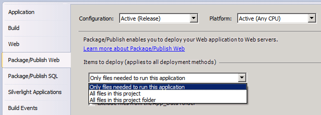
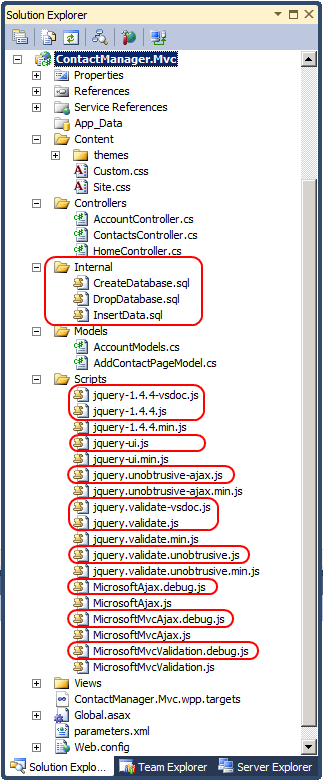

Excluding Files and Folders from Deployment
====================
by [Jason Lee](https://github.com/jrjlee)

[Download PDF](https://msdnshared.blob.core.windows.net/media/MSDNBlogsFS/prod.evol.blogs.msdn.com/CommunityServer.Blogs.Components.WeblogFiles/00/00/00/63/56/8130.DeployingWebAppsInEnterpriseScenarios.pdf)

> This topic describes how you can exclude files and folders from a web deployment package when you build and package a web application project.

This topic forms part of a series of tutorials based around the enterprise deployment requirements of a fictional company named Fabrikam, Inc. This tutorial series uses a sample solution&#x2014;the [Contact Manager solution](../web-deployment-in-the-enterprise/the-contact-manager-solution.md)&#x2014;to represent a web application with a realistic level of complexity, including an ASP.NET MVC 3 application, a Windows Communication Foundation (WCF) service, and a database project.

The deployment method at the heart of these tutorials is based on the split project file approach described in [Understanding the Project File](../web-deployment-in-the-enterprise/understanding-the-project-file.md), in which the build process is controlled by two project files&#x2014;one containing build instructions that apply to every destination environment, and one containing environment-specific build and deployment settings. At build time, the environment-specific project file is merged into the environment-agnostic project file to form a complete set of build instructions.

## Overview

When you build a web application project in Visual Studio 2010, the Web Publishing Pipeline (WPP) lets you extend this build process by packaging your compiled web application into a deployable web package. You can then use the Internet Information Services (IIS) Web Deployment Tool (Web Deploy) to deploy this web package to a remote IIS web server, or import the web package manually through IIS Manager. This packaging process is explained in [Building and Packaging Web Application Projects](../web-deployment-in-the-enterprise/building-and-packaging-web-application-projects.md).

So how do you control what gets included in your web package? The project settings in Visual Studio, through the underlying project file, provide sufficient control for a lot of scenarios. However, in some cases you may want to tailor the contents of your web package to specific destination environments. For example, you might want to include a folder for log files when you deploy your application to a test environment but exclude the folder when you deploy the application to a staging or production environment. This topic will show you how to do this.

## What Gets Included by Default?

When you configure your web application project properties in Visual Studio, the **Items to deploy** list on the **Package/Publish Web** page lets you specify what you want to include in your web deployment package. By default, this is set to **Only files needed to run this application**.

When you choose **Only files needed to run this application**, the WPP will try to determine which files should be added to the web package. This includes:

- All the build outputs for the project.
- Any files marked with a build action of **Content**.

> [!NOTE]
> The logic that determines which files to include is contained in this file:   
> *%PROGRAMFILES%\MSBuild\Microsoft\VisualStudio\v10.0\Web\ Microsoft.Web.Publishing.OnlyFilesToRunTheApp.targets*

## Excluding Specific Files and Folders

In some cases, you'll want more fine-grained control over which files and folders are deployed. If you know which files you want to exclude ahead of time, and the exclusion applies to all destination environments, you can simply set the **Build Action** of each file to **None**.

**To exclude specific files from deployment**

1. In the **Solution Explorer** window, right-click the file, and then click **Properties**.
2. In the **Properties** window, in the **Build Action** row, select **None**.

However, this approach is not always convenient. For example, you may want to vary which files and folders are included according to your destination environment, and from outside Visual Studio. For example, in the Contact Manager sample solution, take a look at the contents of the ContactManager.Mvc project:

- The Internal folder contains some SQL scripts that the developer uses to create, drop, and populate local databases for development purposes. Nothing in this folder should be deployed to a staging or production environment.
- The Scripts folder contains several JavaScript files. A lot of these files are included purely to support debugging or provide IntelliSense in Visual Studio. Some of these files should not be deployed to staging or production environments. However, you may want to deploy them to a developer test environment to facilitate troubleshooting.

Although you could manipulate your project files to exclude specific files and folders, there is an easier way. The WPP includes a mechanism to exclude files and folders by building item lists named **ExcludeFromPackageFolders** and **ExcludeFromPackageFiles**. You can extend this mechanism by adding your own items to these lists. To do this, you need to complete these high-level steps:

1. Create a custom project file named *[project name].wpp.targets* in the same folder as your project file.

    > [!NOTE]
    > The *.wpp.targets* file needs to go in the same folder as your web application project file&#x2014;for example, *ContactManager.Mvc.csproj*&#x2014;rather than in the same folder as any custom project files you use to control the build and deployment process.
2. In the *.wpp.targets* file, add an **ItemGroup** element.
3. In the **ItemGroup** element, add **ExcludeFromPackageFolders** and **ExcludeFromPackageFiles** items to exclude specific files and folders as required.

This is the basic structure of this *.wpp.targets* file:

[!code-xml[Main](excluding-files-and-folders-from-deployment/samples/sample1.xml)]

Note that each item includes an item metadata element named **FromTarget**. This is an optional value that doesn't affect the build process; it simply serves to indicate why particular files or folders were omitted if someone reviews the build logs.

## Excluding Files and Folders from a Web Package

The next procedure shows you how to add a *.wpp.targets* file to a web application project and how to use the file to exclude specific files and folders from the web package when you build your project.

**To exclude files and folders from a web deployment package**

1. Open your solution in Visual Studio 2010.
2. In the **Solution Explorer** window, right-click your web application project node (for example, **ContactManager.Mvc**), point to **Add**, and then click **New Item**.
3. In the **Add New Item** dialog box, select the **XML File** template.
4. In the **Name** box, type *[project name]***.wpp.targets** (for example, **ContactManager.Mvc.wpp.targets**), and then click **Add**.

    

    > [!NOTE]
    > If you add a new item to the root node of a project, the file is created in the same folder as the project file. You can verify this by opening the folder in Windows Explorer.
5. In the file, add a **Project** element and an **ItemGroup** element:

    [!code-xml[Main](excluding-files-and-folders-from-deployment/samples/sample2.xml)]
6. If you want to exclude folders from the web package, add an **ExcludeFromPackageFolders** element to the **ItemGroup** element:

    1. In the **Include** attribute, provide a semicolon-separated list of the folders you want to exclude.
    2. In the **FromTarget** metadata element, provide a meaningful value to indicate why the folders are being excluded, like the name of the *.wpp.targets* file.

    [!code-xml[Main](excluding-files-and-folders-from-deployment/samples/sample3.xml)]
7. If you want to exclude files from the web package, add an **ExcludeFromPackageFiles** element to the **ItemGroup** element:

    1. In the **Include** attribute, provide a semicolon-separated list of the files you want to exclude.
    2. In the **FromTarget** metadata element, provide a meaningful value to indicate why the files are being excluded, like the name of the *.wpp.targets* file.

    [!code-xml[Main](excluding-files-and-folders-from-deployment/samples/sample4.xml)]
8. The *[project name].wpp.targets* file should now resemble this:

    [!code-xml[Main](excluding-files-and-folders-from-deployment/samples/sample5.xml)]
9. Save and close the *[project name].wpp.targets* file.

The next time you build and package your web application project, the WPP will automatically detect the *.wpp.targets* file. Any files and folders you specified will not be included in the web package.

## Conclusion

This topic described how to exclude specific files and folders when you build a web package, by creating a custom *.wpp.targets* file in the same folder as your web application project file.

## Further Reading

For more information on using custom Microsoft Build Engine (MSBuild) project files to control the deployment process, see [Understanding the Project File](../web-deployment-in-the-enterprise/understanding-the-project-file.md) and [Understanding the Build Process](../web-deployment-in-the-enterprise/understanding-the-build-process.md). For more information on the packaging and deployment process, see [Building and Packaging Web Application Projects](../web-deployment-in-the-enterprise/building-and-packaging-web-application-projects.md), [Configuring Parameters for Web Package Deployment](../web-deployment-in-the-enterprise/configuring-parameters-for-web-package-deployment.md), and [Deploying Web Packages](../web-deployment-in-the-enterprise/deploying-web-packages.md).

>[!div class="step-by-step"]
[Previous](deploying-membership-databases-to-enterprise-environments.md)
[Next](taking-web-applications-offline-with-web-deploy.md)