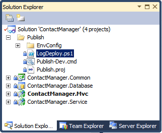

Running Windows PowerShell Scripts from MSBuild Project Files
====================
by [Jason Lee](https://github.com/jrjlee)

[Download PDF](https://msdnshared.blob.core.windows.net/media/MSDNBlogsFS/prod.evol.blogs.msdn.com/CommunityServer.Blogs.Components.WeblogFiles/00/00/00/63/56/8130.DeployingWebAppsInEnterpriseScenarios.pdf)

> This topic describes how to run a Windows PowerShell script as part of a build and deployment process. You can run a script locally (in other words, on the build server) or remotely, like on a destination web server or database server.
> 
> There are lots of reasons why you might want to run a post-deployment Windows PowerShell script. For example, you might want to:
> 
> - Add a custom event source to the registry.
> - Generate a file system directory for uploads.
> - Clean up build directories.
> - Write entries to a custom log file.
> - Send emails inviting users to a newly provisioned web application.
> - Create user accounts with the appropriate permissions.
> - Configure replication between SQL Server instances.
> 
> This topic will show you how to run Windows PowerShell scripts both locally and remotely from a custom target in a Microsoft Build Engine (MSBuild) project file.

This topic forms part of a series of tutorials based around the enterprise deployment requirements of a fictional company named Fabrikam, Inc. This tutorial series uses a sample solution&#x2014;the [Contact Manager solution](../web-deployment-in-the-enterprise/the-contact-manager-solution.md)&#x2014;to represent a web application with a realistic level of complexity, including an ASP.NET MVC 3 application, a Windows Communication Foundation (WCF) service, and a database project.

The deployment method at the heart of these tutorials is based on the split project file approach described in [Understanding the Project File](../web-deployment-in-the-enterprise/understanding-the-project-file.md), in which the build process is controlled by two project files&#x2014;one containing build instructions that apply to every destination environment, and one containing environment-specific build and deployment settings. At build time, the environment-specific project file is merged into the environment-agnostic project file to form a complete set of build instructions.

## Task Overview

To run a Windows PowerShell script as part of an automated or single-step deployment process, you'll need to complete these high-level tasks:

- Add the Windows PowerShell script to your solution and to source control.
- Create a command that invokes your Windows PowerShell script.
- Escape any reserved XML characters in your command.
- Create a target in your custom MSBuild project file and use the **Exec** task to run your command.

This topic will show you how to perform these procedures. The tasks and walkthroughs in this topic assume that you're already familiar with MSBuild targets and properties, and that you understand how to use a custom MSBuild project file to drive a build and deployment process. For more information, see [Understanding the Project File](../web-deployment-in-the-enterprise/understanding-the-project-file.md) and [Understanding the Build Process](../web-deployment-in-the-enterprise/understanding-the-build-process.md).

## Creating and Adding Windows PowerShell Scripts

The tasks in this topic use a sample Windows PowerShell script named **LogDeploy.ps1** to illustrate how to run scripts from MSBuild. The **LogDeploy.ps1** script contains a simple function that writes a single-line entry to a log file:

[!code-javascript[Main](running-windows-powershell-scripts-from-msbuild-project-files/samples/sample1.js)]

The **LogDeploy.ps1** script accepts two parameters. The first parameter represents the full path to the log file to which you want to add an entry, and the second parameter represents the deployment destination that you want to record in the log file. When you run the script, it adds a line to the log file in this format:

[!code-html[Main](running-windows-powershell-scripts-from-msbuild-project-files/samples/sample2.html)]

To make the **LogDeploy.ps1** script available to MSBuild, you need to:

- Add the script to source control.
- Add the script to your solution in Visual Studio 2010.

You don't need to deploy the script with your solution content, regardless of whether you plan to run the script on the build server or on a remote computer. One option is to add the script to a solution folder. In the Contact Manager example, because you want to use the Windows PowerShell script as part of the deployment process, it makes sense to add the script to the Publish solution folder.

The contents of solution folders are copied to build servers as source material. However, they form no part of any project output.

## Executing a Windows PowerShell Script on the Build Server

In some scenarios, you may want to run Windows PowerShell scripts on the computer that builds your projects. For example, you might use a Windows PowerShell script to clean up build folders or write entries to a custom log file.

In terms of syntax, running a Windows PowerShell script from an MSBuild project file is the same as running a Windows PowerShell script from a regular command prompt. You need to invoke the powershell.exe executable and use the **–command** switch to provide the commands you want Windows PowerShell to run. (In Windows PowerShell v2, you can also use the **–file** switch). The command should take this format:

[!code-console[Main](running-windows-powershell-scripts-from-msbuild-project-files/samples/sample3.cmd)]

For example:

[!code-console[Main](running-windows-powershell-scripts-from-msbuild-project-files/samples/sample4.cmd)]

If the path to your script includes spaces, you need to enclose the file path in single quotes preceded by an ampersand. You can't use double quotes, because you've already used them to enclose the command:

[!code-console[Main](running-windows-powershell-scripts-from-msbuild-project-files/samples/sample5.cmd)]

There are a few additional considerations when you invoke this command from MSBuild. First, you should include the **–NonInteractive** flag to ensure that the script executes quietly. Next, you should include the **–ExecutionPolicy** flag with an appropriate argument value. This specifies the execution policy that Windows PowerShell will apply to your script and allows you to override the default execution policy, which may prevent execution of your script. You can choose from these argument values:

- A value of **Unrestricted** will allow Windows PowerShell to execute your script, regardless of whether the script is signed.
- A value of **RemoteSigned** will allow Windows PowerShell to execute unsigned scripts that were created on the local machine. However, scripts that were created elsewhere must be signed. (In practice, you're very unlikely to have created a Windows PowerShell script locally on a build server).
- A value of **AllSigned** will allow Windows PowerShell to execute signed scripts only.

The default execution policy is **Restricted**, which prevents Windows PowerShell from running any script files.

Finally, you need to escape any reserved XML characters that occur in your Windows PowerShell command:

- Replace single quotes with **&amp;apos;**
- Replace double quotes with **&amp;quot;**
- Replace ampersands with **&amp;amp;**

- When you make these changes, your command will resemble this:

[!code-console[Main](running-windows-powershell-scripts-from-msbuild-project-files/samples/sample6.cmd)]

Within your custom MSBuild project file, you can create a new target and use the **Exec** task to run this command:

[!code-xml[Main](running-windows-powershell-scripts-from-msbuild-project-files/samples/sample7.xml)]

In this example, note that:

- Any variables, like parameter values and the location of the Windows PowerShell executable, are declared as MSBuild properties.
- Conditions are included to enable users to override these values from the command line.
- The **MSDeployComputerName** property is declared elsewhere in the project file.

When you execute this target as part of your build process, Windows PowerShell will run your command and write a log entry to the file you specified.

## Executing a Windows PowerShell Script on a Remote Computer

Windows PowerShell is capable of running scripts on remote computers through [Windows Remote Management](https://msdn.microsoft.com/en-us/library/windows/desktop/aa384426.aspx) (WinRM). To do this, you need to use the [Invoke-Command](https://technet.microsoft.com/en-us/library/dd347578.aspx) cmdlet. This lets you execute your script against one or more remote computers without copying the script to the remote computers. Any results are returned to the local computer from which you ran the script.

> [!NOTE]
> Before you use the **Invoke-Command** cmdlet to execute Windows PowerShell scripts on a remote computer, you need to configure a WinRM listener to accept remote messages. You can do this by running the command **winrm quickconfig** on the remote computer. For more information, see [Installation and Configuration for Windows Remote Management](https://msdn.microsoft.com/en-us/library/windows/desktop/aa384372(v=vs.85).aspx).

From a Windows PowerShell window, you'd use this syntax to run the **LogDeploy.ps1** script on a remote computer:

[!code-powershell[Main](running-windows-powershell-scripts-from-msbuild-project-files/samples/sample8.ps1)]

> [!NOTE]
> There are various other ways of using **Invoke-Command** to run a script file, but this approach is the most straightforward when you need to provide parameter values and manage paths with spaces.

When you run this from a command prompt, you need to invoke the Windows PowerShell executable and use the **–command** parameter to provide your instructions:

[!code-console[Main](running-windows-powershell-scripts-from-msbuild-project-files/samples/sample9.cmd)]

As before, you need to provide some additional switches and escape any reserved XML characters when you run the command from MSBuild:

[!code-console[Main](running-windows-powershell-scripts-from-msbuild-project-files/samples/sample10.cmd)]

Finally, as before, you can use the **Exec** task within a custom MSBuild target to execute your command:

[!code-xml[Main](running-windows-powershell-scripts-from-msbuild-project-files/samples/sample11.xml)]

When you execute this target as part of your build process, Windows PowerShell will run your script on the computer you specified in the **–computername** argument.

## Conclusion

This topic described how to run a Windows PowerShell script from an MSBuild project file. You can use this approach to run a Windows PowerShell script, either locally or on a remote computer, as part of an automated or single-step build and deployment process.

## Further Reading

For guidance on signing Windows PowerShell scripts and managing execution policies, see [Running Windows PowerShell Scripts](https://technet.microsoft.com/en-us/library/ee176949.aspx). For guidance on running Windows PowerShell commands from a remote computer, see [Running Remote Commands](https://technet.microsoft.com/en-us/library/dd819505.aspx).

For more information on using custom MSBuild project files to control the deployment process, see [Understanding the Project File](../web-deployment-in-the-enterprise/understanding-the-project-file.md) and [Understanding the Build Process](../web-deployment-in-the-enterprise/understanding-the-build-process.md).

>[!div class="step-by-step"]
[Previous](taking-web-applications-offline-with-web-deploy.md)
[Next](troubleshooting-the-packaging-process.md)