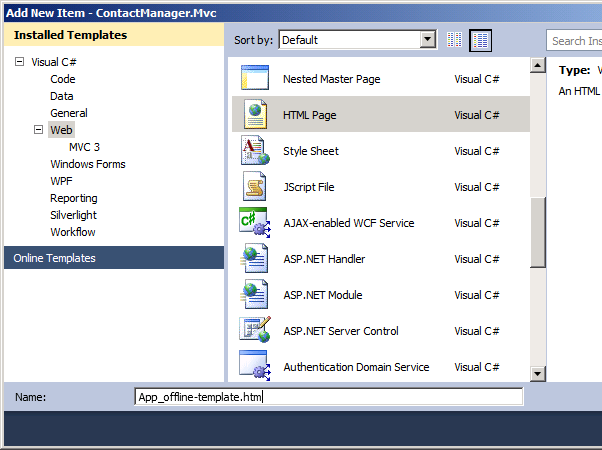
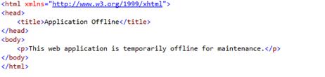
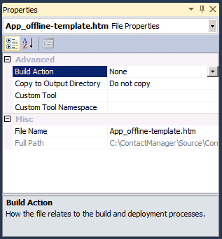

Taking Web Applications Offline with Web Deploy
====================
by [Jason Lee](https://github.com/jrjlee)

[Download PDF](https://msdnshared.blob.core.windows.net/media/MSDNBlogsFS/prod.evol.blogs.msdn.com/CommunityServer.Blogs.Components.WeblogFiles/00/00/00/63/56/8130.DeployingWebAppsInEnterpriseScenarios.pdf)

> This topic describes how to take a web application offline for the duration of an automated deployment using the Internet Information Services (IIS) Web Deployment Tool (Web Deploy). Users who browse to the web application are redirected to an *App\_offline.htm* file until the deployment is complete.

This topic forms part of a series of tutorials based around the enterprise deployment requirements of a fictional company named Fabrikam, Inc. This tutorial series uses a sample solution&#x2014;the [Contact Manager solution](../web-deployment-in-the-enterprise/the-contact-manager-solution.md)&#x2014;to represent a web application with a realistic level of complexity, including an ASP.NET MVC 3 application, a Windows Communication Foundation (WCF) service, and a database project.

The deployment method at the heart of these tutorials is based on the split project file approach described in [Understanding the Project File](../web-deployment-in-the-enterprise/understanding-the-project-file.md), in which the build process is controlled by two project files&#x2014;one containing build instructions that apply to every destination environment, and one containing environment-specific build and deployment settings. At build time, the environment-specific project file is merged into the environment-agnostic project file to form a complete set of build instructions.

## Task Overview

In a lot of scenarios, you'll want to take a web application offline while you make changes to related components, like databases or web services. Typically, in IIS and ASP.NET, you accomplish this by placing a file named *App\_offline.htm* in the root folder of the IIS website or web application. The *App\_offline.htm* file is a standard HTML file and will usually contain a simple message advising the user that the site is temporarily unavailable due to maintenance. While the *App\_offline.htm* file exists in the root folder of the website, IIS will automatically redirect any requests to the file. When you've finished making updates, you remove the *App\_offline.htm* file and the website resumes serving requests as usual.

When you use Web Deploy to perform automated or single-step deployments to a target environment, you may want to incorporate adding and removing the *App\_offline.htm* file into your deployment process. To do this, you'll need to complete these high-level tasks:

- In the Microsoft Build Engine (MSBuild) project file that you use to control the deployment process, create an MSBuild target that copies an *App\_offline.htm* file to the destination server before any deployment tasks begin.
- Add another MSBuild target that removes the *App\_offline.htm* file from the destination server when all deployment tasks are complete.
- In the web application project, create a *.wpp.targets* file that ensures that an *App\_offline.htm* file is added to the deployment package when Web Deploy is invoked.

This topic will show you how to perform these procedures. The tasks and walkthroughs in this topic assume that you've already created a solution that contains at least one web application project, and that you use a custom project file to control the deployment process as described in [Web Deployment in the Enterprise](../web-deployment-in-the-enterprise/web-deployment-in-the-enterprise.md). Alternatively, you can use the [Contact Manager](../web-deployment-in-the-enterprise/the-contact-manager-solution.md) sample solution to follow the examples in the topic.

## Adding an App\_Offline File to a Web Application Project

The first task you need to complete is to add an *App\_offline* file to your web application project:

- To prevent the file from interfering with the development process (you don't want your application to be permanently offline), you should call it something other than *App\_offline.htm*. For example, you could name the file *App\_offline-template.htm*.
- To prevent the file from being deployed as-is, you should set the build action to **None**.

**To add an App\_offline file to a web application project**

1. Open your solution in Visual Studio 2010.
2. In the **Solution Explorer** window, right-click your web application project, point to **Add**, and then click **New Item**.
3. In the **Add New Item** dialog box, select **HTML Page**.
4. In the **Name** box, type **App\_offline-template.htm**, and then click **Add**.

    
5. Add some simple HTML to inform users that the application is unavailable, and then save the file. Do not include any server-side tags (for example, any tags that are prefixed with "asp:"). 

    
6. In the **Solution Explorer** window, right-click the new file, and then click **Properties**.
7. In the **Properties** window, in the **Build Action** row, select **None**.

    

## Deploying and Deleting an App\_Offline File

The next step is to modify your deployment logic to copy the file to the destination server at the start of the deployment process and remove it at the end.

> [!NOTE]
> The next procedure assumes that you're using a custom MSBuild project file to control your deployment process, as described in [Understanding the Project File](../web-deployment-in-the-enterprise/understanding-the-project-file.md). If you're deploying direct from Visual Studio, you'll need to use a different approach. Sayed Ibrahim Hashimi describes one such approach in [How to Take Your Web App Offline During Publishing](http://sedodream.com/2012/01/08/HowToTakeYourWebAppOfflineDuringPublishing.aspx).

To deploy an *App\_offline* file to a destination IIS website, you need to invoke MSDeploy.exe using the [Web Deploy **contentPath** provider](https://technet.microsoft.com/en-us/library/dd569034(WS.10).aspx). The **contentPath** provider supports both physical directory paths and IIS website or application paths, which makes it the ideal choice for synchronizing a file between a Visual Studio project folder and an IIS web application. To deploy the file, your MSDeploy command should resemble this:

[!code-console[Main](taking-web-applications-offline-with-web-deploy/samples/sample1.cmd)]

To remove the file from the destination site at the end of the deployment process, your MSDeploy command should resemble this:

[!code-console[Main](taking-web-applications-offline-with-web-deploy/samples/sample2.cmd)]

To automate these commands as part of a build and deployment process, you need to integrate them into your custom MSBuild project file. The next procedure describes how to do this.

**To deploy and delete an App\_offline file**

1. In Visual Studio 2010, open the MSBuild project file that controls your deployment process. In the [Contact Manager](../web-deployment-in-the-enterprise/the-contact-manager-solution.md) sample solution, this is the *Publish.proj* file.
2. In the root **Project** element, create a new **PropertyGroup** element to store variables for the *App\_offline* deployment:

    [!code-xml[Main](taking-web-applications-offline-with-web-deploy/samples/sample3.xml)]
3. The **SourceRoot** property is defined elsewhere in the *Publish.proj* file. It indicates the location of the root folder for the source content relative to the current path&#x2014;in other words, relative to the location of the *Publish.proj* file.
4. The **contentPath** provider will not accept relative file paths, so you need to get an absolute path to your source file before you can deploy it. You can use the [ConvertToAbsolutePath](https://msdn.microsoft.com/en-us/library/bb882668.aspx) task to do this.
5. Add a new **Target** element named **GetAppOfflineAbsolutePath**. Within this target, use the **ConvertToAbsolutePath** task to get an absolute path to the *App\_offline-template* file in your project folder.

    [!code-xml[Main](taking-web-applications-offline-with-web-deploy/samples/sample4.xml)]
6. This target takes the relative path to the *App\_offline-template* file in your project folder and saves it to a new property as an absolute file path. The **BeforeTargets** attribute specifies that you want this target to execute before the **DeployAppOffline** target, which you'll create in the next step.
7. Add a new target named **DeployAppOffline**. Within this target, invoke the MSDeploy.exe command that deploys your *App\_offline* file to the destination web server.

    [!code-xml[Main](taking-web-applications-offline-with-web-deploy/samples/sample5.xml)]
8. In this example, the **ContactManagerIisPath** property is defined elsewhere in the project file. This is simply an IIS application path, in the form *[IIS Website Name]/[Application Name]*. Including a condition in the target enables users to switch the *App\_offline* deployment on or off by changing a property value or providing a command-line parameter.
9. Add a new target named **DeleteAppOffline**. Within this target, invoke the MSDeploy.exe command that removes your *App\_offline* file from the destination web server.

    [!code-xml[Main](taking-web-applications-offline-with-web-deploy/samples/sample6.xml)]
10. The final task is to invoke these new targets at appropriate points during the execution of your project file. You can do this in various ways. For example, in the *Publish.proj* file, the **FullPublishDependsOn** property specifies a list of targets that must be executed in order when the **FullPublish** default target is invoked.
11. Modify your MSBuild project file to invoke the **DeployAppOffline** and **DeleteAppOffline** targets at appropriate points in the publishing process.

    [!code-xml[Main](taking-web-applications-offline-with-web-deploy/samples/sample7.xml)]

When you run your custom MSBuild project file, the *App\_offline* file will be deployed to the server immediately after a successful build. It will then be deleted from the server once all the deployment tasks are complete.

## Adding an App\_Offline File to Deployment Packages

Depending on how you configure your deployment, any existing content at the destination IIS web application&#x2014;like the *App\_offline.htm* file&#x2014;may be deleted automatically when you deploy a web package to the destination. To ensure that the *App\_offline.htm* file remains in place for the duration of the deployment, you need to include the file within the web deployment package itself in addition to deploying the file directly at the start of the deployment process.

- If you've followed the previous tasks in this topic, you'll have added the *App\_offline.htm* file to your web application project under a different filename (we used *App\_offline-template.htm*) and you'll have set the build action to **None**. These changes are necessary to prevent the file from interfering with development and debugging. As a result, you need to customize the packaging process to ensure that the *App\_offline.htm* file is included in the web deployment package.

The Web Publishing Pipeline (WPP) uses an item list named **FilesForPackagingFromProject** to build a list of files that should be included in the web deployment package. You can customize the contents of your web packages by adding your own items to this list. To do this, you need to complete these high-level steps:

1. Create a custom project file named *[project name].wpp.targets* in the same folder as your project file.

    > [!NOTE]
    > The *.wpp.targets* file needs to go in the same folder as your web application project file&#x2014;for example, *ContactManager.Mvc.csproj*&#x2014;rather than in the same folder as any custom project files you use to control the build and deployment process.
2. In the *.wpp.targets* file, create a new MSBuild target that executes *before* the **CopyAllFilesToSingleFolderForPackage** target. This is the WPP target that builds a list of things to include in the package.
3. In the new target, create an **ItemGroup** element.
4. In the **ItemGroup** element, add a **FilesForPackagingFromProject** item and specify the *App\_offline.htm* file.

The *.wpp.targets* file should resemble this:

[!code-xml[Main](taking-web-applications-offline-with-web-deploy/samples/sample8.xml)]

These are the key points of note in this example:

- The **BeforeTargets** attribute inserts this target into the WPP by specifying that it should be executed immediately before the **CopyAllFilesToSingleFolderForPackage** target.
- The **FilesForPackagingFromProject** item uses the **DestinationRelativePath** metadata value to rename the file from *App\_offline-template.htm* to *App\_offline.htm* as it's added to the list.

The next procedure shows you how to add this *.wpp.targets* file to a web application project.

**To add a .wpp.targets file to a web deployment package**

1. Open your solution in Visual Studio 2010.
2. In the **Solution Explorer** window, right-click your web application project node (for example, **ContactManager.Mvc**), point to **Add**, and then click **New Item**.
3. In the **Add New Item** dialog box, select the **XML File** template.
4. In the **Name** box, type *[project name]***.wpp.targets** (for example, **ContactManager.Mvc.wpp.targets**), and then click **Add**.

    

    > [!NOTE]
    > If you add a new item to the root node of a project, the file is created in the same folder as the project file. You can verify this by opening the folder in Windows Explorer.
5. In the file, add the MSBuild markup described previously.

    [!code-xml[Main](taking-web-applications-offline-with-web-deploy/samples/sample9.xml)]
6. Save and close the *[project name].wpp.targets* file.

The next time you build and package your web application project, the WPP will automatically detect the *.wpp.targets* file. The *App\_offline-template.htm* file will be included in the resulting web deployment package as *App\_offline.htm*.

> [!NOTE]
> If your deployment fails, the *App\_offline.htm* file will remain in place and your application will remain offline. This is typically the desired behavior. To bring your application back online, you can delete the *App\_offline.htm* file from your web server. Alternatively, if you correct any errors and run a successful deployment, the *App\_offline.htm* file will be removed.

## Conclusion

This topic described how to take a web application offline for the duration of a deployment, by publishing an *App\_offline.htm* file to the destination server at the start of the deployment process and removing it at the end. It also covered how to include an *App\_offline.htm* file in a web deployment package.

## Further Reading

For more information on the packaging and deployment process, see [Building and Packaging Web Application Projects](../web-deployment-in-the-enterprise/building-and-packaging-web-application-projects.md), [Configuring Parameters for Web Package Deployment](../web-deployment-in-the-enterprise/configuring-parameters-for-web-package-deployment.md), and [Deploying Web Packages](../web-deployment-in-the-enterprise/deploying-web-packages.md).

If you publish your web applications directly from Visual Studio, rather than using the custom MSBuild project file approach described in these tutorials, you'll need to use a slightly different approach to take your application offline during the publishing process. For more information, see [How to take your web app offline during publishing](https://go.microsoft.com/?linkid=9805135) (blog post).

>[!div class="step-by-step"]
[Previous](excluding-files-and-folders-from-deployment.md)
[Next](running-windows-powershell-scripts-from-msbuild-project-files.md)