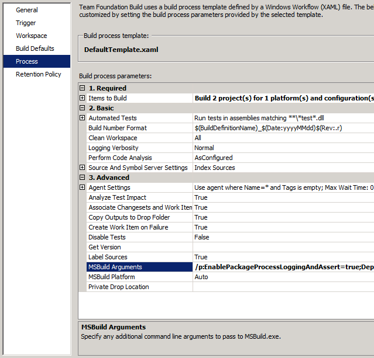
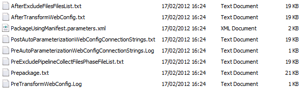

Troubleshooting the Packaging Process
====================
by [Jason Lee](https://github.com/jrjlee)

[Download PDF](https://msdnshared.blob.core.windows.net/media/MSDNBlogsFS/prod.evol.blogs.msdn.com/CommunityServer.Blogs.Components.WeblogFiles/00/00/00/63/56/8130.DeployingWebAppsInEnterpriseScenarios.pdf)

> This topic describes how you can collect detailed information about the packaging process by using the **EnablePackageProcessLoggingAndAssert** property in the Microsoft Build Engine (MSBuild).
> 
> When you set the **EnablePackageProcessLoggingAndAssert** property to **true**, MSBuild will:
> 
> - Add additional information about the packaging process to the build logs.
> - Log errors under certain conditions, for example, if duplicate files are found in the packaging list.
> - Create a Log directory in the *ProjectName*\_Package folder and use it to record information about the files you're packaging.
> 
> If the packaging process is failing, or your web deployment packages don't contain the files that you expect, you can use this information to troubleshoot the process and pinpoint where things are going wrong.
> 
> > [!NOTE]
> > The **EnablePackageProcessLoggingAndAssert** property only works if you build your project using the **Debug** configuration. The property is ignored in other configurations.

This topic forms part of a series of tutorials based around the enterprise deployment requirements of a fictional company named Fabrikam, Inc. This tutorial series uses a sample solution&#x2014;the [Contact Manager solution](../web-deployment-in-the-enterprise/the-contact-manager-solution.md)&#x2014;to represent a web application with a realistic level of complexity, including an ASP.NET MVC 3 application, a Windows Communication Foundation (WCF) service, and a database project.

The deployment method at the heart of these tutorials is based on the split project file approach described in [Understanding the Project File](../web-deployment-in-the-enterprise/understanding-the-project-file.md), in which the build process is controlled by two project files&#x2014;one containing build instructions that apply to every destination environment, and one containing environment-specific build and deployment settings. At build time, the environment-specific project file is merged into the environment-agnostic project file to form a complete set of build instructions.

## Understanding the EnablePackageProcessLoggingAndAssert Property

[Building and Packaging Web Application Projects](../web-deployment-in-the-enterprise/building-and-packaging-web-application-projects.md) described how the Web Publishing Pipeline (WPP) provides a set of MSBuild targets that extend the functionality of MSBuild and enable it to integrate with the Internet Information Services (IIS) Web Deployment Tool (Web Deploy). When you package a web application project, you're invoking WPP targets.

Lots of these WPP targets include conditional logic that logs additional information when the **EnablePackageProcessLoggingAndAssert** property is set to **true**. For example, if you review the **Package** target, you can see that it creates an additional log directory and writes a list of files to a text file if **EnablePackageProcessLoggingAndAssert** is equal to **true**.

[!code-xml[Main](troubleshooting-the-packaging-process/samples/sample1.xml)]

> [!NOTE]
> The WPP targets are defined in the *Microsoft.Web.Publishing.targets* file in the %PROGRAMFILES(x86)%\MSBuild\Microsoft\VisualStudio\v10.0\Web folder. You can open this file and review the targets in Visual Studio 2010 or any XML editor. Take care not to modify the contents of the file.

## Enabling the Additional Logging

You can supply a value for the **EnablePackageProcessLoggingAndAssert** property in various ways, depending on how you build your project.

If you build your project from the command line, you can supply a value for the **EnablePackageProcessLoggingAndAssert** property as a command-line argument:

[!code-console[Main](troubleshooting-the-packaging-process/samples/sample2.cmd)]

If you're using a custom project file to build your projects, you can include the **EnablePackageProcessLoggingAndAssert** value in the **Properties** attribute of the **MSBuild** task:

[!code-xml[Main](troubleshooting-the-packaging-process/samples/sample3.xml)]

If you're using a Team Foundation Server (TFS) build definition to build your projects, you can supply a value for the **EnablePackageProcessLoggingAndAssert** property in the **MSBuild Arguments** row:

> [!NOTE]
> For more information on creating and configuring build definitions, see [Creating a Build Definition That Supports Deployment](../configuring-team-foundation-server-for-web-deployment/creating-a-build-definition-that-supports-deployment.md).

Alternatively, if you want to include the package in every build, you can modify the project file for your web application project to set the **EnablePackageProcessLoggingAndAssert** property to **true**. You should add the property to the first **PropertyGroup** element within your .csproj or .vbproj file.

[!code-xml[Main](troubleshooting-the-packaging-process/samples/sample4.xml)]

## Reviewing the Log Files

When you build and package a web application project with **EnablePackageProcessLoggingAndAssert** set to **true**, MSBuild creates an additional folder named Log in the *ProjectName*\_Package folder. The Log folder contains various files:

The list of files that you see will vary according to the things in your project and your build process. However, these files are typically used to record the list of files that the WPP is collecting for packaging, at various stages of the process:

- The *PreExcludePipelineCollectFilesPhaseFileList.txt* file lists the files that MSBuild collects for packaging before any files that are specified for exclusion are removed.
- The *AfterExcludeFilesFilesList.txt* file contains the modified file list after any files that are specified for exclusion are removed.

    > [!NOTE]
    > For more information on excluding files and folders from the packaging process, see [Excluding Files and Folders from Deployment](excluding-files-and-folders-from-deployment.md).
- The *AfterTransformWebConfig.txt* file lists the files collected for packaging after any *Web.config* transforms have been performed. In this list, any configuration-specific *Web.config* transform files, like *Web.Debug.config* and *Web.Release.config*, are excluded from the list of files for packaging. A single transformed *Web.config* is included in their place.
- The *PostAutoParameterizationWebConfigConnectionStrings.txt* file contains the list of files after the connection strings in the *Web.config* file have been parameterized. This is the process that lets you replace your connection strings with the right settings for your target environment when you deploy the package.
- The *Prepackage.txt* file contains the finalized pre-build list of files to be included in the package.

> [!NOTE]
> The names of the additional log files typically correspond to WPP targets. You can review these targets by examining the *Microsoft.Web.Publishing.targets* file in the %PROGRAMFILES(x86)%\MSBuild\Microsoft\VisualStudio\v10.0\Web folder.

If the contents of your web package aren't what you expected, reviewing these files can be a useful way to identify at what point in the process things went wrong.

## Conclusion

This topic described how you can use the **EnablePackageProcessLoggingAndAssert** property in MSBuild to troubleshoot the packaging process. It explained the different ways in which you can supply the property value to the build process, and it described the additional information that is recorded when you set the property to **true**.

## Further Reading

For more information on using custom MSBuild project files to control the deployment process, see [Understanding the Project File](../web-deployment-in-the-enterprise/understanding-the-project-file.md) and [Understanding the Build Process](../web-deployment-in-the-enterprise/understanding-the-build-process.md). For more information on the WPP and how it manages the packaging process, see [Building and Packaging Web Application Projects](../web-deployment-in-the-enterprise/building-and-packaging-web-application-projects.md). For guidance on how to exclude specific files and folders from web deployment packages, see [Excluding Files and Folders from Deployment](excluding-files-and-folders-from-deployment.md).

>[!div class="step-by-step"]
[Previous](running-windows-powershell-scripts-from-msbuild-project-files.md)