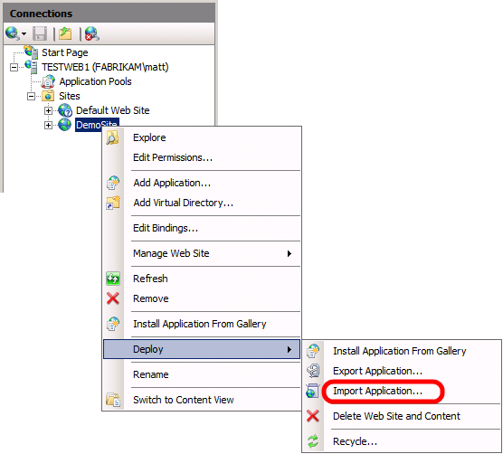

Choosing the Right Approach to Web Deployment
====================
by [Jason Lee](https://github.com/jrjlee)

[Download PDF](https://msdnshared.blob.core.windows.net/media/MSDNBlogsFS/prod.evol.blogs.msdn.com/CommunityServer.Blogs.Components.WeblogFiles/00/00/00/63/56/8130.DeployingWebAppsInEnterpriseScenarios.pdf)

> When you work with the Internet Information Services (IIS) Web Deployment Tool (Web Deploy) 2.0 or later, there are three main approaches you can use to get your packaged web applications onto a web server. You can either:
> 
> - Deploy the application from a remote location by targeting the *Web Deployment Agent Service* (also known as the "remote agent") on the destination server.
> - Deploy the application from a remote location using Web Deploy On Demand (also known as the "temp agent").
> - Deploy the application from a remote location by targeting the *IIS Web Deploy Handler* on the destination server.
> - Deploy the application by manually copying the web package to the destination server and importing it through IIS Manager.
> 
> How you configure your destination web servers will depend on which approach to deployment you want to use. This topic will help you decide which approach to deployment is right for you.

This table shows the main advantages and disadvantages of each deployment approach, together with the scenarios that most typically suit each approach.

| Approach | Advantages | Disadvantages | Typical Scenarios |
| --- | --- | --- | --- |
| Remote Agent | It is easy to set up. It is suitable for regular updates to web applications and content. | The user must be an administrator on the target server. the user can't supply alternative credentials. | Development environments. Test environments. |
| Temp Agent | There is no need to install Web Deploy on the target computer. The latest version of Web Deploy is automatically used. | The user must be an administrator on the target server. The user can't supply alternative credentials. | Development environments. Test environments. |
| Web Deploy Handler | Non-administrator users can deploy content. It is suitable for regular updates to web applications and content. | It is a lot more complex to set up. | Staging environments. Intranet production environments. Hosted environments. |
| Offline Deployment | It is very easy to set up. It is suitable for isolated environments. | The server administrator must manually copy and import the web package every time. | Internet-facing production environments. Isolated network environments. |
  

## Using the Remote Agent

When you install Web Deploy using the default settings on a destination server, the Web Deployment Agent Service (the "remote agent") is automatically installed and started. By default, the remote agent exposes an HTTP endpoint at this address:

[!code-console[Main](choosing-the-right-approach-to-web-deployment/samples/sample1.cmd)]

> [!NOTE]
> You can replace [*server*] with the machine name of your web server, an IP address for your web server, or a hostname that resolves to your web server.

Server administrators can deploy web packages from a remote location, like a developer machine or a build server, by specifying this endpoint address. For example, suppose Matt Hink at Fabrikam, Inc. has built the ContactManager.Mvc web application project on his developer machine. The build process generates a web package, together with a *.deploy.cmd* file that contains the Web Deploy commands required to install the package. If Matt is a server administrator on the TESTWEB1 server, he can deploy the web application to the test web server by running this command on his developer machine:

[!code-console[Main](choosing-the-right-approach-to-web-deployment/samples/sample2.cmd)]

In actual fact, the Web Deploy executable can infer the endpoint address of the remote agent if you provide the machine name, so Matt only needs to type this:

[!code-console[Main](choosing-the-right-approach-to-web-deployment/samples/sample3.cmd)]

> [!NOTE]
> For more information on Web Deploy command-line syntax and *.deploy.cmd* files, see [How to: Install a Deployment Package Using the deploy.cmd File](https://msdn.microsoft.com/en-us/library/ff356104.aspx).

The remote agent offers a straightforward way to deploy content from a remote location, and this approach can work well with one-click or automated deployment. However, the user who runs the deployment command must also be either a domain administrator or a member of the local administrators group on the destination server. In addition, the remote agent doesn't support basic authentication, so you can't pass alternative credentials on the command line.

The remote agent provides a useful approach to deployment in development or test scenarios, where it's not uncommon for developers to have full administrator control over a test server environment, and applications are typically rebuilt and redeployed very frequently. However, this approach is usually less acceptable for staging or production environments.

For an end-to-end example of a scenario that uses the remote agent approach, see [Scenario: Configuring a Test Environment for Web Deployment](scenario-configuring-a-test-environment-for-web-deployment.md).

## Using the Temp Agent

The temp agent approach to deployment is similar to the remote agent approach. However, in contrast to the remote agent approach, you don't need to install Web Deploy on the destination web server. Instead, when you perform the deployment, Web Deploy will install a temporary version of the web deployment agent service on the destination server and will use this to deploy your content to IIS. When the deployment is complete, all temporary files are removed.

If you want to use the temp agent provider setting, add the **/g** flag to your deployment command:

[!code-console[Main](choosing-the-right-approach-to-web-deployment/samples/sample4.cmd)]

> [!NOTE]
> You can't use the temp agent if the web deployment agent service is installed on the destination computer, even if the service is not running.

The advantage of this approach is that you don't need to maintain installations of Web Deploy on your destination servers. Furthermore, you don't need to ensure that the source and destination computers are running the same version of Web Deploy. However, this approach suffers from the same principal limitations as the remote agent approach, namely that you must be a local administrator on the destination server in order to deploy content, and only NTLM authentication is supported. The temp agent approach also requires a lot more initial configuration of the destination environment.

For more information on using the temp agent, see [How to: Install a Deployment Package Using the deploy.cmd File](https://msdn.microsoft.com/en-us/library/ff356104.aspx) and [Web Deploy On Demand](https://technet.microsoft.com/en-us/library/ee517345(WS.10).aspx).

## Using the Web Deploy Handler

For IIS 7 onwards, Web Deploy offers an alternative deployment approach through the IIS Web Deploy Handler. The Web Deploy Handler is closely integrated with the IIS Web Management Service (WMSvc), which is designed to allow users to manage IIS websites from remote locations.

By default, the remote agent exposes an HTTP endpoint at this address:

[!code-console[Main](choosing-the-right-approach-to-web-deployment/samples/sample5.cmd)]

> [!NOTE]
> You can replace [*server*] with the machine name of your web server, an IP address for your web server, or a hostname that resolves to your web server.

The big advantage of the Web Deploy Handler over the remote agent, and the temp agent, is that you can configure IIS to allow non-administrator users to deploy applications and content to specific IIS websites. The Web Deploy Handler also supports basic authentication, so you can provide alternative credentials as parameters in your Web Deploy commands. The major drawback is that the Web Deploy Handler is initially a lot more complicated to set up and configure.

In the case of non-administrator users, the Web Management Service (WMSvc) will only allow the user to connect to IIS using a site-level connection, rather than a server-level connection. To access a particular site, you can include a site-specific query string in the endpoint address:

[!code-console[Main](choosing-the-right-approach-to-web-deployment/samples/sample6.cmd)]

For example, suppose a build process is configured to automatically deploy a web application to a staging environment after every successful build. If you used the remote agent approach, you'd need to make the build process identity an administrator on your destination servers. In contrast, using the Web Deploy Handler approach you can give a non-administrator user&#x2014;**FABRIKAM\stagingdeployer** in this case&#x2014;permission to a specific IIS website only, and the build process can provide these credentials to deploy the web package.

[!code-console[Main](choosing-the-right-approach-to-web-deployment/samples/sample7.cmd)]

> [!NOTE]
> For more information on Web Deploy command-line operations and syntax, see [Web Deploy Command Line Reference](https://technet.microsoft.com/en-us/library/dd568991(v=ws.10).aspx). For more information on using the *.deploy.cmd* file, see [How to: Install a Deployment Package Using the deploy.cmd File](https://msdn.microsoft.com/en-us/library/ff356104.aspx).

The Web Deploy Handler provides a useful approach to deployment in staging environments, hosted environments, and intranet-based production environments, where remote access to the server is available but administrator credentials are not.

For an end-to-end example of a scenario that uses the Web Deploy Handler approach, see [Scenario: Configuring a Staging Environment for Web Deployment](scenario-configuring-a-staging-environment-for-web-deployment.md).

## Using Offline Deployment

In some cases, it's not possible or practical to deploy applications and content to an IIS website from a remote location. For example, the source and destination computers may be in isolated networks or network segments, or firewall policy may not permit remote access.

In scenarios like these, you can still use the packaging and publishing capabilities of Web Deploy; you just can't use them from a remote location. Instead, an administrator on the destination server must copy the web package onto the server and import it through IIS Manager.

The offline deployment approach is typically useful in Internet-facing production environments, where servers in a perimeter network may have restricted connectivity with computers in the internal network.

For an end-to-end example of a scenario that uses the offline deployment approach, see [Scenario: Configuring a Production Environment for Web Deployment](scenario-configuring-a-production-environment-for-web-deployment.md).

## Further Reading

For more information on Web Deploy command-line operations and syntax, see [Web Deploy Command Line Reference](https://technet.microsoft.com/en-us/library/dd568991(v=ws.10).aspx). For more information on using the *.deploy.cmd* file, see [How to: Install a Deployment Package Using the deploy.cmd File](https://msdn.microsoft.com/en-us/library/ff356104.aspx).

For more general guidance on the different ways in which you can deploy web packages from a remote computer, see [Using Web Deploy Remotely](https://technet.microsoft.com/en-us/library/ee461175(WS.10).aspx). For more information on using Web Deploy On Demand, see [Web Deploy On Demand](https://technet.microsoft.com/en-us/library/ee517345(WS.10).aspx).

>[!div class="step-by-step"]
[Previous](configuring-server-environments-for-web-deployment.md)
[Next](scenario-configuring-a-test-environment-for-web-deployment.md)