Configuring a Database Server for Web Deploy Publishing
====================
by [Jason Lee](https://github.com/jrjlee)

[Download PDF](https://msdnshared.blob.core.windows.net/media/MSDNBlogsFS/prod.evol.blogs.msdn.com/CommunityServer.Blogs.Components.WeblogFiles/00/00/00/63/56/8130.DeployingWebAppsInEnterpriseScenarios.pdf)

> This topic describes how to configure a SQL Server 2008 R2 database server to support web deployment and publishing.
> 
> The tasks described in this topic are common to every deployment scenario&#x2014;it doesn't matter whether your web servers are configured to use the IIS Web Deployment Tool (Web Deploy) Remote Agent Service, the Web Deploy Handler, or offline deployment or your application is running on a single web server or a server farm. The way you deploy the database may change according to security requirements and other considerations. For example, you might deploy the database with or without sample data, and you might deploy user role mappings or configure them manually after deployment. However, the way you configure the database server remains the same.

You don't have to install any additional products or tools to configuring a database server to support web deployment. Assuming that your database server and your web server run on different machines, you simply need to:

- Permit SQL Server to communicate using TCP/IP.
- Allow SQL Server traffic through any firewalls.
- Give the web server machine account a SQL Server login.
- Map the machine account login to any required database roles.
- Give the account that will run the deployment a SQL Server login and database creator permissions.
- To support repeat deployments, map the deployment account login to the **db\_owner** database role.

This topic will show you how to perform each of these procedures. The tasks and walkthroughs in this topic assume that you're starting with a default instance of SQL Server 2008 R2 running on Windows Server 2008 R2. Before you continue, ensure that:

- Windows Server 2008 R2 Service Pack 1 and all available updates are installed.
- The server is domain-joined.
- The server has a static IP address.
- SQL Server 2008 R2 Service Pack 1 and all available updates are installed.

The SQL Server instance only needs to include the **Database Engine Services** role, which is included automatically in any SQL Server installation. However, for ease of configuration and maintenance, we recommend that you include the **Management Tools – Basic** and **Management Tools – Complete** server roles.

> [!NOTE]
> For more information on joining computers to a domain, see [Joining Computers to the Domain and Logging On](https://technet.microsoft.com/en-us/library/cc725618(v=WS.10).aspx). For more information on configuring static IP addresses, see [Configure a Static IP Address](https://technet.microsoft.com/en-us/library/cc754203(v=ws.10).aspx). For more information on installing SQL Server, see [Installing SQL Server 2008 R2](https://technet.microsoft.com/en-us/library/bb500395.aspx).

## Enable Remote Access to SQL Server

SQL Server uses TCP/IP to communicate with remote computers. If your database server and your web server are on different machines, you need to:

- Configure SQL Server networking settings to allow communication over TCP/IP.
- Configure any hardware or software firewalls to allow TCP traffic (and in some cases User Datagram Protocol (UDP) traffic) on the ports that the SQL Server instance uses.

To enable SQL Server to communicate over TCP/IP, use SQL Server Configuration Manager to change the network configuration for your SQL Server instance.

**To enable SQL Server to communicate using TCP/IP**

1. On the **Start** menu, point to **All Programs**, click **Microsoft SQL Server 2008 R2**, click **Configuration Tools**, and then click **SQL Server Configuration Manager**.
2. In the tree view pane, expand **SQL Server Network Configuration**, and then click **Protocols for MSSQLSERVER**.

    > [!NOTE]
    > If you have installed multiple instances of SQL Server, you'll see a **Protocols for***[instance name]* item for each instance. You need to configure network settings on an instance-by-instance basis.
3. In the details pane, right-click the **TCP/IP** row, and then click **Enable**.

    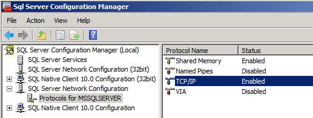
4. In the **Warning** dialog box, click **OK**.

    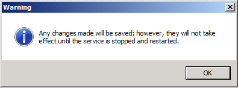
5. You need to restart the MSSQLSERVER service before your new network configuration will take effect. You can do that at a command prompt, from the Services console, or from SQL Server Management Studio. In this procedure, you'll use SQL Server Management Studio.
6. Close SQL Server Configuration Manager.
7. On the **Start** menu, point to **All Programs**, click **Microsoft SQL Server 2008 R2**, and then click **SQL Server Management Studio**.
8. In the **Connect to Server** dialog box, in the **Server name** box, type the name of the database server, and then click **Connect**.

    
9. In the **Object Explorer** pane, right-click the parent server node (for example, **TESTDB1**), and then click **Restart**.

    
10. In the **Microsoft SQL Server Management Studio** dialog box, click **Yes**.

    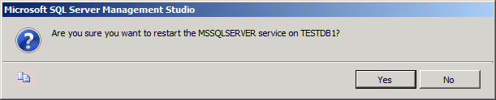
11. When the service has restarted, close SQL Server Management Studio.

To allow SQL Server traffic through a firewall, you first need to know which ports your SQL Server instance is using. This will depend on how the SQL Server instance was created and configured:

- A *default instance* of SQL Server listens for (and responds to) requests on TCP port 1433.
- A *named instance* of SQL Server listens for (and responds to) requests on a dynamically assigned TCP port.
- If the SQL Server Browser service is enabled, clients can query the service on UDP port 1434 to find out which TCP port to use for a particular SQL Server instance. However, this service is often disabled for security reasons.

Assuming that you're using a default instance of SQL Server, you need to configure your firewall to allow traffic.

| Direction | From Port | To Port | Port Type |
| --- | --- | --- | --- |
| Inbound | Any | 1433 | TCP |
| Outbound | 1433 | Any | TCP |
  

> [!NOTE]
> Technically, a client computer will use a randomly assigned TCP port between 1024 and 5000 to communicate with SQL Server, and you can restrict your firewall rules accordingly. For more information on SQL Server ports and firewalls, see [TCP/IP port numbers required to communicate to SQL over a firewall](https://go.microsoft.com/?linkid=9805125) and [How to: Configure a Server to Listen on a Specific TCP Port (SQL Server Configuration Manager)](https://msdn.microsoft.com/en-us/library/ms177440.aspx).

In most Windows Server environments, you'll likely have to configure Windows Firewall on the database server. By default, Windows Firewall allows all outbound traffic unless a rule specifically prohibits it. To enable your web server to reach your database, you need to configure an inbound rule that allows TCP traffic on the port number that the SQL Server instance uses. If you're using a default instance of SQL Server, you can use the next procedure to configure this rule.

**To configure Windows Firewall to allow communication with a default SQL Server instance**

1. On the database server, on the **Start** menu, point to **Administrative Tools**, and then click **Windows Firewall with Advanced Security**.
2. In the tree view pane, click **Inbound Rules**.

    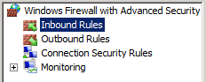
3. In the **Actions** pane, under **Inbound Rules**, click **New Rule**.
4. In the New Inbound Rule Wizard, on the **Rule Type** page, select **Port**, and then click **Next**.

    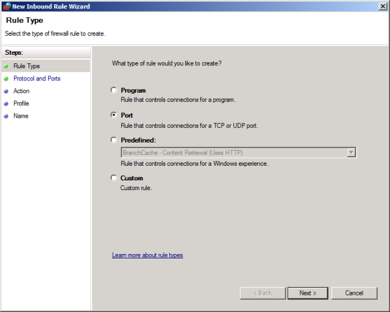
5. On the **Protocol and Ports** page, ensure that **TCP** is selected, and in the **Specific local ports** box, type **1433**, and then click **Next**.

    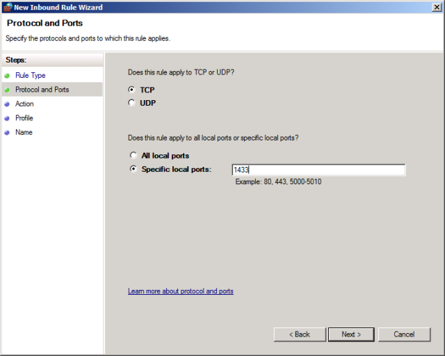
6. On the **Action** page, leave **Allow the connection** selected and click **Next**.
7. On the **Profile** page, leave **Domain** selected, clear the **Private** and **Public** check boxes, and then click **Next**.

    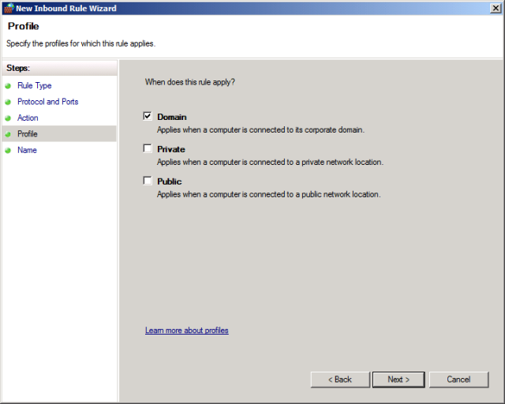
8. On the **Name** page, give the rule a suitably descriptive name (for example, **SQL Server default instance – network access**), and then click **Finish**.

For more information on configuring Windows Firewall for SQL Server, particularly if you need to communicate with SQL Server over non-standard or dynamic ports, see [How to: Configure a Windows Firewall for Database Engine Access](https://technet.microsoft.com/en-us/library/ms175043.aspx).

## Configure Logins and Database Permissions

When you deploy a web application to Internet Information Services (IIS), the application runs using the identity of the application pool. In a domain environment, application pool identities use the machine account of the server on which they run to access network resources. Machine accounts take the form *[domain name]***\***[machine name]***$**&#x2014;for example, **FABRIKAM\TESTWEB1$**. To allow your web application to access a database across the network, you need to:

- Add a login for the web server machine account to the SQL Server instance.
- Map the machine account login to any required database roles (typically **db\_datareader** and **db\_datawriter**).

If your web application is running on a server farm, rather than a single server, you'll need to repeat these procedures for every web server in the server farm.

> [!NOTE]
> For more information on application pool identities and accessing network resources, see [Application Pool Identities](https://go.microsoft.com/?linkid=9805123).

You can approach these tasks in various ways. To create the login, you can either:

- Create the login manually on the database server, using Transact-SQL or SQL Server Management Studio.
- Use a SQL Server 2008 Server Project in Visual Studio to create and deploy the login.

A SQL Server login is a server-level object, rather than a database-level object, so it's not dependent on the database you want to deploy. As such, you can create the login at any point, and the easiest approach is often to create the login manually on the database server before you start deploying databases. You can use the next procedure to create a login in SQL Server Management Studio.

**To create a SQL Server login for the web server machine account**

1. On the database server, on the **Start** menu, point to **All Programs**, click **Microsoft SQL Server 2008 R2**, and then click **SQL Server Management Studio**.
2. In the **Connect to Server** dialog box, in the **Server name** box, type the name of the database server, and then click **Connect**.

    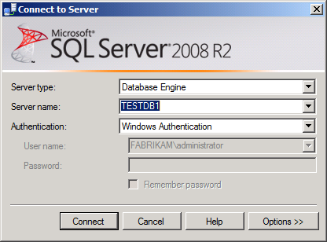
3. In the **Object Explorer** pane, right-click **Security**, point to **New**, and then click **Login**.
4. In the **Login – New** dialog box, in the **Login name** box, type the name of your web server machine account (for example, **FABRIKAM\TESTWEB1$**).

    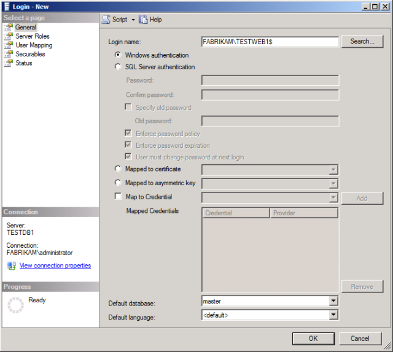
5. Click **OK**.

At this point, your database server is ready for Web Deploy publishing. However, any solutions you deploy won't work until you map the machine account login to the required database roles. Mapping the login to database roles requires a lot more thought, as you can't map roles until after you've deployed the database. To map the machine account login to the required database roles, you can either:

- Assign the database roles to the login manually, after you've deployed the database for the first time.
- Use a post-deployment script to assign the database roles to the login.

For more information on automating the creation of logins and database role mappings, see [Deploying Database Role Memberships to Test Environments](../advanced-enterprise-web-deployment/deploying-database-role-memberships-to-test-environments.md). Alternatively, you can use the next procedure to map the machine account login to the required database roles manually. Remember that you can't perform this procedure until *after* you've deployed the database.

**To map database roles to the web server machine account login**

1. Open SQL Server Management Studio as before.
2. In the **Object Explorer** pane, expand the **Security** node, expand the **Logins** node, and then double-click the machine account login (for example, **FABRIKAM\TESTWEB1$**).

    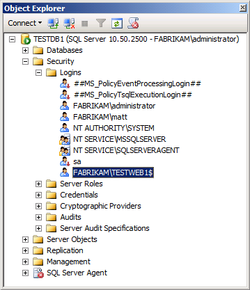
3. In the **Login Properties** dialog box, click **User Mapping**.
4. In the **Users mapped to this login** table, select the name of your database (for example, **ContactManager**).
5. In the **Database role membership for:** *[database name]* list, select the permissions required. In the case of the Contact Manager sample solution, you must select the **db\_datareader** and **db\_datawriter** roles.

    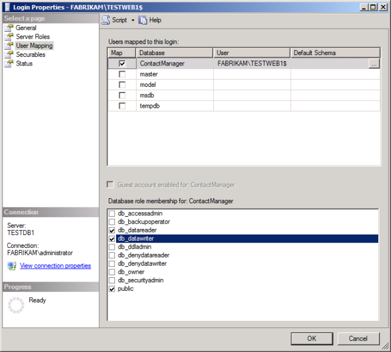
6. Click **OK**.

While manually mapping database roles is often more than adequate for test environments, it's less desirable for automated or one-click deployments to staging or production environments. You can find more information on automating this kind of task using post-deployment scripts in [Deploying Database Role Memberships to Test Environments](../advanced-enterprise-web-deployment/deploying-database-role-memberships-to-test-environments.md).

> [!NOTE]
> For more information on server projects and database projects, see [Visual Studio 2010 SQL Server Database Projects](https://msdn.microsoft.com/en-us/library/ff678491.aspx).

## Configure Permissions for the Deployment Account

If the account that you'll use to run the deployment is not a SQL Server administrator, you'll also need to create a login for this account. In order to create the database, the account must be a member of the **dbcreator** server role or have equivalent permissions.

> [!NOTE]
> When you use Web Deploy or VSDBCMD to deploy a database, you can use Windows credentials or SQL Server credentials (if your SQL Server instance is configured to support mixed mode authentication). The next procedure assumes that you want to use Windows credentials, but there's nothing stopping you from specifying a SQL Server user name and password in your connection string when you configure the deployment.

**To set up permissions for the deployment account**

1. Open SQL Server Management Studio as before.
2. In the **Object Explorer** pane, right-click **Security**, point to **New**, and then click **Login**.
3. In the **Login – New** dialog box, in the **Login name** box, type the name of your deployment account (for example, **FABRIKAM\matt**).
4. In the **Select a page** pane, click **Server Roles**.
5. Select **dbcreator**, and then click **OK**.

    

To support subsequent deployments, you'll also need to add the deploying account to the **db\_owner** role on the database after the first deployment. This is because on subsequent deployments you're modifying the schema of an existing database, rather than creating a new database. As described in the previous section, you can't add a user to a database role until you've created the database, for obvious reasons.

**To map the deployment account login to the db\_owner database role**

1. Open SQL Server Management Studio as before.
2. In the **Object Explorer** window, expand the **Security** node, expand the **Logins** node, and then double-click the machine account login (for example, **FABRIKAM\matt**).
3. In the **Login Properties** dialog box, click **User Mapping**.
4. In the **Users mapped to this login** table, select the name of your database (for example, **ContactManager**).
5. In the **Database role membership for:** *[database name]* list, select the **db\_owner** role.

    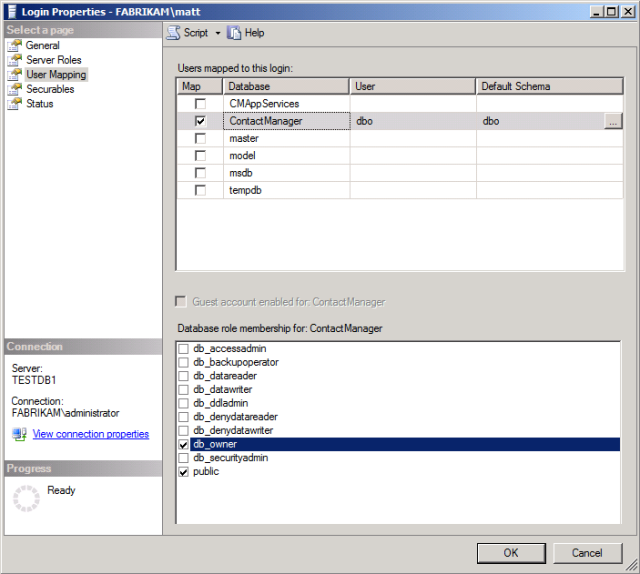
6. Click **OK**.

## Conclusion

Your database server should now be ready to accept remote database deployments and to allow remote IIS web servers to access your databases. Before you attempt to deploy and use databases, you may want to check these key points:

- Have you configured SQL Server to accept remote TCP/IP connections?
- Have you configured any firewalls to permit SQL Server traffic?
- Have you created a machine account login for every web server that will access SQL Server?
- Does your database deployment include a script to create user role mappings, or do you need to create these manually after you deploy the database for the first time?
- Have you created a login for the deployment account and added it to the **dbcreator** server role?

## Further Reading

For guidance on deploying database projects, see [Deploying Database Projects](../web-deployment-in-the-enterprise/deploying-database-projects.md). For guidance on creating database role memberships by running a post-deployment script, see [Deploying Database Role Memberships to Test Environments](../advanced-enterprise-web-deployment/deploying-database-role-memberships-to-test-environments.md). For guidance on how to meet the unique deployment challenges that membership databases pose, see [Deploying Membership Databases to Enterprise Environments](../advanced-enterprise-web-deployment/deploying-membership-databases-to-enterprise-environments.md).

>[!div class="step-by-step"]
[Previous](configuring-a-web-server-for-web-deploy-publishing-offline-deployment.md)
[Next](creating-a-server-farm-with-the-web-farm-framework.md)