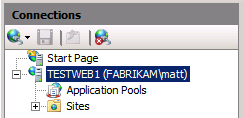
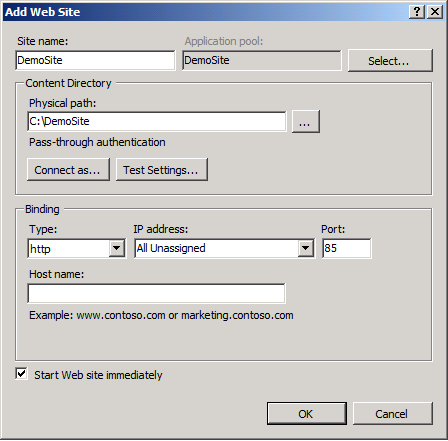
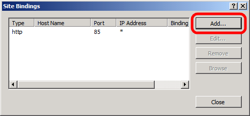
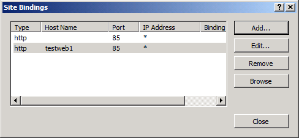
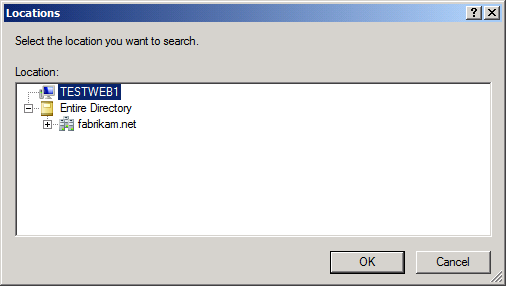
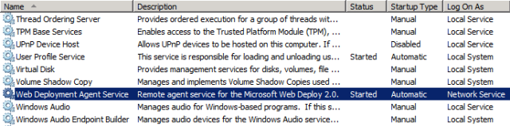

Configuring a Web Server for Web Deploy Publishing (Remote Agent)
====================
by [Jason Lee](https://github.com/jrjlee)

[Download PDF](https://msdnshared.blob.core.windows.net/media/MSDNBlogsFS/prod.evol.blogs.msdn.com/CommunityServer.Blogs.Components.WeblogFiles/00/00/00/63/56/8130.DeployingWebAppsInEnterpriseScenarios.pdf)

> This topic describes how to configure an Internet Information Services (IIS) web server to support web publishing and deployment using the IIS Web Deployment Tool (Web Deploy) Remote Agent Service.
> 
> When you work with Web Deploy 2.0 or later, there are three main approaches you can use to get your applications or sites onto a web server. You can:
> 
> - Use the *Web Deploy Remote Agent Service*. This approach requires less configuration of the web server, but you need to provide the credentials of a local server administrator in order to deploy anything to the server.
> - Use the *Web Deploy Handler*. This approach is a lot more complex and requires more initial effort to set up the web server. However, when you use this approach, you can configure IIS to allow non-administrator users to perform the deployment. The Web Deploy Handler is only available in IIS version 7 or later.
> - Use *offline deployment*. This approach requires the least configuration of the web server, but a server administrator must manually copy the web package onto the server and import it through IIS Manager.
> 
> For more information on the key features, advantages, and disadvantages of these approaches, see [Choosing the Right Approach to Web Deployment](choosing-the-right-approach-to-web-deployment.md).

## Is the Web Deploy Remote Agent the Right Approach for You?

Yes, if the user who will deploy the content can supply the credentials of an administrator on the destination server. This approach is often desirable in these types of scenarios:

- Development or test environments, where the developer has full control over the destination web server and database server.
- Smaller organizations in which a single user or a small group of users has control over the entire application lifecycle.

In lots of larger organizations, and particularly for staging or production environments, it's often not realistic to give users administrator rights on web servers. In the case of hosted web servers, this is especially unlikely to be the case. In addition, if you're planning to automate deployment from a build server, you may not want to use administrator credentials for the deployment process. In these scenarios, configuring your web servers to support deployment using the [Web Deploy Handler](configuring-a-web-server-for-web-deploy-publishing-web-deploy-handler.md) may provide a more satisfactory choice.

## Task Overview

This topic describes how to configure an Internet Information Services (IIS) 7.5 web server to accept and deploy web packages from a remote computer using the Web Deploy Remote Agent approach. You'll need to:

- Install IIS 7.5 and the IIS 7 recommended configuration.
- Install Web Deploy 2.1 or later.
- Create an IIS website to host the deployed content.
- Ensure that the Web Deployment Agent Service is running.

To host the sample solution specifically, you'll also need to:

- Install the .NET Framework 4.0.
- Install ASP.NET MVC 3.

This topic will show you how to perform each of these procedures. The tasks and walkthroughs in this topic assume that you're starting with a clean server build running Windows Server 2008 R2. Before you continue, ensure that:

- Windows Server 2008 R2 Service Pack 1 and all available updates are installed.
- The server is domain-joined.
- The server has a static IP address.

> [!NOTE]
> For more information on joining computers to a domain, see [Joining Computers to the Domain and Logging On](https://technet.microsoft.com/en-us/library/cc725618(v=WS.10).aspx). For more information on configuring static IP addresses, see [Configure a Static IP Address](https://technet.microsoft.com/en-us/library/cc754203(v=ws.10).aspx). The Remote Agent service is supported by IIS 6 onwards and does not require you to be joined to a domain. However, the steps in this tutorial were developed and tested on IIS 7.5 and procedures for other versions may vary.

## Install Products and Components

This section will guide you through installing the required products and components on the web server. Before you begin, a good practice is to run Windows Update to ensure that your server is fully up to date.

In this case, you need to install these things:

- **IIS 7 Recommended Configuration**. This enables the **Web Server (IIS)** role on your web server and installs the set of IIS modules and components that you need in order to host an ASP.NET application.
- **.NET Framework 4.0**. This is required to run applications that were built on this version of the .NET Framework.
- **Web Deployment Tool 2.1 or later**. This installs Web Deploy (and its underlying executable, MSDeploy.exe) on your server. As part of this process, it installs and starts the Web Deployment Agent Service. This service lets you deploy web packages from a remote computer.
- **ASP.NET MVC 3**. This installs the assemblies you need to run MVC 3 applications.

> [!NOTE]
> This walkthrough describes the use of the Web Platform Installer to install and configure the required components. Although you don't have to use the Web Platform Installer, it simplifies the installation process by automatically detecting dependencies and ensuring that you always get the latest product versions. For more information, see [Microsoft Web Platform Installer 3.0](https://go.microsoft.com/?linkid=9805118).

**To install the required products and components**

1. Download and install the [Web Platform Installer](https://go.microsoft.com/?linkid=9805118).
2. When installation is complete, the Web Platform Installer will launch automatically.

    > [!NOTE]
    > You can now launch the Web Platform Installer at any time from the **Start** menu. To do this, on the **Start** menu, click **All Programs**, and then click **Microsoft Web Platform Installer**.
3. At the top of the **Web Platform Installer 3.0** window, click **Products**.
4. On the left side of the window, in the navigation pane, click **Frameworks**.
5. In the **Microsoft .NET Framework 4** row, if the .NET Framework is not already installed, click **Add**.

    > [!NOTE]
    > You may have already installed the .NET Framework 4.0 through Windows Update. If a product or component is already installed, the Web Platform Installer will indicate this by replacing the **Add** button with the text **Installed**.

    
6. In the **ASP.NET MVC 3 (Visual Studio 2010)** row, click **Add**.
7. In the navigation pane, click **Server**.
8. In the **IIS 7 Recommended Configuration** row, click **Add**.
9. In the **Web Deployment Tool 2.1** row, click **Add**.
10. Click **Install**. The Web Platform Installer will show you a list of products&#x2014;together with any associated dependencies&#x2014;to be installed and will prompt you to accept the license terms.

    
11. Review the license terms, and if you consent to the terms, click **I Accept**.
12. When the installation is complete, click **Finish**, and then close the **Web Platform Installer 3.0** window.

If you installed the .NET Framework 4.0 before you installed IIS, you'll need to run the [ASP.NET IIS Registration Tool](https://msdn.microsoft.com/en-us/library/k6h9cz8h(v=VS.100).aspx) (aspnet\_regiis.exe) to register the latest version of ASP.NET with IIS. If you don't do this, you'll find that IIS will serve static content (like HTML files) without any problems, but it will return **HTTP Error 404.0 – Not Found** when you attempt to browse to ASP.NET content. You can use this procedure to ensure that ASP.NET 4.0 is registered.

**To register ASP.NET 4.0 with IIS**

1. Click **Start**, and then type **Command Prompt**.
2. In the search results, right-click **Command Prompt**, and then click **Run as administrator**.
3. In the Command Prompt window, navigate to the **%WINDIR%\Microsoft.NET\Framework\v4.0.30319** directory.
4. Type this command, and then press Enter:

    [!code-console[Main](configuring-a-web-server-for-web-deploy-publishing-remote-agent/samples/sample1.cmd)]
5. If you plan to host 64-bit web applications at any point, you should also register the 64-bit version of ASP.NET with IIS. To do this, in the Command Prompt window, navigate to the **%WINDIR%\Microsoft.NET\Framework64\v4.0.30319** directory.
6. Type this command, and then press Enter:

    [!code-console[Main](configuring-a-web-server-for-web-deploy-publishing-remote-agent/samples/sample2.cmd)]

As a good practice, use Windows Update again at this point to download and install any available updates for the new products and components you've installed.

## Configure the IIS Website

Before you can deploy web content to your server, you need to create and configure an IIS website to host the content. Web Deploy can only deploy web packages to an existing IIS website; it can't create the website for you. At a high level, you'll need to complete these tasks:

- Create a folder on the file system to host your content.
- Create an IIS website to serve the content, and associate it with the local folder.
- Grant read permissions to the application pool identity on the local folder.

Although there's nothing stopping you from deploying content to the default website in IIS, this approach is not recommended for anything other than test or demonstration scenarios. To simulate a production environment, you should create a new IIS website with settings that are specific to the requirements of your application.

**To create and configure an IIS website**

1. On the local file system, create a folder to store your content (for example, **C:\DemoSite**).
2. On the **Start** menu, point to **Administrative Tools**, and then click **Internet Information Services (IIS) Manager**.
3. In IIS Manager, in the **Connections** pane, expand the server node (for example, **TESTWEB1**).

    
4. Right-click the **Sites** node, and then click **Add Web Site**.
5. In the **Site name** box, type a name for the IIS website (for example, **DemoSite**).
6. In the **Physical path** box, type (or browse to) the path to your local folder (for example, **C:\DemoSite**).
7. In the **Port** box, type the port number on which you want to host the website (for example, **85**).

    > [!NOTE]
    > The standard port numbers are 80 for HTTP and 443 for HTTPS. However, if you host this website on port 80, you'll need to stop the default website before you can access your site.
8. Leave the **Host name** box blank, unless you want to configure a Domain Name System (DNS) record for the website, and then click **OK**.

    

    > [!NOTE]
    > In a production environment, you'll likely want to host your website on port 80 and configure a host header, together with matching DNS records. For more information on configuring host headers in IIS 7, see [Configure a Host Header for a Web Site (IIS 7)](https://technet.microsoft.com/en-us/library/cc753195(WS.10).aspx). For more information on the DNS Server role in Windows Server 2008 R2, see [DNS Server Overview](https://technet.microsoft.com/en-gb/library/cc770392.aspx) and [DNS Server](https://technet.microsoft.com/en-us/windowsserver/dd448607).
9. In the **Actions** pane, under **Edit Site**, click **Bindings**.
10. In the **Site Bindings** dialog box, click **Add**.

    
11. In the **Add Site Binding** dialog box, set the **IP address** and **Port** to match your existing site configuration.
12. In the **Host name** box, type the name of your web server (for example, **TESTWEB1**), and then click **OK**.

    

    > [!NOTE]
    > The first site binding allows you to access the site locally using the IP address and port or `http://localhost:85`. The second site binding allows you to access the site from other computers on the domain using the machine name (for example, http://testweb1:85).
13. In the **Site Bindings** dialog box, click **Close**.
14. In the **Connections** pane, click **Application Pools**.
15. In the **Application Pools** pane, right-click the name of your application pool, and then click **Basic Settings**. By default, the name of your application pool will match the name of your website (for example, **DemoSite**).
16. In the **.NET Framework version** list, select **.NET Framework v4.0.30319**, and then click **OK**.

    

    > [!NOTE]
    > The sample solution requires .NET Framework 4.0. This is not a requirement for Web Deploy in general.

In order for your website to serve content, the application pool identity must have read permissions on the local folder that stores the content. In IIS 7.5, application pools run with a unique application pool identity by default (in contrast to previous versions of IIS, where application pools would typically run using the Network Service account). The application pool identity is not a real user account and does not show up on any lists of users or groups&#x2014;instead, it's created dynamically when the application pool is started. Each application pool identity is added to the local **IIS\_IUSRS** security group as a hidden item.

To grant permissions to an application pool identity on a file or folder, you have two options:

- Assign permissions to the application pool identity directly, using the format **IIS AppPool\***[application pool name]*(for example, **IIS AppPool\DemoSite**).
- Assign permissions to the **IIS\_IUSRS** group.

The most common approach is to assign permissions to the local **IIS\_IUSRS** group because this approach lets you change application pools without reconfiguring file system permissions. The next procedure uses this group-based approach.

> [!NOTE]
> For more information on application pool identities in IIS 7.5, see [Application Pool Identities](https://go.microsoft.com/?linkid=9805123).

**To configure folder permissions for an IIS website**

1. In Windows Explorer, browse to the location of your local folder.
2. Right-click the folder, and then click **Properties**.
3. On the **Security** tab, click **Edit**, and then click **Add**.
4. Click **Locations**. In the **Locations** dialog box, select the local server, and then click **OK**.

    
5. In the **Select Users or Groups** dialog box, type **IIS\_IUSRS**, click **Check Names**, and then click **OK**.
6. In the **Permissions for***[folder name]*dialog box, notice that the new group has been assigned the **Read &amp; execute**, **List folder contents**, and **Read** permissions by default. Leave this unchanged and click **OK**.
7. Click **OK** to close the *[folder name]***Properties** dialog box.

As a final task before you attempt to deploy any web packages to your server, you should ensure that the Web Deployment Agent Service is running. When you deploy a package from a remote computer, the Web Deployment Agent Service is responsible for extracting and installing the contents of the package. The service is started by default when you install the Web Deployment Tool and runs under the Network Service identity.

You can check whether a service is running in multiple different ways, using various command-line utilities or Windows PowerShell cmdlets. This procedure describes a straightforward UI-based approach.

**To check that the Web Deployment Agent Service is running**

1. On the **Start** menu, point to **Administrative Tools**, and then click **Services**.
2. Locate the **Web Deployment Agent Service** row, and verify that the **Status** is set to **Started**.

    
3. If the service is not already started, click **Start**.

## Configure Firewall Exceptions

By default, the Remote Agent Service listens on TCP port 80, at this URL:

http://[*server name*]/MSDEPLOYAGENTSERVICE

In most cases, you won't need to configure any additional firewall rules for the Remote Agent Service because web servers typically listen for HTTP requests on port 80. If you customized your installation to listen on a nonstandard port, you'll need to configure firewall exceptions as required.

## Conclusion

At this point, your web server is ready to accept and install web packages from a remote computer. Before you attempt to deploy a web application to the server, you may want to check these key points:

- Have you registered ASP.NET 4.0 with IIS?
- Does the application pool identity have read access to the source folder for your website?
- Is the Web Deployment Agent Service running?

## Further Reading

For guidance on how to configure custom Microsoft Build Engine (MSBuild) project files to deploy web packages to the Remote Agent Service, see [Configuring Deployment Properties for a Target Environment](configuring-deployment-properties-for-a-target-environment.md).

>[!div class="step-by-step"]
[Previous](scenario-configuring-a-production-environment-for-web-deployment.md)
[Next](configuring-a-web-server-for-web-deploy-publishing-web-deploy-handler.md)