Configuring a Web Server for Web Deploy Publishing (Web Deploy Handler)
====================
by [Jason Lee](https://github.com/jrjlee)

[Download PDF](https://msdnshared.blob.core.windows.net/media/MSDNBlogsFS/prod.evol.blogs.msdn.com/CommunityServer.Blogs.Components.WeblogFiles/00/00/00/63/56/8130.DeployingWebAppsInEnterpriseScenarios.pdf)

> This topic describes how to configure an Internet Information Services (IIS) web server to support web publishing and deployment using the IIS Web Deploy Handler.
> 
> When you work with Web Deploy 2.0 or later, there are three main approaches you can use to get your applications or sites onto a web server. You can:
> 
> - Use the *Web Deploy Remote Agent Service*. This approach requires less configuration of the web server, but you need to provide the credentials of a local server administrator in order to deploy anything to the server.
> - Use the *Web Deploy Handler*. This approach is a lot more complex and requires more initial effort to set up the web server. However, when you use this approach, you can configure IIS to allow non-administrator users to perform the deployment. The Web Deploy Handler is only available in IIS version 7 or later.
> - Use *offline deployment*. This approach requires the least configuration of the web server, but a server administrator must manually copy the web package onto the server and import it through IIS Manager.
> 
> For more information on the key features, advantages, and disadvantages of these approaches, see [Choosing the Right Approach to Web Deployment](choosing-the-right-approach-to-web-deployment.md).

Yes, if you want to allow non-administrator users to deploy content to specific IIS websites. This approach is often desirable in these types of scenarios:

- Staging or production environments, where the person or service account that triggers the remote deployment is unlikely to have access to the credentials of a server administrator.
- Hosted environments, where you want to give remote users the ability to update their websites without giving them full control of your web servers (or access to anyone else's websites).

In development or test scenarios, or in smaller organizations, deploying content using server administrator credentials is often less contentious. In these scenarios, configuring your web servers to support deployment using the [Web Deploy Remote Agent Service](configuring-a-web-server-for-web-deploy-publishing-remote-agent.md) offers a more straightforward approach.

## Task Overview

To configure the web server to accept and deploy web packages from a remote computer using the Web Deploy Handler approach, you'll need to:

- Create, or choose, a domain user account (the "non-administrator user") whose credentials you'll use to perform deployments.
- Install IIS 7.5, including the Web Management Service and the Basic Authentication module.
- Install Web Deploy 2.1 or later.
- Configure the Web Management Service to allow remote connections, and start the service.
- Create an IIS website to host the deployed content.
- Grant your non-administrator user permissions on your website in IIS Manager.
- Ensure that the Web Management Service delegation rules permit the service to add and change website content using your non-administrator user account.
- Configure any firewalls to allow incoming connections on port 8172.

To host the ContactManager sample solution specifically, you'll also need to:

- Install the .NET Framework 4.0.
- Install ASP.NET MVC 3.

This topic will show you how to perform each of these procedures. The tasks and walkthroughs in this topic assume that you're starting with a clean server build running Windows Server 2008 R2. Before you continue, ensure that:

- Windows Server 2008 R2 Service Pack 1 and all available updates are installed.
- The server is domain-joined.
- The server has a static IP address.

> [!NOTE]
> For more information on joining computers to a domain, see [Joining Computers to the Domain and Logging On](https://technet.microsoft.com/en-us/library/cc725618(v=WS.10).aspx). For more information on configuring static IP addresses, see [Configure a Static IP Address](https://technet.microsoft.com/en-us/library/cc754203(v=ws.10).aspx).

## Install Products and Components

This section will guide you through installing the required products and components on the web server. Before you begin, a good practice is to run Windows Update to ensure that your server is fully up to date.

In this case, you need to install these things:

- **IIS 7 Recommended Configuration**. This enables the **Web Server (IIS)** role on your web server and installs the set of IIS modules and components that you need in order to host an ASP.NET application.
- **IIS: Management Service**. This installs the Web Management Service (WMSvc) in IIS. This service enables remote management of IIS websites and exposes the Web Deploy Handler endpoint to clients.
- **IIS: Basic Authentication**. This installs the IIS Basic Authentication module. This lets the Web Management Service (WMSvc) authenticate the credentials you provide.
- **Web Deployment Tool 2.1 or later**. This installs Web Deploy (and its underlying executable, MSDeploy.exe) on your server. As part of this process, it installs the Web Deploy Handler and integrates it with the Web Management Service.
- **.NET Framework 4.0**. This is required to run applications that were built on this version of the .NET Framework.
- **ASP.NET MVC 3**. This installs the assemblies you need to run MVC 3 applications.

> [!NOTE]
> This walkthrough describes the use of the Web Platform Installer to install and configure various components. Although you don't have to use the Web Platform Installer, it simplifies the installation process by automatically detecting dependencies and ensuring that you always get the latest product versions. For more information, see [Microsoft Web Platform Installer 3.0](https://go.microsoft.com/?linkid=9805118).

**To install the required products and components**

1. Download and install the [Web Platform Installer](https://go.microsoft.com/?linkid=9805118).
2. When installation is complete, the Web Platform Installer will launch automatically.

    > [!NOTE]
    > You can now launch the Web Platform Installer at any time from the **Start** menu. To do this, on the **Start** menu, click **All Programs**, and then click **Microsoft Web Platform Installer**.
3. At the top of the **Web Platform Installer 3.0** window, click **Products**.
4. On the left side of the window, in the navigation pane, click **Frameworks**.
5. In the **Microsoft .NET Framework 4** row, if the .NET Framework is not already installed, click **Add**.

    > [!NOTE]
    > You may have already installed the .NET Framework 4.0 through Windows Update. If a product or component is already installed, the Web Platform Installer will indicate this by replacing the **Add** button with the text **Installed**.

    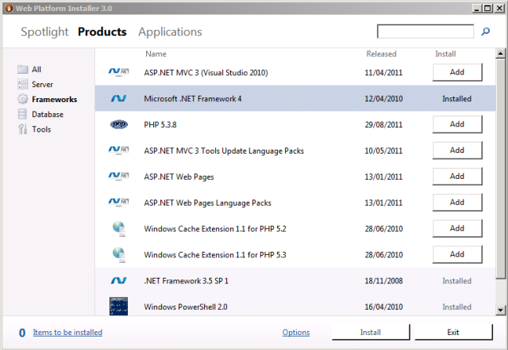
6. In the **ASP.NET MVC 3 (Visual Studio 2010)** row, click **Add**.
7. In the navigation pane, click **Server**.
8. In the **IIS 7 Recommended Configuration** row, click **Add**.
9. In the **Web Deployment Tool 2.1** row, click **Add**.
10. In the **IIS: Basic Authentication** row, click **Add**.
11. In the **IIS: Management Service** row, click **Add**.
12. Click **Install**. The Web Platform Installer will show you a list of products&#x2014;together with any associated dependencies&#x2014;to be installed and will prompt you to accept the license terms.

    
13. Review the license terms, and if you consent to the terms, click **I Accept**.
14. When the installation is complete, click **Finish**, and then close the **Web Platform Installer 3.0** window.

If you installed the .NET Framework 4.0 before you installed IIS, you'll need to run the [ASP.NET IIS Registration Tool](https://msdn.microsoft.com/en-us/library/k6h9cz8h(v=VS.100).aspx) (aspnet\_regiis.exe) to register the latest version of ASP.NET with IIS. If you don't do this, you'll find that IIS will serve static content (like HTML files) without any problems, but it will return **HTTP Error 404.0 – Not Found** when you attempt to browse to ASP.NET content. You can use the next procedure to ensure that ASP.NET 4.0 is registered.

**To register ASP.NET 4.0 with IIS**

1. Click **Start**, and then type **Command Prompt**.
2. In the search results, right-click **Command Prompt**, and then click **Run as administrator**.
3. In the Command Prompt window, navigate to the **%WINDIR%\Microsoft.NET\Framework\v4.0.30319** directory.
4. Type this command, and then press Enter:

    [!code-console[Main](configuring-a-web-server-for-web-deploy-publishing-web-deploy-handler/samples/sample1.cmd)]
5. If you plan to host 64-bit web applications at any point, you should also register the 64-bit version of ASP.NET with IIS. To do this, in the Command Prompt window, navigate to the **%WINDIR%\Microsoft.NET\Framework64\v4.0.30319** directory.
6. Type this command, and then press Enter:

    [!code-console[Main](configuring-a-web-server-for-web-deploy-publishing-web-deploy-handler/samples/sample2.cmd)]

As a good practice, use Windows Update again at this point to download and install any available updates for the new products and components you've installed.

## Configure the Web Management Service

Now that you've installed everything you need, the next step is to configure the Web Management Service in IIS. At a high level, you'll need to complete these tasks:

- Enable basic authentication at the server level.
- Configure the Web Management Service to accept remote connections.
- Start the Web Management Service.
- Check that the required Web Management Service delegation rules are in place.

**To configure the Web Management Service**

1. On the **Start** menu, point to **Administrative Tools**, and then click **Internet Information Services (IIS) Manager**.
2. In IIS Manager, in the **Connections** pane, click the server node (for example, **STAGEWEB1**).

    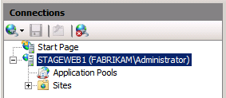
3. In the center pane, under **IIS**, double-click **Authentication**.

    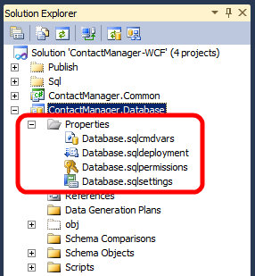
4. Right-click **Basic Authentication**, and then click **Enable**.

    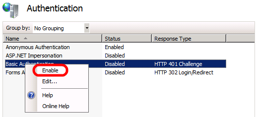
5. In the **Connections** pane, click the server node again to return to the top-level settings.
6. In the center pane, under **Management**, double-click **Management Service**.

    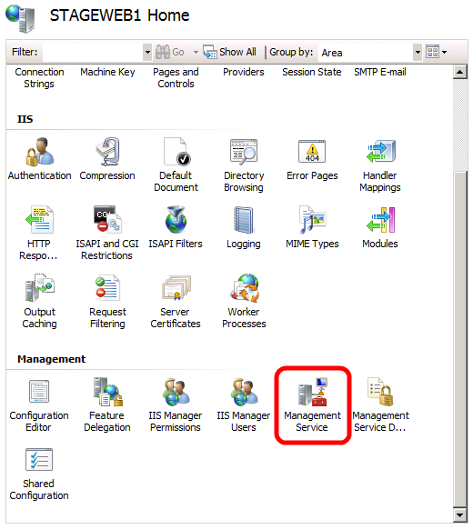
7. In the center pane, select **Enable remote connections**.

    > [!NOTE]
    > If the Web Management Service is already running, you'll need to stop it first.
8. In the **Actions** pane, click **Start** to start the Web Management Service.

    
9. If you're prompted to save your settings, click **Yes**.

    > [!NOTE]
    > You may also want to configure the service to start automatically. To do this, open the Services console, right-click **Web Management Service**, and then click **Properties**. In the **Startup type** dropdown list, select **Automatic**, and then click **OK**.
10. In the **Connections** pane, click the server node again to return to the top-level settings.
11. In the center pane, under **Management**, double-click **Management Service Delegation**.

    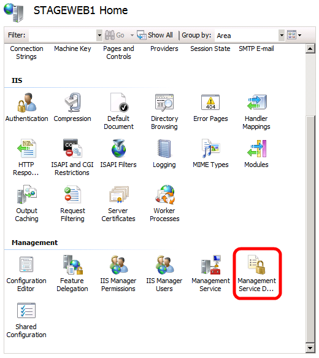
12. Verify that the center pane contains a set of rules.

    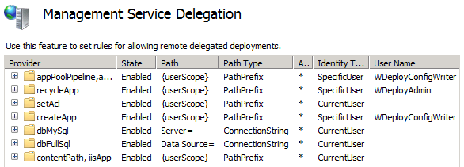

    These rules allow authorized Web Management Service users to use various Web Deploy providers. For example, to deploy web applications and content to IIS through the Web Deploy Handler, there must be a delegation rule that allows all authenticated Web Management Service users to use the **contentPath** and **iisApp** providers (the last rule that you can see in the screenshot).

    If you installed products and components in the order described in this topic, the latest version of Web Deploy should automatically add all the required delegation rules to the Web Management Service. If the Management Service Delegation page does not show any rules, you'll need to create them yourself. For instructions on how to do this, see [Configure the Web Deployment Handler](https://go.microsoft.com/?linkid=9805124).
13. In the **Connections** pane, click the server node again to return to the top-level settings.

## Create and Configure an IIS Website

Before you can deploy web content to your server, you need to create and configure an IIS website to host the content. Web Deploy can only deploy web packages to an existing IIS website; it can't create the website for you. You also need to do a little extra configuration to allow your non-administrator account to deploy content remotely. At a high level, you'll need to complete these tasks:

- Create a folder on the file system to host your content.
- Create an IIS website to serve the content, and associate it with the local folder.
- Grant read permissions to the application pool identity on the local folder.
- Grant the necessary IIS permissions to the domain account that will deploy your web application.

Although there's nothing stopping you from deploying content to the default website in IIS, this approach is not recommended for anything other than test or demonstration scenarios. To simulate a production environment, you should create a new IIS website with settings that are specific to the requirements of your application.

**To create an IIS website**

1. On the local file system, create a folder to store your content (for example, **C:\DemoSite**).
2. On the **Start** menu, point to **Administrative Tools**, and then click **Internet Information Services (IIS) Manager**.
3. In IIS Manager, in the **Connections** pane, expand the server node (for example, **STAGEWEB1**).

    
4. Right-click the **Sites** node, and then click **Add Web Site**.
5. In the **Site name** box, type a name for the IIS website (for example, **DemoSite**).
6. In the **Physical path** box, type (or browse to) the path to your local folder (for example, **C:\DemoSite**).
7. In the **Port** box, type the port number on which you want to host the website (for example, **85**).

    > [!NOTE]
    > The standard port numbers are 80 for HTTP and 443 for HTTPS. However, if you host this website on port 80, you'll need to stop the default website before you can access your site.
8. Leave the **Host name** box blank, unless you want to configure a Domain Name System (DNS) record for the website, and then click **OK**.

    

    > [!NOTE]
    > In a production environment, you'll likely want to host your website on port 80 and configure a host header, together with matching DNS records. For more information on configuring host headers in IIS 7, see [Configure a Host Header for a Web Site (IIS 7)](https://technet.microsoft.com/en-us/library/cc753195(WS.10).aspx). For more information on the DNS Server role in Windows Server 2008 R2, see [DNS Server Overview](https://technet.microsoft.com/en-gb/library/cc770392.aspx) and [DNS Server](https://technet.microsoft.com/en-us/windowsserver/dd448607).
9. In the **Actions** pane, under **Edit Site**, click **Bindings**.
10. In the **Site Bindings** dialog box, click **Add**.

    
11. In the **Add Site Binding** dialog box, set the **IP address** and **Port** to match your existing site configuration.
12. In the **Host name** box, type the name of your web server (for example, **STAGEWEB1**), and then click **OK**.

    

    > [!NOTE]
    > The first site binding allows you to access the site locally using the IP address and port or `http://localhost:85`. The second site binding allows you to access the site from other computers on the domain using the machine name (for example, http://stageweb1:85).
13. In the **Site Bindings** dialog box, click **Close**.
14. In the **Connections** pane, click **Application Pools**.
15. In the **Application Pools** pane, right-click the name of your application pool, and then click **Basic Settings**. By default, the name of your application pool will match the name of your website (for example, **DemoSite**).
16. In the **.NET Framework version** list, select **.NET Framework v4.0.30319**, and then click **OK**.

    

    > [!NOTE]
    > The sample solution requires .NET Framework 4.0. This is not a requirement for Web Deploy in general.

In order for your website to serve content, the application pool identity must have read permissions on the local folder that stores the content. In IIS 7.5, application pools run with a unique application pool identity by default (in contrast to previous versions of IIS, where application pools would typically run using the Network Service account). The application pool identity is not a real user account and does not show up on any lists of users or groups&#x2014;instead, it's created dynamically when the application pool is started. Each application pool identity is added to the local **IIS\_IUSRS** security group as a hidden item.

To grant permissions to an application pool identity on a file or folder, you have two options:

- Assign permissions to the application pool identity directly, using the format **IIS AppPool\***[application pool name]*(for example, **IIS AppPool\DemoSite**).
- Assign permissions to the **IIS\_IUSRS** group.

The most common approach is to assign permissions to the local **IIS\_IUSRS** group, because this approach lets you change application pools without reconfiguring file system permissions. The next procedure uses this group-based approach.

> [!NOTE]
> For more information on application pool identities in IIS 7.5, see [Application Pool Identities](https://go.microsoft.com/?linkid=9805123).

**To configure folder permissions for an IIS website**

1. In Windows Explorer, browse to the location of your local folder.
2. Right-click the folder, and then click **Properties**.
3. On the **Security** tab, click **Edit**, and then click **Add**.
4. Click **Locations**. In the **Locations** dialog box, select the local server, and then click **OK**.

    
5. In the **Select Users or Groups** dialog box, type **IIS\_IUSRS**, click **Check Names**, and then click **OK**.
6. In the **Permissions for***[folder name]* dialog box, notice that the new group has been assigned the **Read &amp; execute**, **List folder contents**, and **Read** permissions by default. Leave this unchanged and click **OK**.
7. Click **OK** to close the *[folder name]***Properties** dialog box.

As a final task, you must grant the appropriate permissions to the non-administrator user whose credentials you'll use to deploy content. This user requires the permissions to deploy content remotely to your website.

**To configure IIS website permissions for a non-administrator domain user**

1. In IIS Manager, in the **Connections** pane, right-click your website node (for example, **DemoSite**), point to **Deploy**, and then click **Configure Web Deploy Publishing**.

    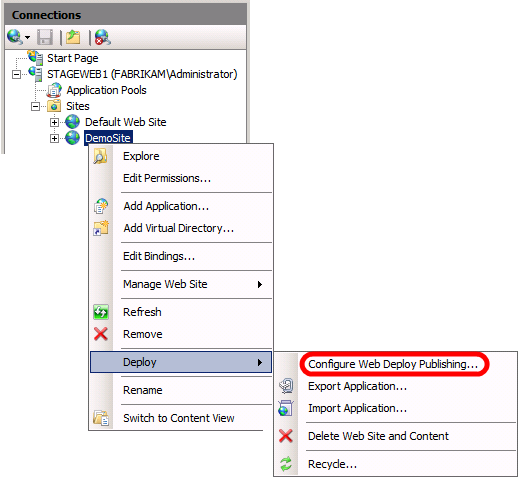
2. In the **Configure Web Deploy Publishing** dialog box, to the right of the **Select a user to give publishing permissions** list, click the ellipsis button.

    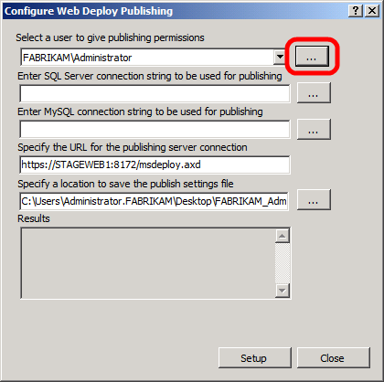
3. In the **Allow User** dialog box, type the domain and user name of the account you want to use to deploy content, and then click **OK**.

    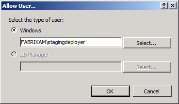
4. In the **Configure Web Deploy Publishing** dialog box, click **Setup**.

    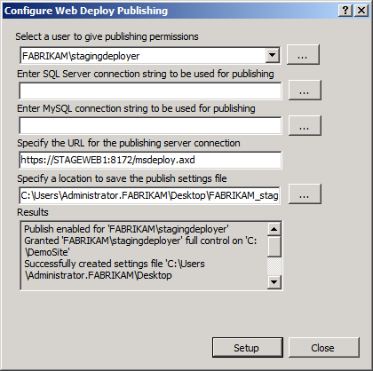

    > [!NOTE]
    > This operation performs two key functions in one step. First, it grants the user permission to modify the website remotely through the Web Management Service, according to the delegation rules you examined in the previous section. Second, it grants the user full control of the source folder for the website, which allows the user to add, modify, and set permissions on the website content.
5. In the **Configure Web Deploy Publishing** dialog box, click **Close**.

## Configure Firewall Exceptions

By default, the IIS Web Management Service listens on TCP port 8172. If Windows Firewall is enabled on your web server, you'll need to create a new inbound rule to allow TCP traffic on port 8172 (all outbound traffic is permitted by default in Windows Firewall). If you use a third-party firewall, you'll need to create rules to allow traffic.

| Direction | From Port | To Port | Port Type |
| --- | --- | --- | --- |
| Inbound | Any | 8172 | TCP |
| Outbound | 8172 | Any | TCP |
  

For more information on configuring rules in Windows Firewall, see [Configuring Firewall Rules](https://technet.microsoft.com/en-us/library/dd448559(WS.10).aspx). For third-party firewalls, please consult your product documentation.

## Conclusion

Your web server should now be ready to accept remote deployments to the Web Deploy Handler through the Web Management Service. Before you attempt to deploy a web application to the server, you may want to check these key points:

- Have you enabled basic authentication at the server level in IIS?
- Have you enabled remote connections to the Web Management Service?
- Have you started the Web Management Service?
- Are there management service delegation rules in place?
- Does the application pool identity have read access to the source folder for your website?
- Does the non-administrator user account have site-level permissions in IIS?
- Does your firewall allow incoming connections to the server on TCP port 8172?

## Further Reading

For guidance on how to configure custom Microsoft Build Engine (MSBuild) project files to deploy web packages to the Web Deploy Handler, see [Configuring Deployment Properties for a Target Environment](configuring-deployment-properties-for-a-target-environment.md).

>[!div class="step-by-step"]
[Previous](configuring-a-web-server-for-web-deploy-publishing-remote-agent.md)
[Next](configuring-a-web-server-for-web-deploy-publishing-offline-deployment.md)