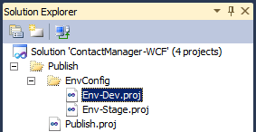

Configuring Deployment Properties for a Target Environment
====================
by [Jason Lee](https://github.com/jrjlee)

[Download PDF](https://msdnshared.blob.core.windows.net/media/MSDNBlogsFS/prod.evol.blogs.msdn.com/CommunityServer.Blogs.Components.WeblogFiles/00/00/00/63/56/8130.DeployingWebAppsInEnterpriseScenarios.pdf)

> This topic describes how to configure environment-specific properties in order to deploy the sample Contact Manager solution to a specific target environment.

This topic forms part of a series of tutorials based around the enterprise deployment requirements of a fictional company named Fabrikam, Inc. This tutorial series uses a sample solution&#x2014;the [Contact Manager](../web-deployment-in-the-enterprise/the-contact-manager-solution.md) solution&#x2014;to represent a web application with a realistic level of complexity, including an ASP.NET MVC 3 application, a Windows Communication Foundation (WCF) service, and a database project.

The deployment method at the heart of these tutorials is based on the split project file approach described in [Understanding the Build Process](../web-deployment-in-the-enterprise/understanding-the-build-process.md), in which the build process is controlled by two project files&#x2014;one containing build instructions that apply to every destination environment, and one containing environment-specific build and deployment settings. At build time, the environment-specific project file is merged into the environment-agnostic project file to form a complete set of build instructions.

## Process Overview

The project file that you'll use to build and deploy the Contact Manager solution is split into two physical files:

- One that contains universal build settings and instructions (the *Publish.proj* file).
- One that contains environment-specific build settings (*Env-Dev.proj*, *Env-Stage.proj*, and so on).

At build time, the appropriate environment-specific project file is merged into the universal *Publish.proj* file to form a complete set of build instructions. You can configure deployment to specific destination environments by creating or customizing environment-specific project files with settings that describe your own deployment scenario.

Lots of these values are determined by how your destination environment is configured&#x2014;in particular, whether your target web server is configured to use the Web Deployment Agent Service (the remote agent) or the Web Deploy Handler. For more information on these approaches, and for guidance on choosing the right approach for your own environment, see [Choosing the Right Approach to Web Deployment](choosing-the-right-approach-to-web-deployment.md).

The [Contact Manager scenario](../deploying-web-applications-in-enterprise-scenarios/enterprise-web-deployment-scenario-overview.md) requires two environment-specific project files:

- Deployment to a developer test environment (*Env-Dev.proj*). The developer test environment is configured to accept remote deployments using the remote agent, as described in [Scenario: Configuring a Test Environment for Web Deployment](scenario-configuring-a-test-environment-for-web-deployment.md). This file needs to provide the remote agent endpoint address as well as location-specific settings like connection strings and service endpoints.
- Deployment to a staging environment (*Env-Stage.proj*). The staging environment is configured to accept remote deployments using the Web Deploy Handler, as described in [Scenario: Configuring a Staging Environment for Web Deployment](scenario-configuring-a-staging-environment-for-web-deployment.md). This file needs to provide the Web Deploy Handler endpoint address as well as location-specific settings like connection strings and service endpoints.

It's important to note that the settings you configure in the environment-specific project file don't affect the contents of the web package itself&#x2014;instead, they control how the package is deployed and what parameter values are provided when the package is extracted. You're importing the web package into the production environment manually, as described in [Scenario: Configuring a Production Environment for Web Deployment](scenario-configuring-a-production-environment-for-web-deployment.md) and [Manually Installing Web Packages](../web-deployment-in-the-enterprise/manually-installing-web-packages.md), so it doesn't matter what settings you used in the environment-specific project file when you generated the package. Internet Information Services (IIS) Manager will prompt you for any parameterized values, like connection strings and service endpoints, when you import the package.

To deploy the Contact Manager solution to your own target environment, you can either customize this file or use it as a template and create your own file.

**To configure environment-specific deployment settings for the Contact Manager solution**

1. Open the ContactManager-WCF solution in Visual Studio 2010.
2. In the **Solution Explorer** window, expand the **Publish** folder, expand the **EnvConfig** folder, and then double-click **Env-Dev.proj**.

    
3. Replace the property values in the *Env-Dev.proj* file with the correct values for your own test environment.

    > [!NOTE]
    > The table that follows this procedure provides more information on each of these properties.
4. Save your work, and then close the *Env-Dev.proj* file.

## Choosing the Right Deployment Properties

This table describes the purpose of each property in the sample environment-specific project file, *Env-Dev.proj*, and provides some guidance on the values you should provide.

| Property Name | Details |
| --- | --- |
| **MSDeployComputerName** The name of the destination web server or service endpoint. | If you're deploying to the remote agent service on the destination web server, you can specify the target computer name (for example, **TESTWEB1** or **TESTWEB1.fabrikam.net**), or you can specify the remote agent endpoint (for example, `http://TESTWEB1/MSDEPLOYAGENTSERVICE`). The deployment works the same way in each case. If you're deploying to the Web Deploy Handler on the destination web server, you should specify the service endpoint and include the name of the IIS website as a query string parameter (for example, `https://STAGEWEB1:8172/MSDeploy.axd?site=DemoSite`). |
| **MSDeployAuth** The method that Web Deploy should use to authenticate to the remote computer. | This should be set to **NTLM** or **Basic**. Typically, you'll use **NTLM** if you're deploying to the remote agent service and **Basic** if you're deploying to the Web Deploy Handler. If you use basic authentication, you also need to specify the user name and password that the IIS Web Deployment Tool (Web Deploy) should impersonate in order to perform the deployment. In this example, these values are provided through the **MSDeployUsername** and **MSDeployPassword** properties. If you use NTLM authentication, you can omit these properties or leave them blank. |
| **MSDeployUsername** If you use basic authentication, Web Deploy will use this account on the remote computer. | This should take the form *DOMAIN*\*username* (for example, **FABRIKAM\matt**). This value is only used if you specify basic authentication. If you use NTLM authentication, the property can be omitted. If a value is supplied, it will be ignored. |
| **MSDeployPassword** If you use basic authentication, Web Deploy will use this password on the remote computer. | This is the password for the user account you specified in the **MSDeployUsername** property. This value is only used if you specify basic authentication. If you use NTLM authentication, the property can be omitted. If a value is supplied, it will be ignored. |
| **ContactManagerIisPath** The IIS path on which you want to deploy the Contact Manager MVC application. | This should be the path as it appears in IIS Manager, in the form [*IIS website name*]/[*web**application name*]. Remember that the IIS website needs to exist before you deploy your application. For example, if you've created an IIS website named DemoSite, you could specify the IIS path for the MVC application as DemoSite/ContactManager. |
| **ContactManagerServiceIisPath** The IIS path on which you want to deploy the Contact Manager WCF service. | For example, if you've created an IIS website named DemoSite, you could specify the IIS path for the WCF service as **DemoSite/ContactManagerService**. |
| **ContactManagerTargetUrl** The URL at which the WCF service can be reached. | This will take the form [*IIS website root URL*]/[*service application name*]/[*service endpoint*]. For example, if you've created an IIS website on port 85, the URL would take the form `http://localhost:85/ContactManagerService/ContactService.svc`. Remember that the MVC application and the WCF service are deployed to the same server. As a result, this URL is only ever accessed from the machine on which it's installed. Because of this, it's better to use localhost or the IP address, rather than the machine name or a host header, in the URL. If you use the machine name or a host header, the [loopback check](https://go.microsoft.com/?linkid=9805131) security feature in IIS may block the URL and return an **HTTP 401.1 - Unauthorized** error. |
| **CmDatabaseConnectionString** The connection string for the database server. | The connection string determines both the credentials that VSDBCMD will use to contact the database server and create the database and the credentials that the web server application pool will use to contact the database server and interact with the database. Essentially you have two choices here. You can specify **Integrated Security=true**, in which case integrated Windows authentication is used: **Data Source=TESTDB1;Integrated Security=true** In this case, the database will be created using the credentials of the user who runs the VSDBCMD executable, and the application will access the database using the identity of the web server machine account. Alternatively, you can specify the user name and password of a SQL Server account. In this case, the SQL Server credentials are used both by VSDBCMD to create the database and by the application pool to interact with the database: **Data Source=TESTDB1;User Id=ASqlUser; Password=Pa$$w0rd** The walkthroughs in this topic assume that you'll use integrated Windows authentication. |
| **CmTargetDatabase** The name you want to give the database you'll create on the database server. | The value you provide here is added to the VSDBCMD command as a parameter. It's also used to build a full connection string that the application pool on the web server can use to interact with the database. |
  

These examples show how you might configure these properties for specific deployment scenarios.

### Example 1&#x2014;Deployment to the Remote Agent Service

In this example:

- You're deploying to the remote agent service on TESTWEB1.
- You're instructing Web Deploy to use NTLM authentication. Web Deploy will run using the credentials you used to invoke the Microsoft Build Engine (MSBuild).
- You're using integrated authentication to deploy the **ContactManager** database to TESTDB1. The database will be deployed using the credentials you used to invoke MSBuild.

[!code-xml[Main](configuring-deployment-properties-for-a-target-environment/samples/sample1.xml)]

### Example 2&#x2014;Deployment to the Web Deploy Handler Endpoint

In this example:

- You're deploying to the Web Deploy Handler service endpoint on STAGEWEB1.
- You're instructing Web Deploy to use basic authentication.
- You're specifying that Web Deploy should impersonate the FABRIKAM\stagingdeployer account on the remote computer.
- You're using SQL Server authentication to deploy the **ContactManager** database to STAGEDB1.

[!code-xml[Main](configuring-deployment-properties-for-a-target-environment/samples/sample2.xml)]

## Conclusion

At this point, your project files are fully configured to build and deploy the Contact Manager solution to one or more destination environments.

To use these project files as part of a single-step, repeatable deployment process, you need to execute the *Publish.proj* file using MSBuild and pass in the location of the environment-specific project file as a parameter. You can do this in various ways:

- For an overview of MSBuild and an introduction to custom project files, see [Understanding the Project File](../web-deployment-in-the-enterprise/understanding-the-project-file.md).
- For information on how to formulate an MSBuild command that executes your custom project files, see [Deploying Web Packages](../web-deployment-in-the-enterprise/deploying-web-packages.md).
- For information on how to incorporate your MSBuild commands into a command file for single-step, repeatable deployments, see [Creating and Running a Deployment Command File](../web-deployment-in-the-enterprise/creating-and-running-a-deployment-command-file.md).
- For information on how to execute your custom project files from Team Build, see [Creating a Build Definition that Supports Deployment](../configuring-team-foundation-server-for-web-deployment/creating-a-build-definition-that-supports-deployment.md).

>[!div class="step-by-step"]
[Previous](creating-a-server-farm-with-the-web-farm-framework.md)