Creating a Server Farm with the Web Farm Framework
====================
by [Jason Lee](https://github.com/jrjlee)

[Download PDF](https://msdnshared.blob.core.windows.net/media/MSDNBlogsFS/prod.evol.blogs.msdn.com/CommunityServer.Blogs.Components.WeblogFiles/00/00/00/63/56/8130.DeployingWebAppsInEnterpriseScenarios.pdf)

> This topic describes how to use the Web Farm Framework (WFF) 2.0 to create and configure a web server farm from a collection of servers.

WFF lets you synchronize web platform products and components, web applications, websites, and configuration settings across multiple load-balanced web servers. In scenarios where you need more than one web server, like staging and production environments, this can vastly simplify your deployment and configuration process. You can deploy a web application to a single server&#x2014;the *primary server*&#x2014;and WFF will automatically replicate that web application on all the other web servers in the server farm.

## Understanding the Web Farm Framework

You can use WFF 2.0 to provision, manage, and deploy content to a group of web servers. A WFF deployment consists of three key server roles:

- The *controller server*. You use this server to create and configure WFF server farms. The controller server manages the synchronization of web platform components, configuration settings, and applications between the web servers in a server farm. You install WFF 2.0 on the controller server, and the controller server will in turn install the WFF agent on each of the servers in a server farm. The controller server does not conceptually belong to any WFF server farm, and a single controller server can manage multiple server farms. In this scenario, you use a single WFF controller server to create and manage the staging server farm and the production server farm.
- The *primary server*. Each WFF server farm includes a single primary server. When you install web platform components or deploy applications to the primary server, the WFF synchronizes your changes to all the other servers in the server farm.
- The *secondary server*. Each WFF server farm includes one or more secondary servers. Any changes you make to the primary server are replicated to every secondary server within the server farm.

This shows how these server roles relate to the Fabrikam, Inc. staging and production environments:

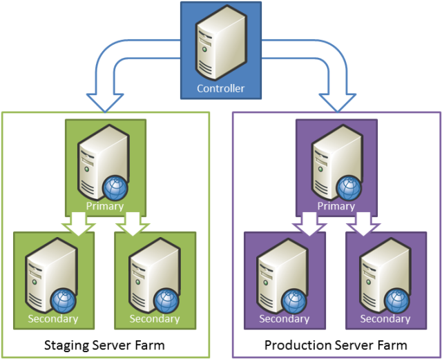

In this scenario, the staging environment and the production environment are both configured as WFF server farms. A single WFF controller server manages both farms. Within each server farm, any changes to the primary server are replicated to every secondary server.

Before you start to configure your staging and production environments, we recommend that you read these articles to familiarize yourself with the key concepts of WFF 2.0:

- [Overview of the Web Farm Framework 2.0 for IIS 7](https://go.microsoft.com/?linkid=9805126)
- [Setting up a Server Farm with the Web Farm Framework 2.0 for IIS 7](https://go.microsoft.com/?linkid=9805127)
- [System and Platform Requirements for the Web Farm Framework 2.0 for IIS 7](https://go.microsoft.com/?linkid=9805128)

## Task Overview

To complete the tasks and walkthroughs in this topic, you'll need at least three servers&#x2014;one WFF controller, one primary web server for the server farm, and one or more secondary web servers for the server farm. You can add more secondary servers to a WFF server farm at any time. At a high level, to create and configure a WFF server farm for your staging or production environment you'll need to:

- Create a controller server by installing Internet Information Services (IIS) 7.5 and WFF 2.0.
- Prepare primary and secondary servers by creating a common administrator account and configuring firewall exceptions.
- Configure the server farm by using IIS Manager on the controller server.
- Configure load balancing using IIS Application Request Routing (ARR) or an alternative load-balancing technology.

The tasks and walkthroughs in this topic assume that you're starting with clean server builds running Windows Server 2008 R2. Before you begin, for each server, ensure that:

- Windows Server 2008 R2 Service Pack 1 and all available updates are installed.
- The server is domain-joined.
- The server has a static IP address.

> [!NOTE]
> For more information on joining computers to a domain, see [Joining Computers to the Domain and Logging On](https://technet.microsoft.com/en-us/library/cc725618(v=WS.10).aspx). For more information on configuring static IP addresses, see [Configure a Static IP Address](https://technet.microsoft.com/en-us/library/cc754203(v=ws.10).aspx).

## Create the WFF Controller Server

To create a WFF controller server, you'll need to install both IIS 7 or later and WFF 2.0 or later. Under the covers, WFF uses the IIS Web Deployment Tool (Web Deploy) 2.x to synchronize the servers in your farm. If you use the Web Platform Installer to install WFF, the installer will automatically download and install Web Deploy for you.

**To create the WFF controller server**

1. Download and install the [Web Platform Installer](https://go.microsoft.com/?linkid=9739157).
2. At the top of the **Web Platform Installer 3.0** window, click **Products**.
3. On the left side of the window, in the navigation pane, click **Server**.
4. In the **IIS 7 Recommended Configuration** row, click **Add**.
5. In the **Web Farm Framework 2.***x* row, click **Add**.

    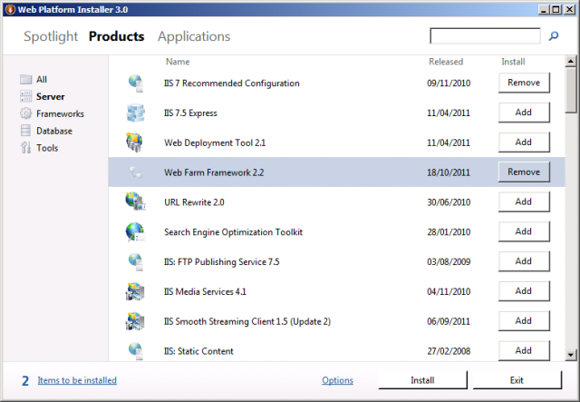
6. Click **Install**. Notice that the Web Platform Installer has added the Web Deployment Tool, along with various other dependencies, to the installation list.

    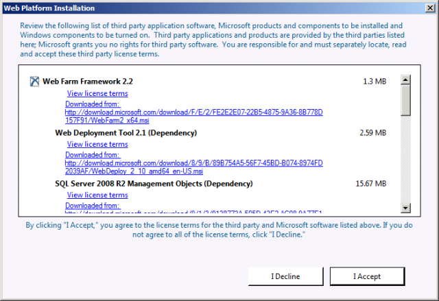
7. Review the license terms, and if you consent to the terms, click **I Accept**.
8. When the installation is complete, click **Finish**, and then close the **Web Platform Installer 3.0** window.

## Configure the Primary and Secondary Servers

Before you create a WFF server farm, you should complete some preparation tasks on the web servers that will make up the farm:

- Add firewall exceptions to allow the **Core Networking**, **Remote Administration**, and **File and Printer Sharing** features to communicate with the WFF controller server.
- Create a domain account (for example, **FABRIKAM\stagingfarm**) in Active Directory and add it to the local administrators group on each server. You'll use this account as the server farm administrator account when you create the server farm.

For more information on how to configure these firewall exceptions in Windows Firewall, see [System and Platform Requirements for the Web Farm Framework 2.0 for IIS 7](https://go.microsoft.com/?linkid=9805128). For other firewall systems, consult your product documentation.

You can use the next procedure to add a domain account to the local administrators group in Windows Server 2008 R2. You should perform this procedure on every server that you want to add to the server farm&#x2014;in other words, add the same domain account to the local administrators group on the primary server and on each secondary server.

**To add a domain account to the local administrators group**

1. On the **Start** menu, point to **Administrative Tools**, and then click **Server Manager**.
2. In the **Server Manager** window, in the tree view pane, expand **Configuration**, expand **Local Users and Groups**, and then click **Groups**.

    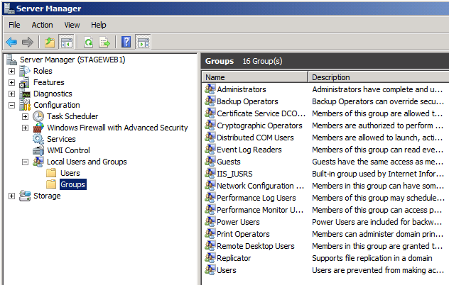
3. In the **Groups** pane, double-click **Administrators**.
4. In the **Administrators Properties** dialog box, click **Add**.
5. In the **Select Users, Computers, Service Accounts, or Groups** dialog box, type (or browse) to your domain account (for example, **FABRIKAM\stagingfarm**), and then click **OK**.

    
6. In the **Administrators Properties** dialog box, click **OK**.

Your servers are now ready to be added to a server farm. In the case of the primary server, you can configure the server to meet your application requirements before or after you create the server farm&#x2014;in both cases, the WFF will synchronize the servers by deploying the same products, components, or configuration to your secondary servers. For the sake of simplicity, this tutorial assumes that you'll configure the primary server when you've finished creating the server farm.

## Create the WFF Server Farm

At this point, all your servers are ready to be added to a WFF server farm:

- You've installed WFF on the controller server.
- You've configured firewall exceptions on your primary and secondary web servers.
- You've added a domain account to the local administrators group on your primary and secondary web servers.

The next step is to create the server farm in WFF. You can do this from IIS Manager on the WFF controller server.

**To create a WFF server farm**

1. On the WFF controller server, on the **Start** menu, point to **Administrative Tools**, and then click **Internet Information Services (IIS) Manager**.
2. In the **Connections** pane, expand the local server node, right-click **Server Farms**, and then click **Create Server Farm**.
3. In the **Create Server Farm** dialog box, type a meaningful name for the server farm (for example, **Staging Farm**), and then select **Provision server farm**.
4. Type the user name and password of the domain account that you added to the local administrators group on each server.

    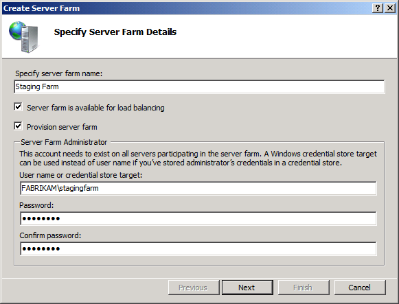
5. Click **Next**.
6. On the **Add Servers** page, type the fully qualified domain name (FQDN) of the primary server, select **Primary Server**, and then click **Add**.
7. At this point, WFF will attempt to contact the primary server using the credentials you provided. If the connection succeeds, the primary server will be added to the table on the **Add Servers** page.

    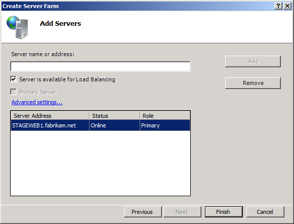

    > [!NOTE]
    > You might have noticed that **Server is available for Load Balancing** is selected by default. WFF uses the IIS ARR module to implement load balancing and thereby distribute requests across the web servers in your server farm. In most scenarios, you'd only clear the **Server is available for Load Balancing** option if you wanted to use a third-party load balancing solution instead.
8. On the **Add Servers** page, type the FQDN of your first secondary server, and then click **Add**.

    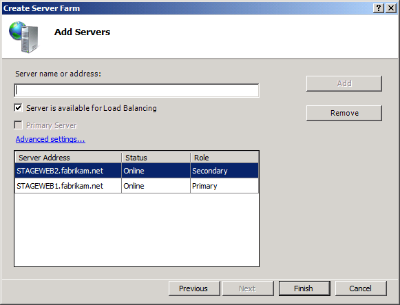
9. Repeat step 7 for any additional secondary servers in your farm, and then click **Finish**.

Your WFF server farm is now up and running. Any web platform products or components that you install on the primary server, and any web applications or content that you deploy to the primary server, will be automatically provisioned on all your secondary servers.

WFF is a broad and complex topic, and you can learn more about it on the [Microsoft Web Farm Framework 2.0 for IIS 7](https://go.microsoft.com/?linkid=9805129) website. For the time being, however, there are two features areas that you need to be aware of:

- *Application provisioning* is the process that replicates content from the primary server, like web applications and configuration settings, across all the secondary servers in the server farm. For example, if you deploy the Contact Manager sample solution to your primary staging server, the WFF application provisioning process will deploy this solution to all your secondary staging servers. By default, the application provisioning process runs every 30 seconds.
- *Platform provisioning* is the process that synchronizes web platform products and components from the primary server to all the secondary servers in the server farm. For example, if you install ASP.NET MVC 3 on your primary staging server, the platform provisioning process will use the Web Platform Installer to install ASP.NET MVC 3 on all your secondary staging servers. By default, the platform provisioning process runs every five minutes.

You can manage basic application and platform provisioning settings from IIS Manager on your WFF controller server.

**Explore application and platform provisioning settings**

1. In IIS Manager, in the **Connections** pane, select your server farm.

    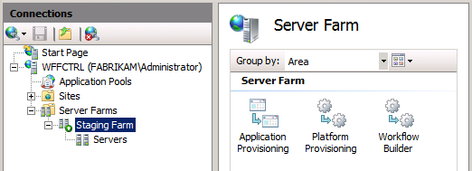
2. In the **Server Farm** pane, double-click **Application Provisioning**.

    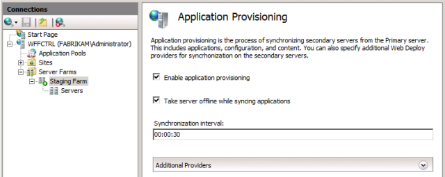
3. As you can see, the server farm is currently configured to synchronize web content and configuration settings between the primary server and the secondary servers every 30 seconds.
4. Click **Back**, and then double-click **Platform Provisioning**.

    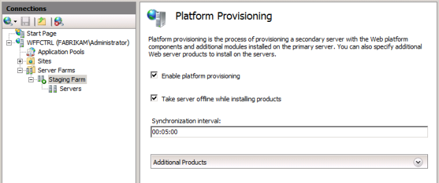
5. As you can see, the server farm is currently configured to synchronize web platform products and components between the primary server and the secondary servers every five minutes.
6. Click **Back**.
7. To force the server farm to synchronize web platform products immediately, in the **Actions** pane, click **Provision Platform**.

    

    > [!NOTE]
    > Platform provisioning may take some time. The installer process runs in the background on the secondary servers in your server farm.
8. Once you've allowed sufficient time for the provisioning process to complete, you can verify that the products and components that you added to the primary server have now been replicated on the secondary servers. For example, you can log on to a secondary server and use the **Server Manager** window to verify that the web server role has been installed.

    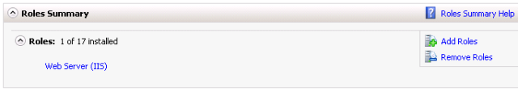
9. You can also check the installed programs list to verify that various web platform components have been added.

    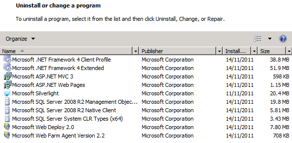

## Configure Load Balancing

When you create a web farm, you need to set up some form of load balancing to distribute HTTP requests between your web servers. This could be Windows Server 2008 network load balancing, IIS ARR, or a third-party software-based or hardware-based load balancing solution.

WFF is designed to integrate closely with IIS ARR. To take advantage of this integration, you need to install the ARR module on the WFF controller server. You then direct all your web traffic to the controller server, typically by configuring Domain Name System (DNS) records. The controller server will then distribute incoming requests among the servers in your farm, based on server availability and various other criteria.

> [!NOTE]
> You don't have to use ARR with WFF; you can configure WFF to work with third-party load balancing solutions. For more information, see [Overview of the Web Farm Framework 2.0 for IIS 7](https://go.microsoft.com/?linkid=9805126).

Load balancing using ARR is a complex topic, most of which is beyond the scope of this tutorial. However, you can use the next procedure to install the ARR module and get started with load balancing.

**To set up load balancing on the WFF controller server**

1. On the WFF controller server, launch the Web Platform Installer.
2. At the top of the **Web Platform Installer 3.0** window, click **Products**.
3. On the left side of the window, in the navigation pane, click **Server**.
4. In the **Application Request Routing 2.5** row, click **Add**.

    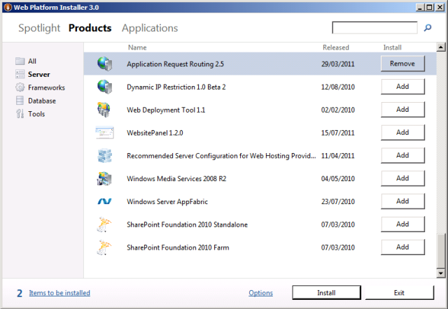
5. Click **Install**, and then follow the instructions in the **Web Platform Installation** window.
6. When the installation is complete, launch IIS Manager, and in the **Connections** pane, click your server farm node. Notice that several new icons have been added to the **Server Farm** pane.

    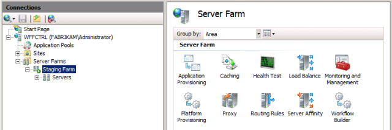
7. In the **Server Farm** pane, double-click **Load Balance**.
8. In the **Load Balance** pane, select a load balance algorithm (for example, **Least current request**).

    > [!NOTE]
    > For more information on load balancing algorithms and other configuration settings, see [Application Request Routing Module](https://go.microsoft.com/?linkid=9805130).

    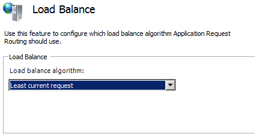
9. In the **Actions** pane, click **Apply**.

You have now configured basic load balancing for the servers in your server farm. If you direct all your web farm traffic to the controller server, the requests will be distributed between the servers in your farm according to availability and the load balancing algorithm you selected.

For more information on how to configure load balancing with ARR, see [Application Request Routing Module](https://go.microsoft.com/?linkid=9805130).

## Monitor the Server Farm

You can monitor the health of your server farm at any time through IIS Manager on the controller server. In the **Connections** pane, expand your server farm, and then click **Servers**. The center pane will show a summary of each server in the farm together with a trace log of recent activity.

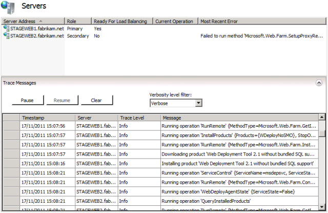

## Conclusion

Your WFF server farm should now be up and running. You can configure the primary server to support whichever deployment approach you prefer&#x2014;see the Further Reading section for details&#x2014;and your configuration will be replicated on each secondary server in the server farm.

## Further Reading

For more guidance on all aspects of configuring and using the WFF, see the [Microsoft Web Farm Framework 2.0 for IIS 7](https://go.microsoft.com/?linkid=9805129) website.

>[!div class="step-by-step"]
[Previous](configuring-a-database-server-for-web-deploy-publishing.md)
[Next](configuring-deployment-properties-for-a-target-environment.md)