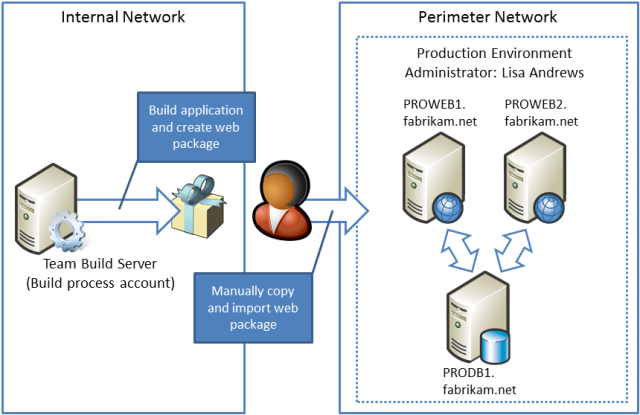

Scenario: Configuring a Production Environment for Web Deployment
====================
by [Jason Lee](https://github.com/jrjlee)

[Download PDF](https://msdnshared.blob.core.windows.net/media/MSDNBlogsFS/prod.evol.blogs.msdn.com/CommunityServer.Blogs.Components.WeblogFiles/00/00/00/63/56/8130.DeployingWebAppsInEnterpriseScenarios.pdf)

> This topic describes a typical web deployment scenario for a production environment and explains the tasks you need to complete in order to set up a similar environment.

The production environment is the final destination for a web application or a website. By this point, your application has been through testing, has been deployed to a staging environment, and is ready to "go live." The characteristics of a production environment can vary widely according to the nature and purpose of your web content, the size of your organization, your target audience, and lots of other factors. In an enterprise-scale scenario, the production environment may have these characteristics:

- The environment consists of multiple load-balanced web servers and one or more database servers, often with failover clustering and database mirroring.
- If the environment is Internet-facing, it's likely to be segregated from your internal network. It may be on a different subnet in a perimeter network, it may be on a different domain, and it may be on an entirely different network infrastructure.
- Developers and build server process accounts are highly unlikely to have administrator privileges on the production servers.
- Changes to applications are deployed on a less frequent basis than test or staging deployments.

> [!NOTE]
> Scaling out a database deployment across multiple servers is beyond the scope of this tutorial. For more information on this area, please consult [SQL Server Books Online](https://technet.microsoft.com/en-us/library/ms130214.aspx).

For example, in our [tutorial scenario](../deploying-web-applications-in-enterprise-scenarios/enterprise-web-deployment-scenario-overview.md), a Team Build server includes build definitions that let users build the Contact Manager solution and deploy it to a staging environment in a single step. When the application is ready to be deployed to production, due to the constraints imposed by security requirements and the network infrastructure, the production environment administrator must manually copy the web package onto a production web server and import it through Internet Information Services (IIS) Manager.

## Solution Overview

In this scenario, you can deduce these facts from an analysis of the deployment requirements:

- Due to security restrictions and the network configuration, you can't configure the production environment to support one-click or automated deployment. Offline deployment is the only viable approach in this scenario.
- The production environment includes multiple web servers, so you can use the Web Farm Framework (WFF) to create a server farm. Using this approach, the administrator only needs to import the application onto one web server (the primary server), and WFF will replicate the deployment on all the other web servers in the production environment.

These topics provide all the information you need in order to complete these tasks:

- [Create a Server Farm with the Web Farm Framework](configuring-a-database-server-for-web-deploy-publishing.md). This topic describes how to create and configure a server farm using WFF, so that web platform products and components, configuration settings, and websites and applications are replicated across multiple load-balanced web servers.
- [Configure a Web Server for Web Deploy Publishing (Offline Deployment)](configuring-a-web-server-for-web-deploy-publishing-offline-deployment.md). This topic describes how to build a web server that lets administrators import and deploy web packages manually, starting from a clean Windows Server 2008 R2 build.
- [Configure a Database Server for Web Deploy Publishing](configuring-a-database-server-for-web-deploy-publishing.md). This topic describes how to configure a database server to support remote access and deployment, starting from a default installation of SQL Server 2008 R2.

## Further Reading

For guidance on configuring a typical developer test environment, see [Scenario: Configuring a Test Environment for Web Deployment](scenario-configuring-a-test-environment-for-web-deployment.md). For guidance on configuring a typical staging environment, see [Scenario: Configuring a Staging Environment for Web Deployment](scenario-configuring-a-staging-environment-for-web-deployment.md).

>[!div class="step-by-step"]
[Previous](scenario-configuring-a-staging-environment-for-web-deployment.md)
[Next](configuring-a-web-server-for-web-deploy-publishing-remote-agent.md)