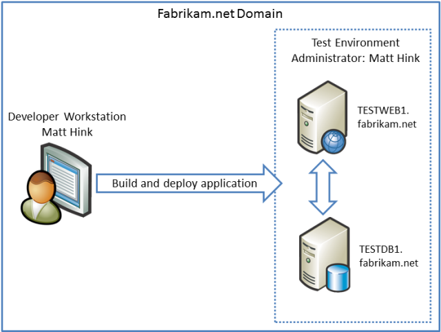
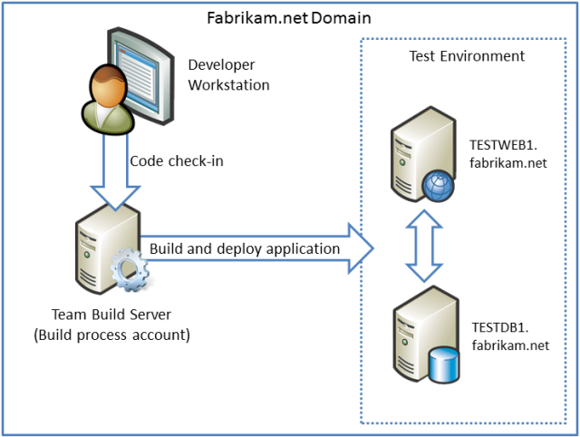

Scenario: Configuring a Test Environment for Web Deployment
====================
by [Jason Lee](https://github.com/jrjlee)

[Download PDF](https://msdnshared.blob.core.windows.net/media/MSDNBlogsFS/prod.evol.blogs.msdn.com/CommunityServer.Blogs.Components.WeblogFiles/00/00/00/63/56/8130.DeployingWebAppsInEnterpriseScenarios.pdf)

> This topic describes a typical web deployment scenario for developer or test environments and explains the tasks you need to complete in order to set up a similar environment.

When developers work on web applications, they're often given access to a server environment that they can use to test changes to their applications in a realistic setting. This kind of development or test environment typically has these characteristics:

- The environment consists of a single web server and a single database server.
- The developers usually have administrator privileges on the servers, to let them configure the environment to the requirements of their applications.
- Changes to applications are deployed on a frequent basis, so the environment needs to support single-step or automated deployment.

For example, in our [tutorial scenario](../deploying-web-applications-in-enterprise-scenarios/enterprise-web-deployment-scenario-overview.md), Matt Hink is a developer at Fabrikam, Inc. Matt is working on the Contact Manager solution and regularly needs to deploy changes to a test environment. Matt is an administrator on the test web server and the test database server. Initially, Matt needs to be able to deploy the solution to the test environment directly.

As work progresses and more developers join the team, the Contact Manager solution is configured for continuous integration (CI) in Team Foundation Server (TFS). Whenever a developer checks in content, Team Build should build the solution, run any unit tests, and automatically deploy the solution to the test environment.

## Solution Overview

The test environment needs to support single-step or automated deployment from a remote computer, so you have a choice of two main approaches. You can:

- Configure the test web server to support deployment using the Web Deployment Agent Service (the "remote agent").
- Configure the test web server to support deployment using the Web Deploy handler.

> [!NOTE]
> You could also use [Web Deploy On Demand](https://technet.microsoft.com/en-us/library/ee517345(WS.10).aspx) (the "temp agent"). This is similar to the remote agent approach in terms of requirements and constraints.

In this case, the developers have administrator privileges on the destination servers, and the test environment is not subject to strict security constraints, so the logical choice is to configure the test web server to support deployment using the remote agent. This is less complex and requires less initial configuration than the Web Deploy Handler approach. You'll also need to configure your database server to support remote access and deployment.

These topics provide all the information you need in order to complete these tasks:

- [Configure a Web Server for Web Deploy Publishing (Remote Agent)](configuring-a-web-server-for-web-deploy-publishing-remote-agent.md). This topic describes how to build a web server that supports Web Deploy publishing, using the remote agent approach, starting from a clean Windows Server 2008 R2 build.
- [Configure a Database Server for Web Deploy Publishing](configuring-a-database-server-for-web-deploy-publishing.md). This topic describes how to configure a database server to support remote access and deployment, starting from a default installation of SQL Server 2008 R2.

## Further Reading

For guidance on configuring a typical staging environment, see [Scenario: Configuring a Staging Environment for Web Deployment](scenario-configuring-a-staging-environment-for-web-deployment.md). For guidance on configuring a typical production environment, see [Scenario: Configuring a Production Environment for Web Deployment](scenario-configuring-a-production-environment-for-web-deployment.md).

>[!div class="step-by-step"]
[Previous](choosing-the-right-approach-to-web-deployment.md)
[Next](scenario-configuring-a-staging-environment-for-web-deployment.md)