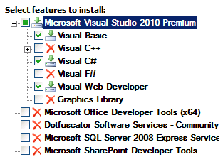

Configuring a TFS Build Server for Web Deployment
====================
by [Jason Lee](https://github.com/jrjlee)

[Download PDF](https://msdnshared.blob.core.windows.net/media/MSDNBlogsFS/prod.evol.blogs.msdn.com/CommunityServer.Blogs.Components.WeblogFiles/00/00/00/63/56/8130.DeployingWebAppsInEnterpriseScenarios.pdf)

> This topic describes how to prepare a Team Foundation Server (TFS) build server to build and deploy your solutions using Team Build and the Internet Information Services (IIS) Web Deployment Tool (Web Deploy).

This topic forms part of a series of tutorials based around the enterprise deployment requirements of a fictional company named Fabrikam, Inc. This tutorial series uses a sample solution&#x2014;the [Contact Manager solution](../web-deployment-in-the-enterprise/the-contact-manager-solution.md)&#x2014;to represent a web application with a realistic level of complexity, including an ASP.NET MVC 3 application, a Windows Communication Foundation (WCF) service, and a database project.

The deployment method at the heart of these tutorials is based on the split project file approach described in [Understanding the Project File](../web-deployment-in-the-enterprise/understanding-the-project-file.md), in which the build process is controlled by two project files&#x2014;one containing build instructions that apply to every destination environment, and one containing environment-specific build and deployment settings. At build time, the environment-specific project file is merged into the environment-agnostic project file to form a complete set of build instructions.

## Task Overview

To prepare a build server to build and deploy your solutions, you'll need to:

- Install and configure the TFS build service.
- Install Visual Studio 2010.
- Install any products or components that are required to build your solution, like versions of the .NET Framework or ASP.NET MVC.
- Install Web Deploy 2.0 or later.

This topic will show you how to perform these procedures or point to other resources where they exist. The tasks and walkthroughs in this topic assume that:

- You're starting with a clean server build running Windows Server 2008 R2 Service Pack 1.
- The server is domain-joined with a static IP address.
- You've installed the TFS application tier on a separate server, as described in [Enterprise Web Deployment: Scenario Overview](../deploying-web-applications-in-enterprise-scenarios/enterprise-web-deployment-scenario-overview.md).

### Who Performs These Procedures?

In most cases, a TFS administrator will be responsible for configuring build servers. In some cases, the developer team may take ownership of specific build servers.

## Install and Configure the TFS Build Service

When you configure a build server, your first task is to install and configure the TFS build service. As part of this process, you'll need to:

- Install the TFS build service and configure a service account. Any build tasks, including deployment, will run using the identity of the build service account.
- Create a *build controller* and one or more *build agents*. Each build controller manages a set of build agents. When you queue a build, the build controller assigns the build task to an available build agent. Each team project collection in TFS is mapped to a single build controller.
- Configure a drop folder for your build outputs. This is a network share. Any build outputs, like web deployment packages, are sent to the drop folder.

The [Administering Team Foundation Build](https://msdn.microsoft.com/en-us/library/ms252495.aspx) chapter on MSDN contains all the resources you need in order to perform these tasks:

- For a conceptual overview of Team Foundation Build, including the build service, build controllers, and build agents, see [Understanding a Team Foundation Build System](https://msdn.microsoft.com/en-us/library/dd793166.aspx).
- For information on installing and configuring the build service, see [Configure a Build Machine](https://msdn.microsoft.com/en-us/library/ms181712.aspx).
- For information on creating build controllers, see [Create and Work with a Build Controller](https://msdn.microsoft.com/en-us/library/ee330987.aspx).
- For information on creating build agents, see [Create and Work with Build Agents](https://msdn.microsoft.com/en-us/library/bb399135.aspx).
- For information on creating and configuring drop folders, see [Set Up Drop Folders](https://msdn.microsoft.com/en-us/library/bb778394.aspx).

## Install Required Products and Components

To enable the build server to build your solutions, you must install any products, components, or assemblies that your solution requires. Before you install any web platform components, you should install Visual Studio 2010 (any version) on the build server. This ensures that the core Microsoft Build Engine (MSBuild) target files and the Web Publishing Pipeline (WPP) target files are available to the build service. The Visual Studio installer should also install Web Deploy, which you'll need if you plan to deploy web packages as part of your build process.

The best way to install common web platform components is to use the [Web Platform Installer](https://go.microsoft.com/?linkid=9805118). This ensures that you're installing the latest version of each product, and it also automatically detects and installs any prerequisites for each product. In the case of the [Contact Manager](../web-deployment-in-the-enterprise/the-contact-manager-solution.md) solution, you should use the Web Platform Installer to install these products and components:

- **.NET Framework 4.0**. This is required to run applications that were built on this version of the .NET Framework.
- **Web Deployment Tool 2.1 or later**. This installs Web Deploy (and its underlying executable, MSDeploy.exe) on your server. As part of this process, it installs and starts the Web Deployment Agent Service. This service lets you deploy web packages from a remote computer.
- **ASP.NET MVC 3**. This installs the assemblies you need to run ASP.NET MVC 3 applications.

**To install the required products and components**

1. Install Visual Studio 2010. When prompted to select features to install, you should include:

    1. Any programming languages that you need to compile.
    2. Visual Web Developer. This ensures that the WPP targets are added to your build server.

        
2. When the installation of Visual Studio 2010 is complete, download and install [Visual Studio 2010 Service Pack 1](https://go.microsoft.com/?linkid=9805133) (if it's not already included in your installation media).

    > [!NOTE]
    > Visual Studio 2010 Service Pack 1 resolves a bug that can prevent MSBuild from locating the MSDeploy executable.
3. Download and launch the [Web Platform Installer](https://go.microsoft.com/?linkid=9805118).
4. At the top of the **Web Platform Installer 3.0** window, click **Products**.
5. On the left side of the window, in the navigation pane, click **Frameworks**.
6. In the **Microsoft .NET Framework 4** row, if the .NET Framework is not already installed, click **Add**.

    > [!NOTE]
    > You may have already installed the .NET Framework 4.0 through Windows Update. If a product or component is already installed, the Web Platform Installer will indicate this by replacing the **Add** button with the text **Installed**.

    
7. In the **ASP.NET MVC 3 (Visual Studio 2010)** row, click **Add**.
8. In the navigation pane, click **Server**.
9. In the **Web Deployment Tool 2.1** row, click **Add**.
10. Click **Install**. The Web Platform Installer will show you a list of products&#x2014;together with any associated dependencies&#x2014;to be installed and will prompt you to accept the license terms.
11. Review the license terms, and if you consent to the terms, click **I Accept**.
12. When the installation is complete, click **Finish**, and then close the **Web Platform Installer 3.0** window.

> [!NOTE]
> If your deployment process includes the use of tools like VSDBCMD.exe or SQLCMD.exe, you'll need to ensure that these are installed on your build server. VSDBCMD.exe is a Visual Studio tool and is typically added to the server when you install Team Foundation Build. SQLCMD.exe is a SQL Server tool. You can download a stand-alone version of SQLCMD.exe from the [Microsoft SQL Server 2008 R2 Feature Pack](https://go.microsoft.com/?linkid=9805134) page.

## Conclusion

At this point, your build server is ready to start building and deploying your web application projects. The next topic, [Creating a Build Definition That Supports Deployment](creating-a-build-definition-that-supports-deployment.md), describes how to create and configure a build definition to control when and how your projects are built and deployed.

## Further Reading

For more general guidance on working with Team Build, see [Administering Team Foundation Build](https://msdn.microsoft.com/en-us/library/ms252495.aspx).

>[!div class="step-by-step"]
[Previous](adding-content-to-source-control.md)
[Next](creating-a-build-definition-that-supports-deployment.md)