Creating a Team Project in TFS
====================
by [Jason Lee](https://github.com/jrjlee)

[Download PDF](https://msdnshared.blob.core.windows.net/media/MSDNBlogsFS/prod.evol.blogs.msdn.com/CommunityServer.Blogs.Components.WeblogFiles/00/00/00/63/56/8130.DeployingWebAppsInEnterpriseScenarios.pdf)

> This topic describes how to create a new team project in Team Foundation Server (TFS) 2010.

This topic forms part of a series of tutorials based around the enterprise deployment requirements of a fictional company named Fabrikam, Inc. This tutorial series uses a sample solution&#x2014;the [Contact Manager solution](../web-deployment-in-the-enterprise/the-contact-manager-solution.md)&#x2014;to represent a web application with a realistic level of complexity, including an ASP.NET MVC 3 application, a Windows Communication Foundation (WCF) service, and a database project.

## Task Overview

To provision and use a new team project in TFS, you'll need to complete these high-level steps:

- Grant permissions to the user who will create the new team project.
- Create the team project.
- Grant permissions to the team members who will work on the project.
- Check in some content.

This topic will show you how to perform these procedures, and it will identify the users and job roles that are likely to be responsible for each procedure. Be aware that, depending on the structure of your organization, each of these tasks may be the responsibility of a different person.

The tasks and walkthroughs in this topic assume that you've installed and configured TFS, and that you've created a team project collection as part of the configuration process. For more information on these assumptions, and for more general background information on the scenario, see [Configure a TFS Build Server for Web Deployment](configuring-a-tfs-build-server-for-web-deployment.md).

## Grant Permissions to the Team Project Creator

In order to create a new team project, you need these permissions:

- You must have the **Create new projects** permission on the TFS application tier. You typically grant this permission by adding users to the **Project Collection Administrators** TFS group. The **Team Foundation Administrators** global group also includes this permission.
- You must have permission to create new team sites within the SharePoint site collection that corresponds to the TFS team project collection. You typically grant this permission by adding the user to a SharePoint group with **Full Control** rights on the SharePoint site collection.
- If you're using SQL Server Reporting Services features, you must be a member of the **Team Foundation Content Manager** role in Reporting Services.

### Who Performs These Procedures?

Typically, the person or group who administers the TFS deployment also performs these procedures.

Because this is a highly privileged set of permissions, new team projects are typically created by a small subset of users with responsibility for administering a TFS deployment. Developers will not usually be granted the permissions required to create new team projects.

### Grant Permissions in TFS

If you want to enable a user to create new team projects, the first high-level task is to add the user to the **Project Collection Administrators** group for the team project collection.

**To add a user to the Project Collection Administrators group**

1. On the TFS server, on the **Start** menu, point to **All Programs**, click **Microsoft Team Foundation Server 2010**, and then click **Team Foundation Administration Console**.
2. In the navigation tree view, expand **Application Tier**, and then click **Team Project Collections**.

    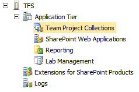
3. In the **Team Project Collections** pane, select the team project collection you want to manage.

    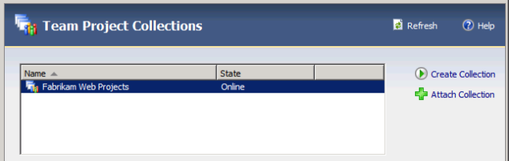
4. On the **General** tab, click **Group Membership**.

    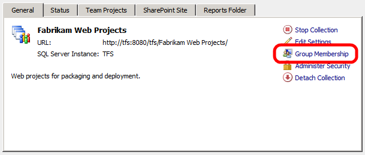
5. In the **Global Groups** dialog box, select the **Project Collection Administrators** group, and then click **Properties**.
6. In the **Team Foundation Server Group Properties** dialog box, select **Windows User or Group**, and then click **Add**.

    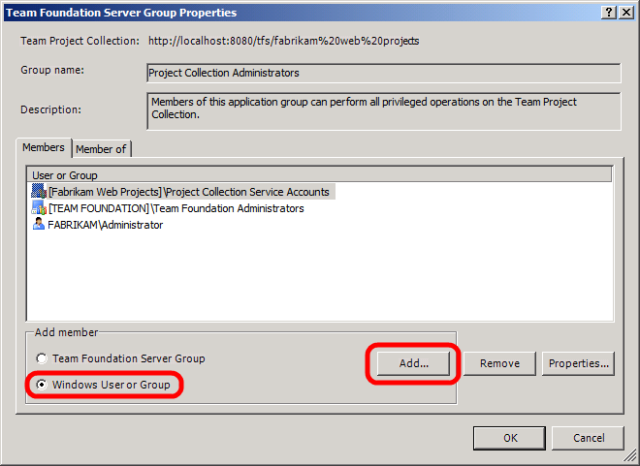
7. In the **Select Users, Computers, or Groups** dialog box, type the user name of the user you want to be able to create new team projects, click **Check Names**, and then click **OK**.

    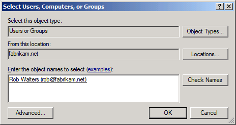
8. In the **Team Foundation Server Group Properties** dialog box, click **OK**.
9. In the **Global Groups** dialog box, click **Close**.

### Grant Permissions in SharePoint Services

Next, you need to give the user permission to create new team sites in the SharePoint site collection that corresponds to your TFS team project collection.

**To grant Full Control permissions on the SharePoint site collection**

1. In the Team Foundation Server Administration Console, on the **Team Project Collections** page, select the team project collection you want to manage.
2. On the **SharePoint Site** tab, note the value of the **Current Default Site Location** URL.

    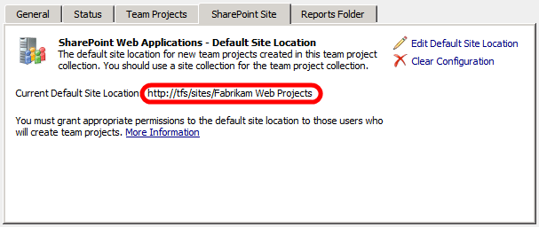
3. Open Internet Explorer, and then go to the URL you noted in step 2.

    > [!NOTE]
    > If you're not logged on to Windows as the user who created the team project collection, you'll need to sign in to SharePoint as this user in order to continue.
4. On the **Site Actions** menu, click **Site Settings**.

    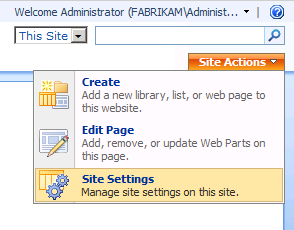
5. On the **Site Settings** page, under **Users and Permissions**, click **People and groups**.
6. In the left navigation panel, click **Groups**.

    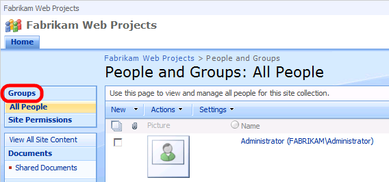
7. On the **People and Groups: All Groups** page, click **Set Up Groups for this Site**.

    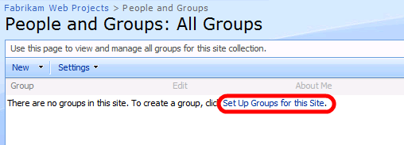

    > [!NOTE]
    > You may receive an **HTTP 404 Not Found** error due to a double HTTP encoding bug. If this occurs, replace the URL with this:   
    > [*site collection URL*]/\_layouts/permsetup.aspx  
    > For example:  
    > http://tfs/sites/Fabrikam%20Web%20Projects/\_layouts/permsetup.aspx
8. On the **Set Up Groups for this Site** page, add the user who will create team projects to the **Owners** group, and then click **OK**.

    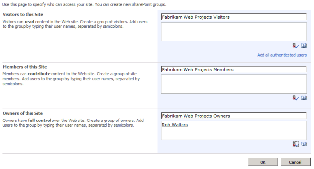

For more information on enabling users to create new team projects within a team project collection, see [Set Administrator Permissions for Team Project Collections](https://msdn.microsoft.com/en-us/library/dd547204.aspx).

## Create a New Team Project and Add Users

Once you have the necessary permissions, you can use the **Team Explorer** window in Visual Studio 2010 to create a new team project. This approach provides a wizard that collects all the required information and performs the necessary tasks in TFS, SharePoint, and SQL Server Reporting Services. You'll also need to grant permissions on the new team project to members of the developer team, to enable them to add and modify content.

### Who Performs These Procedures?

Usually either a TFS administrator or a developer team leader performs these procedures.

### Create a New Team Project

The next procedure describes how to create a new team project in TFS 2010.

**To create a new team project**

1. On the **Start** menu, point to **All Programs**, click **Microsoft Visual Studio 2010**, right-click **Microsoft Visual Studio 2010**, and then click **Run as administrator**.

    > [!NOTE]
    > If you don't run Visual Studio 2010 as an administrator, the New Team Project Wizard will fail on the last step.
2. If the **User Account Control** dialog box appears, click **Yes**.
3. In Visual Studio, on the **Team** menu, click **Connect to Team Foundation Server**.

    > [!NOTE]
    > If you have already configured a connection to a TFS server, you can omit steps 4-7.
4. In the **Connection to Team Project** dialog box, click **Servers**.
5. In the **Add/Remove Team Foundation Server** dialog box, click **Add**.
6. In the **Add Team Foundation Server** dialog box, provide the details of your TFS instance, and then click **OK**.

    
7. In the **Add/Remove Team Foundation Server** dialog box, click **Close**.
8. In the **Connect to Team Project** dialog box, select the TFS instance you want to connect to, select the team project collection you want to add to, and then click **Connect**.

    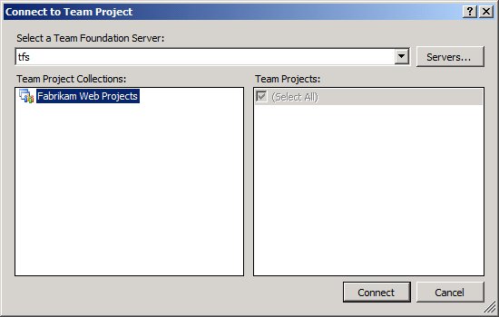
9. In the **Team Explorer** window, right-click the team project collection, and then click **New Team Project**.

    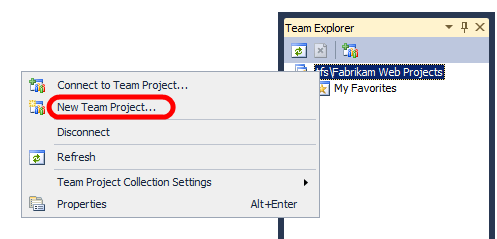
10. In the **New Team Project** dialog box, provide a name and a description for the team project, and then click **Next**.

    > [!NOTE]
    > If your team project includes spaces, you may face some issues when you come to use the Internet Information Services (IIS) Web Deployment Tool (Web Deploy) to deploy packages from the output path. Spaces in the path can make it a lot more difficult to run Web Deploy commands.

    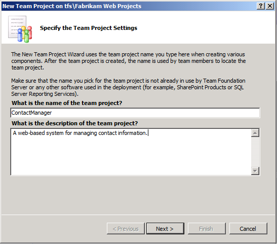
11. On the **Select a Process Template** page, select the process template that you want to use to manage the development process, and then click **Next**.

    > [!NOTE]
    > For more information on process templates for TFS, see [Process Templates and Tools](https://msdn.microsoft.com/en-us/vstudio/aa718795).
12. On the **Team Site Settings** page, leave the default settings unchanged, and then click **Next**.
13. This setting creates, or identifies, a SharePoint team site that is associated with the TFS team project. Your development team can use this site to manage documentation, participate in discussion threads, create wiki pages, and perform various other tasks that are not related to code. For more information, see [Interactions Between SharePoint Products and Team Foundation Server](https://msdn.microsoft.com/en-us/library/ms253177.aspx).
14. On the **Specify Source Control Settings** page, leave the default settings unchanged, and then click **Next**.
15. This setting identifies or creates the location in the TFS folder hierarchy that will act as a root folder for your content.
16. On the **Confirm Team Project Settings** page, click **Finish**.
17. When the new team project is successfully created, on the **Team Project Created** page, click **Close**.

### Add Users to a Team Project

Now that you've created the new team project, you can grant permissions to users to enable them to start adding and collaborating on content.

**To add users to a team project**

1. In Visual Studio 2010, in the **Team Explorer** window, right-click the team project, point to **Team Project Settings**, and then click **Group Membership**.

    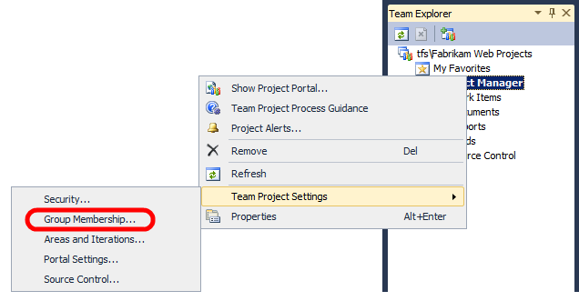
2. To enable a user to add, modify, and remove code under source control, you need to add him or her to the **Contributors** group.
3. In the **Project Groups** dialog box, select the **Contributors** group, and then click **Properties**.

    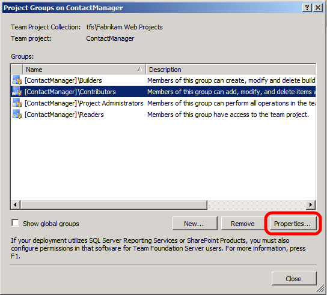
4. In the **Team Foundation Server Group Properties** dialog box, select **Windows User or Group**, and then click **Add**.

    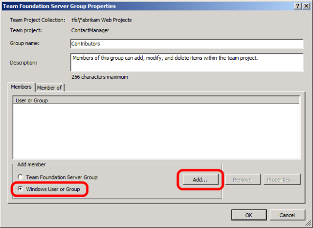
5. In the **Select Users, Computers, or Groups** dialog box, type the user name of the user you want to add to the team project, click **Check Names**, and then click **OK**.

    
6. In the **Team Foundation Server Group Properties** dialog box, click **OK**.
7. In the **Project Groups** dialog box, click **Close**.

## Conclusion

At this point, your new team project is ready to use, and your developer team can start adding content and collaborating on the development process.

The next topic, [Adding Content to Source Control](adding-content-to-source-control.md), describes how to add content to source control.

## Further Reading

For broader guidance on creating team projects in TFS, see [Create a Team Project](https://msdn.microsoft.com/en-us/library/ms181477(v=VS.100).aspx). For more information on enabling users to create new team projects within a team project collection, see [Set Administrator Permissions for Team Project Collections](https://msdn.microsoft.com/en-us/library/dd547204.aspx). For more information on adding users to team projects, see [Add Users to Team Projects](https://msdn.microsoft.com/en-us/library/bb558971.aspx).

>[!div class="step-by-step"]
[Previous](configuring-team-foundation-server-for-web-deployment.md)
[Next](adding-content-to-source-control.md)