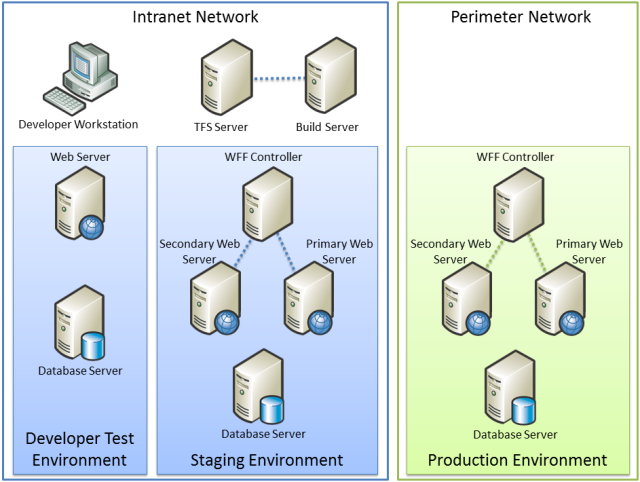
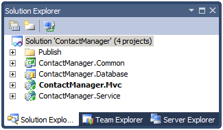
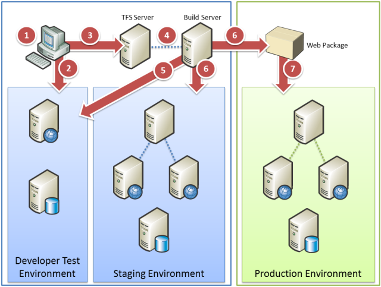

Enterprise Web Deployment: Scenario Overview
====================
by [Jason Lee](https://github.com/jrjlee)

[Download PDF](https://msdnshared.blob.core.windows.net/media/MSDNBlogsFS/prod.evol.blogs.msdn.com/CommunityServer.Blogs.Components.WeblogFiles/00/00/00/63/56/8130.DeployingWebAppsInEnterpriseScenarios.pdf)

> This set of tutorials uses a sample solution with a realistic level of complexity, together with a fictional enterprise deployment scenario, to provide a reference implementation and to give the tasks and walkthroughs a common context. This topic describes the tutorial scenario and introduces the sample solution.

## Scenario Description

Fabrikam, Inc., a fictitious company, is creating a solution that lets remote sales teams store and retrieve contact information from a web interface.

The Application Lifecycle Management (ALM) processes at Fabrikam, Inc. require the solution to be deployed to three server environments at various stages of the software development process:

- A developer test or "sandbox" environment.
- An intranet-based staging environment.
- An Internet-facing production environment.

Each of these environments has different configuration and security requirements, and each poses unique deployment challenges.

### The Fabrikam, Inc. Server Infrastructure

This is the high-level development and deployment infrastructure at Fabrikam, Inc.

The developer workstations, the source control infrastructure, the developer test environment, and the staging environment all reside on the intranet network within the Fabrikam.net domain. The production environment resides on a perimeter network (also known as DMZ, demilitarized zone, and screened subnet), which is isolated from the intranet network by a firewall. This is a common deployment scenario: you typically isolate your Internet-facing web servers from your internal server infrastructure through the use of firewalls or gateway servers.

In this example:

- A Team Foundation Server (TFS) 2010 server with a separate build server provides source control and continuous integration (CI) functionality.
- The developer test environment includes an Internet Information Services (IIS) 7.5 web server and a SQL Server 2008 R2 database server.
- The production environment includes multiple IIS 7.5 web servers synchronized by a Web Farm Framework (WFF) controller server, together with a SQL Server 2008 R2 database server. In practice, the database server may use clustering or mirroring to improve scalability and availability.
- The staging environment is designed to replicate the configuration of the production environment as closely as possible.
- The firewall and network isolation policies do not permit direct, automated deployment from the intranet to the perimeter network.

The configuration of each of these environments is described in more detail in the second tutorial, [Configuring Server Environments for Web Deployment](../configuring-server-environments-for-web-deployment/configuring-server-environments-for-web-deployment.md).

### Team Roles for ALM

These users are involved in creating, managing, building, and publishing the Contact Manager solution:

- Matt Hink is a web application developer at Fabrikam, Inc. He is part of the team who developed the Contact Manager solution by using Visual Studio 2010. Matt has full administrator rights on the servers in the developer test environment, which lets him configure the environment to meet his needs. He also has user access to the Visual Studio 2010 TFS instance where he stores the source code for the Contact Manager solution.
- Rob Walters is a server administrator for the Fabrikam, Inc. development team. Rob has administrative access on the TFS server so that he can configure all aspects of TFS and Team Build. Rob also has administrative access to the test and staging web servers and acts as the database administrator (DBA) for the database servers in the test and staging environments. Rob has configured Team Build on the TFS server to carry out these tasks:

    - Build and run unit tests on the application whenever a user checks in a file to TFS. This is called CI.
    - Deploy the Contact Manager application to the test environment automatically once the application passes unit tests. This includes publishing the database to the test servers on initial deployment and any updates to the database after initial deployment.
    - Deploy the Contact Manager application to the staging environment in a single-step process.
    - Create a Web package that a Web server administrator and a DBA can use to publish the application to the production environment.
- Lisa Andrews is a server administrator responsible for deploying applications to the Fabrikam, Inc. production servers. She has read access to the share where the TFS Team Build stores the web deployment package once it builds the Contact Manager application. She also has administrative access to the production web servers so that she can deploy the application to production. Additionally, she acts as the DBA who deploys databases and database updates to the database server in the production environment.

### The Contact Manager Solution

The Contact Manager solution is designed to let registered, logged-in users add and edit contact information through a web interface. The Contact Manager solution consists of four individual projects:

- **ContactManager.Mvc**. This is an ASP.NET MVC3 web application project that represents the entry point for the solution. It offers some basic web application functionality, like providing users with the ability to create and view contact details. The application relies on a Windows Communication Foundation (WCF) service to manage contacts and an ASP.NET application services database to manage authentication and authorization.
- **ContactManager.Database**. This is a Visual Studio 2010 database project. The project defines the schema for a database that stores contact details.
- **ContactManager.Service**. This is a WCF web service project. The WCF exposes an endpoint that allows callers to perform create, retrieve, update, and delete (CRUD) operations on the Contact Manager database. The service relies on the Contact Manager database and the ContactManager.Common.dll assembly.
- **ContactManager.Common**. This is a class library project. The WCF service relies on types defined in this assembly.

A complete review of the solution and its deployment requirements is provided in the first tutorial in this series, [Web Deployment in the Enterprise](../web-deployment-in-the-enterprise/web-deployment-in-the-enterprise.md).

## Deployment Tasks

There are several distinct tasks involved in deploying applications to different environments in a large organization. These are the key tasks that the tutorials cover:

Here is a list of each step in the deployment process from the perspective of the users described earlier in this document:

1. All members of the team review the Contact Manager solution in Visual Studio 2010 to determine key deployment requirements and issues.
2. Matt Hink may deploy the Contact Manager solution directly from the developer workstation to the developer test environment, to conduct an initial test of the deployment logic.
3. Matt Hink adds the application to source control in TFS.
4. Rob Walters creates various build definitions for the Contact Manager solution in Team Build. One build definition uses CI to deploy the solution to the developer test environment whenever a user checks in new code. Another build definition lets users trigger deployments to the staging environment as required.
5. Every time a user checks in new code, Team Build automatically builds the solution components, runs unit tests, and deploys the solution to the developer test environment if the build was successful and the unit tests pass.
6. When a user triggers a deployment to the staging environment, the solution is packaged and deployed in a single-step process. This process also generates a package for manual deployment to the production environment.
7. Lisa Andrews deploys the application to the production environment by manually importing the web package created in step 6.

### Key Deployment Issues

The Contact Manager solution and the Fabrikam, Inc. scenario highlight various common issues and challenges that you may encounter when you deploy complex, enterprise-scale solutions. For example:

- You need to be able to deploy projects to multiple environments, like developer or test environments, staging platforms, and production servers. The solution needs to be deployed with different configuration settings for each environment.
- You need to deploy multiple dependent projects simultaneously as part of a single-step or automated build and deployment process.
- You need to be able to drive deployment from an automated process. For example, you want to use a CI process to deploy web applications to a staging environment when new code is checked in.
- You need to be able to control the deployment process and set deployment variables from outside Visual Studio, as developers are unlikely to have the correct configuration settings or the necessary credentials for every target environment.
- You need to deploy schema-based database projects and preserve existing data on subsequent deployments.
- You need to deploy membership databases on an ad hoc basis without deploying user account data. You may also need to update the schema of deployed membership databases without losing existing user account data.
- You need to exclude certain files or folders when you deploy content to various target environments.

In addition, managing deployment when updates are frequent and incremental throws up some additional challenges. For example:

- You run unit tests every time a developer checks in new code. You only want to deploy the solution if the code passes the unit tests.
- When you deploy a web application to a staging or production environment, you want to redirect users to an *app\_offline.htm* file for the duration of the deployment process.
- You want to log deployment activities. The deployment process should send email notifications of successful or failed deployments to designated recipients.
- If an automated deployment fails, the deployment process should retry the current deployment or deploy the previous web package instead.

>[!div class="step-by-step"]
[Previous](deploying-web-applications-in-enterprise-scenarios.md)
[Next](application-lifecycle-management-from-development-to-production.md)