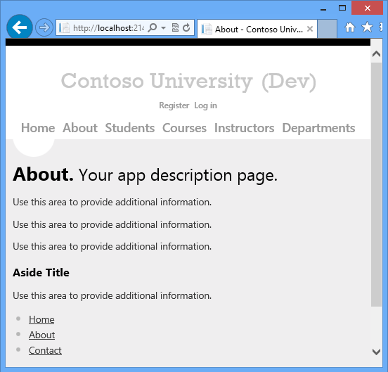
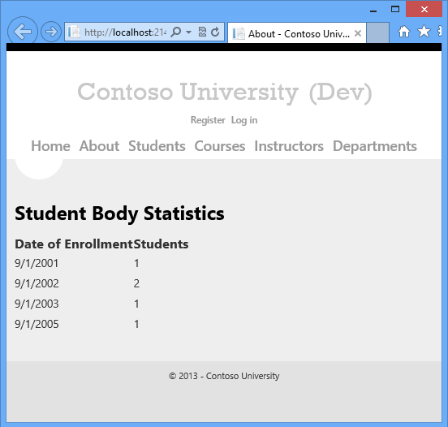
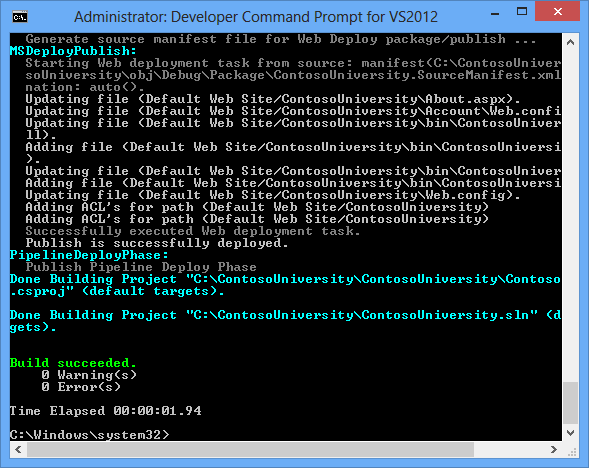
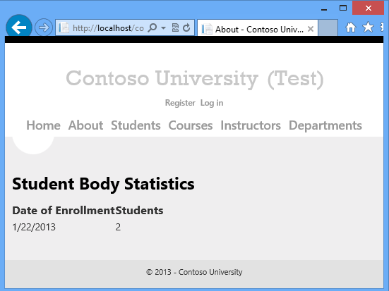
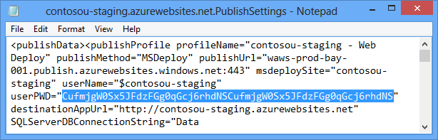

ASP.NET Web Deployment using Visual Studio: Command Line Deployment
====================
by [Tom Dykstra](https://github.com/tdykstra)

[Download Starter Project](http://go.microsoft.com/fwlink/p/?LinkId=282627)

> This tutorial series shows you how to deploy (publish) an ASP.NET web application to Azure App Service Web Apps or to a third-party hosting provider, by using Visual Studio 2012 or Visual Studio 2010. For information about the series, see [the first tutorial in the series](introduction.md).

## Overview

This tutorial shows you how to invoke the Visual Studio web publish pipeline from the command line. This is useful for scenarios where you want to [automate the deployment process](../../../../aspnet/overview/developing-apps-with-windows-azure/building-real-world-cloud-apps-with-windows-azure/continuous-integration-and-continuous-delivery.md) instead of doing it manually in Visual Studio, typically by using a [source code version control system](../../../../aspnet/overview/developing-apps-with-windows-azure/building-real-world-cloud-apps-with-windows-azure/source-control.md).

## Make a change to deploy

Currently the About page displays the template code.

You'll replace that with code that displays a summary of student enrollment.

Open the *About.aspx* page, delete all of the markup inside the `MainContent` `Content` element, and insert the following markup in its place:

[!code-aspx[Main](command-line-deployment/samples/sample1.aspx)]

Run the project and select the **About** page.

## Deploy to Test by using the command line

You won't be deploying another database change, so disable dbDacFx database deployment for the aspnet-ContosoUniversity database. Open the **Publish Web** wizard, and in each of the three publish profiles, clear the **Update Database** check box on the **Settings** tab.

In the Windows 8 Start page, search for **Developer Command Prompt for VS2012**.

Right-click the icon for **Developer Command Prompt for VS2012** and click **Run as administrator**.

Enter the following command at the command prompt, replacing the path to the solution file with the path to your solution file:

[!code-console[Main](command-line-deployment/samples/sample2.cmd)]

MSBuild builds the solution and deploys it to the test environment.

Open a browser and go to `http://localhost/ContosoUniversity`, then click the **About** page to verify that the deployment was successful.

If you haven't created any students in test, you'll see an empty page under the **Student Body Statistics** heading. Go to the **Students** page, click **Add Student**, and add some students, and then return to the **About** page to see student statistics.

## Key command line options

The command that you entered passed the solution file path and two properties to MSBuild:

[!code-console[Main](command-line-deployment/samples/sample3.cmd)]

### Deploying the solution versus deploying individual projects

Specifying the solution file causes all projects in the solution to be built. If you have multiple web projects in the solution, the following MSBuild behavior applies:

- The properties that you specify on the command line are passed to every project. Therefore, each web project must have a publish profile with the name that you specify. If you specify `/p:PublishProfile=Test`, each web project must have a publish profile named *Test*.
- You might successfully publish one project when another one doesn't even build. For more information, see the stackoverflow thread [MSBuild fails with two packages](http://stackoverflow.com/questions/14226451/msbuild-fails-with-two-packages).

If you specify an individual project instead of a solution, you have to add a parameter that specifies the Visual Studio version. If you are using Visual Studio 2012 the command line would be similar to the following example:

[!code-console[Main](command-line-deployment/samples/sample4.cmd?highlight=1)]

The version number for Visual Studio 2010 is 10.0. For more information, see [Visual Studio project compatability and VisualStudioVersion](http://sedodream.com/2012/08/19/VisualStudioProjectCompatabilityAndVisualStudioVersion.aspx) on Sayed Hashimi's blog.

### Specifying the publish profile

You can specify the publish profile by name or by the full path to the *.pubxml* file, as shown in the following example:

[!code-console[Main](command-line-deployment/samples/sample5.cmd?highlight=1)]

### Web publish methods supported for command-line publishing

Three publish methods are supported for command line publishing:

- `MSDeploy` - Publish by using Web Deploy.
- `Package` - Publish by creating a Web Deploy Package. You have to install the package separately from the MSBuild command that creates it.
- `FileSystem` - Publish by copying files to a specified folder.

### Specifying the build configuration and platform

The build configuration and platform must be set in Visual Studio or on the command line. The publish profiles include properties that are named `LastUsedBuildConfiguration` and `LastUsedPlatform`, but you can't set these properties in order to determine how the project is built. For more information, see [MSBuild: how to set the configuration property](http://sedodream.com/2012/10/27/MSBuildHowToSetTheConfigurationProperty.aspx) on Sayed Hashimi's blog.

## Deploy to staging

To deploy to Azure, you must add the password to the command line. If you saved the password in the publish profile in Visual Studio, it was stored in encrypted form in the your *.pubxml.user* file. That file is not accessed by MSBuild when you do a command line deployment, so you have to pass in the password in a command line parameter.

1. Copy the password that you need from the *.publishsettings* file that you downloaded earlier for the staging web site. The password is the value of the `userPWD` attribute for the Web Deploy `publishProfile` element.

    
2. In the Windows 8 Start page, search for **Developer Command Prompt for VS2012**, and click the icon to open the command prompt. (You don't have to open it as administrator this time because you aren't deploying to IIS on the local computer.)
3. Enter the following command at the command prompt, replacing the path to the solution file with the path to your solution file and the password with your password:

    [!code-console[Main](command-line-deployment/samples/sample6.cmd)]

    Notice that this command line includes an extra parameter: `/p:AllowUntrustedCertificate=true`. As this tutorial is being written, the `AllowUntrustedCertificate` property must be set when you publish to Azure from the command line. When the fix for this bug is released, you won't need that parameter.
4. Open a browser and go to the URL of your staging site, and then click the **About** page to verify that the deployment was successful.

    As you saw earlier for the test environment, you might have to create some students to see statistics on the **About** page.

## Deploy to production

The process for deploying to production is similar to the process for staging.

1. Copy the password that you need from the *.publishsettings* file that you downloaded earlier for the production web site.
2. Open **Developer Command Prompt for VS2012**.
3. Enter the following command at the command prompt, replacing the path to the solution file with the path to your solution file and the password with your password:

    [!code-console[Main](command-line-deployment/samples/sample7.cmd)]

    For a real production site, if there was also a database change, you would typically copy the *app\_offline.htm* file to the site before deployment and delete it after successful deployment.
4. Open a browser and go to the URL of your staging site, and then click the **About** page to verify that the deployment was successful.

## Summary

You have now deployed an application update by using the command line.

In the next tutorial, you will see an example of how to extend the web publish pipeline. The example will show you how to deploy files that are not included in the project.

>[!div class="step-by-step"]
[Previous](deploying-a-database-update.md)
[Next](deploying-extra-files.md)
