ASP.NET Web Deployment using Visual Studio: Deploying a Code Update
====================
by [Tom Dykstra](https://github.com/tdykstra)

[Download Starter Project](http://go.microsoft.com/fwlink/p/?LinkId=282627)

> This tutorial series shows you how to deploy (publish) an ASP.NET web application to Azure App Service Web Apps or to a third-party hosting provider, by using Visual Studio 2012 or Visual Studio 2010. For information about the series, see [the first tutorial in the series](introduction.md).

## Overview

After the initial deployment, your work of maintaining and developing your web site continues, and before long you will want to deploy an update. This tutorial takes you through the process of deploying an update to your application code. The update that you implement and deploy in this tutorial does not involve a database change; you'll see what's different about deploying a database change in the next tutorial.

Reminder: If you get an error message or something doesn't work as you go through the tutorial, be sure to check the [troubleshooting page](troubleshooting.md).

## Make a code change

As a simple example of an update to your application, you'll add to the **Instructors** page a list of courses taught by the selected instructor.

If you run the **Instructors** page, you'll notice that there are **Select** links in the grid, but they don't do anything other than make the row background turn gray.

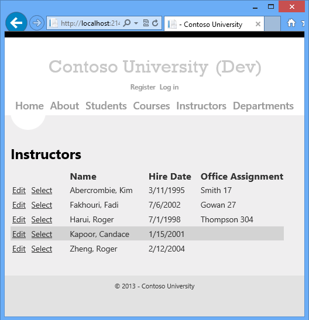

Now you'll add code that runs when the **Select** link is clicked and displays a list of courses taught by the selected instructor .

1. In *Instructors.aspx*, add the following markup immediately after the **ErrorMessageLabel** `Label` control:

    [!code-aspx[Main](deploying-a-code-update/samples/sample1.aspx)]
2. Run the page and select an instructor. You see a list of courses taught by that instructor.

    
3. Close the browser.

## Deploy the code update to the test environment

Before you can use your publish profiles to deploy to test, staging, and production, you need to change database publishing options. You no longer need to run the grant and data deployment scripts for the membership database.

1. Open the **Publish Web** wizard by right-clicking the ContosoUniversity project and clicking **Publish**.
2. Click the **Test** profile in the **Profile** drop-down list.
3. Click the **Settings** tab.
4. Under **DefaultConnection** in the **Databases** section, clear the **Update database** check box.
5. Click the **Profile** tab, and then click the **Staging** profile in the **Profile** drop-down list.
6. When you are asked if you want to save the changes made to the **Test** profile, click **Yes**.
7. Make the same change in the Staging profile.
8. Repeat the process to make the same change in the Production profile.
9. Close the **Publish Web** wizard.

Deploying to the test environment is now a simple matter of running one-click publish again. To make this process quicker, you can use the **Web One Click Publish** toolbar.

1. In the **View** menu, choose **Toolbars** and then select **Web One Click Publish**.

    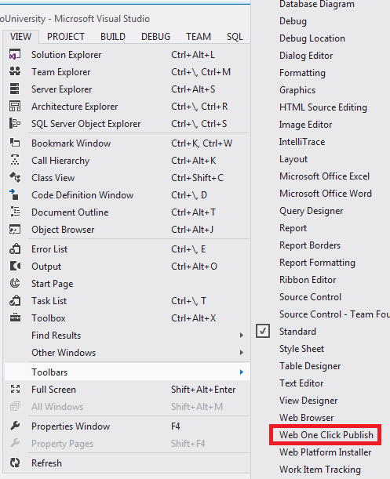
2. In **Solution Explorer**, select the ContosoUniversity project.
3. the **Web One Click Publish** toolbar, choose the **Test** publish profile and then click **Publish Web** (the icon with arrows pointing left and right).

    
4. Visual Studio deploys the updated application, and the browser automatically opens to the home page.
5. Run the Instructors page and select an instructor to verify that the update was successfully deployed.

You would normally also do regression testing (that is, test the rest of the site to make sure that the new change didn't break any existing functionality). But for this tutorial you'll skip that step and proceed to deploy the update to staging and production.

When you redeploy, Web Deploy automatically determines which files have changed and only copies changed files to the server. By default, Web Deploy uses last-changed dates on files to determine which ones have changed. Some source control systems change file dates even when you don't change the file contents. In that case, you might want to configure Web Deploy to use file checksums to determine which files have changed. For more information, see [Why do all of my files get redeployed although I didn't change them?](https://msdn.microsoft.com/en-us/library/ee942158.aspx#use_checksum) in the ASP.NET Deployment FAQ.

## Take the application offline during deployment

The change you're deploying now is a simple change to a single page. But sometimes you deploy larger changes, or you deploy both code and database changes, and the site might behave incorrectly if a user requests a page before deployment is finished. To prevent users from accessing the site while deployment is in progress, you can use an *app\_offline.htm* file. When you put a file named *app\_offline.htm* in the root folder of your application, IIS automatically displays that file instead of running your application. So to prevent access during deployment, you put *app\_offline.htm* in the root folder, run the deployment process, and then remove *app\_offline.htm* after successful deployment.

You can configure Web Deploy to automatically put a default *app\_offline.htm* file on the server when it starts deploying and remove it when it finishes. To do that all you have to do is add the following XML element to your publish profile (.pubxml) file:

[!code-xml[Main](deploying-a-code-update/samples/sample2.xml)]

For this tutorial you'll see how to create and use a custom *app\_offline.htm* file.

Using *app\_offline.htm* in the staging site isn't required, because you don't have users accessing the staging site. But it's a good practice to use staging to test everything the way you plan to deploy in production.

### Create app\_offline.htm

1. In **Solution Explorer**, right-click the solution and click **Add**, and then click **New Item**.
2. Create an **HTML Page** named *app\_offline.htm* (delete the final "l" in the *.html* extension that Visual Studio creates by default).
3. Replace the template markup with the following markup:

    [!code-html[Main](deploying-a-code-update/samples/sample3.html)]
4. Save and close the file.

### Copy app\_offline.htm to the root folder of the web site

You can use any FTP tool to copy files to the web site. [FileZilla](http://filezilla-project.org/) is a popular FTP tool and is shown in the screen shots.

To use an FTP tool, you need three things: the FTP URL, the user name, and the password.

The URL is shown on the web site's dashboard page in the Azure Management Portal, and the user name and password for FTP can be found in the *.publishsettings* file that you downloaded earlier. The following steps show how to get these values.

1. In the Azure Management Portal, click **Web Sites** tab and then click the staging web site.
2. On the **Dashboard** page, scroll down to find the FTP host name in the **Quick Glance** section.

    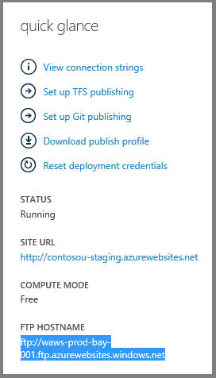
3. Open the staging *.publishsettings* file in Notepad or another text editor.
4. Find the `publishProfile` element for the FTP profile.
5. Copy the `userName` and `userPWD` values.

    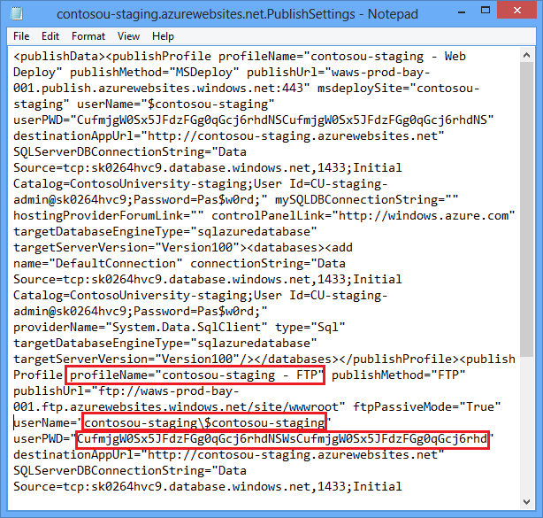
6. Open your FTP tool and log on to the FTP URL.
7. Copy *app\_offline.htm* from the solution folder to the */site/wwwroot* folder in the staging site.

    
8. Browse to your staging site's URL. You see that the *app\_offline.htm* page is now displayed instead of your home page.

    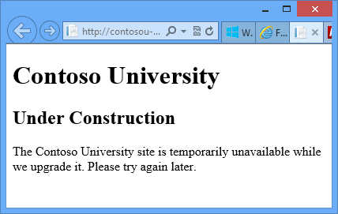

You are now ready to deploy to staging.

## Deploy the code update to staging and production

1. In the **Web One Click Publish** toolbar, choose the **Staging** publish profile and then click **Publish Web**.

    Visual Studio deploys the updated application and opens the browser to the site's home page. The *app\_offline.htm* file is displayed. Before you can test to verify successful deployment, you must remove the *app\_offline.htm* file.
2. Return to your FTP tool, and delete **app\_offline.htm** from the staging site.
3. In the browser, open the Instructors page in the staging site, and select an instructor to verify that the update was successfully deployed.
4. Follow the same procedure for production as you did for staging.

## Reviewing Changes and Deploying Specific Files

Visual Studio 2012 also gives you the ability to deploy individual files. For a selected file you can view differences between the local version and the deployed version, deploy the file to the destination environment, or copy the file from the destination environment to the local project. In this section of the tutorial you see how to use these features.

### Make a change to deploy

1. Open *Content/Site.css*, and find the block for the `body` tag.
2. Change the value for `background-color` from `#fff` to `darkblue`.

    [!code-css[Main](deploying-a-code-update/samples/sample4.css?highlight=2)]

### View the change in the Publish Preview window

When you use the **Publish Web** wizard to publish the project, you can see what changes are going to be published by double-clicking the file in the **Preview** window.

1. Right-click the ContosoUniversity project and click **Publish**.
2. From the **Profile** drop-down list, select the **Test** publish profile.
3. Click **Preview**, and then click **Start Preview**.
4. In the **Preview** pane, double-click **Site.css**.

    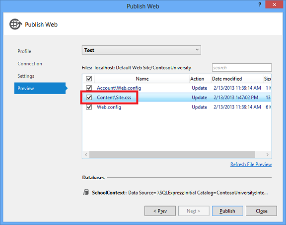

    The **Preview changes** dialog shows a preview of the changes that will be deployed.

    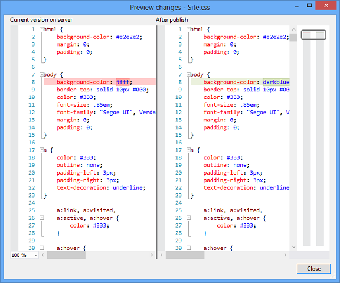

    If you double-click the *Web.config* file, the **Preview changes** dialog shows the effect of your build configuration transformations and publish profile transformations. At this point you have not done anything that would cause the *Web.config* file on the server to change, so you expect to see no changes. However, the **Preview changes** window incorrectly shows two changes. It looks like two XML elements will be removed. These elements are added by the publish process when you select **Execute Code First Migrations on application start** for a Code First context class. The comparison is done before the publish process adds those elements, so it looks like they are being removed although they will not be removed. This error will be corrected in a future release.
5. Click **Close**.
6. Click **Publish**.
7. When the browser opens to the home page of the Test site, press CTRL+F5 to cause a hard refresh in order to see the effect of the CSS change.

    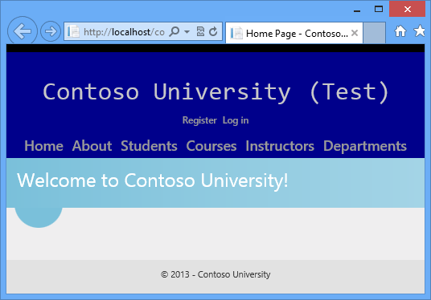
8. Close the browser.

### Publish specific files from Solution Explorer

Suppose you don't like the blue background and want to revert to the original color. In this section you'll restore the original settings by publishing a specific file directly from **Solution Explorer**.

1. Open *Content/Site.css* and restore the `background-color` setting to `#fff`.
2. In **Solution Explorer**, right-click the *Content/Site.css* file.

    The context menu shows three publish options.

    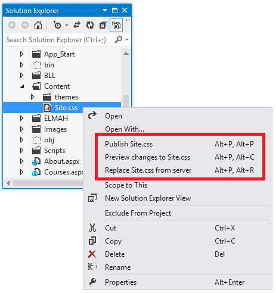
3. Click **Preview changes to Site.css**.

    A window opens to show the differences between the local file and the version of it in the destination environment.

    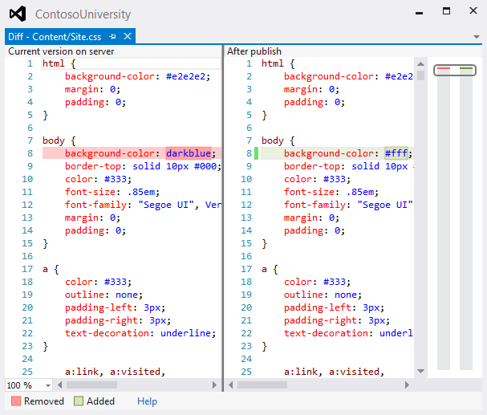
4. In **Solution Explorer**, right-click **Site.css** again and click **Publish Site.css**.

    The **Web Publish Activity** window shows that the file has been published.

    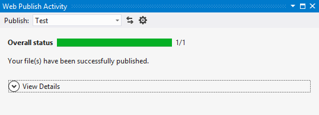
5. Open a browser to the `http://localhost/contosouniversity` URL, and then press CTRL+F5 to cause a hard refresh in order to see the effect of the CSS change.

    
6. Close the browser.

## Summary

You've now seen several ways to deploy an application update that does not involve a database change, and you've seen how to preview the changes to verify that what will be updated is what you expect. The Instructors page now has a **Courses Taught** section.

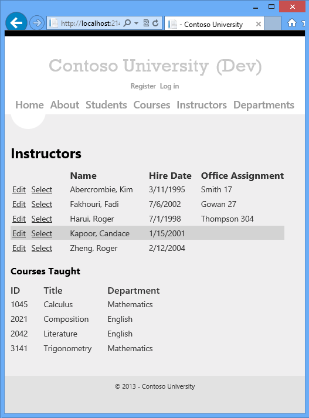

The next tutorial shows you how to deploy a database change: you'll add a birthdate field to the database and to the Instructors page.

>[!div class="step-by-step"]
[Previous](deploying-to-production.md)
[Next](deploying-a-database-update.md)