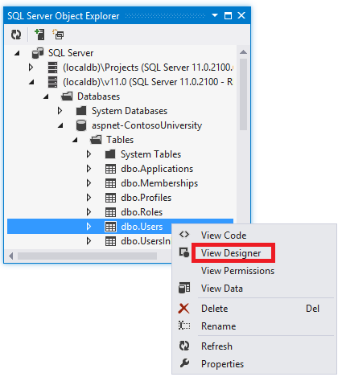
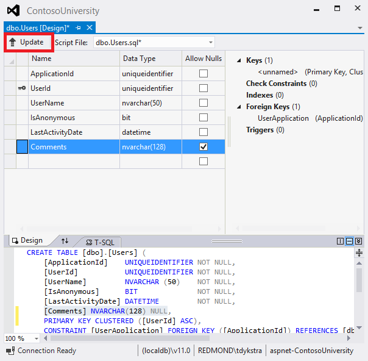
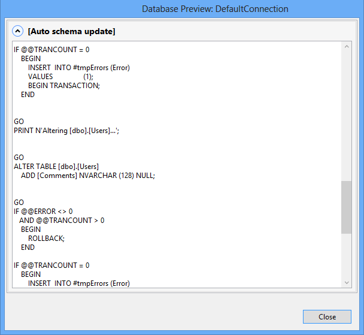
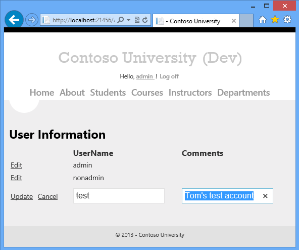

ASP.NET Web Deployment using Visual Studio: Deploying a Database Update
====================
by [Tom Dykstra](https://github.com/tdykstra)

[Download Starter Project](http://go.microsoft.com/fwlink/p/?LinkId=282627)

> This tutorial series shows you how to deploy (publish) an ASP.NET web application to Azure App Service Web Apps or to a third-party hosting provider, by using Visual Studio 2012 or Visual Studio 2010. For information about the series, see [the first tutorial in the series](introduction.md).

## Overview

In this tutorial, you make a database change and related code changes, test the changes in Visual Studio, then deploy the update to the test, staging, and production environments.

The tutorial first shows how to update a database that is managed by Code First Migrations, and then later it shows how to update a database by using the dbDacFx provider.

Reminder: If you get an error message or something doesn't work as you go through the tutorial, be sure to check the [troubleshooting page](troubleshooting.md).

## Deploy a database update by using Code First Migrations

In this section, you add a birth date column to the `Person` base class for the `Student` and `Instructor` entities. Then you update the page that displays instructor data so that it displays the new column. Finally, you deploy the changes to test, staging, and production.

### Add a column to a table in the application database

1. In the *ContosoUniversity.DAL* project, open *Person.cs* and add the following property at the end of the `Person` class (there should be two closing curly braces following it):

    [!code-csharp[Main](deploying-a-database-update/samples/sample1.cs)]

    Next, update the `Seed` method so that it provides a value for the new column. Open *Migrations\Configuration.cs* and replace the code block that begins `var instructors = new List<Instructor>` with the following code block which includes birth date information:

    [!code-csharp[Main](deploying-a-database-update/samples/sample2.cs)]
2. Build the solution, and then open the **Package Manager Console** window. Make sure that ContosoUniversity.DAL is still selected as the **Default project**.
3. In the **Package Manager Console** window, select **ContosoUniversity.DAL** as the **Default project**, and then enter the following command:

    [!code-powershell[Main](deploying-a-database-update/samples/sample3.ps1)]

    When this command finishes, Visual Studio opens the class file that defines the new `DbMIgration` class, and in the `Up` method you can see the code that creates the new column. The `Up` method creates the column when you are implementing the change, and the `Down` method deletes the column when you are rolling back the change.

    
4. Build the solution, and then enter the following command in the **Package Manager Console** window (make sure the ContosoUniversity.DAL project is still selected):

    [!code-powershell[Main](deploying-a-database-update/samples/sample4.ps1)]

    The Entity Framework runs the `Up` method and then runs the `Seed` method.

### Display the new column in the Instructors page

1. In the ContosoUniversity project, open *Instructors.aspx* and add a new template field to display the birth date. Add it between the ones for hire date and office assignment:

    [!code-aspx[Main](deploying-a-database-update/samples/sample5.aspx?highlight=9-17)]

    (If code indentation gets out of sync, you can press CTRL-K and then CTRL-D to automatically reformat the file.)
2. Run the application and click the **Instructors** link.

    When the page loads, you see that it has the new birth date field.

    
3. Close the browser.

### Deploy the database update

1. In **Solution Explorer** select the ContosoUniversity project.
2. In the **Web One Click Publish** toolbar, click the **Test** publish profile, and then click **Publish Web**. (If the toolbar is disabled, select the ContosoUniversity project in **Solution Explorer**.)

    Visual Studio deploys the updated application, and the browser opens to the home page.
3. Run the **Instructors** page to verify that the update was successfully deployed.

    When the application tries to access the database for this page, Code First updates the database schema and runs the `Seed` method. When the page displays, you see the expected **Birth Date** column with dates in it.
4. In the **Web One Click Publish** toolbar, click the **Staging** publish profile, and then click **Publish Web**.
5. Run the **Instructors** page in staging to verify that the update was successfully deployed.
6. In the **Web One Click Publish** toolbar, click the **Production** publish profile, and then click **Publish Web**.
7. Run the **Instructors** page in production to verify that the update was successfully deployed.

    For a a real production application update that includes a database change you would also typically take the application offline during deployment by using *app\_offline.htm*, as you saw in the previous tutorial.

## Deploy a database update by using the dbDacFx provider

In this section, you add a *Comments* column to the *User* table in the membership database and create a page that lets you display and edit comments for each user. Then you deploy the changes to test, staging, and production.

### Add a column to a table in the membership database

1. In Visual Studio, open **SQL Server Object Explorer**.
2. Expand **(localdb)\v11.0**, expand **Databases**, expand **aspnet-ContosoUniversity** (not **aspnet-ContosoUniversity-Prod**) and then expand **Tables**.

    If you don't see **(localdb)\v11.0** under the **SQL Server** node, right-click the **SQL Server** node and click **Add SQL Server**. In the **Connect to Server** dialog box enter *(localdb)\v11.0* as the **Server name**, and then click **Connect**.

    If you don't see **aspnet-ContosoUniversity**, run the project and log in using the *admin* credentials (password is *devpwd*), and then refresh the **SQL Server Object Explorer** window.
3. Right-click the **Users** table, and then click **View Designer**.

    
4. In the designer, add a *Comments* column and make it *nvarchar(128)* and nullable, and then click **Update**.

    
5. In the **Preview Database Updates** box, click **Update Database**.

    

### Create a page to display and edit the new column

1. In **Solution Explorer**, right-click the **Account** folder in the ContosoUniversity project, click **Add**, and then click **New Item**.
2. Create a new **Web Form Using Master Page** and name it *UserInfo.aspx*. Accept the default *Site.Master* file as the master page.
3. Copy the following markup into the `MainContent` `Content` element (the last of the 3 `Content` elements):

    [!code-aspx[Main](deploying-a-database-update/samples/sample6.aspx)]
4. Right-click the *UserInfo.aspx* page and click **View in Browser**.
5. Log in with your *admin* user credentials (password is *devpwd*) and add some comments to a user to verify that the page works correctly.

    
6. Close the browser.

## Deploy the database update

To deploy by using the dbDacFx provider, you just need to select the **Update database** option in the publish profile. However, for the initial deployment when you used this option you also configured some additional SQL scripts to run: those are still in the profile and you'll have to prevent them from running again.

1. Open the **Publish Web** wizard by right-clicking the ContosoUniversity project and clicking **Publish**.
2. Select the **Test** profile.
3. Click the **Settings** tab.
4. Under **DefaultConnection**, select **Update database**.
5. Disable the additional scripts that you configured to run for the initial deployment:

    1. Click **Configure database updates**.
    2. In the **Configure Database Updates** dialog box, clear the check boxes next to *Grant.sql* and *aspnet-data-dev.sql*.
    3. Click **Close**.
6. Click the **Preview** tab.
7. Under **Databases** and to the right of **DefaultConnection**, click the **Preview database** link.

    

    The preview window shows the script that will be run in the destination database to make that database schema match the schema of the source database. The script includes an ALTER TABLE command that adds the new column.
8. Close the **Database Preview** dialog box, and then click **Publish**.

    Visual Studio deploys the updated application, and the browser opens to the home page.
9. Run the UserInfo page (add *Account/UserInfo.aspx* to the home page URL) to verify that the update was successfully deployed. You'll have to log in by entering *admin* and *devpwd*.

    Data in tables is not deployed by default, and you didn't configure a data deployment script to run, so you won't find the comment that you added in development. You can add a new comment now in staging to verify that the change was deployed to the database and the page works correctly.
10. Follow the same procedure to deploy to staging and production.

    Don't forget to disable the extra scripts. The only difference compared to the Test profile is that you will disable only one script in the Staging and Production profiles because they were configured to run only *aspnet-prod-data.sql*.

    The credentials for staging and production are admin and prodpwd.

    For a real production application update that includes a database change you would also typically take the application offline during deployment by uploading *app\_offline.htm* before publishing and deleting it afterward, as you saw in [the previous tutorial](deploying-a-code-update.md).

## Summary

You've now deployed an application update that included a database change using both Code First Migrations and the dbDacFx provider.

The next tutorial shows you how to execute deployments by using the command line.

>[!div class="step-by-step"]
[Previous](deploying-a-code-update.md)
[Next](command-line-deployment.md)