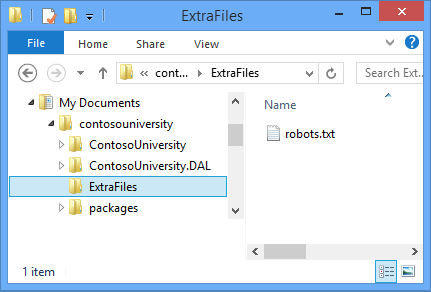

ASP.NET Web Deployment using Visual Studio: Deploying Extra Files
====================
by [Tom Dykstra](https://github.com/tdykstra)

[Download Starter Project](http://go.microsoft.com/fwlink/p/?LinkId=282627)

> This tutorial series shows you how to deploy (publish) an ASP.NET web application to Azure App Service Web Apps or to a third-party hosting provider, by using Visual Studio 2012 or Visual Studio 2010. For information about the series, see [the first tutorial in the series](introduction.md).

## Overview

This tutorial shows how to extend the Visual Studio web publish pipeline to do an additional task during deployment. The task is to copy extra files that are not in the project folder to the destination web site.

For this tutorial you'll copy one extra file: *robots.txt*. You want to deploy this file to staging but not to production. In [the Deploying to Production](deploying-to-production.md) tutorial, you added this file to the project and configured the Production publish profile to exclude it. In this tutorial you'll see an alternative method to handle this situation, one that will be useful for any files that you want to deploy but don't want to include in the project.

## Move the robots.txt file

To prepare for a different method of handling *robots.txt*, in this section of the tutorial you move the file to a folder that is not included in the project, and you delete *robots.txt* from the staging environment. It is necessary to delete the file from staging so that you can verify that your new method of deploying the file to that environment is working correctly.

1. In **Solution Explorer**, right-click the *robots.txt* file and click **Exclude From Project**.
2. Using Windows File Explorer, create a new folder in the solution folder and name it *ExtraFiles*.
3. Move the *robots.txt* file from the *ContosoUniversity* project folder to the *ExtraFiles* folder.

    
4. Using your FTP tool, delete the *robots.txt* file from the staging web site.

    As an alternative, you can select **Remove additional files at destination** under **File Publish Options** on the **Settings** tab of the Staging publish profile, and republish to staging.

## Update the publish profile file

You only need *robots.txt* in staging, so the only publish profile you need to update in order to deploy it is Staging.

1. In Visual Studio, open *Staging.pubxml*.
2. At the end of the file, before the closing `</Project>` tag, add the following markup:

    [!code-xml[Main](deploying-extra-files/samples/sample1.xml)]

    This code creates a new *target* that will collect additional files to be deployed. A target is composed of one or more tasks that MSBuild will execute based on conditions you specify.

    The `Include` attribute specifies that the folder in which to find the files is *ExtraFiles*, located at the same level as the project folder. MSBuild will collect all files from that folder and recursively from any subfolders (the double asterisk specifies recursive subfolders). With this code you could put multiple files, and files in subfolders inside the *ExtraFiles* folder, and all will be deployed.

    The `DestinationRelativePath` element specifies that the folders and files should be copied to the root folder of the destination web site, in the same file and folder structure as they are found in the *ExtraFiles* folder. If you wanted to copy the *ExtraFiles* folder itself, the `DestinationRelativePath` value would be *ExtraFiles\%(RecursiveDir)%(Filename)%(Extension)*.
3. At the end of the file, before the closing `</Project>` tag, add the following markup that specifies when to execute the new target.

    [!code-xml[Main](deploying-extra-files/samples/sample2.xml)]

    This code causes the new `CustomCollectFiles` target to be executed whenever the target that copies files to the destination folder is executed. There is a separate target for publish versus deployment package creation, and the new target is injected in both targets in case you decide to deploy by using a deployment package instead of publishing.

    The *.pubxml* file now looks like the following example:

    [!code-xml[Main](deploying-extra-files/samples/sample3.xml?highlight=53-71)]
4. Save and close the *Staging.pubxml* file.

## Publish to staging

Using one-click publish or the command line, publish the application by using the Staging profile.

If you use one-click publish, you can verify in the **Preview** window that *robots.txt* will be copied. Otherwise, use your FTP tool to verify that the *robots.txt* file is in the root folder of the web site after deployment.

## Summary

This completes this series of tutorials on deploying an ASP.NET web application to a third-party hosting provider. For more information about any of the topics covered in these tutorials, see the [ASP.NET Deployment Content Map](https://go.microsoft.com/fwlink/p/?LinkId=282413).

## More information

If you know how to work with MSBuild files, you can automate many other deployment tasks by writing code in *.pubxml* files (for profile-specific tasks) or the project *.wpp.targets* file (for tasks that apply to all profiles). For more information about *.pubxml* and *.wpp.targets* files, see [How to: Edit Deployment Settings in Publish Profile (.pubxml) Files and the .wpp.targets File in Visual Studio Web Projects](https://msdn.microsoft.com/en-us/library/ff398069). For a basic introduction to MSBuild code, see **The Anatomy of a Project File** in [Enterprise Deployment Series: Understanding the Project File](../web-deployment-in-the-enterprise/understanding-the-project-file.md). To learn how to work with MSBuild files to perform tasks for your own scenarios, see this book: [Inside the Microsoft Build Engine: Using MSBuild and Team Foundation Build](http://msbuildbook.com) by Sayed Ibraham Hashimi and William Bartholomew.

## Acknowledgements

I would like to thank the following people who made significant contributions to the content of this tutorial series:

- [Alberto Poblacion, MVP &amp; MCT, Spain](https://mvp.microsoft.com/en-us/mvp/Alberto%20Poblacion%20Bolano-36772)
- Jarod Ferguson, Data Platform Development MVP, United States
- Harsh Mittal, Microsoft
- [Jon Galloway](https://weblogs.asp.net/jgalloway) (twitter: [@jongalloway](http://twitter.com/jongalloway))
- [Kristina Olson, Microsoft](https://blogs.iis.net/krolson/default.aspx)
- [Mike Pope, Microsoft](http://www.mikepope.com/blog/DisplayBlog.aspx)
- Mohit Srivastava, Microsoft
- [Raffaele Rialdi, Italy](http://www.iamraf.net/)
- [Rick Anderson, Microsoft](https://blogs.msdn.com/b/rickandy/)
- [Sayed Hashimi, Microsoft](http://sedodream.com/default.aspx)(twitter: [@sayedihashimi](http://twitter.com/sayedihashimi))
- [Scott Hanselman](http://www.hanselman.com/blog/) (twitter: [@shanselman](http://twitter.com/shanselman))
- [Scott Hunter, Microsoft](https://blogs.msdn.com/b/scothu/) (twitter: [@coolcsh](http://twitter.com/coolcsh))
- [Srđan Božović, Serbia](http://msforge.net/blogs/zmajcek/)
- [Vishal Joshi, Microsoft](http://vishaljoshi.blogspot.com/) (twitter: [@vishalrjoshi](http://twitter.com/vishalrjoshi))

>[!div class="step-by-step"]
[Previous](command-line-deployment.md)
[Next](troubleshooting.md)