ASP.NET Web Deployment using Visual Studio: Deploying to Test
====================
by [Tom Dykstra](https://github.com/tdykstra)

[Download Starter Project](http://go.microsoft.com/fwlink/p/?LinkId=282627)

> This tutorial series shows you how to deploy (publish) an ASP.NET web application to Azure App Service Web Apps or to a third-party hosting provider, by using Visual Studio 2012 or Visual Studio 2010. For information about the series, see [the first tutorial in the series](introduction.md).

## Overview

This tutorial shows how to deploy an ASP.NET web application to IIS on the local computer.

When you develop an application, you generally test by running it in Visual Studio. By default, web application projects in Visual Studio 2012 use IIS Express as the development web server. IIS Express behaves more like full IIS than the Visual Studio Development Server (also known as Cassini), which Visual Studio 2010 uses by default. But neither development web server works exactly like IIS. As a result, it's possible that an application will run correctly when you test it in Visual Studio, but fail when it's deployed to IIS.

You can test your application more reliably in these ways:

1. Deploy the application to IIS on your development computer by using the same process that you'll use later to deploy it to your production environment. You can configure Visual Studio to use IIS when you run a web project, but doing that would not test your deployment process. This method validates your deployment process in addition to validating that your application will run correctly under IIS.
2. Deploy the application to a test environment that is nearly identical to your production environment. Since the production environment for these tutorials is Web Apps in Azure App Service, the ideal test environment is an additional web app created in Azure App Service. You would use this second web app only for testing, but it would be set up the same way as the production web app.

Option 2 is the most reliable way to test, and if you do that, you don't necessarily have to do option 1. However, if you are deploying to a third-party hosting provider option 2 might not be feasible or might be expensive, so this tutorial series shows both methods. Guidance for option 2 is provided in the [Deploying to the Production Environment](deploying-to-production.md) tutorial.

For more information about using web servers in Visual Studio, see [Web Servers in Visual Studio for ASP.NET Web Projects](https://msdn.microsoft.com/en-us/library/58wxa9w5.aspx).

Reminder: If you get an error message or something doesn't work as you go through the tutorial, be sure to check the [troubleshooting page](troubleshooting.md).

## Install IIS

To deploy to IIS on your development computer, you must have IIS and Web Deploy installed. Web Deploy is installed by default with Visual Studio, but IIS is not included in the default Windows 8 or Windows 7 configuration. If you have already installed IIS and the default application pool is already set to .NET 4, skip to [the next section](#sqlexpress).

1. Using the [Web Platform Installer](https://www.microsoft.com/web/downloads/platform.aspx) is the preferred way to install IIS and Web Deploy, because the Web Platform Installer installs a recommended configuration for IIS and it automatically installs the prerequisites for IIS and Web Deploy if necessary.

    To run Web Platform Installer to install IIS and Web Deploy, use the following link. If you already have installed IIS, Web Deploy or any of their required components, the Web Platform Installer installs only what is missing.

    - [Install IIS and Web Deploy using WebPI](https://www.microsoft.com/web/gallery/install.aspx?appsxml=&amp;appid=IIS7;ASPNET;NETFramework4;WDeploy)

    You'll see messages indicating that IIS 7 will be installed. The link works for IIS 8 in Windows 8, but for Windows 8 make sure that ASP.NET 4.5 is installed by performing the following steps:

    1. Open **Control Panel**, **Programs and Features**, **Turn Windows features on or off**.
    2. Expand **Internet Information Services**, **World Wide Web Services**, and **Application Development Features**.
    3. Make sure that **ASP.NET 4.5** is selected.

        

After installing IIS, run **IIS Manager** to make sure that the .NET Framework version 4 is assigned to the default application pool.

1. Press WINDOWS+R to open the **Run** dialog box.

    (Or in Windows 8 enter "run" on the **Start** page, or in Windows 7 select **Run** from the **Start** menu. If **Run** isn't in the **Start** menu, right-click the taskbar, click **Properties**, select the **Start Menu** tab, click **Customize**, and select **Run command**.)
2. Enter "inetmgr", and then click **OK**.
3. In the **Connections** pane, expand the server node and select **Application Pools**. In the **Application Pools** pane, if **DefaultAppPool** is assigned to the .NET framework version 4 as in the following illustration, skip to the next section.

    
4. If you see only two application pools and both of them are set to the .NET Framework 2.0, you have to install ASP.NET 4 in IIS.

    For Windows 8, see the instructions in the previous section for making sure that ASP.NET 4.5 is installed, or see [this KB article](https://support.microsoft.com/kb/2736284). For Windows 7, open a command prompt window by right-clicking **Command Prompt** in the Windows **Start** menu and selecting **Run as Administrator**. Then run [aspnet\_regiis.exe](https://msdn.microsoft.com/en-us/library/k6h9cz8h.aspx) to install ASP.NET 4 in IIS, using the following commands. (In 32-bit systems, replace "Framework64" with "Framework".)

    [!code-console[Main](deploying-to-iis/samples/sample1.cmd)]

    This command creates new application pools for the .NET Framework 4, but the default application pool will still be set to 2.0. You'll be deploying an application that targets .NET 4 to that application pool, so you have to change the application pool to .NET 4.
5. If you closed **IIS Manager**, run it again, expand the server node, and click **Application Pools** to display the **Application Pools** pane again.
6. In the **Application Pools** pane, click **DefaultAppPool**, and then in the **Actions** pane click **Basic Settings**.

    
7. In the **Edit Application Pool** dialog box, change **.NET Framework version** to **.NET Framework v4.0.30319** and click **OK**.

    

IIS is now ready for you to publish a web application to it, but before you can do that you have to create the databases that you will use in the test environment.

## Install SQL Server Express

LocalDB is not designed to work in IIS, so for your test environment you need to have SQL Server Express installed. If you are using Visual Studio 2010 SQL Server Express is already installed by default. If you are using Visual Studio 2012, you have to install it.

To install SQL Server Express, install it from [Download Center: Microsoft SQL Server 2012 Express](https://www.microsoft.com/en-us/download/details.aspx?id=29062) by clicking [ENU\x64\SQLEXPR\_x64\_ENU.exe](https://download.microsoft.com/download/8/D/D/8DD7BDBA-CEF7-4D8E-8C16-D9F69527F909/ENU/x64/SQLEXPR_x64_ENU.exe) or [ENU\x86\SQLEXPR\_x86\_ENU.exe](https://download.microsoft.com/download/8/D/D/8DD7BDBA-CEF7-4D8E-8C16-D9F69527F909/ENU/x86/SQLEXPR_x86_ENU.exe). If you choose the wrong one for your system it will fail to install and you can try the other one.

On the first page of the SQL Server Installation Center, click **New SQL Server stand-alone installation or add features to an existing installation**, and follow the instructions, accepting the default choices. In the installation wizard accept the default settings. For more information about installation options, see [Install SQL Server 2012 from the Installation Wizard (Setup)](https://msdn.microsoft.com/en-us/library/ms143219.aspx).

## Create SQL Server Express databases for the test environment

The Contoso University application has two databases: the membership database and the application database. You can deploy these databases to two separate databases or to a single database. You might want to combine them in order to facilitate database joins between your application database and your membership database. If you are deploying to a third-party hosting provider, your hosting plan might also provide a reason to combine them. For example, the hosting provider might charge more for multiple databases or might not even allow more than one database.

In this tutorial, you'll deploy to two databases in the test environment, and to one database in the staging and production environments.

From the **View** menu in Visual Studio select **Server Explorer** (**Database Explorer** in Visual Web Developer), and then right-click **Data Connections** and select **Create New SQL Server Database**.

In the **Create New SQL Server Database** dialog box, enter ".\SQLExpress" in the **Server name** box and "aspnet-ContosoUniversity" in the **New database name** box, then click **OK**.

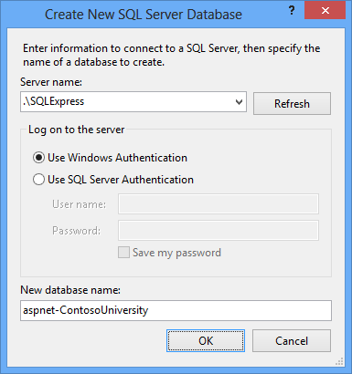

Follow the same procedure to create a new SQL Server Express School database named "ContosoUniversity".

**Server Explorer** now shows the two new databases.

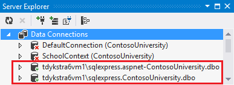

## Create a grant script for the new databases

When the application runs in IIS on your development computer, the application accesses the database by using the default application pool's credentials. However, by default, the application pool identity does not have permission to open the databases. So you have to run a script to grant that permission. In this section you create the script that you'll run later to make sure that the application can open the databases when it runs in IIS.

Right-click the solution (not one of the projects), and click **Add New Item**, and then create a new **SQL File** named *Grant.sql*. Copy the following SQL commands into the file, and then save and close the file:

[!code-sql[Main](deploying-to-iis/samples/sample2.sql)]

> [!NOTE]
> This script is designed to work with SQL Server Express 2012 and with the IIS settings in Windows 8 or Windows 7 as they are specified in this tutorial. If you're using a different version of SQL Server or of Windows, or if you set up IIS on your computer differently, changes to this script might be required. For more information about SQL Server scripts, see [SQL Server Books Online](https://go.microsoft.com/fwlink/?LinkId=132511).

> [!NOTE] 
> 
> **Security Note** This script gives db\_owner permissions to the user that accesses the database at run time, which is what you'll have in the production environment. In some scenarios you might want to specify a user that has full database schema update permissions only for deployment, and specify for run time a different user that has permissions only to read and write data. For more information, see [Reviewing the Automatic Web.config Changes for Code First Migrations](#reviewingmigrations) later in this tutorial.

## Run the grant script in the application database

You can configure the publish profile to run the grant script in the membership database during deployment because that database deployment uses the dbDacFx provider. You can't run scripts during Code First Migrations deployment, which is how you're deploying the application database. Therefore, you have to manually run the script before deployment in the application database.

1. In Visual Studio, open the *Grant.sql* file that you created earlier.
2. Click **Connect**. 

    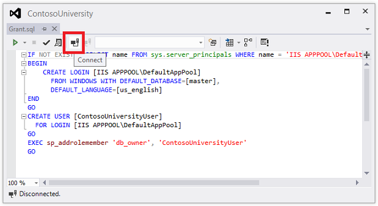
3. In the **Connect to Server** dialog box, enter *.\SQLExpress* as the **Server Name**, and then click **Connect**.
4. In the database drop-down list select **ContosoUniversity**, and then click **Execute**. 

    

The default application pool identity now has sufficient permissions in the application database for Code First Migrations to create the database tables when the application runs.

## Publish to IIS

There are several ways you can deploy to IIS using Visual Studio and Web Deploy:

- Use Visual Studio one-click publish.
- Publish from the command line.
- Create a *deployment package* and install it using the IIS Manager UI. The deployment package consists of a *.zip* file that contains all the files and metadata needed to install a site in IIS.
- Create a deployment package and install it using the command line.

The process you went through in the previous tutorials to set up Visual Studio to automate deployment tasks applies to all of these methods. In these tutorials you'll use the first two of these methods. For information about using deployment packages, see [Deploying a web application by creating and installing a web deployment package](https://go.microsoft.com/fwlink/p/?LinkId=282413#package) in the Web Deployment Content Map for Visual Studio and ASP.NET.

Before publishing, make sure that you are running Visual Studio in administrator mode. If you don't see **(Administrator)** in the title bar, close Visual Studio. In the Windows 8 **Start** page or the Windows 7 **Start** menu, right-click the icon for the version of Visual Studio you're using and select **Run as Administrator**. Administrator mode is required for publishing only when you are publishing to IIS on the local computer.

### Create the publish profile

1. In **Solution Explorer**, right-click the ContosoUniversity project (not the ContosoUniversity.DAL project) and select **Publish**.

    The **Publish Web** wizard appears.

    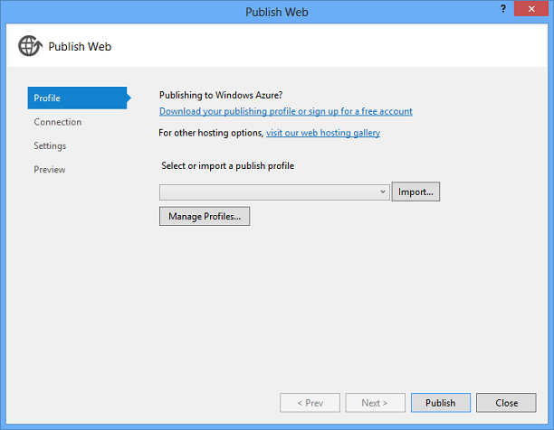
2. In the drop-down list, select **&lt;New...&gt;**. (With the latest Visual Studio update installed, there is no drop-down list, and the button to click in order to create a new profile from scratch is **Custom**.)
3. In the **New Profile** dialog box, enter "Test", and then click **OK**.

    The wizard automatically advances to the **Connection** tab.
4. In the **Service URL** box, enter *localhost*.
5. In the **Site/application** box, enter *Default Web Site/ContosoUniversity*
6. In the **Destination URL** box, enter `http://localhost/ContosoUniversity`

    The **Destination URL** setting isn't required. When Visual Studio finishes deploying the application, it automatically opens your default browser to this URL. If you don't want the browser to open automatically after deployment, leave this box blank.
7. Click **Validate Connection** to verify that the settings are correct and you can connect to IIS on the local computer.

    A green check mark verifies that the connection is successful.

    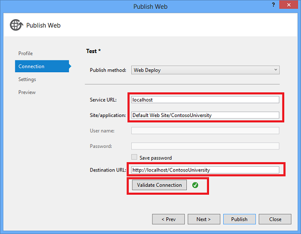
8. Click **Next** to advance to the **Settings** tab.
9. The **Configuration** drop-down box specifies the build configuration to deploy. Leave it set to the default value of Release. You won't be deploying Debug builds in this tutorial.
10. Expand **File Publish Options**, and then select **Exclude files from the App\_Data folder**.

    In the test environment the application will access the databases that you created in the local SQL Server Express instance, not the .mdf files in the *App\_Data* folder.
11. Leave the **Precompile during publishing** and **Remove additional files at destination** check boxes cleared.

    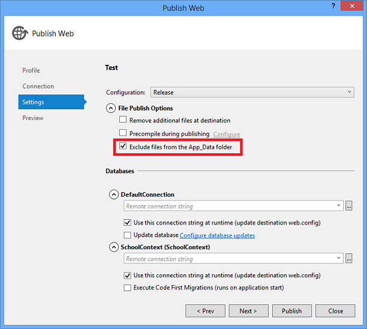

    Precompiling is an option that is useful mainly for very large sites; it can reduce page startup time for the first time a page is requested after the site is published.

    You don't need to remove additional files since this is your first deployment and there won't be any files in the destination folder yet.

    > [!NOTE] 
    > 
    > [!CAUTION]
    > If you select **Remove additional files** for a subsequent deployment to the same site, make sure that you use the preview feature so that you see in advance which files will be deleted before you deploy. The expected behavior is that Web Deploy will delete files on the destination server that you have deleted in your project. However, the entire folder structure under the source and destination folders is compared, and in some scenarios Web Deploy might delete files you don't want to delete.
    > 
    > For example, if you have a web application in a subfolder on the server when you deploy a project to the root folder, the subfolder will be deleted. You might have one project for the main site at contoso.com and another project for a blog at contoso.com/blog. The blog application is in a subfolder. If you select Remove additional files at destination when you deploy the main site, the blog application will be deleted.
    > 
    > For another example, your App\_Data folder might get deleted unexpectedly. Certain databases such as SQL Server Compact store database files in the App\_Data folder. After the initial deployment you don't want to keep copying the database files in subsequent deployments so you select  Exclude App\_Data on the Package/Publish Web tab. After you do that, if you have Remove additional files at destination selected, your database files and the App\_Data folder itself will be deleted the next time you publish.

### Configure deployment for the membership database

The following steps apply to the **DefaultConnection** database in the **Databases** section of the dialog box.

1. In the **Remote connection string** box, enter the following connection string that points to the new SQL Server Express membership database.

    [!code-console[Main](deploying-to-iis/samples/sample3.cmd)]

    The deployment process will put this connection string in the deployed Web.config file because **Use this connection string at runtime** is selected.

    You can also get the connection string from **Server Explorer**. In **Server Explorer**, expand **Data Connections** and select the **&lt;machinename&gt;\sqlexpress.aspnet-ContosoUniversity** database, then from the **Properties** window copy the **Connection String** value. That connection string will have one additional setting that you can delete: `Pooling=False`.
2. Select **Update database**.

    This will cause the database schema to be created in the destination database during deployment. In the following steps you specify the additional scripts that you need to run: one to grant database access to the default application pool and one to deploy data.
3. Click **Configure database updates**.
4. In the **Configure Database Updates** dialog box, click **Add SQL Script** and then navigate to the *Grant.sql* script that you saved earlier in the solution folder.
5. Repeat the process to add the *aspnet-data-dev.sql* script.

    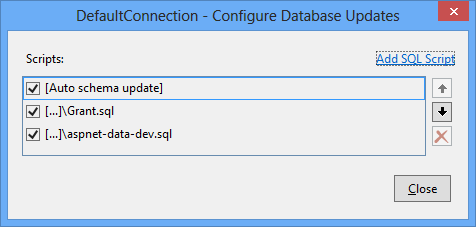
6. Click **Close**.

### Configure deployment for the application database

When Visual Studio detects an Entity Framework `DbContext` class, it creates an entry in the **Databases** section that has an **Execute Code First Migrations** check box instead of an **Update Database** check box. For this tutorial you'll use that check box to specify Code First Migrations deployment.

In some scenarios, you might be using a `DbContext` database but you want to use the dbDacFx provider instead of Migrations to deploy the database. In that case, see [How do I deploy a Code First database without Migrations?](https://msdn.microsoft.com/en-us/library/ee942158.aspx#deploy_code_first_without_migrations) in the ASP.NET Web Deployment FAQ on MSDN.

The following steps apply to the **SchoolContext** database in the **Databases** section of the dialog box.

1. In the **Remote connection string** box, enter the following connection string that points to the new SQL Server Express application database.

    [!code-console[Main](deploying-to-iis/samples/sample4.cmd)]

    The deployment process will put this connection string in the deployed Web.config file because **Use this connection string at runtime** is selected.

    You can also get the application database connection string from **Server Explorer** the same way you got the membership database connection string.
2. Select **Execute Code First Migrations (runs on application start)**.

    This option causes the deployment process to configure the deployed Web.config file to specify the `MigrateDatabaseToLatestVersion` initializer. This initializer automatically updates the database to the latest version when the application accesses the database for the first time after deployment.

### Configure publish profile transforms

1. Click **Close**, and then click **Yes** when you are asked if you want to save changes.
2. In **Solution Explorer**, expand **Properties**, expand **PublishProfiles**.
3. Rright-click *Test.pubxml,* and then click **Add Config Transform**.

    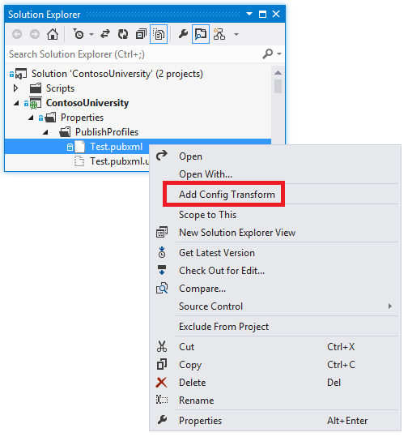

    Visual Studio creates the *Web.Test.config* transform file and opens it.
4. In the *Web.Test.config* transform file, insert the following code immediately after the opening configuration tag.

    [!code-xml[Main](deploying-to-iis/samples/sample5.xml)]

    When you use the Test publish profile, this transform sets the environment indicator to "Test". In the deployed site you'll see "(Test)" after the "Contoso University" H1 heading.
5. Save and close the file.
6. Right-click the *Web.Test.config* file and click **Preview Transform** to make sure that the transform you coded produces the expected changes.

    The **Web.config Preview** window shows the result of applying both the *Web.Release.config* transforms and the *Web.Test.config* transforms.

### Preview the deployment updates

1. Open the **Publish Web** wizard again (right-click the ContosoUniversity project and click **Publish**).
2. In the **Preview** tab, make sure that the **Test** profile is still selected, and then click **Start Preview** to see a list of the files that will be copied.

    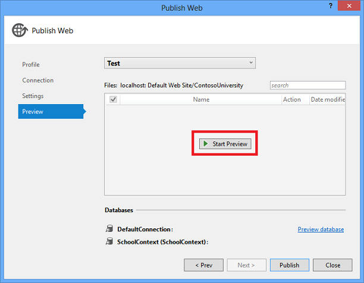

    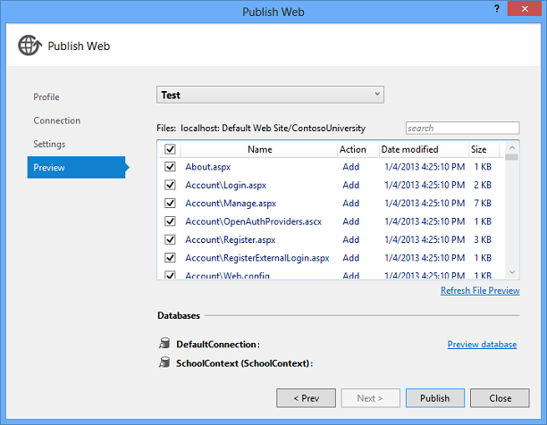

    You can also click the **Preview database** link to see the scripts that will run in the membership database. (No scripts are run for Code First Migrations deployment, so there is nothing to preview for the application database.)
3. Click **Publish**.

    If Visual Studio is not in administrator mode, you might get an error message that indicates a permissions error. In that case, close Visual Studio, open it in administrator mode, and try to publish again.

    If Visual Studio is in administrator mode, the **Output** window reports successful build and publish.

    

    If you entered the URL in the **Destination URL** box on the publish profile **Connection** tab, the browser automatically opens to the Contoso University Home page running in IIS on the local computer.

## Test in the test environment

Notice that the environment indicator shows "(Test)" instead of "(Dev)", which shows that the *Web.config* transformation for the environment indicator was successful.

Run the **Instructors** page to verify that Code First seeded the database with instructor data. When you select this page, it may take a few minutes to load because Code First creates the database and then runs the `Seed` method. (It didn't do that when you were on the home page because the application didn't try to access the database yet.)

Click the **Students** tab to verify that the deployed database has no students.

Select **Add Students** from the **Students** menu, add a student, and then view the new student in the **Students** page to verify that you can successfully write to the database.

From the **Courses** menu, select **Update Credits**. The **Update Credits** page requires administrator permissions, so the **Log In** page is displayed. Enter the administrator account credentials that you created earlier ("admin" and "devpwd"). The **Update Credits** page is displayed, which verifies that the administrator account that you created in the previous tutorial was correctly deployed to the test environment.

Verify that an *Elmah* folder exists in the *c:\inetpub\wwwroot\ContosoUniversity* folder with only the placeholder file in it.

## Review the automatic Web.config changes for Code First Migrations

Open the *Web.config* file in the deployed application at *C:\inetpub\wwwroot\ContosoUniversity* and you can see where the deployment process configured Code First Migrations to automatically update the database to the latest version.

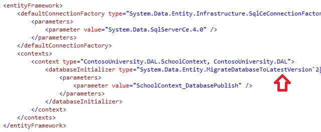

The deployment process also created a new connection string for Code First Migrations to use exclusively for updating the database schema:

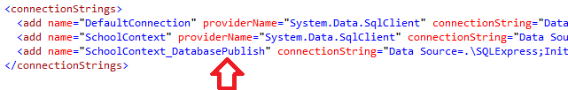

This additional connection string enables you to specify one user account for database schema updates, and a different user account for application data access. For example, you could assign the **db\_owner** role to Code First Migrations, and **db\_datareader** and **db\_datawriter** roles to the application. This is a common defense-in-depth pattern that prevents potentially malicious code in the application from changing the database schema. (For example, this might happen in a successful SQL injection attack.) This pattern is not used by these tutorials. If you want to implement this pattern in your scenario, you can do it by performing the following steps:

1. In the **Settings** tab of the **Publish Web** wizard, enter the connection string that specifies a user with full database schema update permissions, and clear the **Use this connection string at runtime** check box. In the deployed Web.config file, this becomes the `DatabasePublish` connection string.
2. Create a Web.config file transformation for the connection string that you want the application to use at run time.

## Summary

You have now deployed your application to IIS on your development computer and tested it there.

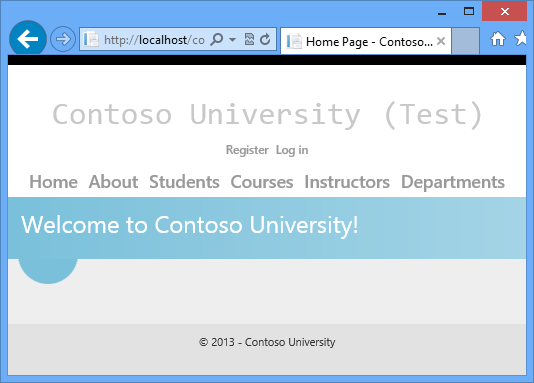

This verifies that the deployment process copied the application's content to the right location (excluding the files that you did not want to deploy), and also that Web Deploy configured IIS correctly during deployment. In the next tutorial, you'll run one more test that finds a deployment task that has not yet been done: setting folder permissions on the *Elmah* folder.

## More information

For information about running IIS or IIS Express in Visual Studio, see the following resources:

- [IIS Express Overview](https://www.iis.net/learn/extensions/introduction-to-iis-express/iis-express-overview) on the IIS.net site.
- [Introducing IIS Express](https://weblogs.asp.net/scottgu/archive/2010/06/28/introducing-iis-express.aspx) on Scott Guthrie's blog.
- [Web Servers in Visual Studio for ASP.NET Web Projects](https://msdn.microsoft.com/en-us/library/58wxa9w5.aspx).
- [Core Differences Between IIS and the ASP.NET Development Server](../../older-versions-getting-started/deploying-web-site-projects/core-differences-between-iis-and-the-asp-net-development-server-cs.md) on the ASP.NET site.

For information about what issues might arise when your application runs in medium trust, see [Hosting ASP.NET Applications in Medium Trust](http://www.4guysfromrolla.com/articles/100307-1.aspx) on the 4 Guys from Rolla site.

>[!div class="step-by-step"]
[Previous](project-properties.md)
[Next](setting-folder-permissions.md)