ASP.NET Web Deployment using Visual Studio: Deploying to Production
====================
by [Tom Dykstra](https://github.com/tdykstra)

[Download Starter Project](http://go.microsoft.com/fwlink/p/?LinkId=282627)

> This tutorial series shows you how to deploy (publish) an ASP.NET web application to Azure App Service Web Apps or to a third-party hosting provider, by using Visual Studio 2012 or Visual Studio 2010. For information about the series, see [the first tutorial in the series](introduction.md).

## Overview

In this tutorial, you set up a Microsoft Azure account, create staging and production environments, and deploy your ASP.NET web application to the staging and production environments by using the Visual Studio one-click publish feature.

If you prefer, you can deploy to a third-party hosting provider. Most of the procedures described in this tutorial are the same for a hosting provider or for Azure, except that each provider has its own user interface for account and web site management. You can find a hosting provider in the [gallery of providers](https://www.microsoft.com/web/hosting) on the Microsoft.com web site.

Reminder: If you get an error message or something doesn't work as you go through the tutorial, be sure to check the Troubleshooting page in this tutorial series.

## Get a Microsoft Azure account

If you don't already have an Azure account, you can create a free trial account in just a couple of minutes. For details, see [Azure Free Trial](https://www.windowsazure.com/en-us/pricing/free-trial/?WT.mc_id=A443DD604).

## Create a staging environment

> [!NOTE]
> Since this tutorial was written, Azure App Service added a new feature to automate many of the processes around having staging and production environments. See [Set up staging environments for web apps in Azure App Service](https://azure.microsoft.com/en-us/documentation/articles/web-sites-staged-publishing/).

As explained in the [Deploy to the Test Environment tutorial](deploying-to-iis.md), the most reliable test environment is a web site at the hosting provider that's just like the production web site. At many hosting providers you would have to weigh the benefits of this against significant additional cost, but in Azure you can create an additional free web app as your staging app. You also need a database, and the additional expense for that over the expense of your production database will be either none or minimal. In Azure you pay for the amount of database storage you use rather than for each database, and the amount of additional storage you'll use in staging will be minimal.

As explained in the [Deploy to the Test Environment tutorial](deploying-to-iis.md), in staging and production you're going to deploy your two databases into one database. If you wanted to keep them separate, the process would be the same except that you'd create an additional database for each environment and you would select the correct destination string for each database when you create the publish profile.

In this section of the tutorial you'll create a web app and database to use for the staging environment, and you'll deploy to staging and test there before creating and deploying to the production environment.

> [!NOTE]
> The following steps show how to create a web app in Azure App Service by using the Azure management portal. In the latest version of the Azure SDK, you can also do this without leaving Visual Studio, by using Server Explorer. In Visual Studio 2013, you can also create a web app directly from the Publish dialog. For more information, see [Create an ASP.NET web app in Azure App Service.](https://www.windowsazure.com/en-us/develop/net/tutorials/get-started/)

1. In the [Azure Management Portal](https://manage.windowsazure.com/), click **Websites**, and then click **New**.
2. Click **Website**, and then click **Custom Create**.

    The **New Website - Custom Create** wizard opens. The **Custom Create** wizard enables you to create a web site and a database at the same time.
3. In the **Create Website** step of the wizard, enter a string in the **URL** box to use as the unique URL for your application's staging environment. For example, enter ContosoUniversity-staging123 (including random numbers at the end to make it unique in case ContosoUniversity-staging is taken).

    The complete URL will consist of what you enter here plus the suffix that you see next to the text box.
4. In the **Region** drop-down list, choose the region that is closest to you.

    This setting specifies which data center your web app will run in.
5. In the **Database** drop-down list, choose **Create a new SQL database**.
6. In the **DB Connection String Name** box, leave the default value, *DefaultConnection*.
7. Click the arrow that points to the right at the bottom of the box.

    The following illustration shows the **Create Website** dialog with sample values in it. The URL and Region that you have entered will be different.

    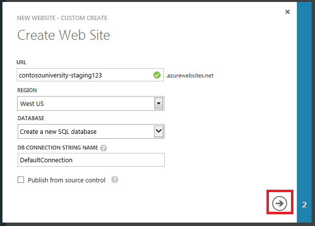

    The wizard advances to the **Specify database settings** step.
8. In the **Name** box, enter *ContosoUniversity* plus a random number to make it unique, for example *ContosoUniversity123*.
9. In the **Server** box, select **New SQL Database Server**.
10. Enter an administrator name and password.

    You aren't entering an existing name and password here. You're entering a new name and password that you're defining now to use later when you access the database.
11. In the **Region** box, choose the same region that you chose for the web app.

    Keeping the web server and the database server in the same region gives you the best performance and minimizes expenses.
12. Click the check mark at the bottom of the box to indicate that you're finished.

    The following illustration shows the **Specify database settings** dialog with sample values in it. The values you have entered may be different.

    

    The Management Portal returns to the Websites page, and the **Status** column shows that the web app is being created. After a while (typically less than a minute), the **Status** column shows that the web app was successfully created. In the navigation bar at the left, the number of web apps you have in your account appears next to the **Websites** icon, and the number of databases appears next to the **SQL Databases** icon.

    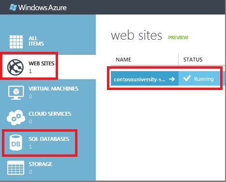

    Your web app name will be different from the example app in the illustration.

## Deploy the application to staging

Now that you have created a web app and database for the staging environment, you can deploy the project to it.

> [!NOTE]
> These instructions show how to create a publish profile by downloading a *.publishsettings* file, which works not only for Azure but also for third-party hosting providers. The latest Azure SDK also enables you to connect directly to Azure from Visual Studio, and choose from a list of web apps that you have in your Azure account. In Visual Studio 2013, you can sign in to Azure from the **Web Publish** dialog or from the **Server Explorer** window. For more information, see [Create an ASP.NET web app in Azure App Service](https://www.windowsazure.com/en-us/develop/net/tutorials/get-started/).

### Download the .publishsettings file

1. Click the name of the web app that you just created.

    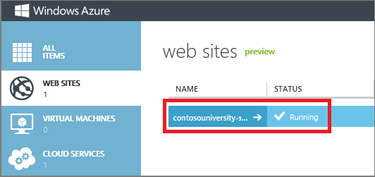
2. Under **Quick glance** in the **Dashboard** tab, click **Download publish profile**.

    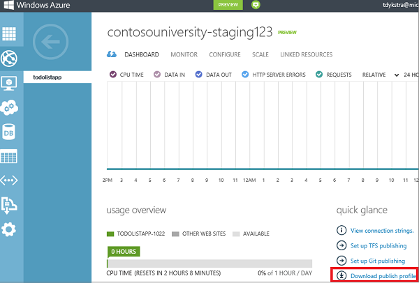

    This step downloads a file that contains all of the settings that you need in order to deploy an application to your web app. You'll import this file into Visual Studio so you don't have to enter this information manually.
3. Save the *.publishsettings* file in a folder that you can access from Visual Studio.

    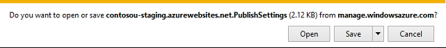

    > [!WARNING]
    > Security - The *.publishsettings* file contains your credentials (unencoded) that are used to administer your Azure subscriptions and services. The security best practice for this file is to store it temporarily outside your source directories (for example in the Libraries\Documents folder), and then delete it once the import has completed. A malicious user who gains access to the *.publishsettings* file can edit, create, and delete your Azure services.

### Create a publish profile

1. In Visual Studio, right-click the ContosoUniversity project in **Solution Explorer** and select **Publish** from the context menu.

    The **Publish Web** wizard opens.
2. Click the **Profile** tab.
3. Click **Import**.
4. Navigate to the *.publishsettings* file you downloaded earlier, and then click **Open**.

    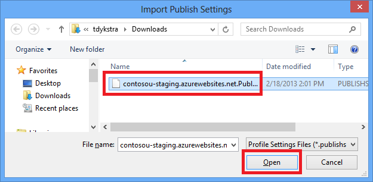
5. In the **Connection** tab, click **Validate Connection** to make sure that the settings are correct.

    When the connection has been validated, a green check mark is shown next to the **Validate Connection** button.

    For some hosting providers, when you click **Validate Connection**, you might see a **Certificate Error** dialog box. If you do, verify that the server name is what you expect. If the server name is correct, select **Save this certificate for future sessions of Visual Studio** and click **Accept**. (This error means that the hosting provider has chosen to avoid the expense of purchasing an SSL certificate for the URL that you are deploying to. If you prefer to establish a secure connection by using a valid certificate, contact your hosting provider.)
6. Click **Next**.

    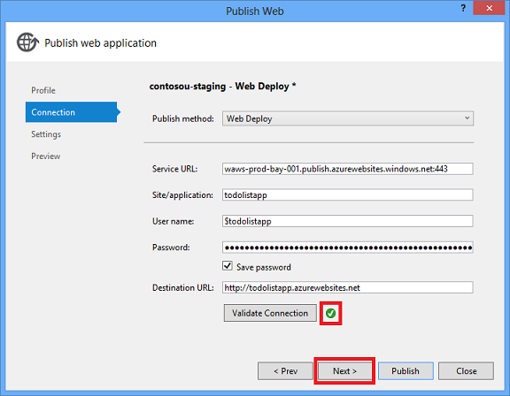
7. In the **Settings** tab, expand **File Publish Options**, and then select **Exclude files from the App\_Data folder**.

    For information about the other options under **File Publish Options**, see the [deploying to IIS](deploying-to-iis.md) tutorial. The screen shot that shows the result of this step and the following database configuration steps is at the end of the database configuration steps.
8. Under **DefaultConnection** in the **Databases** section, configure database deployment for the membership database.
9. 1. Select **Update database**.

        The **Remote connection string** box directly below **DefaultConnection** is filled in with the connection string from the .publishsettings file.The connection string includes SQL Server credentials, which are stored in plain text in the *.pubxml* file. If you prefer not to store them permanently there, you can remove them from the publish profile after the database is deployed and store them in Azure instead. For more information, see [How to keep your ASP.NET database connection strings secure when deploying to Azure from Source](http://www.hanselman.com/blog/HowToKeepYourASPNETDatabaseConnectionStringsSecureWhenDeployingToAzureFromSource.aspx) on Scott Hanselman's blog.
    2. Click **Configure database updates**.
    3. In the **Configure Database Updates** dialog box, click **Add SQL Script**.
    4. In the **Add SQL Script** box, navigate to the *aspnet-data-prod.sql* script that you saved earlier in the solution folder, and then click **Open**.
    5. Close the **Configure Database Updates** dialog box.
10. Under **SchoolContext** in the **Databases** section, select **Execute Code First Migrations (runs on application start)**.

    Visual Studio displays **Execute Code First Migrations** instead of **Update Database** for `DbContext` classes. If you want to use the dbDacFx provider instead of Migrations to deploy a database that you access by using a `DbContext` class, see [How do I deploy a Code First database without Migrations?](https://msdn.microsoft.com/en-us/library/ee942158.aspx#deploy_code_first_without_migrations) in the Web Deployment FAQ for Visual Studio and ASP.NET on MSDN.

    The **Settings** tab now looks like the following example:

    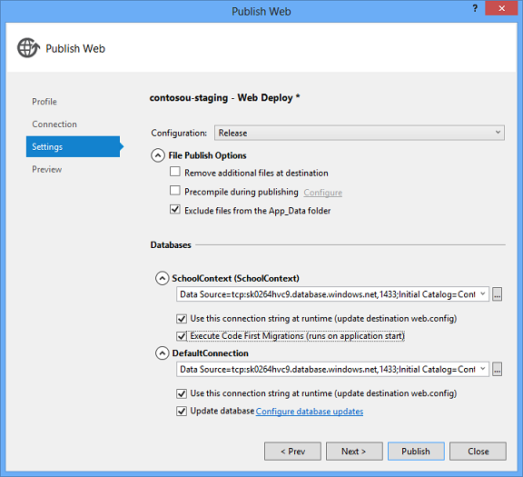
11. Perform the following steps to save the profile and rename it to *Staging*:

    1. Click the **Profile** tab, and then click **Manage Profiles**.
    2. The import created two new profiles, one for FTP and one for Web Deploy. You configured the Web Deploy profile: rename this profile to *Staging*.

        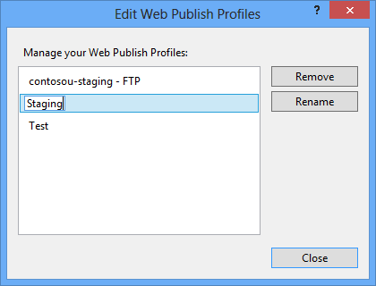
    3. Close the **Edit Web Publish Profiles** dialog box.
    4. Close the **Publish Web** wizard.

### Configure a publish profile transform for the environment indicator

> [!NOTE]
> This section shows how to set up a Web.config transform for the environment indicator. Because the indicator is in the `<appSettings>` element, you have another alternative for specifying the transformation when you're deploying to Azure App Service. For more information, see [Specifying Web.config settings in Azure](web-config-transformations.md#watransforms).

1. In **Solution Explorer**, expand **Properties**, and then expand **PublishProfiles**.
2. Right-click *Staging.pubxml*, and then click **Add Config Transform**.

    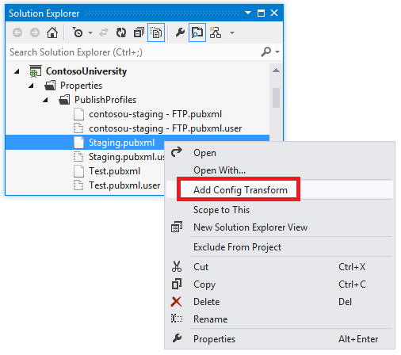

    Visual Studio creates the *Web.Staging.config* transform file and opens it.
3. In the *Web.Staging.config* transform file, insert the following code immediately after the opening `configuration` tag.

    [!code-xml[Main](deploying-to-production/samples/sample1.xml)]

    When you use the Staging publish profile, this transform sets the environment indicator to "Prod". In the deployed web app, you won't see any suffix such as "(Dev)" or "(Test)" after the "Contoso University" H1 heading.
4. Right-click the *Web.Staging.config* file and click **Preview Transform** to make sure that the transform you coded produces the expected changes.

    The **Web.config Preview** window shows the result of applying both the *Web.Release.config* transforms and the *Web.Staging.config* transforms.

### Prevent public use of the test app

An important consideration for the staging app is that it will be live on the Internet, but you don't want the public to use it. To minimize the likelihood that people will find and use it, you can use one or more of the following methods:

- Set firewall rules that allow access to the staging app only from IP addresses that you use to test staging.
- Use an obfuscated URL that would be impossible to guess.
- Create a *robots.txt* file to ensure that search engines will not crawl the test app and report links to it in search results.

The first of these methods is the most effective but is not covered in this tutorial because it would require that you deploy to an Azure Cloud Service instead of Azure App Service. For more information about Cloud Services and IP restrictions in Azure, see [Compute Hosting Options Provided by Azure](https://www.windowsazure.com/en-us/develop/net/fundamentals/compute/) and [Block Specific IP Addresses from Accessing a Web Role](https://msdn.microsoft.com/en-us/library/windowsazure/jj154098.aspx). If you are deploying to a third-party hosting provider, contact the provider to find out how to implement IP restrictions.

For this tutorial, you'll create a *robots.txt* file.

1. In **Solution Explorer**, right-click the ContosoUniversity project and click **Add New Item**.
2. Create a new **Text File** named *robots.txt*, and put the following text in it:

    [!code-console[Main](deploying-to-production/samples/sample2.cmd)]

    The `User-agent` line tells search engines that the rules in the file apply to all search engine web crawlers (robots), and the `Disallow` line specifies that no pages on the site should be crawled.

    You do want search engines to catalog your production app, so you need to exclude this file from production deployment. To do that, you'll configure a setting in the Production publish profile when you create it.

### Deploy to staging

1. Open the **Publish Web** wizard by right-clicking the Contoso University project and clicking **Publish**.
2. Make sure that the **Staging** profile is selected.
3. Click **Publish**.

    The **Output** window shows what deployment actions were taken and reports successful completion of the deployment. The default browser automatically opens to the URL of the deployed web app.

## Test in the staging environment

Notice that the environment indicator is absent (there is no "(Test)" or "(Dev)" after the H1 heading, which shows that the *Web.config* transformation for the environment indicator was successful.

Run the **Students** page to verify that the deployed database has no students.

Run the **Instructors** page to verify that Code First seeded the database with instructor data:

Select **Add Students** from the **Students** menu, add a student, and then view the new student in the **Students** page to verify that you can successfully write to the database.

From the **Courses** page, click **Update Credits**. The **Update Credits** page requires administrator permissions, so the **Log In** page is displayed. Enter the administrator account credentials that you created earlier ("admin" and "prodpwd"). The **Update Credits** page is displayed, which verifies that the administrator account that you created in the previous tutorial was correctly deployed to the test environment.

Request an invalid URL to cause an error that ELMAH will track, and then request the ELMAH error report. If you are deploying to a third-party hosting provider, you will probably find that the report is empty for the same reason that it was empty in the previous tutorial. You will have to use the hosting provider's account management tools to configure folder permissions to enable ELMAH to write to the log folder.

The application that you created is now running in the cloud in a web app that is just like what you will use for production. Since everything is working correctly, the next step is to deploy to production.

## Deploy to production

The process for creating a production web app and deploying to production is the same as for staging, except that you need to exclude the *robots.txt* from deployment. To do that you'll edit the publish profile file.

### Create the production environment and the production publish profile

1. Create the production web app and database in Azure, following the same procedure that you used for staging.

    When you create the database, you can choose to put it on the same server you created earlier, or create a new server.
2. Download the *.publishsettings* file.
3. Create the publish profile by importing the production *.publishsettings* file, following the same procedure that you used for staging.

    Don't forget to configure the data deployment script under **DefaultConnection** in the **Databases** section of the **Settings** tab.
4. Rename the publish profile to *Production*.
5. Configure a publish profile transform for the environment indicator, following the same procedure that you used for staging..

### Edit the .pubxml file to exclude robots.txt

Publish profile files are named &lt;profilename&gt;*.pubxml* and are located in the *PublishProfiles* folder. The *PublishProfiles* folder is under the *Properties* folder in a C# web application project, under the *My Project* folder in a VB web application project, or under the *App\_Data* folder in a web app project. Each *.pubxml* file contains settings that apply to one publish profile. The values you enter in the Publish Web wizard are stored in these files, and you can edit them to create or change settings that aren't made available in the Visual Studio UI.

By default, *.pubxml* files are included in the project when you create a publish profile, but you can exclude them from the project and Visual Studio will still use them. Visual Studio looks in the *PublishProfiles* folder for *.pubxml* files, regardless of whether they are included in the project.

For each *.pubxml* file there is a *.pubxml.user* file. The *.pubxml.user* file contains the encrypted password if you selected the **Save password** option, and by default it is excluded from the project.

A *.pubxml* file contains the settings that pertain to a specific publish profile. If you want to configure settings that apply to all profiles, you can create a *.wpp.targets* file. The build process imports these files into the *.csproj* or *.vbproj* project file, so most settings that you can configure in the project file can be configured in these files. For more information about *.pubxml* files and *.wpp.targets* files, see [How to: Edit Deployment Settings in Publish Profile (.pubxml) Files and the .wpp.targets File in Visual Studio Web Projects](https://msdn.microsoft.com/en-us/library/ff398069.aspx).

1. In **Solution Explorer**, expand **Properties** and expand **PublishProfiles**.
2. Right-click *Production.pubxml* and click **Open**.

    
3. Right-click *Production.pubxml* and click **Open**.
4. Add the following lines immediately before the closing `PropertyGroup` element:

    [!code-xml[Main](deploying-to-production/samples/sample3.xml)]

    The .pubxml file now looks like the following example:

    [!code-xml[Main](deploying-to-production/samples/sample4.xml?highlight=18-20)]

    For more information about how to exclude files and folders, see [Can I exclude specific files or folders from deployment?](https://msdn.microsoft.com/en-us/library/ee942158.aspx#can_i_exclude_specific_files_or_folders_from_deployment) in the **Web Deployment FAQ for Visual Studio and ASP.NET** on MSDN.

### Deploy to production

1. Open the **Publish Web** wizard make sure that the **Production** publish profile is selected, and then click **Start Preview** on the **Preview** tab to verify that the *robots.txt* file will not be copied to the production app.

    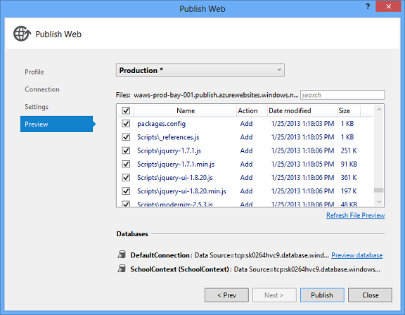

    Review the list of files that will be copied. You'll see that all of the *.cs* files, including *.aspx.cs*, *.aspx.designer.cs*, *Master.cs*, and *Master.designer.cs* files are omitted. All of this code has been compiled into the *ContosoUniversity.dll* and *ContosUniversity.pdb* files that you'll find in the *bin* folder. Because only the *.dll* is needed to run the application, and you specified earlier that only files needed to run the application should be deployed, no *.cs* files were copied to the destination environment. The *obj* folder and the *ContosoUniversity.csproj* and *.csproj.user* files are omitted for the same reason.

    Click **Publish** to deploy to the production environment.
2. Test in production, following the same procedure you used for staging.

    Everything is identical to staging except for the URL and the absence of the *robots.txt* file.

## Summary

You have now successfully deployed and tested your web app and it is available publicly over the Internet.

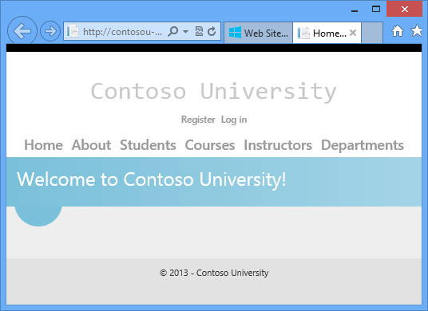

In the next tutorial, you'll update application code and deploy the change to the test, staging, and production environments.

> [!NOTE]
> While your application is in use in the production environment you should be implementing a recovery plan. That is, you should be periodically backing up your databases from the production app to a secure storage location, and you should be keeping several generations of such backups. When you update the database, you should make a backup copy from immediately before the change. Then, if you make a mistake and don't discover it until after you have deployed it to production, you will still be able to recover the database to the state it was in before it became corrupted. For more information, see [Azure SQL Database Backup and Restore](https://msdn.microsoft.com/en-us/library/windowsazure/jj650016.aspx).

> [!NOTE]
> In this tutorial the SQL Server edition that you are deploying to is Azure SQL Database. While the deployment process is similar to other editions of SQL Server, a real production application might require special code for Azure SQL Database in some scenarios. For more information, see [Working with Azure SQL Database](../../../../whitepapers/aspnet-data-access-content-map.md#ssdb) and [Choosing between SQL Server and Azure SQL Database](../../../../whitepapers/aspnet-data-access-content-map.md#ssdbchoosing).

>[!div class="step-by-step"]
[Previous](setting-folder-permissions.md)
[Next](deploying-a-code-update.md)