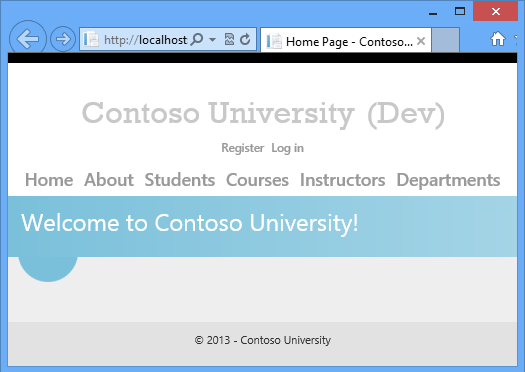
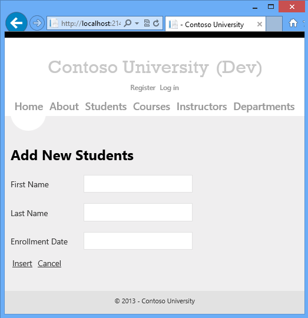

ASP.NET Web Deployment using Visual Studio: Introduction
====================
by [Tom Dykstra](https://github.com/tdykstra)

[Download Starter Project](http://go.microsoft.com/fwlink/p/?LinkId=282627)

> This tutorial series shows you how to deploy (publish) an ASP.NET web application to Azure App Service Web Apps or a third-party hosting provider, by using Visual Studio 2012 with the Azure SDK for .NET. Most of the procedures are similar for Visual Studio 2013.
> 
> You develop a web application in order to make it available to people over the Internet. But web programming tutorials typically stop right after they've shown you how to get something working on your development computer. This series of tutorials begins where the others leave off: you've built a web app, tested it, and it's ready to go. What's next? These tutorials show you how to deploy first to IIS on your local development computer for testing, and then to Azure or a third-party hosting provider for staging and production. The sample application that you'll deploy is a web application project that uses the Entity Framework, SQL Server, and the ASP.NET membership system. The sample application uses ASP.NET Web Forms, but the procedures shown apply also to ASP.NET MVC and Web API.
> 
> These tutorials assume you know how to work with ASP.NET in Visual Studio. If you don't, a good place to start is a [basic ASP.NET Web Forms Tutorial](../../older-versions-getting-started/tailspin-spyworks/tailspin-spyworks-part-1.md) or a [basic ASP.NET MVC Tutorial](../../../../mvc/overview/older-versions/getting-started-with-aspnet-mvc4/intro-to-aspnet-mvc-4.md).
> 
> If you have questions that are not directly related to the tutorial, you can post them to the [ASP.NET Deployment forum](https://forums.asp.net/26.aspx/1?Configuration+and+Deployment) or [StackOverflow](http://stackoverflow.com).
> 
> This content is also available as a free e-book in [the TechNet E-Book Gallery](https://social.technet.microsoft.com/wiki/contents/articles/11608.e-book-gallery-for-microsoft-technologies.aspx#ASPNETWebDeploymentusingVisualStudio).

## Overview

These tutorials guide you through deploying an ASP.NET web application that includes SQL Server databases. You'll deploy first to IIS on your local development computer for testing, and then to Web Apps in Azure App Service and Azure SQL Database for staging and production. You'll see how to deploy by using Visual Studio one-click publish, and you'll see how to deploy using the command line.

The number of tutorials might make the deployment process seem daunting. In fact, the basic procedures are simple. However, in real-world situations, you often need to do extra deployment tasks — for example, setting folder permissions on the target server. We've illustrated some of these additional tasks, in the hope that the tutorials don't leave out information that might prevent you from successfully deploying a real application.

The tutorials are designed to run in sequence, and each part builds on the previous part. You can skip parts that aren't relevant to your situation, but then you might have to adjust the procedures in later tutorials.

## Intended audience

The tutorials are aimed at ASP.NET developers who work in environments where:

- The production environment is Azure App Service Web Apps or a third-party hosting provider.
- Deployment is not limited to a continuous integration process but may be done directly from Visual Studio.

Deployment from [source control](../../../../aspnet/overview/developing-apps-with-windows-azure/building-real-world-cloud-apps-with-windows-azure/source-control.md) using a [continuous delivery](../../../../aspnet/overview/developing-apps-with-windows-azure/building-real-world-cloud-apps-with-windows-azure/continuous-integration-and-continuous-delivery.md) process is not covered in these tutorials except for one tutorial that shows how to deploy from the command line. For information about continuous delivery, see the following resources:

- [Continuous Integration and Continuous Delivery (Building Real-World Cloud Apps with Windows Azure)](../../../../aspnet/overview/developing-apps-with-windows-azure/building-real-world-cloud-apps-with-windows-azure/continuous-integration-and-continuous-delivery.md)
- [Deploy a web app in Azure App Service](https://azure.microsoft.com/en-us/documentation/articles/web-sites-deploy/)
- [Deploying Web Applications in Enterprise Scenarios](../deploying-web-applications-in-enterprise-scenarios/deploying-web-applications-in-enterprise-scenarios.md) (An older set of tutorials written for Visual Studio 2010, which still has useful information for enterprise environments.)

## Using a third-party hosting provider

The tutorials take you through the process of setting up an Azure account and deploying the application to Web Apps in Azure App Service for staging and production. However, you can use the same basic procedures for deploying to a third-party hosting provider of your choice. Where the tutorials go over processes unique to Azure, they explain that and advise what differences you can expect at a third-party hosting provider.

## Deploying web app projects

The sample application that you download and deploy for these tutorials is a Visual Studio web application project. However, if you install the latest [Web Publish Update for Visual Studio](https://msdn.microsoft.com/tr-tr/library/jj161045.aspx), you can use the same deployment methods and tools for web app projects.

## Deploying ASP.NET MVC projects

The sample application is an ASP.NET Web Forms project, but everything you learn how to do is applicable to ASP.NET MVC as well. A Visual Studio MVC project is just another form of web application project. The only difference is that if you're deploying to a hosting provider that does not support ASP.NET MVC or your target version of it, you must make sure that you have installed the appropriate ([MVC 3](http://nuget.org/packages/AspNetMvc/3.0.20105.0), [MVC 4](http://www.nuget.org/packages/Microsoft.AspNet.Mvc/4.0.30506.0), or [MVC 5](http://www.nuget.org/packages/Microsoft.AspNet.Mvc)) NuGet package in your project.

## Programming language

The sample application uses C# but the tutorials do not require knowledge of C#, and the deployment techniques shown by the tutorials are not language-specific.

## Database deployment methods

There are three ways that you can deploy a SQL Server database along with web deployment in Visual Studio:

- Entity Framework Code First Migrations
- The dbDacFx Web Deploy provider
- The dbFullSql Web Deploy provider

In this tutorial you will use the first two of these methods. The dbFullSql Web Deploy provider is a legacy method that is no longer recommended except for some specific scenarios such as migrating from SQL Server Compact to SQL Server.

The methods shown in this tutorial are for SQL Server databases, not SQL Server Compact. For information about how to deploy a SQL Server Compact database, see [Visual Studio Web Deployment With SQL Server Compact](../../older-versions-getting-started/deployment-to-a-hosting-provider/deployment-to-a-hosting-provider-introduction-1-of-12.md).

The methods shown in this tutorial require that you use the Web Deploy publish method. If you prefer a different publish method, such as FTP, File System, or FPSE, see [Deploying a database separately from web application deployment](https://go.microsoft.com/fwlink/p/?LinkId=282413#databaseseparate) in the Web Deployment Content Map for Visual Studio and ASP.NET.

### Entity Framework Code First Migrations

In the Entity Framework version 4.3, Microsoft introduced Code First Migrations. Code First Migrations automates the process of making incremental changes to a data model and propagating those changes to the database. In earlier versions of Code First, you typically let the Entity Framework drop and re-create the database each time you change the data model. This is not a problem in development because test data is easily re-created, but in production you usually want to update the database schema without dropping the database. The Migrations feature enables Code First to update the database without dropping and re-creating it. You can let Code First automatically decide how to make the required schema changes, or you can write code that customizes the changes. For an introduction to Code First Migrations, see [Code First Migrations](https://msdn.microsoft.com/library/hh770484.aspx).

When you are deploying a web project, Visual Studio can automate the process of deploying a database that is managed by Code First Migrations. When you create the publish profile, you select a check box that is labeled Execute Code First Migrations (runs on application start). This setting causes the deployment process to automatically configure the application Web.config file on the destination server so that Code First uses the `MigrateDatabaseToLatestVersion` initializer class.

Visual Studio does not do anything with the database during the deployment process. When the deployed application accesses the database for the first time after deployment, Code First automatically creates the database or updates the database schema to the latest version. If the application implements a Migrations Seed method, the method runs after the database is created or the schema is updated.

In this tutorial, you'll use Code First Migrations to deploy the application database.

### The dbDacFx Web Deploy provider

For a SQL Server database that isn't managed by Entity Framework Code First, you can select a check box that is labeled Update database when you configure the publish profile. During the initial deployment, the dbDacFx provider creates tables and other database objects in the destination database to match the source database. On subsequent deployments, the provider determines what is different between the source and destination databases, and it updates the schema of the destination database to match the source database. By default, the provider won't make any changes that cause data loss, such as when a table or column is dropped.

This method does not automate the deployment of data in database tables, but you can create scripts to do that and configure Visual Studio to run them during deployment. Another reason to run scripts during deployment is to make schema changes that can't be done automatically because they would cause data loss.

In this tutorial, you'll use the dbDacFx provider to deploy the ASP.NET membership database.

## Troubleshooting during this tutorial

When an error happens during deployment, or if the deployed site does not run correctly, the error messages don't always provide an obvious solution. To help you with some common problem scenarios, a [troubleshooting reference page](troubleshooting.md) is available. If you get an error message or something doesn't work as you go through the tutorials, be sure to check the troubleshooting page.

## Comments welcome

Comments on the tutorials are welcome, and when the tutorial is updated every effort will be made to take into account corrections or suggestions for improvements that are provided in tutorial comments.

## Prerequisites

This tutorial was written for the following products:

- Windows 8 or Windows 7.
- Visual Studio 2012 or Visual Studio 2012 Express for Web with [the latest update](https://go.microsoft.com/fwlink/?LinkId=272486).
- [Azure SDK for Visual Studio 2012](https://go.microsoft.com/fwlink/?LinkId=254364)

You can follow the tutorial by using Visual Studio 2010 SP1 or Visual Studio 2013, but some screen shots will be different and some features will be different.

If you're using Visual Studio 2013, install [Azure SDK for Visual Studio 2013](https://go.microsoft.com/fwlink/?LinkID=324322).

If you're using Visual Studio 2010 SP1, install the following software:

- [Azure SDK for Visual Studio 2010](https://go.microsoft.com/fwlink/?LinkID=254269)
- [SQL Server Express LocalDB](https://www.microsoft.com/web/gallery/install.aspx?appsxml=&amp;appid=SQLLocalDBOnly_11_0)
- [SQL Server Data Tools](https://msdn.microsoft.com/en-us/library/hh500335.aspx).

Depending on how many of the SDK dependencies you already have on your machine, installing the Azure SDK could take a long time, from several minutes to a half hour or more. You need the Azure SDK even if you plan to publish to a third-party hosting provider instead of to Azure, because the SDK includes the latest updates to Visual Studio web publish features.

> [!NOTE]
> This tutorial was written with version 1.8.1 of the Azure SDK. Since then newer versions with additional features have been released. The tutorials have been updated to mention these features and link to resources that have more information about them.

The instructions and screen shots are based on Windows 8, but the tutorials explain differences for Windows 7.

Some other software is required in order to complete the tutorial, but you don't have to have that installed yet. The tutorial will walk you through the steps for installing it when you need it.

## Download the sample application

The application that you'll deploy is named Contoso University and has already been created for you. It's a simplified version of a university web site, based loosely on the Contoso University application described in the [Entity Framework tutorials on the ASP.NET site](https://asp.net/entity-framework/tutorials).

When you have the prerequisites installed, download the [Contoso University web application](https://go.microsoft.com/fwlink/p/?LinkId=282627). The *.zip* file contains multiple versions of the project. To work through the steps of the tutorial, start with the project located in the C# folder. To see what the project looks like at the end of the tutorials, open the project in the ContosoUniversity-End folder.

To prepare the project for working through the tutorial steps, perform the following steps:

1. Save the ContosoUniversity solution files from the C# folder in a folder named ContosoUniversity in whatever folder you use for working with Visual Studio projects.

    By default this is the following folder for Visual Studio 2012:

    `C:\Users\<username>\Documents\Visual Studio 2012\Projects`

    (For the screen shots in this tutorial, the project folder is located in the root directory on the `C`: drive.)
2. Start Visual Studio and open the project.
3. In **Solution Explorer**, right-click the solution and click **EnableNuGet Package Restore**.
4. Build the solution.
5. If you get compile errors, manually restore the NuGet packages:

    1. In **Solution Explorer**, right-click the solution, and then click **Manage NuGet Packages for Solution**.
    2. At the top of the **Manage NuGet Packages** dialog box you'll see **Some NuGet packages are missing from this solution. Click to restore.** Click the **Restore** button.
    3. Rebuild the solution.
6. Press CTRL-F5 to run the application.

    The application opens to the Contoso University home page.

    

    (There might be a wait time while Visual Studio starts up the SQL Server Express LocalDB instance, and you might get a timeout error if that process takes too long. In that case just start the project again.)

The website pages are accessible from the menu bar and let you perform the following functions:

- Display student statistics (the About page).
- Display, edit, delete, and add students.
- Display and edit courses.
- Display and edit instructors.
- Display and edit departments.

Following are screen shots of a few representative pages.

## Review application features that affect deployment

The following features of the application affect how you deploy it or what you have to do to deploy it. Each of these is explained in more detail in the following tutorials in the series.

- Contoso University uses a SQL Server database to store application data such as student and instructor names. The database contains a mix of test data and production data, and when you deploy to production you need to exclude the test data.
- The application uses the ASP.NET membership system, which stores user account information in a SQL Server database. The application defines an administrator user who has access to some restricted information. You need to deploy the membership database without test accounts but with an administrator account.
- The application uses a third-party error logging and reporting utility. This utility is provided in an assembly which must be deployed with the application.
- The error logging utility writes error information in XML files to a file folder. You have to make sure that the account that ASP.NET runs under in the deployed site has write permission to this folder, and you have to exclude this folder from deployment. (Otherwise, error log data from the test environment might be deployed to production and/or production error log files might be deleted.)
- The application includes some settings that must be changed in in the deployed *Web.config* file depending on the destination environment (test, staging, or production), and other settings that must be changed depending on the build configuration (Debug or Release).
- The Visual Studio solution includes a class library project. Only the assembly that this project generates should be deployed, not the project itself.

## Summary

In this first tutorial in the series, you have downloaded the sample Visual Studio project and reviewed site features that affect how you deploy the application. In the following tutorials, you prepare for deployment by setting up some of these things to be handled automatically. Others you take care of manually.

>[!div class="step-by-step"]
[Next](preparing-databases.md)