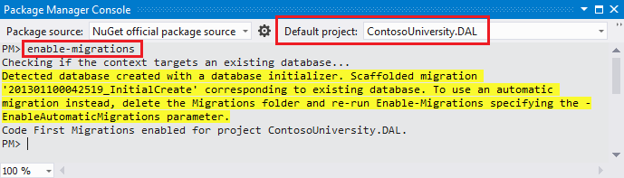
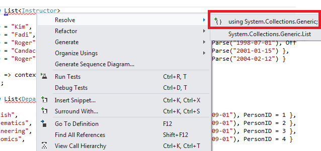
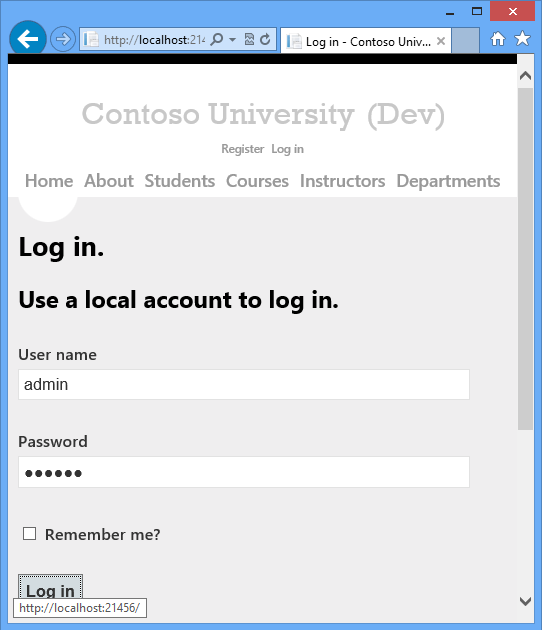
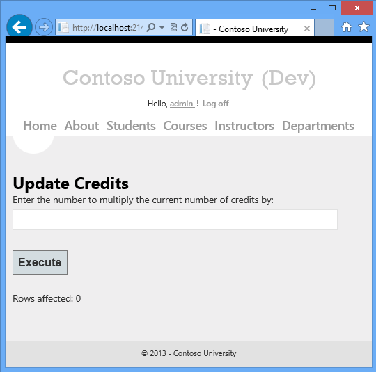
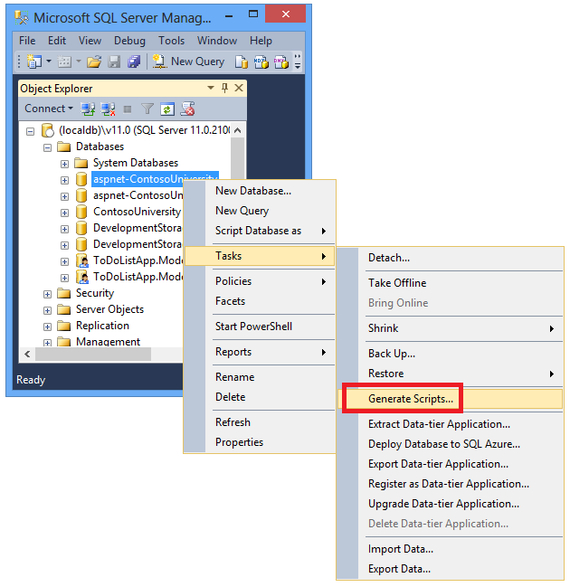
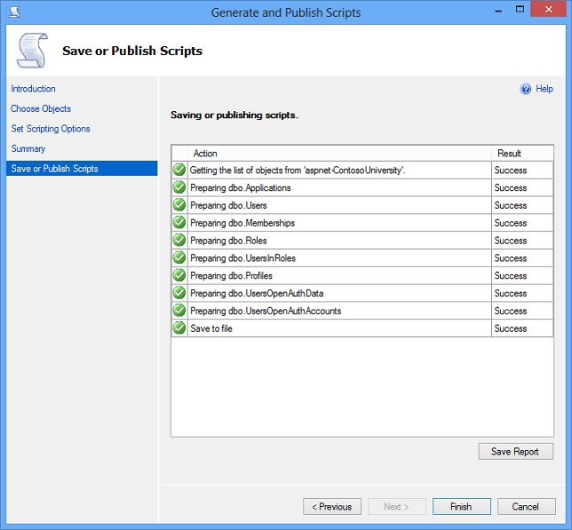
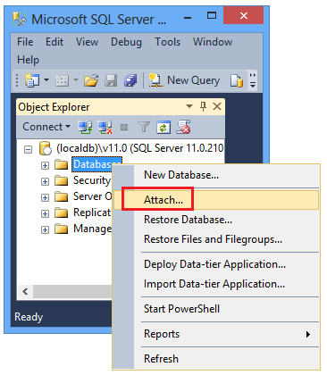
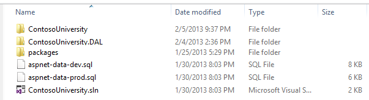

ASP.NET Web Deployment using Visual Studio: Preparing for Database Deployment
====================
by [Tom Dykstra](https://github.com/tdykstra)

[Download Starter Project](http://go.microsoft.com/fwlink/p/?LinkId=282627)

> This tutorial series shows you how to deploy (publish) an ASP.NET web application to Azure App Service Web Apps or to a third-party hosting provider, by using Visual Studio 2012 or Visual Studio 2010. For information about the series, see [the first tutorial in the series](introduction.md).

## Overview

This tutorial shows how to get the project ready for database deployment. The database structure and some (not all) of the data in the application's two databases must be deployed to test, staging, and production environments.

Typically, as you develop an application, you enter test data into a database that you don't want to deploy to a live site. However, you might also have some production data that you do want to deploy. In this tutorial you'll configure the Contoso University project and prepare SQL scripts so that the correct data is included when you deploy.

Reminder: If you get an error message or something doesn't work as you go through the tutorial, be sure to check the [troubleshooting page](troubleshooting.md).

## SQL Server Express LocalDB

The sample application uses SQL Server Express LocalDB. SQL Server Express is the free edition of SQL Server. It is commonly used during development because it is based on the same database engine as full versions of SQL Server. You can test with SQL Server Express and be assured that the application will behave the same in production, with a few exceptions for features that vary between SQL Server Editions.

LocalDB is a special execution mode of SQL Server Express that enables you to work with databases as *.mdf* files. Typically, LocalDB database files are kept in the *App\_Data* folder of a web project. The user instance feature in SQL Server Express also enables you to work with *.mdf* files, but the user instance feature is deprecated; therefore, LocalDB is recommended for working with *.mdf* files.

Typically SQL Server Express is not used for production web applications. LocalDB in particular is not recommended for production use with a web application because it is not designed to work with IIS.

In Visual Studio 2012, LocalDB is installed by default with Visual Studio. In Visual Studio 2010 and earlier versions, SQL Server Express (without LocalDB) is installed by default with Visual Studio; that is why you installed it as one of the prerequisites in [the first tutorial in this series](introduction.md).

For more information about SQL Server editions, including LocalDB, see the following resources [Working with SQL Server Databases](../../../../whitepapers/aspnet-data-access-content-map.md#sqlserver).

## Entity Framework and Universal Providers

For database access, the Contoso University application requires the following software that must be deployed with the application because it is not included in the .NET Framework:

- [ASP.NET Universal Providers](http://www.hanselman.com/blog/IntroducingSystemWebProvidersASPNETUniversalProvidersForSessionMembershipRolesAndUserProfileOnSQLCompactAndSQLAzure.aspx) (enables the ASP.NET membership system to use Azure SQL Database)
- [Entity Framework](https://msdn.microsoft.com/en-us/library/gg696172.aspx)

Because this software is included in NuGet packages, the project is already set up so that the required assemblies are deployed with the project. (The links point to the current versions of these packages, which might be newer than what is installed in the starter project that you downloaded for this tutorial.)

If you are deploying to a third-party hosting provider instead of Azure, make sure that you use Entity Framework 5.0 or later. Earlier versions of Code First Migrations require Full Trust, and most hosting providers will run your application in Medium Trust. For more information about Medium Trust, see the [Deploy to IIS as a Test Environment](deploying-to-iis.md) tutorial.

## Configure Code First Migrations for application database deployment

The Contoso University application database is managed by Code First, and you'll deploy it by using Code First Migrations. For an overview of database deployment by using Code First Migrations, see [the first tutorial in this series](introduction.md).

When you deploy an application database, typically you don't simply deploy your development database with all of the data in it to production, because much of the data in it is probably there only for testing purposes. For example, the student names in a test database are fictional. On the other hand, you often can't deploy just the database structure with no data in it at all. Some of the data in your test database might be real data and must be there when users begin to use the application. For example, your database might have a table that contains valid grade values or real department names.

To simulate this common scenario, you'll configure a Code First Migrations `Seed` method that inserts into the database only the data that you want to be there in production. This `Seed` method shouldn't insert test data because it will run in production after Code First creates the database in production.

In earlier versions of Code First before Migrations was released, it was common for `Seed` methods to insert test data also, because with every model change during development the database had to be completely deleted and re-created from scratch. With Code First Migrations, test data is retained after database changes, so including test data in the `Seed` method is not necessary. The project that you downloaded uses the method of including all data in the `Seed` method of an initializer class. In this tutorial you'll disable that initializer class and `enable Migrations. Then you'll update the `Seed` method in the Migrations configuration class so that it inserts only data that you want to be inserted in production.

The following diagram illustrates the schema of the application database:

For these tutorials, you'll assume that the `Student` and `Enrollment` tables should be empty when the site is first deployed. The other tables contain data that has to be preloaded when the application goes live.

### Disable the initializer

Since you will be using Code First Migrations, you do not have to use the `DropCreateDatabaseIfModelChanges` Code First initializer. The code for this initializer is in the *SchoolInitializer.cs* file in the ContosoUniversity.DAL project. A setting in the `appSettings` element of the *Web.config* file causes this initializer to run whenever the application tries to access the database for the first time:

[!code-xml[Main](preparing-databases/samples/sample1.xml?highlight=3)]

Open the application *Web.config* file and remove or comment out the `add` element that specifies the Code First initializer class. The `appSettings` element now looks like this:

[!code-xml[Main](preparing-databases/samples/sample2.xml)]

> [!NOTE]
> Another way to specify an initializer class is do it by calling `Database.SetInitializer` in the `Application_Start` method in the *Global.asax* file. If you are enabling Migrations in a project that uses that method to specify the initializer, remove that line of code.

> [!NOTE]
> If you are using Visual Studio 2013, add the following steps between steps 2 and 3: (a) In PMC enter "update-package entityframework -version 6.1.1" to get the current version of EF. Then (b) build the project to get a list of build errors, and fix them. Delete using statements for namespaces that no longer exist, right-click and click Resolve to add using statements where they're needed, and change occurrences of System.Data.EntityState to System.Data.Entity.EntityState.

### Enable Code First Migrations

1. Make sure that the ContosoUniversity project (not ContosoUniversity.DAL) is set as the startup project. In **Solution Explorer**, right-click the ContosoUniversity project and select **Set as Startup Project**. Code First Migrations will look in the startup project to find the database connection string.
2. From the **Tools** menu, click **Library Package Manager** (or **NuGet Package Manager**) and then **Package Manager Console**.

    
3. At the top of the **Package Manager Console** window select ContosoUniversity.DAL as the default project and then at the `PM>` prompt enter "enable-migrations".

    

    (If you get an error saying the *enable-migrations* command is not recognized, enter the command *update-package EntityFramework -Reinstall* and try again.)

    This command creates a *Migrations* folder in the ContosoUniversity.DAL project, and it puts in that folder two files: a *Configuration.cs* file that you can use to configure Migrations, and an *InitialCreate.cs* file for the first migration that creates the database.

    

    You selected the DAL project in the **Default project** drop-down list of the **Package Manager Console** because the `enable-migrations` command must be executed in the project that contains the Code First context class. When that class is in a class library project, Code First Migrations looks for the database connection string in the startup project for the solution. In the ContosoUniversity solution, the web project has been set as the startup project. If you don't want to designate the project that has the connection string as the startup project in Visual Studio, you can specify the startup project in the PowerShell command. To see the command syntax, enter the command `get-help enable-migrations`.

    The `enable-migrations` command automatically created the first migration because the database already exists. An alternative is to have Migrations create the database. To do that, use **Server Explorer** or **SQL Server Object Explorer** to delete the ContosoUniversity database before you enable Migrations. After you enable migrations, create the first migration manually by entering the command "add-migration InitialCreate". You can then create the database by entering the command "update-database".

### Set up the Seed method

For this tutorial you'll add fixed data by adding code to the `Seed` method of the Code First Migrations `Configuration` class. Code First Migrations calls the `Seed` method after every migration.

Since the `Seed` method runs after every migration, there is data already in the tables after the first migration. To handle this situation you'll use the `AddOrUpdate` method to update rows that have already been inserted, or insert them if they don't exist yet. The `AddOrUpdate` method might not be the best choice for your scenario. For more information, see [Take care with EF 4.3 AddOrUpdate Method](http://thedatafarm.com/blog/data-access/take-care-with-ef-4-3-addorupdate-method/) on Julie Lerman's blog.

1. Open the *Configuration.cs* file and replace the comments in the `Seed` method with the following code:

    [!code-csharp[Main](preparing-databases/samples/sample3.cs)]
2. The references to `List` have red squiggly lines under them because you don't have a `using` statement for its namespace yet. Right-click one of the instances of `List` and click **Resolve**, and then click **using System.Collections.Generic**.

    

    This menu selection adds the following code to the `using` statements near the top of the file.

    [!code-csharp[Main](preparing-databases/samples/sample4.cs)]
3. Press CTRL-SHIFT-B to build the project.

The project is now ready to deploy the *ContosoUniversity* database. After you deploy the application, the first time you run it and navigate to a page that accesses the database, Code First will create the database and run this `Seed` method.

> [!NOTE]
> Adding code to the `Seed` method is one of many ways that you can insert fixed data into the database. An alternative is to add code to the `Up` and `Down` methods of each migration class. The `Up` and `Down` methods contain code that implements database changes. You'll see examples of them in the [Deploying a Database Update](deploying-a-database-update.md) tutorial.
> 
> You can also write code that executes SQL statements by using the `Sql` method. For example, if you were adding a Budget column to the Department table and wanted to initialize all department budgets to $1,000.00 as part of a migration, you could add the folllowing line of code to the `Up` method for that migration:
> 
> `Sql("UPDATE Department SET Budget = 1000");`

## Create scripts for membership database deployment

The Contoso University application uses the ASP.NET membership system and forms authentication to authenticate and authorize users. The **Update Credits** page is accessible only to users who are in the Administrator role.

Run the application and click **Courses**, and then click **Update Credits**.

The **Log in** page appears because the **Update Credits** page requires administrative privileges.

Enter *admin* as the user name and *devpwd* as the password and click **Log in**.

The **Update Credits** page appears.

User and role information is in the *aspnet-ContosoUniversity* database that is specified by the **DefaultConnection** connection string in the *Web.config* file.

This database is not managed by Entity Framework Code First, so you can't use Migrations to deploy it. You'll use the dbDacFx provider to deploy the database schema, and you'll configure the publish profile to run a script that will insert initial data into database tables.

> [!NOTE]
> A new ASP.NET membership system (now named ASP.NET Identity) was introduced with Visual Studio 2013. The new system enables you to keep both application and membership tables in the same database, and you can use Code First Migrations to deploy both. The sample application uses the earlier ASP.NET membership system, which can't be deployed by using Code First Migrations. The procedures for deploying this membership database apply also to any other scenario in which your application needs to deploy a SQL Server database that isn't created by Entity Framework Code First.

Here too, you typically don't want the same data in production that you have in development. When you deploy a site for the first time, it is common to exclude most or all of the user accounts you create for testing. Therefore, the downloaded project has two membership databases: *aspnet-ContosoUniversity.mdf* with development users and *aspnet-ContosoUniversity-Prod.mdf* with production users. For this tutorial the user names are the same in both databases: *admin* and *nonadmin*. Both users have the password *devpwd* in the development database and *prodpwd* in the production database.

You'll deploy the development users to the test environment and the production users to staging and production. To do that you'll create two SQL scripts in this tutorial, one for development and one for production, and in later tutorials you'll configure the publish process to run them.

> [!NOTE]
> The membership database stores a hash of account passwords. In order to deploy accounts from one machine to another, you must make sure that hashing routines don't generate different hashes on the destination server than they do on the source computer. They will generate the same hashes when you use the ASP.NET Universal Providers, as long as you don't change the default algorithm. The default algorithm is HMACSHA256 and is specified in the **validation** attribute of the **[machineKey](https://msdn.microsoft.com/en-us/library/system.web.configuration.machinekeysection.aspx)** element in the Web.config file.

You can create data deployment scripts manually, by using SQL Server Management Studio (SSMS), or by using a third-party tool. This remainder of this tutorial will show you how to do it in SSMS, but if you don't want to install and use SSMS you can get the scripts from the completed version of the project and skip to the section where you store them in the solution folder.

To install SSMS, install it from [Download Center: Microsoft SQL Server 2012 Express](https://www.microsoft.com/en-us/download/details.aspx?id=29062) by clicking [ENU\x64\SQLManagementStudio\_x64\_ENU.exe](https://download.microsoft.com/download/8/D/D/8DD7BDBA-CEF7-4D8E-8C16-D9F69527F909/ENU/x64/SQLManagementStudio_x64_ENU.exe) or [ENU\x86\SQLManagementStudio\_x86\_ENU.exe](https://download.microsoft.com/download/8/D/D/8DD7BDBA-CEF7-4D8E-8C16-D9F69527F909/ENU/x86/SQLManagementStudio_x86_ENU.exe). If you choose the wrong one for your system it will fail to install and you can try the other one.

(Note that this is a 600 megabyte download. It may take a long time to install and will require a reboot of your computer.)

On the first page of the SQL Server Installation Center, click **New SQL Server stand-alone installation or add features to an existing installation**, and follow the instructions, accepting the default choices.

### Create the development database script

1. Run SSMS.
2. In the **Connect to Server** dialog box, enter *(localdb)\v11.0* as the **Server name**, leave **Authentication** set to **Windows Authentication**, and then click **Connect**.

    
3. In the **Object Explorer** window, expand **Databases**, right-click **aspnet-ContosoUniversity**, click **Tasks**, and then click **Generate Scripts**.

    
4. In the **Generate and Publish Scripts** dialog box, click **Set Scripting Options**.

    You can skip the **Choose Objects** step because the default is **Script entire database and all database objects** and that is what you want.
5. Click **Advanced**.

    
6. In the **Advanced Scripting Options** dialog box, scroll down to **Types of data to script**, and click the **Data only** option in the drop-down list.
7. Change **Script USE DATABASE** to **False**. USE statements aren't valid for Azure SQL Database and aren't needed for deployment to SQL Server Express in the test environment.

    
8. Click **OK**.
9. In the **Generate and Publish Scripts** dialog box, the **File name** box specifies where the script will be created. Change the path to your solution folder (the folder that has your ContosoUniversity.sln file) and the file name to *aspnet-data-dev.sql*.
10. Click **Next** to go to the **Summary** tab, and then click **Next** again to create the script.

    
11. Click **Finish**.

### Create the production database script

Since you haven't run the project with the production database, it isn't attached yet to the LocalDB instance. Therefore you need to attach the database first.

1. In the SSMS **Object Explorer**, right-click **Databases** and click **Attach**.

    
- In the **Attach Databases** dialog box, click **Add** and then navigate to the *aspnet-ContosoUniversity-Prod.mdf* file in the *App\_Data* folder.

    
- Click **OK**.
- Follow the same procedure you used earlier to create a script for the production file. Name the script file *aspnet-data-prod.sql*.

## Summary

Both databases are now ready to be deployed and you have two data deployment scripts in your solution folder.

In the following tutorial you configure project settings that affect deployment, and you set up automatic *Web.config* file transformations for settings that must be different in the deployed application.

## More Information

For more information on NuGet, see [Manage Project Libraries with NuGet](https://msdn.microsoft.com/en-us/magazine/hh547106.aspx) and [NuGet Documentation](http://docs.nuget.org/docs/start-here/overview). If you don't want to use NuGet, you'll need to learn how to analyze a NuGet package to determine what it does when it is installed. (For example, it might configure *Web.config* transformations, configure PowerShell scripts to run at build time, etc.) To learn more about how NuGet works, see [Creating and Publishing a Package](http://docs.nuget.org/docs/creating-packages/creating-and-publishing-a-package) and [Configuration File and Source Code Transformations](http://docs.nuget.org/docs/creating-packages/configuration-file-and-source-code-transformations).

>[!div class="step-by-step"]
[Previous](introduction.md)
[Next](web-config-transformations.md)