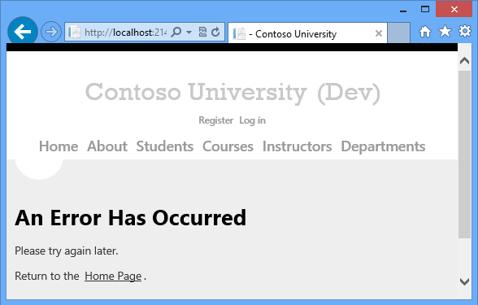
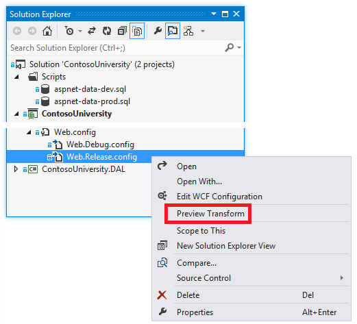
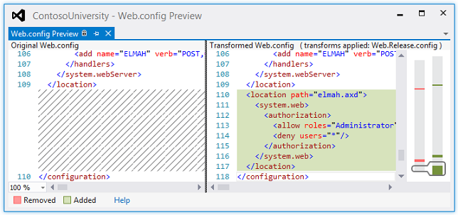

ASP.NET Web Deployment using Visual Studio: Web.config File Transformations
====================
by [Tom Dykstra](https://github.com/tdykstra)

[Download Starter Project](http://go.microsoft.com/fwlink/p/?LinkId=282627)

> This tutorial series shows you how to deploy (publish) an ASP.NET web application to Azure App Service Web Apps or to a third-party hosting provider, by using Visual Studio 2012 or Visual Studio 2010. For information about the series, see [the first tutorial in the series](introduction.md).

## Overview

This tutorial shows you how to automate the process of changing the *Web.config* file when you deploy it to different destination environments. Most applications have settings in the *Web.config* file that must be different when the application is deployed. Automating the process of making these changes keeps you from having to do them manually every time you deploy, which would be tedious and error prone.

Reminder: If you get an error message or something doesn't work as you go through the tutorial, be sure to check the [troubleshooting page](troubleshooting.md).

## Web.config transformations versus Web Deploy parameters

There are two ways to automate the process of changing *Web.config* file settings: [Web.config transformations](https://msdn.microsoft.com/en-us/library/dd465326.aspx) and [Web Deploy parameters](https://msdn.microsoft.com/en-us/library/ff398068.aspx). A *Web.config* transformation file contains XML markup that specifies how to change the *Web.config* file when it is deployed. You can specify different changes for specific build configurations and for specific publish profiles. The default build configurations are Debug and Release, and you can create custom build configurations. A publish profile typically corresponds to a destination environment. (You'll learn more about publish profiles in the [Deploying to IIS as a Test Environment](deploying-to-iis.md) tutorial.)

Web Deploy parameters can be used to specify many different kinds of settings that must be configured during deployment, including settings that are found in *Web.config* files. When used to specify *Web.config* file changes, Web Deploy parameters are more complex to set up, but they are useful when you do not know the value to be set until you deploy. For example, in an enterprise environment, you might create a *deployment package* and give it to a person in the IT department to install in production, and that person has to be able to enter connection strings or passwords that you do not know.

For the scenario that this tutorial series covers, you know in advance everything that has to be done to the *Web.config* file, so you do not need to use Web Deploy parameters. You'll configure some transformations that differ depending on the build configuration used, and some that differ depending on the publish profile used.

## Specifying Web.config settings in Azure

If the *Web.config* file settings that you want to change are in the `<connectionStrings>` or the `<appSettings>` element, and if you are deploying to Web Apps in Azure App Service, you have another option for automating changes during deployment. You can enter the settings that you want to take effect in Azure in the **Configure** tab of the management portal page for your web app (scroll down to the **app settings** and **connection strings** sections). When you deploy the project, Azure automatically applies the changes. For more information, see [Windows Azure Web Sites: How Application Strings and Connection Strings Work](https://blogs.msdn.com/b/windowsazure/archive/2013/07/17/windows-azure-web-sites-how-application-strings-and-connection-strings-work.aspx).

## Default transformation files

In **Solution Explorer**, expand *Web.config* to see the *Web.Debug.config* and *Web.Release.config* transformation files that are created by default for the two default build configurations.

You can create transformation files for custom build configurations by right-clicking the Web.config file and choosing **Add Config Transforms** from the context menu. For this tutorial you don't need to do that, and the menu option is disabled, because you haven't created any custom build configurations.

Later you'll create three more transformation files, one each for the test, staging, and production publish profiles. A typical example of a setting that you would handle in a publish profile transformation file because it depends on the destination environment is a WCF endpoint that is different for test versus production. You'll create publish profile transformation files in later tutorials after you create the publish profiles that they go with.

## Disable debug mode

An example of a setting that depends on build configuration rather than destination environment is the `debug` attribute. For a Release build, you typically want debugging disabled regardless of which environment you are deploying to. Therefore, by default the Visual Studio project templates create *Web.Release.config* transform files with code that removes the `debug` attribute from the `compilation` element. Here is the default *Web.Release.config*: in addition to some sample transformation code that is commented out, it includes code in the `compilation` element that removes the `debug` attribute:

[!code-xml[Main](web-config-transformations/samples/sample1.xml?highlight=18)]

The `xdt:Transform="RemoveAttributes(debug)"` attribute specifies that you want the `debug` attribute to be removed from the `system.web/compilation` element in the deployed *Web.config* file. This will be done every time you deploy a Release build.

## Limit error log access to administrators

If there's an error while the application runs, the application displays a generic error page in place of the system-generated error page, and it uses the [Elmah NuGet package](http://www.hanselman.com/blog/NuGetPackageOfTheWeek7ELMAHErrorLoggingModulesAndHandlersWithSQLServerCompact.aspx) for error logging and reporting. The `customErrors` element in the application *Web.config* file specifies the error page:

[!code-xml[Main](web-config-transformations/samples/sample2.xml)]

To see the error page, temporarily change the `mode` attribute of the `customErrors` element from "RemoteOnly" to "On" and run the application from Visual Studio. Cause an error by requesting an invalid URL, such as *Studentsxxx.aspx*. Instead of an IIS-generated "The resource cannot be found" error page, you see the *GenericErrorPage.aspx* page.

To see the error log, replace everything in the URL after the port number with *elmah.axd* (for example, `http://localhost:51130/elmah.axd`) and press Enter:

Don't forget to set the `customErrors` element back to "RemoteOnly" mode when you're done.

On your development computer it's convenient to allow free access to the error log page, but in production that would be a security risk. For the production site, you want to add an authorization rule that restricts error log access to administrators, and to make sure that the restriction works you want it in test and staging also. Therefore this is another change that you want to implement every time you deploy a Release build, and so it belongs in the *Web.Release.config* file.

Open *Web.Release.config* and add a new `location` element immediately before the closing `configuration` tag, as shown here.

[!code-xml[Main](web-config-transformations/samples/sample3.xml?highlight=27-34)]

The `Transform` attribute value of "Insert" causes this `location` element to be added as a sibling to any existing `location` elements in the *Web.config* file. (There is already one `location` element that specifies authorization rules for the **Update Credits** page.)

Now you can preview the transform to make sure that you coded it correctly.

In **Solution Explorer**, right-click *Web.Release.config* and click **Preview Transform**.

A page opens that shows you the development *Web.config* file on the left and what the deployed *Web.config* file will look like on the right, with changes highlighted.

( In the preview, you might notice some additional changes that you didn't write transforms for: these typically involve the removal of white space that doesn't affect functionality.)

When you test the site after deployment, you'll also test to verify that the authorization rule is effective.

> [!NOTE] 
> 
> **Security Note** Never display error details to the public in a production application, or store that information in a public location. Attackers can use error information to discover vulnerabilities in a site. If you use ELMAH in your own application, configure ELMAH to minimize security risks. The ELMAH example in this tutorial should not be considered a recommended configuration. It is an example that was chosen in order to illustrate how to handle a folder that the application must be able to create files in. For more information, see [securing the ELMAH endpoint](https://code.google.com/p/elmah/wiki/SecuringErrorLogPages).

## A setting that you'll handle in publish profile transformation files

A common scenario is to have *Web.config* file settings that must be different in each environment that you deploy to. For example, an application that calls a WCF service might need a different endpoint in test and production environments. The Contoso University application includes a setting of this kind also. This setting controls a visible indicator on a site's pages that tells you which environment you are in, such as development, test, or production. The setting value determines whether the application will append "(Dev)" or "(Test)" to the main heading in the *Site.Master* master page:

The environment indicator is omitted when the application is running in staging or production.

The Contoso University web pages read a value that is set in `appSettings` in the *Web.config* file in order to determine what environment the application is running in:

[!code-xml[Main](web-config-transformations/samples/sample4.xml)]

The value should be "Test" in the test environment, and "Prod" for staging and production.

The following code in a transform file will implement this transformation:

[!code-xml[Main](web-config-transformations/samples/sample5.xml)]

The `xdt:Transform` attribute value "SetAttributes" indicates that the purpose of this transform is to change attribute values of an existing element in the *Web.config* file. The `xdt:Locator` attribute value "Match(key)" indicates that the element to be modified is the one whose `key` attribute matches the `key` attribute specified here. The only other attribute of the `add` element is `value`, and that is what will be changed in the deployed *Web.config* file. The code shown here causes the `value` attribute of the `Environment` `appSettings` element to be set to "Test" in the *Web.config* file that is deployed.

This transform belongs in the publish profile transform files, which you haven't created yet. You'll create and update the transform files that implement this change when you create the publish profiles for the test, staging, and production environments. You'll do that in the [deploy to IIS](deploying-to-iis.md) and [deploy to production](deploying-to-production.md) tutorials.

> [!NOTE]
> Because this setting is in the `<appSettings>` element, you have another alternative for specifying the transformation when you're deploying to Web Apps in Azure App Service See [Specifying Web.config settings in Azure](#watransforms) earlier in this topic.

## Setting connection strings

Although the default transform file contains an example that shows how to update a connection string, in most cases you do not need to set up connection string transformations, because you can specify connection strings in the publish profile. You'll do that in the [deploy to IIS](deploying-to-iis.md) and [deploy to production](deploying-to-production.md) tutorials.

## Summary

You have now done as much as you can with *Web.config* transformations before you create the publish profiles, and you've seen a preview of what will be in the deployed Web.config file.

In the following tutorial, you'll take care of deployment set-up tasks that require setting project properties.

## More Information

For more information about topics covered by this tutorial, see [Using Web.config transformations to change settings in the destination Web.config file or app.config file during deployment](https://go.microsoft.com/fwlink/p/?LinkId=282413#transforms) in the Web Deployment Content Map for Visual Studio and ASP.NET.

>[!div class="step-by-step"]
[Previous](preparing-databases.md)
[Next](project-properties.md)