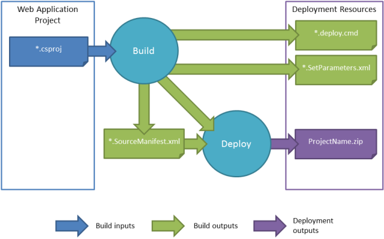

Building and Packaging Web Application Projects
====================
by [Jason Lee](https://github.com/jrjlee)

[Download PDF](https://msdnshared.blob.core.windows.net/media/MSDNBlogsFS/prod.evol.blogs.msdn.com/CommunityServer.Blogs.Components.WeblogFiles/00/00/00/63/56/8130.DeployingWebAppsInEnterpriseScenarios.pdf)

> When you want to deploy a web application project to a remote server environment, your first task is to build the project and generate a web deployment package. This topic describes how the build process works for web application projects. In particular, it explains:
> 
> - How the Web Publishing Pipeline (WPP) extends the build process to include deployment functionality.
> - How the Internet Information Services (IIS) Web Deployment Tool (Web Deploy) turns your web application into a deployment package.
> - How the build and packaging process works and what files are created.

In Visual Studio 2010, the build and deployment process for web application projects is supported by the WPP. The WPP provides a set of Microsoft Build Engine (MSBuild) targets that extend the functionality of MSBuild and enable it to integrate with Web Deploy. Within Visual Studio, you can see this extended functionality on the property pages for your web application project. The **Package/Publish Web** page, together with the **Package/Publish SQL** page, lets you configure how your web application project is packaged for deployment when the build process is complete.

## How Does the WPP Work?

If you take a look at the project file for a C#-based web application project, you can see that it imports two .targets files.

[!code-xml[Main](building-and-packaging-web-application-projects/samples/sample1.xml)]

The first **Import** statement is common to all Visual C# projects. This file, *Microsoft.CSharp.targets*, contains targets and tasks that are specific to Visual C#. For example, the C# compiler (**Csc**) task is invoked here. The *Microsoft.CSharp.targets* file in turn imports the *Microsoft.Common.targets* file. This defines targets that are common to all projects, like **Build**, **Rebuild**, **Run**, **Compile**, and **Clean**. The second **Import** statement is specific to web application projects. The *Microsoft.WebApplication.targets* file in turn imports the *Microsoft.Web.Publishing.targets* file. The *Microsoft.Web.Publishing.targets* file essentially *is* the WPP. It defines targets, like **Package** and **MSDeployPublish**, that invoke Web Deploy to complete various deployment tasks.

To understand how these additional targets are used, in the Contact Manager sample solution, open the *Publish.proj* file and take a look at the **BuildProjects** target.

[!code-xml[Main](building-and-packaging-web-application-projects/samples/sample2.xml)]

This target uses the **MSBuild** task to build various projects. Notice the **DeployOnBuild** and **DeployTarget** properties:

- The **DeployOnBuild=true** property essentially means "I want to execute an additional target when build completes successfully."
- The **DeployTarget** property identifies the name of the target you want to execute when the **DeployOnBuild** property is equal to **true**. In this case, you're specifying that you want MSBuild to execute the **Package** target after building the project.

The **Package** target is defined in the *Microsoft.Web.Publishing.targets* file. Essentially, this target takes the build output of your web application project and turns it into a web deployment package that can be published to an IIS web server.

> [!NOTE]
> To view a project file (for example, *ContactManager.Mvc.csproj*) in Visual Studio 2010, you first need to unload the project from your solution. In the **Solution Explorer** window, right-click the project node, and then click **Unload Project**. Right-click the project node again, and then click **Edit***[project file]*). The project file will open in its raw XML form. Remember to reload the project when you're done.  
> For more information on MSBuild targets, tasks, and **Import** statements, see [Understanding the Project File](understanding-the-project-file.md). For a more in-depth introduction to project files and the WPP, see [Inside the Microsoft Build Engine: Using MSBuild and Team Foundation Build](http://amzn.com/0735645248) by Sayed Ibrahim Hashimi and William Bartholomew, ISBN: 978-0-7356-4524-0.

## What Is a Web Deployment Package?

When you build and deploy a web application project, either by using Visual Studio 2010 or by using MSBuild directly, the end result is typically a *web deployment package*. The web deployment package is a .zip file. It contains everything that IIS and Web Deploy need in order to recreate your web application, including:

- The compiled output of your web application, including content, resource files, configuration files, JavaScript and cascading style sheets (CSS) resources, and so on.
- Assemblies for your web application project and for any referenced projects within your solution.
- SQL scripts to generate any databases that you're deploying with your web application.

Once the web deployment package has been generated, you can publish it to an IIS web server in various ways. For example, you can deploy it remotely by targeting the Web Deploy Remote Agent service or the Web Deploy Handler on the destination web server, or you can use IIS Manager to manually import the package on the destination web server. For more information on these approaches to deployment, see [Choosing the Right Approach to Web Deployment](../configuring-server-environments-for-web-deployment/choosing-the-right-approach-to-web-deployment.md).

## How Does the Build Process Work?

This shows what happens when you build and package a web application project:

When you build a web application project, the build process generates a file named *[project name].SourceManifest.xml*. Along with the project file and the build output, this *.SourceManifest.xml* file tells Web Deploy what it needs to include in the web deployment package. Using these inputs, Web Deploy generates a web deployment package named *[project name].zip*.

Alongside the web deployment package, the build process generates two files that can help you to use the package:

- The *.deploy.cmd* file includes a set of parameterized Web Deploy (MSDeploy.exe) commands that publish your web deployment package to a remote IIS web server. Running the *.deploy.cmd* file, with appropriate parameters, typically provides a quicker and easier alternative to manually constructing the MSDeploy.exe commands yourself.
- The *SetParameters.xml* file provides a set of parameter values to the MSDeploy.exe command. These values include properties like the name of the IIS web application to which you want to deploy the package, the values of any service endpoints and connection strings defined in the *web.config* file, and any deployment property values defined on the project properties pages.

The *SetParameters.xml* file is key to managing the deployment process. This file is generated dynamically according to the contents of your web application project. For example, if you add a connection string to your *web.config* file, the build process will automatically detect the connection string, parameterize the deployment accordingly, and create an entry in the *SetParameters.xml* file to allow you to modify the connection string as part of the deployment process. The next topic, [Configuring Parameters for Web Package Deployment](configuring-parameters-for-web-package-deployment.md), explains the role of this file in more detail and describes the different ways in which you can modify it during build and deployment.

> [!NOTE]
> In Visual Studio 2010, the WPP does not support precompiling the pages in a web application prior to packaging. The next version of Visual Studio and the WPP will include the ability to precompile a web application as a packaging option.

## Conclusion

This topic provided an overview of the build and packaging process for web application projects in Visual Studio 2010. It described how the WPP lets you invoke Web Deploy commands from MSBuild, and it explained how the build and packaging process works.

Once you've created a web deployment package, your next step is to deploy it. For more information on this, see [Configuring Parameters for Web Package Deployment](configuring-parameters-for-web-package-deployment.md) and [Deploying Web Packages](deploying-web-packages.md).

## Further Reading

The next topics in this tutorial, [Configuring Parameters for Web Package Deployment](configuring-parameters-for-web-package-deployment.md) and [Deploying Web Packages](deploying-web-packages.md), provide guidance on how to use the web package you've created. The final tutorial in this series, [Advanced Enterprise Web Deployment](../advanced-enterprise-web-deployment/advanced-enterprise-web-deployment.md), provides guidance on how to customize and troubleshoot the packaging process.

For a more in-depth introduction to project files and the WPP, see [Inside the Microsoft Build Engine: Using MSBuild and Team Foundation Build](http://amzn.com/0735645248) by Sayed Ibrahim Hashimi and William Bartholomew, ISBN: 978-0-7356-4524-0.

>[!div class="step-by-step"]
[Previous](understanding-the-build-process.md)
[Next](configuring-parameters-for-web-package-deployment.md)