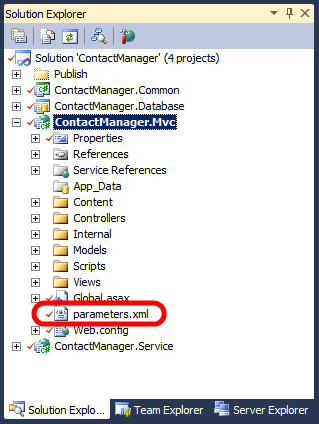

Configuring Parameters for Web Package Deployment
====================
by [Jason Lee](https://github.com/jrjlee)

[Download PDF](https://msdnshared.blob.core.windows.net/media/MSDNBlogsFS/prod.evol.blogs.msdn.com/CommunityServer.Blogs.Components.WeblogFiles/00/00/00/63/56/8130.DeployingWebAppsInEnterpriseScenarios.pdf)

> This topic describes how to set parameter values, like Internet Information Services (IIS) web application names, connection strings, and service endpoints, when you deploy a web package to a remote IIS web server.

When you build a web application project, the build and packaging process generates three key files:

- A *[project name].zip* file. This is the web deployment package for your web application project. This package contains all the assemblies, files, database scripts, and resources required to recreate your web application on a remote IIS web server.
- A *[project name].deploy.cmd* file. This contains a set of parameterized Web Deploy (MSDeploy.exe) commands that publish your web deployment package to a remote IIS web server.
- A *[project name].SetParameters.xml* file. This provides a set of parameter values to the MSDeploy.exe command. You can update the values in this file and pass it to Web Deploy as a command-line parameter when you deploy your web package.

> [!NOTE]
> For more information on the build and packaging process, see [Building and Packaging Web Application Projects](building-and-packaging-web-application-projects.md).

The *SetParameters.xml* file is dynamically generated from your web application project file and any configuration files within your project. When you build and package your project, the Web Publishing Pipeline (WPP) will automatically detect lots of the variables that are likely to change between deployment environments, like the destination IIS web application and any database connection strings. These values are automatically parameterized in the web deployment package and added to the *SetParameters.xml* file. For example, if you add a connection string to the *web.config* file in your web application project, the build process will detect this change and will add an entry to the *SetParameters.xml* file accordingly.

In a lot of cases, this automatic parameterization will be sufficient. However, if your users need to vary other settings between deployment environments, like application settings or service endpoint URLs, you need to tell the WPP to parameterize these values in the deployment package and add corresponding entries to the *SetParameters.xml* file. The sections that follow explain how to do this.

### Automatic Parameterization

When you build and package a web application, the WPP will automatically parameterize these things:

- The destination IIS web application path and name.
- Any connection strings in your *web.config* file.
- Connection strings for any databases you add to the **Package/Publish SQL** tab in the project property pages.

For example, if you were to build and package the [Contact Manager](the-contact-manager-solution.md) sample solution without touching the parameterization process in any way, the WPP would generate this *ContactManager.Mvc.SetParameters.xml* file:

[!code-xml[Main](configuring-parameters-for-web-package-deployment/samples/sample1.xml)]

In this case:

- The **IIS Web Application Name** parameter is the IIS path where you want to deploy the web application. The default value is taken from the **Package/Publish Web** page in the project property pages.
- The **ApplicationServices-Web.config Connection String** parameter was generated from a **connectionStrings/add** element in the *web.config* file. It represents the connection string that the application should use to contact the membership database. The value you provide here will be substituted into the deployed *web.config* file. The default value is taken from the pre-deployment *web.config* file.

The WPP also parameterizes these properties in the deployment package it generates. You can provide values for these properties when you install the deployment package. If you install the package manually through IIS Manager, as described in [Manually Installing Web Packages](manually-installing-web-packages.md), the installation wizard prompts you to provide values for any parameters. If you install the package remotely using the *.deploy.cmd* file, as described in [Deploying Web Packages](deploying-web-packages.md), Web Deploy will look to this *SetParameters.xml* file to provide the parameter values. You can edit the values in the *SetParameters.xml* file manually, or you can customize the file as part of an automated build and deployment process. This process is described in more detail later in this topic.

### Custom Parameterization

In more complex deployment scenarios, you'll often want to parameterize additional properties before you deploy your project. Generally speaking, you should parameterize any properties and settings that will vary between destination environments. These can include:

- Service endpoints in the *web.config* file.
- Application settings in the *web.config* file.
- Any other declarative properties that you want to prompt users to specify.

The easiest way to parameterize these properties is to add a *parameters.xml* file to the root folder of your web application project. For example, in the Contact Manager solution, the ContactManager.Mvc project includes a *parameters.xml* file in the root folder.

If you open this file, you'll see that it contains a single **parameter** entry. The entry uses an XML Path Language (XPath) query to locate and parameterize the endpoint URL of the ContactService Windows Communication Foundation (WCF) service in the *web.config* file.

[!code-xml[Main](configuring-parameters-for-web-package-deployment/samples/sample2.xml)]

In addition to parameterizing the endpoint URL in the deployment package, the WPP also adds a corresponding entry to the *SetParameters.xml* file that gets generated alongside the deployment package.

[!code-xml[Main](configuring-parameters-for-web-package-deployment/samples/sample3.xml)]

If you install the deployment package manually, IIS Manager will prompt you for the service endpoint address alongside the properties that were parameterized automatically. If you install the deployment package by running the *.deploy.cmd* file, you can edit the *SetParameters.xml* file to provide a value for the service endpoint address together with values for the properties that were parameterized automatically.

For full details on how to create a *parameters.xml* file, see [How to: Use Parameters to Configure Deployment Settings When a Package is Installed](https://msdn.microsoft.com/en-us/library/ff398068.aspx). The procedure named **To use deployment parameters for Web.config file settings** provides step-by-step instructions.

## Modifying the SetParameters.xml File

If you plan to deploy the web application package manually&#x2014;either by running the *.deploy.cmd* file or by running MSDeploy.exe from the command line&#x2014;there's nothing to stop you manually editing the *SetParameters.xml* file prior to the deployment. However, if you're working on an enterprise-scale solution, you may need to deploy a web application package as part of a larger, automated build and deployment process. In this scenario, you need the Microsoft Build Engine (MSBuild) to modify the *SetParameters.xml* file for you. You can do this by using the MSBuild **XmlPoke** task.

The [Contact Manager sample solution](the-contact-manager-solution.md) illustrates this process. The code examples that follow have been edited to show only the details that are relevant to this example.

> [!NOTE]
> For a broader overview of the project file model in the sample solution, and an introduction to custom project files in general, see [Understanding the Project File](understanding-the-project-file.md) and [Understanding the Build Process](understanding-the-build-process.md).

First, the parameter values of interest are defined as properties in the environment-specific project file (for example, *Env-Dev.proj*).

[!code-xml[Main](configuring-parameters-for-web-package-deployment/samples/sample4.xml)]

> [!NOTE]
> For guidance on how to customize the environment-specific project files for your own server environments, see [Configure Deployment Properties for a Target Environment](../configuring-server-environments-for-web-deployment/configuring-deployment-properties-for-a-target-environment.md).

Next, the *Publish.proj* file imports these properties. Because each *SetParameters.xml* file is associated with a *.deploy.cmd* file, and we ultimately want the project file to invoke each *.deploy.cmd* file, the project file creates an MSBuild *item* for each *.deploy.cmd* file and defines the properties of interest as *item metadata*.

[!code-xml[Main](configuring-parameters-for-web-package-deployment/samples/sample5.xml)]

In this case:

- The **ParametersXml** metadata value indicates the location of the *SetParameters.xml* file.
- The **IisWebAppName** value is the IIS path to which you want to deploy the web application.
- The **MembershipDBConnectionString** value is the connection string for the membership database, and the **MembershipDBConnectionName** value is the **name** attribute of the corresponding parameter in the *SetParameters.xml* file.
- The **ServiceEndpointValue** value is the endpoint address for the WCF service on the destination server, and the **ServiceEndpointParamName** value is the name attribute of the corresponding parameter in the *SetParameters.xml* file.

Finally, in the *Publish.proj* file, the **PublishWebPackages** target uses the **XmlPoke** task to modify these values in the *SetParameters.xml* file.

[!code-xml[Main](configuring-parameters-for-web-package-deployment/samples/sample6.xml)]

You'll notice that each **XmlPoke** task specifies four attribute values:

- The **XmlInputPath** attribute tells the task where to find the file you want to modify.
- The **Query** attribute is an XPath query that identifies the XML node you want to change.
- The **Value** attribute is the new value you want to insert into the selected XML node.
- The **Condition** attribute is the criteria on which the task should run or not run. In these cases, the condition ensures that you don't try to insert a null or empty value into the *SetParameters.xml* file.

## Conclusion

This topic described the role of the *SetParameters.xml* file and explained how it's generated when you build a web application project. It explained how you can parameterize additional settings by adding a *parameters.xml* file to your project. It also described how you can modify the *SetParameters.xml* file as part of a larger, automated build process, by using the **XmlPoke** task in your project files.

The next topic, [Deploying Web Packages](deploying-web-packages.md), describes how you can deploy a web package either by running the *.deploy.cmd* file or by using MSDeploy.exe commands directly. In both cases, you can specify your *SetParameters.xml* file as a deployment parameter.

## Further Reading

For information on how to create web packages, see [Building and Packaging Web Application Projects](building-and-packaging-web-application-projects.md). For guidance on how to actually deploy a web package, see [Deploying Web Packages](deploying-web-packages.md). For a step-by-step walkthrough on how to create a *parameters.xml* file, see [How to: Use Parameters to Configure Deployment Settings When a Package is Installed](https://msdn.microsoft.com/en-us/library/ff398068.aspx).

For more general information on parameterization in Web Deploy, see [Web Deploy Parameterization in Action](https://go.microsoft.com/?linkid=9805119) (blog post).

>[!div class="step-by-step"]
[Previous](building-and-packaging-web-application-projects.md)
[Next](deploying-web-packages.md)