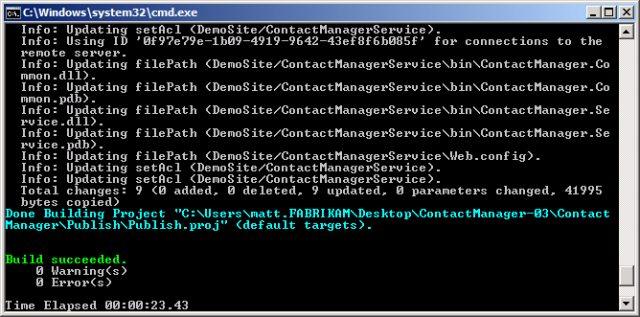
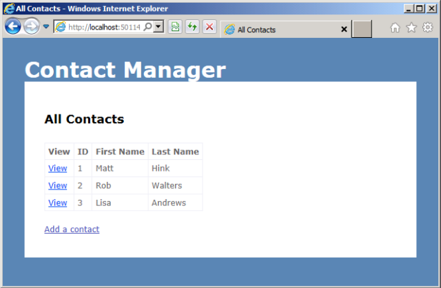

Creating and Running a Deployment Command File
====================
by [Jason Lee](https://github.com/jrjlee)

[Download PDF](https://msdnshared.blob.core.windows.net/media/MSDNBlogsFS/prod.evol.blogs.msdn.com/CommunityServer.Blogs.Components.WeblogFiles/00/00/00/63/56/8130.DeployingWebAppsInEnterpriseScenarios.pdf)

> This topic describes how to build a command file that will let you run a deployment using Microsoft Build Engine (MSBuild) project files as a single-step, repeatable process.

This topic forms part of a series of tutorials based around the enterprise deployment requirements of a fictional company named Fabrikam, Inc. This tutorial series uses a sample solution&#x2014;the [Contact Manager](the-contact-manager-solution.md) solution&#x2014;to represent a web application with a realistic level of complexity, including an ASP.NET MVC 3 application, a Windows Communication Foundation (WCF) service, and a database project.

The deployment method at the heart of these tutorials is based on the split project file approach described in [Understanding the Build Process](understanding-the-build-process.md), in which the build process is controlled by two project files&#x2014;one containing build instructions that apply to every destination environment, and one containing environment-specific build and deployment settings. At build time, the environment-specific project file is merged into the environment-agnostic project file to form a complete set of build instructions.

## Process Overview

In this topic, you'll learn how to create and run a command file that uses these project files to perform a repeatable deployment to your target environment. Essentially, the command file simply needs to contain an MSBuild command that:

- Tells MSBuild to execute the environment-agnostic *Publish.proj* file.
- Tells the *Publish.proj* file which file contains the environment-specific project settings and where to find it.

## Create an MSBuild Command

As described in [Understanding the Build Process](understanding-the-build-process.md), the environment-specific project file&#x2014;for example, *Env-Dev.proj*&#x2014;is designed to be imported into the environment-agnostic *Publish.proj* file at build time. Together, these two files provide a complete set of instructions that tell MSBuild how to build and deploy your solution.

The *Publish.proj* file uses an **Import** element to import the environment-specific project file.

[!code-xml[Main](creating-and-running-a-deployment-command-file/samples/sample1.xml)]

As such, when you use MSBuild.exe to build and deploy the Contact Manager solution, you need to:

- Run MSBuild.exe on the *Publish.proj* file.
- Specify the location of the environment-specific project file by supplying a command-line parameter named **TargetEnvPropsFile**.

To do this, your MSBuild command should resemble this:

[!code-console[Main](creating-and-running-a-deployment-command-file/samples/sample2.cmd)]

From here, it's a simple step to move to a repeatable, single-step deployment. All you need to do is to add your MSBuild command to a .cmd file. In the Contact Manager solution, the Publish folder includes a file named *Publish-Dev.cmd* that does exactly this.

[!code-console[Main](creating-and-running-a-deployment-command-file/samples/sample3.cmd)]

> [!NOTE]
> The **/fl** switch instructs MSBuild to create a log file named *msbuild.log* in the working directory in which MSBuild.exe was invoked.

To deploy or redeploy the Contact Manager solution, all you need to do is run the *Publish-Dev.cmd* file. When you run the file, MSBuild will:

- Build all the projects in the solution.
- Generate deployable web packages for the web application projects.
- Generate .dbschema and .deploymanifest files for the database projects.
- Deploy the web packages to the web server.
- Deploy the database to the database server.

## Run the Deployment

When you've created a command file for your target environment, you should be able to complete the entire deployment by simply running the file.

**To deploy the Contact Manager solution to your test environment**

1. On your developer workstation, open Windows Explorer, and then browse to the location of the *Publish-Dev.cmd* file.
2. Double-click the file to run it.
3. If an **Open File – Security Warning** dialog box appears, click **Run**.
4. If your configuration settings and test servers are set up correctly, the Command Prompt window will show a **Build succeeded** message when MSBuild has finished processing the project files.

    
5. If this is the first time you've deployed the solution to this environment, you'll need to add the test web server machine account to the **db\_datawriter** and **db\_datareader** roles on the **ContactManager** database. This procedure is described in [Configure a Database Server for Web Deploy Publishing](../configuring-server-environments-for-web-deployment/configuring-a-database-server-for-web-deploy-publishing.md).

    > [!NOTE]
    > You only need to assign these permissions when you create the database. By default, the build process will not recreate the database on every deployment&#x2014;instead, it will compare the existing database to the latest schema and make only the changes required. As a result, you should only need to map these database roles the first time you deploy the solution.
6. Open Internet Explorer and browse to the URL of the Contact Manager application (for example, `http://testweb1:85/ContactManager/`).
7. Verify that the application works as expected and you're able to add contacts.

    

## Conclusion

Creating a command file containing your MSBuild instructions provides you with a quick and easy way of building and deploying a multi-project solution to a specific destination environment. If you need to repeatedly deploy your solution to multiple destination environments, you can create multiple command files. In each command file, the MSBuild command will build the same universal project file, but it will specify a different environment-specific project file. For example, a command file to publish to a developer or test environment might contain this MSBuild command:

[!code-console[Main](creating-and-running-a-deployment-command-file/samples/sample4.cmd)]

A command file to publish to a staging environment might contain this MSBuild command:

[!code-console[Main](creating-and-running-a-deployment-command-file/samples/sample5.cmd)]

> [!NOTE]
> For guidance on how to customize the environment-specific project files for your own server environments, see [Configure Deployment Properties for a Target Environment](../configuring-server-environments-for-web-deployment/configuring-deployment-properties-for-a-target-environment.md).

You can also customize the build process for each environment by overriding properties or setting various other switches in your MSBuild command. For more information, see [MSBuild Command Line Reference](https://msdn.microsoft.com/en-us/library/ms164311.aspx).

>[!div class="step-by-step"]
[Previous](deploying-database-projects.md)
[Next](manually-installing-web-packages.md)