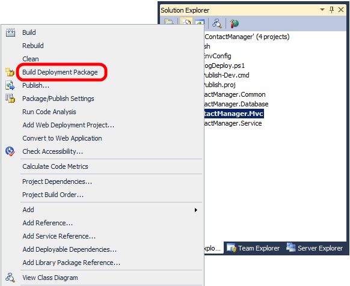
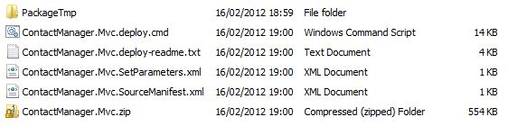
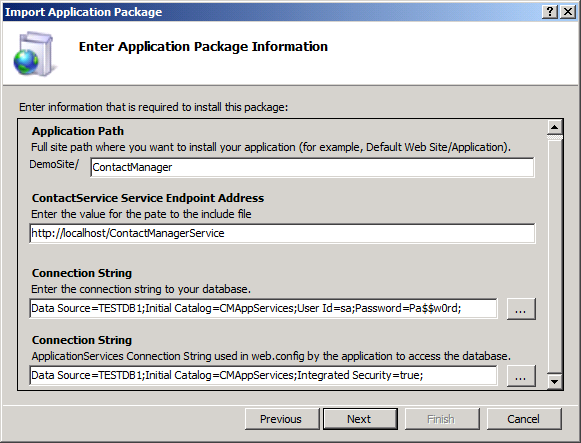
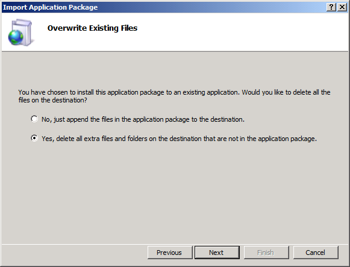

Manually Installing Web Packages
====================
by [Jason Lee](https://github.com/jrjlee)

[Download PDF](https://msdnshared.blob.core.windows.net/media/MSDNBlogsFS/prod.evol.blogs.msdn.com/CommunityServer.Blogs.Components.WeblogFiles/00/00/00/63/56/8130.DeployingWebAppsInEnterpriseScenarios.pdf)

> This topic describes how to manually import a web deployment package into Internet Information Services (IIS).
> 
> The topic [Building and Packaging Web Application Projects](building-and-packaging-web-application-projects.md) described how the IIS Web Deployment Tool (Web Deploy), in conjunction with the Microsoft Build Engine (MSBuild) and the Web Publishing Pipeline (WPP), lets you package your web application projects into a single zip file. This file, commonly known as a web deployment package (or simply a deployment package), contains all the content and configuration information that IIS needs in order to re-create your web application on a web server.
> 
> Once you've created a web deployment package, you can publish it to an IIS server in various ways. In a lot of scenarios, you'll want to take advantage of the integration points between MSBuild, the WPP, and Web Deploy to create and install web packages remotely as part of an automated or single-step build and deployment process. This process is described in [Deploying Web Packages](deploying-web-packages.md). However, this isn't always possible. Suppose you want to deploy a web application to an Internet-facing production environment. For security reasons, such a production environment is at the very least likely to be behind a firewall on a subnet that is separate from the build server, in a perimeter network (also known as DMZ, demilitarized zone, and screened subnet). In lots of cases, the production environment will be on a separate domain or on a physically isolated network.
> 
> In these scenarios, your only option may be to port the web package onto the destination server and manually import it into IIS. Although this approach precludes automated deployment, it's still a highly effective technique for publishing a web application&#x2014;you simply copy a single zip file to your web server and use a wizard to guide you through the import process.

This topic forms part of a series of tutorials based around the enterprise deployment requirements of a fictional company named Fabrikam, Inc. This tutorial series uses a sample solution&#x2014;the [Contact Manager solution](the-contact-manager-solution.md)&#x2014;to represent a web application with a realistic level of complexity, including an ASP.NET MVC 3 application, a Windows Communication Foundation (WCF) service, and a database project.

## Task Overview

You'll need to complete these high-level tasks to import a web deployment package into IIS:

- Create a web deployment package using the MSBuild command line, Team Build, or Visual Studio 2010.
- Copy the web package to the destination web server.
- Use the Import Application Package Wizard in IIS Manager to install the web package and provide values for variables like connection strings and service endpoints.

This topic will show you how to perform these procedures. The tasks and walkthroughs in this topic assume that you're already familiar with the concepts behind web packages, Web Deploy, and the WPP. For more information, see [Building and Packaging Web Application Projects](building-and-packaging-web-application-projects.md).

> [!NOTE]
> This topic is best used in conjunction with [Configure a Web Server for Web Deploy Publishing (Offline Deployment)](../configuring-server-environments-for-web-deployment/configuring-a-web-server-for-web-deploy-publishing-offline-deployment.md), which explains how to install the required components and prepare an IIS website for package import.

## Create a Web Deployment Package

The first task is to create a web deployment package for the web application project you want to deploy. You can create web packages in a variety of ways.

**Approach 1: Create a package as part of the build process with Visual Studio**

You can configure your web application project to create a web deployment package after every build through the **Package/Publish Web** tab on the project property pages. This process is described in [Building and Packaging Web Application Projects](building-and-packaging-web-application-projects.md).

**Approach 2: Create a package as part of the build process with MSBuild**

If you build your web application project by using MSBuild directly, either through a custom MSBuild project file or from the command line, you can create a web deployment package as part of the build process by including the **DeployOnBuild=true** and **DeployTarget=Package** properties in your command. This process is described in [Understanding the Build Process](understanding-the-build-process.md).

**Approach 3: Create a package on demand in Visual Studio**

You can create a web deployment package for a web application project at any time in Visual Studio 2010. To do this, in the **Solution Explorer** window, right-click your web application project, and then click **Build Deployment Package**.

**Approach 4: Create a package on demand from the command line**

You can create a web deployment package from the command line by invoking the **Package** target on your web application project using MSBuild. The command should resemble this:

[!code-console[Main](manually-installing-web-packages/samples/sample1.cmd)]

Whichever approach you use, the end result is the same. The WPP creates a web deployment package as a zip file, together with various supporting resources, in the output folder for your web application project.

When you're planning to import the web package manually, you require only the zip file. Copy this file to your target web server and you can begin the import process.

## Import a Web Package into IIS

You can use the next procedure to import a web deployment package from the local file system into an IIS website. Before you perform this procedure, ensure that you have:

- Copied the web deployment package to the web server.
- Configured an IIS web server to host your application.

For more information on configuring an IIS web server to support web deployment packages, see [Configure a Web Server for Web Deploy Publishing (Offline Deployment)](../configuring-server-environments-for-web-deployment/configuring-a-web-server-for-web-deploy-publishing-offline-deployment.md).

**To import a web deployment package using IIS Manager**

1. In IIS Manager, in the **Connections** pane, right-click your IIS website, point to **Deploy**, and then click **Import Application**.

    
2. In the Import Application Package Wizard, on the **Select the Package** page, browse to the location of your web deployment package, and then click **Next**.
3. On the **Select the Contents of the Package** page, clear any content that you don't require, and then click **Next**.

    

    > [!NOTE]
    > In a lot of cases, you may not want to import everything that comes with a web deployment package. For example, you may not want to allow Web Deploy to replace the associated database.  
    > The **Grant permissions** entries set permissions on the destination file system to ensure that the application pool identity can access the physical folder that stores the website content. In addition, the anonymous authentication user is granted read permission to the folder to let the application serve Multipurpose Internet Mail Extensions (MIME) type files. If you prefer, you can remove these entries and configure permissions manually.
4. On the **Enter Application Package Information** page, provide the requested information.

    
5. When you create a web package, the WPP analyzes the configuration file for your application and detects any variables, like connection strings and service endpoints. In this case:

    1. **Application Path** is the IIS path where you want to install your application. This setting is common to all deployment packages that the WPP creates.
    2. **ContactService Service Endpoint Address** is the address that the application should use to communicate with the deployed WCF service. This setting corresponds to an entry in the *web.config* file.
    3. The first **Connection String** setting is the connection string that Web Deploy should use to deploy the database associated with the application (in this case an ASP.NET membership database). This setting corresponds to the setting on the **Package/Publish SQL** tab in Visual Studio.
    4. The second **Connection String** setting is the connection string that your application will actually use to communicate with the database when it's up and running. This corresponds to a connection string entry in the *web.config* file.

        > [!NOTE]
        > For more information on where these parameters come from, see [Configuring Parameters for Web Package Deployment](configuring-parameters-for-web-package-deployment.md).
6. Click **Next**.
7. If this is not the first time you've deployed the application to this website, you'll be prompted to specify whether you want to delete all existing content prior to installation. Choose the option that's appropriate for your requirements, and then click **Next**.

    
8. When IIS has finished installing the package, click **Finish**.

    

At this point, you've successfully published your web application to IIS.

## Conclusion

This topic described how to import a web deployment package into an IIS website using IIS Manager. This approach to web application publishing is appropriate when security or infrastructure constraints make remote deployment impossible or undesirable.

## Further Reading

For guidance on how to configure an IIS web server to support manually importing a web package, see [Configure a Web Server for Web Deploy Publishing (Offline Deployment)](../configuring-server-environments-for-web-deployment/configuring-a-web-server-for-web-deploy-publishing-offline-deployment.md). For more general guidance on deploying web packages, see [Walkthrough: Deploying a Web Application Project Using a Web Deployment Package (Part 1 of 4)](https://msdn.microsoft.com/en-us/library/dd483479.aspx).

>[!div class="step-by-step"]
[Previous](creating-and-running-a-deployment-command-file.md)