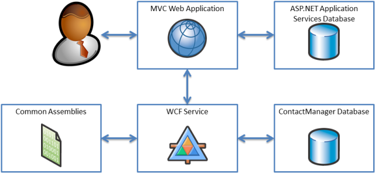

The Contact Manager Solution
====================
by [Jason Lee](https://github.com/jrjlee)

[Download PDF](https://msdnshared.blob.core.windows.net/media/MSDNBlogsFS/prod.evol.blogs.msdn.com/CommunityServer.Blogs.Components.WeblogFiles/00/00/00/63/56/8130.DeployingWebAppsInEnterpriseScenarios.pdf)

> This [series of tutorials](web-deployment-in-the-enterprise.md) uses a sample solution&#x2014;the Contact Manager solution&#x2014;to represent an enterprise-scale application with a realistic level of complexity. This topic introduces the Contact Manager solution, describes the key components of the solution, and identifies the challenges in deploying this kind of application to various destination platforms in an enterprise environment.
> 
> As you work through the topics in these tutorials, you can use the Contact Manager solution as a reference implementation that demonstrates how you can meet specific challenges in enterprise deployment scenarios. The next topic, [Setting Up the Contact Manager Solution](setting-up-the-contact-manager-solution.md), describes how to download and run the solution on your developer workstation.

## Solution Overview

The Contact Manager solution consists of four individual projects:

- **ContactManager.Mvc**. This is an ASP.NET MVC 3 web application project that represents the entry point for the solution. It offers some basic web application functionality, like providing users with the ability to create and view contact details. The application relies on a Windows Communication Foundation (WCF) service to manage contacts and an ASP.NET application services database to manage authentication and authorization.
- **ContactManager.Database**. This is a Visual Studio database project. The project defines the schema for a database that stores contact details.
- **ContactManager.Service**. This is a WCF web service project. The WCF service exposes an endpoint that allows callers to perform create, retrieve, update, and delete (CRUD) operations on the **ContactManager** database. The service relies on the **ContactManager** database and the **ContactManager.Common.dll** assembly.
- **ContactManager.Common**. This is a class library project. The WCF service relies on types defined in this assembly.

The solution also includes a solution folder named Publish. This contains various custom project files and command files that demonstrate how you can control and manipulate the build and deployment process. These are covered in more detail later in this tutorial.

At a conceptual level, the components of the solution fit together like this:

> [!NOTE]
> While the ASP.NET MVC 3 web application uses the ASP.NET membership provider, all the pages within the web application allow anonymous access. This is clearly not a realistic configuration. However, the solution is set up in this way to make it easier for you to deploy and test the solution without configuring user accounts and roles.

## Deployment Challenges

The Contact Manager solution illustrates several deployment challenges that are common to lots of enterprise deployment scenarios:

- The solution consists of multiple dependent projects. You need to deploy these projects simultaneously.
- Connection strings and service endpoints need to be updated for each environment, and in a lot of cases this information will not be available to the developer.
- When you deploy the **ContactManager** database to staging and production environments, you need to preserve existing data on subsequent deployments.
- When you deploy the ASP.NET application services database, you need to deploy some configuration data but omit any user account data.
- The projects include some files and folders that should not be deployed. You need to exclude these files and folders from the deployment process.
- The solution needs to support automated deployment from a Team Foundation Server (TFS) build server.

## Conclusion

This topic provided a high-level overview of the Contact Manager solution and identified some of the inherent deployment challenges that are common to lots of enterprise deployment scenarios. The remaining topics in this tutorial describe some of the techniques you can use to meet these challenges.

The next topic, [Setting Up the Contact Manager Solution](setting-up-the-contact-manager-solution.md), describes how to download and run the solution on your developer workstation.

>[!div class="step-by-step"]
[Previous](web-deployment-in-the-enterprise.md)
[Next](setting-up-the-contact-manager-solution.md)