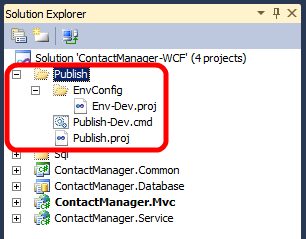
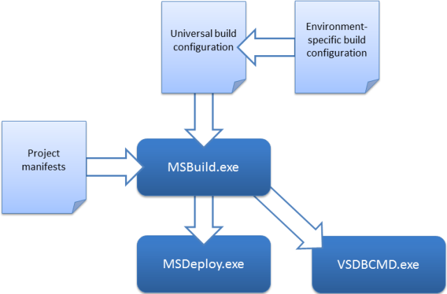

Understanding the Build Process
====================
by [Jason Lee](https://github.com/jrjlee)

[Download PDF](https://msdnshared.blob.core.windows.net/media/MSDNBlogsFS/prod.evol.blogs.msdn.com/CommunityServer.Blogs.Components.WeblogFiles/00/00/00/63/56/8130.DeployingWebAppsInEnterpriseScenarios.pdf)

> This topic provides a walkthrough of an enterprise-scale build and deployment process. The approach described in this topic uses custom Microsoft Build Engine (MSBuild) project files to provide fine-grained control over every aspect of the process. Within the project files, custom MSBuild targets are used to run deployment utilities like the Internet Information Services (IIS) Web Deployment Tool (MSDeploy.exe) and the database deployment utility VSDBCMD.exe.
> 
> > [!NOTE]
> > The previous topic, [Understanding the Project File](understanding-the-project-file.md), described the key components of an MSBuild project file and introduced the concept of split project files to support deployment to multiple target environments. If you're not already familiar with these concepts, you should review [Understanding the Project File](understanding-the-project-file.md) before you work through this topic.

This topic forms part of a series of tutorials based around the enterprise deployment requirements of a fictional company named Fabrikam, Inc. This tutorial series uses a sample solution&#x2014;the [Contact Manager solution](the-contact-manager-solution.md)&#x2014;to represent a web application with a realistic level of complexity, including an ASP.NET MVC 3 application, a Windows Communication Foundation (WCF) service, and a database project.

The deployment method at the heart of these tutorials is based on the split project file approach described in [Understanding the Project File](understanding-the-project-file.md), in which the build process is controlled by two project files&#x2014;one containing build instructions that apply to every destination environment, and one containing environment-specific build and deployment settings. At build time, the environment-specific project file is merged into the environment-agnostic project file to form a complete set of build instructions.

## Build and Deployment Overview

In the [Contact Manager solution](the-contact-manager-solution.md), three files control the build and deployment process:

- A *universal project file* (*Publish.proj*). This contains build and deployment instructions that do not change between destination environments.
- An *environment-specific project file* (*Env-Dev.proj*). This contains build and deployment settings that are specific to a particular destination environment. For example, you could use the *Env-Dev.proj* file to provide settings for a developer or test environment and create an alternative file named *Env-Stage.proj* to provide settings for a staging environment.
- A *command file* (*Publish-Dev.cmd*). This contains an MSBuild.exe command that specifies which project files you want to execute. You can create a command file for every destination environment, where each file contains an MSBuild.exe command that specifies a different environment-specific project file. This lets the developer deploy to different environments simply by running the appropriate command file.

In the sample solution, you can find these three files in the Publish solution folder.

Before you look at these files in more detail, let's take a look at how the overall build process works when you use this approach. At a high level, the build and deployment process looks like this:

The first thing that happens is that the two project files&#x2014;one containing universal build and deployment instructions, and one containing environment-specific settings&#x2014;are merged into a single project file. MSBuild then works through the instructions in the project file. It builds each of the projects in the solution, using the project file for each project. It then calls out to other tools, like Web Deploy (MSDeploy.exe) and the VSDBCMD utility to deploy your web content and databases to the target environment.

From start to finish, the build and deployment process performs these tasks:

1. It deletes the contents of the output directory, in preparation for a fresh build.
2. It builds each project in the solution:

    1. For web projects&#x2014;in this case, an ASP.NET MVC web application and a WCF web service&#x2014;the build process creates a web deployment package for each project.
    2. For database projects, the build process creates a deployment manifest (.deploymanifest file) for each project.
3. It uses the VSDBCMD.exe utility to deploy each database project in the solution, using various properties from the project files&#x2014;a target connection string and a database name&#x2014;together with the .deploymanifest file.
4. It uses the MSDeploy.exe utility to deploy each web project in the solution, using various properties from the project files to control the deployment process.

You can use the sample solution to trace this process in more detail.

> [!NOTE]
> For guidance on how to customize the environment-specific project files for your own server environments, see [Configure Deployment Properties for a Target Environment](../configuring-server-environments-for-web-deployment/configuring-deployment-properties-for-a-target-environment.md).

## Invoking the Build and Deployment Process

To deploy the Contact Manager solution to a developer test environment, the developer runs the *Publish-Dev.cmd* command file. This invokes MSBuild.exe, specifying *Publish.proj* as the project file to execute and *Env-Dev.proj* as a parameter value.

[!code-console[Main](understanding-the-build-process/samples/sample1.cmd)]

> [!NOTE]
> The **/fl** switch (short for **/fileLogger**) logs the build output to a file named *msbuild.log* in the current directory. For more information, see the [MSBuild Command Line Reference](https://msdn.microsoft.com/en-us/library/ms164311.aspx).

At this point, MSBuild starts running, loads the *Publish.proj* file, and starts processing the instructions within it. The first instruction tells MSBuild to import the project file that the **TargetEnvPropsFile** parameter specifies.

[!code-xml[Main](understanding-the-build-process/samples/sample2.xml)]

The **TargetEnvPropsFile** parameter specifies the *Env-Dev.proj* file, so MSBuild merges the contents of the *Env-Dev.proj* file into the *Publish.proj* file.

The next elements that MSBuild encounters in the merged project file are property groups. Properties are processed in the order in which they appear in the file. MSBuild creates a key-value pair for each property, providing that any specified conditions are met. Properties defined later in the file will overwrite any properties with the same name defined earlier in the file. For example, consider the **OutputRoot** properties.

[!code-xml[Main](understanding-the-build-process/samples/sample3.xml)]

When MSBuild processes the first **OutputRoot** element, providing a similarly named parameter has not been provided, it sets the value of the **OutputRoot** property to **..\Publish\Out**. When it encounters the second **OutputRoot** element, if the condition evaluates to **true**, it will overwrite the value of the **OutputRoot** property with the value of the **OutDir** parameter.

The next element that MSBuild encounters is a single item group, containing an item named **ProjectsToBuild**.

[!code-xml[Main](understanding-the-build-process/samples/sample4.xml)]

MSBuild processes this instruction by building an item list named **ProjectsToBuild**. In this case, the item list contains a single value&#x2014;the path and filename of the solution file.

At this point, the remaining elements are targets. Targets are processed differently from properties and items&#x2014;essentially, targets are not processed unless they are either explicitly specified by the user or invoked by another construct within the project file. Recall that the opening **Project** tag includes a **DefaultTargets** attribute.

[!code-xml[Main](understanding-the-build-process/samples/sample5.xml)]

This instructs MSBuild to invoke the **FullPublish** target, if targets are not specified when MSBuild.exe is invoked. The **FullPublish** target doesn't contain any tasks; instead it simply specifies a list of dependencies.

[!code-xml[Main](understanding-the-build-process/samples/sample6.xml)]

This dependency tells MSBuild that in order to execute the **FullPublish** target, it needs to invoke this list of targets in the order provided:

1. It must invoke the **Clean** target.
2. It must invoke the **BuildProjects** target.
3. It must invoke the **GatherPackagesForPublishing** target.
4. It must invoke the **PublishDbPackages** target.
5. It must invoke the **PublishWebPackages** target.

### The Clean Target

The **Clean** target basically deletes the output directory and all its contents, as preparation for a fresh build.

[!code-xml[Main](understanding-the-build-process/samples/sample7.xml)]

Notice that the target includes an **ItemGroup** element. When you define properties or items within a **Target** element, you're creating *dynamic* properties and items. In other words, the properties or items aren't processed until the target is executed. The output directory might not exist or contain any files until the build process begins, so you can't build the **\_FilesToDelete** list as a static item; you have to wait until execution is underway. As such, you build the list as a dynamic item within the target.

> [!NOTE]
> In this case, because the **Clean** target is the first to be executed, there's no real need to use a dynamic item group. However, it's good practice to use dynamic properties and items in this type of scenario, as you might want to execute targets in a different order at some point.  
> You should also aim to avoid declaring items that will never be used. If you have items that will only be used by a specific target, consider placing them inside the target to remove any unnecessary overhead on the build process.

Dynamic items aside, the **Clean** target is fairly straightforward and makes use of the built-in **Message**, **Delete**, and **RemoveDir** tasks to:

1. Send a message to the logger.
2. Build a list of files to delete.
3. Delete the files.
4. Remove the output directory.

### The BuildProjects Target

The **BuildProjects** target basically builds all the projects in the sample solution.

[!code-xml[Main](understanding-the-build-process/samples/sample8.xml)]

This target was described in some detail in the previous topic, [Understanding the Project File](understanding-the-project-file.md), to illustrate how tasks and targets reference properties and items. At this point, you're mainly interested in the **MSBuild** task. You can use this task to build multiple projects. The task does not create a new instance of MSBuild.exe; it uses the current running instance to build each project. The key points of interest in this example are the deployment properties:

- The **DeployOnBuild** property instructs MSBuild to run any deployment instructions in the project settings when the build of each project is complete.
- The **DeployTarget** property identifies the target that you want to invoke after the project is built. In this case, the **Package** target builds the project output into a deployable web package.

> [!NOTE]
> The **Package** target invokes the Web Publishing Pipeline (WPP), which provides integration between MSBuild and Web Deploy. If you want to take a look at the built-in targets that the WPP provides, review the *Microsoft.Web.Publishing.targets* file in the %PROGRAMFILES(x86)%\MSBuild\Microsoft\VisualStudio\v10.0\Web folder.

### The GatherPackagesForPublishing Target

If you study the **GatherPackagesForPublishing** target, you'll notice that it doesn't actually contain any tasks. Instead, it contains a single item group that defines three dynamic items.

[!code-xml[Main](understanding-the-build-process/samples/sample9.xml)]

These items refer to the deployment packages that were created when the **BuildProjects** target was executed. You couldn't define these items statically in the project file, because the files to which the items refer don't exist until the **BuildProjects** target is executed. Instead, the items must be defined dynamically within a target that is not invoked until after the **BuildProjects** target is executed.

The items are not used within this target&#x2014;this target simply builds the items and the metadata associated with each item value. Once these elements are processed, the **PublishPackages** item will contain two values, the path to the *ContactManager.Mvc.deploy.cmd* file and the path to the *ContactManager.Service.deploy.cmd* file. Web Deploy creates these files as part of the web package for each project, and these are the files that you must invoke on the destination server in order to deploy the packages. If you open up one of these files, you'll basically see an MSDeploy.exe command with various build-specific parameter values.

The **DbPublishPackages** item will contain a single value, the path to the *ContactManager.Database.deploymanifest* file.

> [!NOTE]
> A .deploymanifest file is generated when you build a database project, and it uses the same schema as an MSBuild project file. It contains all the information required to deploy a database, including the location of the database schema (.dbschema) and details of any pre-deployment and post-deployment scripts. For more information, see [An Overview of Database Build and Deployment](https://msdn.microsoft.com/en-us/library/aa833165.aspx).

You'll learn more about how deployment packages and database deployment manifests are created and used in [Building and Packaging Web Application Projects](building-and-packaging-web-application-projects.md) and [Deploying Database Projects](deploying-database-projects.md).

### The PublishDbPackages Target

Briefly speaking, the **PublishDbPackages** target invokes the VSDBCMD utility to deploy the **ContactManager** database to a target environment. Configuring database deployment involves lots of decisions and nuances, and you'll learn more about this in [Deploying Database Projects](deploying-database-projects.md) and [Customizing Database Deployments for Multiple Environments](../advanced-enterprise-web-deployment/customizing-database-deployments-for-multiple-environments.md). In this topic, we'll focus on how this target actually functions.

First, notice that the opening tag includes an **Outputs** attribute.

[!code-xml[Main](understanding-the-build-process/samples/sample10.xml)]

This is an example of *target batching*. In MSBuild project files, batching is a technique for iterating over collections. The value of the **Outputs** attribute, **"%(DbPublishPackages.Identity)"**, refers to the **Identity** metadata property of the **DbPublishPackages** item list. This notation, **Outputs=%***(ItemList.ItemMetadataName)*, is translated as:

- Split the items in **DbPublishPackages** into batches of items that contain the same **Identity** metadata value.
- Execute the target once per batch.

> [!NOTE]
> **Identity** is one of the [built-in metadata values](https://msdn.microsoft.com/en-us/library/ms164313.aspx) that is assigned to every item on creation. It refers to the value of the **Include** attribute in the **Item** element&#x2014;in other words, the path and filename of the item.

In this case, because there should never be more than one item with the same path and filename, we're essentially working with batch sizes of one. The target is executed once for every database package.

You can see a similar notation in the **\_Cmd** property, which builds a VSDBCMD command with the appropriate switches.

[!code-xml[Main](understanding-the-build-process/samples/sample11.xml)]

In this case, **%(DbPublishPackages.DatabaseConnectionString)**, **%(DbPublishPackages.TargetDatabase)**, and **%(DbPublishPackages.FullPath)** all refer to metadata values of the **DbPublishPackages** item collection. The **\_Cmd** property is used by the **Exec** task, which invokes the command.

[!code-xml[Main](understanding-the-build-process/samples/sample12.xml)]

As a result of this notation, the **Exec** task will create batches based on unique combinations of the **DatabaseConnectionString**, **TargetDatabase**, and **FullPath** metadata values, and the task will execute once for each batch. This is an example of *task batching*. However, because the target-level batching has already divided our item collection into single-item batches, the **Exec** task will run once and only once for each iteration of the target. In other words, this task invokes the VSDBCMD utility once for each database package in the solution.

> [!NOTE]
> For more information on target and task batching, see MSBuild [Batching](https://msdn.microsoft.com/en-us/library/ms171473.aspx), [Item Metadata in Target Batching](https://msdn.microsoft.com/en-US/library/ms228229.aspx), and [Item Metadata in Task Batching](https://msdn.microsoft.com/en-us/library/ms171474.aspx).

### The PublishWebPackages Target

By this point, you've invoked the **BuildProjects** target, which generates a web deployment package for each project in the sample solution. Accompanying each package is a *deploy.cmd* file, which contains the MSDeploy.exe commands required to deploy the package to the target environment, and a *SetParameters.xml* file, which specifies the necessary details of the target environment. You've also invoked the **GatherPackagesForPublishing** target, which generates an item collection containing the *deploy.cmd* files you're interested in. Essentially, the **PublishWebPackages** target performs these functions:

- It manipulates the *SetParameters.xml* file for each package to include the correct details for the target environment, using the **XmlPoke** task.
- It invokes the *deploy.cmd* file for each package, using the appropriate switches.

Just like the **PublishDbPackages** target, the **PublishWebPackages** target uses target batching to ensure that the target is executed once for each web package.

[!code-xml[Main](understanding-the-build-process/samples/sample13.xml)]

Within the target, the **Exec** task is used to run the *deploy.cmd* file for each web package.

[!code-xml[Main](understanding-the-build-process/samples/sample14.xml)]

For more information on configuring the deployment of web packages, see [Building and Packaging Web Application Projects](building-and-packaging-web-application-projects.md).

## Conclusion

This topic provided a walkthrough of how split project files are used to control the build and deployment process from start to finish for the Contact Manager sample solution. Using this approach lets you run complex, enterprise-scale deployments in a single, repeatable step, simply by running an environment-specific command file.

## Further Reading

For a more in-depth introduction to project files and the WPP, see [Inside the Microsoft Build Engine: Using MSBuild and Team Foundation Build](http://amzn.com/0735645248) by Sayed Ibrahim Hashimi and William Bartholomew, ISBN: 978-0-7356-4524-0.

>[!div class="step-by-step"]
[Previous](understanding-the-project-file.md)
[Next](building-and-packaging-web-application-projects.md)