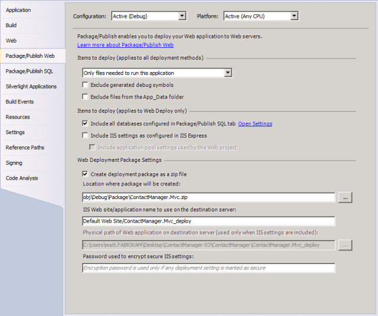
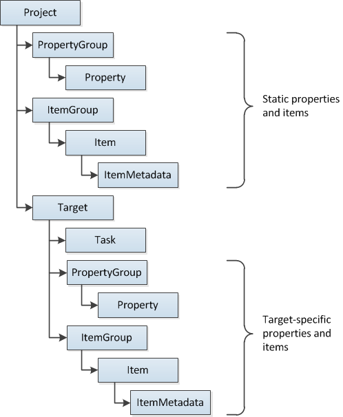
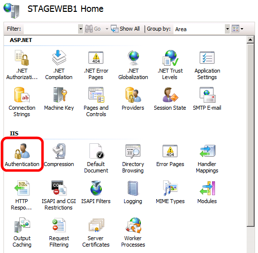

Understanding the Project File
====================
by [Jason Lee](https://github.com/jrjlee)

[Download PDF](https://msdnshared.blob.core.windows.net/media/MSDNBlogsFS/prod.evol.blogs.msdn.com/CommunityServer.Blogs.Components.WeblogFiles/00/00/00/63/56/8130.DeployingWebAppsInEnterpriseScenarios.pdf)

> Microsoft Build Engine (MSBuild) project files lie at the heart of the build and deployment process. This topic starts with a conceptual overview of MSBuild and the project file. It describes the key components you'll come across when you work with project files, and it works through an example of how you can use project files to deploy real-world applications.
> 
> What you'll learn:
> 
> - How MSBuild uses MSBuild project files to build projects.
> - How MSBuild integrates with deployment technologies, like the Internet Information Services (IIS) Web Deployment Tool (Web Deploy).
> - How to understand the key components of a project file.
> - How you can use project files to build and deploy complex applications.

## MSBuild and the Project File

When you create and build solutions in Visual Studio, Visual Studio uses MSBuild to build each project in your solution. Every Visual Studio project includes an MSBuild project file, with a file extension that reflects the type of project&#x2014;for example, a C# project (.csproj), a Visual Basic.NET project (.vbproj), or a database project (.dbproj). In order to build a project, MSBuild must process the project file associated with the project. The project file is an XML document that contains all the information and instructions that MSBuild needs in order to build your project, like the content to include, the platform requirements, versioning information, web server or database server settings, and the tasks that must be performed.

MSBuild project files are based on the [MSBuild XML schema](https://msdn.microsoft.com/en-us/library/5dy88c2e.aspx), and as a result the build process is entirely open and transparent. In addition, you don't need to install Visual Studio in order to use the MSBuild engine&#x2014;the MSBuild.exe executable is part of the .NET Framework, and you can run it from a command prompt. As a developer, you can craft your own MSBuild project files, using the MSBuild XML schema, to impose sophisticated and fine-grained control over how your projects are built and deployed. These custom project files work in exactly the same way as the project files that Visual Studio generates automatically.

> [!NOTE]
> You can also use MSBuild project files with the Team Build service in Team Foundation Server (TFS). For example, you can use project files in continuous integration (CI) scenarios to automate deployment to a test environment when new code is checked in. For more information, see [Configuring Team Foundation Server for Automated Web Deployment](../configuring-team-foundation-server-for-web-deployment/configuring-team-foundation-server-for-web-deployment.md).

### Project File Naming Conventions

When you create your own project files, you can use any file extension you like. However, to make your solutions easier for others to understand, you should use these common conventions:

- Use the .proj extension when you create a project file that builds projects.
- Use the .targets extension when you create a reusable project file to import into other project files. Files with a .targets extension typically don't build anything themselves, they simply contain instructions that you can import into your .proj files.

### Integration with Deployment Technologies

If you've worked with web application projects in Visual Studio 2010, like ASP.NET web applications and ASP.NET MVC web applications, you'll know that these projects include built-in support for packaging and deploying the web application to a target environment. The **Properties** pages for these projects include **Package/Publish Web** and **Package/Publish SQL** tabs that you can use to configure how the components of your application are packaged and deployed. This shows the **Package/Publish Web** tab:

The underlying technology behind these capabilities is known as the Web Publishing Pipeline (WPP). The WPP essentially brings MSBuild and [Web Deploy](https://go.microsoft.com/?linkid=9805122) together to provide a complete build, package, and deployment process for your web applications.

The good news is that you can take advantage of the integration points that the WPP provides when you create custom project files for web projects. You can include deployment instructions in your project file, which allows you to build your projects, create web deployment packages, and install these packages on remote servers through a single project file and a single call to MSBuild. You can also call any other executables as part of your build process. For example, you can run the VSDBCMD.exe command-line tool to deploy a database from a schema file. Over the course of this topic, you'll see how you can take advantage of these capabilities to meet the requirements of your enterprise deployment scenarios.

> [!NOTE]
> For more information on how the web application deployment process works, see [ASP.NET Web Application Project Deployment Overview](https://msdn.microsoft.com/en-us/library/dd394698.aspx).

## The Anatomy of a Project File

Before you look at the build process in more detail, it's worth taking a few moments to familiarize yourself with the basic structure of an MSBuild project file. This section provides an overview of the more common elements that you'll encounter when you review, edit, or create a project file. In particular, you'll learn:

- How to use *properties* to manage variables for the build process.
- How to use *items* to identify the inputs to the build process, like code files.
- How to use *targets* and *tasks* to provide execution instructions to MSBuild, using *properties* and *items* defined elsewhere in the project file.

This shows the relationship between the key elements in an MSBuild project file:

### The Project Element

The [Project](https://msdn.microsoft.com/en-us/library/bcxfsh87.aspx) element is the root element of every project file. In addition to identifying the XML schema for the project file, the **Project** element can include attributes to specify the entry points for the build process. For example, in the [Contact Manager sample solution](the-contact-manager-solution.md), the *Publish.proj* file specifies that the build should start by calling the target named **FullPublish**.

[!code-xml[Main](understanding-the-project-file/samples/sample1.xml)]

### Properties and Conditions

A project file typically needs to provide lots of different pieces of information in order to successfully build and deploy your projects. These pieces of information could include server names, connection strings, credentials, build configurations, source and destination file paths, and any other information you want to include to support customization. In a project file, properties must be defined within a [PropertyGroup](https://msdn.microsoft.com/en-us/library/t4w159bs.aspx) element. MSBuild properties consist of key-value pairs. Within the **PropertyGroup** element, the element name defines the property key and the content of the element defines the property value. For example, you could define properties named **ServerName** and **ConnectionString** to store a static server name and connection string.

[!code-xml[Main](understanding-the-project-file/samples/sample2.xml)]

To retrieve a property value, you use the format **$(***PropertyName***)***.*For example, to retrieve the value of the **ServerName** property, you would type:

[!code-powershell[Main](understanding-the-project-file/samples/sample3.ps1)]

> [!NOTE]
> You'll see examples of how and when to use property values later in this topic.

Embedding information as static properties in a project file is not always the ideal approach to managing the build process. In a lot of scenarios, you'll want to obtain the information from other sources or empower the user to provide the information from the command prompt. MSBuild allows you to specify any property value as a command-line parameter. For example, the user could provide a value for **ServerName** when he or she runs MSBuild.exe from the command line.

[!code-console[Main](understanding-the-project-file/samples/sample4.cmd)]

> [!NOTE]
> For more information on the arguments and switches you can use with MSBuild.exe, see [MSBuild Command Line Reference](https://msdn.microsoft.com/en-us/library/ms164311.aspx).

You can use the same property syntax to obtain the values of environment variables and built-in project properties. Lots of commonly used properties are defined for you, and you can use them in your project files by including the relevant parameter name. For example, to retrieve the current project platform&#x2014;for example, **x86** or **AnyCpu**&#x2014;you can include the **$(Platform)** property reference in your project file. For more information, see [Macros for Build Commands and Properties](https://msdn.microsoft.com/en-us/library/c02as0cs.aspx), [Common MSBuild Project Properties](https://msdn.microsoft.com/en-us/library/bb629394.aspx), and [Reserved Properties](https://msdn.microsoft.com/en-us/library/ms164309.aspx).

Properties are often used in conjunction with *conditions*. Most MSBuild elements support the **Condition** attribute, which lets you specify the criteria upon which MSBuild should evaluate the element. For example, consider this property definition:

[!code-xml[Main](understanding-the-project-file/samples/sample5.xml)]

When MSBuild processes this property definition, it first checks to see whether an **$(OutputRoot)** property value is available. If the property value is blank&#x2014;in other words, the user hasn't provided a value for this property&#x2014;the condition evaluates to **true** and the property value is set to **..\Publish\Out**. If the user has provided a value for this property, the condition evaluates to **false** and the static property value is not used.

For more information on the different ways in which you can specify conditions, see [MSBuild Conditions](https://msdn.microsoft.com/en-us/library/7szfhaft.aspx).

### Items and Item Groups

One of the important roles of the project file is to define the inputs to the build process. Typically, these inputs are files&#x2014;code files, configuration files, command files, and any other files that you need to process or copy as part of the build process. In the MSBuild project schema, these inputs are represented by [Item](https://msdn.microsoft.com/en-us/library/ms164283.aspx) elements. In a project file, items must be defined within an [ItemGroup](https://msdn.microsoft.com/en-us/library/646dk05y.aspx) element. Just like **Property** elements, you can name an **Item** element however you like. However, you must specify an **Include** attribute to identify the file or wildcard that the item represents.

[!code-xml[Main](understanding-the-project-file/samples/sample6.xml)]

By specifying multiple **Item** elements with the same name, you're effectively creating a named list of resources. A good way to see this in action is to take a look inside one of the project files that Visual Studio creates. For example, the *ContactManager.Mvc.csproj* file in the sample solution includes a lot of item groups, each with several identically named **Item** elements.

[!code-xml[Main](understanding-the-project-file/samples/sample7.xml)]

In this way, the project file is instructing MSBuild to construct lists of files that need to be processed in the same way&#x2014;the **Reference** list includes assemblies that must be in place for a successful build, the **Compile** list includes code files that must be compiled, and the **Content** list includes resources that must be copied unaltered. We'll look at how the build process references and uses these items later in this topic.

Item elements can also include [ItemMetadata](https://msdn.microsoft.com/en-us/library/ms164284.aspx) child elements. These are user-defined key-value pairs and essentially represent properties that are specific to that item. For example, a lot of the **Compile** item elements in the project file include **DependentUpon** child elements.

[!code-xml[Main](understanding-the-project-file/samples/sample8.xml)]

> [!NOTE]
> In addition to user-created item metadata, all items are assigned various common metadata on creation. For more information, see [Well-known Item Metadata](https://msdn.microsoft.com/en-us/library/ms164313.aspx).

You can create **ItemGroup** elements within the root-level **Project** element or within specific **Target** elements. **ItemGroup** elements also support **Condition** attributes, which lets you tailor the inputs to the build process according to conditions like the project configuration or platform.

### Targets and Tasks

In the MSBuild schema, a [Task](https://msdn.microsoft.com/en-us/library/77f2hx1s.aspx) element represents an individual build instruction (or task). MSBuild includes a multitude of predefined tasks. For example:

- The **Copy** task copies files to a new location.
- The **Csc** task invokes the Visual C# compiler.
- The **Vbc** task invokes the Visual Basic compiler.
- The **Exec** task runs a specified program.
- The **Message** task writes a message to a logger.

> [!NOTE]
> For full details of the tasks that are available out of the box, see [MSBuild Task Reference](https://msdn.microsoft.com/en-us/library/7z253716.aspx). For more information on tasks, including how to create your own custom tasks, see [MSBuild Tasks](https://msdn.microsoft.com/en-us/library/ms171466.aspx).

Tasks must always be contained within [Target](https://msdn.microsoft.com/en-us/library/t50z2hka.aspx) elements. A **Target** element is a set of one or more tasks that are executed sequentially, and a project file can contain multiple targets. When you want to run a task, or a set of tasks, you invoke the target that contains them. For example, suppose you have a simple project file that logs a message.

[!code-xml[Main](understanding-the-project-file/samples/sample9.xml)]

You can invoke the target from the command line, by using the **/t** switch to specify the target.

[!code-console[Main](understanding-the-project-file/samples/sample10.cmd)]

Alternatively, you can add a **DefaultTargets** attribute to the **Project** element, to specify the targets that you want to invoke.

[!code-xml[Main](understanding-the-project-file/samples/sample11.xml)]

In this case, you don't need to specify the target from the command line. You can simply specify the project file, and MSBuild will invoke the **FullPublish** target for you.

[!code-console[Main](understanding-the-project-file/samples/sample12.cmd)]

Both targets and tasks can include **Condition** attributes. As such, you can choose to omit entire targets or individual tasks if certain conditions are met.

Generally speaking, when you create useful tasks and targets, you'll need to refer to the properties and items that you've defined elsewhere in the project file:

- To use a property value, type **$(***PropertyName***)**, where *PropertyName* is the name of the **Property** element or the name of the parameter.
- To use an item, type **@(***ItemName***)**, where *ItemName* is the name of the **Item** element.

> [!NOTE]
> Remember that if you create multiple items with the same name, you're building a list. In contrast, if you create multiple properties with the same name, the last property value you provide will overwrite any previous properties with the same name&#x2014;a property can only contain a single value.

For example, in the *Publish.proj* file in the sample solution, take a look at the **BuildProjects** target.

[!code-xml[Main](understanding-the-project-file/samples/sample13.xml)]

In this sample, you can observe these key points:

- If the **BuildingInTeamBuild** parameter is specified and has a value of **true**, none of the tasks within this target will be executed.
- The target contains a single instance of the [MSBuild](https://msdn.microsoft.com/en-us/library/z7f65y0d.aspx) task. This task lets you build other MSBuild projects.
- The **ProjectsToBuild** item is passed to the task. This item could represent a list of project or solution files, all defined by **ProjectsToBuild** item elements within an item group. In this case, the **ProjectsToBuild** item refers to a single solution file.

    [!code-xml[Main](understanding-the-project-file/samples/sample14.xml)]
- The property values passed to the **MSBuild** task include parameters named **OutputRoot** and **Configuration**. These are set to parameter values if they are provided, or static property values if they are not.

    [!code-xml[Main](understanding-the-project-file/samples/sample15.xml)]

You can also see that the **MSBuild** task invokes a target named **Build**. This is one of several built-in targets that are widely used in Visual Studio project files and are available to you in your custom project files, like **Build**, **Clean**, **Rebuild**, and **Publish**. You'll learn more about using targets and tasks to control the build process, and about the **MSBuild** task in particular, later in this topic.

> [!NOTE]
> For more information on targets, see [MSBuild Targets](https://msdn.microsoft.com/en-us/library/ms171462.aspx).

## Splitting Project Files to Support Multiple Environments

Suppose you want to be able to deploy a solution to multiple environments, like test servers, staging platforms, and production environments. The configuration may vary substantially between these environments&#x2014;not just in terms of server names, connection strings, and so on, but also potentially in terms of credentials, security settings, and lots of other factors. If you need to do this regularly, it's not really expedient to edit multiple properties in your project file every time you switch the target environment. Nor is it an ideal solution to require an endless list of property values to be provided to the build process.

Fortunately there is an alternative. MSBuild lets you split your build configuration across multiple project files. To see how this works, in the sample solution, notice that there are two custom project files:

- *Publish.proj*, which contains properties, items, and targets that are common to all environments.
- *Env-Dev.proj*, which contains properties that are specific to a developer environment.

Now notice that the *Publish.proj* file includes an [Import](https://msdn.microsoft.com/en-us/library/92x05xfs.aspx) element, immediately beneath the opening **Project** tag.

[!code-xml[Main](understanding-the-project-file/samples/sample16.xml)]

The **Import** element is used to import the contents of another MSBuild project file into the current MSBuild project file. In this case, the **TargetEnvPropsFile** parameter provides the filename of the project file you want to import. You can provide a value for this parameter when you run MSBuild.

[!code-console[Main](understanding-the-project-file/samples/sample17.cmd)]

This effectively merges the contents of the two files into a single project file. Using this approach, you can create one project file containing your universal build configuration and multiple supplementary project files containing environment-specific properties. As a result, simply running a command with a different parameter value lets you deploy your solution to a different environment.

Splitting your project files in this way is a good practice to follow. It allows developers to deploy to multiple environments by running a single command, while avoiding the duplication of universal build properties across multiple project files.

> [!NOTE]
> For guidance on how to customize the environment-specific project files for your own server environments, see [Configuring Deployment Properties for a Target Environment](../configuring-server-environments-for-web-deployment/configuring-deployment-properties-for-a-target-environment.md).

## Conclusion

This topic provided a general introduction to MSBuild project files and explained how you can create your own custom project files to control the build process. It also introduced the concept of splitting project files into universal build instructions and environment-specific build properties, to make it easy to build and deploy projects to multiple destinations.

The next topic, [Understanding the Build Process](understanding-the-build-process.md), provides more insight into how you can use project files to control build and deployment by walking you through the deployment of a solution with a realistic level of complexity.

## Further Reading

For a more in-depth introduction to project files and the WPP, see [Inside the Microsoft Build Engine: Using MSBuild and Team Foundation Build](http://amzn.com/0735645248) by Sayed Ibrahim Hashimi and William Bartholomew, ISBN: 978-0-7356-4524-0.

>[!div class="step-by-step"]
[Previous](setting-up-the-contact-manager-solution.md)
[Next](understanding-the-build-process.md)