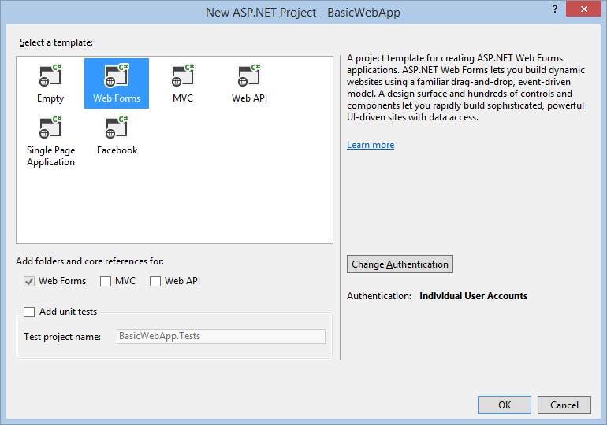
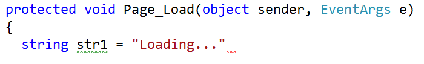

Code Editing ASP.NET Web Forms in Visual Studio 2013
====================
by [Erik Reitan](https://github.com/Erikre)

In many ASP.NET Web Form pages, you write code in Visual Basic, C#, or another language. The code editor in Visual Studio can help you write code quickly while helping you avoid errors. In addition, the editor provides ways for you to create reusable code to help reduce the amount of work you need to do.

This walkthrough illustrates various features of the Visual Studio code editor.

During this walkthrough, you will learn how to:

- Correct inline coding errors.
- Refactor and rename code.
- Rename variables and objects.
- Insert code snippets.

## Prerequisites

In order to complete this walkthrough, you will need:

- [Microsoft Visual Studio 2013](https://www.microsoft.com/visualstudio/11/en-us/downloads#vs) or [Microsoft Visual Studio Express 2013 for Web](https://www.microsoft.com/visualstudio/11/en-us/downloads#express-web). The .NET Framework is installed automatically. 

    > [!NOTE] 
    > 
    > Microsoft Visual Studio 2013 and Microsoft Visual Studio Express 2013 for Web will often be referred to as Visual Studio throughout this tutorial series.  
    >   
    > If you are using Visual Studio, this walkthrough assumes that you selected the **Web Development** collection of settings the first time that you started Visual Studio. For more information, see [How to: Select Web Development Environment Settings](https://msdn.microsoft.com/library/ff521558.aspx).

 For an introduction to Visual Studio and ASP.NET, see [Creating a basic ASP.NET 4.5 Web Forms page in Visual Studio 2013](creating-a-basic-web-forms-page.md).   
 

## Creating a Web application project and a Page

In this part of the walkthrough, you will create a Web application project and add a new page to it.

### To create a Web application project

1. Open Microsoft Visual Studio.
2. On the **File** menu, select **New Project**.  
    

    The **New Project** dialog box appears.
3. Select the **Templates** -&gt; **Visual C#** -&gt; **Web** templates group on the left.
4. Choose the **ASP.NET Web Application** template in the center column.
5. Name your project ***BasicWebApp*** and click the **OK** button.   

6. Next, select the **Web Forms** template and click the **OK** button to create the project.  
  

    Visual Studio creates a new project that includes prebuilt functionality based on the Web Forms template.

## Creating a new ASP.NET Web Forms Page

When you create a new Web Forms application using the **ASP.NET Web Application** project template, Visual Studio adds an ASP.NET page (Web Forms page) named *Default.aspx*, as well as several other files and folders. You can use the *Default.aspx* page as the home page for your Web application. However, for this walkthrough, you will create and work with a new page.

### To add a page to the Web application

1. In **Solution Explorer**, right-click the Web application name (in this tutorial the application name is **BasicWebSite**), and then click **Add** -&gt; **New Item**.   
The **Add New Item** dialog box is displayed.
2. Select the **Visual C#** -&gt; **Web** templates group on the left. Then, select **Web Form** from the middle list and name it *FirstWebPage.aspx*.   
    
3. Click **Add** to add the Web Forms page to your project.  
 Visual Studio creates the new page and opens it.
4. Next, set this new page as the default startup page. In **Solution Explorer**, right-click the new page named *FirstWebPage.aspx* and select **Set As Start Page**. The next time you run this application to test our progress, you will automatically see this new page in the browser.

## Correcting Inline Coding Errors

The code editor in Visual Studio helps you to avoid errors as you write code, and if you have made an error, the code editor helps you to correct the error. In this part of the walkthrough, you will write a line of code that illustrate the error correction features in the editor.

### To correct simple coding errors in Visual Studio

1. In **Design** view, double-click the blank page to create a handler for the **Load** event for the page.   
You are using the event handler only as a place to write some code.
2. Inside the handler, type the following line that contains an error and press **ENTER**:

    [!code-csharp[Main](code-editing-in-web-forms-pages/samples/sample1.cs)]

 When you press **ENTER**, the code editor places green and red underlines (commonly call &quot;squiggly&quot; lines) under areas of the code that have issues. A green underline indicates a warning. A red underline indicates an error that you must fix. 

    Hold the mouse pointer over `myStr` to see a tooltip that tells you about the warning. Also, hold your mouse pointer over the red underline to see the error message.

    The following image shows the code with the underlines.

      
 The error must be fixed by adding a semicolon `;` to the end of the line. The warning simply notifies you that you haven't used the `myStr` variable yet.  

    > [!NOTE] 
    > 
    > You view your current code formatting settings in Visual Studio by selecting **Tools** -&gt; **Options** -&gt; **Fonts and Colors**.

## Refactoring and Renaming

Refactoring is a software methodology that involves restructuring your code to make it easier to understand and to maintain, while preserving its functionality. A simple example might be that you write code in an event handler to get data from a database. As you develop your page, you discover that you need to access the data from several different handlers. Therefore, you refactor the page's code by creating a data-access method in the page and inserting calls to the method in the handlers.

The code editor includes tools to help you perform various refactoring tasks. In this walkthrough, you will work with two refactoring techniques: renaming variables and extracting methods. Other refactoring options include encapsulating fields, promoting local variables to method parameters, and managing method parameters. The availability of these refactoring options depends on the location in the code.

### Refactoring Code

A common refactoring scenario is to create (extract) a method from code that is inside another member, such as a method. This reduces the size of the original member and makes the extracted code reusable.

In this part of the walkthrough, you will write some simple code, and then extract a method from it. Refactoring is supported for C#, so you will create a page that uses C# as its programming language.

### To extract a method in a C# page

1. Switch to **Design** view.
2. In the **Toolbox**, from the **Standard** tab, drag a [Button](https://msdn.microsoft.com/en-us/library/system.web.ui.webcontrols.button.aspx) control onto the page.
3. Double-click the **Button** control to create a handler for its [Click](https://msdn.microsoft.com/en-us/library/system.web.ui.webcontrols.button.click.aspx) event, and then add the following highlighted code:

    [!code-csharp[Main](code-editing-in-web-forms-pages/samples/sample2.cs?highlight=3-16)]

 The code creates an **ArrayList** object, uses a loop to load it with values, and then uses another loop to display the contents of the **ArrayList** object.
4. Press **CTRL+F5** to run the page, and then click the **button** to make sure that you see the following output:   

    [!code-html[Main](code-editing-in-web-forms-pages/samples/sample3.html)]
5. Return to the code editor, and then select the following lines in the event handler.   

    [!code-html[Main](code-editing-in-web-forms-pages/samples/sample4.html)]
6. Right-click the selection, click **Refactor**, and then choose **Extract Method**. 

    The **Extract Method** dialog box appears.
7. In the **New Method Name** box, type **DisplayArray**, and then click **OK**. 

    The code editor creates a new method named `DisplayArray`, and puts a call to the new method in the **Click** handler where the loop was originally.

    [!code-csharp[Main](code-editing-in-web-forms-pages/samples/sample5.cs?highlight=12)]
8. Press **CTRL+F5** to run the page again, and click the **button**.

    The page functions the same as it did before. The `DisplayArray` method can now be call from anywhere in the page class.

## Renaming Variables

When you work with variables, as well as objects, you might want to rename them after they are already referenced in your code. However, renaming variables and objects can cause the code to break if you miss renaming one of the references. Therefore, you can use refactoring to perform the renaming.

### To use refactoring to rename a variable

1. In the **Click** event handler, locate the following line:

    [!code-csharp[Main](code-editing-in-web-forms-pages/samples/sample6.cs)]
2. Right-click the variable name `alist`, choose **Refactor**, and then choose **Rename**.

    The **Rename** dialog box appears.
3. In the **New name** box, type **ArrayList1** and make sure the **Preview reference changes** checkbox has been selected. Then click **OK**.

    The **Preview Changes** dialog box appears, and displays a tree that contains all references to the variable that you are renaming.
4. Click **Apply** to close the **Preview Changes** dialog box.

    The variables that refer specifically to the instance that you selected are renamed. Note, however, that the variable `alist` in the following line is not renamed.

    [!code-csharp[Main](code-editing-in-web-forms-pages/samples/sample7.cs)]

    The variable `alist` in this line is not renamed because it does not represent the same value as the variable `alist` that you renamed. The variable `alist` in the `DisplayArray` declaration is a local variable for that method. This illustrates that using refactoring to rename variables is different than simply performing a find-and-replace action in the editor; refactoring renames variables with knowledge of the semantics of the variable that it is working with.

## Inserting Snippets

Because there are many coding tasks that Web Forms developers frequently need to perform, the code editor provides a library of snippets, or blocks of prewritten code. You can insert these snippets into your page.

Each language that you use in Visual Studio has slight differences in the way you insert code snippets. For information about inserting snippets, see [Visual Basic IntelliSense Code Snippets](https://msdn.microsoft.com/en-us/library/18yz4be4.aspx). For information about inserting snippets in Visual C#, see [Visual C# Code Snippets](https://msdn.microsoft.com/en-us/library/z41h7fat.aspx).

## Next Steps

This walkthrough has illustrated the basic features of the Visual Studio 2010 code editor for correcting errors in your code, refactoring code, renaming variables, and inserting code snippets into your code. Additional features in the editor can make application development fast and easy. For example, you might want to:

- Learn more about the features of IntelliSense, such as modifying IntelliSense options, managing code snippets, and searching for code snippets online. For more information, see [Using IntelliSense](https://msdn.microsoft.com/en-us/library/hcw1s69b.aspx).
- Learn how to create your own code snippets. For more information, see [Creating and Using IntelliSense Code Snippets](https://msdn.microsoft.com/en-us/library/ms165392.aspx)
- Learn more about the Visual Basic-specific features of IntelliSense code snippets, such as customizing the snippets and troubleshooting. For more information, see [Visual Basic IntelliSense Code Snippets](https://msdn.microsoft.com/en-us/library/18yz4be4.aspx)
- Learn more about the C#-specific features of IntelliSense, such as refactoring and code snippets. For more information, see [Visual C# IntelliSense](https://msdn.microsoft.com/en-us/library/43f44291.aspx).