Creating a Basic ASP.NET 4.5 Web Forms Page in Visual Studio 2013
====================
by [Erik Reitan](https://github.com/Erikre)

This walkthrough provides you with an introduction to the Web development environment in [Microsoft Visual Studio 2013](https://www.microsoft.com/visualstudio/11/en-us/downloads#vs) and in [Microsoft Visual Studio Express 2013 for Web](https://www.microsoft.com/visualstudio/11/en-us/downloads#express-web). This walkthrough guides you through creating a simple ASP.NET Web Forms page and illustrates the basic techniques of creating a new page, adding controls, and writing code.

Tasks illustrated in this walkthrough include:

- Creating a file system Web Forms application project.
- Familiarizing yourself with Visual Studio.
- Creating an ASP.NET page.
- Adding controls.
- Adding event handlers.
- Running and testing a page from Visual Studio.

## Prerequisites

In order to complete this walkthrough, you will need:

- [Microsoft Visual Studio 2013](https://www.microsoft.com/visualstudio/11/en-us/downloads#vs) or [Microsoft Visual Studio Express 2013 for Web](https://www.microsoft.com/visualstudio/11/en-us/downloads#express-web). The .NET Framework is installed automatically. 

    > [!NOTE] 
    > 
    > Microsoft Visual Studio 2013 and Microsoft Visual Studio Express 2013 for Web will often be referred to as Visual Studio throughout this tutorial series.  
    >   
    > If you are using Visual Studio, this walkthrough assumes that you selected the **Web Development** collection of settings the first time that you started Visual Studio. For more information, see [How to: Select Web Development Environment Settings](https://msdn.microsoft.com/library/ff521558.aspx).

## Creating a Web application project and a Page

In this part of the walkthrough, you will create a Web application project and add a new page to it. You will also add HTML text and run the page in your browser.

### To create a Web application project

1. Open Microsoft Visual Studio.
2. On the **File** menu, select **New Project**.  
    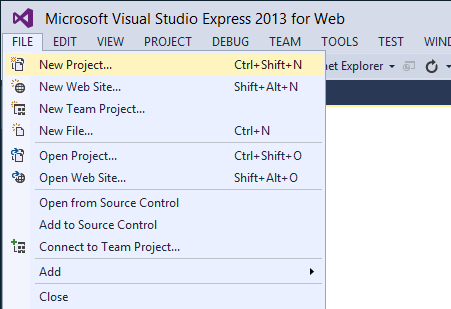

    The **New Project** dialog box appears.
3. Select the **Templates** -&gt; **Visual C#** -&gt; **Web** templates group on the left.
4. Choose the **ASP.NET Web Application** template in the center column.
5. Name your project ***BasicWebApp*** and click the **OK** button.   
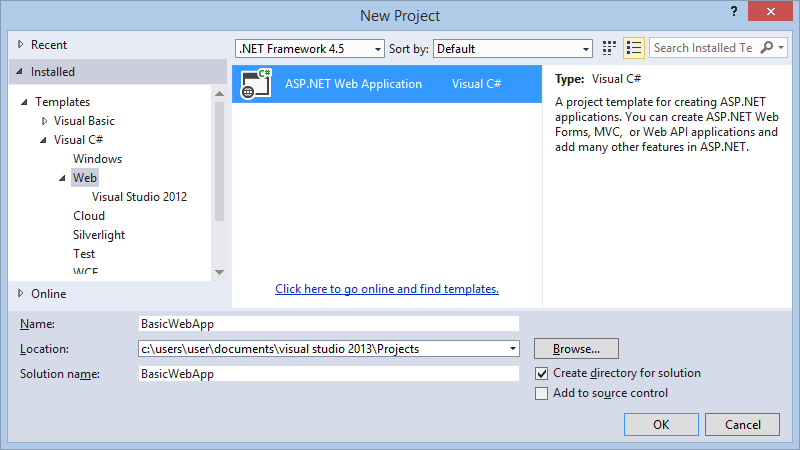
6. Next, select the **Web Forms** template and click the **OK** button to create the project.  
  

    Visual Studio creates a new project that includes prebuilt functionality based on the Web Forms template. It not only provides you with a *Home.aspx* page, an *About.aspx* page, a *Contact.aspx* page, but also includes membership functionality that registers users and saves their credentials so that they can log in to your website. When a new page is created, by default Visual Studio displays the page in **Source** view, where you can see the page's HTML elements. The following illustration shows what you would see in **Source** view if you created a new Web page named *BasicWebApp.aspx*.  
    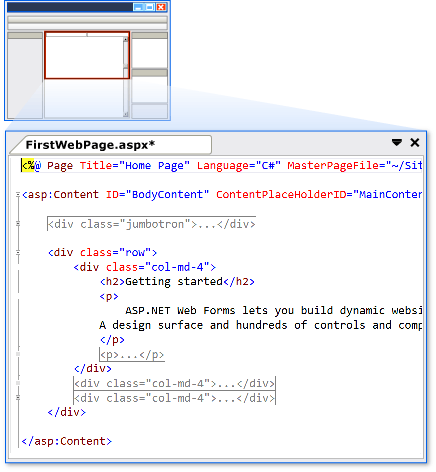

### A Tour of the Visual Studio Web Development Environment

Before you proceed by modifying the page, it is useful to familiarize yourself with the Visual Studio development environment. The following illustration shows you the windows and tools that are available in Visual Studio and Visual Studio Express for Web.

> [!NOTE] 
> 
> This diagram shows default windows and window locations. The **View** menu allows you to display additional windows, and to rearrange and resize windows to suit your preferences. If changes have already been made to the window arrangement, what you see will not match the illustration.

 The Visual Studio environment

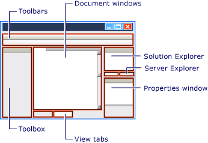

### Familiarize yourself with the Web designer

Examine the above illustration and match the text to the following list, which describes the most commonly used windows and tools. (Not all windows and tools that you see are listed here, only those marked in the preceding illustration.)

- Toolbars. Provide commands for formatting text, finding text, and so on. Some toolbars are available only when you are working in **Design** view.
- **Solution Explorer** window. Displays the files and folders in your Web application.
- Document window. Displays the documents you are working on in tabbed windows. You can switch between documents by clicking tabs.
- **Properties** window. Allows you to change settings for the page, HTML elements, controls, and other objects.
- View tabs. Present you with different views of the same document. **Design** view is a near-WYSIWYG editing surface. **Source** view is the HTML editor for the page. **Split** view displays both the **Design** view and the **Source** view for the document. You will work with the **Design** and **Source** views later in this walkthrough. If you prefer to open Web pages in **Design** view, on the **Tools** menu, click **Options**, select the **HTML Designer** node, and change the **Start Pages In** option.
- **ToolBox**. Provides controls and HTML elements that you can drag onto your page. **Toolbox** elements are grouped by common function.
- S **erver Explorer**. Displays database connections. If Server Explorer is not visible, on the View menu, click Server Explorer.

### Creating a new ASP.NET Web Forms Page

When you create a new Web Forms application using the **ASP.NET Web Application** project template, Visual Studio adds an ASP.NET page (Web Forms page) named *Default.aspx*, as well as several other files and folders. You can use the *Default.aspx* page as the home page for your Web application. However, for this walkthrough, you will create and work with a new page.

### To add a page to the Web application

1. Close the *Default.aspx* page. To do this, click the tab that displays the file name and then click the close option.
2. In **Solution Explorer**, right-click the Web application name (in this tutorial the application name is **BasicWebSite**), and then click **Add** -&gt; **New Item**.   
The **Add New Item** dialog box is displayed.
3. Select the **Visual C#** -&gt; **Web** templates group on the left. Then, select **Web Form** from the middle list and name it *FirstWebPage.aspx*.   
    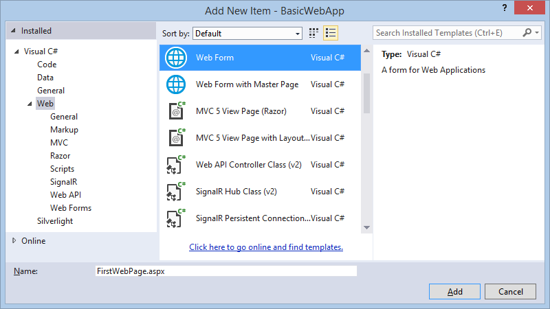
4. Click **Add** to add the web page to your project.  
Visual Studio creates the new page and opens it.

### Adding HTML to the Page

In this part of the walkthrough, you will add some static text to the page.

### To add text to the page

1. At the bottom of the document window, click the **Design** tab to switch to **Design** view.

    Design view displays the current page in a WYSIWYG-like way. At this point, you do not have any text or controls on the page, so the page is blank except for a dashed line that outlines a rectangle. This rectangle represents a **div** element on the page.
2. Click inside the rectangle that is outlined by a dashed line.
3. Type **Welcome to Visual Web Developer** and press **ENTER** twice.

    The following illustration shows the text you typed in **Design** view.

    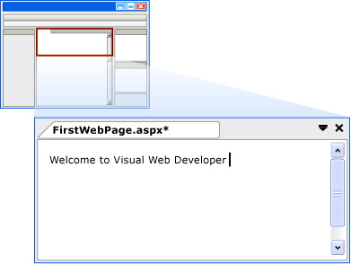
4. Switch to **Source** view.

    You can see the HTML in **Source** view that you created when you typed in **Design** view.  
    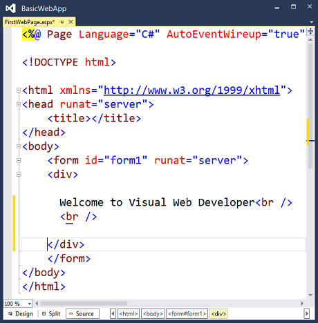

### Running the Page

Before you proceed by adding controls to the page, you can first run it.

### To run the page

1. In **Solution Explorer**, right-click *FirstWebPage.aspx* and select **Set as Start Page**.
2. Press **CTRL+F5** to run the page.

    The page is displayed in the browser. Although the page you created has a file-name extension of *.aspx*, it currently runs like any HTML page.

    To display a page in the browser you can also right-click the page in **Solution Explorer** and select **View in Browser**.
3. Close the browser to stop the Web application.

## Adding and Programming Controls

You will now add server controls to the page. Server controls, such as buttons, labels, text boxes, and other familiar controls, provide typical form-processing capabilities for your Web Forms pages. However, you can program the controls with code that runs on the server, rather than the client.

You will add a [Button](https://msdn.microsoft.com/library/system.web.ui.webcontrols.button.aspx) control, a [TextBox](https://msdn.microsoft.com/library/system.web.ui.webcontrols.textbox.aspx) control, and a [Label](https://msdn.microsoft.com/library/system.web.ui.webcontrols.label.aspx) control to the page and write code to handle the [Click](https://msdn.microsoft.com/library/system.web.ui.webcontrols.button.click.aspx) event for the [Button](https://msdn.microsoft.com/library/system.web.ui.webcontrols.button.aspx) control.

### To add controls to the page

1. Click the **Design** tab to switch to **Design** view.
2. Put the insertion point at the end of the **Welcome to Visual Web Developer** text and press **ENTER** five or more times to make some room in the **div** element box.
3. In the **Toolbox**, expand the **Standard** group if it is not already expanded.  
Note that you may need to expand the **Toolbox** window on the left to view it.
4. Drag a [TextBox](https://msdn.microsoft.com/library/system.web.ui.webcontrols.textbox.aspx) control onto the page and drop it in the middle of the **div** element box that has **Welcome to Visual Web Developer** in the first line.
5. Drag a [Button](https://msdn.microsoft.com/library/system.web.ui.webcontrols.button.aspx) control onto the page and drop it to the right of the [TextBox](https://msdn.microsoft.com/library/system.web.ui.webcontrols.textbox.aspx) control.
6. Drag a [Label](https://msdn.microsoft.com/library/system.web.ui.webcontrols.label.aspx) control onto the page and drop it on a separate line below the [Button](https://msdn.microsoft.com/library/system.web.ui.webcontrols.button.aspx) control.
7. Put the insertion point above the [TextBox](https://msdn.microsoft.com/library/system.web.ui.webcontrols.textbox.aspx) control, and then type **Enter your name:** .

    This static HTML text is the caption for the [TextBox](https://msdn.microsoft.com/library/system.web.ui.webcontrols.textbox.aspx) control. You can mix static HTML and server controls on the same page. The following illustration shows how the three controls appear in **Design** view.

    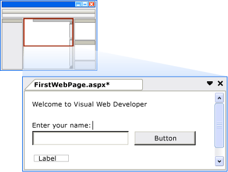

### Setting Control Properties

Visual Studio offers you various ways to set the properties of controls on the page. In this part of the walkthrough, you will set properties in both **Design** view and **Source** view.

### To set control properties

1. First, display the **Properties** windows by selecting from the **View** menu -&gt; **Other Windows** -&gt; **Properies Window**. You could alternatively select **F4** to display the **Properties** window.
2. Select the [Button](https://msdn.microsoft.com/library/system.web.ui.webcontrols.button.aspx) control, and then in the **Properties** window, set the value of **Text** to **Display Name**. The text you entered appears on the button in the designer, as shown in the following illustration.

    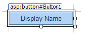
3. Switch to **Source** view.

    **Source** view displays the HTML for the page, including the elements that Visual Studio has created for the server controls. Controls are declared using HTML-like syntax, except that the tags use the prefix **asp:** and include the attribute **runat=&quot;server&quot;**.

    Control properties are declared as attributes. For example, when you set the [Text](https://msdn.microsoft.com/library/system.web.ui.webcontrols.button.text.aspx) property for the [Button](https://msdn.microsoft.com/library/system.web.ui.webcontrols.button.aspx) control, in step 1, you were actually setting the **Text** attribute in the control's markup.

    > [!NOTE] 
    > 
    > All the controls are inside a **form** element, which also has the attribute **runat=&quot;server&quot;**. The **runat=&quot;server&quot;** attribute and the **asp:** prefix for control tags mark the controls so that they are processed by ASP.NET on the server when the page runs. Code outside of **&lt;form runat=&quot;server&quot;&gt;** and **&lt;script runat=&quot;server&quot;&gt;** elements is sent unchanged to the browser, which is why the ASP.NET code must be inside an element whose opening tag contains the **runat=&quot;server&quot;** attribute.
4. Next, you will add an additional property to the [Label](https://msdn.microsoft.com/library/system.web.ui.webcontrols.label.aspx)  control. Put the insertion point directly after **asp:Label** in the **&lt;asp:Label&gt;** tag, and then press **SPACEBAR**.

    A drop-down list appears that displays the list of available properties you can set for a [Label](https://msdn.microsoft.com/library/system.web.ui.webcontrols.label.aspx) control. This feature, referred to as **IntelliSense**, helps you in **Source** view with the syntax of server controls, HTML elements, and other items on the page. The following illustration shows the **IntelliSense** drop-down list for the [Label](https://msdn.microsoft.com/library/system.web.ui.webcontrols.label.aspx) control.

    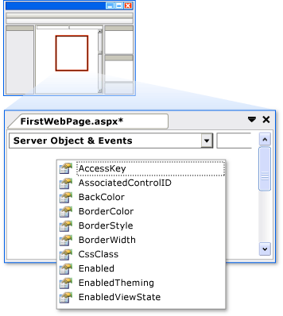
5. Select **ForeColor** and then type an equal sign.

    IntelliSense displays a list of colors.

    > [!NOTE] 
    > 
    > You can display an **IntelliSense** drop-down list at any time by pressing **CTRL+J** when viewing code.
6. Select a color for the **[Label](https://msdn.microsoft.com/library/system.web.ui.webcontrols.label.aspx)** control's text. Make sure you select a color that is dark enough to read against a white background.

    The **ForeColor** attribute is completed with the color that you have selected, including the closing quotation mark.

### Programming the Button Control

For this walkthrough, you will write code that reads the name that the user enters into the text box and then displays the name in the [Label](https://msdn.microsoft.com/library/system.web.ui.webcontrols.label.aspx) control.

### Add a default button event handler

1. Switch to **Design** view.
2. Double-click the [Button](https://msdn.microsoft.com/library/system.web.ui.webcontrols.button.aspx) control.

    By default, Visual Studio switches to a code-behind file and creates a skeleton event handler for the [Button](https://msdn.microsoft.com/library/system.web.ui.webcontrols.button.aspx) control's default event, the [Click](https://msdn.microsoft.com/library/system.web.ui.webcontrols.button.click.aspx) event. The code-behind file separates your UI markup (such as HTML) from your server code (such as C#).   
The cursor is positioned to added code for this event handler.

    > [!NOTE] 
    > 
    > Double-clicking a control in **Design** view is just one of several ways you can create event handlers.
3. Inside the **Button1\_Click** event handler, type **Label1** followed by a period (**.**).

    When you type the period after the **ID** of the label (**Label1**), Visual Studio displays a list of available members for the [Label](https://msdn.microsoft.com/library/system.web.ui.webcontrols.label.aspx) control, as shown in the following illustration. A member commonly a property, method, or event.

    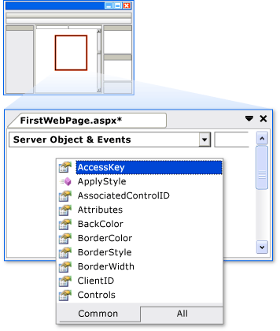
4. Finish the **Click** event handler for the button so that it reads as shown in the following code example.

    [!code-csharp[Main](creating-a-basic-web-forms-page/samples/sample1.cs?highlight=3)]

    [!code-vb[Main](creating-a-basic-web-forms-page/samples/sample2.vb?highlight=2)]
5. Switch back to viewing the **Source** view of your HTML markup by right-clicking *FirstWebPage.aspx* in the **Solution Explorer** and selecting **View Markup**.
6. Scroll to the **&lt;asp:Button&gt;** element. Note that the **&lt;asp:Button&gt;** element now has the attribute **onclick=&quot;Button1\_Click&quot;**.

    This attribute binds the button's [Click](https://msdn.microsoft.com/library/system.web.ui.webcontrols.button.click.aspx) event to the handler method you coded in the previous step.

    Event handler methods can have any name; the name you see is the default name created by Visual Studio. The important point is that the name used for the **OnClick** attribute in the HTML must match the name of a method defined in the code-behind.

### Running the Page

You can now test the server controls on the page.

### To run the page

1. Press **CTRL+F5** to run the page in the browser. If an error occurs, recheck the steps above.
2. Enter a name into the text box and click the **Display Name** button.

    The name you entered is displayed in the [Label](https://msdn.microsoft.com/library/system.web.ui.webcontrols.label.aspx) control. Note that when you click the button, the page is posted to the Web server. ASP.NET then recreates the page, runs your code (in this case, the [Button](https://msdn.microsoft.com/library/system.web.ui.webcontrols.button.aspx) control's [Click](https://msdn.microsoft.com/library/system.web.ui.webcontrols.button.click.aspx) event handler runs), and then sends the new page to the browser. If you watch the status bar in the browser, you can see that the page is making a round trip to the Web server each time you click the button.
3. In the browser, view the source of the page you are running by right-clicking on the page and selecting **View source**.

    In the page source code, you see HTML without any server code. Specifically, you do not see the **&lt;asp:&gt;** elements that you were working with in **Source** view. When the page runs, ASP.NET processes the server controls and renders HTML elements to the page that perform the functions that represent the control. For example, the **&lt;asp:Button&gt;** control is rendered as the HTML **&lt;input type=&quot;submit&quot;&gt;** element.
4. Close the browser.

## Working with Additional Controls

In this part of the walkthrough, you will work with the [Calendar](https://msdn.microsoft.com/library/system.web.ui.webcontrols.calendar.aspx) control, which displays dates a month at a time. The [Calendar](https://msdn.microsoft.com/library/system.web.ui.webcontrols.calendar.aspx) control is a more complex control than the button, text box, and label you have been working with and illustrates some further capabilities of server controls.

In this section, you will add a [System.Web.UI.WebControls.Calendar](https://msdn.microsoft.com/library/system.web.ui.webcontrols.calendar.aspx) control to the page and format it.

### To add a Calendar control

1. In Visual Studio, switch to **Design** view.
2. From the **Standard** section of the **Toolbox**, drag a [Calendar](https://msdn.microsoft.com/library/system.web.ui.webcontrols.calendar.aspx) control onto the page and drop it below the **div** element that contains the other controls.

    The calendar's smart tag panel is displayed. The panel displays commands that make it easy for you to perform the most common tasks for the selected control. The following illustration shows the [Calendar](https://msdn.microsoft.com/library/system.web.ui.webcontrols.calendar.aspx) control as rendered in **Design** view.

    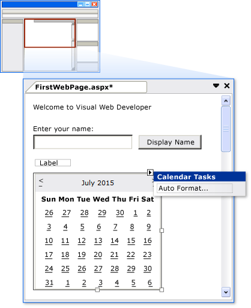
3. In the smart tag panel, choose **Auto Format**.

    The **Auto Format** dialog box is displayed, which allows you to select a formatting scheme for the calendar. The following illustration shows the **Auto Format** dialog box for the [Calendar](https://msdn.microsoft.com/library/system.web.ui.webcontrols.calendar.aspx) control.

    ")
4. From the **Select a scheme** list, select **Simple** and then click **OK**.
5. Switch to **Source** view.

    You can see the **&lt;asp:Calendar&gt;** element. This element is much longer than the elements for the simple controls you created earlier. It also includes subelements, such as **&lt;WeekEndDayStyle&gt;**, which represent various formatting settings. The following illustration shows the [Calendar](https://msdn.microsoft.com/library/system.web.ui.webcontrols.calendar.aspx) control in **Source** view. (The exact markup that you see in **Source** view might differ slightly from the illustration.)

    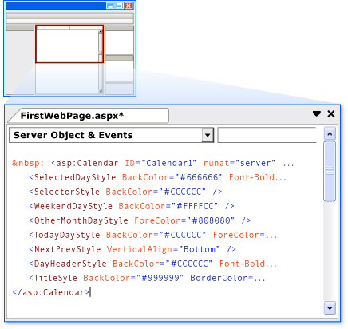

### Programming the Calendar Control

In this section, you will program the [Calendar](https://msdn.microsoft.com/library/system.web.ui.webcontrols.calendar.aspx) control to display the currently selected date.

### To program the Calendar control

1. In **Design** view, double-click the [Calendar](https://msdn.microsoft.com/library/system.web.ui.webcontrols.calendar.aspx) control.

    A new event handler is created and displayed in the code-behind file named *FirstWebPage.aspx.cs*.
2. Finish the [SelectionChanged](https://msdn.microsoft.com/library/system.web.ui.webcontrols.calendar.selectionchanged.aspx) event handler with the following code.

    [!code-csharp[Main](creating-a-basic-web-forms-page/samples/sample3.cs?highlight=3)]

    [!code-vb[Main](creating-a-basic-web-forms-page/samples/sample4.vb?highlight=2)]

 The above code sets the text of the label control to the selected date of the calendar control.

### Running the Page

You can now test the calendar.

### To run the page

1. Press **CTRL+F5** to run the page in the browser.
2. Click a date in the calendar.

    The date you clicked is displayed in the [Label](https://msdn.microsoft.com/library/system.web.ui.webcontrols.label.aspx) control.
3. In the browser, view the source code for the page.

    Note that the [Calendar](https://msdn.microsoft.com/library/system.web.ui.webcontrols.calendar.aspx) control has been rendered to the page as a **table**, with each day as a **td** element.
4. Close the browser.

## Next Steps

This walkthrough has illustrated the basic features of the Visual Studio page designer. Now that you understand how to create and edit a Web Forms page in Visual Studio, you might want to explore other features. For example, you might want to do the following:

- Learn more about ASP.NET Web Forms by following the step-by-step tutorial series [Getting Started with ASP.NET 4.5 Web Forms and Visual Studio 2013](getting-started-with-aspnet-45-web-forms/introduction-and-overview.md).
- Learn more about Cascading style sheets (CSS). For details, see [Working with CSS Overview](https://msdn.microsoft.com/library/bb398931.aspx).
