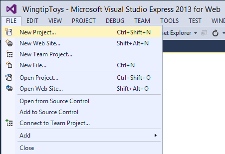
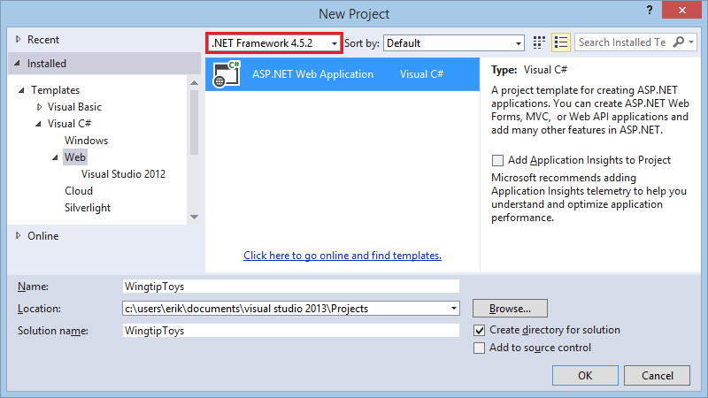
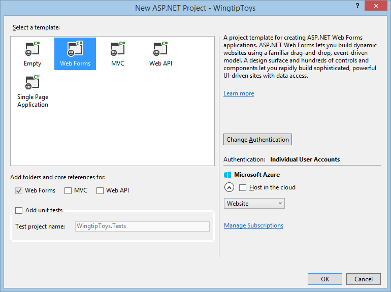
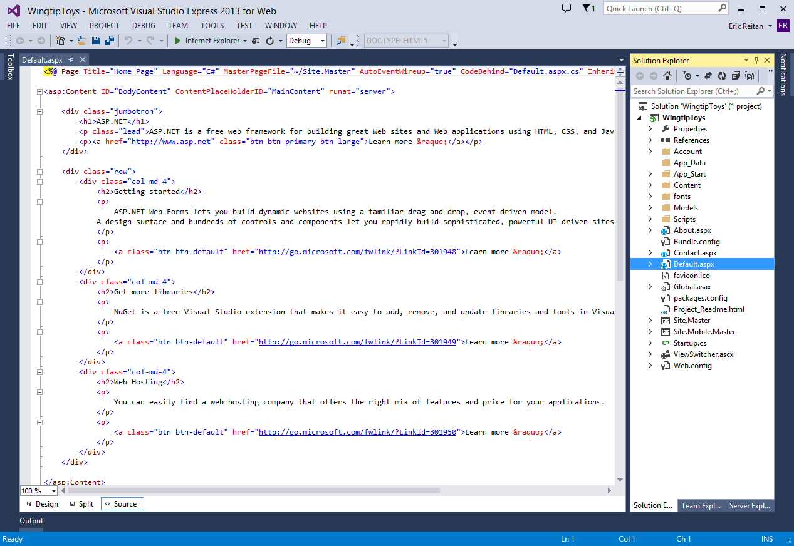
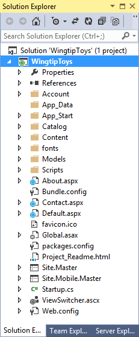
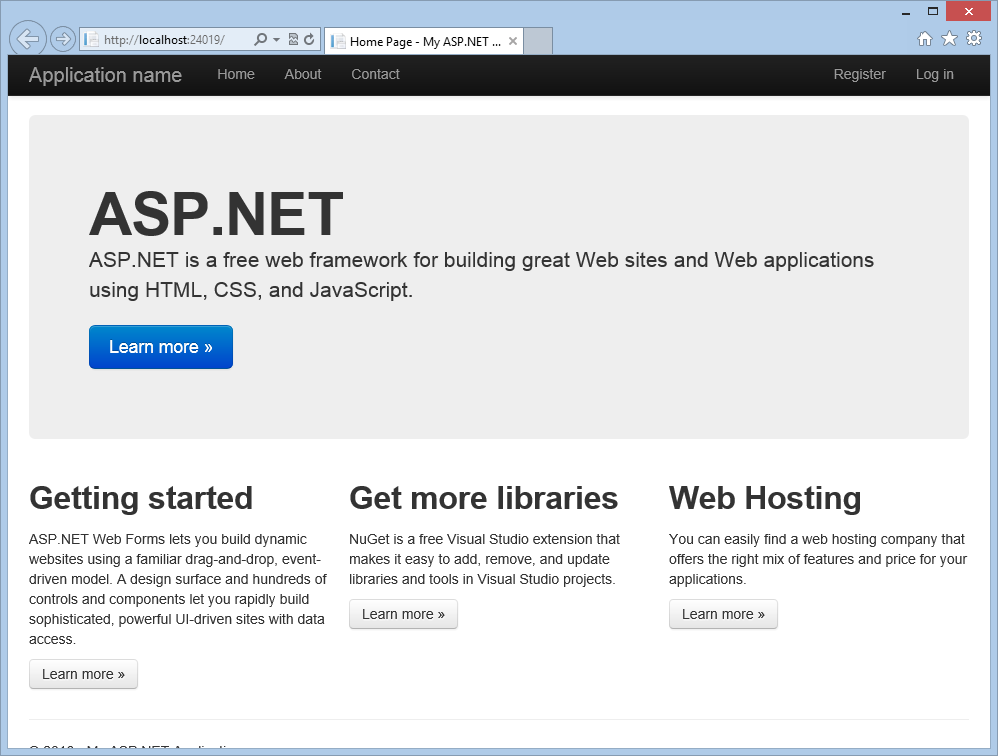
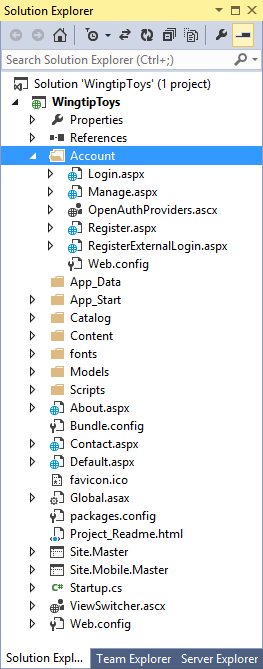
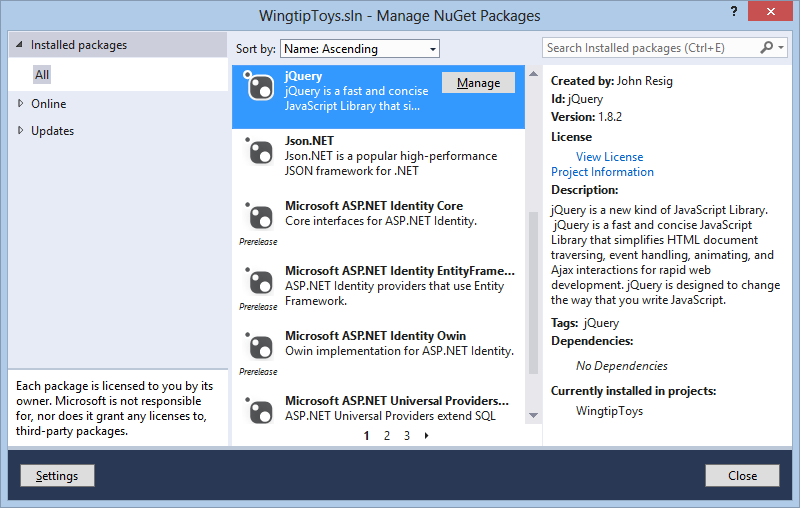
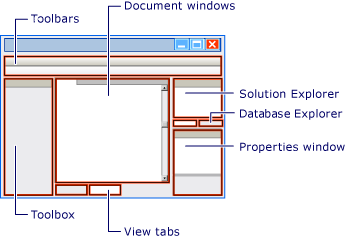

Create the Project
====================
by [Erik Reitan](https://github.com/Erikre)

[Download Wingtip Toys Sample Project (C#)](http://go.microsoft.com/fwlink/?LinkID=389434&clcid=0x409) or [Download E-book (PDF)](http://download.microsoft.com/download/0/F/B/0FBFAA46-2BFD-478F-8E56-7BF3C672DF9D/Getting%20Started%20with%20ASP.NET%204.5%20Web%20Forms%20and%20Visual%20Studio%202013.pdf)

> This tutorial series will teach you the basics of building an ASP.NET Web Forms application using ASP.NET 4.5 and Microsoft Visual Studio Express 2013 for Web. A Visual Studio 2013 [project with C# source code](https://go.microsoft.com/fwlink/?LinkID=389434&clcid=0x409) is available to accompany this tutorial series.

In this tutorial you will create, review, and run the default project in Visual Studio, which will allow you to become familiar with features of ASP.NET. Also, you will review the Visual Studio environment.

## What you'll learn:

- How to create a new Web Forms project.
- The file structure of the Web Forms project.
- How to run the project in Visual Studio.
- The different features of the default Web forms application.
- Some basics about how to use the Visual Studio environment.

## Creating the Project

1. Open Visual Studio.
2. Select **New Project** from the **File** menu in Visual Studio. 

    
3. Select the **Templates** -&gt; **Visual C#** -&gt; **Web** templates group on the left.
4. Choose the **ASP.NET Web Application** template in the center column.  
 This tutorial series is using .NET Framework 4.5.2.
5. Name your project *WingtipToys* and choose the **OK** button. 

    

    > [!NOTE]
    > The name of the project in this tutorial series is **WingtipToys**. It is recommended that you use this *exact* project name so that the code provided throughout the tutorial series functions as expected.
6. Next, select the **Web Forms** template and choose the **Create Project** button.  

    

The project will take a little time to create. When it's ready, open the **Default.aspx** page.

You can switch between **Design** view and **Source** view by selecting an option at the bottom of the center window. **Design** view displays ASP.NET Web pages, master pages, content pages, HTML pages, and user controls using a near-WYSIWYG view. **Source** view displays the HTML markup for your Web page, which you can edit.

> [!TIP] 
> 
> **Understanding the ASP.NET Frameworks**
> 
> ASP.NET Web Forms lets you build dynamic websites using a familiar drag-and-drop, event-driven model. A design surface and hundreds of controls and components let you rapidly build sophisticated, powerful UI-driven sites with data access. The Wingtip Toy Store is based on ASP.NET Web Forms, but many of the concepts you learn in this tutorial series are applicable to all of ASP.NET.
> 
> ASP.NET offers four primary development frameworks:
> 
> - [ASP.NET Web Forms](../../../index.md)  
>  The Web Forms framework targets developers who prefer declarative and control-based programming, such as Microsoft Windows Forms (WinForms) and WPF/XAML/Silverlight. It offers a WYSIWYG designer-driven development model, so it's popular with developers looking for a rapid application development (RAD) environment for web development. If you are new to web programming and are familiar with the traditional Microsoft RAD client development tools (for example, for Visual Basic and Visual C#), you can quickly build a web application without having experience in HTML and JavaScript.
> - [ASP.NET MVC](../../../../mvc/index.md)  
>  ASP.NET MVC targets developers who are interested in patterns and principles like test-driven development, separation of concerns, inversion of control (IoC), and dependency injection (DI). This framework encourages separating the business logic layer of a web application from its presentation layer.
> - [ASP.NET Web Pages](../../../../web-pages/index.md)  
>  ASP.NET Web Pages targets developers who want a simple web development story, along the lines of PHP. In the Web Pages model, you create HTML pages and then add server-based code to the page in order to dynamically control how that markup is rendered. Web Pages is specifically designed to be a lightweight framework, and it's the easiest entry point into ASP.NET for people who know HTML but might not have broad programming experience - for example, students or hobbyists. It's also a good way for web developers who know PHP or similar frameworks to start using ASP.NET.
> - [ASP.NET Single Page Application](../../../../single-page-application/index.md)  
>  ASP.NET Single Page Application (SPA) helps you build applications that include significant client-side interactions using HTML 5, CSS 3 and JavaScript. The ASP.NET and Web Tools 2012.2 Update ships a new template for building single page applications using knockout.js and ASP.NET Web API. In addition to the new SPA template, new community-created SPA templates are also available for download.
> 
> In addition to the four main development frameworks, ASP.NET also offers additional technologies that are important to be aware of and familiar with, but are not covered in this tutorial series:
> 
> - [ASP.NET Web API](../../../../web-api/index.md) - A framework for building HTTP services that reach a broad range of clients, including browsers and mobile devices.
> - [ASP.NET SignalR](../../../../signalr/index.md) - A library that makes developing real-time web functionality easy.

### Reviewing the Project

In Visual Studio, the **Solution Explorer** window lets you manage files for the project. Let's take a look at the folders that have been added to your application in **Solution Explorer**. The web application template adds a basic folder structure:

Visual Studio creates some initial folders and files for your project. The first files that you will be working with later in this tutorial are the following:

| **File** | **Purpose** |
| --- | --- |
| *Default.aspx* | Typically the first page displayed when the application is run in a browser. |
| *Site.Master* | A page that allows you to create a consistent layout and use standard behavior for pages in your application. |
| *Global.asax* | An optional file that contains code for responding to application-level and session-level events raised by ASP.NET or by HTTP modules. |
| *Web.config* | The configuration data for an application. |

### Running the Default Web Application

The default Web application provides a rich experience based on built-in functionality and support. Without any changes to the default Web forms project, the application is ready to run on your local Web browser.

1. Press the ***F5*** key while in Visual Studio.   
 The application will build and display in your Web browser.  

    
2. Once you have completed review the running application, close the browser window.

There are three main pages in this default Web application: *Default.aspx* (Home), *About.aspx*, and *Contact.aspx*. Each of these pages can be reached from the top navigation bar. There are also two additional pages contained in the Account folder, the Register.aspx page and Login.aspx page. These two pages allow you to use the membership capabilities of ASP.NET to create, store, and validate user credentials.

## ASP.NET Web Forms Background

ASP.NET Web Forms are pages that are based on Microsoft ASP.NET technology, in which code that runs on the server dynamically generates Web page output to the browser or client device. An ASP.NET Web Forms page automatically renders the correct browser-compliant HTML for features such as styles, layout, and so on. Web Forms are compatible with any language supported by the .NET common language runtime, such as Microsoft Visual Basic and Microsoft Visual C#. Also, Web Forms are built on the [Microsoft .NET Framework](https://msdn.microsoft.com/en-US/vstudio/aa496123), which provides benefits such as a managed environment, type safety, and inheritance.

When an ASP.NET Web Forms page runs, the page goes through a life cycle in which it performs a series of processing steps. These steps include initialization, instantiating controls, restoring and maintaining state, running event handler code, and rendering. As you become more familiar with the power of ASP.NET Web Forms, it is important for you to understand the [ASP.NET page life cycle](https://msdn.microsoft.com/library/ms178472(v=vs.100).aspx) so that you can write code at the appropriate life-cycle stage for the effect you intend.

When a Web server receives a request for a page, it finds the page, processes it, sends it to the browser, and then discards all page information. If the user requests the same page again, the server repeats the entire sequence, reprocessing the page from scratch. Put another way, a server has no memory of pages that it has processed-pages are stateless. The ASP.NET page framework automatically handles the task of maintaining the state of your page and its controls, and it provides you with explicit ways to maintain the state of application-specific information.

> [!TIP] 
> 
> **Web Application Features in the Web Forms Application Template**
> 
> The ASP.NET Web Forms Application template provides a rich set of built-in functionality. It not only provides you with a *Home.aspx* page, an *About.aspx* page, a *Contact.aspx* page, but also includes membership functionality that registers users and saves their credentials so that they can log in to your website. This overview provides more information about some of the features contained in the ASP.NET Web Forms Application template and how they are used in the Wingtip Toys application.
> 
> **Membership**
> 
> [ASP.NET](https://msdn.microsoft.com/en-us/library/yh26yfzy.aspx) Identity stores your users' credentials in a database created by the application. When your users log in, the application validates their credentials by reading the database. Your project's *Account* folder contains the files that implement the various parts of membership: registering, logging in, changing a password, and authorizing access. Additionally, ASP.NET Web Forms supports OAuth and OpenID. These authentication enhancements allow users to log into your site using existing credentials, from such accounts as Facebook, Twitter, Windows Live, and Google.
> 
> 
> 
> By default, the template creates a membership database using a default database name on an instance of SQL Server Express LocalDB, the development database server that comes with Visual Studio Express 2013 for Web.
> 
> **SQL Server Express LocalDB**
> 
> [SQL Server Express LocalDB](https://technet.microsoft.com/library/hh510202.aspx) is a lightweight version of SQL Server that has many programmability features of a SQL Server database. SQL Server Express LocalDB runs in user mode and has a fast, zero-configuration installation that has a short list of installation prerequisites. In Microsoft SQL Server, any database or Transact-SQL code can be moved from SQL Server Express LocalDB to SQL Server and SQL Azure without any upgrade steps. So, SQL Server Express LocalDB can be used as a developer environment for applications targeting all editions of SQL Server. SQL Server Express LocalDB enables features such as stored procedures, user-defined functions and aggregates, .NET Framework integration, spatial types and others that are not available in SQL Server Compact.
> 
> **Master Pages**
> 
> An [ASP.NET master page](https://msdn.microsoft.com/en-us/library/wtxbf3hh.aspx) defines a consistent appearance and behavior for all of the pages in your application. The layout of the master page merges with the content from an individual content page to produce the final page that the user sees. In the Wingtip Toys application, you modify the *Site.master* master page so that all the pages in the Wingtip Toys website share the same distinctive logo and navigation bar.
> 
> **HTML5**
> 
> The ASP.NET Web Forms Application template supports [HTML5](http://www.w3schools.com/html/html5_intro.asp), which is the latest version of the HTML markup language. HTML5 supports new elements and functionality that make it easier to create Web sites.
> 
> **Modernizr**
> 
> For browsers that do not support HTML5, you can use [Modernizr](http://www.modernizr.com/). Modernizr is an open-source JavaScript library that can detect whether a browser supports HTML5 features, and enable them if it does not. In the ASP.NET Web Forms Application template, Modernizr is installed as a NuGet package.
> 
> **Bootstrap**
> 
> The Visual Studio 2013 project templates use [Bootstrap](http://getbootstrap.com/), a layout and theming framework created by Twitter. Bootstrap uses CSS3 to provide responsive design, which means layouts can dynamically adapt to different browser window sizes. You can also use Bootstrap's theming feature to easily effect a change in the application's look and feel. By default, the ASP.NET Web Application template in Visual Studio 2013 includes Bootstrap as a NuGet package.
> 
> **NuGet Packages**
> 
> The ASP.NET Web Forms Application template includes a set of [NuGet](http://www.nuget.org/) packages. These packages provide componentized functionality in the form of open source libraries and tools. There is a wide variety of packages to help you create and test your applications. Visual Studio makes it easy to add, remove, and update NuGet packages. Developers can create and add packages to NuGet as well.
> 
> 
> 
> When you install a package, NuGet copies files to your solution and automatically makes whatever changes are needed, such as adding references and changing the configuration associated with your Web application. If you decide to remove the library, NuGet removes files and reverses whatever changes it made in your project so that no clutter is left. NuGet is available from the **Tools** menu in Visual Studio.
> 
> **jQuery**
> 
> [jQuery](http://jquery.com/) is a fast and concise JavaScript Library that simplifies HTML document traversing, event handling, animating, and Ajax interactions for rapid web development. The jQuery JavaScript library is included in the ASP.NET Web Forms Application template as a NuGet package.
> 
> **Unobtrusive Validation**
> 
> Built-in validator controls have been configured to use unobtrusive JavaScript for client-side validation logic. This significantly reduces the amount of JavaScript rendered inline in the page markup and reduces the overall page size. Unobtrusive validation is added globally to the ASP.NET Web Forms Application template based on the setting in the &lt;appSettings&gt; element of the *Web.config* file at the root of the application.
> 
> **Entity Framework Code First**
> 
> Besides the features in the ASP.NET Web Forms Application template, the Wingtip Toys application uses [Entity Framework Code First](https://weblogs.asp.net/scottgu/archive/2010/12/08/announcing-entity-framework-code-first-ctp5-release.aspx), which is a NuGet library that enables code-centric development when you work with data. Put simply, it creates the database portion of your application for you based on the code that you write. Using the Entity Framework, you retrieve and manipulate data as strongly typed objects. This lets you focus on the business logic in your application rather than the details of how data is accessed.
> 
> For additional information about the installed libraries and packages included with the ASP.NET Web Forms template, see the list of installed NuGet packages. To do this, In Visual Studio create a new Web Forms project, select **Tools** -&gt; **Library Package Manager** -&gt; **Manage NuGet Packages for Solution**, and select **Installed packages** in the **Manage NuGet Packages** dialog box.

### Touring Visual Studio

The primary windows in Visual Studio include the **Solution Explorer**, the **Server Explorer** (**Database Explorer** in Express), the **Properties Window**, the **Toolbox**, the **Toolbar**, and the **Document Window**.

For more information about Visual Studio, see [Visual Guide to Visual Web Developer](https://msdn.microsoft.com/library/ee410104.aspx).

## Summary

In this tutorial you have created, reviewed and run the default Web Forms application. You have reviewed the different features of the default Web forms application and learned some basics about how to use the Visual Studio environment. In the following tutorials you'll create the data access layer.

## Additional Resources

[Choosing the Right Programming Model](../../../videos/how-do-i/choosing-the-right-programming-model.md)   
[Web Application Projects versus Web Site Projects](https://msdn.microsoft.com/en-us/library/dd547590.aspx)   
[ASP.NET Web Forms Pages Overview](https://msdn.microsoft.com/en-us/library/428509ah.aspx)

>[!div class="step-by-step"]
[Previous](introduction-and-overview.md)
[Next](create_the_data_access_layer.md)