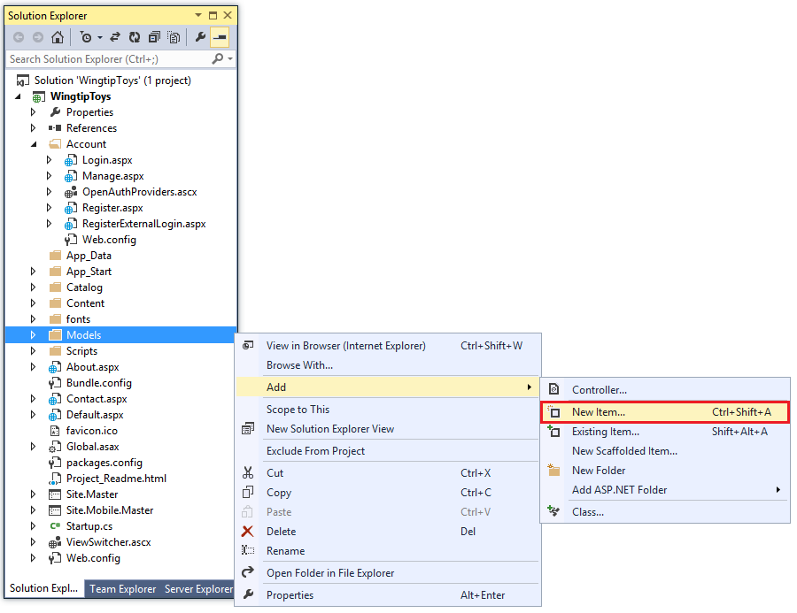
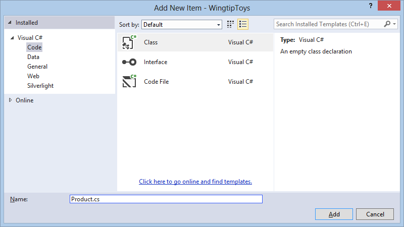
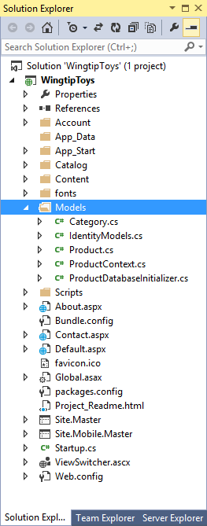

[Edit .md file](C:\Projects\msc\dev\Msc.Www\Web.ASP\App_Data\github\web-forms\overview\getting-started\getting-started-with-aspnet-45-web-forms\create_the_data_access_layer.md) | [Edit dev content](http://www.aspdev.net/umbraco#/content/content/edit/42860) | [View dev content](http://docs.aspdev.net/tutorials/web-forms/overview/getting-started/getting-started-with-aspnet-45-web-forms/create_the_data_access_layer.html) | [View prod content](http://www.asp.net/web-forms/overview/getting-started/getting-started-with-aspnet-45-web-forms/create_the_data_access_layer) | Picker: 37914

Create the Data Access Layer
====================
by [Erik Reitan](https://github.com/Erikre)

[Download Wingtip Toys Sample Project (C#)](http://go.microsoft.com/fwlink/?LinkID=389434&clcid=0x409) or [Download E-book (PDF)](http://download.microsoft.com/download/0/F/B/0FBFAA46-2BFD-478F-8E56-7BF3C672DF9D/Getting%20Started%20with%20ASP.NET%204.5%20Web%20Forms%20and%20Visual%20Studio%202013.pdf)

> This tutorial series will teach you the basics of building an ASP.NET Web Forms application using ASP.NET 4.5 and Microsoft Visual Studio Express 2013 for Web. A Visual Studio 2013 [project with C# source code](https://go.microsoft.com/fwlink/?LinkID=389434&clcid=0x409) is available to accompany this tutorial series.

This tutorial describes how to create, access, and review data from a database using ASP.NET Web Forms and Entity Framework Code First. This tutorial builds on the previous tutorial "Create the Project" and is part of the Wingtip Toy Store tutorial series. When you've completed this tutorial, you will have built a group of data-access classes that are in the *Models* folder of the project.

## What you'll learn:

- How to create the data models.
- How to initialize and seed the database.
- How to update and configure the application to support the database.

### These are the features introduced in the tutorial:

- Entity Framework Code First
- LocalDB
- Data Annotations

## Creating the Data Models

[Entity Framework](https://msdn.microsoft.com/en-us/data/aa937723) is an object-relational mapping (ORM) framework. It lets you work with relational data as objects, eliminating most of the data-access code that you'd usually need to write. Using Entity Framework, you can issue queries using [LINQ](https://msdn.microsoft.com/en-us/library/bb397926.aspx), then retrieve and manipulate data as strongly typed objects. LINQ provides patterns for querying and updating data. Using Entity Framework allows you to focus on creating the rest of your application, rather than focusing on the data access fundamentals. Later in this tutorial series, we'll show you how to use the data to populate navigation and product queries.

Entity Framework supports a development paradigm called *Code First*. Code First lets you define your data models using classes. A class is a construct that enables you to create your own custom types by grouping together variables of other types, methods and events. You can map classes to an existing database or use them to generate a database. In this tutorial, you'll create the data models by writing data model classes. Then, you'll let Entity Framework create the database on the fly from these new classes.

You will begin by creating the entity classes that define the data models for the Web Forms application. Then you will create a context class that manages the entity classes and provides data access to the database. You will also create an initializer class that you will use to populate the database.

### Entity Framework and References

By default, Entity Framework is included when you create a new **ASP.NET Web Application** using the **Web Forms** template. Entity Framework can be installed, uninstalled, and updated as a NuGet package.

This NuGet package includes the following **runtime** assemblies within your project:

- EntityFramework.dll – All the common runtime code used by Entity Framework
- EntityFramework.SqlServer.dll – The Microsoft SQL Server provider for Entity Framework

### Entity Classes

The classes you create to define the schema of the data are called entity classes. If you're new to database design, think of the entity classes as table definitions of a database. Each property in the class specifies a column in the table of the database. These classes provide a lightweight, object-relational interface between object-oriented code and the relational table structure of the database.

In this tutorial, you'll start out by adding simple entity classes representing the schemas for products and categories. The products class will contain definitions for each product. The name of each of the members of the product class will be `ProductID`, `ProductName`, `Description`, `ImagePath`, `UnitPrice`, `CategoryID`, and `Category`. The category class will contain definitions for each category that a product can belong to, such as Car, Boat, or Plane. The name of each of the members of the category class will be `CategoryID`, `CategoryName`, `Description`, and `Products`. Each product will belong to one of the categories. These entity classes will be added to the project's existing *Models* folder.

1. In **Solution Explorer**, right-click the *Models* folder and then select **Add** -&gt; **New Item**. 

    

 The     **Add New Item** dialog box is displayed.
2. Under **Visual C#** from the **Installed** pane on the left, select **Code**. 

    
3. Select **Class** from the middle pane and name this new class *Product.cs*.
4. Click **Add**.  
 The new class file is displayed in the editor.
5. Replace the default code with the following code:   

        using System.ComponentModel.DataAnnotations;
        
        namespace WingtipToys.Models
        {
          public class Product
          {
            [ScaffoldColumn(false)]
            public int ProductID { get; set; }
        
            [Required, StringLength(100), Display(Name = "Name")]
            public string ProductName { get; set; }
        
            [Required, StringLength(10000), Display(Name = "Product Description"), DataType(DataType.MultilineText)]
            public string Description { get; set; }
        
            public string ImagePath { get; set; }
        
            [Display(Name = "Price")]
            public double? UnitPrice { get; set; }
        
            public int? CategoryID { get; set; }
        
            public virtual Category Category { get; set; }
          }
        }
6. Create another class by repeating steps 1 through 4, however, name the new class *Category.cs* and replace the default code with the following code:  

        using System.Collections.Generic;
        using System.ComponentModel.DataAnnotations;
        
        namespace WingtipToys.Models
        {
          public class Category
          {
            [ScaffoldColumn(false)]
            public int CategoryID { get; set; }
        
            [Required, StringLength(100), Display(Name = "Name")]
            public string CategoryName { get; set; }
        
            [Display(Name = "Product Description")]
            public string Description { get; set; }
        
            public virtual ICollection<Product> Products { get; set; }
          }
        }

As previously mentioned, the `Category` class represents the type of product that the application is designed to sell (such as &quot;Cars&quot;, &quot;Boats&quot;, &quot;Rockets&quot;, and so on), and the `Product` class represents the individual products (toys) in the database. Each instance of a `Product` object will correspond to a row within a relational database table, and each property of the Product class will map to a column in the relational database table. Later in this tutorial, you'll review the product data contained in the database.

### Data Annotations

You may have noticed that certain members of the classes have attributes specifying details about the member, such as `[ScaffoldColumn(false)]`. These are *data annotations*. The data annotation attributes can describe how to validate user input for that member, to specify formatting for it, and to specify how it is modeled when the database is created.

### Context Class

To start using the classes for data access, you must define a context class. As mentioned previously, the context class manages the entity classes (such as the `Product` class and the `Category` class) and provides data access to the database.

This procedure adds a new C# context class to the *Models* folder.

1. Right-click the *Models* folder and then select **Add** -&gt; **New Item**.   
 The     **Add New Item** dialog box is displayed.
2. Select **Class** from the middle pane, name it *ProductContext.cs*and click **Add**.
3. Replace the default code contained in the class with the following code:   

        using System.Data.Entity;
        namespace WingtipToys.Models
        {
          public class ProductContext : DbContext
          {
            public ProductContext() : base("WingtipToys")
            {
            }
            public DbSet<Category> Categories { get; set; }
            public DbSet<Product> Products { get; set; }
          }
        }

This code adds the `System.Data.Entity` namespace so that you have access to all the core functionality of Entity Framework, which includes the capability to query, insert, update, and delete data by working with strongly typed objects.

The `ProductContext` class represents Entity Framework product database context, which handles fetching, storing, and updating `Product` class instances in the database. The `ProductContext` class derives from the `DbContext` base class provided by Entity Framework.

### Initializer Class

You will need to run some custom logic to initialize the database the first time the context is used. This will allow seed data to be added to the database so that you can immediately display products and categories.

This procedure adds a new C# initializer class to the *Models* folder.

1. Create another `Class` in the *Models* folder and name it *ProductDatabaseInitializer.cs*.
2. Replace the default code contained in the class with the following code:   

        using System.Collections.Generic;
        using System.Data.Entity;
        
        namespace WingtipToys.Models
        {
          public class ProductDatabaseInitializer : DropCreateDatabaseIfModelChanges<ProductContext>
          {
            protected override void Seed(ProductContext context)
            {
              GetCategories().ForEach(c => context.Categories.Add(c));
              GetProducts().ForEach(p => context.Products.Add(p));
            }
        
            private static List<Category> GetCategories()
            {
              var categories = new List<Category> {
                        new Category
                        {
                            CategoryID = 1,
                            CategoryName = "Cars"
                        },
                        new Category
                        {
                            CategoryID = 2,
                            CategoryName = "Planes"
                        },
                        new Category
                        {
                            CategoryID = 3,
                            CategoryName = "Trucks"
                        },
                        new Category
                        {
                            CategoryID = 4,
                            CategoryName = "Boats"
                        },
                        new Category
                        {
                            CategoryID = 5,
                            CategoryName = "Rockets"
                        },
                    };
        
              return categories;
            }
        
            private static List<Product> GetProducts()
            {
              var products = new List<Product> {
                        new Product
                        {
                            ProductID = 1,
                            ProductName = "Convertible Car",
                            Description = "This convertible car is fast! The engine is powered by a neutrino based battery (not included)." + 
                                          "Power it up and let it go!", 
                            ImagePath="carconvert.png",
                            UnitPrice = 22.50,
                            CategoryID = 1
                       },
                        new Product 
                        {
                            ProductID = 2,
                            ProductName = "Old-time Car",
                            Description = "There's nothing old about this toy car, except it's looks. Compatible with other old toy cars.",
                            ImagePath="carearly.png",
                            UnitPrice = 15.95,
                             CategoryID = 1
                       },
                        new Product
                        {
                            ProductID = 3,
                            ProductName = "Fast Car",
                            Description = "Yes this car is fast, but it also floats in water.",
                            ImagePath="carfast.png",
                            UnitPrice = 32.99,
                            CategoryID = 1
                        },
                        new Product
                        {
                            ProductID = 4,
                            ProductName = "Super Fast Car",
                            Description = "Use this super fast car to entertain guests. Lights and doors work!",
                            ImagePath="carfaster.png",
                            UnitPrice = 8.95,
                            CategoryID = 1
                        },
                        new Product
                        {
                            ProductID = 5,
                            ProductName = "Old Style Racer",
                            Description = "This old style racer can fly (with user assistance). Gravity controls flight duration." + 
                                          "No batteries required.",
                            ImagePath="carracer.png",
                            UnitPrice = 34.95,
                            CategoryID = 1
                        },
                        new Product
                        {
                            ProductID = 6,
                            ProductName = "Ace Plane",
                            Description = "Authentic airplane toy. Features realistic color and details.",
                            ImagePath="planeace.png",
                            UnitPrice = 95.00,
                            CategoryID = 2
                        },
                        new Product
                        {
                            ProductID = 7,
                            ProductName = "Glider",
                            Description = "This fun glider is made from real balsa wood. Some assembly required.",
                            ImagePath="planeglider.png",
                            UnitPrice = 4.95,
                            CategoryID = 2
                        },
                        new Product
                        {
                            ProductID = 8,
                            ProductName = "Paper Plane",
                            Description = "This paper plane is like no other paper plane. Some folding required.",
                            ImagePath="planepaper.png",
                            UnitPrice = 2.95,
                            CategoryID = 2
                        },
                        new Product
                        {
                            ProductID = 9,
                            ProductName = "Propeller Plane",
                            Description = "Rubber band powered plane features two wheels.",
                            ImagePath="planeprop.png",
                            UnitPrice = 32.95,
                            CategoryID = 2
                        },
                        new Product
                        {
                            ProductID = 10,
                            ProductName = "Early Truck",
                            Description = "This toy truck has a real gas powered engine. Requires regular tune ups.",
                            ImagePath="truckearly.png",
                            UnitPrice = 15.00,
                            CategoryID = 3
                        },
                        new Product
                        {
                            ProductID = 11,
                            ProductName = "Fire Truck",
                            Description = "You will have endless fun with this one quarter sized fire truck.",
                            ImagePath="truckfire.png",
                            UnitPrice = 26.00,
                            CategoryID = 3
                        },
                        new Product
                        {
                            ProductID = 12,
                            ProductName = "Big Truck",
                            Description = "This fun toy truck can be used to tow other trucks that are not as big.",
                            ImagePath="truckbig.png",
                            UnitPrice = 29.00,
                            CategoryID = 3
                        },
                        new Product
                        {
                            ProductID = 13,
                            ProductName = "Big Ship",
                            Description = "Is it a boat or a ship. Let this floating vehicle decide by using its " + 
                                          "artifically intelligent computer brain!",
                            ImagePath="boatbig.png",
                            UnitPrice = 95.00,
                            CategoryID = 4
                        },
                        new Product
                        {
                            ProductID = 14,
                            ProductName = "Paper Boat",
                            Description = "Floating fun for all! This toy boat can be assembled in seconds. Floats for minutes!" + 
                                          "Some folding required.",
                            ImagePath="boatpaper.png",
                            UnitPrice = 4.95,
                            CategoryID = 4
                        },
                        new Product
                        {
                            ProductID = 15,
                            ProductName = "Sail Boat",
                            Description = "Put this fun toy sail boat in the water and let it go!",
                            ImagePath="boatsail.png",
                            UnitPrice = 42.95,
                            CategoryID = 4
                        },
                        new Product
                        {
                            ProductID = 16,
                            ProductName = "Rocket",
                            Description = "This fun rocket will travel up to a height of 200 feet.",
                            ImagePath="rocket.png",
                            UnitPrice = 122.95,
                            CategoryID = 5
                        }
                    };
        
              return products;
            }
          }
        }

As you can see from the above code, when the database is created and initialized, the `Seed` property is overridden and set. When the `Seed` property is set, the values from the categories and products are used to populate the database. If you attempt to update the seed data by modifying the above code after the database has been created, you won't see any updates when you run the Web application. The reason is the above code uses an implementation of the `DropCreateDatabaseIfModelChanges` class to recognize if the model (schema) has changed before resetting the seed data. If no changes are made to the `Category` and `Product` entity classes, the database will not be reinitialized with the seed data.

> [!NOTE] 
> 
> If you wanted the database to be recreated every time you ran the application, you could use the `DropCreateDatabaseAlways` class instead of the `DropCreateDatabaseIfModelChanges` class. However for this tutorial series, use the `DropCreateDatabaseIfModelChanges` class.

At this point in this tutorial, you will have a *Models* folder with four new classes and one default class:

### Configuring the Application to Use the Data Model

Now that you've created the classes that represent the data, you must configure the application to use the classes. In the *Global.asax* file, you add code that initializes the model. In the *Web.config* file you add information that tells the application what database you'll use to store the data that's represented by the new data classes. The *Global.asax* file can be used to handle application events or methods. The *Web.config* file allows you to control the configuration of your ASP.NET web application.

#### Updating the Global.asax file

To initialize the data models when the application starts, you will update the `Application_Start` handler in the *Global.asax.cs* file.

> [!NOTE] 
> 
> In Solution Explorer, you can select either the *Global.asax* file or the *Global.asax.cs* file to edit the *Global.asax.cs* file.

1. Add the following code highlighted in yellow to the `Application_Start` method in the *Global.asax.cs* file.   

    [!code[Main](create_the_data_access_layer/samples/sample1.xml?highlight=9-10,22-23)]

> [!NOTE] 
> 
> Your browser must support HTML5 to view the code highlighted in yellow when viewing this tutorial series in a browser.

As shown in the above code, when the application starts, the application specifies the initializer that will run during the first time the data is accessed. The two additional namespaces are required to access the `Database` object and the `ProductDatabaseInitializer` object.

 Modifying the Web.Config File 

Although Entity Framework Code First will generate a database for you in a default location when the database is populated with seed data, adding your own connection information to your application gives you control of the database location. You specify this database connection using a connection string in the application's *Web.config* file at the root of the project. By adding a new connection string, you can direct the location of the database (*wingtiptoys.mdf*) to be built in the application's data directory (*App\_Data*), rather than its default location. Making this change will allow you to find and inspect the database file later in this tutorial.

1. In **Solution Explorer**, find and open the *Web.config* file.
2. Add the connection string highlighted in yellow to the `<connectionStrings>` section of the *Web.config* file as follows:  

    [!code[Main](create_the_data_access_layer/samples/sample2.xml?highlight=4-7)]

When the application is run for the first time, it will build the database at the location specified by the connection string. But before running the application, let's build it first.

## Building the Application

To make sure that all the classes and changes to your Web application work, you should build the application.

1. From the **Debug** menu, select **Build WingtipToys**.  
 The     **Output** window is displayed, and if all went well, you see a     *succeeded* message.  

    

If you run into an error, re-check the above steps. The information in the **Output** window will indicate which file has a problem and where in the file a change is required. This information will enable you to determine what part of the above steps need to be reviewed and fixed in your project.

## Summary

In this tutorial of the series you have created the data model, as well as, added the code that will be used to initialize and seed the database. You have also configured the application to use the data models when the application is run.

In the next tutorial, you'll update the UI, add navigation, and retrieve data from the database. This will result in the database being automatically created based on the entity classes that you created in this tutorial.

## Additional Resources

[Entity Framework Overview](https://msdn.microsoft.com/en-us/library/bb399567.aspx)   
[Beginner's Guide to the ADO.NET Entity Framework](https://msdn.microsoft.com/en-us/data/ee712907)   
[Code First Development with Entity Framework](http://www.msteched.com/2010/Europe/DEV212) (video)   
[Code First Relationships Fluent API](https://msdn.microsoft.com/en-us/data/hh134698)   
[Code First Data Annotations](https://msdn.microsoft.com/en-us/data/gg193958)  
[Productivity Improvements for the Entity Framework](https://blogs.msdn.com/b/efdesign/archive/2010/06/21/productivity-improvements-for-the-entity-framework.aspx?wa=wsignin1.0)

>[!div class="step-by-step"] [Previous](create-the-project.md) [Next](ui\_and\_navigation.md)