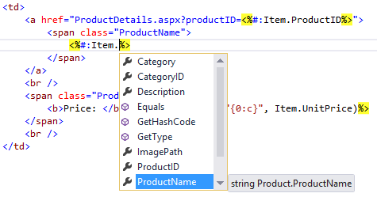
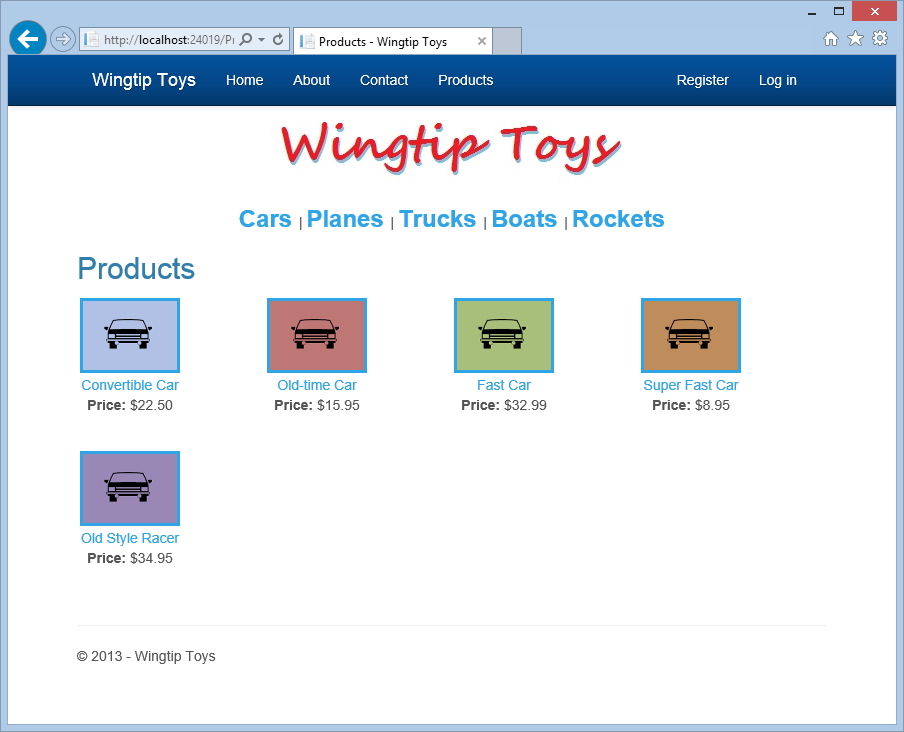
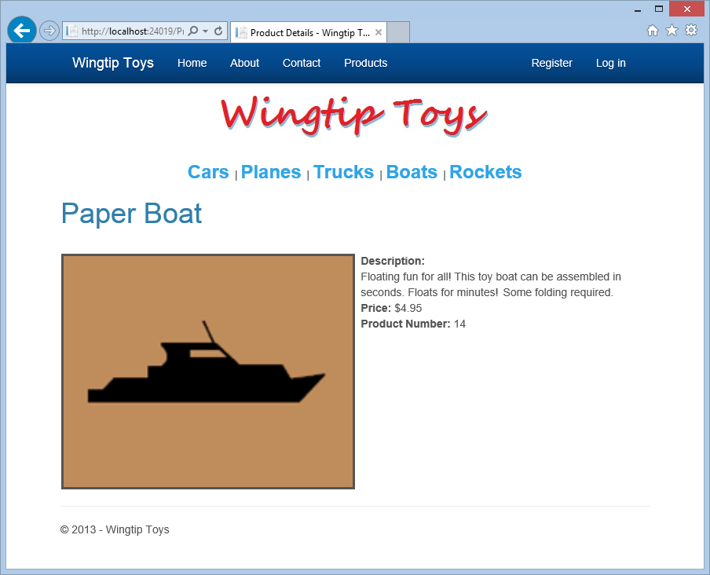

Display Data Items and Details
====================
by [Erik Reitan](https://github.com/Erikre)

[Download Wingtip Toys Sample Project (C#)](http://go.microsoft.com/fwlink/?LinkID=389434&clcid=0x409) or [Download E-book (PDF)](http://download.microsoft.com/download/0/F/B/0FBFAA46-2BFD-478F-8E56-7BF3C672DF9D/Getting%20Started%20with%20ASP.NET%204.5%20Web%20Forms%20and%20Visual%20Studio%202013.pdf)

> This tutorial series will teach you the basics of building an ASP.NET Web Forms application using ASP.NET 4.5 and Microsoft Visual Studio Express 2013 for Web. A Visual Studio 2013 [project with C# source code](https://go.microsoft.com/fwlink/?LinkID=389434&clcid=0x409) is available to accompany this tutorial series.

This tutorial describes how to display data items and data item details using ASP.NET Web Forms and Entity Framework Code First. This tutorial builds on the previous tutorial "UI and Navigation" and is part of the Wingtip Toy Store tutorial series. When you've completed this tutorial, you'll be able to see products on the *ProductsList.aspx* page and details about an individual product on the *ProductDetails.aspx* page.

## What you'll learn:

- How to add a data control to display products from the database.
- How to connect a data control to the selected data.
- How to add a data control to display product details from the database.
- How to retrieve a value from the query string and use that value to limit the data that's retrieved from the database.

### These are the features introduced in the tutorial:

- Model Binding
- Value providers

## Adding a Data Control to Display Products

When binding data to a server control, there are a few different options you can use. The most common options include adding a data source control, adding code by hand, or using model binding.

### Using a Data Source Control to Bind Data

Adding a data source control allows you to link the data source control to the control that displays the data. This approach allows you to declaratively connect server-side controls directly to data sources, rather than using a programmatic approach.

### Coding By Hand to Bind Data

Adding code by hand involves reading the value, checking for a null value, attempting to convert it to the appropriate type, checking whether the conversion was successful, and finally, using the value in the query. You would use this approach when you need to retain full control over your data-access logic.

### Using Model Binding to Bind Data

Using model binding allows you to bind results using far less code and gives you the ability to reuse the functionality throughout your application. Model binding aims to simplify working with code-focused data-access logic while still retaining the benefits of a rich, data-binding framework.

## Displaying Products

In this tutorial, you'll use model binding to bind data. To configure a data control to use model binding to select data, you set the control's `SelectMethod` property to the name of a method in the page's code. The data control calls the method at the appropriate time in the page life cycle and automatically binds the returned data. There's no need to explicitly call the `DataBind` method.

Using the steps below, you'll modify the markup in the *ProductList.aspx* page so that the page can display products.

1. In **Solution Explorer**, open the *ProductList.aspx* page.
2. Replace the existing markup with the following markup:   

    [!code-aspx[Main](display_data_items_and_details/samples/sample1.aspx)]

This code uses a **ListView** control named "productList" to display the products.

[!code-aspx[Main](display_data_items_and_details/samples/sample2.aspx)]

The **ListView** control displays data in a format that you define by using templates and styles. It is useful for data in any repeating structure. This **ListView** example simply shows data from the database, however you can enable users to edit, insert, and delete data, and to sort and page data, all without code.

By setting the `ItemType` property in the **ListView** control, the data-binding expression `Item` is available and the control becomes strongly typed. As mentioned in the previous tutorial, you can select details of the Item object using IntelliSense, such as specifying the `ProductName`:

In addition, you are using model binding to specify a `SelectMethod` value. This value (`GetProducts`) will correspond to the method that you will add to the code behind to display products in the next step.

### Adding Code to Display Products

In this step, you'll add code to populate the **ListView** control with product data from the database. The code will support showing products by individual category, as well as showing all products.

1. In **Solution Explorer**, right-click *ProductList.aspx* and then click **View Code**.
2. Replace the existing code in the *ProductList.aspx.cs* file with the following code:   

    [!code-csharp[Main](display_data_items_and_details/samples/sample3.cs)]

This code shows the `GetProducts` method that's referenced by the `ItemType` property of the **ListView** control in the *ProductList.aspx* page. To limit the results to a specific category in the database, the code sets the `categoryId` value from the query string value passed to the *ProductList.aspx* page when the *ProductList.aspx* page is navigated to. The `QueryStringAttribute` class in the `System.Web.ModelBinding` namespace is used to retrieve the value of the query string variable id. This instructs model binding to try to bind a value from the query string to the `categoryId` parameter at run time.

When a valid category is passed as a query string to the page, the results of the query are limited to those products in the database that match the `categoryId` value. For instance, if the URL to the *ProductsList.aspx* page is the following:

[!code-console[Main](display_data_items_and_details/samples/sample4.cmd)]

The page displays only the products where the `category` equals `1`.

If no query string is included when navigating to the *ProductList.aspx* page, all products will be displayed.

The sources of values for these methods are referred to as *value providers* (such as *QueryString*), and the parameter attributes that indicate which value provider to use are referred to as value provider attributes (such as "`id`"). ASP.NET includes value providers and corresponding attributes for all of the typical sources of user input in a Web Forms application, such as the query string, cookies, form values, controls, view state, session state, and profile properties. You can also write custom value providers.

### Running the Application

Run the application now to see how you can view all of the products or just a set of products limited by category.

1. In the **Solution Explorer**, right-click the *Default.aspx* page and select **View in Browser**.  
 The browser will open and show the *Default.aspx* page.
2. Select **Cars** from the product category navigation menu.  
 The *ProductList.aspx* page is displayed showing only products included in the "Cars" category. Later in this tutorial, you will display product details.  

    
3. Select **Products** from the navigation menu at the top.  
 Again, the *ProductList.aspx* page is displayed, however this time it shows the entire list of products.   

    
4. Close the browser and return to Visual Studio.

### Adding a Data Control to Display Product Details

Next, you'll modify the markup in the *ProductDetails.aspx* page that you added in the previous tutorial so that the page can display information about an individual product.

1. In **Solution Explorer**, open the *ProductDetails.aspx* page.
2. Replace the existing markup with the following markup:   

    [!code-aspx[Main](display_data_items_and_details/samples/sample5.aspx)]

This code uses a **FormView** control to display details about an individual product. This markup uses methods like those that are used to display data in the *ProductList.aspx* page. The **FormView** control is used to display a single record at a time from a data source. When you use the **FormView** control, you create templates to display and edit data-bound values. The templates contain controls, binding expressions, and formatting that define the look and functionality of the form.

To connect the above markup to the database, you must add additional code to the *ProductDetails.aspx* code.

1. In **Solution Explorer**, right-click *ProductDetails.aspx* and then click **View Code**.  
 The *ProductDetails.aspx.cs* file will be displayed.
2. Replace the existing code with the following code:   

    [!code-csharp[Main](display_data_items_and_details/samples/sample6.cs)]

This code checks for a "`productID`" query-string value. If a valid query-string value is found, the matching product is displayed. If no query-string is found, or the query-string value is not valid, no product is displayed on the *ProductDetails.aspx* page.

### Running the Application

Now you can run the application to see an individual product displayed based on the id of the product.

1. Press **F5** while in Visual Studio to run the application.  
 The browser will open and show the *Default.aspx* page.
2. Select "Boats" from the category navigation menu.  
 The *ProductList.aspx* page is displayed.
3. Select the "Paper Boat" product from the product list.  
 The *ProductDetails.aspx* page is displayed.   

    
4. Close the browser.

## Summary

In this tutorial of the series you have add markup and code to display a product list and to display product details. During this process you have learned about strongly typed data controls, model binding, and value providers. In the next tutorial, you'll add a shopping cart to the Wingtip Toys sample application.

## Additional Resources

[Retrieving and displaying data with model binding and web forms](../../presenting-and-managing-data/model-binding/retrieving-data.md)

>[!div class="step-by-step"]
[Previous](ui_and_navigation.md)
[Next](shopping-cart.md)