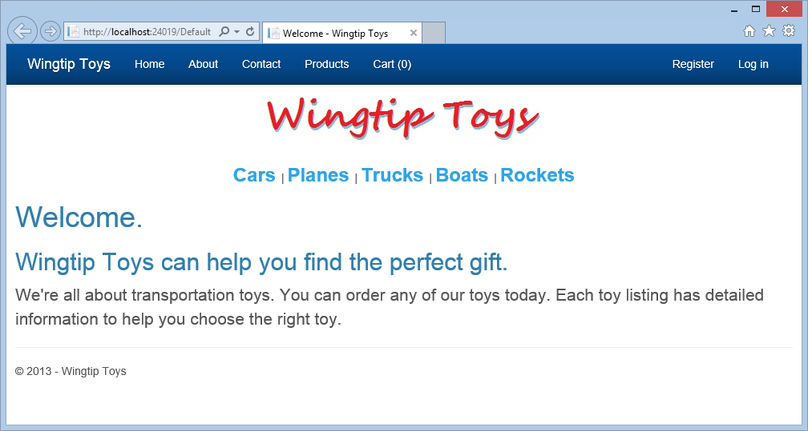
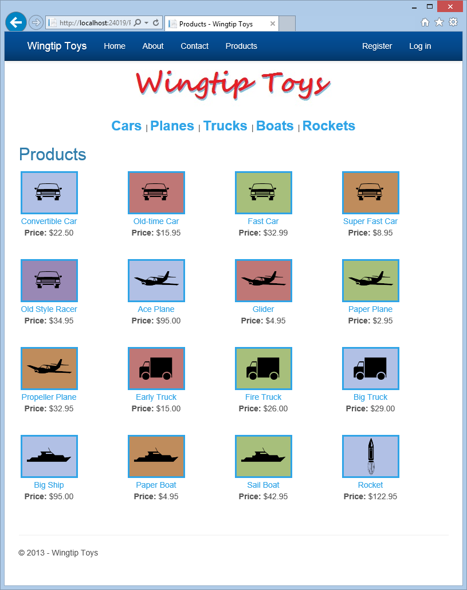

Getting Started with ASP.NET 4.5 Web Forms and Visual Studio 2013
====================
by [Erik Reitan](https://github.com/Erikre)

[Download Wingtip Toys Sample Project (C#)](http://go.microsoft.com/fwlink/?LinkID=389434&clcid=0x409) or [Download E-book (PDF)](http://download.microsoft.com/download/0/F/B/0FBFAA46-2BFD-478F-8E56-7BF3C672DF9D/Getting%20Started%20with%20ASP.NET%204.5%20Web%20Forms%20and%20Visual%20Studio%202013.pdf)

> This step-by-step tutorial series will teach you the basics of building an ASP.NET Web Forms application using ASP.NET 4.5 and Microsoft Visual Studio Express 2013 for Web. [ASP.NET Web Forms Quiz](http://quizapp.cloudapp.net/?quiz=ASP.NET)  
> Test your knowledge and reinforce key concepts by taking the ASP.NET Web Forms Quiz. This quiz was specifically designed from content contained in this tutorial series. Each question in the quiz provides an explanation along with links to additional guidance.

## Introduction

This series of tutorials guides you through the steps required to create an ASP.NET Web Forms application using Visual Studio Express 2013 for Web and ASP.NET 4.5.

The application you'll create is named **Wingtip Toys**. It's a simplified example of a store front web site that sells items online. This tutorial series highlights new features available in ASP.NET 4.5.

Comments are welcome, and we'll make every effort to update this tutorial series based on your suggestions.

### Download completed project

You can download a C# project that contains the completed tutorial.

- [Getting Started with ASP.NET 4.5 Web Forms and Visual Studio 2013 - Wingtip Toys](https://go.microsoft.com/fwlink/?LinkID=389434&clcid=0x409) (C#)

### Review the content by taking the related ASP.NET Web Forms quiz

After you complete this tutorial, test your knowledge and reinforce key concepts by taking the [ASP.NET Web Forms Quiz](http://quizapp.cloudapp.net/?quiz=ASP.NET&cdn_id=2014-01-17-001). This quiz was specifically designed from content contained in this tutorial series. Each question in the quiz provides an explanation along with links to additional guidance.

- [ASP.NET Web Forms Quiz](http://quizapp.cloudapp.net/?quiz=ASP.NET)

### Audience

The intended audience of this tutorial series is experienced developers who are new to ASP.NET Web Forms. A developer interested in this tutorial series should have the following skills:

- Familiar with an object oriented programming (OOP) language
- Familiar with Web development concepts (HTML, CSS, JavaScript)
- Familiar with relational database concepts
- Familiar with n-tier architecture concepts

If you are interested in reviewing the areas listed above, consider reviewing the following content:

- [Getting Started with Visual C#](https://msdn.microsoft.com/library/a72418yk.aspx)
- [Web Development](https://msdn.microsoft.com/beginner/bb308760.aspx), [HTML, CSS, JavaScript, SQL, PHP, JQuery](http://w3schools.com/)
- [Relational database](http://en.wikipedia.org/wiki/Relational_database)
- [Multitier architecture](http://en.wikipedia.org/wiki/Multitier_architecture)

### Application Features

The ASP.NET Web Form features presented in this series include:

- The Web Application Project (not Web Site Project)
- Web Forms
- Master Pages, Configuration
- Bootstrap
- Entity Framework Code First, LocalDB
- Request Validation
- Strongly Typed Data Controls, Model Binding, Data Annotations, and Value Providers
- SSL and OAuth
- ASP.NET Identity, Configuration, and Authorization
- Unobtrusive Validation
- Routing
- ASP.NET Error Handling

### Application Scenarios and Tasks

Tasks demonstrated in this series include:

- Creating, reviewing and running the new project
- Creating the database structure
- Initializing and seeding the database
- Customizing the UI using styles, graphics and a master page
- Adding pages and navigation
- Displaying menu details and product data
- Creating a shopping cart
- Adding SSL and OAuth support
- Adding a payment method
- Including an administrator role and a user to the application
- Restricting access to specific pages and folder
- Uploading a file to the web application
- Implementing input validation
- Registering routes for the web application
- Implementing error handling and error logging

## Overview

If you are new to ASP.NET Web Forms but have familiarity with programming concepts, you have the right tutorial. If you are already familiar with ASP.NET Web Forms, you can benefit from this tutorial series by the new features available in ASP.NET 4.5. If you are unfamiliar with programming concepts and ASP.NET Web Forms, see the additional tutorials provided in the Web Forms [Getting Started](../../../index.md) section on the ASP.NET Web site.

The specific **latest** ASP.NET 4.5 features provided in this Web Forms tutorial series include the following:

- A simple UI for creating projects that offer [support for multiple ASP.NET frameworks](../../../../visual-studio/overview/2013/creating-web-projects-in-visual-studio.md#add) (Web Forms, MVC, and Web API).
- [Bootstrap](../../../../visual-studio/overview/2013/creating-web-projects-in-visual-studio.md#bootstrap), a layout and theming framework that provides responsive design and theming capabilities.
- [ASP.NET Identity](../../../../identity/index.md), a new ASP.NET membership system that works the same in all ASP.NET frameworks and works with web hosting software other than IIS.
- [Entity Framework 6](https://msdn.microsoft.com/data/ef.aspx), an update to the Entity Framework which allows you retrieve and manipulate data as strongly typed objects, access data asynchronously, handle transient connection faults, and log SQL statements.

For a complete list of ASP.NET 4.5 features, see [ASP.NET and Web Tools for Visual Studio 2013 Release Notes](../../../../visual-studio/overview/2013/release-notes.md).

### The Wingtip Toys Sample Application

The following screen shots provide a quick view of the ASP.NET Web forms application that you will create in this tutorial series. When you run the application from Visual Studio Express 2013 for Web, you will see the following web Home page.

You can register as a new user, or log in as an existing user. Navigation is provided at the top for each product category by retrieving the available products from the database.

By selecting the Products link, you will be able to see a list of all available products.

You can also see individual product details by selecting any of the listed products.

As a user, you can register and log in using the default functionality of the Web Forms template. This tutorial also explains how to login using an existing Gmail account. Additionally, you can login as the administrator to add and remove products from the database.

Once you have logged in as a user, you can add products to the shopping cart and checkout with PayPal. Note that this sample application is designed to function with PayPal's developer sandbox. No actual money transaction will take place.

PayPal will confirm your account, order, and payment information.

After returning from PayPal, you can review and complete your order.

## Prerequisites

Before you start, make sure that you have the following software installed on your computer:

- [Microsoft Visual Studio 2013](https://www.microsoft.com/visualstudio/11/en-us/downloads#vs) or [Microsoft Visual Studio Express 2013 for Web](https://www.microsoft.com/visualstudio/11/en-us/downloads#express-web). The .NET Framework is installed automatically.

This tutorial series uses Microsoft Visual Studio Express 2013 for Web. You can use either Microsoft Visual Studio Express 2013 for Web or Microsoft Visual Studio 2013 to complete this tutorial series.

> [!NOTE] 
> 
> Microsoft Visual Studio 2013 and Microsoft Visual Studio Express 2013 for Web will often be referred to as Visual Studio throughout this tutorial series.

If you already have a Visual Studio version installed, the installation process will install Visual Studio 2013 or Microsoft Visual Studio Express 2013 for Web next to the existing version. Sites that you created in earlier versions can be opened in Visual Studio 2013 and continue to open in previous versions.

> [!NOTE] 
> 
> This walkthrough assumes that you selected the *Web Development* collection of settings the first time that you started Visual Studio. For more information, see [How to: Select Web Development Environment Settings](https://msdn.microsoft.com/en-us/library/ff521558.aspx).

## Download the Sample Application

After installing the prerequisites, you are ready to begin creating the new Web project that is presented in this tutorial series. If you would like to **optionally** run the sample application that this tutorial series creates, you can download it from the MSDN Samples site. This download contains the following:

- The sample application in the *WingtipToys* folder.
- The resources used to create the sample application in the *WingtipToys-Assets* folder in the *WingtipToys* folder.

#### Download the file from MSDN Samples site:

[Getting Started with ASP.NET 4.5 Web Forms and Visual Studio 2013 - Wingtip Toys](https://go.microsoft.com/fwlink/?LinkID=389434&clcid=0x409) (C#) 

The download is a *.zip* file. To see the completed project that this tutorial series creates, find and select the *C#*folder in the *.zip* file. Save the *C#* folderto the folder you use to work with Visual Studio 2013 projects. By default, the Visual Studio 2013 projects folder is the following:

**C:\Users\*****&lt;username&gt;*****\Documents\Visual Studio 2013\Projects**

Rename the ***C#*** folder to ***WingtipToys***.

> [!NOTE]
> If you already have a folder named *WingtipToys* in your Projects folder, temporarily rename that existing folder before renaming the *C#* folder to *WingtipToys*.

To run the completed project, open the *WingtipToys* folder and double-click the *WingtipToys.sln* file. Visual Studio 2013 will open the project. Next, right-click the *Default.aspx* file in the Solution Explorer window and click View In Browser from the right-click menu.

### Tutorial Support and Comments

Use the Q AND A section included with the [Getting Started with ASP.NET 4.5 Web Forms and Visual Studio 2013 - Wingtip Toys](https://go.microsoft.com/fwlink/?LinkID=389434&clcid=0x409) (C#) sample for any questions or comments.

Comments on this tutorial series are welcome, and when this tutorial series is updated every effort will be made to take into account corrections or suggestions for improvements that are provided in the tutorial comments.

When an error happens during development, or if the Web site does not run correctly, the error messages may give complex clues to the source of the problem or might not explain how to fix it. To help you with some common problem scenarios, you can also use the [ASP.NET forums](https://forums.asp.net/) or the Q AND A section included with the [Getting Started with ASP.NET 4.5 Web Forms and Visual Studio 2013 - Wingtip Toys](https://go.microsoft.com/fwlink/?LinkID=389434&clcid=0x409) (C#) sample. If you get an error message or something doesn't work as you go through the tutorials, be sure to check the above locations.

>[!div class="step-by-step"]
[Next](create-the-project.md)