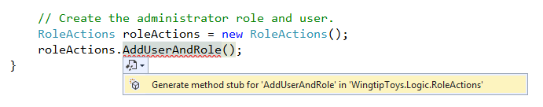
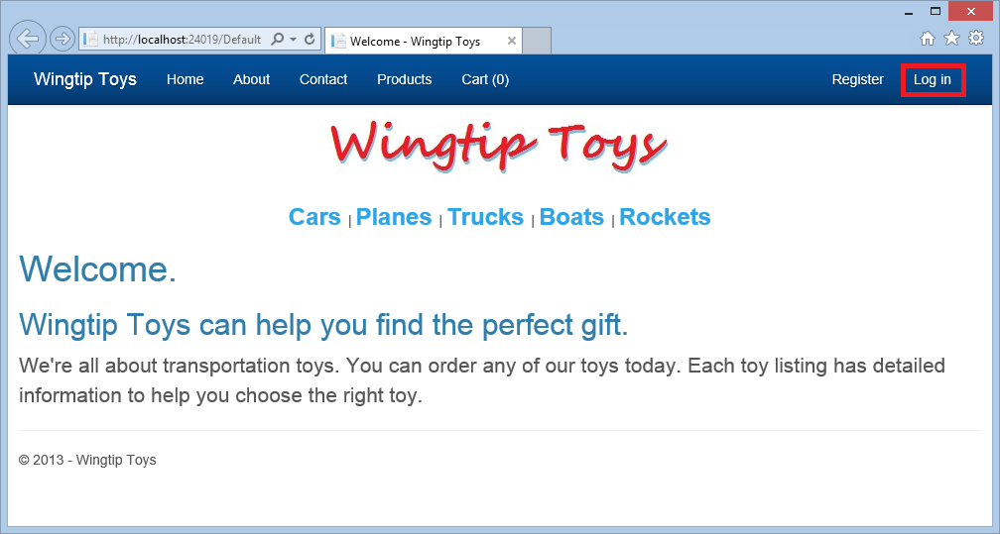
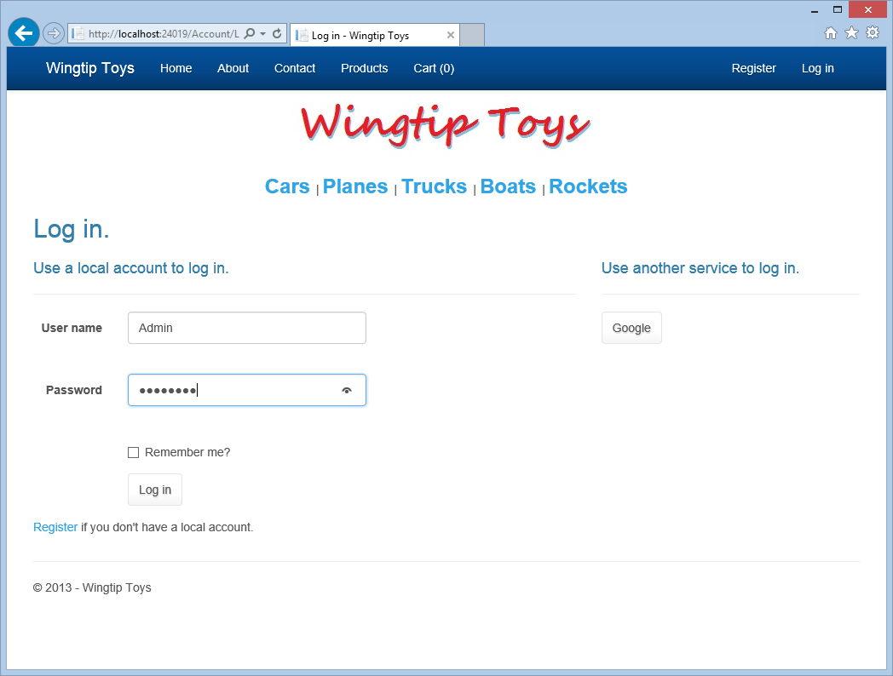
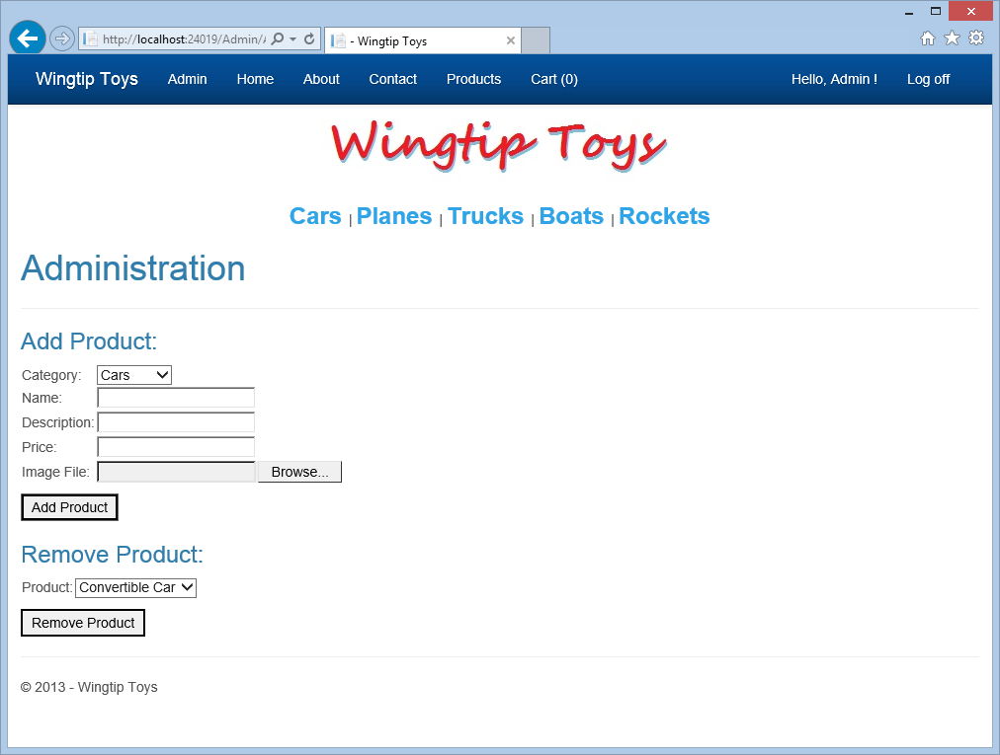
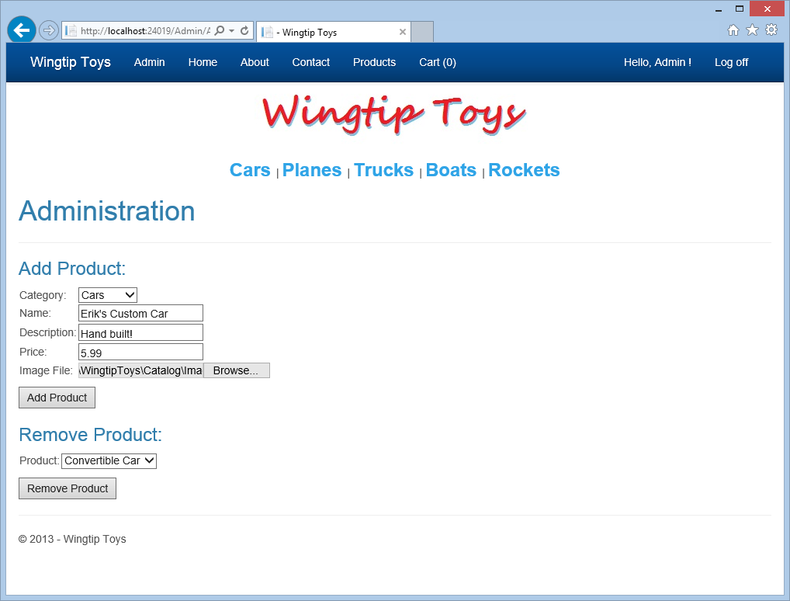
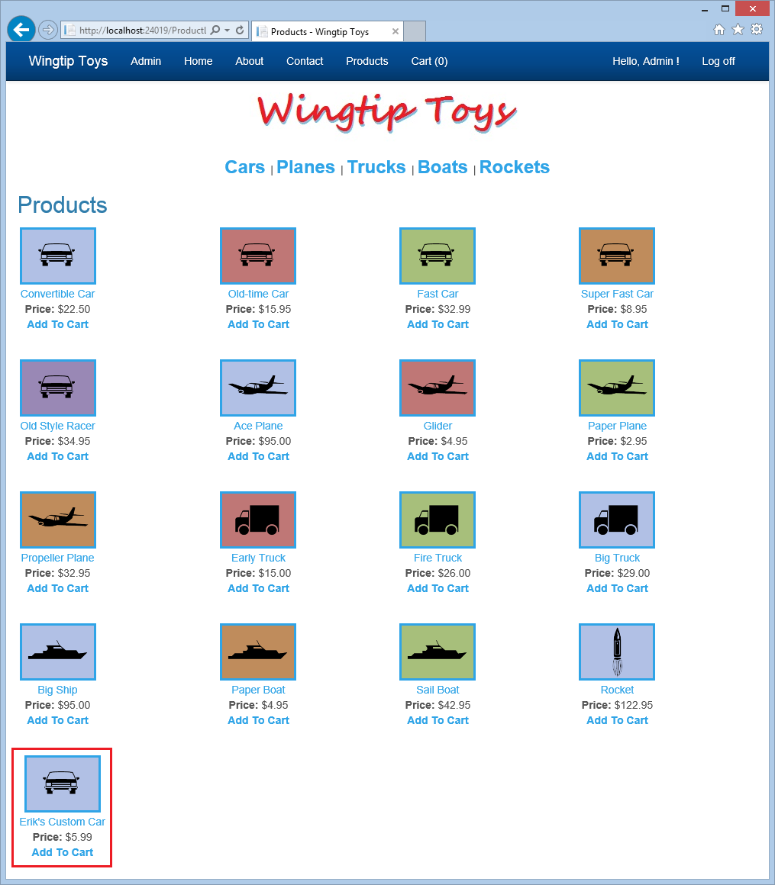
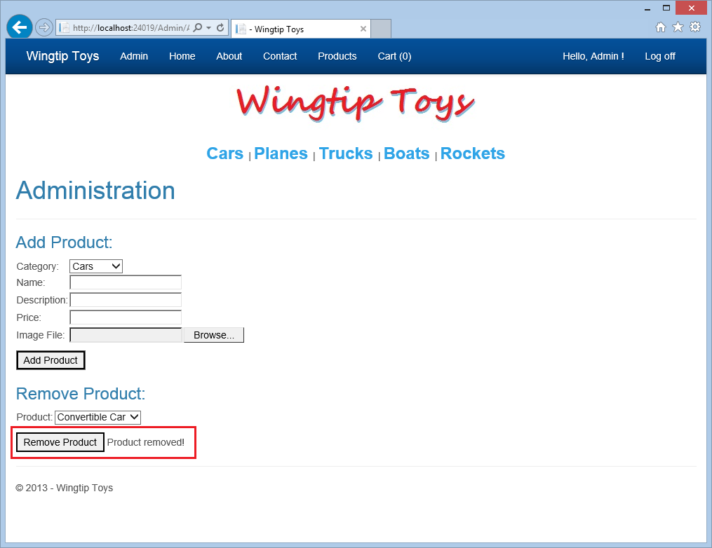

Membership and Administration
====================
by [Erik Reitan](https://github.com/Erikre)

[Download Wingtip Toys Sample Project (C#)](http://go.microsoft.com/fwlink/?LinkID=389434&clcid=0x409) or [Download E-book (PDF)](http://download.microsoft.com/download/0/F/B/0FBFAA46-2BFD-478F-8E56-7BF3C672DF9D/Getting%20Started%20with%20ASP.NET%204.5%20Web%20Forms%20and%20Visual%20Studio%202013.pdf)

> This tutorial series will teach you the basics of building an ASP.NET Web Forms application using ASP.NET 4.5 and Microsoft Visual Studio Express 2013 for Web. A Visual Studio 2013 [project with C# source code](https://go.microsoft.com/fwlink/?LinkID=389434&clcid=0x409) is available to accompany this tutorial series.

This tutorial shows you how to update the Wingtip Toys sample application to add a custom role and use ASP.NET Identity. It also shows you how to implement an administration page from which the user with a custom role can add and remove products from the website.

[ASP.NET Identity](../../../../identity/overview/getting-started/introduction-to-aspnet-identity.md) is the membership system used to build ASP.NET web application and is available in ASP.NET 4.5. ASP.NET Identity is used in the Visual Studio 2013 Web Forms project template, as well as the templates for [ASP.NET MVC](../../../../mvc/index.md), [ASP.NET Web API](../../../../web-api/index.md), and [ASP.NET Single Page Application](../../../../single-page-application/index.md). You can also specifically install the ASP.NET Identity system using NuGet when you start with an empty Web application. However, in this tutorial series you use the **Web Forms**projecttemplate, which includes the ASP.NET Identity system. ASP.NET Identity makes it easy to integrate user-specific profile data with application data. Also, ASP.NET Identity allows you to choose the persistence model for user profiles in your application. You can store the data in a SQL Server database or another data store, including *NoSQL* data stores such as Windows Azure Storage Tables.

This tutorial builds on the previous tutorial titled "Checkout and Payment with PayPal" in the Wingtip Toys tutorial series.

## What you'll learn:

- How to use code to add a custom role and a user to the application.
- How to restrict access to the administration folder and page.
- How to provide navigation for the user that belongs to the custom role.
- How to use model binding to populate a [DropDownList](https://msdn.microsoft.com/library/system.web.ui.webcontrols.dropdownlist(v=vs.110).aspx) control with product categories.
- How to upload a file to the web application using the [FileUpload](https://msdn.microsoft.com/library/system.web.ui.webcontrols.fileupload(v=vs.110).aspx) control.
- How to use validation controls to implement input validation.
- How to add and remove products from the application.

## These features are included in the tutorial:

- ASP.NET Identity
- Configuration and Authorization
- Model Binding
- Unobtrusive Validation

ASP.NET Web Forms provides membership capabilities. By using the default template, you have built-in membership functionality that you can immediately use when the application runs. This tutorial shows you how to use ASP.NET Identity to add a custom role and assign a user to that role. You will learn how to restrict access to the administration folder. You'll add a page to the administration folder that allows a user with a custom role to add and remove products, and to preview a product after it has been added.

## Adding a Custom Role

Using ASP.NET Identity, you can add a custom role and assign a user to that role using code.

1. In **Solution Explorer**, right-click on the *Logic* folder and create a new class.
2. Name the new class *RoleActions.cs*.
3. Modify the code so that it appears as follows:  

    [!code-csharp[Main](membership-and-administration/samples/sample1.cs?highlight=8)]
4. In **Solution Explorer**, open the *Global.asax.cs* file.
5. Modify the *Global.asax.cs* file by adding the code highlighted in yellow so that it appears as follows:  

    [!code-csharp[Main](membership-and-administration/samples/sample2.cs?highlight=11,26-28)]
6. Notice that `AddUserAndRole` is underlined in red. Double-click the AddUserAndRole code.  
 The letter "A" at the beginning of the highlighted method will be underlined.
7. Hover over the letter "A" and click the UI that allows you to generate a method stub for the `AddUserAndRole` method. 

    
8. Click the option titled:  
    `Generate method stub for "AddUserAndRole" in "WingtipToys.Logic.RoleActions"`
9. Open the *RoleActions.cs* file from the *Logic* folder.  
 The `AddUserAndRole` method has been added to the class file.
10. Modify the *RoleActions.cs* file by removing the `NotImplementedeException` and adding the code highlighted in yellow, so that it appears as follows:  

    [!code-csharp[Main](membership-and-administration/samples/sample3.cs?highlight=5-7,15-51)]

The above code first establishes a database context for the membership database. The membership database is also stored as an *.mdf* file in the *App\_Data* folder. You will be able to view this database once the first user has signed in to this web application. 

> [!NOTE] 
> 
> If you wish to store the membership data along with the product data, you can consider using the same **DbContext** that you used to store the product data in the above code.

 The *internal* keyword is an access modifier for types (such as classes) and type members (such as methods or properties). Internal types or members are accessible only within files contained in the same assembly *(.dll* file). When you build your application, an assembly file *(.dll*) is created that contains the code that is executed when you run your application. 

A `RoleStore` object, which provides role management, is created based on the database context.

> [!NOTE] 
> 
> Notice that when the `RoleStore` object is created it uses a Generic `IdentityRole` type. This means that the `RoleStore` is only allowed to contain `IdentityRole` objects. Also by using Generics, resources in memory are handled better.

Next, the `RoleManager` object, is created based on the `RoleStore` object that you just created. the `RoleManager` object exposes role related API which can be used to automatically save changes to the `RoleStore`. The `RoleManager` is only allowed to contain `IdentityRole` objects because the code uses the `<IdentityRole>` Generic type.

You call the `RoleExists` method to determine if the "canEdit" role is present in the membership database. If it is not, you create the role.

Creating the `UserManager` object appears to be more complicated than the `RoleManager` control, however it is nearly the same. It is just coded on one line rather than several. Here, the parameter that you are passing is instantiating as a new object contained in the parenthesis.

Next you create the "canEditUser" user by creating a new `ApplicationUser` object. Then, if you successfully create the user, you add the user to the new role.

> [!NOTE] 
> 
> The error handling will be updated during the "ASP.NET Error Handling" tutorial later in this tutorial series.

The next time the application starts, the user named "canEditUser" will be added as the role named "canEdit" of the application. Later in this tutorial, you will login as the "canEditUser" user to display additional capabilities that you will added during this tutorial. For API details about ASP.NET Identity, see the [Microsoft.AspNet.Identity Namespace](https://msdn.microsoft.com/library/microsoft.aspnet.identity(v=vs.111).aspx). For additional details about initializing the ASP.NET Identity system, see the [AspnetIdentitySample](https://github.com/rustd/AspnetIdentitySample/blob/master/AspnetIdentitySample/App_Start/IdentityConfig.cs).

### Restricting Access to the Administration Page

The Wingtip Toys sample application allows both anonymous users and logged-in users to view and purchase products. However, the logged-in user that has the custom "canEdit" role can access a restricted page in order to add and remove products.

#### Add an Administration Folder and Page

Next, you will create a folder named *Admin* for the "canEditUser" user belonging to the custom role of the Wingtip Toys sample application.

1. Right-click the project name (**Wingtip Toys**) in **Solution Explorer** and select **Add** -&gt; **New Folder**.
2. Name the new folder *Admin*.
3. Right-click the *Admin* folder and then select **Add** -&gt; **New Item**.   
 The **Add New Item** dialog box is displayed.
4. Select the **Visual C#**-&gt; **Web** templates group on the left. From the middle list, select **Web Form with Master Page**,name it *AdminPage.aspx***,** and then select **Add**.
5. Select the *Site.Master* file as the master page, and then choose **OK**.

#### Add a Web.config File

By adding a *Web.config* file to the *Admin* folder, you can restrict access to the page contained in the folder.

1. Right-click the *Admin* folder and select **Add** -&gt; **New Item**.  
 The **Add New Item** dialog box is displayed.
2. From the list of Visual C# web templates, select **Web Configuration File**from the middle list, accept the default name of *Web.config***,** and then select **Add**.
3. Replace the existing XML content in the *Web.config* file with the following:  

    [!code-xml[Main](membership-and-administration/samples/sample4.xml)]

Save the *Web.config* file. The *Web.config* file specifies that only user belonging to the "canEdit" role of the application can access the page contained in the *Admin* folder.

### Including Custom Role Navigation

To enable the user of the custom "canEdit" role to navigate to the administration section of the application, you must add a link to the *Site.Master* page. Only users that belong to the "canEdit" role will be able to see the **Admin** link and access the administration section.

1. In Solution Explorer, find and open the *Site.Master* page.
2. To create a link for the user of the "canEdit" role, add the markup highlighted in yellow to the following unordered list `<ul>` element so that the list appears as follows:  

    [!code-html[Main](membership-and-administration/samples/sample5.html?highlight=2-3)]
3. Open the *Site.Master.cs* file. Make the **Admin** link visible only to the "canEditUser" user by adding the code highlighted in yellow to the `Page_Load` handler. The `Page_Load` handler will appear as follows:   

    [!code-csharp[Main](membership-and-administration/samples/sample6.cs?highlight=3-6)]

When the page loads, the code checks whether the logged-in user has the role of "canEdit". If the user belongs to the "canEdit" role, the span element containing the link to the *AdminPage.aspx* page (and consequently the link inside the span) is made visible.

### Enabling Product Administration

So far, you have created the "canEdit" role and added an "canEditUser" user, an administration folder, and an administration page. You have set access rights for the administration folder and page, and have added a navigation link for the user of the "canEdit" role to the application. Next, you will add markup to the *AdminPage.aspx* page and code to the *AdminPage.aspx.cs* code-behind file that will enable the user with the "canEdit" role to add and remove products.

1. In **Solution Explorer**, open the *AdminPage.aspx* file from the *Admin* folder.
2. Replace the existing markup with the following:  

    [!code-aspx[Main](membership-and-administration/samples/sample7.aspx)]
3. Next, open the *AdminPage.aspx.cs* code-behind file by right-clicking the *AdminPage.aspx* and clicking **View Code**.
4. Replace the existing code in the *AdminPage.aspx.cs* code-behind file with the following code:  

    [!code-csharp[Main](membership-and-administration/samples/sample8.cs)]

In the code that you entered for the *AdminPage.aspx.cs* code-behind file, a class called `AddProducts` does the actual work of adding products to the database. This class doesn't exist yet, so you will create it now.

1. In **Solution Explorer**, right-click the *Logic* folder and then select **Add** -&gt; **New Item**.   
 The **Add New Item** dialog box is displayed.
2. Select the **Visual C#** -&gt; **Code** templates group on the left. Then, select **Class**from the middle list and name it *AddProducts.cs*.   
 The new class file is displayed.
3. Replace the existing code with the following:  

    [!code-csharp[Main](membership-and-administration/samples/sample9.cs)]

The *AdminPage.aspx* page allows the user belonging to the "canEdit" role to add and remove products. When a new product is added, the details about the product are validated and then entered into the database. The new product is immediately available to all users of the web application.

#### Unobtrusive Validation

The product details that the user provides on the *AdminPage.aspx* page are validated using validation controls (`RequiredFieldValidator` and `RegularExpressionValidator`). These controls automatically use unobtrusive validation. Unobtrusive validation allows the validation controls to use JavaScript for client-side validation logic, which means the page does not require a trip to the server to be validated. By default, unobtrusive validation is included in the *Web.config* file based on the following configuration setting:

[!code-xml[Main](membership-and-administration/samples/sample10.xml)]

#### Regular Expressions

The product price on the *AdminPage.aspx* page is validated using a **RegularExpressionValidator** control. This control validates whether the value of the associated input control (the "AddProductPrice" TextBox) matches the pattern specified by the regular expression. A regular expression is a pattern-matching notation that enables you to quickly find and match specific character patterns. The **RegularExpressionValidator** control includes a property named `ValidationExpression` that contains the regular expression used to validate price input, as shown below:

[!code-aspx[Main](membership-and-administration/samples/sample11.aspx)]

#### FileUpload Control

In addition to the input and validation controls, you added the **FileUpload** control to the *AdminPage.aspx* page. This control provides the capability to upload files. In this case, you are only allowing image files to be uploaded. In the code-behind file (*AdminPage.aspx.cs*), when the `AddProductButton` is clicked, the code checks the `HasFile` property of the **FileUpload** control. If the control has a file and if the file type (based on file extension) is allowed, the image is saved to the *Images* folder and the *Images/Thumbs* folder of the application.

#### Model Binding

Earlier in this tutorial series you used model binding to populate a **ListView** control, a **FormsView** control, a **GridView** control, and a **DetailView** control. In this tutorial, you use model binding to populate a **DropDownList** control with a list of product categories.

The markup that you added to the *AdminPage.aspx* file contains a **DropDownList** control called `DropDownAddCategory`:

[!code-aspx[Main](membership-and-administration/samples/sample12.aspx)]

You use model binding to populate this **DropDownList** by setting the `ItemType` attribute and the `SelectMethod` attribute. The `ItemType` attribute specifies that you use the `WingtipToys.Models.Category` type when populating the control. You defined this type at the beginning of this tutorial series by creating the `Category` class (shown below). The `Category` class is in the *Models* folder inside the *Category.cs* file.

[!code-csharp[Main](membership-and-administration/samples/sample13.cs)]

The `SelectMethod` attribute of the **DropDownList** control specifies that you use the `GetCategories` method (shown below) that is included in the code-behind file (*AdminPage.aspx.cs*).

[!code-csharp[Main](membership-and-administration/samples/sample14.cs)]

This method specifies that an `IQueryable` interface is used to evaluate a query against a `Category` type. The returned value is used to populate the **DropDownList** in the markup of the page (*AdminPage.aspx*).

The text displayed for each item in the list is specified by setting the `DataTextField` attribute. The `DataTextField` attribute uses the `CategoryName` of the `Category` class (shown above) to display each category in the **DropDownList** control. The actual value that is passed when an item is selected in the **DropDownList** control is based on the `DataValueField` attribute. The `DataValueField` attribute is set to the `CategoryID` as define in the `Category` class (shown above).

### How the Application Will Work

When the user belonging to the "canEdit" role navigates to the page for the first time, the `DropDownAddCategory`**DropDownList** control is populated as described above. The `DropDownRemoveProduct`**DropDownList** control is also populated with products using the same approach. The user belonging to the "canEdit" role selects the category type and adds product details (**Name**, **Description**, **Price**, and **Image File**). When the user belonging to the "canEdit" role clicks the **Add Product** button, the `AddProductButton_Click` event handler is triggered. The `AddProductButton_Click` event handler located in the code-behind file (*AdminPage.aspx.cs*) checks the image file to make sure it matches the allowed file types *(.gif*, *.png*, *.jpeg*, or *.jpg*). Then, the image file is saved into a folder of the Wingtip Toys sample application. Next, the new product is added to the database. To accomplish adding a new product, a new instance of the `AddProducts` class is created and named products. The `AddProducts` class has a method named `AddProduct`, and the products object calls this method to add products to the database.

[!code-csharp[Main](membership-and-administration/samples/sample15.cs)]

If the code successfully adds the new product to the database, the page is reloaded with the query string value `ProductAction=add`.

[!code-csharp[Main](membership-and-administration/samples/sample16.cs)]

When the page reloads, the query string is included in the URL. By reloading the page, the user belonging to the "canEdit" role can immediately see the updates in the **DropDownList** controls on the *AdminPage.aspx* page. Also, by including the query string with the URL, the page can display a success message to the user belonging to the "canEdit" role.

When the *AdminPage.aspx* page reloads, the `Page_Load` event is called.

[!code-csharp[Main](membership-and-administration/samples/sample17.cs)]

The `Page_Load` event handler checks the query string value and determines whether to show a success message.

## Running the Application

You can run the application now to see how you can add, delete, and update items in the shopping cart. The shopping cart total will reflect the total cost of all items in the shopping cart.

1. In Solution Explorer, press **F5** to run the Wingtip Toys sample application.  
 The browser opens and shows the *Default.aspx* page.
2. Click the **Log in** link at the top of the page. 

    

 The *Login.aspx* page is displayed.
3. Use the following user name and password:  
 User name: canEditUser@wingtiptoys.com  
 Password: Pa$$word1 

    
4. Click the **Log in** button near the bottom of the page.
5. At the top of the next page, select the **Admin** link to navigate to the *AdminPage.aspx* page. 

    
6. To test the input validation, click the **Add Product** button without adding any product details. 

    

 Notice that the required field messages are displayed.
7. Add the details for a new product, and then click the **Add Product** button. 

    
8. Select **Products** from the top navigation menu to view the new product you added. 

    
9. Click the **Admin** link to return to the administration page.
10. In the **Remove Product** section of the page, select the new product you added in the **DropDownListBox**.
11. Click the **Remove Product** button to remove the new product from the application. 

    
12. Select **Products** from the top navigation menu to confirm that the product has been removed.
13. Click **Log off** to exist administration mode.   
 Notice that the top navigation pane no longer shows the **Admin** menu item.

## Summary

In this tutorial, you added a custom role and a user belonging to the custom role, restricted access to the administration folder and page, and provided navigation for the user belonging to the custom role. You used model binding to populate a **DropDownList** control with data. You implemented the **FileUpload** control and validation controls. Also, you have learned how to add and remove products from a database. In the next tutorial, you'll learn how to implement ASP.NET routing.

## Additional Resources

[Web.config - authorization Element](https://msdn.microsoft.com/library/8d82143t(v=vs.100).aspx)  
[ASP.NET Identity](../../../../identity/overview/getting-started/introduction-to-aspnet-identity.md)  
[Deploy a Secure ASP.NET Web Forms App with Membership, OAuth, and SQL Database to an Azure Web Site](https://azure.microsoft.com/documentation/articles/web-sites-dotnet-deploy-aspnet-webforms-app-membership-oauth-sql-database/)  
[Microsoft Azure - Free Trial](https://azure.microsoft.com/pricing/free-trial/)

>[!div class="step-by-step"]
[Previous](checkout-and-payment-with-paypal.md)
[Next](url-routing.md)