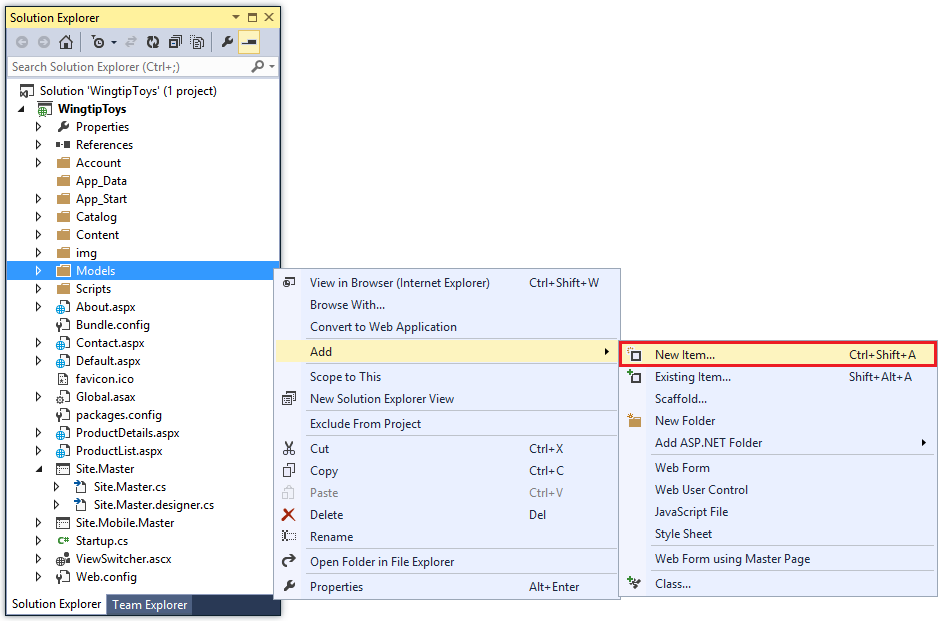
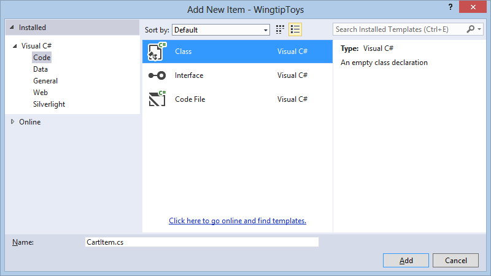
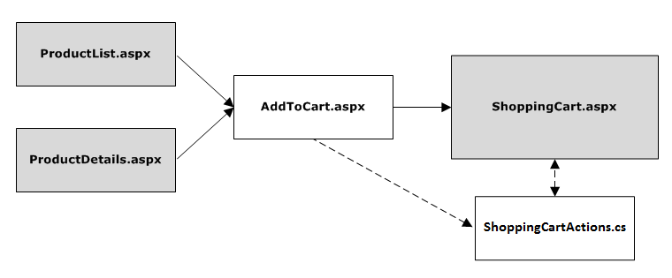
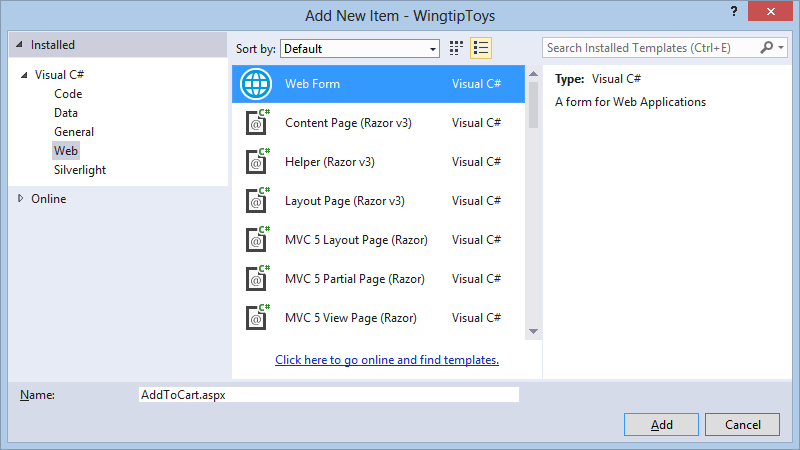
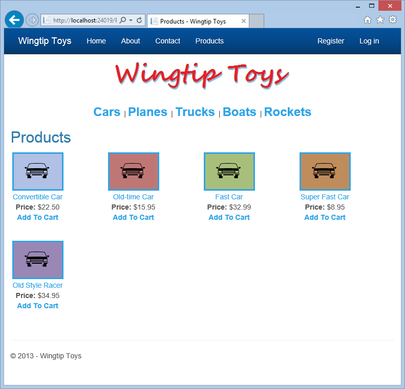
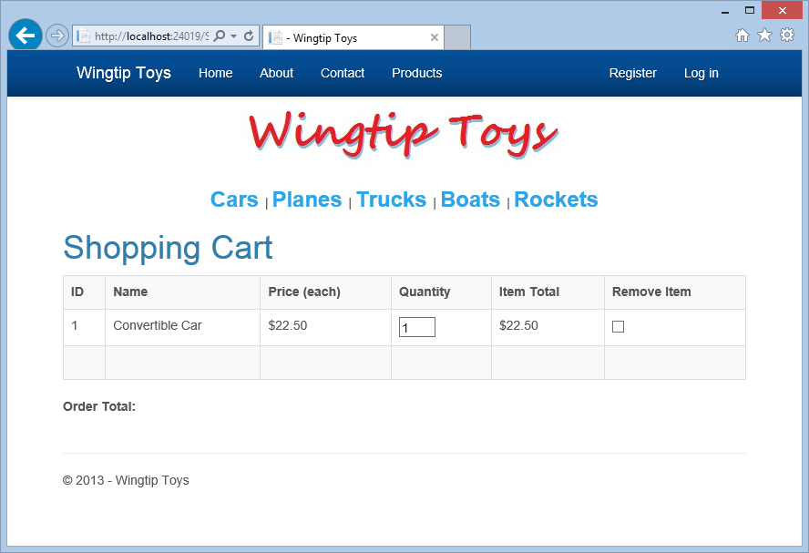
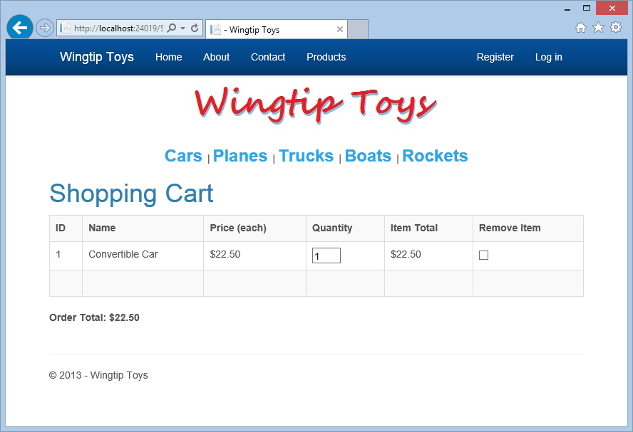
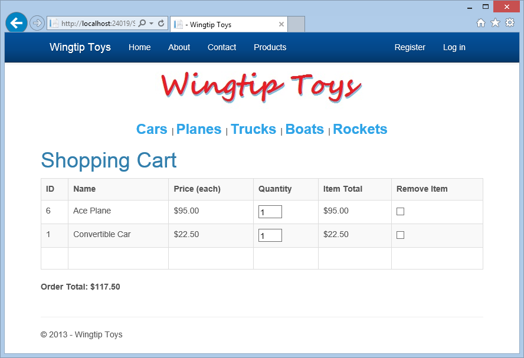
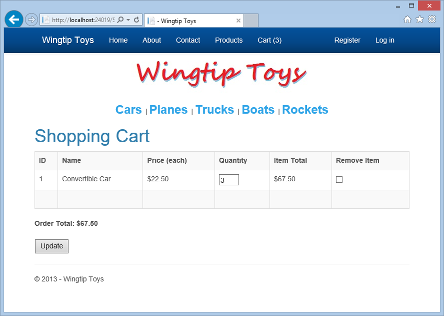

Shopping Cart
====================
by [Erik Reitan](https://github.com/Erikre)

[Download Wingtip Toys Sample Project (C#)](http://go.microsoft.com/fwlink/?LinkID=389434&clcid=0x409) or [Download E-book (PDF)](http://download.microsoft.com/download/0/F/B/0FBFAA46-2BFD-478F-8E56-7BF3C672DF9D/Getting%20Started%20with%20ASP.NET%204.5%20Web%20Forms%20and%20Visual%20Studio%202013.pdf)

> This tutorial series will teach you the basics of building an ASP.NET Web Forms application using ASP.NET 4.5 and Microsoft Visual Studio Express 2013 for Web. A Visual Studio 2013 [project with C# source code](https://go.microsoft.com/fwlink/?LinkID=389434&clcid=0x409) is available to accompany this tutorial series.

This tutorial describes the business logic required to add a shopping cart to the Wingtip Toys sample ASP.NET Web Forms application. This tutorial builds on the previous tutorial "Display Data Items and Details" and is part of the Wingtip Toy Store tutorial series. When you've completed this tutorial, the users of your sample app will be able to add, remove, and modify the products in their shopping cart.

## What you'll learn:

1. How to create a shopping cart for the web application.
2. How to enable users to add items to the shopping cart.
3. How to add a [GridView](https://msdn.microsoft.com/library/system.web.ui.webcontrols.gridview(v=vs.110).aspx#introduction) control to display shopping cart details.
4. How to calculate and display the order total.
5. How to remove and update items in the shopping cart.
6. How to include a shopping cart counter.

## Code features in this tutorial:

1. Entity Framework Code First
2. Data Annotations
3. Strongly typed data controls
4. Model binding

## Creating a Shopping Cart

Earlier in this tutorial series, you added pages and code to view product data from a database. In this tutorial, you'll create a shopping cart to manage the products that users are interested in buying. Users will be able to browse and add items to the shopping cart even if they are not registered or logged in. To manage shopping cart access, you will assign users a unique `ID` using a globally unique identifier (GUID) when the user accesses the shopping cart for the first time. You'll store this `ID` using the ASP.NET Session state.

> [!NOTE] 
> 
> The ASP.NET Session state is a convenient place to store user-specific information which will expire after the user leaves the site. While misuse of session state can have performance implications on larger sites, light use of session state works well for demonstration purposes. The Wingtip Toys sample project shows how to use session state without an external provider, where session state is stored in-process on the web server hosting the site. For larger sites that provide multiple instances of an application or for sites that run multiple instances of an application on different servers, consider using **Windows Azure Cache Service**. This Cache Service provides a distributed caching service that is external to the web site and solves the problem of using in-process session state. For more information see, [How to Use ASP.NET Session State with Windows Azure Web Sites](https://www.windowsazure.com/en-us/manage/services/web-sites/session-state-caching/).

### Add CartItem as a Model Class

Earlier in this tutorial series, you defined the schema for the category and product data by creating the `Category` and `Product` classes in the *Models* folder. Now, add a new class to define the schema for the shopping cart. Later in this tutorial, you will add a class to handle data access to the `CartItem` table. This class will provide the business logic to add, remove, and update items in the shopping cart.

1. Right-click the *Models* folder and select **Add** -&gt; **New Item**. 

    
2. The **Add New Item** dialog box is displayed. Select **Code**, and then select **Class**. 

    
3. Name this new class *CartItem.cs*.
4. Click **Add**.  
 The new class file is displayed in the editor.
5. Replace the default code with the following code:   

    [!code-csharp[Main](shopping-cart/samples/sample1.cs)]

The `CartItem` class contains the schema that will define each product a user adds to the shopping cart. This class is similar to the other schema classes you created earlier in this tutorial series. By convention, Entity Framework Code First expects that the primary key for the `CartItem` table will be either `CartItemId` or `ID`. However, the code overrides the default behavior by using the data annotation `[Key]` attribute. The `Key` attribute of the ItemId property specifies that the `ItemID` property is the primary key.

The `CartId` property specifies the `ID` of the user that is associated with the item to purchase. You'll add code to create this user `ID` when the user accesses the shopping cart. This `ID` will also be stored as an ASP.NET Session variable.

### Update the Product Context

In addition to adding the `CartItem` class, you will need to update the database context class that manages the entity classes and that provides data access to the database. To do this, you will add the newly created `CartItem` model class to the `ProductContext` class.

1. In **Solution Explorer**, find and open the *ProductContext.cs* file in the *Models* folder.
2. Add the highlighted code to the *ProductContext.cs* file as follows:  

    [!code-csharp[Main](shopping-cart/samples/sample2.cs?highlight=14)]

As mentioned previously in this tutorial series, the code in the *ProductContext.cs* file adds the `System.Data.Entity` namespace so that you have access to all the core functionality of the Entity Framework. This functionality includes the capability to query, insert, update, and delete data by working with strongly typed objects. The `ProductContext` class adds access to the newly added `CartItem` model class.

### Managing the Shopping Cart Business Logic

Next, you'll create the `ShoppingCart` class in a new *Logic* folder. The `ShoppingCart` class handles data access to the `CartItem` table. The class will also include the business logic to add, remove, and update items in the shopping cart.

The shopping cart logic that you will add will contain the functionality to manage the following actions:

1. Adding items to the shopping cart
2. Removing items from the shopping cart
3. Getting the shopping cart ID
4. Retrieving items from the shopping cart
5. Totaling the amount of all the shopping cart items
6. Updating the shopping cart data

A shopping cart page (*ShoppingCart.aspx*) and the shopping cart class will be used together to access shopping cart data. The shopping cart page will display all the items the user adds to the shopping cart. Besides the shopping cart page and class, you'll create a page (*AddToCart.aspx*) to add products to the shopping cart. You will also add code to the *ProductList.aspx* page and the *ProductDetails.aspx* page that will provide a link to the *AddToCart.aspx* page, so that the user can add products to the shopping cart.

The following diagram shows the basic process that occurs when the user adds a product to the shopping cart.

When the user clicks the **Add To Cart** link on either the *ProductList.aspx* page or the *ProductDetails.aspx* page, the application will navigate to the *AddToCart.aspx* page and then automatically to the *ShoppingCart.aspx* page. The *AddToCart.aspx* page will add the select product to the shopping cart by calling a method in the ShoppingCart class. The *ShoppingCart.aspx* page will display the products that have been added to the shopping cart.

#### Creating the Shopping Cart Class

The `ShoppingCart` class will be added to a separate folder in the application so that there will be a clear distinction between the model (Models folder), the pages (root folder) and the logic (Logic folder).

1. In **Solution Explorer**, right-click the **WingtipToys**project and select **Add**-&gt;**New Folder**. Name the new folder *Logic*.
2. Right-click the *Logic* folder and then select **Add** -&gt; **New Item**.
3. Add a new class file named *ShoppingCartActions.cs*.
4. Replace the default code with the following code:   

    [!code-csharp[Main](shopping-cart/samples/sample3.cs)]

The `AddToCart` method enables individual products to be included in the shopping cart based on the product `ID`. The product is added to the cart, or if the cart already contains an item for that product, the quantity is incremented.

The `GetCartId` method returns the cart `ID` for the user. The cart `ID` is used to track the items that a user has in their shopping cart. If the user does not have an existing cart `ID`, a new cart `ID` is created for them. If the user is signed in as a registered user, the cart `ID` is set to their user name. However, if the user is not signed in, the cart `ID` is set to a unique value (a GUID). A GUID ensures that only one cart is created for each user, based on session.

The `GetCartItems` method returns a list of shopping cart items for the user. Later in this tutorial, you will see that model binding is used to display the cart items in the shopping cart using the `GetCartItems` method.

### Creating the Add-To-Cart Functionality

As mentioned earlier, you will create a processing page named *AddToCart.aspx* that will be used to add new products to the shopping cart of the user. This page will call the `AddToCart` method in the `ShoppingCart` class that you just created. The *AddToCart.aspx* page will expect that a product `ID` is passed to it. This product `ID` will be used when calling the `AddToCart` method in the `ShoppingCart` class.

> [!NOTE] 
> 
> You will be modifying the code-behind (*AddToCart.aspx.cs*) for this page, not the page UI (*AddToCart.aspx*).

#### To create the Add-To-Cart functionality:

1. In **Solution Explorer**, right-click the **WingtipToys**project, click **Add** -&gt; **New Item**.  
 The **Add New Item** dialog box is displayed.
2. Add a standard new page (Web Form) to the application named *AddToCart.aspx*. 

    
3. In **Solution Explorer**, right-click the *AddToCart.aspx* page and then click **View Code**. The *AddToCart.aspx.cs* code-behind file is opened in the editor.
4. Replace the existing code in the *AddToCart.aspx.cs* code-behind with the following:   

    [!code-csharp[Main](shopping-cart/samples/sample4.cs)]

When the *AddToCart.aspx* page is loaded, the product `ID` is retrieved from the query string. Next, an instance of the shopping cart class is created and used to call the `AddToCart` method that you added earlier in this tutorial. The `AddToCart` method, contained in the *ShoppingCartActions.cs* file, includes the logic to add the selected product to the shopping cart or increment the product quantity of the selected product. If the product hasn't been added to the shopping cart, the product is added to the `CartItem` table of the database. If the product has already been added to the shopping cart and the user adds an additional item of the same product, the product quantity is incremented in the `CartItem` table. Finally, the page redirects back to the *ShoppingCart.aspx* page that you'll add in the next step, where the user sees an updated list of items in the cart.

As previously mentioned, a user `ID` is used to identify the products that are associated with a specific user. This `ID` is added to a row in the `CartItem` table each time the user adds a product to the shopping cart.

### Creating the Shopping Cart UI

The *ShoppingCart.aspx* page will display the products that the user has added to their shopping cart. It will also provide the ability to add, remove and update items in the shopping cart.

1. In **Solution Explorer**, right-click **WingtipToys**, click **Add** -&gt; **New Item**.  
 The **Add New Item** dialog box is displayed.
2. Add a new page (Web Form) that includes a master page by selecting **Web Form using Master Page**. Name the new page *ShoppingCart.aspx*.
3. Select **Site.Master** to attach the master page to the newly created *.aspx* page.
4. In the *ShoppingCart.aspx* page, replace the existing markup with the following markup:   

    [!code-aspx[Main](shopping-cart/samples/sample5.aspx)]

The *ShoppingCart.aspx* page includes a **GridView** control named `CartList`. This control uses model binding to bind the shopping cart data from the database to the **GridView** control. When you set the `ItemType` property of the **GridView** control, the data-binding expression `Item` is available in the markup of the control and the control becomes strongly typed. As mentioned earlier in this tutorial series, you can select details of the `Item` object using IntelliSense. To configure a data control to use model binding to select data, you set the `SelectMethod` property of the control. In the markup above, you set the `SelectMethod` to use the GetShoppingCartItems method which returns a list of `CartItem` objects. The **GridView** data control calls the method at the appropriate time in the page life cycle and automatically binds the returned data. The `GetShoppingCartItems` method must still be added.

#### Retrieving the Shopping Cart Items

Next, you add code to the *ShoppingCart.aspx.cs* code-behind to retrieve and populate the Shopping Cart UI.

1. In **Solution Explorer**, right-click the *ShoppingCart.aspx* page and then click **View Code**. The *ShoppingCart.aspx.cs* code-behind file is opened in the editor.
2. Replace the existing code with the following:  

    [!code-csharp[Main](shopping-cart/samples/sample6.cs)]

As mentioned above, the `GridView` data control calls the `GetShoppingCartItems` method at the appropriate time in the page life cycle and automatically binds the returned data. The `GetShoppingCartItems` method creates an instance of the `ShoppingCartActions` object. Then, the code uses that instance to return the items in the cart by calling the `GetCartItems` method.

### Adding Products to the Shopping Cart

When either the *ProductList.aspx* or the *ProductDetails.aspx* page is displayed, the user will be able to add the product to the shopping cart using a link. When they click the link, the application navigates to the processing page named *AddToCart.aspx*. The *AddToCart.aspx* page will call the `AddToCart` method in the `ShoppingCart` class that you added earlier in this tutorial.

Now, you'll add an **Add to Cart** link to both the *ProductList.aspx* page and the *ProductDetails.aspx* page. This link will include the product `ID` that is retrieved from the database.

1. In **Solution Explorer**, find and open the page named *ProductList.aspx*.
2. Add the markup highlighted in yellow to the *ProductList.aspx* page so that the entire page appears as follows:  

    [!code-aspx[Main](shopping-cart/samples/sample7.aspx?highlight=50-54)]

### Testing the Shopping Cart

Run the application to see how you add products to the shopping cart.

1. Press **F5** to run the application.  
 After the project recreates the database, the browser will open and show the *Default.aspx* page.
2. Select **Cars** from the category navigation menu.  
 The *ProductList.aspx* page is displayed showing only products included in the "Cars" category. 

    
3. Click the **Add to Cart** link next to the first product listed (the convertible car).   
 The *ShoppingCart.aspx* page is displayed, showing the selection in your shopping cart. 

    
4. View additional products by selecting **Planes** from the category navigation menu.
5. Click the **Add to Cart** link next to the first product listed.  
 The *ShoppingCart.aspx* page is displayed with the additional item.
6. Close the browser.

### Calculating and Displaying the Order Total

In addition to adding products to the shopping cart, you will add a `GetTotal` method to the `ShoppingCart` class and display the total order amount in the shopping cart page.

1. In **Solution Explorer**, open the *ShoppingCartActions.cs* file in the *Logic* folder.
2. Add the following `GetTotal` method highlighted in yellow to the `ShoppingCart` class, so that the class appears as follows:   

    [!code-csharp[Main](shopping-cart/samples/sample8.cs?highlight=85-97)]

First, the `GetTotal` method gets the ID of the shopping cart for the user. Then the method gets the cart total by multiplying the product price by the product quantity for each product listed in the cart.

> [!NOTE] 
> 
> The above code uses the nullable type "`int?`". Nullable types can represent all the values of an underlying type, and also as a null value. For more information see, [Using Nullable Types](https://msdn.microsoft.com/library/2cf62fcy(v=vs.110).aspx).

### Modify the Shopping Cart Display

Next you'll modify the code for the *ShoppingCart.aspx* page to call the `GetTotal` method and display that total on the *ShoppingCart.aspx* page when the page loads.

1. In **Solution Explorer**, right-click the *ShoppingCart.aspx* page and select **View Code**.
2. In the *ShoppingCart.aspx.cs* file, update the `Page_Load` handler by adding the following code highlighted in yellow:   

    [!code-csharp[Main](shopping-cart/samples/sample9.cs?highlight=16-31)]

When the *ShoppingCart.aspx* page loads, it loads the shopping cart object and then retrieves the shopping cart total by calling the `GetTotal` method of the `ShoppingCart` class. If the shopping cart is empty, a message to that effect is displayed.

### Testing the Shopping Cart Total

Run the application now to see how you can not only add a product to the shopping cart, but you can see the shopping cart total.

1. Press **F5** to run the application.  
 The browser will open and show the *Default.aspx* page.
2. Select **Cars** from the category navigation menu.
3. Click the **Add To Cart** link next to the first product.   
 The *ShoppingCart.aspx* page is displayed with the order total. 

    
4. Add some other products (for example, a plane) to the cart.
5. The *ShoppingCart.aspx* page is displayed with an updated total for all the products you've added. 

    
6. Stop the running app by closing the browser window.

### Adding Update and Checkout Buttons to the Shopping Cart

To allow the users to modify the shopping cart, you'll add an **Update** button and a **Checkout** button to the shopping cart page. The **Checkout** button is not used until later in this tutorial series.

1. In **Solution Explorer**, open the *ShoppingCart.aspx* page in the root of the web application project.
2. To add the **Update** button and the **Checkout** button to the *ShoppingCart.aspx* page, add the markup highlighted in yellow to the existing markup, as shown in the following code:   

    [!code-aspx[Main](shopping-cart/samples/sample10.aspx?highlight=36-45)]

When the user clicks the **Update** button, the `UpdateBtn_Click` event handler will be called. This event handler will call the code that you'll add in the next step.

Next, you can update the code contained in the *ShoppingCart.aspx.cs* file to loop through the cart items and call the `RemoveItem` and `UpdateItem` methods.

1. In **Solution Explorer**, open the *ShoppingCart.aspx.cs* file in the root of the web application project.
2. Add the following code sections highlighted in yellow to the *ShoppingCart.aspx.cs* file:   

    [!code-csharp[Main](shopping-cart/samples/sample11.cs?highlight=9-11,33,44-89)]

When the user clicks the **Update** button on the *ShoppingCart.aspx* page, the UpdateCartItems method is called. The UpdateCartItems method gets the updated values for each item in the shopping cart. Then, the UpdateCartItems method calls the `UpdateShoppingCartDatabase` method (added and explained in the next step) to either add or remove items from the shopping cart. Once the database has been updated to reflect the updates to the shopping cart, the **GridView** control is updated on the shopping cart page by calling the `DataBind` method for the **GridView**. Also, the total order amount on the shopping cart page is updated to reflect the updated list of items.

### Updating and Removing Shopping Cart Items

On the *ShoppingCart.aspx* page, you can see controls have been added for updating the quantity of an item and removing an item. Now, add the code that will make these controls work.

1. In **Solution Explorer**, open the *ShoppingCartActions.cs* file in the *Logic* folder.
2. Add the following code highlighted in yellow to the *ShoppingCartActions.cs* class file:   

    [!code-csharp[Main](shopping-cart/samples/sample12.cs?highlight=99-213)]

The `UpdateShoppingCartDatabase` method, called from the `UpdateCartItems` method on the *ShoppingCart.aspx.cs* page, contains the logic to either update or remove items from the shopping cart. The `UpdateShoppingCartDatabase` method iterates through all the rows within the shopping cart list. If a shopping cart item has been marked to be removed, or the quantity is less than one, the `RemoveItem` method is called. Otherwise, the shopping cart item is checked for updates when the `UpdateItem` method is called. After the shopping cart item has been removed or updated, the database changes are saved.

The `ShoppingCartUpdates` structure is used to hold all the shopping cart items. The `UpdateShoppingCartDatabase` method uses the `ShoppingCartUpdates` structure to determine if any of the items need to be updated or removed.

In the next tutorial, you will use the `EmptyCart` method to clear the shopping cart after purchasing products. But for now, you will use the `GetCount` method that you just added to the *ShoppingCartActions.cs* file to determine how many items are in the shopping cart.

### Adding a Shopping Cart Counter

To allow the user to view the total number of items in the shopping cart, you will add a counter to the *Site.Master* page. This counter will also act as a link to the shopping cart.

1. In **Solution Explorer**, open the *Site.Master* page.
2. Modify the markup by adding the shopping cart counter link as shown in yellow to the navigation section so it appears as follows:  

    [!code-html[Main](shopping-cart/samples/sample13.html?highlight=6)]
3. Next, update the code-behind of the *Site.Master.cs* file by adding the code highlighted in yellow as follows:  

    [!code-csharp[Main](shopping-cart/samples/sample14.cs?highlight=11,77-84)]

Before the page is rendered as HTML, the `Page_PreRender` event is raised. In the `Page_PreRender` handler, the total count of the shopping cart is determined by calling the `GetCount` method. The returned value is added to the `cartCount` span included in the markup of the *Site.Master* page. The `` tags enables the inner elements to be properly rendered. When any page of the site is displayed, the shopping cart total will be displayed. The user can also click the shopping cart total to display the shopping cart.

## Testing the Completed Shopping Cart

You can run the application now to see how you can add, delete, and update items in the shopping cart. The shopping cart total will reflect the total cost of all items in the shopping cart.

1. Press **F5** to run the application.  
 The browser opens and shows the *Default.aspx* page.
2. Select **Cars** from the category navigation menu.
3. Click the **Add To Cart** link next to the first product.   
 The *ShoppingCart.aspx* page is displayed with the order total.
4. Select **Planes** from the category navigation menu.
5. Click the **Add To Cart** link next to the first product.
6. Set the quantity of the first item in the shopping cart to 3 and select the **Remove Item** check box of the second item.
7. Click the **Update** button to update the shopping cart page and display the new order total. 

    

## Summary

In this tutorial, you have created a shopping cart for the Wingtip Toys Web Forms sample application. During this tutorial you have used Entity Framework Code First, data annotations, strongly typed data controls, and model binding.

The shopping cart supports adding, deleting, and updating items that the user has selected for purchase. In addition to implementing the shopping cart functionality, you have learned how to display shopping cart items in a **GridView** control and calculate the order total.

## Addition Information

[ASP.NET Session State Overview](https://msdn.microsoft.com/en-us/library/ms178581.aspx)

>[!div class="step-by-step"]
[Previous](display_data_items_and_details.md)
[Next](checkout-and-payment-with-paypal.md)