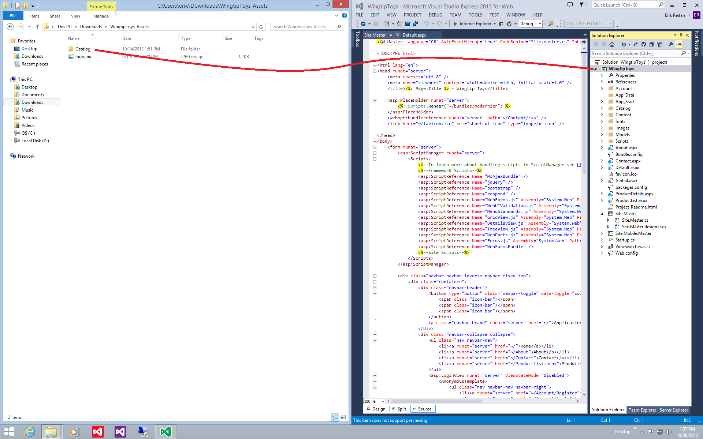
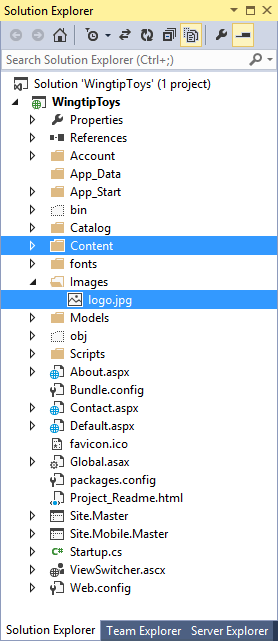
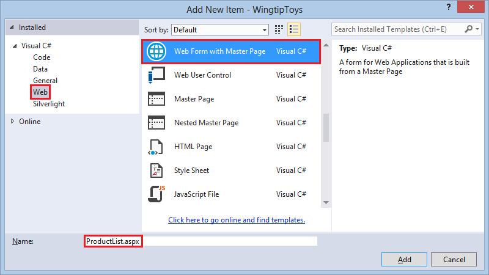
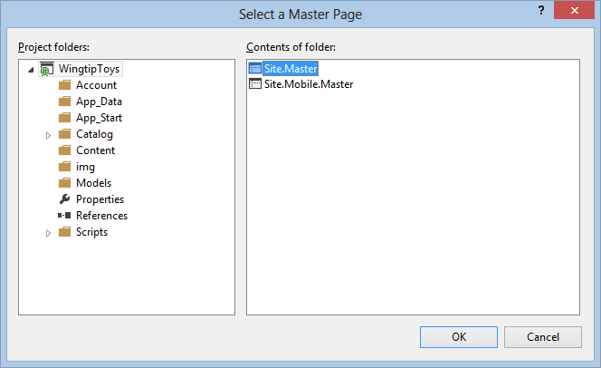
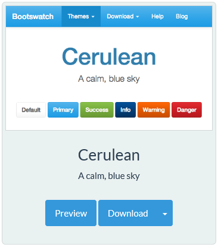
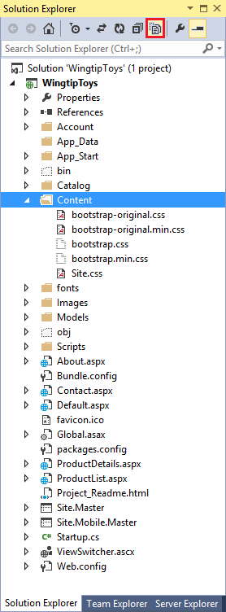
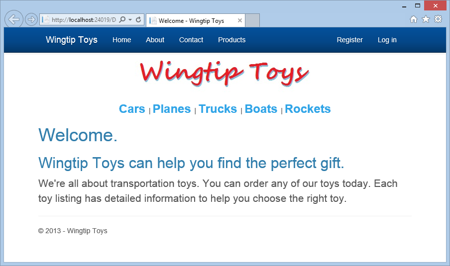
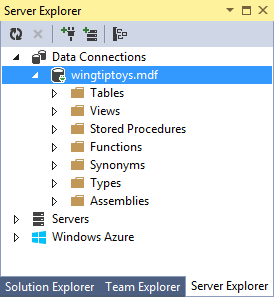
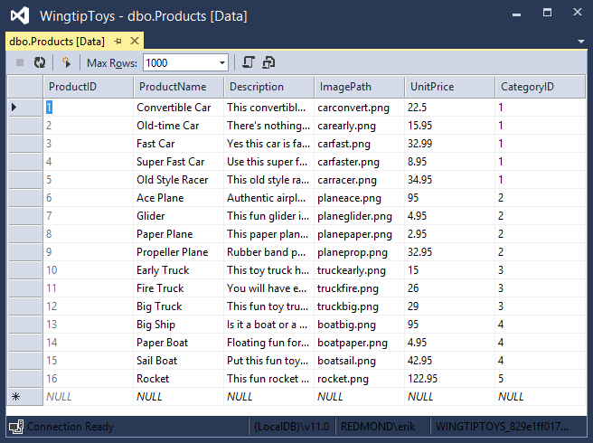
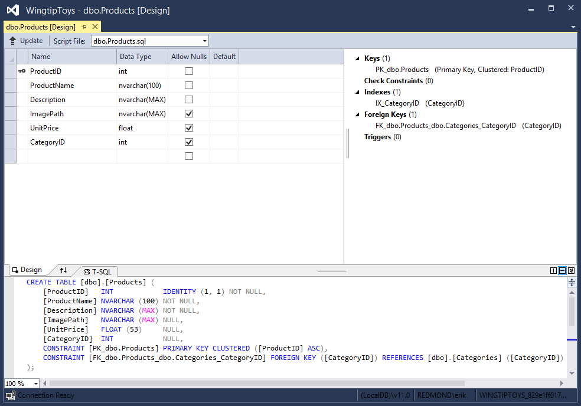

UI and Navigation
====================
by [Erik Reitan](https://github.com/Erikre)

[Download Wingtip Toys Sample Project (C#)](http://go.microsoft.com/fwlink/?LinkID=389434&clcid=0x409) or [Download E-book (PDF)](http://download.microsoft.com/download/0/F/B/0FBFAA46-2BFD-478F-8E56-7BF3C672DF9D/Getting%20Started%20with%20ASP.NET%204.5%20Web%20Forms%20and%20Visual%20Studio%202013.pdf)

> This tutorial series will teach you the basics of building an ASP.NET Web Forms application using ASP.NET 4.5 and Microsoft Visual Studio Express 2013 for Web. A Visual Studio 2013 [project with C# source code](https://go.microsoft.com/fwlink/?LinkID=389434&clcid=0x409) is available to accompany this tutorial series.

In this tutorial, you will modify the UI of the default Web application to support features of the Wingtip Toys store front application. Also, you will add simple and data bound navigation. This tutorial builds on the previous tutorial "Create the Data Access Layer" and is part of the Wingtip Toys tutorial series.

## What you'll learn:

- How to change the UI to support features of the Wingtip Toys store front application.
- How to configure an HTML5 element to include page navigation.
- How to create a data-driven control to navigate to specific product data.
- How to display data from a database created using Entity Framework Code First.

ASP.NET Web Forms allow you to create dynamic content for your Web application. Each ASP.NET Web page is created in a manner similar to a static HTML Web page (a page that does not include server-based processing), but ASP.NET Web page includes extra elements that ASP.NET recognizes and processes to generate HTML when the page runs.

With a static HTML page (*.htm* or *.html* file), the server fulfills a `Web` request by reading the file and sending it as-is to the browser. In contrast, when someone requests an ASP.NET Web page (*.aspx* file), the page runs as a program on the Web server. While the page is running, it can perform any task that your Web site requires, including calculating values, reading or writing database information, or calling other programs. As its output, the page dynamically produces markup (such as elements in HTML) and sends this dynamic output to the browser.

## Modifying the UI

You'll continue this tutorial series by modifying the *Default.aspx* page. You will modify the UI that's already established by the default template used to create the application. The type of modifications you'll do are typical when creating any Web Forms application. You'll do this by changing the title, replacing some content, and removing unneeded default content.

1. Open or switch to the *Default.aspx* page.
2. If the page appears in **Design** view, switch to **Source** view.
3. At the top of the page in the `@Page` directive, change the `Title` attribute to "Welcome", as shown highlighted in yellow below. 

    [!code-aspx[Main](ui_and_navigation/samples/sample1.aspx?highlight=1)]
4. Also on the *Default.aspx* page, replace all of the default content contained in the `<asp:Content>` tag so that the markup appears as below. 

    [!code-aspx[Main](ui_and_navigation/samples/sample2.aspx)]
5. Save the *Default.aspx* page by selecting **Save Default.aspx** from the **File** menu.

 The resulting *Default.aspx* page will appear as follows: 

[!code-aspx[Main](ui_and_navigation/samples/sample3.aspx)]

In the example, you have set the `Title` attribute of the `@Page` directive. When the HTML is displayed in a browser, the server code `<%: Page.Title %>` resolves to the content contained in the `Title` attribute.

The example page includes the basic elements that constitute an ASP.NET Web page. The page contains static text as you might have in an HTML page, along with elements that are specific to ASP.NET. The content contained in the *Default.aspx* page will be integrated with the master page content, which will be explained later in this tutorial.

### @Page Directive

ASP.NET Web Forms usually contain directives that allow you to specify page properties and configuration information for the page. The directives are used by ASP.NET as instructions for how to process the page, but they are not rendered as part of the markup that is sent to the browser.

The most commonly used directive is the `@Page` directive, which allows you to specify many configuration options for the page, including the following:

1. The server programming language for code in the page, such as C#.
2. Whether the page is a page with server code directly in the page, which is called a single-file page, or whether it is a page with code in a separate class file, which is called a code-behind page.
3. Whether the page has an associated master page and should therefore be treated as a content page.
4. Debugging and tracing options.

If you do not include an `@Page` directive in the page, or if the directive does not include a specific setting, a setting will be inherited from the *Web.config* configuration file or from the *Machine.config* configuration file. The *Machine.config* file provides additional configuration settings to all applications running on a machine.

> [!NOTE] 
> 
> The *Machine.config* also provides details about all possible configuration settings.

### Web Server Controls

In most ASP.NET Web Forms applications, you will add controls that allow the user to interact with the page, such as buttons, text boxes, lists, and so on. These Web server controls are similar to HTML buttons and input elements. However, they are processed on the server, allowing you to use server code to set their properties. These controls also raise events that you can handle in server code.

Server controls use a special syntax that ASP.NET recognizes when the page runs. The tag name for ASP.NET server controls starts with an `asp:` prefix. This allows ASP.NET to recognize and process these server controls. The prefix might be different if the control is not part of the .NET Framework. In addition to the `asp:` prefix, ASP.NET server controls also include the `runat="server"` attribute and an `ID` that you can use to reference the control in server code.

When the page runs, ASP.NET identifies the server controls and runs the code that is associated with those controls. Many controls render some HTML or other markup into the page when it is displayed in a browser.

### Server Code

Most ASP.NET Web Forms applications include code that runs on the server when the page is processed. As mentioned above, server code can be used to do a variety of things, such as adding data to a ListView control. ASP.NET supports many languages to run on the server, including C#, Visual Basic, J#, and others.

ASP.NET supports two models for writing server code for a Web page. In the single-file model, the code for the page is in a script element where the opening tag includes the `runat="server"` attribute. Alternatively, you can create the code for the page in a separate class file, which is referred to as the code-behind model. In this case, the ASP.NET Web Forms page generally contains no server code. Instead, the `@Page` directive includes information that links the *.aspx* page with its associated code-behind file.

The `CodeBehind` attribute contained in the `@Page` directive specifies the name of the separate class file, and the `Inherits` attribute specifies the name of the class within the code-behind file that corresponds to the page.

### Updating the Master Page

In ASP.NET Web Forms, master pages allow you to create a consistent layout for the pages in your application. A single master page defines the look and feel and standard behavior that you want for all of the pages (or a group of pages) in your application. You can then create individual content pages that contain the content you want to display, as explained above. When users request the content pages, ASP.NET merges them with the master page to produce output that combines the layout of the master page with the content from the content page.

The new site needs a single logo to display on every page. To add this logo, you can modify the HTML on the master page.

1. In **Solution Explorer**, find and open the **Site.Master** page.
2. If the page is in **Design** view, switch to **Source** view.
3. Update the master page by **modifying or adding** the markup highlighted in yellow: 

    [!code-aspx[Main](ui_and_navigation/samples/sample4.aspx?highlight=9,49,76-81,87)]

This HTML will display the image named *logo.jpg* from the *Images* folder of the Web application, which you'll add later. When a page that uses the master page is displayed in a browser, the logo will be displayed. If a user clicks on the logo, the user will navigate back to the *Default.aspx* page. The HTML anchor tag `<a>` wraps the image server control and allows the image to be included as part of the link. The `href` attribute for the anchor tag specifies the root "`~/`" of the Web site as the link location. By default, the *Default.aspx* page is displayed when the user navigates to the root of the Web site. The **Image** `<asp:Image>` server control includes addition properties, such as `BorderStyle`, that render as HTML when displayed in a browser.

### Master Pages

A master page is an ASP.NET file with the extension .master (for example, *Site.Master*) with a predefined layout that can include static text, HTML elements, and server controls. The master page is identified by a special `@Master` directive that replaces the `@Page` directive that is used for ordinary *.aspx* pages.

In addition to the `@Master` directive, the master page also contains all of the top-level HTML elements for a page, such as `html`, `head`, and `form`. For example, on the master page you added above, you use an HTML `table` for the layout, an `img` element for the company logo, static text, and server controls to handle common membership for your site. You can use any HTML and any ASP.NET elements as part of your master page.

In addition to static text and controls that will appear on all pages, the master page also includes one or more **ContentPlaceHolder** controls. These placeholder controls define regions where replaceable content will appear. In turn, the replaceable content is defined in content pages, such as *Default.aspx*, using the **Content** server control.

#### Adding Image Files

The logo image that is referenced above, along with all the product images, must be added to the Web application so that they can be seen when the project is displayed in a browser.

#### Download from MSDN Samples site:

[Getting Started with ASP.NET 4.5 Web Forms and Visual Studio 2013 - Wingtip Toys](https://go.microsoft.com/fwlink/?LinkID=389434&clcid=0x409) (C#)

The download includes resources in the *WingtipToys-Assets* folder that are used to create the sample application.

1. If you haven't already done so, download the compressed sample files using the above link from the MSDN Samples site.
2. Once downloaded, open the .zip file and copy the contents to a local folder on your machine.
3. Find and open the *WingtipToys-Assets* folder.
4. By dragging and dropping, copy the *Catalog* folder from your local folder to the root of the Web application project in the **Solution Explorer** of Visual Studio. 

    
5. Next, create a new folder named *Images* by right-clicking the **WingtipToys** project in **Solution Explorer** and selecting **Add** -&gt; **New Folder**.
6. Copy the *logo.jpg* file from the *WingtipToys-Assets* folder in **File Explorer** to the *Images* folder of the Web application project in **Solution Explorer** of Visual Studio.
7. Click the **Show All Files** option at the top of **Solution Explorer** to update the list of files if you don't see the new files.  
  
    **Solution Explorer** now shows the updated project files. 

    

### Adding Pages

Before adding navigation to the Web application, you'll first add two new pages that you'll navigate to. Later in this tutorial series, you'll display products and product details on these new pages.

1. In **Solution Explorer**, right-click **WingtipToys**, click **Add**, and then click **New Item**.   
 The **Add New Item** dialog box is displayed.
2. Select the **Visual C#** -&gt; **Web** templates group on the left. Then, select **Web Form with Master Page** from the middle list and name it *ProductList.aspx*. 

    
3. Select **Site.Master** to attach the master page to the newly created *.aspx* page. 

    
4. Add an additional page named *ProductDetails.aspx* by following these same steps.

### Updating Bootstrap

The Visual Studio 2013 project templates use [Bootstrap](http://getbootstrap.com/), a layout and theming framework created by Twitter. Bootstrap uses CSS3 to provide responsive design, which means layouts can dynamically adapt to different browser window sizes. You can also use Bootstrap's theming feature to easily effect a change in the application's look and feel. By default, the ASP.NET Web Application template in Visual Studio 2013 includes Bootstrap as a NuGet package.

In this tutorial, you will change look and feel of the Wingtip Toys application by replacing the Bootstrap CSS files.

1. In **Solution Explorer**, open the *Content* folder.
2. Right-click the *bootstrap.css* file and rename it to *bootstrap-original.css*.
3. Rename the *bootstrap.min.css* to *bootstrap-original.min.css*.
4. In **Solution Explorer**, right-click the *Content* folder and select **Open Folder in File Explorer**.  
 The File Explorer will be displayed. You will save a downloaded bootstrap CSS files to this location.
5. In your browser, go to [http://Bootswatch.com](http://bootswatch.com/).
6. Scroll the browser window until you see the Cerulean theme. 

    
7. Download both the *bootstrap.css* file and the *bootstrap.min.css* file to the *Content* folder. Use the path to the content folder that is displayed in the **File Explorer** window that you previously opened.
8. In **Visual Studio** at the top of **Solution Explorer**, select the **Show All Files** option to display the new files in the Content folder. 

    

 You will see the two new CSS files in the **Content** folder, but notice that the icon next to each file name is grayed out. This means that the file has not yet been added to the project.
9. Right-click the *bootstrap.css* and the *bootstrap.min.css* files and select **Include In Project**.   
 When you run the Wingtip Toys application later in this tutorial, the new UI will be displayed.

> [!NOTE] 
> 
> The ASP.NET Web Application template uses the *Bundle.config* file at the root of the project to store the path of the Bootstrap CSS files.

### Modifying the Default Navigation

The default navigation for every page in the application can be modified by changing the unordered navigation list element that's in the *Site.Master* page.

1. In **Solution Explorer**, locate and open the *Site.Master* page.
2. Add the additional navigation link highlighted in yellow to the unordered list shown below:   

    [!code-html[Main](ui_and_navigation/samples/sample5.html?highlight=5)]

As you can see in the above HTML, you modified each line item `<li>` containing an anchor tag `<a>` with a link `href` attribute. Each `href` points to a page in the Web application. In the browser, when a user clicks on one of these links (such as **Products**), they will navigate to the page contained in the `href` (such as **ProductList.aspx**). You will run the application at the end of this tutorial.

> [!NOTE] 
> 
> The tilde (`~`) character is used to specify that the `href` path begins at the root of the project.

### Adding a Data Control to Display Navigation Data

Next, you'll add a control to display all of the categories from the database. Each category will act as a link to the *ProductList.aspx* page. When a user clicks on a category link in the browser, they will navigate to the products page and see only the products associated with the selected category.

You'll use a **ListView** control to display all the categories contained in the database. To add a **ListView** control to the master page:

1. In the *Site.Master* page, add the following highlighted `
` element **after** the `
` element containing the `id="TitleContent"` that you added earlier:  

    [!code-aspx[Main](ui_and_navigation/samples/sample6.aspx?highlight=7-21)]

This code will display all the categories from the database. The **ListView** control displays each category name as link text and includes a link to the *ProductList.aspx* page with a query-string value containing the `ID` of the category. By setting the `ItemType` property in the **ListView** control, the data-binding expression `Item` is available within the `ItemTemplate` node and the control becomes strongly typed. You can select details of the `Item` object using IntelliSense, such as specifying the `CategoryName`. This code is contained inside the container `<%#: %>` that marks a data-binding expression. By adding the (:) to the end of the `<%#` prefix, the result of the data-binding expression is HTML-encoded. When the result is HTML-encoded, your application is better protected against cross-site script injection (XSS) and HTML injection attacks.

> [!NOTE] 
> 
> **Tip**
> 
> When you add code by typing during development, you can be certain that a valid member of an object is found because strongly typed data controls show the available members based on IntelliSense. IntelliSense offers context-appropriate code choices as you type code, such as properties, methods, and objects.

In the next step, you will implement the `GetCategories` method to retrieve data.

### Linking the Data Control to the Database

Before you can display data in the data control, you need to link the data control to the database. To make the link, you can modify the code behind of the *Site.Master.cs* file.

1. In **Solution Explorer**, right-click the *Site.Master* page and then click **View Code**. The *Site.Master.cs* file is opened in the editor.
2. Near the beginning of the *Site.Master.cs* file, add two additional namespaces so that all the included namespaces appear as follows:  

    [!code-csharp[Main](ui_and_navigation/samples/sample7.cs?highlight=8-9)]
3. Add the highlighted `GetCategories` method after the `Page_Load` event handler as follows:  

    [!code-csharp[Main](ui_and_navigation/samples/sample8.cs?highlight=6-11)]

The above code is executed when any page that uses the master page is loaded in the browser. The `ListView` control (named "categoryList") that you added earlier in this tutorial uses model binding to select data. In the markup of the `ListView` control you set the control's `SelectMethod` property to the `GetCategories` method, shown above. The `ListView` control calls the `GetCategories` method at the appropriate time in the page life cycle and automatically binds the returned data. You will learn more about binding data in the next tutorial.

### Running the Application and Creating the Database

Earlier in this tutorial series you created an initializer class (named "ProductDatabaseInitializer") and specified this class in the *global.asax.cs* file. The Entity Framework will generate the database when the application is run the first time because the `Application_Start` method contained in the *global.asax.cs* file will call the initializer class. The initializer class will use the model classes (`Category` and `Product`) that you added earlier in this tutorial series to create the database.

1. In **Solution Explorer**, right-click the *Default.aspx* page and select **Set As Start Page**.
2. In Visual Studio press **F5**.   
 It will take a little time to set everything up during this first run.   
      
 When you run the application, the application will be compiled and the database named *wingtiptoys.mdf* will be created in the *App\_Data* folder. In the browser, you will see a category navigation menu. This menu was generated by retrieving the categories from the database. In the next tutorial, you will implement the navigation.
3. Close the browser to stop the running application.

### Reviewing the Database

Open the *Web.config* file and look at the connection string section. You can see that the `AttachDbFilename` value in the connection string points to the `DataDirectory` for the Web application project. The value `|DataDirectory|` is a reserved value that represents the *App\_Data* folder in the project. This folder is where the database that was created from your entity classes is located.

[!code-xml[Main](ui_and_navigation/samples/sample9.xml)]

> [!NOTE] 
> 
> If the *App\_Data* folder is not visible or if the folder is empty, select the **Refresh** icon and then the **Show All Files** icon at the top of the **Solution Explorer** window. Expanding the width of the **Solution Explorer** windows may be required to show all available icons.

Now you can inspect the data contained in the *wingtiptoys.mdf* database file by using the **Server Explorer** window.

1. Expand the *App\_Data* folder. If the *App\_Data* folder is not visible, see the note above.
2. If the *wingtiptoys.mdf* database file is not visible, select the **Refresh** icon and then the **Show All Files** icon at the top of the **Solution Explorer** window.
3. Right-click the *wingtiptoys.mdf* database file and select **Open**.  
    **Server Explorer** is displayed. 

    
4. Expand the *Tables* folder.
5. Right-click the **Products**table and select **Show Table Data**.  
 The **Products** table is displayed. 

    
6. This view lets you see and modify the data in the **Products** table by hand.
7. Close the **Products** table window.
8. In the **Server Explorer**, right-click the **Products** table again and select **Open Table Definition**.  
 The data design for the **Products** table is displayed. 

    
9. In the **T-SQL** tab you will see the SQL DDL statement that was used to create the table. You can also use the UI in the **Design** tab to modify the schema.
10. In the **Server Explorer**, right-click **WingtipToys** database and select **Close Connection**.   
 By detaching the database from Visual Studio, the database schema will be able to be modified later in this tutorial series.
11. Return to **Solution Explorer**by selecting the **Solution Explorer** tab at the bottom of the **Server Explorer** window.

## Summary

In this tutorial of the series you have added some basic UI, graphics, pages, and navigation. Additionally, you ran the Web application, which created the database from the data classes that you added in the previous tutorial. You also viewed the contents of the *Products* table of the database by viewing the database directly. In the next tutorial, you'll display data items and details from the database.

## Additional Resources

[Introduction to Programming ASP.NET Web Pages](https://msdn.microsoft.com/en-us/library/ms178125.aspx)   
[ASP.NET Web Server Controls Overview](https://msdn.microsoft.com/en-us/library/zsyt68f1.aspx)   
[CSS Tutorial](http://www.w3schools.com/css/default.asp)

>[!div class="step-by-step"]
[Previous](create_the_data_access_layer.md)
[Next](display_data_items_and_details.md)