Using Page Inspector in Visual Studio 2012
====================
by [Web Camps Team](https://twitter.com/webcamps)

> In this Hands-on Lab, you will discover a new tool to find and fix web page issues in Visual Studio - the Page Inspector.
> 
> Page Inspector is a new tool that brings browser diagnostics tools to Visual Studio and provides an integrated experience among the browser, ASP.NET, and source code. It renders a web page (HTML, Web Forms, ASP.NET MVC, or Web Pages) directly within the Visual Studio IDE and lets you examine both the source code and the resulting output. Page Inspector enables you to easily decompose a website, rapidly build pages from the ground up, and quickly diagnose issues.
> 
> Nowadays we have a number of Web frameworks that create flexible and scalable websites in a timely manner, such as ASP.NET MVC and WebForms. On the other hand, it gets harder to find issues on the pages because the IDE does not support the designer view in template-based pages and dynamic content. Therefore, these websites have to be opened in a browser to see how they appear to a user.
> 
> Web developers use external tools to find issues that regularly run in the browser. Then, they return to the IDE and start fixing. This back and forth activity among the IDE, the browser and the profiling tools can be inefficient, and sometimes requires a fresh deployment and cache cleaning each time you want to reproduce an issue.
> 
> Page Inspector bridges a gap in Web development between the client (browser tools) and the server (ASP.NET and source code) by bringing together the best of both worlds using a combined set of features.
> 
> Using Page Inspector, you can see which elements in the source files (including server-side code) have produced the HTML markup to be rendered in the browser. Page Inspector also lets you modify CSS properties and DOM element attributes to see the changes reflected immediately in the browser.
> 
> This hands-on lab will walk you through the Page Inspector features and show you how you can use them to fix issues in Web applications. **This lab contains two exercises using similar flows but targeting different technologies. If you are an ASP.NET MVC Developer, follow exercise one; if you are a WebForms developer follow exercise two**.
> 
> This lab walks you through the enhancements and new features previously described by applying minor changes to a sample Web application provided in the Source folder.
> 
> All sample code and snippets are included in the Web Camps Training Kit, available at [https://go.microsoft.com/fwlink/?LinkID=248297&clcid=0x409](https://go.microsoft.com/fwlink/?LinkID=248297&clcid=0x409).

### Objectives

In this hands-on lab, you will learn how to:

- Decompose a Web Site using Page Inspector
- Inspect and preview CSS styles changes with Page Inspector
- Detect and fix issues in your web pages using Page Inspector

### Prerequisites

You must have the following items to complete this lab:

- [Microsoft Visual Studio Express 2012 for Web](https://www.microsoft.com/visualstudio/eng/products/visual-studio-express-for-web) or superior (read [Appendix A](#AppendixA) for instructions on how to install it).
- Internet Explorer 9 or higher

* * *

## Exercises

This hands-on lab includes the following exercises:

1. [Exercise 1: Using Page Inspector in ASP.NET MVC Projects](#Exercise1)
2. [Exercise 2: Using Page Inspector in WebForms Projects](#Exercise2)

> [!NOTE]
> Each exercise is accompanied by a starting solution, located in the Begin folder of the exercise, that allows you to follow each exercise independently of the others. Inside the source code for an exercise, you will also find an End folder containing a Visual Studio solution with the code that results from completing the steps in the corresponding exercise. You can use these solutions as guidance if you need additional help as you work through this hands-on lab.

Estimated time to complete this lab: **30 minutes**.

### Exercise 1: Using Page Inspector in ASP.NET MVC Projects

In this exercise, you will learn how to preview and debug an **ASP.NET MVC 4** solution using **Page Inspector**. First, you will perform a brief lap around the tool to learn the features that facilitate the Web debugging process. Then, you will work in a web page that contains styling issues. You will learn how to use Page Inspector to find the source code that generates the issue and fix it.

#### Task 1 - Exploring Page Inspector

In this task, you will learn how to use the Page Inspector in the context of an ASP.NET MVC 4 project that shows a photo gallery.

1. Open the **Begin** solution located at **Source/Ex1-MVC4/Begin/** folder.

    1. You will need to download some missing NuGet packages before continue. To do this, click the **Project** menu and select **Manage NuGet Packages**.
    2. In the **Manage NuGet Packages** dialog, click **Restore** in order to download missing packages.
    3. Finally, build the solution by clicking **Build** | **Build Solution**.

    > [!NOTE]
    > One of the advantages of using NuGet is that you don't have to ship all the libraries in your project, reducing the project size. With NuGet Power Tools, by specifying the package versions in the Packages.config file, you will be able to download all the required libraries the first time you run the project. This is why you will have to run these steps after you open an existing solution from this lab.
2. In the Solution Explorer, locate **Index.cshtml** view under the **/Views/Home** project folder, right-click it and select **View in Page Inspector**.

    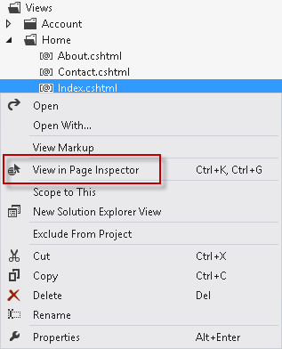

    *Selecting a file to preview in Page Inspector*
3. The Page Inspector window will show the */Home/Index* URL mapped to the source View you selected.

    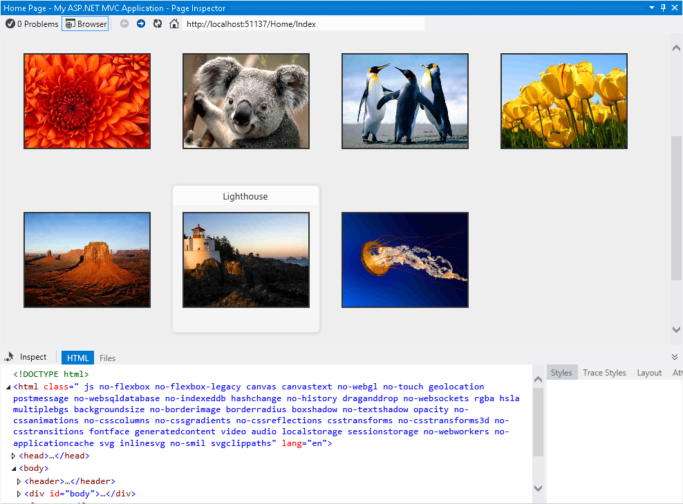

    *The first contact with Page Inspector*

    The Page Inspector tool is integrated in your Visual Studio environment. The inspector contains an embedded browser, together with a powerful HTML profiler. Notice that you do not have to run the solution to see how your pages look.

    > [!NOTE]
    > When the width of Page Inspector browser is less than the width of the opened page, you will not see the page properly. If that happens, adjust the width of the Page Inspector.
4. Click the **Files** tab in Page Inspector.

    You will see all the source files that are composing the Index page. This feature helps to identify all the elements at a glance, especially when you are working with partial views and templates. Notice that you can also open each of the files if you click the links.

    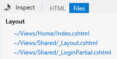

    *The Files tab*
5. Click the **Toggle Inspection Mode** button, located at the left of the tabs.

    This tool will let you select any element of the page and see its HTML and Razor code.

    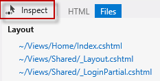

    *Toggle Inspection Mode button*
6. In the Page Inspector browser, move the mouse pointer over the page elements. While you move the mouse pointer over any part of the rendered page, the element type is displayed and the corresponding source markup or code is highlighted in the Visual Studio editor.

    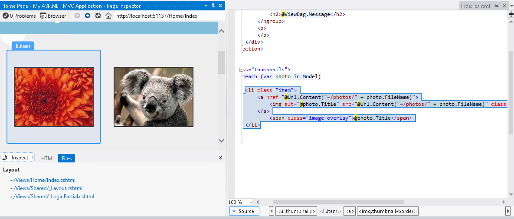

    *Inspection mode in action*

    > [!NOTE]
    > Do not maximize the Page Inspector window or you will not be able to see the preview tab showing the source code. If you click the element in Page Inspector when it is maximized, the source code of the selection will appear but it will hide the Page Inspector window.

    If you pay attention to the **Index.cshtml** file, you will notice that the portion of source code that generates the selected element is highlighted. This feature facilitates the editing of long source files, providing a direct and fast way to access the code.

    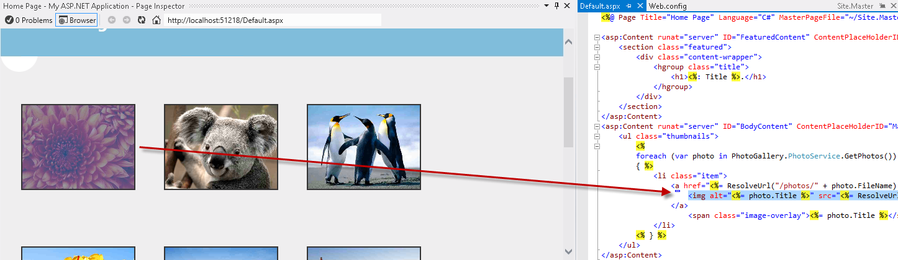

    *Inspecting elements*
7. Click the **Toggle Inspection Mode** button ( ) to disable the cursor.
8. Select the **HTML** tab to display the HTML code rendered in the Page Inspector browser.
9. In the HTML markup, locate the list item with the Koala link and select it.

    Notice that when you select the code, the corresponding output is automatically highlighted in the browser. This feature is useful to see how an HTML block is rendered on the page.

    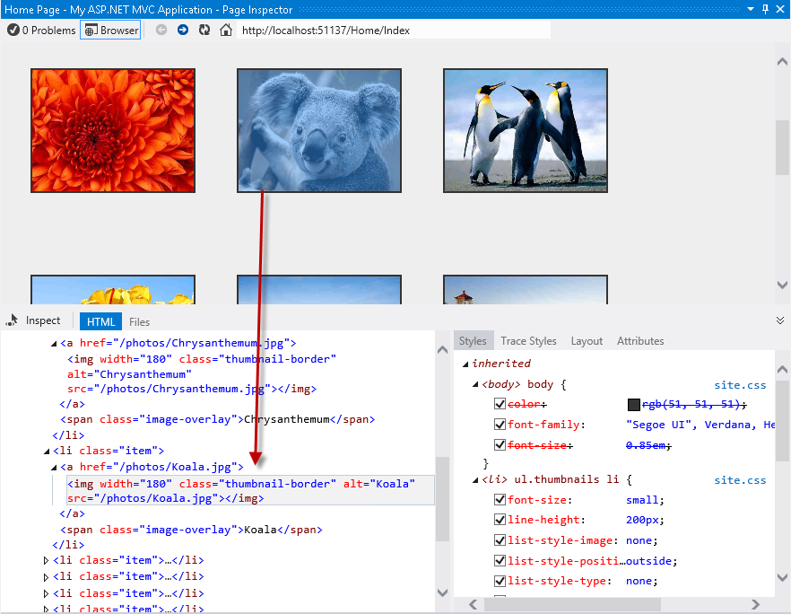

    *Selecting HTML element in the page*
10. Click the **Toggle Inspection Mode** button to enable *Inspection Mode* and click the navigation bar. On the right of the HTML code, in the Styles pane, you will see a list with the CSS styles applied to the selected element.

    > [!NOTE]
    > Since the header is a part of the site layout, Page Inspector will also open \_Layout.cshtml file and highlight the segment of code affected.

    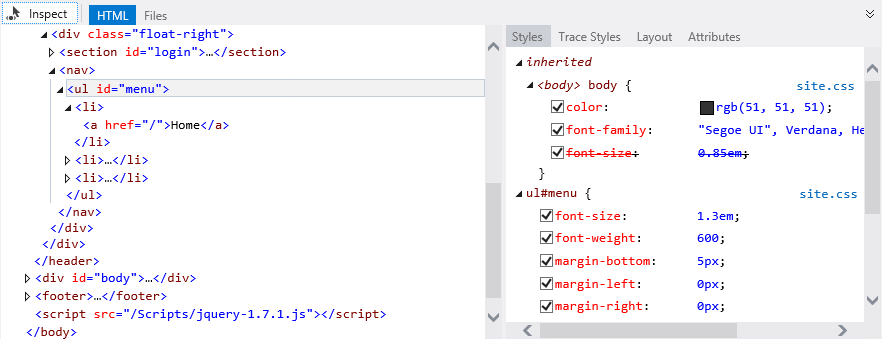

    *Discovering styles and source files of a selected element*
11. With the toggle inspection pointer enabled, move the mouse pointer below the blue featured bar and click the half circle.

    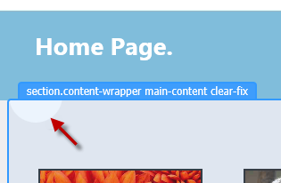

    *Selecting an element*
12. In the Styles pane, locate the **background-image** item under the **.main-content** group. **Uncheck** the **background-image** and see what happens. You will notice that the browser will reflect the changes immediately and the circle is hidden.

    > [!NOTE]
    > The changes you apply on the Page Inspector Styles tab do not affect the original stylesheet. You can uncheck styles or change their values as many times as you want, but they will be restored after refreshing the page.

    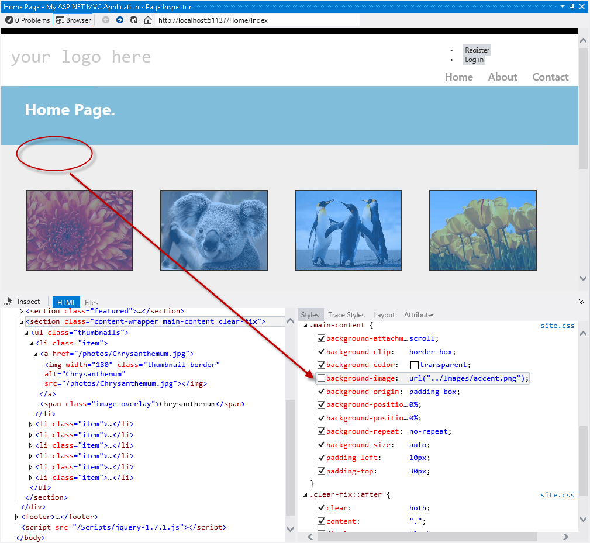

    *Enabling and disabling CSS styles*
13. Now, click the '**your logo here**' text on the header using the inspection mode.
14. In the **Styles** tab, locate the **font-size** CSS attribute under the **.site-title** group. Double-click the attribute value and replace the 2.3 em value with **3 em**, and then press **ENTER**. Notice that the title looks bigger.

    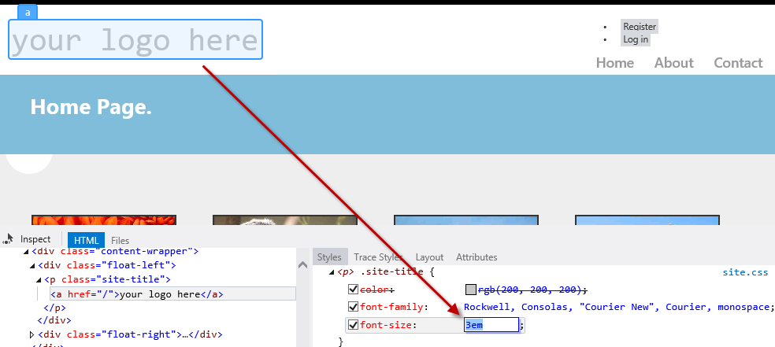

    *Changing CSS values in the Page Inspector*
15. Click the **Trace Styles** tab, located in the right pane of Page Inspector. This is an alternative way to see all the styles applied to the selection, ordered by attribute name.

    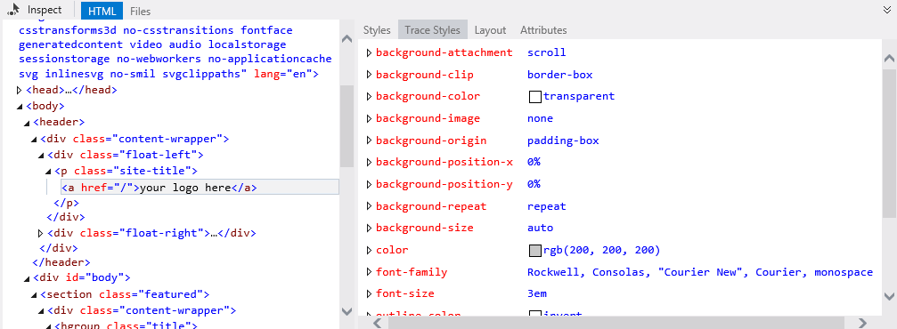

    *CSS styles tracing of the selected element*
16. Another feature of Page Inspector is the Layout pane. Using the inspection mode, select the navigation bar and then click the **Layout** tab on the right pane. You will see the exact size of the selected element, as well as its offset, margin, padding and border size. Notice that you can also modify the values from this view.

    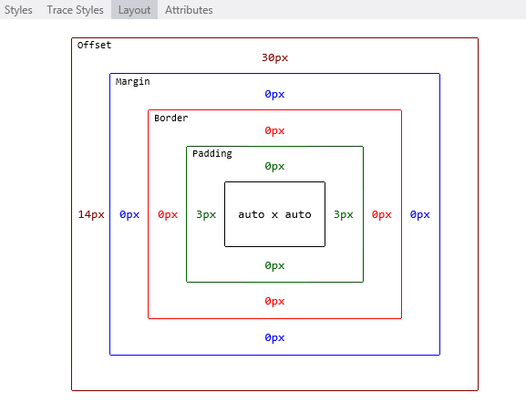

    *Element layout in Page Inspector*

#### Task 2 - Finding and Fixing Style Issues in the Photo Gallery

How would you diagnose Web pages issues with previous versions of Visual Studio? You are likely familiar with web debugging tools that run outside the Visual Studio IDE, like Internet Explorer Developer Tools or Firebug. Browsers only understand HTML, scripting and styles, while an underlying framework generates the HTML that will be rendered. For that reason, you often need to deploy the whole site to see how web pages look like.

You had probably followed these steps when you wanted to detect and fix an issue in your web site:

1. Run the Solution from Visual Studio, or deploy the page on the web server.
2. In the browser, open the developer tools you use, or simply open the source code and the styles and try to match the issue. To find the files involved, you would have used the &quot;Search&quot; or &quot;Search in files&quot; features with the name of the style classes.
3. Once the error is detected, stop the Web browser and the server.
4. Clear the browser cache.
5. Return to Visual Studio to apply a fix. Repeat all the steps to test.

As there is no real WYSIWYG in ASP.NET MVC 4, most of the style issues are detected on a later stage, after running or deploying the web application. Now, with Page Inspector, it is possible to preview any page without running the solution.

In this task, you will use the Page inspector and fix some issues the Photo Gallery application.

1. Using Page Inspector, locate the **Register** and the **Log in** links at the left side of the header.

    Notice that the links are not displayed at the expected place on the right, and they are shown like a bulleted list. You will now align the links to the right and restyle them accordingly.

    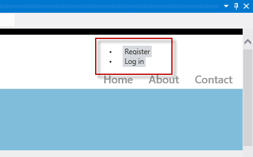

    *Locating the Register and Log in links*
2. With Toggle Inspection Mode selected, click close to, but not on, the Register link to open its code.

    Notice that the source code of the links is located in the **\_LoginPartial.cshtml** file, not the Index.cshtml nor the \_Layout.cshtml, which are the places you might look in first place. You have been placed directly in the correct source file.
3. In the **Styles** tab, locate and click the **<section> #login</section>** item, which is the HTML container for these links.

    Notice that the **#login** style is automatically located in **Site.css** after you click. Moreover, the code is now highlighted.

    

    *Selecting the CSS styles*
4. Uncomment the **text-align** attribute in the highlighted code by removing the opening and closing characters and save the **Site.css** file.

    Page Inspector is aware of all the different files that compose the current page, and it can detect when any of these files change. It alerts you whenever the current page in browser is not in sync with the source files.
5. In the Page Inspector browser, click the bar located below the address bar to reload the page.

    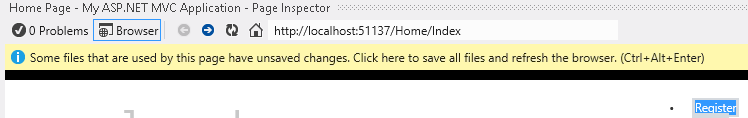

    *Reloading the page*

    The links are now at the right, but they still look like a bulleted list. Now, you will remove the bullets and align the links horizontally.

    

    *Updated page*
6. Using the inspection mode, select any of the **&lt;li&gt;** items that contain the &quot;Register&quot; and &quot;Log in&quot; links. Then, click the **&lt;section&gt; #login** item to access **Styles.css** code.

    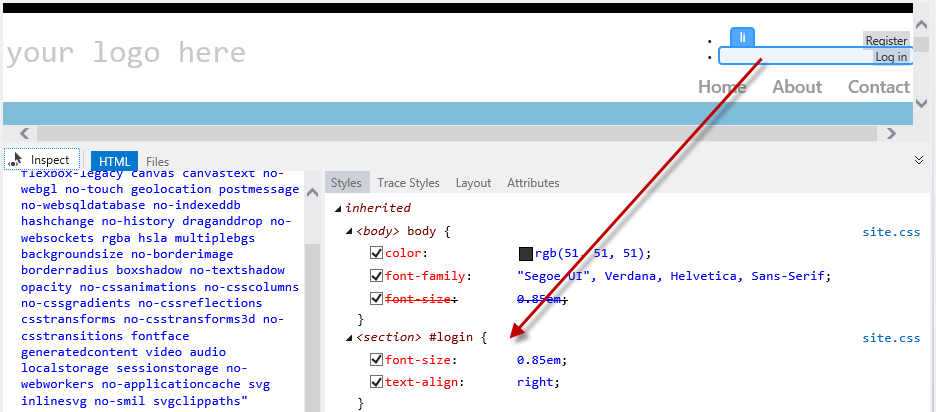

    *Finding the style*
7. In **Style.css**, uncomment the code for **#login li** items. The style you are adding will hide the bullet and display the items horizontally.

    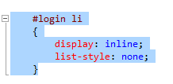

    *Restyling the login links*
8. Save **Style.css** file and click once on the bar located below the address to reload the page. Notice that the links appear correctly.

    

    *Links aligned to the right side*
9. Finally, you will change the header title. Use the inspection mode to click **your logo here** text and get to the source code that generates it.
10. Now you are in **\_Layout.cshtml**, replace '**your logo here**' text with '**Photo Gallery**'. Save and update the Page Inspector browser.

    

    *Assigning a new title*

    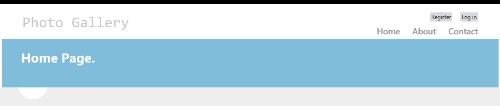

    *Photo Gallery page updated*
11. Finally, selet the **PhotoGallery** project and press **F5** to run the app. Check out all the changes work as expected.

* * *

### Exercise 2: Using Page Inspector in WebForms Projects

In this exercise, you will learn how to preview and debug a WebForms solution using Page Inspector. You will first perform a brief lap around the tool to learn the Page Inspector features that facilitate the Web debugging process. Then, you will work in a web page that contains styling issues. You will learn how to use Page Inspector to find the source code that generates the issue and fix it.

#### Task 1 - Exploring Page Inspector

In this task, you will learn how to use the Page Inspector features in the context of a WebForms project that shows a photo gallery.

1. Open the **Begin** solution located at **Source/Ex2-WebForms/Begin/** folder.

    1. You will need to download some missing NuGet packages before continue. To do this, click the **Project** menu and select **Manage NuGet Packages**.
    2. In the **Manage NuGet Packages** dialog, click **Restore** in order to download missing packages.
    3. Finally, build the solution by clicking **Build** | **Build Solution**.

    > [!NOTE]
    > One of the advantages of using NuGet is that you don't have to ship all the libraries in your project, reducing the project size. With NuGet Power Tools, by specifying the package versions in the Packages.config file, you will be able to download all the required libraries the first time you run the project. This is why you will have to run these steps after you open an existing solution from this lab.
2. In the Solution Explorer, locate **Default.aspx** page, right-click it and select **View in Page Inspector**.

    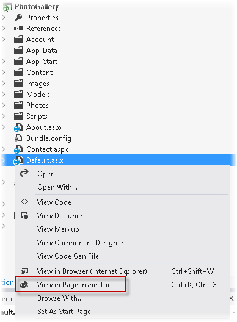

    *Opening Default.aspx with Page Inspector*
3. The Page Inspector window will show Default.aspx.

    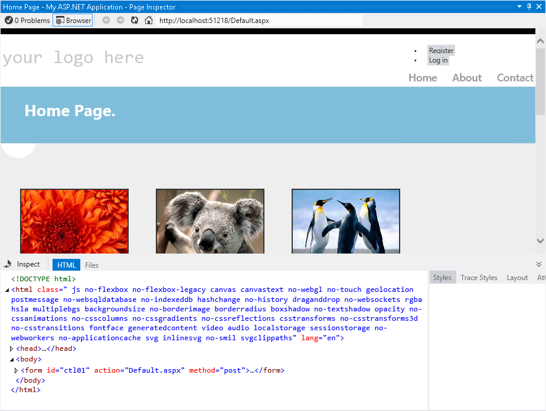

    *Viewing Default.aspx in Page Inspector*

    The Page Inspector tool is integrated in your Visual Studio environment. The inspector contains an embedded browser, together with a powerful HTML profiler that will show the selected code. Notice that you do not have to run the solution to see how your pages look.

    > [!NOTE]
    > When the width of Page Inspector browser is less than the width of the opened page, you will not see the page properly. If that happens, adjust the width of the Page Inspector.
4. Click the **Files** tab in Page Inspector.

    You will see all the source files that are composing the rendered Default page. This is a useful feature to identify all the elements at a glance, especially when you are working with User Controls and Master Pages. Notice that you can also navigate to each of the files.

    

    *The Files tab*
5. Click the **Toggle Inspection Mode** button, located at the left of the tabs.

    This tool will let you select any element of the page and see its HTML code and .aspx source.

    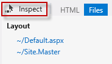

    *Toggle Inspection Mode button*
6. In the Page Inspector browser, move the mouse over the page elements. While you move the mouse pointer over any part of the rendered page, the element type is displayed and the corresponding source markup or code is highlighted in the Visual Studio editor.

    

    *Inspection mode in action*

    > [!NOTE]
    > Do not maximize the Page Inspector window or you will not be able to see the preview tab showing the source code. If you click the element in Page Inspector when it is maximized, the source code of the selection will appear but it will hide the Page Inspector window.

    If you pay attention to **Default.aspx** file, you will notice that the portion of source code that generates the selected element is highlighted. This feature facilitates the edition of long source files, providing a direct and fast way to access the code.

    

    *Inspecting elements*
7. Click the **Toggle Inspection Mode** button ( ), located in Page Inspector tabs, to disable the cursor.
8. Select the **HTML** tab to display the HTML code rendered in the Page Inspector browser.
9. In the HTML code, locate the list item with the Koala link and select it.

    Notice that when you select the code, the corresponding output is automatically highlighted browser. This feature is useful to see how an HTML block is rendered on the page.

    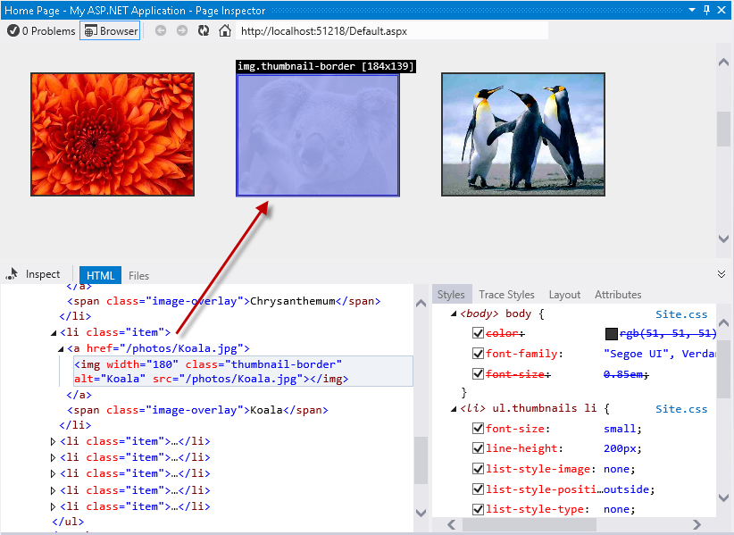

    *Selecting an HTML element in the page*
10. Click the **Toggle Inspection Mode** button to enable *Inspection Mode* and click the navigation bar. On the right of the HTML code, in the Styles pane, you will see a list with the CSS styles applied to the selected element.

    > [!NOTE]
    > since the header is a part of the site layout, Page Inspector will also open Site.Master file and highlight the segment of code affected.

    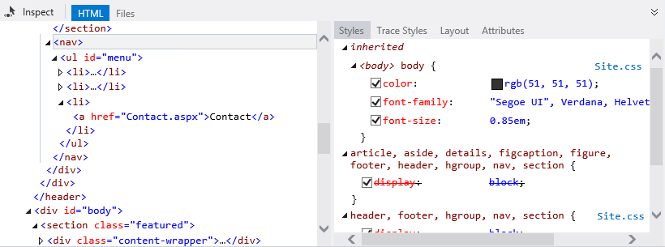

    *Discovering styles and source files of a selected element*
11. With the toggle inspection pointer enabled, move the mouse pointer below the menu bar and click the blank half circle.

    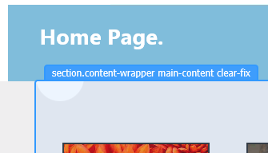

    *Selecting an element*
12. In the Styles pane, locate the **background-image** item under the **.main-content** group. **Uncheck** the **background-image** and see what happens. You will notice that the browser will reflect the changes immediately and the circle is hidden.

    > [!NOTE]
    > The changes you apply on the Page Inspector Styles tab do not affect the original stylesheet. You can uncheck styles or change their values as many times as you want, but they will be restored after refreshing the page.

    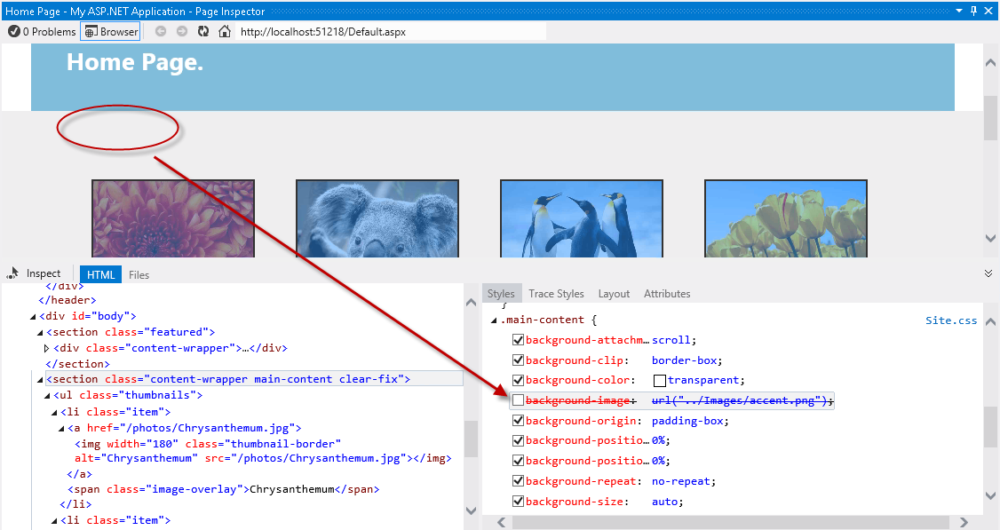

    *Enabling and disabling CSS styles*
13. Now, click the '**your** **logo here'** text on the header using the inspection mode.
14. In the **Styles** tab, locate the **font-size** CSS attribute under the **.site-title** group. Double-click the attribute once to edit its value. Replace the 2.3em value with **3em**, and then press ENTER. Notice that the title looks bigger.

    

    *Changing CSS values in the Page Inspector*
15. Click the **Trace Styles** tab, located in the right pane of Page Inspector. This is an alternative way to see all the styles applied to the selection, ordered by attribute name.

    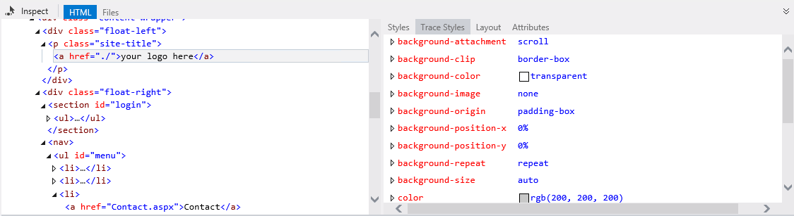

    *CSS styles tracing of the selected element*
16. Another feature of Page Inspector is the Layout pane. Using the inspection mode, select the navigation bar and then click the **Layout** tab on the right pane. You will see the exact size of the selected element, as well as its offset, margin, padding and border size. Notice that you can also modify the values from this view.

    

    *Element layout in Page Inspector*

#### Task 2 - Finding and Fixing Style Issues in the Photo Gallery

How would you diagnose Web pages issues with previous versions of Visual Studio? You are likely familiar with web debugging tools that run outside the Visual Studio IDE, like Internet Explorer Developer Tools or Firebug. Browsers only understand HTML, scripting and styles, while an underlying framework generates the HTML that will be rendered. For that reason, you often need to deploy the whole site to see how web pages look like.

You had probably followed these steps when you wanted to detect and fix an issue in your web site:

1. Run the Solution from Visual Studio, or deploy the page on the web server.
2. In the browser, open the developer tools you use, or simply open the source code and the styles and try to match the issue. To find the files involved, you'd have used the &quot;Search&quot; or &quot;Search in files&quot; features with the name of the style classes.
3. Once the error is detected, stop the Web browser and the server.
4. Clear the browser cache.
5. Return to Visual Studio to apply a fix. Repeat all the steps to test.

As there is no real WYSIWYG in ASP.NET WebForms, some style issues are detected on a later stage, after running or deploying. Now, with Page Inspector, it is possible to preview any page without running the solution.

In this task, you will use the Page inspector for fixing some issues of the Photo Gallery application. In the following steps, you will detect and quickly fix some simple styling issue in the header.

1. Using Page Inspection, locate the **Register** and the **Log In** links at the left side of the header.

    Notice that the link is not displayed at the expected place on the right. You will now align the link to the right and restyle it accordingly.

    

    *Log In link positioned on the left*
2. With Toggle Inspection Mode selected, select the Log In link to open its code.

    Notice that the link source code is located in the **Site.Master** file, not in the Default.aspx page which is the place you might look in first place; you have been placed directly in the correct source file.
3. In the **Styles** tab, locate and click the **&lt;section&gt; #login** item, which is the HTML container for these links.

    Notice that the **#login** style is automatically located in **Site.css** after you click. Moreover, the code is now highlighted.

    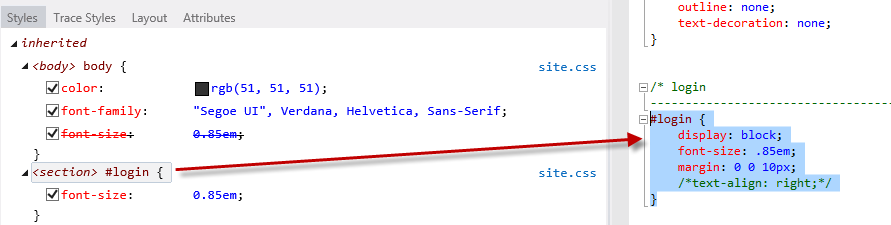

    *Selecting the CSS styles*
4. Uncomment the **text-align** attribute in the highlighted code by removing the opening and closing characters and save the **Site.css** file.

    Page Inspector is aware of all the different files that compose the current page, and it can detect when any of these files change. It alerts you whenever the current page in browser is not in sync with the source files.
5. In the Page Inspector browser, click the bar located below the address bar to save the changes and reload the page.

    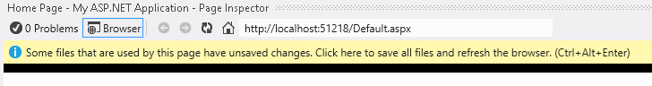

    *Reloading the page*

    The links are now at the right, but they still look like a bulleted list. Now, you will remove the bullets and align the links horizontally.

    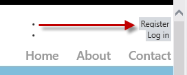

    *Updated page*
6. Using the inspection mode, select any of the **&lt;li&gt;** items that contain the &quot;Register&quot; and &quot;Log in&quot; links. Then, click the **&lt;section&gt; #login** item to access **Styles.css** code.

    

    *Finding the style*
7. In **Style.css**, uncomment the code for **#login li** items. The style you are adding will hide the bullet and display the items horizontally.

    

    *Restyling the login links*
8. Save **Style.css** file and click once on the bar located below the address to reload the page. Notice that the links appear correctly.

    

    *Links aligned to the right side*
9. Finally, you will change the header title. Instead of searching for the '**your logo here'** text in all the files, use the inspection mode to click the text and get to source code that generates it.

    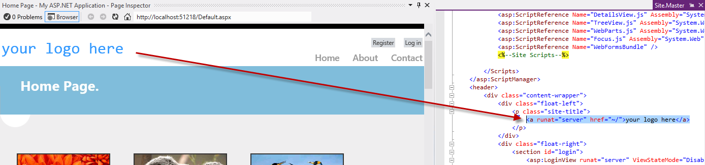

    *Finding the site title*
10. Now you are in **Site.Master**, replace the '**your logo here**' text with '**Photo Gallery**'. Save and update the Page Inspector browser.

    

    *Photo Gallery page updated*
11. Finally press **F5** to run the app the check out all the changes work as expected.

* * *

## Summary

By completing this Hands-On Lab, you have learnt how to use Page Inspector to preview your Web application without having to rebuild and run the Web site in a browser. In addition, you have learnt how to quickly find and fix bugs by accessing directly from the rendered output to the source code.

## Appendix A: Installing Visual Studio Express 2012 for Web

You can install **Microsoft Visual Studio Express 2012 for Web** or another &quot;Express&quot; version using the **[Microsoft Web Platform Installer](https://www.microsoft.com/web/downloads/platform.aspx)**. The following instructions guide you through the steps required to install *Visual studio Express 2012 for Web* using *Microsoft Web Platform Installer*.

1. Go to [[https://go.microsoft.com/?linkid=9810169](https://go.microsoft.com/?linkid=9810169)](https://go.microsoft.com/?linkid=9810169). Alternatively, if you already have installed Web Platform Installer, you can open it and search for the product &quot;*Visual Studio Express 2012 for Web with Windows Azure SDK*&quot;.
2. Click on **Install Now**. If you do not have **Web Platform Installer** you will be redirected to download and install it first.
3. Once **Web Platform Installer** is open, click **Install** to start the setup.

    

    *Install Visual Studio Express*
4. Read all the products' licenses and terms and click **I Accept** to continue.

    

    *Accepting the license terms*
5. Wait until the downloading and installation process completes.

    

    *Installation progress*
6. When the installation completes, click **Finish**.

    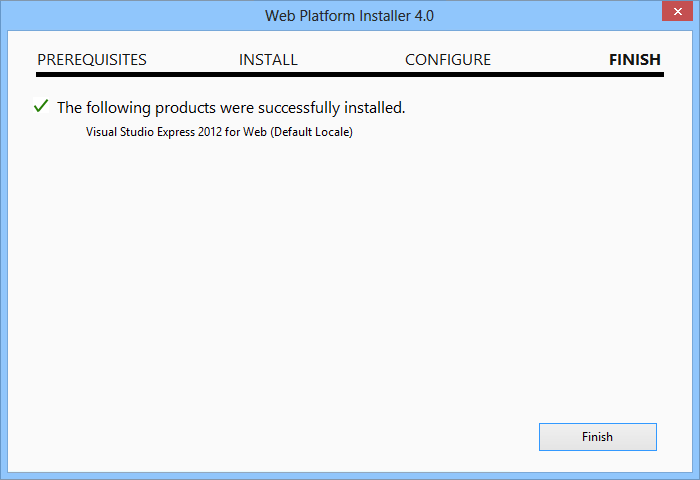

    *Installation completed*
7. Click **Exit** to close Web Platform Installer.
8. To open Visual Studio Express for Web, go to the **Start** screen and start writing &quot;**VS Express**&quot;, then click on the **VS Express for Web** tile.

    

    *VS Express for Web tile*