What's New in ASP.NET and Web Development in Visual Studio 2012
====================
by [Web Camps Team](https://twitter.com/webcamps)

> The new version of Visual Studio introduces a number of enhancements focused on improving the experience and performance when working with Web technologies. Visual Studio Editors for CSS, JavaScript and HTML have been completely revamped to include many of the most in-demand code aids, such as IntelliSense and automatic indentation. Regarding performance, bundling and minification are now integrated as built-in features to easily reduce page load time.
> 
> Visual Studio enables you to work with the latest website technologies. You can use cross-browser CSS3 Snippets to make sure your site works regardless of the client platform while also taking advantage of the new HTML5 elements and features.
> 
> Writing and profiling JavaScript code should be easier with this Visual Studio version. IntelliSense lists, integrated XML documentation and navigation features are now available for JavaScript code. You now have the JavaScript catalog at your fingertips. Additionally, you can check ECMAScript5 compliance with your scripts and detect syntax errors at an early stage.
> 
> Last but not least, this Visual Studio version implements built-in bundling and minification. Your script files and style sheets will be packed and compressed so that the site performs faster.
> 
> This lab walks you through the enhancements and new features previously described by applying minor changes to a sample Web application provided in the Source folder.
> 
> All sample code and snippets are included in the Web Camps Training Kit, available at [https://go.microsoft.com/fwlink/?LinkID=248297&clcid=0x409](https://go.microsoft.com/fwlink/?LinkID=248297&clcid=0x409).

### Objectives

In this hands on lab, you will learn how to:

- Use the new features and improvements in the CSS editor
- Use the new features and improvements in the HTML editor
- Use the new features and improvements in the JavaScript editor
- Configure and use bundling and minification

### Prerequisites

- [Microsoft Visual Studio Express 2012 for Web](https://www.microsoft.com/visualstudio/eng/products/visual-studio-express-for-web) or superior (read [Appendix A](#AppendixA) for instructions on how to install it).
- [Windows PowerShell](https://support.microsoft.com/kb/968930/) (for setup scripts - already installed on Windows 8 and Windows Server 2008 R2)
- [Internet Explorer 10](https://windows.microsoft.com/en-US/internet-explorer/products/ie/home) - or an HTML5 compliant browser

## Exercises

This hands on lab includes the following exercises:

1. [Exercise 1: What's New in the CSS Editor](#Exercise1)
2. [Exercise 2: What's New in the HTML Editor](#Exercise2)
3. [Exercise 3: What's New in the JavaScript Editor](#Exercise3)
4. [Exercise 4: Bundling and Minification](#Exercise4)

Estimated time to complete this lab: **60 minutes**.

### Exercise 1: What's New in the CSS Editor

Web developers should be familiar with many of the difficulties related to CSS editing. One of the biggest issues of CSS styling is cross-browser compatibility. It often happens that, after applying styles to your site, you notice that it looks different if you open it in another browser or device. Therefore, you may spend a considerable time on fixing those visual issues to realize that, when you finally make it work in one browser, it is broken in the others.

Visual Studio now includes features that help developers access, work and organize CSS style sheets effectively. Throughout this exercise, you will meet the new features for an effective organization and edition, as well as the CSS3 Code Snippets for cross-browser compatibility.

#### Task 1 - New Editor Features

In this task, you will discover the new features of the CSS Editor. This new editor will help you increase your productivity by taking advantage of the new smart indentation, the improved code comments and the enhanced IntelliSense list.

1. Start **Visual Studio** and open the **WhatsNewASPNET.sln** solution located in the **Source\WhatsNewASPNET** folder of this lab.
2. In Solution Explorer, open the **Site.css** file located under the **Styles** folder. Make sure the **Text Editor** tools are visible on the toolbar. To do that, select the **View** | **Toolbars** menu option, and check the **Text Editor** options. You will notice that, since this new version, the **Comment** button ( ) and the **Uncomment** button ( ) are also enabled for the CSS editor.

    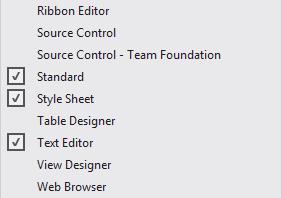

    *Enabling Editor and CSS Tools*
3. Scroll the code and select any CSS class definition. Click the **Comment** ( ) button to comment the selected lines. Then, click the **Uncomment** ( ) button to undo the changes.
4. Click the **Collapse** ( ) and **Expand** ( ) buttons located on the left margin of the text. Notice that you can now hide the styles you don't use to have a cleaner view.

    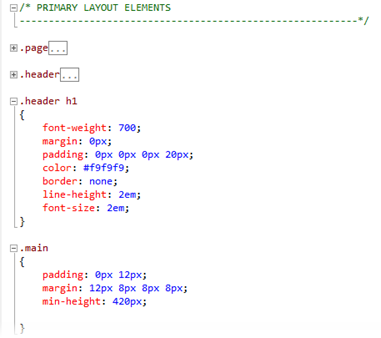

    *Collapsing CSS classes*
5. Make sure that the smart indentation feature is enabled. Select the **Tools** | **Options** menu option, and then select the **Text Editor** | **CSS** | **Formatting** page in the left pane of the screen. Check the **Hierarchical indentation** option.

    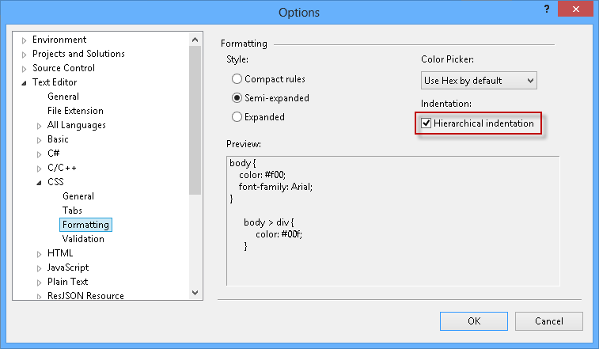

    *Enabling hierarchical indentation*
6. Locate the main class definition (.main) and append a style to the div elements. You will notice that the code aligns automatically, helping users to find the parent classes at a glance.

    CSS

    [!code-css[Main](whats-new-in-aspnet-and-web-development-in-visual-studio-2012/samples/sample1.css)]

    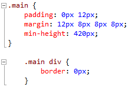

    *Hierarchical alignment in CSS*
7. Inside **.main div** class, locate the cursor at the end of **border: 0px;** and press **Enter** to display the IntelliSense list. Start typing **top** and notice how the list is filtered as you type. The list will display the elements that contain **top** at any part of the word (In prior versions of Visual Studio, the list is filtered by the items that *begin* with the term).

    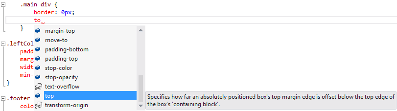

    *IntelliSense enhancements in CSS*

#### Task 2 - The Color Picker

In this task, you will discover the new CSS Color Picker integrated into Visual Studio IntelliSense.

1. In **Site.css,** locate the header class definition (.header) and place the cursor next to **background-color** attribute, between the &quot;:&quot; and &quot;#&quot; characters on that line of code **.**

    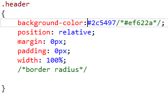

    *Locating the cursor*
2. Delete the **colon** (:) and write it again to display the color picker. Notice that the first colors you will see are the most frequent colors of your site. If you click the white color, its HTML color code (#fff) will replace the current color code in the stylesheet.

    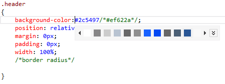

    *Color picker*
3. Press the **Expand** ( ) button on the color picker to display the color gradient, and then drag the gradient cursor to select a different color. After that, click the **Eyedropper** button and select any color from the screen. Notice that background color value changes dynamically while you move the cursor.

    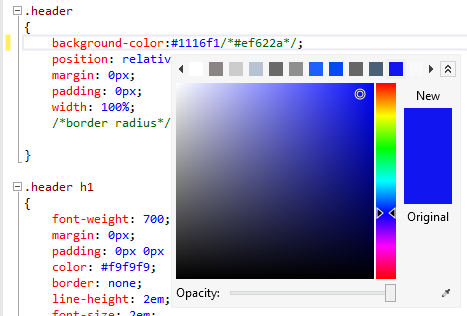

    *Color picker gradient*
4. In the **Opacity** slider, move the selector to the center of the bar to reduce the opacity. Notice that background-color value now changes its scale to RGBA.

    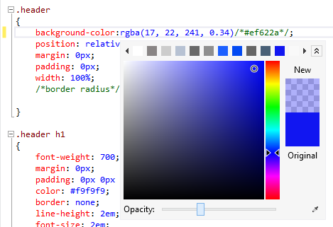

    *Color picker Opacity*

    > [!NOTE]
    > The RGBA (Red, Green, Blue, Alpha) color definition in CSS3 enables you to define the color opacity value for a single item. Unlike **opacity -** a similar CSS attribute **-** RGBA colors are also compatible with the latest browsers.

#### Task 3 - CSS Compatible Code Snippets

In this task, you will learn how to use cross-browser compatible CSS3 snippets in order to implement some features in your website.

1. In the **Site.css** file, locate the **header** CSS class definition (.header) and place the cursor below the **/\*border radius\*/** placeholder to add a new snippet. Press **Enter** to display the IntelliSense list and type **radius** to filter the list. Select the **border-radius** option from the list with a double click, and then press the **TAB** key to insert the snippet. Then, type a radius size in pixels and press **Enter**. For instance, type **15px**.

    The CSS3 attributes added by the snippet will render rounded borders in most HTML5 compliance browsers, including Mozilla and WebKit-based browsers.

    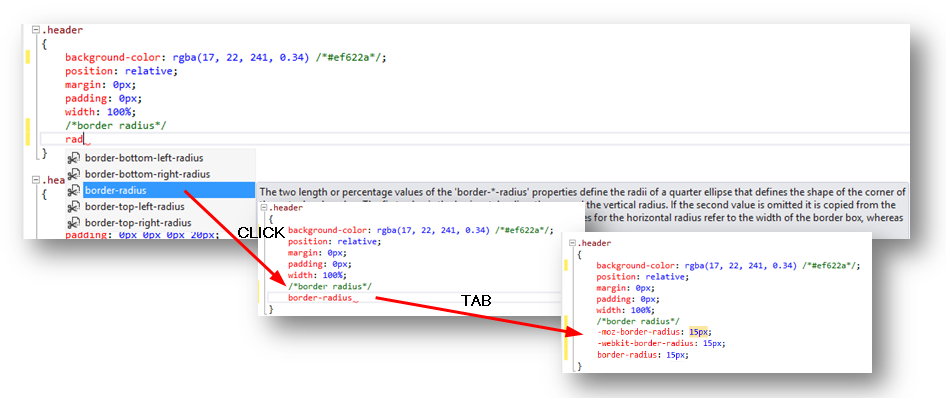

    *Using a border-radius snippet*
2. Apply the same **border** snippets in the page style (.page).

    CSS

    [!code-css[Main](whats-new-in-aspnet-and-web-development-in-visual-studio-2012/samples/sample2.css)]
3. Press **F5** to run the solution. Notice that each page now has rounded borders.

    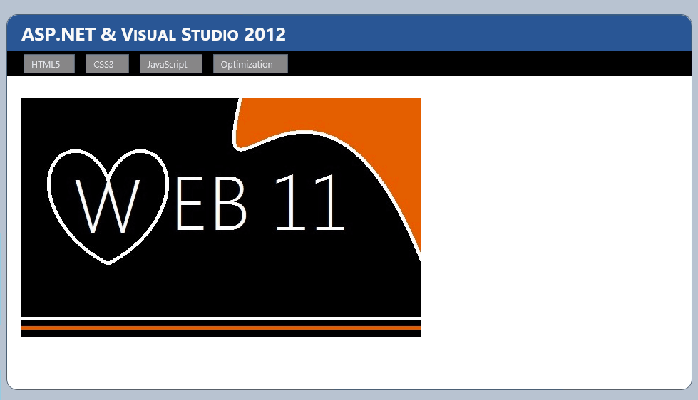

    *Rounded corners*
4. Close the browser and return to Visual Studio.
5. Open the **Custom.css** file located under the **Styles** folder and place the cursor inside **div.images ul li img** class definition.
6. Press enter to display the IntelliSense list, type **box-shadow** and press the **TAB** key twice to insert the default shadow code snippet inside the class definition. Set the shadow values to **10px 10px 5px #888**. Then, type **border-radius** and insert the code snippet. Type **15px** to set radius size and press **ENTER**.

    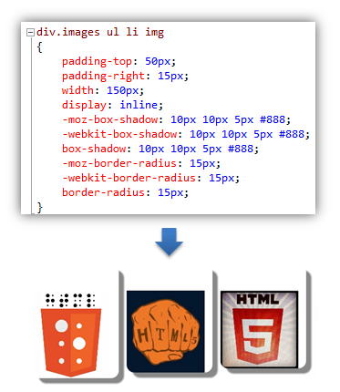

    *Rounded corners with shadow*

    > [!NOTE]
    > At this moment, the shadow attribute is inserted with the corresponding prefix (moz, webkit, o) to support Mozilla and Webkit (Chrome, Safari, Konkeror) browsers.
7. Create a new class **div.images ul li img:hover** below the **div.images ul li img** class definition and place the cursor inside the brackets **.**

    CSS

    [!code-css[Main](whats-new-in-aspnet-and-web-development-in-visual-studio-2012/samples/sample3.css)]
8. Type **transform** and press the **TAB** key twice in order to insert the transform snippet. Then, enter **rotate(-15deg)** to change the rotation angle value when images are hovered.

    CSS

    [!code-css[Main](whats-new-in-aspnet-and-web-development-in-visual-studio-2012/samples/sample4.css)]
9. Press **F5** to run the solution and browse to the CSS3 page. Notice that the images have rounded corners and box shadows. Hover the mouse over the images and watch them rotate.

    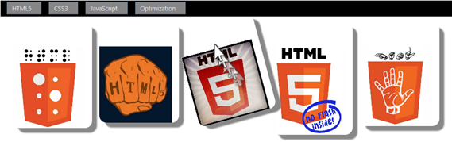

    *Transform snippet rotating an image*

    > [!NOTE]
    > If you are using Internet Explorer 10 and cannot see the shadows, make sure the document mode is set to IE10 standards. Press **F12** to open Internet Explorer developer tools and click **Document Mode** to change to IE10 standards.

    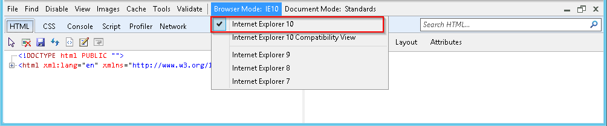

### Exercise 2: What's New in the HTML Editor

Visual Studio has an improved HTML editor. Some of the enhancements included in this version are smart indentation in HTML documents, HTML5 snippets, HTML start and end tag matching, and HTML validation. Throughout this exercise, you will see how these changes improve your fluency when working in the website markup.

Like the CSS editor, the HTML editor was also improved. Most of these improvements are small ones that make the Web developer's life easier. Things like more code snippets for HTML5, smart indentation, matching start and end tags when editing and validation targeting the HTML document DOCTYPE are some of these improvements.

#### Task 1 - Improved DOCTYPE Validation

The HTML editor now has the ability to check the DOCTYPE of your page, even though the definition might be in the master page. Depending on the DOCTYPE of your page, the HTML editor will validate with the correct set of rules and will filter the IntelliSense list considering the DOCTYPE elements.

In this task, you will change the DOCTYPE of a page to see how the HTML editor behavior changes accordingly.

1. If not already opened, start **Visual Studio** and open the **WhatsNewASPNET.sln** solution located in the **Source\WhatsNewASPNET** folder of this lab.
2. Open the **Site.Master** page.
3. Notice the Target Schema for Validation Toolbar. The way the HTML editor behaves (Validation, IntelliSense, etc.) will properly change to fit the Doctype selected.

    

    *Use Doctype in HTML Source Editing toolbar*
4. Change the Target Schema to HTML 4.01.

    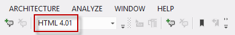

    *Changing Doctype in HTML Source Editing toolbar*
5. Place the cursor under the **body** element, and start typing the name of an HTML5 element (for example, **video**). Notice that the element is not available in the IntelliSense list.

    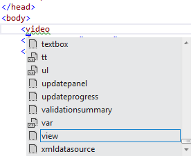

    *HTML5 elements not listed*
6. Undo the changes to the Target Schema for Validation Toolbar, picking DOCTYPE: XHTML5 from the dropdown list.

    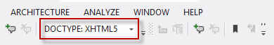

    *Reset Doctype in HTML Source Editing toolbar*
7. Place the cursor under the **body** element and start typing an HTML5 element again (For example, like **video**). Notice that the HTML5 elements are now available in the IntelliSense list.

    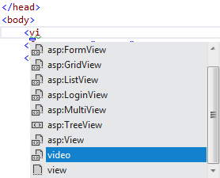

    *HTML5 elements being listed*

#### Task 2 - Start/End Tags Automatic Update

Visual Studio now updates the HTML opening or closing tags of the element that you are editing to match each other. This new feature will improve your productivity when editing HTML tags.

1. On the **Default.aspx** page, add an **H3** element with a title (for example, Visual Studio 2012 Rocks!).

    [!code-aspx[Main](whats-new-in-aspnet-and-web-development-in-visual-studio-2012/samples/sample5.aspx)]
2. Change the **H3** tag and type **H2** or **H1.**

    Notice that the end tag automatically updates. You can also modify the end tag to see that the start tag updates accordingly too.

    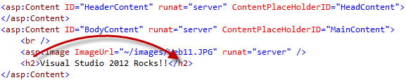

    *Automatic update of the end tag*

#### Task 3 - New HTML5 Code Snippets

Visual Studio now includes several HTML5 code snippets. In this task, you will use some of these snippets.

1. Add a new folder named **audio** to the root of the web site folder. Open Windows Explorer and copy any audio file into the **audio** folder of the **WhatsNewASPNET.sln** solution.
2. In the **Default.aspx** page, locate the cursor under the Web11 Rocks!! Header. Type **audio** and press the TAB key.

    The new HTML editor includes code snippets for HTML5 content. Remember to use the proper DOCTYPE definition to enable the HTML5 snippets.

    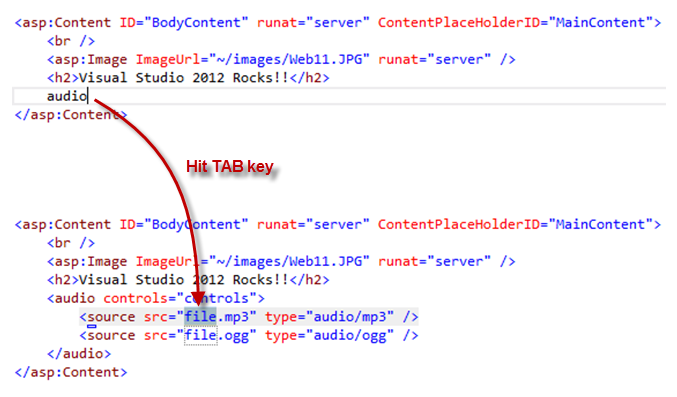

    *Inserting HTML5 Code Snippets*
3. Update the audio source to point to an existing audio file.

    [!code-aspx[Main](whats-new-in-aspnet-and-web-development-in-visual-studio-2012/samples/sample6.aspx)]

    > [!NOTE]
    > You will need to add the audio file to the solution.
4. Press **F5** to run the site and play the audio.

    

    *Running the audio control*

    > [!NOTE]
    > You can also try more snippets included in Visual Studio, such as video, figure, etc.
5. Now, try to insert a control in some part of the page. For example, try to insert a **GridView** control, but instead of typing **&lt;Gri,** start typing **&lt;GV**. Notice that the IntelliSense list shows the **asp:GridView** control.

    IntelliSense in the HTML Editor now provides title-casing search, as well as partial matching (retrieving all elements that contains the term).

    

    *Inserting a GridView with IntelliSense lists*

    If you type **&lt;grid** you will get all the items that match the term, but Visual Studio will suggest the **gridview** control:

    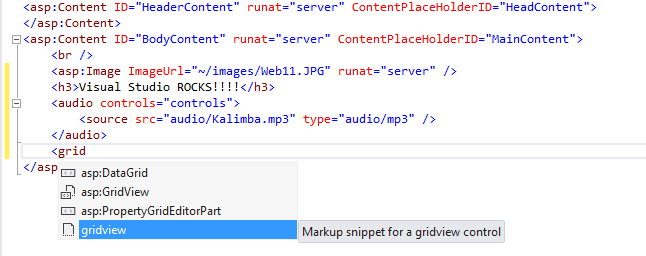

    *Inserting a GridView with IntelliSense lists and partial matching*

#### Task 4 - HTML Editor Smart Tags

Another improvement in the HTML Editor is the Smart Tags feature. Smart tags make it easy to perform common or repetitive development tasks on a per-control basis. This feature was already available in the HTML Designer, but not in the HTML Editor.

1. Open **Site.Master** and locate the **asp:Menu** element. Place the cursor on the start tag and notice that the small glyph displayed at the bottom of the element - click it to open the smart tasks menu. Notice that you have quick access to some tasks related to the Menu control.

    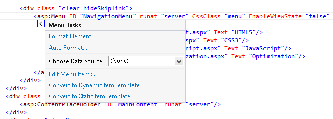

    *Smart tasks for the Menu control*

#### Task 5 - Smart Indentation

One of the best practices in HTML is indenting the nested elements to keep the code readable. In Visual Studio 2012, you will notice that the editor automatically indents the elements while you are writing the code.

> [!NOTE]
> In previous version of Visual Studio, smart indentation was available in the XML editor but not in the HTML editor.

1. Make sure that the Indenting configuration on the HTML Editor is set to Smart Indentation. To do that, select the **Tools | Options** menu option and then select the **Text Editor | HTML | Tabs** page in the left pane of the screen. Select the Smart indentation option.

    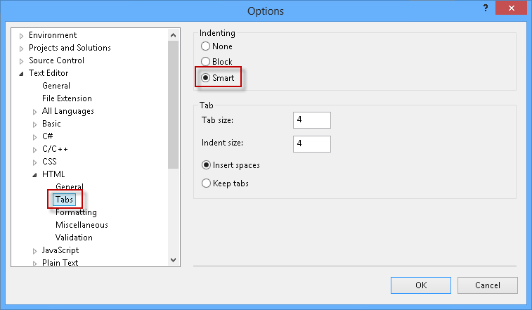

    *HTML Editor settings*
2. On the **Default.aspx** page, remove all the content under the audio element.
3. Place the cursor at the end of the opening **audio** element and hit **ENTER**.

    Notice that the new position of cursor has an additional indentation level.

    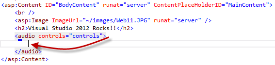

    *Smart indentation in the HTML Editor*
4. Restore the audio tag with the content you have removed, or close **Default.aspx** without saving the changes.

#### Task 6 - Extract to User Control

The Refactoring tools included in Visual Studio, such as extracting a portion of code to a function, are great features that facilitate the improvement and the refactoring the existing code. The counterpart for ASP.NET pages would be the extraction of HTML code to a User Control. Doing it manually would involve several steps, like creating a new User Control, moving the code section to the User Control, registering a tag prefix for the User Control, and, finally, instantiating the User Control on the pages. Now, the new *Extract to User Control* tool automatically performs all those steps for you.

In this task, you will use the new Extract to User Control contextual operation to generate a new user control from the selected code.

1. On the **Default.aspx** page, select the **H2** and **audio** elements.
2. Right click and select **Extract to User Control**.

    

    *Extract to User Control menu option*
3. Type a name for the new user control. For instance, **Jukebox.ascx**, and then click **OK**.

    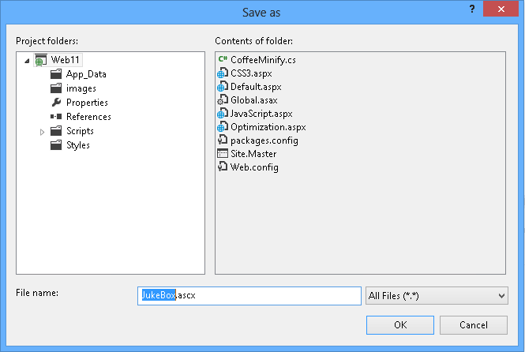

    *Saving the extracted user control*
4. Notice that the selected code was extracted to a user control and the original location of the selected code was replaced with an instance of the new user control.

    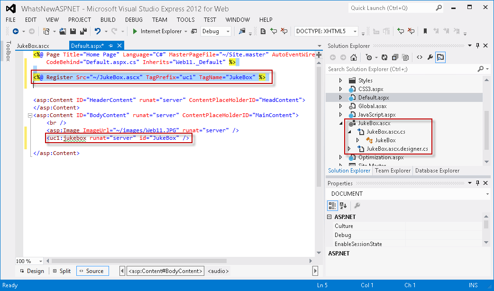

    *Page automatically updated to use the new user control*
5. Press **F5** to run the page and verify that the control works.

### Exercise 3: What's New in the JavaScript Editor

Writing or editing JavaScript code is not an easy task, especially when your application starts to grow in size and you find yourself dealing with long files and hundreds of functions. Script developers usually have to do some extra work to maintain code legibility and navigate across files. With the inclusion of JavaScript libraries like jQuery, script navigation has become a challenge itself because of the code length.

Visual Studio has renewed the JavaScript editor with the promise to make the code mode accessible and organized. Many Visual Studio features that already existed in C# or VB editors are now implemented in the JavaScript editor: Go To Definition, automatic indentation, documentation and validation when you are writing. With the renewed IntelliSense list you will have the JavaScript function catalog at your fingertips.

In this exercise, you will learn some of the new features and improvements of JavaScript editor. You will browse sample files and discover each of the new characteristics that will make your JavaScript programming more efficient within Visual Studio 2012.

#### Task 1 - JavaScript Editor New Features

This task will introduce you to some of the new JavaScript editor features, which focus on organizing your code and bringing a better user experience.

1. If not already opened, start **Visual Studio** and open the **WhatsNewASPNET.sln** solution located in the **Source\WhatsNewASPNET** folder of this lab.
2. Press **F5** to run the application, then click the JavaScript link in the navigation bar. Refresh the page several times and check how the counter increments.

    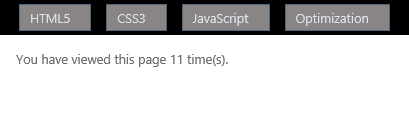

    *Page counter*
3. Close the browser and go back to Visual Studio.
4. Open the **JavaScript.aspx** page and locate the **&lt;script&gt;** block (shown below).

    The following code uses HTML5 local storage to store a *pageLoadCount* variable that stores the number of times the page has been visited by the current user. Local Storage is a client-side key-value database introduced with the HTML5 standard. The data is saved on the local machine, inside the user's browser.

    [!code-html[Main](whats-new-in-aspnet-and-web-development-in-visual-studio-2012/samples/sample7.html)]

    > [!NOTE]
    > Ensure the DOCTYPE is set to XHTML5 before proceeding with the next steps.
5. Edit the code and notice that IntelliSense for JavaScript includes HTML5 features, like local storage, and their inner methods.

    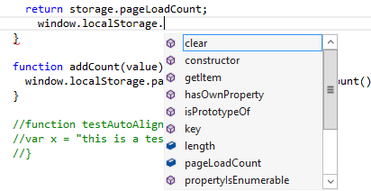

    *HTML5 JavaScript features in JavaScript*
6. Click any opening bracket (**{**) from the scripting code and notice that the brackets are highlighted.

    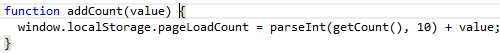

    *Brackets are highlighted*
7. Uncomment the function **testAutoAlign()** (select the three lines and you can use **CTRL** + **K**; **CTRL** + **U**) and locate the cursor inside the function code. Press enter to append a second line. Notice that the code is now **aligned** and **auto-indented**.

    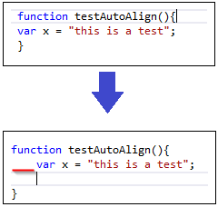

    *JavaScript code is auto aligned*

#### Task 2 - Validating JavaScript

In this task, you will discover the new JavaScript validation for the ECMAScript5 standard. This feature will help you to write compliant JavaScript code, while preventing scripting issues before site deployment.

> [!NOTE]
> Visual Studio 2010 implemented ECMAStript3 compliance, while Visual Studio 2012 provides ECMAScript5 compliance.

1. Open **ECMA5script5.js** located under the **Scripts\custom** project folder. You will now test validation for ECMAScript5 standard.

    [!code-html[Main](whats-new-in-aspnet-and-web-development-in-visual-studio-2012/samples/sample8.html)]

    You can check out the &quot; **use strict** &quot; direction in the first line of the file, which enables ECMAScript5 **strict mode**. This mode consists in a subset of the language that clarifies ambiguities from the past edition, and adds some new features, such as getters and setters, library support for JSON, and more complete reflection on object properties.
2. Open the **Error List** if not already opened (**View** menu | **Error List**). Notice the **function** declaration is underlined. This is because in ECMA5 standard functions cannot be nested inside language structures. In the error list below you will see the warning details.

    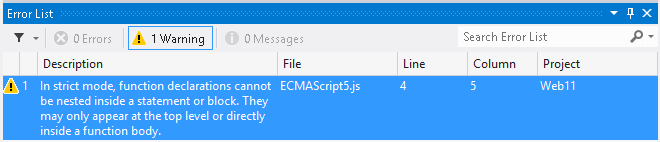

    *JavaScript validation error message*
3. Comment out the **&quot;use strict&quot;** direction and notice that errors disappear, but the warnings remain.
4. In the last line of the file, write any string like **&quot;test&quot;** (include the quotation marks to indicate it is as string). Write a period next to the string to display the IntelliSense list, and select the **trim** option.

    In ECMAScript5 standard, string values and variables also have string methods defined, like trim, uppercase, search and replace.

    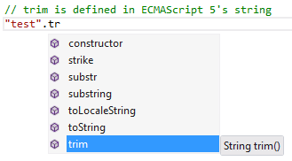

    *IntelliSense list in JavaScript*

#### Task 3 - XML Documentation for JavaScript

In this task, you will explore Visual Studio features for XML documentation in JavaScript. You will see the JavaScript IntelliSense list now shows the XML documentation of each function. Additionally, you will discover the navigation feature in JavaScript.

1. Open **XMLDoc.js** file located in **Scripts/custom** project folder. This file contains XML documentation on each of the JavaScript functions.

    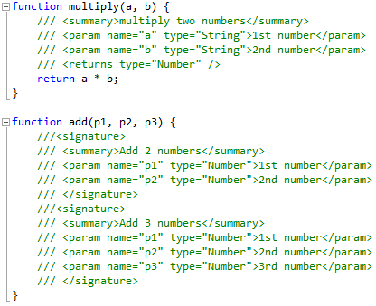

    *JavaScript XML documentation integrated to IntelliSense*
2. Below **add** function in **XMLDoc.js** file, create a new function named **test**.
3. In the **test** function, call the **multiply** function that receives two parameters. Notice the tooltip box is showing the **multiply** function documentation.

    [!code-javascript[Main](whats-new-in-aspnet-and-web-development-in-visual-studio-2012/samples/sample9.js)]

    

    *XML documentation for JavaScript functions*
4. Complete the function call statement and type a *dot* to open the IntelliSense list on the returned value. Notice that Visual Studio is detecting the **return** value in the documentation, treating the value as a number.

    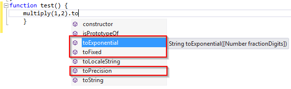

    *XML documentation for return types*
5. Now, insert a call to add function. Notice that the JavaScript editor now supports function overloads. When you write a function name, you will be able to select any of the available overloads specified in the documentation.

    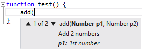

    *XML documentation for overloads*
6. Open **GotoDefinition.js** file and locate the **$().html()** function call. Locate the cursor on **html**.
7. Press **F12** and navigate to the definition. Notice you can now access and browse your JavaScript code without using the **Find** tool.
8. Locate the cursor on the jQuery instruction prior to the signature block at the bottom of the code file. Press **F12**. You will navigate to the jQuery library file. Notice you can also navigate across the jQuery files using **F12**.

    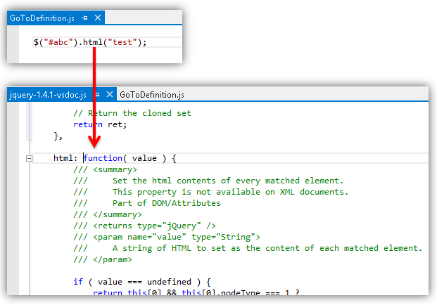

    *Navigating to jQuery definitions*

> [!NOTE]
> Make sure that GotoDefinition.js has no syntax errors before saving the file.

### Exercise 4: Bundling and Minification

How many times do your websites include more than one JavaScript or CSS file? This is a very common scenario where bundling and minification can help to reduce the file size and make the site perform faster. The new bundling feature in ASP.NET 4.5 packs a set of JS or CSS files into a single element, and reduces its size by minifying the content ( i.e. removing not required blank spaces, removing comments, reducing identifiers ).

Bundling and minification in ASP.NET 4.5 is performed at runtime, so that the process can identify the user agent (for example IE, Mozilla, etc), and thus, improve the compression by targeting the user browser (for instance, removing stuff that is Mozilla specific when the request comes from IE).

In this exercise, you will learn how to enable and use the different types of bundling and minification in ASP.NET 4.5.

#### Task 1 - Installing the Bundling and Minification Package from NuGet

1. If not already opened, start **Visual Studio** and open the **WhatsNewASPNET.sln** solution located in the **Source\WhatsNewASPNET** folder of this lab.
2. Open the NuGet Package Manager Console. To do this, use the menu **View** | **Other Windows** | **Package Manager Console**.

    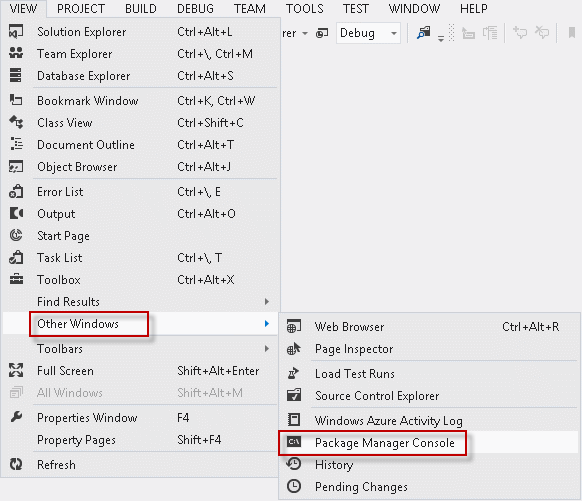

    *Opening the package manager console*
3. In the **Package Manager Console,** type **Install-Package Microsoft.Web.Optimization** and press **ENTER**.

#### Task 2 - Default Bundles

The simplest way to use bundling and minification is to enable the default bundles. This method uses conventions to let you reference the bundled and minified version for the JS and CSS files in a folder.

In this task, you will learn how to enable and reference the bundled and minified JS and CSS files and view the resulting output.

1. If not already opened, start **Visual Studio** and open the **WhatsNewASPNET.sln** solution located in the **Source\WhatsNewASPNET** folder of this lab.
2. In the **Solution Explorer**, expand the **Styles**, **Scripts\custom** and **Scripts\bundle** folders.

    Notice that the application is using more than one CSS and JS file.

    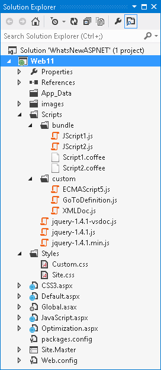

    *Multiple Stylesheets and JavaScript files in the application*
3. Open the **Global.asax.cs** file.

    Notice that the new **Microsoft.Web.Optimization** namespace is commented out at the beginning of the file. Uncomment the using directive to include the bundling and minification features.

    [!code-csharp[Main](whats-new-in-aspnet-and-web-development-in-visual-studio-2012/samples/sample10.cs)]
4. Locate the **Application\_Start** method.

    In this method, uncomment the EnableDefaultBundles call as shown in the snippet below. This enables us to reference a bundled collection of CSS files in a folder by using the path to that folder, plus the &quot;CSS&quot; or the &quot;JS&quot; suffix.

    [!code-csharp[Main](whats-new-in-aspnet-and-web-development-in-visual-studio-2012/samples/sample11.cs)]
5. Open the **Optimization.aspx** file and locate the content control for **HeadContent**.

    Notice the CSS files and the JS files have a single referenced tag.

    [!code-aspx[Main](whats-new-in-aspnet-and-web-development-in-visual-studio-2012/samples/sample12.aspx)]

    > [!NOTE]
    > This code is for demo purposes. Ideally, you will reference the bundles in the Site.Master file. In this sample code, you will find that some of the bundled files are also being referenced by the Site.Master file, making this last reference redundant.
6. Notice that the links are using the bundling conventions in the **href** attribute to get all the CSS or JS files from the Styles and Scripts\custom folder respectively.

    You can use the path **Scripts/custom/JS** as shown below to bundle and minify all the JS files inside a **Scripts/custom** folder. This is the default behavior with the default bundles.

    [!code-aspx[Main](whats-new-in-aspnet-and-web-development-in-visual-studio-2012/samples/sample13.aspx)]
7. Open the **Styles\Site.css** file.

    Notice that the original CSS file contains indented code, blank spaces and comments that enlarge the file. (Also the JavaScript file contains blank spaces and comments).

    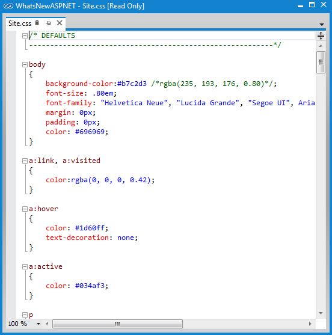

    *One of the original CSS files in the Scripts folder*
8. Press **F5** to run the application and navigate to the **Optimization** page.
9. Click on the **CSS Bundle** link to download and open the file.

    Check out the minified bundled file. You will notice that all the blank spaces, comments and indentation characters have been removed, generating a smaller file.

    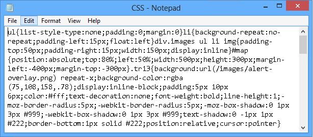

    *Bundled CSS files*
10. Now click the **JS Bundle** link to open the JavaScript bundled file. You can safely disregard the explorer warning. Notice the JavaScript files under the **custom** folder are also bundled and minified.

    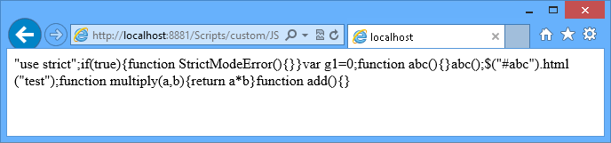

    *Bundled JavaScript files*

    Enabling compression for CSS or JS files was much more complicated in previous ASP.NET version. Now, as you have seen, you just need to add one line in the *Global.asax* file to enable bundling, and then reference the bundled files from your site.

#### Task 3 - Static Bundles

The static bundle approach allows you to customize the set of files to bundle, the reference and the minification method that will be used.

In this task, you will configure a static bundle to define a specific set of files to bundle and minify.

1. Close the browser.
2. Open the **Global.asax.cs** file and locate the **Application\_Start** method.
3. Uncomment the static bundle code as shown in the code below.

    You are defining a static bundle that will be referenced with the &quot;**~/StaticBundle**&quot; virtual path and use **JsMinify** for minification of all the specified files with the **AddFile** method. Finally, you are adding the static bundle to the **BundleTable** and enabling it.

    Notice that the files are not located in the same place; this is another advantage over the default bundling.

    [!code-csharp[Main](whats-new-in-aspnet-and-web-development-in-visual-studio-2012/samples/sample14.cs)]
4. Open the **Optimization.aspx** file.

    Notice that the link to **Static JS Bundle** is using the path you have declared when you configured the static bundle in the Global.asax.cs file: **/StaticBundle**.

    [!code-aspx[Main](whats-new-in-aspnet-and-web-development-in-visual-studio-2012/samples/sample15.aspx)]
5. Press **F5** to run the application, and then navigate to the **Optimization** page.
6. Click on the **Static JS Bundle** link to open the file.

    Notice that the minified bundled JavaScript file is the output for all the JavaScript files configured in the static bundle file under the path &quot;/StaticBundle&quot;.

    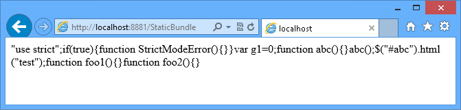

    *Static JavaScript files bundle*
7. Close the browser and return to Visual Studio.

#### Task 4 - Dynamic Folder Bundles

In this task, you will learn how to configure dynamic folder bundles. The power of dynamic bundling is that you can include static JavaScript, as well as other files in languages that compiles into JavaScript, and thus, require some processing before the bundling is executed.

In this example, you will learn how to use the **DynamicFolderBundle** class to create a dynamic bundle for files written in CofeeScript. CofeeScript is a programming language that compiles into JavaScript and provides a simpler syntax for writing JavaScript code, enhancing JavaScript's brevity and readability.

1. Open the **Global.asax.cs** file and locate the **Application\_Start** method.
2. Uncomment the dynamic bundle code as shown in the code below.

    You are defining a dynamic folder bundle that will use the **CoffeeMinify** custom minification processor that will only apply to the files with the &quot;**.coffee**&quot; extension (CoffeeScript files). Notice that you can use a search pattern to select the files to bundle within a folder, like '\*.coffee'.

    [!code-csharp[Main](whats-new-in-aspnet-and-web-development-in-visual-studio-2012/samples/sample16.cs)]
3. Open the NuGet Package Manager Console. To do this, use the menu **View** | **Other Windows** | **Package Manager Console**.
4. In the **Package Manager Console,** type **Install-Package CoffeeSharp** and press **ENTER**.
5. Click the **Show All Files** button in the **Solution Explorer** window

    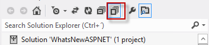

    *Showing all files*
6. Right click the **CoffeeMinify.cs** file in the **Solution Explorer** and select **Include in Project**

    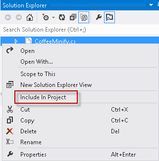

    *Include the CoffeeMinify.cs file in the project*
7. Open the **CoffeeMinify.cs** file.

    This class inherits from JsMinify to minify the JavaScript output resulting from the CoffeeScript code compilation. It calls the CoffeeScript compiler to generate the JavaScript code first, and then it sends it to the JsMinify.Process method to minify the resulting code.

    [!code-csharp[Main](whats-new-in-aspnet-and-web-development-in-visual-studio-2012/samples/sample17.cs)]
8. Open the **Script1.coffee** and **Script2.coffee** files from the **Scripts/bundle** folder.

    These files will include the CoffeScript code to be compiled while performing the bundling with the CoffeeMinify class.

    For simplicity purposes, the CoffeeScript files provided are only including CoffeeScript sample code. The comments are excluded by the JsMinify process.

    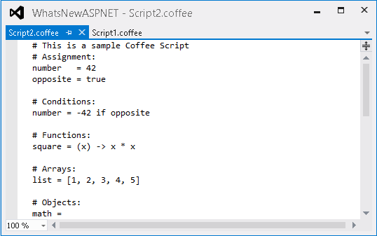

    *CoffeeScript files*

    > [!NOTE]
    > [CofeeScript](https://github.com/jashkenas/coffeescript/) provides a simpler syntax for writing JavaScript code, enhancing JavaScript's brevity and readability, as well as adding other features like array comprehension and pattern matching.
9. Open the **Optimization.aspx** file and locate the bundle links.

    Notice that the link to **Dynamic JS Bundle** is referencing the **Scripts/bundle** folder by using the **/Coffee** suffix you configured for the dynamic folder bundle.

    [!code-aspx[Main](whats-new-in-aspnet-and-web-development-in-visual-studio-2012/samples/sample18.aspx)]
10. Press **F5** to run the application, and then navigate to the **Optimization** page.
11. Click on the **Dynamic JS Bundle** link to open the generated file.

    Notice that the content that was included in this bundle only contains **.coffee** files. You can also see that the CoffeeScript code was compiled to JavaScript and the commented-out lines has been removed.

    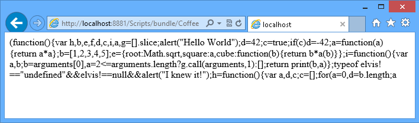

    *Dynamic JS files bundle*

> [!NOTE]
> Additionally, you can deploy this application to Windows Azure Web Sites following [Appendix B: Publishing an ASP.NET MVC 4 Application using Web Deploy](#AppendixB).

## Summary

This lab helps you to understand what New in ASP.NET and Web Development in Visual Studio 2012 is and how to take advantage of the variety of enhancements in Visual Studio 2012.

By completing this Hands-On Lab, you have learnt how to use the new features and improvements in Visual Studio 2012 Editors for CSS, JavaScript and HTML. In addition, you have learnt how Visual Studio 2012 implements built-in bundling and minification.

## Appendix A: Installing Visual Studio Express 2012 for Web

You can install **Microsoft Visual Studio Express 2012 for Web** or another &quot;Express&quot; version using the **[Microsoft Web Platform Installer](https://www.microsoft.com/web/downloads/platform.aspx)**. The following instructions guide you through the steps required to install *Visual studio Express 2012 for Web* using *Microsoft Web Platform Installer*.

1. Go to [[https://go.microsoft.com/?linkid=9810169](https://go.microsoft.com/?linkid=9810169)](https://go.microsoft.com/?linkid=9810169). Alternatively, if you already have installed Web Platform Installer, you can open it and search for the product &quot;*Visual Studio Express 2012 for Web with Windows Azure SDK*&quot;.
2. Click on **Install Now**. If you do not have **Web Platform Installer** you will be redirected to download and install it first.
3. Once **Web Platform Installer** is open, click **Install** to start the setup.

    

    *Install Visual Studio Express*
4. Read all the products' licenses and terms and click **I Accept** to continue.

    

    *Accepting the license terms*
5. Wait until the downloading and installation process completes.

    

    *Installation progress*
6. When the installation completes, click **Finish**.

    

    *Installation completed*
7. Click **Exit** to close Web Platform Installer.
8. To open Visual Studio Express for Web, go to the **Start** screen and start writing &quot;**VS Express**&quot;, then click on the **VS Express for Web** tile.

    

    *VS Express for Web tile*

* * *

## Appendix B: Publishing an ASP.NET MVC 4 Application using Web Deploy

This appendix will show you how to create a new web site from the Windows Azure Management Portal and publish the application you obtained by following the lab, taking advantage of the Web Deploy publishing feature provided by Windows Azure.

#### Task 1 - Creating a New Web Site from the Windows Azure Portal

1. Go to the [Windows Azure Management Portal](https://manage.windowsazure.com/) and sign in using the Microsoft credentials associated with your subscription.

    > [!NOTE]
    > With Windows Azure you can host 10 ASP.NET Web Sites for free and then scale as your traffic grows. You can sign up [here](http://aka.ms/aspnet-hol-azure).

    

    *Log on to Windows Azure Management Portal*
2. Click **New** on the command bar.

    

    *Creating a new Web Site*
3. Click **Compute** | **Web Site**. Then select **Quick Create** option. Provide an available URL for the new web site and click **Create Web Site**.

    > [!NOTE]
    > A Windows Azure Web Site is the host for a web application running in the cloud that you can control and manage. The Quick Create option allows you to deploy a completed web application to the Windows Azure Web Site from outside the portal. It does not include steps for setting up a database.

    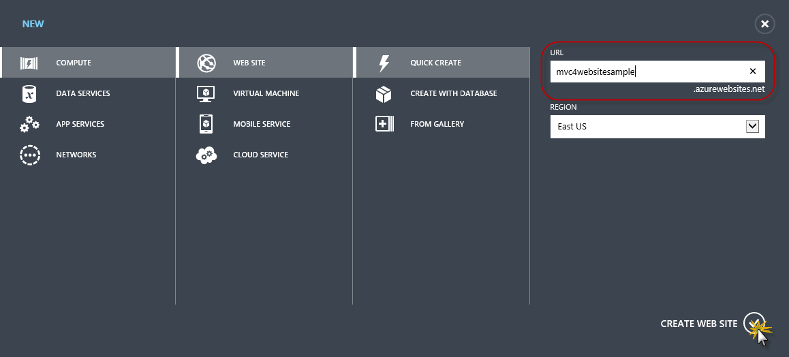

    *Creating a new Web Site using Quick Create*
4. Wait until the new **Web Site** is created.
5. Once the Web Site is created click the link under the **URL** column. Check that the new Web Site is working.

    

    *Browsing to the new web site*

    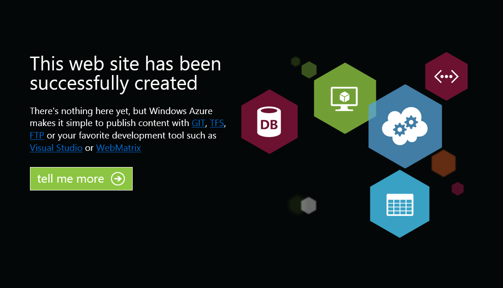

    *Web site running*
6. Go back to the portal and click the name of the web site under the **Name** column to display the management pages.

    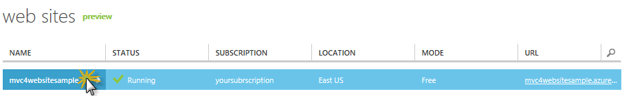

    *Opening the Web Site management pages*
7. In the **Dashboard** page, under the **quick glance** section, click the **Download publish profile** link.

    > [!NOTE]
    > The *publish profile* contains all of the information required to publish a web application to a Windows Azure website for each enabled publication method. The publish profile contains the URLs, user credentials and database strings required to connect to and authenticate against each of the endpoints for which a publication method is enabled. **Microsoft WebMatrix 2**, **Microsoft Visual Studio Express for Web** and **Microsoft Visual Studio 2012** support reading publish profiles to automate configuration of these programs for publishing web applications to Windows Azure websites.

    

    *Downloading the Web Site publish profile*
8. Download the publish profile file to a known location. Further in this exercise you will see how to use this file to publish a web application to a Windows Azure Web Sites from Visual Studio.

    

    *Saving the publish profile file*

#### Task 2 - Configuring the Database Server

If your application makes use of SQL Server databases you will need to create a SQL Database server. If you want to deploy a simple application that does not use SQL Server you might skip this task.

1. You will need a SQL Database server for storing the application database. You can view the SQL Database servers from your subscription in the Windows Azure Management portal at **Sql Databases** | **Servers** | **Server's Dashboard**. If you do not have a server created, you can create one using the **Add** button on the command bar. Take note of the **server name and URL, administrator login name and password**, as you will use them in the next tasks. Do not create the database yet, as it will be created in a later stage.

    

    *SQL Database Server Dashboard*
2. In the next task you will test the database connection from Visual Studio, for that reason you need to include your local IP address in the server's list of **Allowed IP Addresses**. To do that, click **Configure**, select the IP address from **Current Client IP Address** and paste it on the **Start IP Address** and **End IP Address** text boxes. Enter a name for the rule and click the  button.

    

    *Adding Client IP Address*
3. Once the **Client IP Address** is added to the allowed IP addresses list, click on **Save** to confirm the changes.

    

    *Confirm Changes*

#### Task 3 - Publishing an ASP.NET MVC 4 Application using Web Deploy

1. Go back to the ASP.NET MVC 4 solution. In the **Solution Explorer**, right-click the web site project and select **Publish**.

    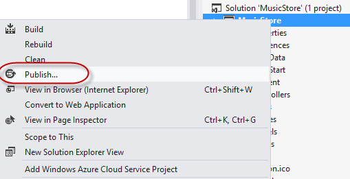

    *Publishing the web site*
2. Import the publish profile you saved in the first task.

    

    *Importing publish profile*
3. Click **Validate Connection**. Once Validation is complete click **Next**.

    > [!NOTE]
    > Validation is complete once you see a green checkmark appear next to the Validate Connection button.

    

    *Validating connection*
4. In the **Settings** page, under the **Databases** section, click the button next to your database connection's textbox (i.e. **DefaultConnection**).

    

    *Web deploy configuration*
5. Configure the database connection as follows:

    - In the **Server name** type your SQL Database server URL using the *tcp:* prefix.
    - In **User name** type your server administrator login name.
    - In **Password** type your server administrator login password.
    - Type a new database name, for example: *MVC4SampleDB*.

    

    *Configuring destination connection string*
6. Then click **OK**. When prompted to create the database click **Yes**.

    

    *Creating the database*
7. The connection string you will use to connect to SQL Database in Windows Azure is shown within Default Connection textbox. Then click **Next**.

    

    *Connection string pointing to SQL Database*
8. In the **Preview** page, click **Publish**.

    

    *Publishing the web application*
9. Once the publishing process finishes, your default browser will open the published web site.

    

    *Application published to Windows Azure*