What's New in Web Forms in ASP.NET 4.5
====================
by [Web Camps Team](https://twitter.com/webcamps)

> The new version of ASP.NET Web Forms introduces a number of improvements focused on improving user experience when working with data.
> 
> In previous versions of Web Forms, when using data-binding to emit the value of an object member, you used the data-binding expressions Bind() or Eval(). In the new version of ASP.NET, you are able to declare what type of data a control is going to be bound to by using a new ItemType property. Setting this property will enable you to use a strongly-typed variable to receive the full benefits of the Visual Studio development experience, such as IntelliSense, member navigation, and compile-time checking.
> 
> With the data-bound controls, you can now also specify your own custom methods for selecting, updating, deleting and inserting data, simplifying the interaction between the page controls and your application logic. Additionally, model binding capabilities have been added to ASP.NET, which means you can map data from the page directly into method type parameters.
> 
> Validating user input should also be easier with the latest version of Web Forms. You can now annotate your model classes with validation attributes from the **System.ComponentModel.DataAnnotations** namespace and request that all your site controls validate user input using that information. Client-side validation in Web Forms is now integrated with jQuery, providing cleaner client-side code and unobtrusive JavaScript features.
> 
> In the request validation area, improvements have been made to make it easier to selectively turn off request validation for specific parts of your applications or read invalidated request data.
> 
> Some improvements have been made to Web Forms server controls to take advantage of new features of HTML5:
> 
> - The TextMode property of the TextBox control has been updated to support the new HTML5 input types like email, datetime, and so on.
> - The FileUpload control now supports multiple file uploads from browsers that support this HTML5 feature.
> - Validator controls now support validating HTML5 input elements.
> - New HTML5 elements that have attributes that represent a URL now support runat=&quot;server&quot;. As a result, you can use ASP.NET conventions in URL paths, like the ~ operator to represent the application root (for example, &lt;video runat=&quot;server&quot; src=&quot;~/myVideo.wmv&quot;&gt;&lt;/video&gt;).
> - The UpdatePanel control has been fixed to support posting HTML5 input fields.
> 
> In the official ASP.NET portal you can find more examples of the new features in ASP.NET WebForms 4.5: [What's New in ASP.NET 4.5 and Visual Studio 2012](../../../../whitepapers/whats-new-in-aspnet-45-and-visual-studio-2012.md#_Toc318097385)
> 
> All sample code and snippets are included in the Web Camps Training Kit, available at [https://go.microsoft.com/fwlink/?LinkID=248297&clcid=0x409](https://go.microsoft.com/fwlink/?LinkID=248297&clcid=0x409).

### Objectives

In this hands-on lab, you will learn how to:

- Use strongly-typed data-binding expressions
- Use new model binding features in Web Forms
- Use value providers for mapping page data to code-behind methods
- Use Data Annotations for user input validation
- Take advange of unobstrusive client-side validation with jQuery in Web Forms
- Implement granular request validation
- Implement asynchronous page processing in Web Forms

### Prerequisites

You must have the following items to complete this lab:

- [Microsoft Visual Studio Express 2012 for Web](https://www.microsoft.com/visualstudio/eng/products/visual-studio-express-for-web) or superior (read [Appendix A](#AppendixA) for instructions on how to install it).

### Setup

**Installing Code Snippets**

For convenience, much of the code you will be managing along this lab is available as Visual Studio code snippets. To install the code snippets run **.\Source\Setup\CodeSnippets.vsi** file.

If you are not familiar with the Visual Studio Code Snippets, and want to learn how to use them, you can refer to the appendix from this document &quot;[Appendix C: Using Code Snippets](#AppendixC)&quot;.

## Exercises

This hands-on lab includes the following exercises:

1. [Exercise 1: Model Binding in ASP.NET Web Forms](#Exercise1)
2. [Exercise 2: Data Validation](#Exercise2)
3. [Exercise 3: Asynchronous Page Processing in ASP.NET Web Forms](#Exercise3)

> [!NOTE]
> Each exercise is accompanied by an **End** folder containing the resulting solution you should obtain after completing the exercises. You can use this solution as a guide if you need additional help working through the exercises.

Estimated time to complete this lab: **60 minutes**.

### Exercise 1: Model Binding in ASP.NET Web Forms

The new version of ASP.NET Web Forms introduces a number of enhancements focused on improving the experience when working with data. Throughout this exercise, you will learn about strongly typed data-controls and model binding.

#### Task 1 - Using Strongly-Typed Data-Bindings

In this task, you will discover the new strongly-typed bindings available in ASP.NET 4.5.

1. Open the **Begin** solution located at **Source/Ex1-ModelBinding/Begin/** folder.

    1. You will need to download some missing NuGet packages before continue. To do this, click the **Project** menu and select **Manage NuGet Packages**.
    2. In the **Manage NuGet Packages** dialog, click **Restore** in order to download missing packages.
    3. Finally, build the solution by clicking **Build** | **Build Solution**.

    > [!NOTE]
    > One of the advantages of using NuGet is that you don't have to ship all the libraries in your project, reducing the project size. With NuGet Power Tools, by specifying the package versions in the Packages.config file, you will be able to download all the required libraries the first time you run the project. This is why you will have to run these steps after you open an existing solution from this lab.
2. Open the **Customers.aspx** page. Place an unnumbered list in the main control and include a repeater control inside for listing each customer. Set the repeater name to **customersRepeater** as shown in the following code.

    In previous versions of Web Forms, when using data-binding to emit the value of a member on an object you're data-binding to, you would use a data-binding expression, along with a call to the Eval method, passing in the name of the member as a string.

    At runtime, these calls to Eval will use reflection against the currently bound object to read the value of the member with the given name, and display the result in the HTML. This approach makes it very easy to data-bind against arbitrary, unshaped data.

    Unfortunately, you lose many of the great development-time experience features in Visual Studio, including IntelliSense for member names, support for navigation (like Go To Definition), and compile-time checking.

    [!code-aspx[Main](whats-new-in-web-forms-in-aspnet-45/samples/sample1.aspx)]
3. Open the **Customers.aspx.cs** file.
4. Add the following using statement.

    [!code-csharp[Main](whats-new-in-web-forms-in-aspnet-45/samples/sample2.cs)]
5. In the **Page\_Load** method, add code to populate the repeater with the list of customers.

    (Code Snippet - *Web Forms Lab - Ex01 - Bind Customers Data Source*)

    [!code-csharp[Main](whats-new-in-web-forms-in-aspnet-45/samples/sample3.cs)]

    The solution uses EntityFramework together with CodeFirst to create and access the database. In the following code, the customersRepeater is bound to a materialized query that returns all the customers from the database.
6. Press **F5** to run the solution and go to the **Customers** page to see the repeater in action. As the solution is using CodeFirst, the database will be created and populated in your local SQL Express instance when running the application.

    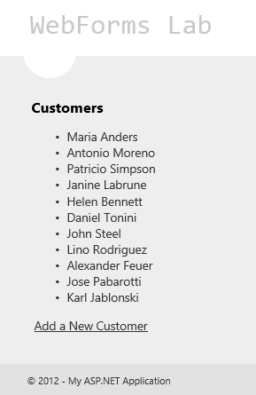

    *Listing the customers with a repeater*

    > [!NOTE]
    > In Visual Studio 2012, IIS Express is the default Web development server.
7. Close the browser and go back to Visual Studio.
8. Now replace the implementation to use strongly typed bindings. Open the **Customers.aspx** page and use the new **ItemType** attribute in the repeater to set the **Customer** type as the binding type.

    [!code-aspx[Main](whats-new-in-web-forms-in-aspnet-45/samples/sample4.aspx)]

    The ItemType property enables you to declare which type of data the control is going to be bound to and allows you to use strongly-typed binding inside the data-bound control.
9. Replace the ItemTemplate content with the following code.

    [!code-aspx[Main](whats-new-in-web-forms-in-aspnet-45/samples/sample5.aspx)]

    One downside with the above approaches is that the calls to Eval() and Bind() are late-bound - meaning you pass strings to represent the property names. This means you don't get Intellisense for the member names, support for code navigation (like Go To Definition), nor compile-time checking support.

    Setting the ItemType property causes two new typed variables to be generated in the scope of the data-binding expressions: **Item** and **BindItem**. You can use these strongly typed variables in the data-binding expressions and get the full benefits of the Visual Studio development experience.

    The &quot;**:** &quot; used in the expression will automatically HTML-encode the output to avoid security issues (for example, cross-site scripting attacks). This notation was available since .NET 4 for response writing, but now is also available in data-binding expressions.

    > [!NOTE]
    > The Item member works for one-way binding. If you want to perform two-way binding use the **BindItem** member.

    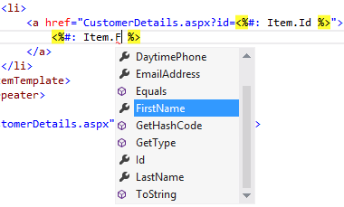

    *IntelliSense support in strongly-typed binding*
10. Press **F5** to run the solution and go to the Customers page to make sure the changes work as expected.

    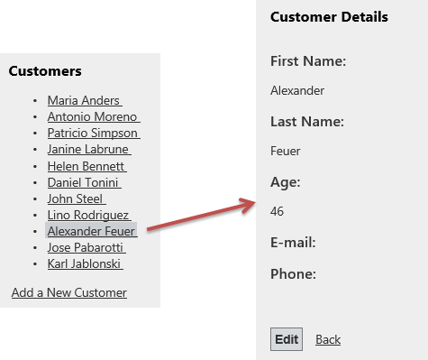

    *Listing customer details*
11. Close the browser and go back to Visual Studio.

#### Task 2 - Introducing Model Binding in Web Forms

In previous versions of ASP.NET Web Forms, when you wanted to perform two-way data-binding, both retrieving and updating data, you needed to use a Data Source object. This could be an Object Data Source, a SQL Data Source, a LINQ Data Source and so on. However if your scenario required custom code for handling the data, you needed to use the Object Data Source and this brought some drawbacks. For example, you needed to avoid complex types and you needed to handle exceptions when executing validation logic.

In the new version of ASP.NET Web Forms the data-bound controls support model binding. This means that you can specify select, update, insert and delete methods directly in the data-bound control to call logic from your code-behind file or from another class.

To learn about this, you will use a GridView to list the product categories using the new **SelectMethod** attribute. This attribute enables you to specify a method for retrieving the GridView data.

1. Open the **Products.aspx** page and include a **GridView**. Configure the GridView as shown below to use strongly-typed bindings and enable sorting and paging.

    [!code-aspx[Main](whats-new-in-web-forms-in-aspnet-45/samples/sample6.aspx)]
2. Use the new **SelectMethod** attribute to configure the GridView to call a **GetCategories** method to select the data.

    [!code-aspx[Main](whats-new-in-web-forms-in-aspnet-45/samples/sample7.aspx)]
3. Open the **Products.aspx.cs** code-behind file and add the following using statements.

    (Code Snippet - *Web Forms Lab - Ex01 - Namespaces*)

    [!code-csharp[Main](whats-new-in-web-forms-in-aspnet-45/samples/sample8.cs)]
4. Add a private member in the **Products** class and assign a new instance of **ProductsContext**. This property will store the Entity Framework data context that enables you to connect to the database.

    [!code-csharp[Main](whats-new-in-web-forms-in-aspnet-45/samples/sample9.cs)]
5. Create a **GetCategories** method to retrieve the list of categories using LINQ. The query will include the **Products** property so the GridView can show the amount of products for each category. Notice that the method returns a raw IQueryable object that represent the query to be executed later on the page lifecycle.

    (Code Snippet - *Web Forms Lab - Ex01 - GetCategories*)

    [!code-csharp[Main](whats-new-in-web-forms-in-aspnet-45/samples/sample10.cs)]

    > [!NOTE]
    > In previous versions of ASP.NET Web Forms, enabling sorting and paging using your own repository logic within an Object Data Source context, required to write your own custom code and receive all the necessary parameters. Now, as the data-binding methods can return IQueryable and this represents a query still to be executed, ASP.NET can take care of modifying the query to add the proper sorting and paging parameters.
6. Press **F5** to start debugging the site and go to the Products page. You should see that the GridView is populated with the categories returned by the GetCategories method.

    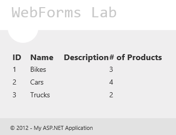

    *Populating a GridView using model binding*
7. Press **SHIFT**+**F5** Stop debugging.

#### Task 3 - Value Providers in Model Binding

Model binding not only enables you to specify custom methods to work with your data directly in the data-bound control, but also allows you to map data from the page into parameters from these methods. On the method parameter, you can use value provider attributes to specify the value's data source. For example:

- Controls on the page
- Query string values
- View data
- Session state
- Cookies
- Posted form data
- View state
- Custom value providers are supported as well

If you have used ASP.NET MVC 4, you will notice the model binding support is similar. Indeed, these features were taken from ASP.NET MVC and moved into the **System.Web** assembly to be able to use them on Web Forms as well.

In this task, you will update the GridView to filter its results by the amount of products for each category, receiving the filter parameter with model binding.

1. Go back to the **Products.aspx** page.
2. At the top of the GridView, add a **Label** and a **ComboBox** to select the number of products for each category as shown below.

    [!code-aspx[Main](whats-new-in-web-forms-in-aspnet-45/samples/sample11.aspx)]
3. Add an **EmptyDataTemplate** to the GridView to show a message when there are no categories with the selected number of products.

    [!code-aspx[Main](whats-new-in-web-forms-in-aspnet-45/samples/sample12.aspx)]
4. Open the **Products.aspx.cs** code-behind and add the following using statement.

    [!code-csharp[Main](whats-new-in-web-forms-in-aspnet-45/samples/sample13.cs)]
5. Modify the **GetCategories** method to receive an integer **minProductsCount** argument and filter the returned results. To do this, replace the method with the following code.

    (Code Snippet - *Web Forms Lab - Ex01 - GetCategories 2*)

    [!code-csharp[Main](whats-new-in-web-forms-in-aspnet-45/samples/sample14.cs)]

    The new **[Control]** attribute on the **minProductsCount** argument will let ASP.NET know its value must be populated using a control in the page. ASP.NET will look for any control matching the name of the argument (minProductsCount) and perform the necessary mapping and conversion to fill the parameter with the control value.

    Alternatively, the attribute provides an overloaded constructor that enables you to specify the control from where to get the value.

    > [!NOTE]
    > One goal of the data-binding features is to reduce the amount of code that needs to be written for page interaction. Apart from the [Control] value provider, you can use other model-binding providers in your method parameters. Some of them are listed in the task introduction.
6. Press **F5** to start debugging the site and go to the Products page. Select a number of products in the drop-down list and notice how the GridView is now updated.

    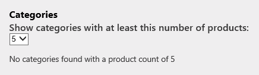

    *Filtering the GridView with a drop-down list value*
7. Stop debugging.

#### Task 4 - Using Model Binding for Filtering

In this task, you will add a second, child GridView to show the products within the selected category.

1. Open the **Products.aspx** page and update the categories GridView to auto-generate the Select button.

    [!code-aspx[Main](whats-new-in-web-forms-in-aspnet-45/samples/sample15.aspx)]
2. Add a second **GridView** named **productsGrid** at the bottom. Set the **ItemType** to **WebFormsLab.Model.Product**, the **DataKeyNames** to **ProductId** and the **SelectMethod** to **GetProducts**. Set **AutoGenerateColumns** to **false** and add the columns for ProductId, ProductName, Description and UnitPrice.

    [!code-aspx[Main](whats-new-in-web-forms-in-aspnet-45/samples/sample16.aspx)]
3. Open the **Products.aspx.cs** code-behind file. Implement the **GetProducts** method to receive the category ID from the category GridView and filter the products. Model binding will set the parameter value using the selected row in the **categoriesGrid**. Since the argument name and control name do not match, you should specify the name of the control in the Control value provider.

    (Code Snippet - *Web Forms Lab - Ex01 - GetProducts*)

    [!code-csharp[Main](whats-new-in-web-forms-in-aspnet-45/samples/sample17.cs)]

    > [!NOTE]
    > This approach makes it easier to unit test these methods. On a unit test context, where Web Forms is not executing, the [Control] attribute will not perform any specific action.
4. Open the **Products.aspx** page and locate the products GridView. Update the products GridView to show a link for editing the selected product.

    [!code-aspx[Main](whats-new-in-web-forms-in-aspnet-45/samples/sample18.aspx)]
5. Open the **ProductDetails.aspx** page code-behind and replace the **SelectProduct** method with the following code.

    (Code Snippet - *Web Forms Lab - Ex01 - SelectProduct Method*)

    [!code-csharp[Main](whats-new-in-web-forms-in-aspnet-45/samples/sample19.cs)]

    > [!NOTE]
    > Notice that the **[QueryString]** attribute is used to fill the method parameter from a productId parameter in the query string.
6. Press **F5** to start debugging the site and go to the Products page. Select any category from the categories GridView and notice that the products GridView is updated.

    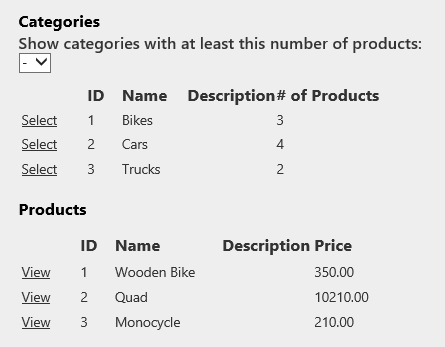

    *Showing products from the selected category*
7. Click the **View** link on a product to open the ProductDetails.aspx page.

    Notice that the page is retrieving the product with the SelectMethod using the productId parameter from the query string.

    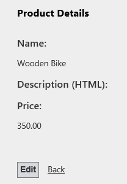

    *Viewing the product details*

    > [!NOTE]
    > The ability to type an HTML description will be implemented in the next exercise.

#### Task 5 - Using Model Binding for Update Operations

In the previous task, you have used model binding mainly for selecting data, in this task you will learn how to use model binding in update operations.

You will update the categories GridView to let the user update categories.

1. Open the **Products.aspx** page and update the categories GridView to auto-generate the Edit button and use the new **UpdateMethod** attribute to specify an **UpdateCategory** method to update the selected item.

    [!code-aspx[Main](whats-new-in-web-forms-in-aspnet-45/samples/sample20.aspx)]

    The DataKeyNames attribute in the GridView define which are the members that uniquely identify the model-bound object and therefore, which are the parameters the update method should at least receive.
2. Open the **Products.aspx.cs** code-behind file and implement the **UpdateCategory** method. The method should receive the category ID to load the current category, populate the values from the GridView and then update the category.

    (Code Snippet - *Web Forms Lab - Ex01 - UpdateCategory*)

    [!code-csharp[Main](whats-new-in-web-forms-in-aspnet-45/samples/sample21.cs)]

    The new **TryUpdateModel** method in the Page class is responsible of populating the model object using the values from the controls in the page. In this case, it will replace the updated values from the current GridView row being edited into the **category** object.

    > [!NOTE]
    > The next exercise will explain the usage of the ModelState.IsValid for validating the data entered by the user when editing the object.
3. Run the site and go to the Products page. Edit a category. Type a new name and then click **Update** to persist the changes.

    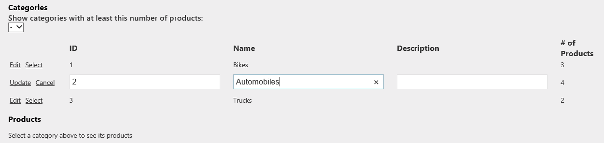

    *Editing categories*

### Exercise 2: Data Validation

In this exercise, you will learn about the new data validation features in ASP.NET 4.5. You will check out the new unobtrusive validation features in Web Forms. You will use data annotations in the application model classes for user input validation, and finally, you will learn how to turn on or off request validation to individual controls in a page.

#### Task 1 - Unobtrusive Validation

Forms with complex data including validators tend to generate too much JavaScript code in the page, which can represent about 60% of the code. With unobtrusive validation enabled, your HTML code will look cleaner and tidier.

In this section, you will enable unobtrusive validation in ASP.NET to compare the HTML code generated by both configurations.

1. Open **Visual Studio 2012** and open the **Begin** solution located in the **Source\Ex2-Validation\Begin** folder of this lab. Alternatively, you can continue working on your existing solution from the previous exercise.

    1. If you opened the provided **Begin** solution, you will need to download some missing NuGet packages before continue. To do this, in the Solution Explorer, click the **WebFormsLab** project **Manage NuGet Packages**.
    2. In the **Manage NuGet Packages** dialog, click **Restore** in order to download missing packages.
    3. Finally, build the solution by clicking **Build** | **Build Solution**.

    > [!NOTE]
    > One of the advantages of using NuGet is that you don't have to ship all the libraries in your project, reducing the project size. With NuGet Power Tools, by specifying the package versions in the Packages.config file, you will be able to download all the required libraries the first time you run the project. This is why you will have to run these steps after you open an existing solution from this lab.
2. Press **F5** to start the web application. Go to the Customers page and click the **Add a New Customer** link.
3. Right-click on the browser page, and select **View Source** option to open the HTML code generated by the application.

    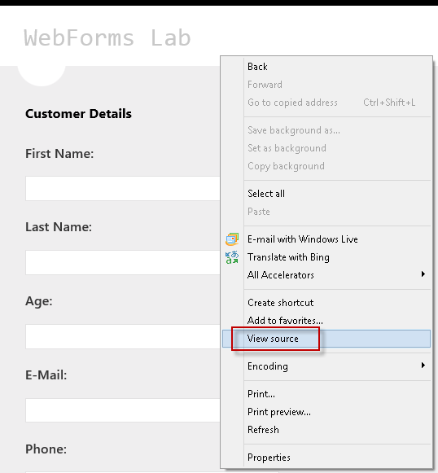

    *Showing the page HTML code*
4. Scroll through the page source code and notice that ASP.NET has injected JavaScript code and data validators in the page to perform the validations and show the error list.

    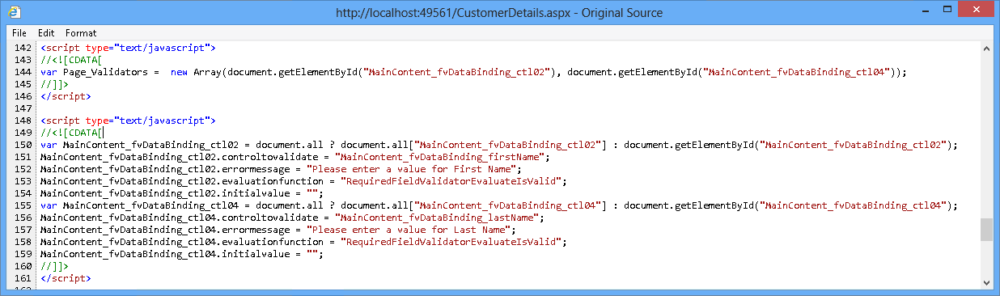

    *Validation JavaScript code in CustomerDetails page*
5. Close the browser and go back to Visual Studio.
6. Now you will enable unobtrusive validation. Open **Web.Config** and locate **ValidationSettings:UnobtrusiveValidationMode** key in the **AppSettings** section **.** Set the key value to **WebForms**.

    [!code-xml[Main](whats-new-in-web-forms-in-aspnet-45/samples/sample22.xml)]

    > [!NOTE]
    > You can also set this property in the &quot;**Page\_Load**&quot; event in case you want to enable Unobtrusive Validation only for some pages.
7. Open **CustomerDetails.aspx** and press **F5** to start the Web application.
8. Press the F12 key to open the IE developer tools. Once the developer tools is open, select the script tab. Select **CustomerDetails.aspx** from the menu and take note that the scripts required to run jQuery on the page have been loaded into the browser from the local site.

    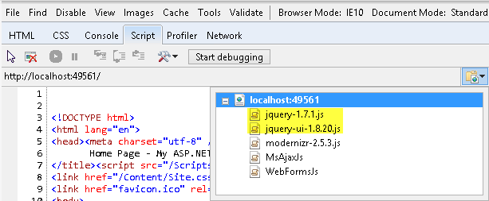

    *Loading the jQuery JavaScript files directly from the local IIS server*
9. Close the browser to return to Visual Studio. Open the **Site.Master** file again and locate the **ScriptManager**. Add the attribute **EnableCdn** property with the value **True**. This will force jQuery to be loaded from the online URL, not from the local site's URL.
10. Open **CustomerDetails.aspx** in Visual Studio. Press the F5 key to run the site. Once Internet Explorer opens, press the F12 key to open the developer tools. Select the **Script** tab, and then take a look at the drop-down list. Note the jQuery JavaScript files are no longer being loaded from the local site, but rather from the online jQuery CDN.

    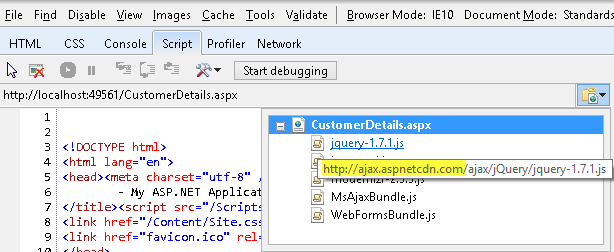

    *Loading the jQuery JavaScript files from the CDN*
11. Open the HTML page source code again using the View source option in the browser. Notice that by enabling the unobtrusive validation ASP.NET has replaced the injected JavaScript code with data- \*attributes.

    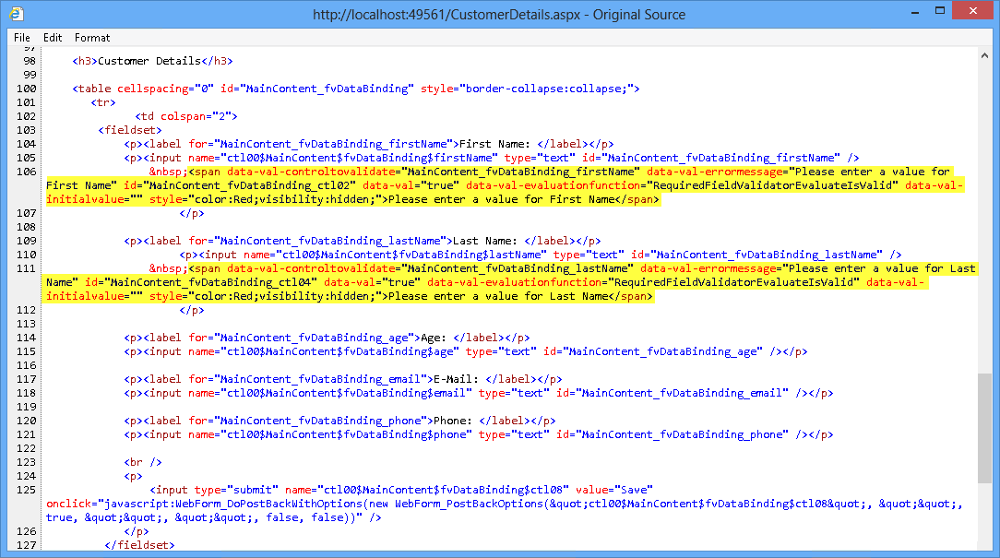

    *Unobtrusive validation code*

    > [!NOTE]
    > In this example, you saw how a validation summary with Data annotations was simplified to only a few HTML and JavaScript lines. Previously, without unobtrusive validation, the more validation controls you add, the bigger your JavaScript validation code will grow.

#### Task 2 - Validating the Model with Data Annotations

ASP.NET 4.5 introduces data annotations validation for Web Forms. Instead of having a validation control on each input, you can now define constraints in your model classes and use them across all your web application. In this section, you will learn how to use data annotations for validating a new/edit customer form.

1. Open **CustomerDetail.aspx** page. Notice that the customer first name and second name in the **EditItemTemplate** and **InsertItemTemplate** sections are validated using a RequiredFieldValidator controls. Each validator is associated to a particular condition, so you need to include as many validators as conditions to check.
2. Add data annotations to validate the Customer model class. Open **Customer.cs** class in the **Model** folder and *decorate* each property using data annotation attributes.

    (Code Snippet - *Web Forms Lab - Ex02 - Data Annotations*)

    [!code-csharp[Main](whats-new-in-web-forms-in-aspnet-45/samples/sample23.cs)]

    > [!NOTE]
    > .NET Framework 4.5 has extended the existing data annotation collection. These are some of the data annotations you can use: [CreditCard], [Phone], [EmailAddress], [Range], [Compare], [Url], [FileExtensions], [Required], [Key], [RegularExpression].
    > 
    > Some usage examples:
    > 
    > [Key]: Specifies that an attribute is the unique identifier
    > 
    > [Range(0.4, 0.5, ErrorMessage=&quot;{Write an error message}&quot;]: Double range
    > 
    > [EmailAddress(ErrorMessage=&quot;Invalid Email&quot;), MaxLength(56)]: Two annotations in the same line.
    > 
    > You can also define your own error messages within each attribute.
3. Open **CustomerDetails.aspx** and remove all the RequiredFieldvalidators for the first and last name fields in the in EditItemTemplate and InsertItemTemplate sections of the FormView control.

    [!code-aspx[Main](whats-new-in-web-forms-in-aspnet-45/samples/sample24.aspx)]

    > [!NOTE]
    > One advantage of using data annotations is that validation logic is not duplicated in your application pages. You define it once in the model, and use it across all the application pages that manipulate data.
4. Open **CustomerDetails.aspx** code-behind and locate the SaveCustomer method. This method is called when inserting a new customer and receives the Customer parameter from the FormView control values. When the mapping between the page controls and the parameter object occurrs, ASP.NET will execute the model validation against all the data annotation attributes and fill the ModelState dictionary with the errors encountered, if any.

    The ModelState.IsValid will only return true if all the fields on your model are valid after performing the validation.

    [!code-csharp[Main](whats-new-in-web-forms-in-aspnet-45/samples/sample25.cs)]
5. Add a **ValidationSummary** control at the end of the CustomerDetails page to show the list of model errors.

    [!code-aspx[Main](whats-new-in-web-forms-in-aspnet-45/samples/sample26.aspx)]

    The **ShowModelStateErrors** is a new property on the ValidationSummary control that when set to **true**, the control will show the errors from the ModelState dictionary. These errors come from the data annotations validation.
6. Press **F5** to run the Web application. Complete the form with some erroneous values and click **Save** to execute validation. Notice the error summary at the bottom.

    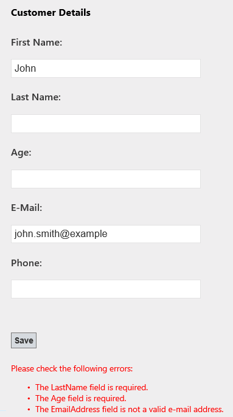

    *Validation with Data Annotations*

#### Task 3 - Handling Custom Database Errors with ModelState

In previous version of Web Forms, handling database errors such as a too long string or a unique key violation could involve throwing exceptions in your repository code and then handling the exceptions on your code-behind to display an error. A great amount of code is required to do something relatively simple.

In Web Forms 4.5, the ModelState object can be used to display the errors on the page, either from your model or from the database, in a consistent manner.

In this task, you will add code to properly handle database exceptions and show the appropriate message to the user using the ModelState object.

1. While the application is still running, try to update the name of a category using a duplicated value.

    

    *Updating a category with a duplicated name*

    Notice that an exception is thrown due to the &quot;unique&quot; constraint of the **CategoryName** column.

    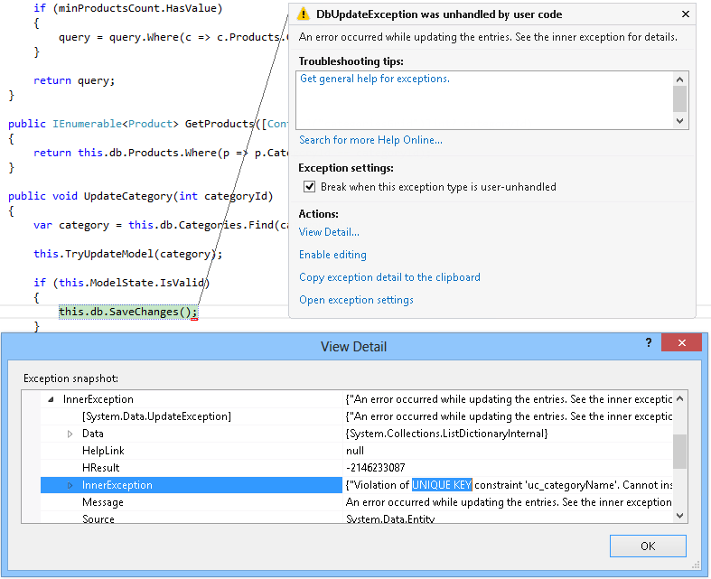

    *Exception for duplicated category names*
2. Stop debugging. In the **Products.aspx.cs** code-behind file, update the **UpdateCategory** method to handle the exceptions thrown by the db.SaveChanges() method call and add an error to the **ModelState** object.

    The new **TryUpdateModel** method updates the category object retrieved from the database using the form data provided by the user.

    (Code Snippet - *Web Forms Lab - Ex02 - UpdateCategory Handle Errors*)

    [!code-csharp[Main](whats-new-in-web-forms-in-aspnet-45/samples/sample27.cs)]

    > [!NOTE]
    > Ideally, you would have to identify the cause of the DbUpdateException and check if the root cause is the violation of a unique key constraint.
3. Open **Products.aspx** and add a **ValidationSummary** control below the categories GridView to show the list of model errors.

    [!code-aspx[Main](whats-new-in-web-forms-in-aspnet-45/samples/sample28.aspx)]
4. Run the site and go to the Products page. Try to update the name of a category using an duplicated value.

    Notice that the exception was handled and the error message appears in the **ValidationSummary** control.

    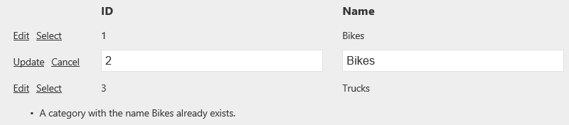

    *Duplicated category error*

#### Task 4 - Request Validation in ASP.NET Web Forms 4.5

The request validation feature in ASP.NET provides a certain level of default protection against cross-site scripting (XSS) attacks. In previous versions of ASP.NET, request validation was enabled by default and could only be disabled for an entire page. With the new version of ASP.NET Web Forms you can now disable the request validation for a single control, perform lazy request validation or access un-validated request data (be careful if you do so!).

1. Press **Ctrl+F5** to start the site without debugging and go to the Products page. Select a category and then click the **Edit** link on any of the products.
2. Type a description containing potentially dangerous content, for instance including HTML tags. Take notice of the exception thrown due to the request validation.

    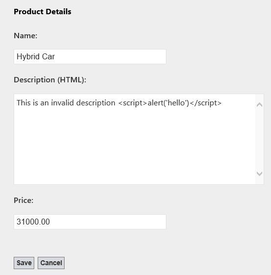

    *Editing a product with potentially dangerous content*

    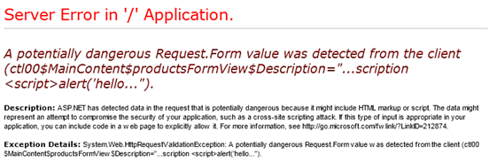

    *Exception thrown due to request validation*
3. Close the page and, in Visual Studio, press **SHIFT+F5** to stop debugging.
4. Open the **ProductDetails.aspx** page and locate the **Description** TextBox.
5. Add the new **ValidateRequestMode** property to the TextBox and set its value to **Disabled**.

    The new **ValidateRequestMode** attribute allows you to disable the request validation granularly on each control. This is useful when you want to use an input that may receive HTML code, but want to keep the validation working for the rest of the page.

    [!code-aspx[Main](whats-new-in-web-forms-in-aspnet-45/samples/sample29.aspx)]
6. Press **F5** to run the web application. Open the edit product page again and complete a product description including HTML tags. Notice that you can now add HTML content to the description.

    

    *Request validation disabled for the product description*

    > [!NOTE]
    > In a production application, you should sanitize the HTML code entered by the user to make sure only safe HTML tags are entered (for example, there are no &lt;script&gt; tags). To do this, you can use [Microsoft Web Protection Library](http://wpl.codeplex.com/).
7. Edit the product again. Type HTML code in the Name field and click **Save**. Notice that Request Validation is only disabled for the Description field and the rest of the fields re still validated against the potentially dangerous content.

    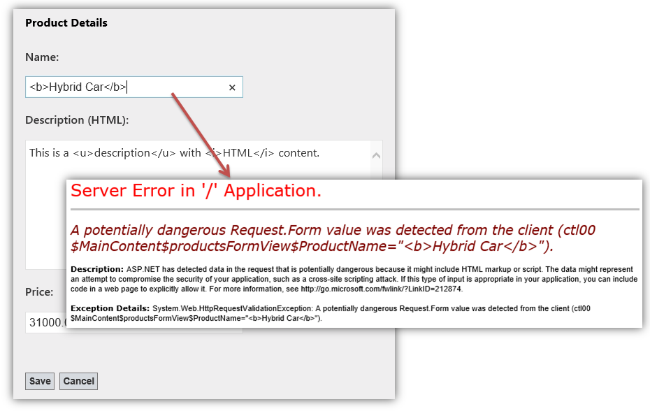

    *Request validation enabled in the rest of the fields*

    ASP.NET Web Forms 4.5 includes a new request validation mode to perform request validation lazily. With the request validation mode set to **4.5**, if a piece of code accesses *Request.Form[&quot;key&quot;]*, ASP.NET 4.5's request validation will only trigger request validation for that specific element in the form collection.

    Additionally, ASP.NET 4.5 now includes core encoding routines from the Microsoft Anti-XSS Library v4.0. The Anti-XSS encoding routines are implemented by the new *AntiXssEncoder* type found in the new **System.Web.Security.AntiXss** namespace. With the **encoderType** parameter configured to use *AntiXssEncoder*, all output encoding within ASP.NET automatically uses the new encoding routines.
8. ASP.NET 4.5 request validation also supports un-validated access to request data. ASP.NET 4.5 adds a new collection property to the **HttpRequest** object called **Unvalidated**. When you navigate into **HttpRequest.Unvalidated** you have access to all of the common pieces of request data, including Forms, QueryStrings, Cookies, URLs, and so on.

    

    *Request.Unvalidated object*

    > [!NOTE]
    > **Please use the HttpRequest.Unvalidated property with caution!** Make sure you carefully perform custom validation on the raw request data to ensure that dangerous text is not round-tripped and rendered back to unsuspecting customers!

### Exercise 3: Asynchronous Page Processing in ASP.NET Web Forms

In this exercise, you will be introduced to the new asynchronous page processing features in ASP.NET Web Forms.

#### Task 1 - Updating the Product Details Page to Upload and Show Images

In this task, you will update the product details page to allow the user to specify an image URL for the product and display it in the read-only view. You will create a local copy of the specified image by downloading it synchronously. In the next task, you will update this implementation to make it work asynchronously.

1. Open **Visual Studio 2012** and load the **Begin** solution located in **Source\Ex3-Async\Begin** from this lab's folder. Alternatively, you can continue working on your existing solution from the previous exercises.

    1. If you opened the provided **Begin** solution, you will need to download some missing NuGet packages before continue. To do this, in the Solution Explorer, click the **WebFormsLab** project and select **Manage NuGet Packages**.
    2. In the **Manage NuGet Packages** dialog, click **Restore** in order to download missing packages.
    3. Finally, build the solution by clicking **Build** | **Build Solution**.

    > [!NOTE]
    > One of the advantages of using NuGet is that you don't have to ship all the libraries in your project, reducing the project size. With NuGet Power Tools, by specifying the package versions in the Packages.config file, you will be able to download all the required libraries the first time you run the project. This is why you will have to run these steps after you open an existing solution from this lab.
2. Open the **ProductDetails.aspx** page source and add a field in the FormView's ItemTemplate to show the product image.

    [!code-aspx[Main](whats-new-in-web-forms-in-aspnet-45/samples/sample30.aspx)]
3. Add a field to specify the image URL in the FormView's EditTemplate.

    [!code-aspx[Main](whats-new-in-web-forms-in-aspnet-45/samples/sample31.aspx)]
4. Open the **ProductDetails.aspx.cs** code-behind file and add the following namespace directives.

    (Code Snippet - *Web Forms Lab - Ex03 - Namespaces*)

    [!code-csharp[Main](whats-new-in-web-forms-in-aspnet-45/samples/sample32.cs)]
5. Create an **UpdateProductImage** method to store remote images in the local **Images** folder and update the product entity with the new image location value.

    (Code Snippet - *Web Forms Lab - Ex03 - UpdateProductImage*)

    [!code-csharp[Main](whats-new-in-web-forms-in-aspnet-45/samples/sample33.cs)]
6. Update the **UpdateProduct** method to call the **UpdateProductImage** method.

    (Code Snippet - *Web Forms Lab - Ex03 - UpdateProductImage Call*)

    [!code-csharp[Main](whats-new-in-web-forms-in-aspnet-45/samples/sample34.cs)]
7. Run the application and try to upload an image for a product. For example, you can use the following image URL from Office Clip Arts: [[http://officeimg.vo.msecnd.net/en-us/images/MB900437099.jpg](http://officeimg.vo.msecnd.net/en-us/images/MB900437099.jpg)](http://officeimg.vo.msecnd.net/en-us/images/MB900437099.jpg)

    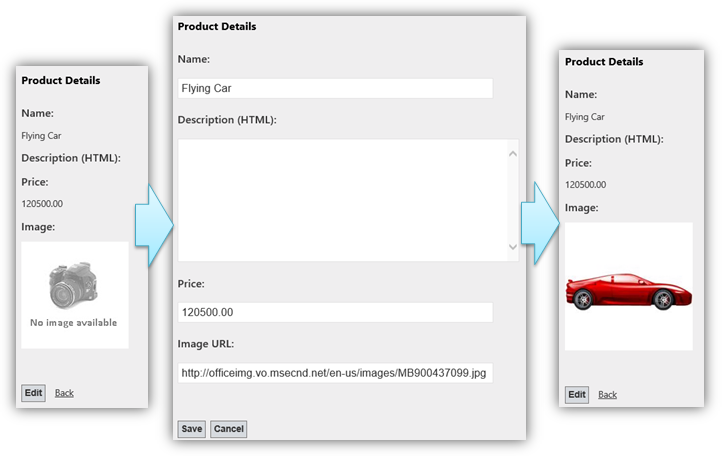

    *Setting an image for a product*

#### Task 2 - Adding Asynchronous Processing to the Product Details Page

In this task, you will update the product details page to make it work asynchronously. You will enhance a long running task - the image download process - by using ASP.NET 4.5 asynchronous page processing.

Asynchronous methods in web applications can be used to optimize the way ASP.NET thread pools are used. In ASP.NET there are a limited number of threads in the thread pool for attending requests, thus, when all the threads are busy, ASP.NET starts to reject new requests, sends application error messages and makes your site unavailable.

Time-consuming operations on your web site are great candidates for asynchronous programming because they occupy the assigned thread for a long time. This includes long running requests, pages with lots of different elements and pages that require offline operations, such querying a database or accessing an external web server. The advantage is that if you use asynchronous methods for these operations, while the page is processing, the thread is freed and returned to the thread pool and can be used to attend to a new page request. This means, the page will start processing in one thread from the thread pool and might complete processing in a different one, after the async processing completes.

1. Open the **ProductDetails.aspx** page. Add the **Async** attribute in the **Page** element and set it to **true**. This attribute tells ASP.NET to implement the IHttpAsyncHandler interface.

    [!code-aspx[Main](whats-new-in-web-forms-in-aspnet-45/samples/sample35.aspx)]
2. Add a Label at the bottom of the page to show the details of the threads running the page.

    [!code-aspx[Main](whats-new-in-web-forms-in-aspnet-45/samples/sample36.aspx)]
3. Open up **ProductDetails.aspx.cs** and add the following namespace directives.

    (Code Snippet - *Web Forms Lab - Ex03 - Namespaces 2*)

    [!code-csharp[Main](whats-new-in-web-forms-in-aspnet-45/samples/sample37.cs)]
4. Modify the **UpdateProductImage** method to download the image with an asynchronous task. You will replace the **WebClient** **DownloadFile** method with the **DownloadFileTaskAsync** method and include the **await** keyword.

    (Code Snippet - *Web Forms Lab - Ex03 - UpdateProductImage Async*)

    [!code-csharp[Main](whats-new-in-web-forms-in-aspnet-45/samples/sample38.cs)]

    The RegisterAsyncTask registers a new page asynchronous task to be executed in a different thread. It receives a lambda expression with the Task (t) to be executed. The **await** keyword in the **DownloadFileTaskAsync** method converts the remainder of the method into a callback that is invoked asynchronously after the **DownloadFileTaskAsync** method has completed. ASP.NET will resume the execution of the method by automatically maintaining all the HTTP request original values. The new asynchronous programming model in .NET 4.5 enables you to write asynchronous code that looks very much like synchronous code, and let the compiler handle the complications of callback functions or continuation code.
	> [!NOTE]
    > RegisterAsyncTask and PageAsyncTask were already available since .NET 2.0. The await keyword is new from the .NET 4.5 asynchronous programming model and can be used together with the new TaskAsync methods from the .NET WebClient object.
5. Add code to display the threads on which the code started and finished executing. To do this, update the **UpdateProductImage** method with the following code.

    (Code Snippet - *Web Forms Lab - Ex03 - Show threads*)

    [!code-csharp[Main](whats-new-in-web-forms-in-aspnet-45/samples/sample39.cs)]
6. Open the web site's **Web.config** file. Add the following appSetting variable.

    [!code-xml[Main](whats-new-in-web-forms-in-aspnet-45/samples/sample40.xml)]
7. Press **F5** to run the application and upload an image for the product. Notice the threads ID where the code started and finished may be different. This is because asynchronous tasks run on a separate thread from ASP.NET thread pool. When the task completes, ASP.NET puts the task back in the queue and assigns any of the available threads.

    

    *Downloading an image asynchronously*

> [!NOTE]
> Additionally, you can deploy this application to Azure following [Appendix B: Publishing an ASP.NET MVC 4 Application using Web Deploy](#AppendixB).

* * *

## Summary

In this hands-on lab, the following concepts have been addressed and demonstrated:

- Use strongly-typed data-binding expressions
- Use new model binding features in Web Forms
- Use value providers for mapping page data to code-behind methods
- Use Data Annotations for user input validation
- Take advange of unobstrusive client-side validation with jQuery in Web Forms
- Implement granular request validation
- Implement asynchronous page processing in Web Forms

## Appendix A: Installing Visual Studio Express 2012 for Web

You can install **Microsoft Visual Studio Express 2012 for Web** or another &quot;Express&quot; version using the **[Microsoft Web Platform Installer](https://www.microsoft.com/web/downloads/platform.aspx)**. The following instructions guide you through the steps required to install *Visual studio Express 2012 for Web* using *Microsoft Web Platform Installer*.

1. Go to [[https://go.microsoft.com/?linkid=9810169](https://go.microsoft.com/?linkid=9810169)](https://go.microsoft.com/?linkid=9810169). Alternatively, if you already have installed Web Platform Installer, you can open it and search for the product &quot;*Visual Studio Express 2012 for Web with Azure SDK*&quot;.
2. Click on **Install Now**. If you do not have **Web Platform Installer** you will be redirected to download and install it first.
3. Once **Web Platform Installer** is open, click **Install** to start the setup.

    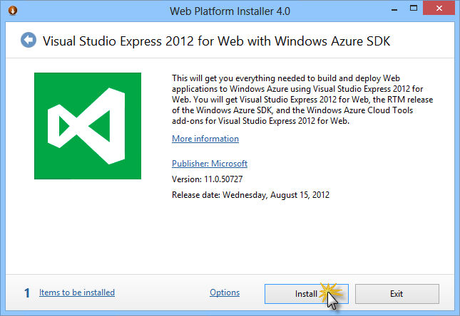

    *Install Visual Studio Express*
4. Read all the products' licenses and terms and click **I Accept** to continue.

    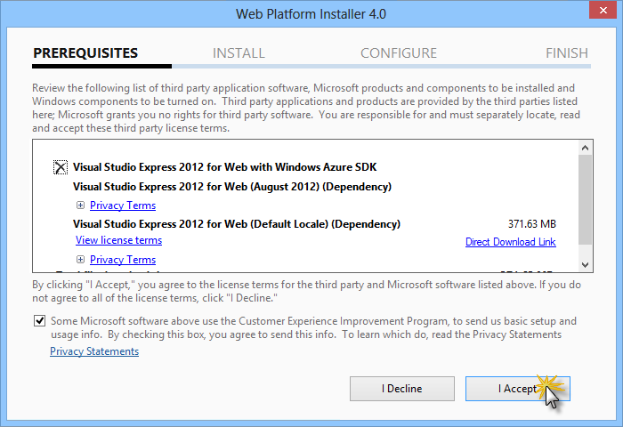

    *Accepting the license terms*
5. Wait until the downloading and installation process completes.

    

    *Installation progress*
6. When the installation completes, click **Finish**.

    

    *Installation completed*
7. Click **Exit** to close Web Platform Installer.
8. To open Visual Studio Express for Web, go to the **Start** screen and start writing &quot;**VS Express**&quot;, then click on the **VS Express for Web** tile.

    

    *VS Express for Web tile*

## Appendix B: Publishing an ASP.NET MVC 4 Application using Web Deploy

This appendix will show you how to create a new web site from the Azure Portal and publish the application you obtained by following the lab, taking advantage of the Web Deploy publishing feature provided by Azure.

#### Task 1 - Creating a New Web Site from the Azure Portal

1. Go to the [Azure Management Portal](https://manage.windowsazure.com/) and sign in using the Microsoft credentials associated with your subscription.

    > [!NOTE]
    > With Azure you can host 10 ASP.NET Web Sites for free and then scale as your traffic grows. You can sign up [here](http://aka.ms/aspnet-hol-azure).

    

    *Log on to the Portal*
2. Click **New** on the command bar.

    

    *Creating a new Web Site*
3. Click **Compute** | **Web Site**. Then select **Quick Create** option. Provide an available URL for the new web site and click **Create Web Site**.

    > [!NOTE]
    > Azure is the host for a web application running in the cloud that you can control and manage. The Quick Create option allows you to deploy a completed web application to the Azure from outside the portal. It does not include steps for setting up a database.

    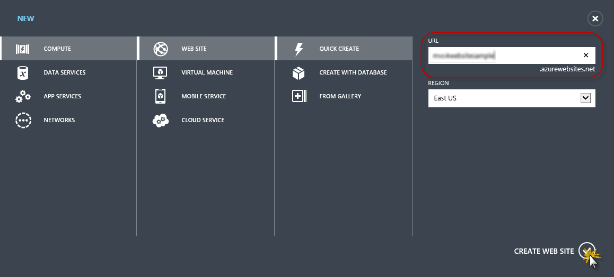

    *Creating a new Web Site using Quick Create*
4. Wait until the new **Web Site** is created.
5. Once the Web Site is created click the link under the **URL** column. Check that the new Web Site is working.

    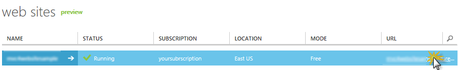

    *Browsing to the new web site*

    

    *Web site running*
6. Go back to the portal and click the name of the web site under the **Name** column to display the management pages.

    

    *Opening the Web Site management pages*
7. In the **Dashboard** page, under the **quick glance** section, click the **Download publish profile** link.

    > [!NOTE]
    > The *publish profile* contains all of the information required to publish a web application to Azure for each enabled publication method. The publish profile contains the URLs, user credentials and database strings required to connect to and authenticate against each of the endpoints for which a publication method is enabled. **Microsoft WebMatrix 2**, **Microsoft Visual Studio Express for Web** and **Microsoft Visual Studio 2012** support reading publish profiles to automate configuration of these programs for publishing web applications to Azure.

    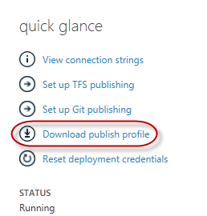

    *Downloading the Web Site publish profile*
8. Download the publish profile file to a known location. Further in this exercise you will see how to use this file to publish a web application to Azure from Visual Studio.

    

    *Saving the publish profile file*

#### Task 2 - Configuring the Database Server

If your application makes use of SQL Server databases you will need to create a SQL Database server. If you want to deploy a simple application that does not use SQL Server you might skip this task.

1. You will need a SQL Database server for storing the application database. You can view the SQL Database servers from your subscription in the Azure Management portal at **Sql Databases** | **Servers** | **Server's Dashboard**. If you do not have a server created, you can create one using the **Add** button on the command bar. Take note of the **server name and URL, administrator login name and password**, as you will use them in the next tasks. Do not create the database yet, as it will be created in a later stage.

    

    *SQL Database Server Dashboard*
2. In the next task you will test the database connection from Visual Studio, for that reason you need to include your local IP address in the server's list of **Allowed IP Addresses**. To do that, click **Configure**, select the IP address from **Current Client IP Address** and paste it on the **Start IP Address** and **End IP Address** text boxes and click the  button.

    

    *Adding Client IP Address*
3. Once the **Client IP Address** is added to the allowed IP addresses list, click on **Save** to confirm the changes.

    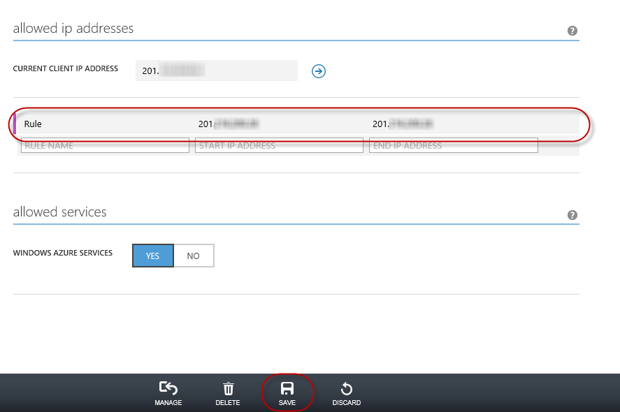

    *Confirm Changes*

#### Task 3 - Publishing an ASP.NET MVC 4 Application using Web Deploy

1. Go back to the ASP.NET MVC 4 solution. In the **Solution Explorer**, right-click the web site project and select **Publish**.

    

    *Publishing the web site*
2. Import the publish profile you saved in the first task.

    

    *Importing publish profile*
3. Click **Validate Connection**. Once Validation is complete click **Next**.

    > [!NOTE]
    > Validation is complete once you see a green checkmark appear next to the Validate Connection button.

    

    *Validating connection*
4. In the **Settings** page, under the **Databases** section, click the button next to your database connection's textbox (i.e. **DefaultConnection**).

    

    *Web deploy configuration*
5. Configure the database connection as follows:

    - In the **Server name** type your SQL Database server URL using the *tcp:* prefix.
    - In **User name** type your server administrator login name.
    - In **Password** type your server administrator login password.
    - Type a new database name.

    

    *Configuring destination connection string*
6. Then click **OK**. When prompted to create the database click **Yes**.

    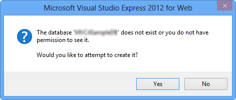

    *Creating the database*
7. The connection string you will use to connect to SQL Database in Azure is shown within Default Connection textbox. Then click **Next**.

    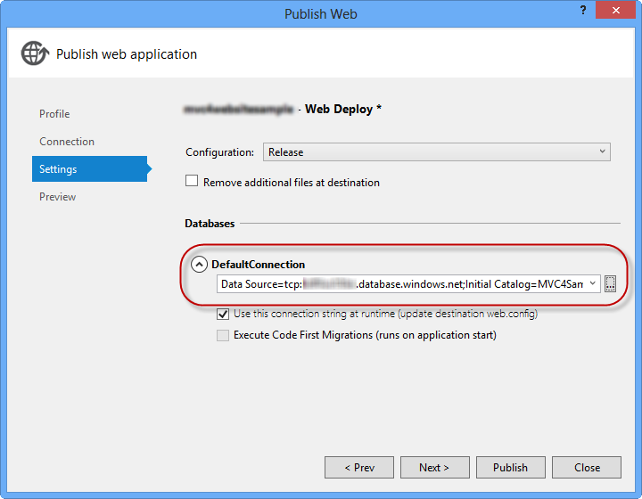

    *Connection string pointing to SQL Database*
8. In the **Preview** page, click **Publish**.

    

    *Publishing the web application*
9. Once the publishing process finishes, your default browser will open the published web site.

## Appendix C: Using Code Snippets

With code snippets, you have all the code you need at your fingertips. The lab document will tell you exactly when you can use them, as shown in the following figure.

*Using Visual Studio code snippets to insert code into your project*

***To add a code snippet using the keyboard (C# only)***

1. Place the cursor where you would like to insert the code.
2. Start typing the snippet name (without spaces or hyphens).
3. Watch as IntelliSense displays matching snippets' names.
4. Select the correct snippet (or keep typing until the entire snippet's name is selected).
5. Press the Tab key twice to insert the snippet at the cursor location.

*Start typing the snippet name*

*Press Tab to select the highlighted snippet*

*Press Tab again and the snippet will expand*

***To add a code snippet using the mouse (C#, Visual Basic and XML)*** 1. Right-click where you want to insert the code snippet.

1. Select **Insert Snippet** followed by **My Code Snippets**.
2. Pick the relevant snippet from the list, by clicking on it.

*Right-click where you want to insert the code snippet and select Insert Snippet*

*Pick the relevant snippet from the list, by clicking on it*
