Using Page Inspector for Visual Studio 2012 in ASP.NET Web Forms
====================
by Tim Ammann

> Page Inspector for Visual Studio 2012 is a web development tool with an integrated browser. Select any element in the integrated browser, and Page Inspector instantly highlights the element's source and CSS. You can browse any page in your application, quickly find the sources of rendered markup, and use browser tools right within the Visual Studio environment.
> 
> This tutorial shwos how to enable Inspection Mode and then quickly locate and edit CSS rules and text within your web project. The tutorial uses a Web Forms Application Project, but you can also use Page Inspector for Web Site projects and [MVC](https://go.microsoft.com/?linkid=9802002) applications.
> 
> The tutorial has the following sections:
> 
> [Prerequisites](#_1_prerequisites)
> 
> [Create a Web Application](#_2_creating_a)
> 
> [Use Page Inspector to View the Application](#_3_using_page)
> 
> [Enable Inspection Mode](#_4_inspection_mode)
> 
> [Use Page Inspector to Make Changes to Markup](#_5_using_page)
> 
> [Inspection Mode and the HTML Window](#_6_inspection_mode)
> 
> [Preview CSS Changes in the Styles Window](#_7_previewing_css)
> 
> [CSS Auto Sync](#css_auto_sync)
> 
> [Using the CSS Color Picker](#css_color_picker)

## Prerequisites

- [Visual Studio 2012](https://www.microsoft.com/visualstudio/11/en-us) or [Visual Studio Express 2012 for Web](https://www.microsoft.com/visualstudio/11/en-us/downloads#express-web).

> [!NOTE]
> To get the latest version of Page Inspector, use [Web Platform Installer](https://go.microsoft.com/fwlink/?LinkId=255386) to install the Azure SDK for .NET 2.0.

Page Inspector is bundled with Microsoft Web Developer Tools. The latest version is 1.3. To check which version you have, run Visual Studio and select **About Microsoft Visual Studio** from the **Help** menu.

## Create a Web Application

First, you will create a web application that you will use Page Inspector with. In Visual Studio, choose **File** &gt; **New Project**. On the left, expand **Visual C#**, select **Web**, and then select **ASP.NET Web Forms Application**.

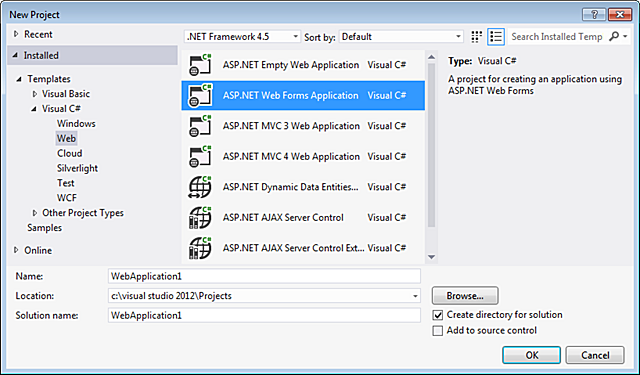

Click **OK**.

The application opens in **Source** view.

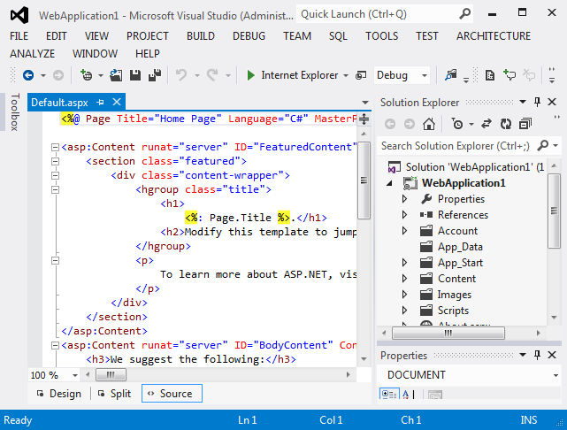

Now that you have an application to work with, you can use Page Inspector to examine and modify it.

## Use Page Inspector to View the Application

Next, you will view the application with Page Inspector. In **Solution Explorer**, right click the project, and then choose **View in Page Inspector**.

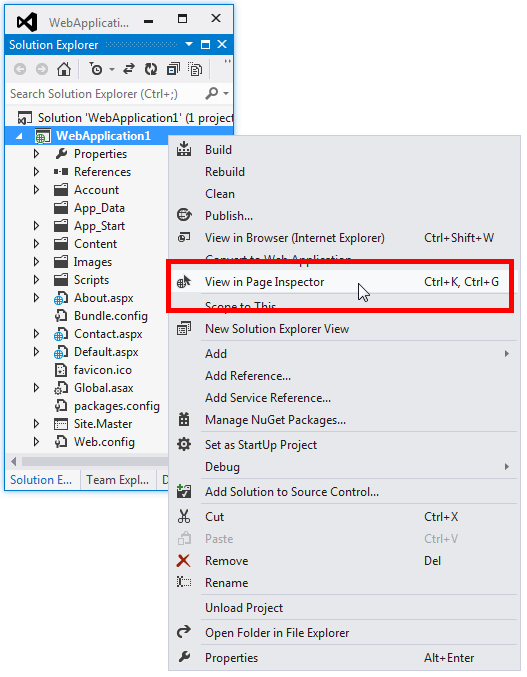

By default, when Page Inspector launches for the first time, it is docked as a narrow window on the left side of the Visual Studio environment. Leave it docked on the left side and set it to a width that is comfortable for you, or dock it in one of the tool areas on the top, bottom, or right:

If you undock the Page Inspector window, you can place it outside Visual Studio, or even on a second monitor if you have one. However, in order to ALT+TAB between Page Inspector and Visual Studio when the Page Inspector window is undocked, go to **Tools** &gt; **Options** &gt; **Environment** &gt; **Tabs and Windows**, and under **Tab Well**, clear the check box called **Floating tool windows always stay on top of the main window**:

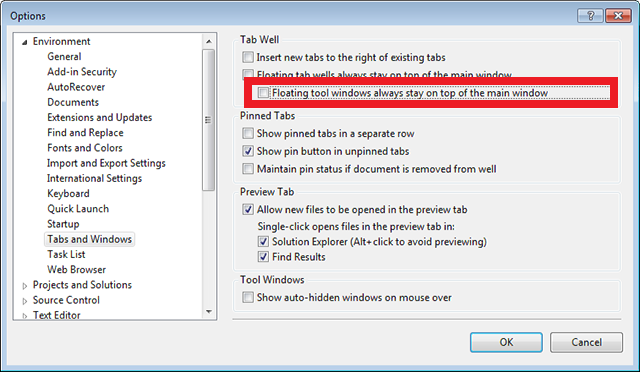

The top pane of the Page Inspector window shows the current page in a browser window. The bottom pane shows the page in HTML markup on the left, and some tabs on the right that let you inspect different aspects of the page. The bottom pane is similar to the [F12 Developer Tools](https://msdn.microsoft.com/en-us/ie/aa740478) in Internet Explorer. (However, unlike the developer tools, you can use Page Inspector right within Visual Studio.)

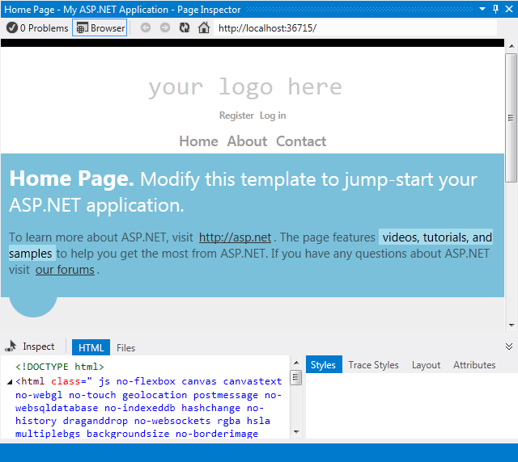

In this tutorial, you will use the Page Inspector browser pane, and the **HTML** and **Styles** tabs to help you rapidly navigate and make changes to the application.

## Enable Inspection Mode

Next, you will see how Page Inspector's Inspection Mode works. In the Page Inspector window, click the **Inspect** button.

To see inspection mode in action, move your mouse over different parts of the page within the Page Inspector browser window. As you do, the mouse pointer changes to a large plus sign, and the element underneath is highlighted:

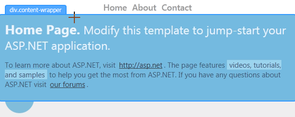

As you move the mouse pointer, note that

- The content in **Source** view changes to show the markup corresponding to the selected element on the page. The relevant markup is highlighted. If the source is in another file, that file is opened in Source view with the relevant markup highlighted.

- The markup displayed in the **HTML** tab in Page Inspector also changes to correspond to the selected element on the page. In the **HTML** tab, the relevant markup is outlined.

- The **Styles** tab shows the CSS rules relevant to the current selection.

## Use Page Inspector to Make Changes to Markup

Now you will see how you can use Page Inspector to find and make changes to markup or text whose location might not be immediately obvious.

Put Page Inspector in Inspection Mode and then scroll to the bottom of the home page.

As soon as you enter the footer area, Page Inspector opens the *Site.Master* layout file in **Source** view in a temporary tab to the right of the other tabs and highlights the section of the master page that you have selected. This shows you how Page Inspector can find and display content on a page that might actually come from a different file than the one you originally opened.

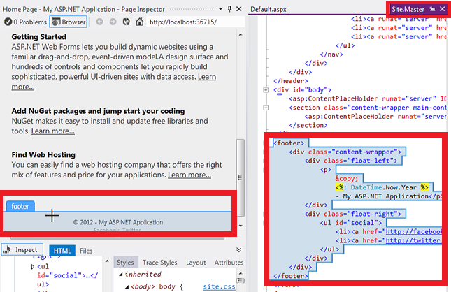

In the Page Inspector browser window, move your mouse pointer over the line with the copyright notice.

In the *Site.Master* page, the corresponding line is highlighted.

Add some text to the end of the line in the *Site.Master* file.

&lt;p&gt;&amp;copy; &lt;%: DateTime.Now.Year %&gt; - My ASP.NET Application Rocks!&lt;/p&gt;

Now, press Ctrl+Alt+Enter or click the Update Bar to see the results in the Page Inspector browser window.

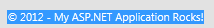

You might have thought that the footer was on the *Default.aspx* page, but it turned out to be in the master layout page, and Page Inspector found it for you.

## Inspection Mode and the HTML Window

Next, you will have a quick look at the HTML window and how it maps elements for you.

Put Page Inspector in Inspection Mode.

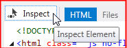

Click the top part of the page that says "your logo here". You are examining a particular element in more detail, so the display in the browser window no longer changes as you move the mouse pointer.

Now move the mouse pointer to the **HTML** window. As you move the mouse pointer, Page Inspector outlines the element within the **HTML** window and highlights the corresponding element in the browser window.

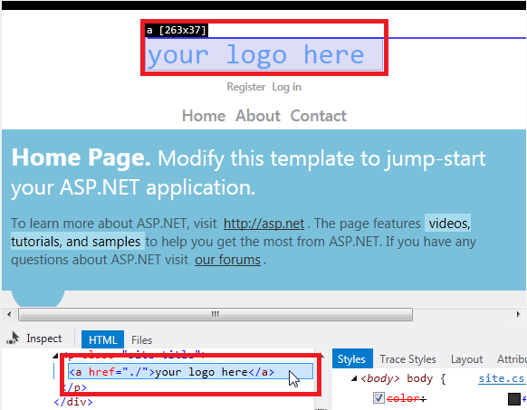

As before, Page Inspector opens the *Site.Master* file for you in a temporary tab. Click the Site.Master tab, and the corresponding markup is highlighted in the &lt;header&gt; section:

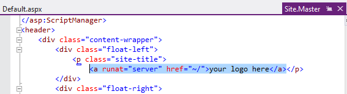

## Preview CSS Changes in the Styles Window

Next, you will see how you can use the Page Inspector **Styles** window to preview changes to CSS.

Click the **Inspect** button to put Page Inspector in Inspection Mode.

In the Page Inspector browser window, move the mouse pointer over the "Home Page" section until the **div.content-wrapper** label appears.

Click within the div.content-wrapper section once, and then move the mouse pointer to the **Styles** window. Under the .featured .content-wrapper class selector, clear and select the checkbox for the background-color property.

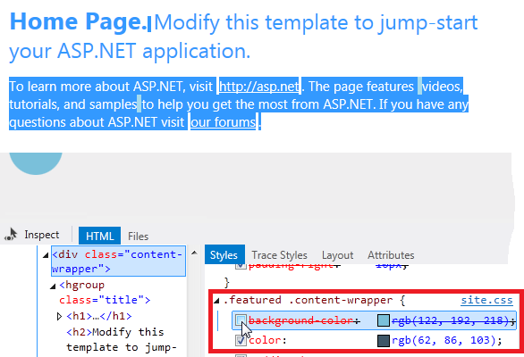

Notice how the change previews instantly in the Page Inspector browser window.

Select the checkbox again, then double-click the property value and change it to `red`. The change shows immediately:

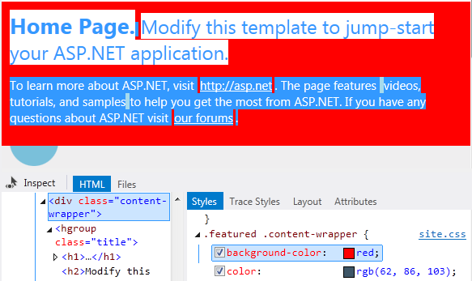

The **Styles** window makes it easy to test and preview CSS changes before you commit the changes to the style sheet itself.

## CSS Auto Sync

> [!NOTE]
> This feature requires version 1.3 of Page Inspector.

The CSS Auto-Sync feature allows you to edit a CSS file directly, and see the changes immediately in the Page Inspector browser.

Click **Inspect** to put Page Inspector in Inspection Mode.

In the Page Inspector browser, move the mouse pointer over the "Home Page" section until the **div.content-wrapper** label appears. Click once to select this element.

The **Syles** window shows all of the CSS rules for this element. Scroll down to find the .featured .content-wrapper class selector. Click on ".featured .content-wrapper". Page Inspector opens the CSS file that defines this style (Site.css) and highlights the corresponding CSS style.

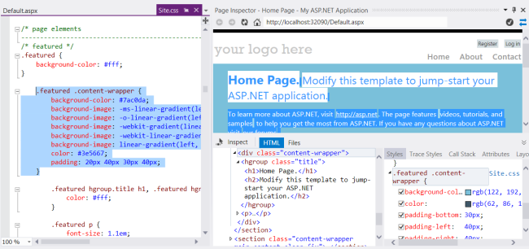

Now change the value for `background-color` to "red". The change appears immediately in the Page Inspector browser.

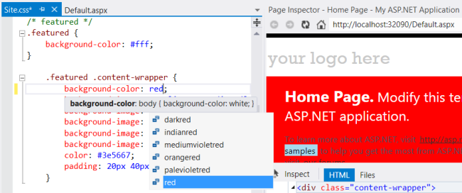

## Using the CSS Color Picker

Next, you'll learn how to use Page Inspector to quickly find and change the CSS for highlighted text in the default application. In this example, you've decided that you don't like the blue highlighting and want to change it to another color.

Click the **Inspect** button.

In the Page Inspector browser window, move the mouse pointer over the highlighted "videos, tutorials, and samples" text so that the CSS "mark" label appears.

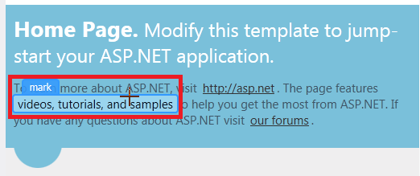

Click the text to select it. The corresponding CSS mark selector appears at the bottom of the **Styles** window.

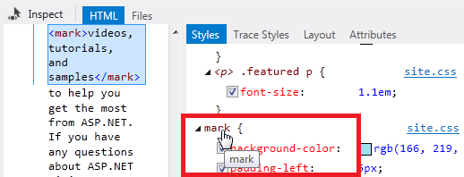

Click the mark selector. This opens the *Site.css* file for the web application. Click the Site.css tab, and the corresponding CSS for the selector is highlighted:

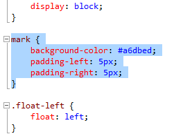

Select and remove the line with the background-color property.

You will now use the new Visual Studio 2012 CSS color picker to choose a new color for the **mark** background-color property.

### Using the Visual Studio 2012 CSS Color Picker

The CSS editor in Visual Studio 2012 has a color picker that makes it easy to choose and insert colors. It has a simple color bar and a "pop-down" picker that offers finer control.

The color picker includes a standard palette of colors, supports standard color names, hash codes, RGB, RGBA, HSL, and HSLA colors, and maintains a list of the colors you've used most recently in the document.

On the line where the background-color property was, type "bc" and press the down arrow once.

When you type the first character of each word in a hyphen-separated property like "background-color", IntelliSense filters the list for you to show only the properties that match:

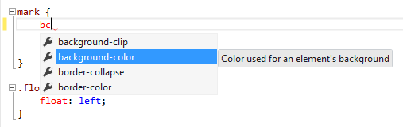

Now type a colon. When you do, the full background-color property name is inserted. Type **#** or **rgb(**, and the color picker bar appears:

To see how the color picker bar works, click its colors with the mouse pointer, or press the down arrow key and then use the left and right arrow keys to traverse the colors. When you visit a color, the corresponding value for the background-color property is previewed:

At this point, you could press Enter to select the value and then a semicolon (;) to complete the CSS entry. For now, go on to the next section so that you can see how the color picker pop-down works.

#### Using the Color Picker Pop-Down

When the color bar doesn't have the exact color that you're looking for, you can use the color picker pop-down.

To open it, click the double chevron at the right end of the color bar, or press the Down Arrow once or twice on the keyboard.

Click a color from the vertical bar on the right. This shows a gradient for that color in the main window. Choose a color directly from the vertical bar by pressing Enter, or click any point in the main window to choose with greater precision.

If there is a color on your computer screen that you want to use (it doesn't have to be inside the Visual Studio user interface), you can capture its value by using the eyedropper tool on the lower right.

You also can change the opacity of a color by moving the slider at the bottom of the color picker. Doing so changes color values to RGBA values because the RGBA format can represent opacity.

After you have chosen a color, press Enter, and then type a semicolon to complete the background-color entry in the *Site.css* file.

### The Page Inspector Update Bar

Page Inspector immediately detects the change to the *Site.css* file (or to any file in the application) and displays an alert in an update bar.

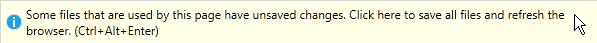

To save all your files and refresh the Page Inspector browser, press Ctrl+Alt+Enter or click the update bar. The change in the highlight color appears in the browser:

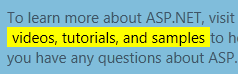

Notice that you conveniently refreshed the Page Inspector browser right from within the Visual Studio environment. Using Page Inspector instead of an external browser lets you stay in the editor when you develop your web applications.

## See Also

[Introducing Page Inspector](https://channel9.msdn.com/posts/visual-studio-vnext-introducing-page-inspector) (Channel 9 video)

[Page Inspector Error Messages](https://go.microsoft.com/?linkid=9813062) (MSDN)