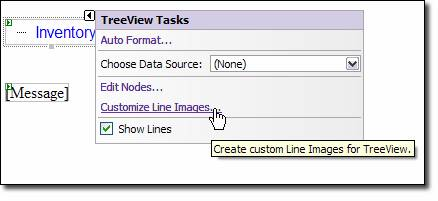
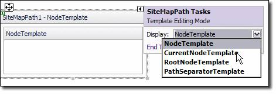
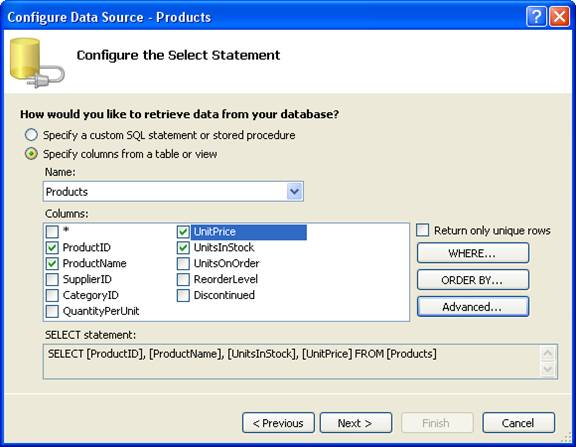
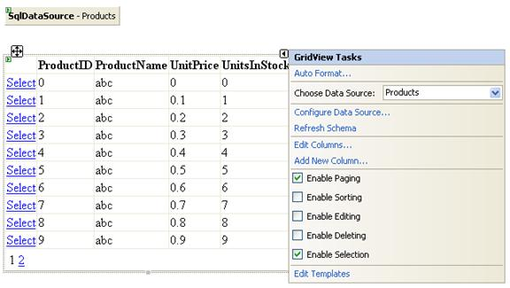
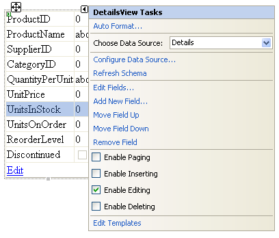

Data Bound Controls
====================
by [Microsoft](https://github.com/microsoft)

> Most ASP.NET applications rely on some degree of data presentation from a back-end data source. Data-bound controls have been a pivotal part of interacting with data in dynamic Web applications. ASP.NET 2.0 introduces some substantial improvements to data-bound controls, including a new BaseDataBoundControl class and declarative syntax.

Most ASP.NET applications rely on some degree of data presentation from a back-end data source. Data-bound controls have been a pivotal part of interacting with data in dynamic Web applications. ASP.NET 2.0 introduces some substantial improvements to data-bound controls, including a new BaseDataBoundControl class and declarative syntax.

The BaseDataBoundControl acts as the base class for the DataBoundControl class and the HierarchicalDataBoundControl class. In this module, we will discuss the following classes that derive from DataBoundControl:

- AdRotator
- List controls
- GridView
- FormView
- DetailsView

We will also discuss the following classes that derive from HierarchicalDataBoundControl class:

- TreeView
- Menu
- SiteMapPath

## DataBoundControl Class

The DataBoundControl class is an abstract class (marked MustInherit in VB) used to interact with tabular or list-style data. The following controls are some of the controls that derive from DataBoundControl.

## AdRotator

The AdRotator control allows you to display a graphic banner on a Web page that is linked to a specific URL. The graphic that is displayed is rotated using properties for the control. The frequency of a particular ad displaying on a page can be configured using the **Impressions** property and ads can be filtered using keyword filtering.

AdRotator controls use either an XML file or a table in a database for data. The following attributes are used in XML files to configure the AdRotator control.

### ImageUrl
The URL of an image to display for the ad.

### NavigateUrl
The URL that the user should be taken to when the ad is clicked. This should be URL encoded.

### AlternateText
The alternate text that is displayed in a tooltip and read by screen readers. Also displays when the image specified by ImageUrl is not available.

### Keyword
Defines a keyword that can be used when using keyword filtering. If specified, only those ads with a keyword matching the keyword filter will be displayed.

### Impressions
A weighting number that determines how often a particular ad is likely to appear. It is relative to the impression of other ads in the same file. The maximum value of the collective impressions for all ads in an XML file is 2,048,000,000 1.

### Height
The height of the ad in pixels.

### Width
The width of the ad in pixels.

> [!NOTE]
> The Height and Width attributes override the height and width for the AdRotator control itself.

A typical XML file might look like the following:

[!code-xml[Main](data-bound-controls/samples/sample1.xml)]

In the above example, the ad for Contoso is twice as likely to appear as the ad for the ASP.NET Web site because of the value for the Impressions attribute.

To display ads from the above XML file, add an AdRotator control to a page and set the **AdvertisementFile** property to point to the XML file as shown below:

[!code-aspx[Main](data-bound-controls/samples/sample2.aspx)]

If you choose to use a database table as the data source for your AdRotator control, you will first need to set up a database using the following schema:

| **Column name** | **Data type** | **Description** |
| --- | --- | --- |
| ID | int | Primary key. This column can have any name. |
| ImageUrl | nvarchar(*length*) | The relative or absolute URL of the image to display for the ad. |
| NavigateUrl | nvarchar(*length*) | The target URL for the ad. If you do not provide a value, the ad is not a hyperlink. |
| AlternateText | nvarchar(*length*) | The text displayed if the image cannot be found. In some browsers, the text is displayed as a ToolTip. Alternate text is also used for accessibility so that users who cannot see the graphic can hear its description read out loud. |
| Keyword | nvarchar(*length*) | A category for the ad on which the page can filter. |
| Impressions | int(4) | A number that indicates the likelihood of how often the ad is displayed. The larger the number, the more often the ad will be displayed. The total of all impressions values in the XML file may not exceed 2,048,000,000 - 1. |
| Width | int(4) | The width of the image in pixels. |
| Height | int(4) | The height of the image in pixels. |

In cases where you already have a database with a different schema, you can use the **AlternateTextField**, **ImageUrlField**, and **NavigateUrlField** properties to map the AdRotator attributes to your existing database. To display the data from the database in the AdRotator control, add a data source control to the page, configure the connection string for the data source control to point to your database, and set the AdRotator control's **DataSourceID** property to the ID of the data source control. In cases where you have a need to configure AdRotator ads programmatically, use the AdCreated event. The AdCreated event takes two parameters; one an object, and the other an instance of AdCreatedEventArgs. The AdCreatedEventArgs is a reference to the ad that is being created.

The following code snippet sets the ImageUrl, NavigateUrl, and AlternateText for an ad programmatically:

[!code-csharp[Main](data-bound-controls/samples/sample3.cs)]

## List Controls

List controls include the ListBox, DropDownList, CheckBoxList, RadioButtonList, and BulletedList. Each of these controls can be data bound to a data source. They use one field in the data source as the display text and can optionally use a second field as the value of an item. Items can also be added statically at design-time, and you can mix static items and dynamic items added from a data source.

To data bind a list control, add a data source control to the page. Specify a SELECT command for the data source control and then set the DataSourceID property of the list control to the ID of the data source control. Use the **DataTextField** and **DataValueField** properties to define the display text and the value for the control. Additionally, you can use the **DataTextFormatString** property to control the appearance of the display text as follows:

| **Expression** | **Description** |
| --- | --- |
| Price: {0:C} | For numeric/decimal data. Displays the literal "Price:" followed by numbers in currency format. The currency format depends on the culture setting specified in the culture attribute on the **Page** directive or in the Web.config file. |
| {0:D4} | For integer data. Cannot be used with decimal numbers. Integers are displayed in a zero-padded field that is four characters wide. |
| {0:N2}% | For numeric data. Displays the number with 2-decimal place precision followed by the literal "%". |
| {0:000.0} | For numeric/decimal data. Numbers are rounded to one decimal place. Numbers less than three digits are zero-padded. |
| {0:D} | For date/time data. Displays long date format ("Thursday, August 06, 1996"). Date format depends on the culture setting of the page or the Web.config file. |
| {0:d} | For date/time data. Displays short date format ("12/31/99"). |
| {0:yy-MM-dd} | For date/time data. Displays date in numeric year-month-day format (96-08-06) |

## GridView

The GridView control allows for tabular data display and editing using a declarative approach and is the successor to the DataGrid control. The following features are available in the GridView control.

- Binding to data source controls, such as SqlDataSource.
- Built-in sorting capabilities.
- Built-in updating and deleting capabilities.
- Built-in paging capabilities.
- Built-in row selection capabilities.
- Programmatic access to the GridView object model to dynamically set properties, handle events, and so on.
- Multiple key fields.
- Multiple data fields for the hyperlink columns.
- Customizable appearance through themes and styles.

**Column Fields**

Each column in the GridView control is represented by a DataControlField object. By default, the AutoGenerateColumns property is set to **true**, which creates an AutoGeneratedField object for each field in the data source. Each field is then rendered as a column in the GridView control in the order that each field appears in the data source. You can also manually control which column fields appear in the **GridView** control by setting the **AutoGenerateColumns** property to **false** and then defining your own column field collection. Different column field types determine the behavior of the columns in the control.

The following table lists the different column field types that can be used.

| **Column field type** | **Description** |
| --- | --- |
| BoundField | Displays the value of a field in a data source. This is the default column type of the GridView control. |
| ButtonField | Displays a command button for each item in the GridView control. This allows you to create a column of custom button controls, such as the Add or the Remove button. |
| CheckBoxField | Displays a check box for each item in the GridView control. This column field type is commonly used to display fields with a Boolean value. |
| CommandField | Displays predefined command buttons to perform selecting, editing, or deleting operations. |
| HyperLinkField | Displays the value of a field in a data source as a hyperlink. This column field type allows you to bind a second field to the hyperlink's URL. |
| ImageField | Displays an image for each item in the GridView control. |
| TemplateField | Displays user-defined content for each item in the GridView control according to a specified template. This column field type allows you to create a custom column field. |

To define a column field collection declaratively, first add opening and closing **&lt;Columns&gt;** tags between the opening and closing tags of the GridView control. Next, list the column fields that you want to include between the opening and closing **&lt;Columns&gt;** tags. The columns specified are added to the Columns collection in the order listed. The **Columns** collection stores all the column fields in the control and allows you to programmatically manage the column fields in the GridView control.

Explicitly declared column fields can be displayed in combination with automatically generated column fields. When both are used, explicitly declared column fields are rendered first, followed by the automatically generated column fields.

## Binding to Data

The GridView control can be bound to a data source control (such as **SqlDataSource**, **ObjectDataSource**, and so on), as well as any data source that implements the System.Collections.IEnumerable interface (such as System.Data.DataView, System.Collections.ArrayList, or System.Collections.Hashtable). Use one of the following methods to bind the GridView control to the appropriate data source type:

- To bind to a data source control, set the DataSourceID property of the GridView control to the ID value of the data source control. The GridView control automatically binds to the specified data source control and can take advantage of the data source control's capabilities to perform sorting, updating, deleting, and paging functionality. This is the preferred method to bind to data.
- To bind to a data source that implements the System.Collections.IEnumerable interface, programmatically set the DataSource property of the GridView control to the data source and then call the DataBind method. When using this method, the GridView control does not provide built-in sorting, updating, deleting, and paging functionality. You need to provide this functionality yourself.

## Data Operations

The GridView control provides many built-in capabilities that allow the user to sort, update, delete, select, and page through items in the control. When the GridView control is bound to a data source control, the GridView control can take advantage of the data source control's capabilities and provide automatic sorting, updating, and deleting functionality.

> [!NOTE]
> The GridView control can provide support for sorting, updating, and deleting with other types of data sources; however, you will need to provide an appropriate event handler with the implementation for these operations.

Sorting allows the user to sort the items in the GridView control with respect to a specific column by clicking on the column's header. To enable sorting, set the AllowSorting property to **true**.

The automatic updating, deleting, and selection functionalities are enabled when a button in a **ButtonField** or **TemplateField** column field, with a command name of "Edit", "Delete", and "Select", respectively, is clicked. The GridView control can automatically add a **CommandField** column field with an Edit, Delete, or Select button if the AutoGenerateEditButton, AutoGenerateDeleteButton, or AutoGenerateSelectButton property is set to **true**, respectively.

> [!NOTE]
> Inserting records into the data source is not directly supported by the GridView control. However, it is possible to insert records by using the GridView control in conjunction with the DetailsView or FormView control.

Instead of displaying all the records in the data source at the same time, the GridView control can automatically break the records up into pages. To enable paging, set the AllowPaging property to **true**.

## Customizing the User Interface

You can customize the appearance of the GridView control by setting the style properties for the different parts of the control. The following table lists the different style properties.

| **Style property** | **Description** |
| --- | --- |
| AlternatingRowStyle | The style settings for the alternating data rows in the GridView control. When this property is set, the data rows are displayed alternating between the RowStyle settings and the **AlternatingRowStyle** settings. |
| EditRowStyle | The style settings for the row being edited in the GridView control. |
| EmptyDataRowStyle | The style settings for the empty data row displayed in the GridView control when the data source does not contain any records. |
| FooterStyle | The style settings for the footer row of the GridView control. |
| HeaderStyle | The style settings for the header row of the GridView control. |
| PagerStyle | The style settings for the pager row of the GridView control. |
| RowStyle | The style settings for the data rows in the GridView control. When the **AlternatingRowStyle** property is also set, the data rows are displayed alternating between the **RowStyle** settings and the **AlternatingRowStyle** settings. |
| SelectedRowStyle | The style settings for the selected row in the GridView control. |

You can also show or hide different parts of the control. The following table lists the properties that control which parts are shown or hidden.

| **Property** | **Description** |
| --- | --- |
| ShowFooter | Shows or hides the footer section of the GridView control. |
| ShowHeader | Shows or hides the header section of the GridView control. |

### Events

The GridView control provides several events that you can program against. This allows you to run a custom routine whenever an event occurs. The following table lists the events supported by the GridView control.

| **Event** | **Description** |
| --- | --- |
| PageIndexChanged | Occurs when one of the pager buttons is clicked, but after the GridView control handles the paging operation. This event is commonly used when you need to perform a task after the user navigates to a different page in the control. |
| PageIndexChanging | Occurs when one of the pager buttons is clicked, but before the GridView control handles the paging operation. This event is often used to cancel the paging operation. |
| RowCancelingEdit | Occurs when a row's Cancel button is clicked, but before the GridView control exits edit mode. This event is often used to stop the canceling operation. |
| RowCommand | Occurs when a button is clicked in the GridView control. This event is often used to perform a task when a button is clicked in the control. |
| RowCreated | Occurs when a new row is created in the GridView control. This event is often used to modify the contents of a row when the row is created. |
| RowDataBound | Occurs when a data row is bound to data in the GridView control. This event is often used to modify the contents of a row when the row is bound to data. |
| RowDeleted | Occurs when a row's Delete button is clicked, but after the GridView control deletes the record from the data source. This event is often used to check the results of the delete operation. |
| RowDeleting | Occurs when a row's Delete button is clicked, but before the GridView control deletes the record from the data source. This event is often used to cancel the deleting operation. |
| RowEditing | Occurs when a row's Edit button is clicked, but before the GridView control enters edit mode. This event is often used to cancel the editing operation. |
| RowUpdated | Occurs when a row's Update button is clicked, but after the GridView control updates the row. This event is often used to check the results of the update operation. |
| RowUpdating | Occurs when a row's Update button is clicked, but before the GridView control updates the row. This event is often used to cancel the updating operation. |
| SelectedIndexChanged | Occurs when a row's Select button is clicked, but after the GridView control handles the select operation. This event is often used to perform a task after a row is selected in the control. |
| SelectedIndexChanging | Occurs when a row's Select button is clicked, but before the GridView control handles the select operation. This event is often used to cancel the selection operation. |
| Sorted | Occurs when the hyperlink to sort a column is clicked, but after the GridView control handles the sort operation. This event is commonly used to perform a task after the user clicks on a hyperlink to sort a column. |
| Sorting | Occurs when the hyperlink to sort a column is clicked, but before the GridView control handles the sort operation. This event is often used to cancel the sorting operation or to perform a custom sorting routine. |

## FormView

The FormView control is used to display a single record from a data source. It is similar to the DetailsView control, except it displays user-defined templates instead of row fields. Creating your own templates gives you greater flexibility in controlling how the data is displayed. The FormView control supports the following features:

- Binding to data source controls, such as SqlDataSource and ObjectDataSource.
- Built-in inserting capabilities.
- Built-in updating and deleting capabilities.
- Built-in paging capabilities.
- Programmatic access to the FormView object model to dynamically set properties, handle events, and so on.
- Customizable appearance through user-defined templates, themes, and styles.

## Templates

For the FormView control to display content, you need to create templates for the different parts of the control. Most templates are optional; however, you must create a template for the mode in which the control is configured. For example, a FormView control that supports inserting records must have an insert item template defined. The following table lists the different templates that you can create.

| **Template type** | **Description** |
| --- | --- |
| EditItemTemplate | Defines the content for the data row when the FormView control is in edit mode. This template usually contains input controls and command buttons with which the user can edit an existing record. |
| EmptyDataTemplate | Defines the content for the empty data row displayed when the FormView control is bound to a data source that does not contain any records. This template usually contains content to alert the user that the data source does not contain any records. |
| FooterTemplate | Defines the content for the footer row. This template usually contains any additional content you would like to display in the footer row. As an alternative, you can simply specify text to display in the footer row by setting the FooterText property. |
| HeaderTemplate | Defines the content for the header row. This template usually contains any additional content you would like to display in the header row. As an alternative, you can simply specify text to display in the header row by setting the HeaderText property. |
| ItemTemplate | Defines the content for the data row when the FormView control is in read-only mode. This template usually contains content to display the values of an existing record. |
| InsertItemTemplate | Defines the content for the data row when the FormView control is in insert mode. This template usually contains input controls and command buttons with which the user can add a new record. |
| PagerTemplate | Defines the content for the pager row displayed when the paging feature is enabled (when the AllowPaging property is set to **true**). This template usually contains controls with which the user can navigate to another record. |

Input controls in the edit item template and insert item template can be bound to the fields of a data source by using a two-way binding expression. This allows the FormView control to automatically extract the values of the input control for an update or insert operation. Two-way binding expressions also allow input controls in an edit item template to automatically display the original field values.

### Binding to Data

The FormView control can be bound to a data source control (such as **SqlDataSource**, AccessDataSource, **ObjectDataSource** and so on), or to any data source that implements the System.Collections.IEnumerable interface (such as System.Data.DataView, System.Collections.ArrayList, and System.Collections.Hashtable). Use one of the following methods to bind the FormView control to the appropriate data source type:

- To bind to a data source control, set the DataSourceID property of the FormView control to the ID value of the data source control. The FormView control automatically binds to the specified data source control and can take advantage of the data source control's capabilities to perform inserting, updating, deleting, and paging functionality. This is the preferred method to bind to data.
- To bind to a data source that implements the **System.Collections.IEnumerable** interface, programmatically set the DataSource property of the FormView control to the data source and then call the DataBind method. When using this method, the FormView control does not provide built-in inserting, updating, deleting, and paging functionality. You need to provide this functionality by using the appropriate event.

## Data Operations

The FormView control provides many built-in capabilities that allow the user to update, delete, insert, and page through items in the control. When the FormView control is bound to a data source control, the FormView control can take advantage of the data source control's capabilities and provide automatic updating, deleting, inserting, and paging functionality. The FormView control can provide support for update, delete, insert, and paging operations with other types of data sources; however, you must provide an appropriate event handler with the implementation for these operations.

Because the FormView control uses templates, it does not provide a way to automatically generate command buttons to perform updating, deleting, or inserting operations. You must manually include these command buttons in the appropriate template. The FormView control recognizes certain buttons that have their **CommandName** properties set to specific values. The following table lists the command buttons that the FormView control recognizes.

| **Button** | **Commandname value** | **Description** |
| --- | --- | --- |
| Cancel | "Cancel" | Used in updating or inserting operations to cancel the operation and to discard the values entered by the user. The FormView control then returns to the mode specified by the DefaultMode property. |
| Delete | "Delete" | Used in deleting operations to delete the displayed record from the data source. Raises the ItemDeleting and ItemDeleted events. |
| Edit | "Edit" | Used in updating operations to put the FormView control in edit mode. The content specified in the **EditItemTemplate** property is displayed for the data row. |
| Insert | "Insert" | Used in inserting operations to attempt to insert a new record in the data source using the values provided by the user. Raises the ItemInserting and ItemInserted events. |
| New | "New" | Used in inserting operations to put the FormView control in insert mode. The content specified in the **InsertItemTemplate** property is displayed for the data row. |
| Page | "Page" | Used in paging operations to represent a button in the pager row that performs paging. To specify the paging operation, set the **CommandArgument** property of the button to "Next", "Prev", "First", "Last", or the index of the page to which to navigate. Raises the PageIndexChanging and PageIndexChanged events. |
| Update | "Update" | Used in updating operations to attempt to update the displayed record in the data source with the values provided by the user. Raises the ItemUpdating and ItemUpdated events. |

Unlike the Delete button (which deletes the displayed record immediately), when the Edit or New button is clicked, the FormView control goes into edit or insert mode respectively. In edit mode, the content contained in the **EditItemTemplate** property is displayed for the current data item. Typically, the edit item template is defined such that the Edit button is replaced with an Update and a Cancel button. Input controls that are appropriate for the field's data type (such as a TextBox or a CheckBox control) are also usually displayed with a field's value for the user to modify. Clicking the Update button updates the record in the data source, while clicking the Cancel button abandons any changes.

Likewise, the content contained in the **InsertItemTemplate** property is displayed for the data item when the control is in insert mode. The insert item template is typically defined such that the New button is replaced with an Insert and a Cancel button, and empty input controls are displayed for the user to enter the values for the new record. Clicking the Insert button inserts the record in the data source, while clicking the Cancel button abandons any changes.

The FormView control provides a paging feature, which allows the user to navigate to other records in the data source. When enabled, a pager row is displayed in the FormView control that contains the page navigation controls. To enable paging, set the **AllowPaging** property to **true**. You can customize the pager row by setting the properties of objects contained in the PagerStyle and the PagerSettings property. Instead of using the built-in pager row UI, you can create your own UI by using the **PagerTemplate** property.

## Customizing the User Interface

You can customize the appearance of the FormView control by setting the style properties for the different parts of the control. The following table lists the different style properties.

| **Style property** | **Description** |
| --- | --- |
| EditRowStyle | The style settings for the data row when the FormView control is in edit mode. |
| EmptyDataRowStyle | The style settings for the empty data row displayed in the FormView control when the data source does not contain any records. |
| FooterStyle | The style settings for the footer row of the FormView control. |
| HeaderStyle | The style settings for the header row of the FormView control. |
| InsertRowStyle | The style settings for the data row when the FormView control is in insert mode. |
| PagerStyle | The style settings for the pager row displayed in the FormView control when the paging feature is enabled. |
| RowStyle | The style settings for the data row when the FormView control is in read-only mode. |

## Events

The FormView control provides several events that you can program against. This allows you to run a custom routine whenever an event occurs. The following table lists the events supported by the FormView control.

| **Event** | **Description** |
| --- | --- |
| ItemCommand | Occurs when a button within a FormView control is clicked. This event is often used to perform a task when a button is clicked in the control. |
| ItemCreated | Occurs after all FormViewRow objects are created in the FormView control. This event is often used to modify the values of a record before it is displayed. |
| ItemDeleted | Occurs when a Delete button (a button with its **CommandName** property set to "Delete") is clicked, but after the FormView control deletes the record from the data source. This event is often used to check the results of the delete operation. |
| ItemDeleting | Occurs when a Delete button is clicked, but before the FormView control deletes the record from the data source. This event is often used to cancel the delete operation. |
| ItemInserted | Occurs when an Insert button (a button with its **CommandName** property set to "Insert") is clicked, but after the FormView control inserts the record. This event is often used to check the results of the insert operation. |
| ItemInserting | Occurs when an Insert button is clicked, but before the FormView control inserts the record. This event is often used to cancel the insert operation. |
| ItemUpdated | Occurs when an Update button (a button with its **CommandName** property set to "Update") is clicked, but after the FormView control updates the row. This event is often used to check the results of the update operation. |
| ItemUpdating | Occurs when an Update button is clicked, but before the FormView control updates the record. This event is often used to cancel the update operation. |
| ModeChanged | Occurs after the FormView control changes modes (to edit, insert, or read-only mode). This event is often used to perform a task when the FormView control changes modes. |
| ModeChanging | Occurs before the FormView control changes modes (to edit, insert, or read-only mode). This event is often used to cancel a mode change. |
| PageIndexChanged | Occurs when one of the pager buttons is clicked, but after the FormView control handles the paging operation. This event is commonly used when you need to perform a task after the user navigates to a different record in the control. |
| PageIndexChanging | Occurs when one of the pager buttons is clicked, but before the FormView control handles the paging operation. This event is often used to cancel the paging operation. |

## DetailsView

The DetailsView control is used to display a single record from a data source in a table, where each field of the record is displayed in a row of the table. It can be used in combination with a GridView control for master-detail scenarios. The DetailsView control supports the following features:

- Binding to data source controls, such as SqlDataSource.
- Built-in inserting capabilities.
- Built-in updating and deleting capabilities.
- Built-in paging capabilities.
- Programmatic access to the DetailsView object model to dynamically set properties, handle events, and so on.
- Customizable appearance through themes and styles.

## Row Fields

Each data row in the DetailsView control is created by declaring a field control. Different row field types determine the behavior of the rows in the control. Field controls derive from DataControlField. The following table lists the different row field types that can be used.

| **Column field type** | **Description** |
| --- | --- |
| BoundField | Displays the value of a field in a data source as text. |
| ButtonField | Displays a command button in the DetailsView control. This allows you to display a row with a custom button control, such as an Add or a Remove button. |
| CheckBoxField | Displays a check box in the DetailsView control. This row field type is commonly used to display fields with a Boolean value. |
| CommandField | Displays built-in command buttons to perform edit, insert, or delete operations in the DetailsView control. |
| HyperLinkField | Displays the value of a field in a data source as a hyperlink. This row field type allows you to bind a second field to the hyperlink's URL. |
| ImageField | Displays an image in the DetailsView control. |
| TemplateField | Displays user-defined content for a row in the DetailsView control according to a specified template. This row field type allows you to create a custom row field. |

By default, the AutoGenerateRows property is set to **true**, which automatically generates a bound row field object for each field of a bindable type in the data source. Valid bindable types are String, DateTime, Decimal, Guid, and the set of primitive types. Each field is then displayed in a row as text, in the order in which each field appears in the data source.

Automatically generating the rows provides a quick and easy way to display every field in the record. However, to make use of the DetailsView control's advanced capabilities you must explicitly declare the row fields to include in the DetailsView control. To declare the row fields, first set the **AutoGenerateRows** property to **false**. Next, add opening and closing **&lt;Fields&gt;** tags between the opening and closing tags of the DetailsView control. Finally, list the row fields that you want to include between the opening and closing **&lt;Fields&gt;** tags. The row fields specified are added to the Fields collection in the order listed. The **Fields** collection allows you to programmatically manage the row fields in the DetailsView control.

> [!NOTE]
> Automatically generated row fields are not added to the Fields collection.

## Binding to Data

The DetailsView control can be bound to a data source control, such as **SqlDataSource** or AccessDataSource, or to any data source that implements the System.Collections.IEnumerable interface, such as System.Data.DataView, System.Collections.ArrayList and System.Collections.Hashtable.

Use one of the following methods to bind the DetailsView control to the appropriate data source type:

- To bind to a data source control, set the DataSourceID property of the DetailsView control to the ID value of the data source control. The DetailsView control automatically binds to the specified data source control. This is the preferred method to bind to data.
- To bind to a data source that implements the **System.Collections.IEnumerable** interface, programmatically set the DataSource property of the DetailsView control to the data source and then call the DataBind method.

## Security

This control can be used to display user input, which might include malicious client script. Check any information that is sent from a client for executable script, SQL statements, or other code before displaying it in your application. ASP.NET provides an input request validation feature to block script and HTML in user input.

## Data Operations

The DetailsView control provides built-in capabilities that allow the user to update, delete, insert, and page through items in the control. When the DetailsView control is bound to a data source control, the DetailsView control can take advantage of the data source control's capabilities and provide automatic updating, deleting, inserting, and paging functionality.

The DetailsView control can provide support for update, delete, insert, and paging operations with other types of data sources; however, you must provide the implementation for these operations in an appropriate event handler.

The DetailsView control can automatically add a **CommandField** row field with an Edit, Delete, or New button by setting the AutoGenerateEditButton, AutoGenerateDeleteButton, or AutoGenerateInsertButton properties to **true**, respectively. Unlike the Delete button (which deletes the selected record immediately), when the Edit or New button is clicked, the DetailsView control goes into edit or insert mode, respectively. In edit mode, the Edit button is replaced with an Update and a Cancel button. Input controls that are appropriate for the field's data type (such as a TextBox or a CheckBox control) are displayed with a field's value for the user to modify. Clicking the Update button updates the record in the data source, while clicking the Cancel button abandons any changes. Likewise, in insert mode, the New button is replaced with an Insert and a Cancel button, and empty input controls are displayed for the user to enter the values for the new record.

The DetailsView control provides a paging feature, which allows the user to navigate to other records in the data source. When enabled, page navigation controls are displayed in a pager row. To enable paging, set the AllowPaging property to **true**. The pager row can be customized using the PagerStyle and PagerSettings properties.

## Customizing the User Interface

You can customize the appearance of the DetailsView control by setting the style properties for the different parts of the control. The following table lists the different style properties.

| **Style property** | **Description** |
| --- | --- |
| AlternatingRowStyle | The style settings for the alternating data rows in the DetailsView control. When this property is set, the data rows are displayed alternating between the RowStyle settings and the **AlternatingRowStyle** settings. |
| CommandRowStyle | The style settings for the row containing the built-in command buttons in the DetailsView control. |
| EditRowStyle | The style settings for the data rows when the DetailsView control is in edit mode. |
| EmptyDataRowStyle | The style settings for the empty data row displayed in the DetailsView control when the data source does not contain any records. |
| FooterStyle | The style settings for the footer row of the DetailsView control. |
| HeaderStyle | The style settings for the header row of the DetailsView control. |
| InsertRowStyle | The style settings for the data rows when the DetailsView control is in insert mode. |
| PagerStyle | The style settings for the pager row of the DetailsView control. |
| RowStyle | The style settings for the data rows in the DetailsView control. When the **AlternatingRowStyle** property is also set, the data rows are displayed alternating between the **RowStyle** settings and the **AlternatingRowStyle** settings. |
| FieldHeaderStyle | The style settings for the header column of the DetailsView control. |

## Events

The DetailsView control provides several events that you can program against. This allows you to run a custom routine whenever an event occurs. The following table lists the events supported by the DetailsView control. The DetailsView control also inherits these events from its base classes: DataBinding, DataBound, Disposed, Init, Load, PreRender, and Render.

| **Event** | **Description** |
| --- | --- |
| ItemCommand | Occurs when a button is clicked in the DetailsView control. |
| ItemCreated | Occurs after all DetailsViewRow objects are created in the DetailsView control. This event is often used to modify the values of a record before it is displayed. |
| ItemDeleted | Occurs when a Delete button is clicked, but after the DetailsView control deletes the record from the data source. This event is often used to check the results of the delete operation. |
| ItemDeleting | Occurs when a Delete button is clicked, but before the DetailsView control deletes the record from the data source. This event is often used to cancel the delete operation. |
| ItemInserted | Occurs when an Insert button is clicked, but after the DetailsView control inserts the record. This event is often used to check the results of the insert operation. |
| ItemInserting | Occurs when an Insert button is clicked, but before the DetailsView control inserts the record. This event is often used to cancel the insert operation. |
| ItemUpdated | Occurs when an Update button is clicked, but after the DetailsView control updates the row. This event is often used to check the results of the update operation. |
| ItemUpdating | Occurs when an Update button is clicked, but before the DetailsView control updates the record. This event is often used to cancel the update operation. |
| ModeChanged | Occurs after the DetailsView control changes modes (edit, insert, or read-only mode). This event is often used to perform a task when the DetailsView control changes modes. |
| ModeChanging | Occurs before the DetailsView control changes modes (edit, insert, or read-only mode). This event is often used to cancel a mode change. |
| PageIndexChanged | Occurs when one of the pager buttons is clicked, but after the DetailsView control handles the paging operation. This event is commonly used when you need to perform a task after the user navigates to a different record in the control. |
| PageIndexChanging | Occurs when one of the pager buttons is clicked, but before the DetailsView control handles the paging operation. This event is often used to cancel the paging operation. |

## The Menu Control

The Menu control in ASP.NET 2.0 is designed to be a full-featured navigation system. It can be databound easily to hierarchical data sources such as the SiteMapDataSource.

A Menu controls structure can be defined declaratively or dynamically and consists of a single root node and any number of sub-nodes. The following code declaratively defines a menu for the Menu control.

[!code-aspx[Main](data-bound-controls/samples/sample4.aspx)]

In the above example, the Home.aspx node is the root node. All other nodes are nested within the root node at various levels.

There are two types of menus that the Menu control can render; static menus and dynamic menus. Static menus consist of menu items that are always visible. Dynamic menus consist of menu items that are only visible when the user hovers over them with the mouse. Customers may often confuse static menus with menus defined declaratively and dynamic menus with menus that are databound at runtime. In fact, dynamic and static menus are unrelated to the method of population. The terms *static* and *dynamic* refer only to whether or not the menu is statically displayed by default or only displayed when the user takes some action.

The **StaticDisplayLevels** property is used to configure how many levels of the menu are static and therefore displayed by default. In the above example, setting the **StaticDisplayLevels** property to a value of 2 would cause the menu to statically display the Home node, the Music node, and the Movies node. All other nodes would be dynamically displayed when the user hovers over the parent node.

The **MaximumDynamicDisplayLevels** property configures the maximum number of dynamic levels the menu is capable of displaying. Any dynamic menus at a level higher than the value specified by the **MaximumDynamicDisplayLevels** property are discarded.

> [!NOTE]
> It is almost certain that you might encounter situations where menus don't appear to render due to the MaximumDynamicDisplayLevels property. In those cases, ensure that the property is set sufficiently to allow for the display of the customers menus.

## Data Binding the Menu Control

The Menu control can be bound to any hierarchical data source such as the SiteMapDataSource or the XMLDataSource. The SiteMapDataSource is the most commonly used method for data binding to a Menu control because it feeds off of the Web.sitemap file and its schema provides a known API to the Menu control. The listing below shows a simple Web.sitemap file.

[!code-xml[Main](data-bound-controls/samples/sample5.xml)]

Notice that there is only one root siteMapNode element, in this case, the Home element. Several attributes can be configured for each siteMapNode. The most commonly used attributes are:

- **url** Specifies the URL to display when a user clicks the menu item. If this attribute is not present, the node will simply post back when clicked.
- **title** Specifies the text that is displayed on the menu item.
- **description** Used as documentation for the node. Also displays as a tool tip when the mouse is hovered over the node.
- **siteMapFile** Allows for nested sitemaps. This attribute must point to a well-formed ASP.NET sitemap file.
- **roles** Allows for the appearance of a node to be controlled by ASP.NET security trimming.

Note that while these attributes are all optional, the behavior of the menu may not be what is expected if they are not specified. For example, if the *url* attribute is specified but the *description* attribute is not, the node will not be visible and there will be no way to navigate to the URL specified.

## Controlling a Menus Operation

There are several properties that affect the operation of an ASP.NET Menu control; the **Orientation** property, the **DisappearAfter** property, the **StaticItemFormatString** property, and the **StaticPopoutImageUrl** property are just a few of these.

- The **Orientation** can be set to either *horizontal* or *vertical* and controls whether static menu items are laid out horizontally in a row or vertically and stacked upon one another. This property does not affect dynamic menus.
- The **DisappearAfter** property configures how long a dynamic menu should remain visible after the mouse has been moved away from it. The value is specified in milliseconds and defaults to 500. Setting this property to a value of -1 will cause the menu to never disappear automatically. In that case, the menu will only disappear when the user clicks outside of the menu.
- The **StaticItemFormatString** property makes it easy to maintain consistent verbiage in your menu system. When specifying this property, *{0}* should be entered in place of the description that appears in the data source. For example, in order to have the menu item from exercise 1 say Visit Our Products Page, etc., you would specify Visit Our {0} Page for the StaticItemFormatString. At runtime, ASP.NET will replace any occurrence of {0} with the correct description for the menu item.
- The **StaticPopoutImageUrl** property specifies the image that is used to indicate that a particular menu node has child nodes that can be accessed by hovering over it. Dynamic menus will continue to use the default image.

## Templated Menu Controls

The Menu control is a templated control and allows for two different ItemTemplates; the StaticItemTemplate and the DynamicItemTemplate. Using these templates, you can easily add server controls or user controls to your menus.

To edit the templates in Visual Studio .NET, click the Smart Tag button on the menu and either choose Edit Templates. You can then choose between editing the StaticItemTemplate or the DynamicItemTemplate.

Any controls added to the StaticItemTemplate will appear in the static menu when the page loads. Any controls added to the DynamicItemTemplate will appear on all pop-up menus.

## Menu Events

The Menu control has two events that are unique to it; the **MenuItemClicked** and the **MenuItemDatabound** event.

The MenuItemClicked event is raised when a menu item is clicked. The MenuItemDatabound event is raised when a menu item is databound. The **MenuEventArgs** that is passed to the event handler provides access to the menu item via the Item property.

## Controlling a Menus Appearance

You can also affect the appearance of a menu control using one or more of the many styles available to format menus. Among these are **StaticMenuStyle**, **DynamicMenuStyle**, **DynamicMenuItemStyle**, **DynamicSelectedStyle**, and **DynamicHoverStyle**. These properties are configured using a standard HTML Style string. For example, the following will affect the style for dynamic menus.

[!code-aspx[Main](data-bound-controls/samples/sample6.aspx)]

> [!NOTE]
> If you are using any of the Hover styles, you will need to add a &lt;head&gt; element in to the page with the *runat* element set to *server*.

Menu controls also support the use of ASP.NET 2.0 themes.

## The TreeView Control

The TreeView control displays data in a tree-like structure. As with the Menu control, it can be easily data bound to any hierarchical data source such as the SiteMapDataSource.

The first question that customers are likely to ask about the TreeView control in ASP.NET 2.0 is whether or not it is related to the TreeView IE WebControl that was available for ASP.NET 1.x. It is not. The ASP.NET 2.0 TreeView control was written from the ground up and offers significant improvement over the IE TreeView WebControl that was previously available.

I won't go into detail on how to bind a TreeView control to a site map as it is performed in exactly the same way as the Menu control. However, the TreeView control has some distinct differences in the way that it operates.

By default, a TreeView control appears fully expanded. To change the level of expansion upon initial load, modify the **ExpandDepth** property of the control. This is particularly important in cases where the TreeView is databound upon expanding particular nodes.

## DataBinding the TreeView Control

Unlike the Menu control, the TreeView lends itself well to handling large amounts of data. Therefore, in addition to databinding to a SiteMapDataSource or XMLDataSource, the TreeView is often data bound to a DataSet or other relational data. In cases where the TreeView control is bound to large amounts of data, it is best to bind only to data that is actually visible in the control. You can then data bind to additional data as TreeView nodes are expanded.

In these cases, the **PopulateOnDemand** property of the TreeView should be set to *true*. You will then need to provide an implementation for the **TreeNodePopulate** method.

## Data Binding Without PostBack

Notice that when you expand a node in the previous example for the first time, the page posts back and refreshes. Thats not a problem in this example, but you can imagine that it might be in a production environment with a large amount of data. A better scenario would be one in which the TreeView would still dynamically populate its nodes, but without a post back to the server.

By setting the **PopulateNodesFromClient** and the **PopulateOnDemand** properties to true, the ASP.NET TreeView control will dynamically populate nodes without a post back. When the parent node is expanded, an XMLHttp request is made from the client and the OnTreeNodePopulate event is fired. The server responds with an XML data island which is then used to data bind the child nodes.

ASP.NET dynamically creates the client code that implements this functionality. The &lt;script&gt; tags that contain the script are generated pointing to an AXD file. For example, the listing below shows the script links for the script code that generates the XMLHttp request.

[!code-html[Main](data-bound-controls/samples/sample7.html)]

If you browse the AXD file above in your browser and open it, you will see the code that implements the XMLHttp request. This method prevents customers from modifying the script file.

## Controlling the Operation of the TreeView Control

The TreeView control has several properties that affect the operation of the control. The most obvious properties are the **ShowCheckBoxes**, **ShowExpandCollapse**, and **ShowLines**.

The **ShowCheckBoxes** property affects whether or not nodes display a check box when rendered. The valid values for this property are **None**, **Root**, **Parent**, **Leaf**, and **All**. These affect the TreeView control as follows:

| **Property Value** | **Effect** |
| --- | --- |
| None | Checkboxes are not displayed on any nodes. This is the default setting. |
| Root | A checkbox is only displayed on the root node. |
| Parent | A checkbox is only displayed on those nodes that have child nodes. Those child nodes can be parent nodes or leaf nodes. |
| Leaf | A checkbox is displayed only on those nodes that have no child nodes. |
| All | A checkbox is displayed on all nodes. |

When checkboxes are being used, the **CheckedNodes** property will return a collection of TreeView nodes that are checked upon postback.

The **ShowExpandCollapse** property controls the appearance of the expand/collapse image next to root and parent nodes. If this property is set to **false**, TreeView nodes are rendered as hyperlinks and are expanded/collapsed by clicking on the link.

The **ShowLines** property controls whether or not lines are displayed connecting parent nodes to child nodes. When **false** (the default), no lines are displayed. When **true**, the TreeView control will use lines images in the folder specified by the **LineImagesFolder** property.

To customize the appearance of TreeView lines, Visual Studio .NET 2005 includes a Line Designer tool. You can access this tool using the Smart Tag button on the TreeView control as below.

**Figure 1**

When select the **Customize Line Images** menu option, the Line Designer tool will be launched allowing you to configure the appearance of TreeView lines.

## TreeView Events

The TreeView control has the following unique events:

- SelectedNodeChanged Occurs when a node is selected based upon the **SelectAction** property.
- TreeNodeCheckChanged Occurs when a nodes checkboxs state is changed.
- TreeNodeExpanded Occurs when a node is expanded based upon the **SelectAction** property.
- TreeNodeCollapsed Occurs when a node is collapsed.
- TreeNodeDataBound Occurs when a node is data bound.
- TreeNodePopulate Occurs when a node is populated.

The **SelectAction** property allows you to configure which event is fired when a node is selected. The SelectAction property provides the following actions:

- TreeNodeSelectAction.Expand Raises TreeNodeExpanded when the node is selected.
- TreeNodeSelectAction.None Raises no event when the node is selected.
- TreeNodeSelectAction.Select Raises the SelectedNodeChanged event when the node is selected.
- TreeNodeSelectAction.SelectExpand Raises both the SelectedNodeChanged event and the TreeNodeExpanded event when the node is selected.

## Controlling Appearance with Styles

The TreeView control provides many properties for controlling the appearance of the control with styles. The following properties are available.

| **Property Name** | **Controls** |
| --- | --- |
| HoverNodeStyle | Controls the style of nodes when the mouse is hovered over them. |
| LeafNodeStyle | Controls the style of leaf nodes. |
| NodeStyle | Controls the style for all nodes. Specific node styles (such as LeafNodeStyle) override this style. |
| ParentNodeStyle | Controls the style for all parent nodes. |
| RootNodeStyle | Controls the style for the root node. |
| SelectedNodeStyle | Controls the style for the selected node. |

Each of these properties is read-only. However, they will each return a **TreeNodeStyle** object, and the properties of that object can be modified using the *property-subproperty* format. For example, to set the **ForeColor** property of the **SelectedNodeStyle**, you would use the following syntax:

[!code-aspx[Main](data-bound-controls/samples/sample8.aspx)]

Notice that the tag above is not closed. That is because when using the declarative syntax shown here, you would include the TreeViews nodes in the HTML code as well.

The style properties can also be specified in code using the *property.subproperty* format. For example, to set the **ForeColor** property of the **RootNodeStyle** in code, you would use the following syntax:

[!code-csharp[Main](data-bound-controls/samples/sample9.cs)]

> [!NOTE]
> For a comprehensive list of the different style properties, see the MSDN documentation on the TreeNodeStyle object.

## The SiteMapPath Control

The SiteMapPath control provides a bread crumb navigation control for ASP.NET developers. Like the other navigation controls, it can be easily data bound to hierarchical data sources such as the SiteMapDataSource or XmlDataSource.

A SiteMapPath control is made up of SiteMapNodeItem objects. There are three types of nodes; the Root node, Parent nodes, and the Current node. The root node is the node at the top of the hierarchical structure. The current node represents the current page. All other nodes are parent nodes.

## Controlling the Operation of the SiteMapPath Control

The properties that control the operation of the SiteMapPath control are as follows:

| **Property** | **Description of Property** |
| --- | --- |
| ParentLevelsDisplayed | Controls how many parent nodes are displayed. The default is -1 which imposes no restriction on the number of parent nodes displayed. |
| PathDirection | Controls the direction of the SiteMapPath. Valid values are RootToCurrent (default) and CurrentToRoot. |
| PathSeparator | A String that controls the character that separates nodes in a SiteMapPath control. The default value is :. |
| RenderCurrentNodeAsLink | A Boolean value that controls whether or not the current node is rendered as a link. The default is False. |
| SkipLinkText | Assists with accessibility when the page is viewed by screen readers. This property allows screen readers to skip the SiteMapPath control. To disable this feature, set the property to String.Empty. |

## Templated SiteMapPath Controls

The SiteMapControl is a templated control, and as such, you can define different templates for use in displaying the control. To edit templates in a SiteMapPath control, click the Smart Tag button on the control and choose Edit Templates from the menu. This displays the SiteMapTasks menu as shown below where you can choose between the different templates available.

**Figure 2**

The **NodeTemplate** template refers to any node in the SiteMapPath. If the node is a root node or the current node and a **RootNodeTemplate** or **CurrentNodeTemplate** is configured, the NodeTemplate is overridden.

## SiteMapPath Events

The SiteMapPath control has two events that are not derived from the Control class; the **ItemCreated** event and the **ItemDataBound** event. The ItemCreated event is raised when a SiteMapPath item is created. ItemDataBound is raised when the DataBind method is called during the data binding of a SiteMapPath node. A **SiteMapNodeItemEventArgs** object provides access to the specific SiteMapNodeItem via the Item property.

## Controlling Appearance with Styles

The following styles are available for formatting of a SiteMapPath control.

| **Property Name** | **Controls** |
| --- | --- |
| CurrentNodeStyle | Controls the style of the text for the current node. |
| RootNodeStyle | Controls the style of the text for the root node. |
| NodeStyle | Controls the style of the text for all nodes assuming that a CurrentNodeStyle or RootNodeStyle doesnt apply. |

The NodeStyle property is overridden by either the CurrentNodeStyle or the RootNodeStyle. Each of these properties is read-only and returns a **Style** object. To affect the appearance of a node using one of these properties, you will need to set the properties of the Style object that is returned. For example, the code below changes the forecolor property of the current node.

[!code-aspx[Main](data-bound-controls/samples/sample10.aspx)]

The property can also be applied programmatically as follows:

[!code-csharp[Main](data-bound-controls/samples/sample11.cs)]

> [!NOTE]
> If a template is applied, the style will not be applied.

## Lab 1: Configuring an ASP.NET Menu Control

1. Create a new Web site.
2. Add a Site Map file by selecting File, New, File and choosing Site Map from the list of file templates.
3. Open the site map (Web.sitemap by default) and modify it so that it looks like the listing below. The pages to which you are linking in the site map file do not really exist, but that will not be an issue for this exercise.

    [!code-xml[Main](data-bound-controls/samples/sample12.xml)]
4. Open the default Web form in Design view.
5. From the Navigation section of the Toolbox, add a new Menu control to the page.
6. From the Data section of the Toolbox, add a new SiteMapDataSource. The SiteMapDataSource will automatically use the Web.sitemap file in your site. (The Web.sitemap file *must* be in the root folder of the site.)
7. Click the Menu control and then click the Smart Tag button to display the Menu Tasks dialog.
8. In the Choose Data Source dropdown, select SiteMapDataSource1.
9. Click the AutoFormat link and choose a format for the Menu.
10. In the Properties pane, set the **StaticDisplayLevels** property to 2. The Menu control should now display the Home, Products, and Services node in the Designer.
11. Browse the page in your browser to use the menu. (Because the pages you ve added to the site map don't actually exist, you will see an error when you try and browse to them.)

Experiment with changing the StaticDisplayLevels and the MaximumDynamicDisplayLevels properties and see how they affect how the menu is rendered.

## Lab 2: Dynamically Binding a TreeView Control

This exercise assumes that you have SQL Server running locally and that the Northwind database is present on the SQL Server instance. If these conditions are not met, please change the connection string in the sample. Note that you may also need to specify SQL Server authentication instead of a trusted connection.

1. Create a new Web site.
2. Switch to Code view for Default.aspx and replace all code with the code listed below. 

    [!code-aspx[Main](data-bound-controls/samples/sample13.aspx)]
3. Save the page as treeview.aspx.
4. Browse the page.
5. When the page is first displayed, view the source of the page in your browser. Note that only the visible nodes were sent to the client.
6. Click the plus sign next to any node.
7. View source on the page again. Notice that the newly displayed nodes are now present.

## Lab 3: Details View and Editing Data Using a GridView and DetailsView

1. Create a new Web site.
2. Add a new web.config to the Web site.
3. Add a connection string to the web.config file as shown below: 

    [!code-xml[Main](data-bound-controls/samples/sample14.xml)]

    > [!NOTE]
    > You may need to change the connection string based upon your environment.
4. Save and close the web.config file.
5. Open Default.aspx and add a new SqlDataSource control.
6. Change the ID of the SqlDataSource control to **Products**.
7. In the **SqlDataSource Tasks** menu, click **Configure Data Source**.
8. Select **Northwind** in the connection dropdown and click Next.
9. Select **Products** from the **Name** dropdown and check the **ProductID**, **ProductName**, **UnitPrice**, and **UnitsInStock** checkboxes as shown below. 

    **Figure 3**
10. Click **Next**.
11. Click **Finish**.
12. Switch to Source view and examine the code that was generated. Notice the **SelectCommand**, **DeleteCommand**, **InsertCommand**, and **UpdateCommand** that were added to the SqlDataSource control. Also notice the parameters that were added.
13. Switch to Design view and add a new GridView control to the page.
14. Select **Products** from the **Choose Data Source** dropdown.
15. Check **Enable Paging** and **Enable Selection** as shown below. 

    **Figure 4**
16. Click the **Edit Columns** link and make sure that **Auto-generate fields** is checked.
17. Click **OK**.
18. With the GridView control selected, click the button next to the **DataKeyNames** property in the Properties pane.
19. Select **ProductID** from the **Available data fields** list and click the **&gt;** button to add it.
20. Click OK.
21. Add a new SqlDataSource control to the page.
22. Change the ID of the SqlDataSource control to **Details**.
23. From the SqlDataSource Tasks menu, choose **Configure Data Source**.
24. Choose **Northwind** from the dropdown and click **Next**.
25. Select **Products** from the **Name** dropdown and check the **\*** checkbox in the **Columns** listbox.
26. Click the **WHERE** button.
27. Select **ProductID** from the **Column** dropdown.
28. Select **=** in the Operator dropdown.
29. Select **Control** from the **Source** dropdown.
30. Select **GridView1** from the **Control ID** dropdown.
31. Click the **Add** button to add the WHERE clause.
32. Click **OK**.
33. Click the **Advanced** button and check the **Generate INSERT, UPDATE, and DELETE statements** checkbox.
34. Click **OK**.
35. Click **Next** and click **Finish**.
36. Add a DetailsView control to the page.
37. In the **Choose Data Source** dropdown, choose **Details**.
38. Check the **Enable Editing** checkbox as shown below. 

    **Figure 5**
39. Save the page and browse Default.aspx.
40. Click the **Select** link next to different records to see the DetailsView update automatically.
41. Click the **Edit** link in the DetailsView control.
42. Make a change to the record and click **Update**.