Improvements in Visual Studio 2005
====================
by [Microsoft](https://github.com/microsoft)

> Visual Studio 2005 provides Web application developers with a long list of improvements and enhancements to Web projects.

Visual Studio 2005 provides Web application developers with a long list of improvements and enhancements to Web projects. As powerful as Visual Studio .NET 2002 and 2003 are, there were many complaints in the way that Web projects were handled. Visual Studio 2005 adds a significant number of new features in order to address these complaints. For those who prefer the way that Visual Studio .NET 2003 handled compilation of Web applications, see [Web Application Projects](https://go.microsoft.com/fwlink/?LinkId=57870).

In this module, well cover improvements in Web project creation, management, and development. In a later module, well cover improvements in building Web projects and deploying them.

## FrontPage Server Extensions

Visual Studio .NET 2002 and 2003 required FrontPage Server Extensions on the box in order to create or build Web projects. Developers did have a choice between two different access modes (FrontPage Server Extensions or File access mode), both used FrontPage Server Extensions to perform tasks such as setting the application root in IIS, etc.

Visual Studio 2005 removes the reliance on FrontPage Server Extensions for local projects. Visual Studio 2005 now accesses the IIS metabase directly instead of using the FrontPage Server Extensions. Visual Studio 2005 also adds support for FTP which allows for remote project access without requiring FrontPage Server Extensions.

For those developers who want to use FrontPage Server Extensions in their projects, the option is still available. However, based upon strong feedback from the ASP.NET developer community, it is not a requirement.

> [!NOTE]
> FrontPage Server Extensions are still required for remote project creation, opening, etc.

## ASP.NET Development Server

Visual Studio 2005 ships with a new Web server called ASP.NET Development Server. (This Web server was previously known as Cassini.)

There are several benefits of the ASP.NET Development Server.

- It is now possible for non-Administrators to develop and debug against a Web server.
- The ASP.NET Development Server dynamically maps virtual directories to any location in the file system allowing for flexible project locations.
- Users on Windows XP Professional who are already using IIS will now be able to create new Web applications that will not affect the file or folder structure of their Default Web Site in IIS.

No special configuration is required to take advantage of the ASP.NET Development Server. When a Web project that is hosted on the file system is debugged or browsed, Visual Studio 2005 will automatically start an instance of the ASP.NET Development Server on a random port to service the request.

More information will be covered on the ASP.NET Development Server later in this module.

## Improved File Management

In Visual Studio 2002 and 2003, a project file (.vbproj for VB.NET and .csproj for C#) stored information on all files in the Web application. The Solution Explorer display is based upon the file information in the project file. Because of this, the Solution Explorer would often display inaccurate information in cases where external editors were used. Visual Studio 2002 and 2003 would often overwrite file changes or not display the most recent version of files.

Visual Studio 2005 does away with the project file. Instead, it reads the file and folder information directly from the disk, resulting in an accurate display of the files in your project. Because the References folder in Visual Studio 2002 and 2003 does not represent an actual folder in your Web application, Visual Studio 2005 also removes the References folder from Solution Explorer. To access the references for your project in Visual Studio 2005, you should use the Property pages for the project.

## Creating Web Projects

Web developers have many new options available for project creation in Visual Studio 2005. Web sites can now be created anywhere in the file system and can then be debugged or browsed using the new ASP.NET Development Server. Developers can also create new Web sites using FTP.

Click here to view a video walkthrough of creating Web projects in Visual Studio 2005.

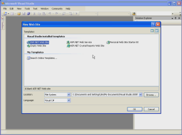

[Open Full-Screen Video](improvements-in-visual-studio-2005/_static/creating_projects1.wmv)

### File System Projects

As you saw in the video walkthrough, you can choose to create Web sites on the file system either on the local machine or on a remote location via a file share. Web sites that are created on the file system are browsed and debugged using the ASP.NET Development Server.

> [!NOTE]
> The ASP.NET Development Server may cause some confusion for customers. If a Web project is created on the file system in IISs directory structure (i.e. c:\inetpub\wwwroot), the Web site will still be browsed via the ASP.NET Development Server when launched from within Visual Studio 2005. Therefore, any IIS configuration (i.e. authentication methods) is not applicable.

The default web project also removes a lot of the overhead by only includes a Default.aspx page, default.cs file, and an App\_Data folder. The web.config and special folders (i.e. app\_code) are added as they are needed. Your web project only includes the files and folders that you need.

### HTTP Projects

HTTP projects can either be projects that are created on a local IIS Web site or on a remote Web site. The default project location is `http://localhost`. If you click the Browse button, there are two HTTP options: Local IIS and Remote Site. The main difference in these two options is the method in which the web site information is displayed in the Choose Location dialog and in how the files are copied to the Web server.

The Local IIS option reads the site information from the metabase on the local machine and files are copied using the file system. The Remote Site option uses the FrontPage Server Extensions and the site information and files are copied using HTTP and FrontPage Server Extensions RPC calls.

> [!NOTE]
> The vs###\_tmp.htm file and get\_aspx\_ver.aspx are no longer used to determine version information.

The default HTTP option is Local IIS. This option reads the IIS Metabase to determine which sites are available and the location in which to create content. You can select a different folder or virtual directory by selecting it in the tree view. You can also create a new virtual directory, mark folders as applications, as well as delete existing virtual directories from this dialog box.

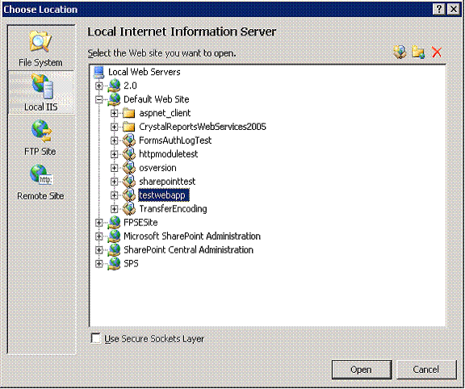

**Figure 1**: The Choose Location Dialog

Unlike in earlier versions of Visual Studio, if you check the **Use Secure Sockets Layer** checkbox and the SSL certificate does not match the URL you are browsing, you will be presented with a Security Alert dialog asking you if you would like to proceed. Using Visual Studio .NET 2003, if the certificate was not a matching one, creating the project would fail.

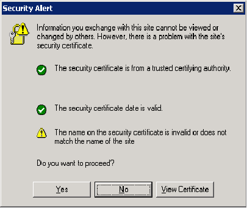

**Figure 2**: Security Alert Regarding SSL Certificate

### Note on Host Headers

If you are creating a Web application on a site bound to a specific IP, you will need to ensure that a host header is configured. Otherwise, Visual Studio will create the site at `http://localhost`, but the IP address will not resolve correctly when the site is browsed or debugged from within the IDE.

If you select the Remote Site option, the dialog changes to allow you to enter the destination URL for the new Web site. This URL must be on a server that has the FrontPage Server Extensions enabled. If you want to work with your local Web server using the FrontPage Server Extensions, you can use the Remote Site option and specify a local URL.

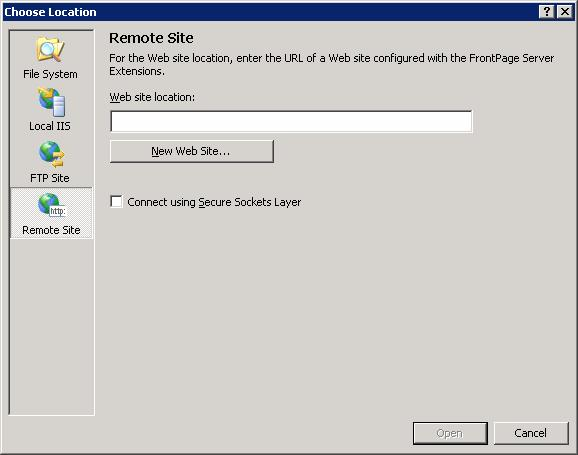

**Figure 3**: Creating a Web Site on a Remote Server

When creating an application on a remote site via SSL, if the SSL certificate does not match, the confirmation dialog is slightly different than the dialog displayed when using the Local IIS option.

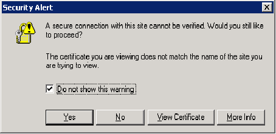

**Figure 4**: The Remote Site Security Alert

#### FTP

Visual Studio 2005 introduces the option to create Web sites via FTP. When you use this option, the IDE creates the files locally in the users temp folder and then uses FTP to move the files to the FTP location.

> [!NOTE]
> The temp folder location is c:\Documents and Settings\&lt;User&gt;\Local Settings\Temp\VWDWebCache\&lt;Server&gt;\_&lt;application name&gt;

When using the FTP option, you will be presented with a Choose Location dialog. You enter the required FTP connection information into this dialog as shown below.

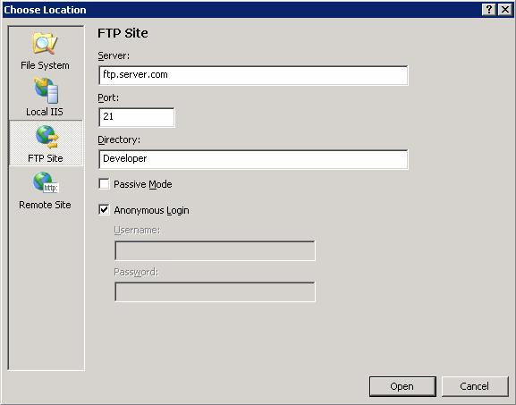

**Figure 5**: The Choose Location Dialog for FTP

## Lab: Setup FTP site and create a project

The following steps configure the FTP site so that a user has a location that only they can upload to via FTP.

### Install the FTP Service

1. Open Add Remove Programs, select Add/Remove Windows Components
2. Select Internet Information Services (Application Server on Windows 2003) and click **Details**.
3. Check **File Transfer Protocol (FTP) Service** and click **OK**.
4. Click **Next** to install the FTP service.

### Create a New Folder for Content

1. In Windows Explorer, create a new folder called **User1** inside of c:\inetpub\wwwroot.

#### Configure folders and permissions on folders.

1. Open the Internet Information Services snap-in from Administrative Tools. You will now have an FTP Sites folder under the computer name node.
2. Expand **FTP Sites**.
3. Right-click the **Default FTP Site**, select **New**, then **Virtual Directory**, then click **Next**.
4. Enter **User1** for the virtual directory name and click **Next**.
5. Enter **c:\inetpub\wwwroot\User1** for the path and click **Next**.
6. Click **Next** and then **Finish** to complete the wizard.
7. Right-click the **User1** virtual directory under Default FTP Site and select **Properties**.
8. Check the **Write** checkbox and click **OK** to close the dialog.
9. Right-click **Default FTP Site** and select **Properties**.
10. On the **Security Accounts** tab, uncheck **Allow Anonymous Connections**.
11. Click **Yes** in the dialog asking if you want to continue.
12. Click **OK** to close the dialog.
13. Expand the **Default Web Site** under the **Web Sites** node.
14. Right-click the **User1** directory and select **Properties**
15. In the **Application Settings** section, click **Create** to mark the folder as an application.
16. Click **OK** to close the dialog.
17. Close the Internet Information Services snap-in.

### Create web project

1. Open Visual Studio 2005.
2. From the **File** menu, select **New Web Site**.
3. In the **Location** dropdown, select **FTP**.
4. Click **Browse**.
5. Enter **localhost** in the **Server** textbox.
6. Enter **User1** in the Directory textbox.
7. Click **Open**. The FTP location will be entered into the New Web Site dialog.
8. Click **OK**.
9. Uncheck **Anonymous log on** in the FTP Log On dialog, enter your credentials, and click **OK**.
10. What is the URL for the project? (The URL for the project will be displayed in Solution Explorer.)
11. From the **Build** menu, select **Build Web Site** or **Build Solution**.
12. Right-click on Default.aspx in Solution Explorer and select **View in Browser**.
13. In the Web Site URL Required dialog, enter `http://localhost/user1` for the URL and click **OK**.

> [!NOTE]
> If you get a error indicating an inability to load the type \_Default, make sure that you are running ASP.NET 2.0 on your Web site and not an earlier version. You can do that from the ASP.NET tab in Internet Information Services.

## Opening Web Projects

Opening Web projects is similar to creating projects. The following sections call out areas to keep an eye out for while working within the IDE. It also covers working with Web projects using HTTP and FTP.

To open a Web project, select Open Web Site from the File menu. You will be prompted with the same Choose Location dialog covered previously and you have the same four options available to you: File System, Local IIS, FTP, and Remote Site.

## File System

As indicated previously in this module, Visual Studio no longer uses a project file. Therefore, if you choose to open a Web site from the file system, you actually have the option of choosing any folder that you wish, even if the folder you choose was not created as a Web project initially in Visual Studio. For example, you can choose to open the My Documents folder as a Web site and Visual Studio will happily open it and display your files as shown below.

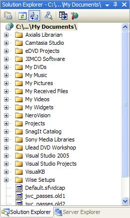

**Figure 6**: *My Documents* Opened As a Web Site

Because Visual Studio only creates additional files and folders when necessary, no additional files or folders are added to the location you open. A side-effect of this architecture is that it prevents you from nesting Web sites on the file system. For example, consider the following directory structure.

Web project at C:\MyWebSite

Another web project at C:\MyWebSite\Nested

When you open the Web site at c:\MyWebSite, the Nested folder will appear as a sub-folder of that application.

## HTTP

When opening Web sites via HTTP, settings are read either from the IIS metabase (Local IIS) or using FrontPage Server Extensions (Remote Site.) If there are nested web applications, these are displayed as well with an icon identifying them as an application. If you are familiar with working with web applications in FrontPage, the behavior in Visual Studio 2005 is similar.

Even though Visual Studio will display an icon for applications that are nested beneath the application that is currently opened within the IDE, it will not allow you to expand them to see their content. You can, however, double-click on them to open them. When you do, you will be presented with a dialog prompting you to either open the web application (and replace the currently open solution) or add the Web application to your current solution.

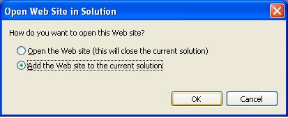

**Figure 7**: Double-clicking a nested application icon presents you with this dialog

## FTP Site

When you open a site via FTP, the files are all copied locally to your temp folder. The full path for the local storage location is displayed in the Properties pane for the project and is created using the following format.

C:\Documents and Settings\&lt;User&gt;\Local Settings\Temp\VWDWebCache\&lt;Server&gt;\_&lt;application name&gt;

When using FTP, Visual Studio will need to specify the base URL for your project so that you can browse it as shown below. If you do not specify a base URL, Visual Studio will ask you for it the first time you attempt to browse a page in the Web site.

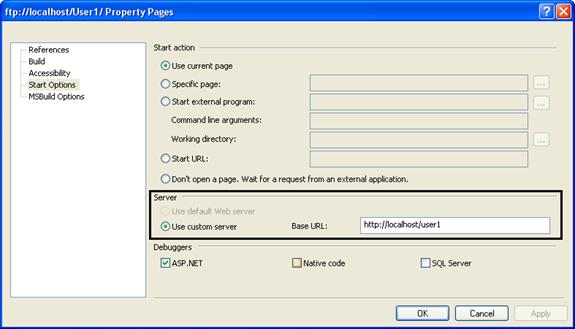

**Figure 8**: Specifying a Base URL for FTP Sites

## Improvements in Compilation

Working with Web applications in Visual Studio 2005 is noticeably faster than previous versions. This is due in no small part to the changes in compilation architecture.

In Visual Studio 2002 and 2003, Web applications were compiled into one primary assembly residing in the /bin folder. In Visual Studio 2005, an App\_Code folder was added. Classes and other non-UI code are added to the App\_Code folder. When Visual Studio builds the project, all files in the App\_Code folder are compiled into a single App\_Code.dll file. The result of this change is that subsequent builds are much faster than in previous versions.

> [!NOTE]
> The MSBuild command line utility can also be used to build ASP.NET Web applications. That tool will be covered in module 9.

Another compilation enhancement is the new Build Page option on the Build menu. This feature allows a developer to rebuild only the current page (along with, of course, and dependencies) so that changes can be compiled more quickly. Because C# does not offer background compilation for purposes of updating IntelliSense, etc., they will benefit immensely from this feature because it will allow for IntelliSense to be updated quickly by simply rebuilding a single page.

The Build properties for a project allow you to configure the type of build that occurs before the startup page is executed. Developers can choose to only build the current page so that Visual Studio can start debugging applications more quickly after code changes.

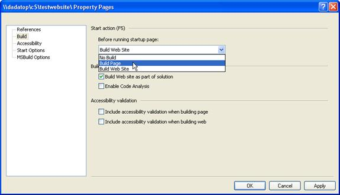

**Figure 9**: The Build Page Start Action

Another great enhancement to Visual Studio and the ASP.NET architecture is in the area of edit and continue. In Visual Studio 2005, developers can start debugging a project and make code changes on the project without detaching the debugger. In fact, you can literally start debugging a project, add a new class, add code to that class, add code to your page that creates a new instance of that class and execute a method of the class, all without detaching the debugger. Executing the new code is literally as easy as refreshing the browser!

Click here to see a video walkthrough of the edit and continue feature in Visual Studio 2005.

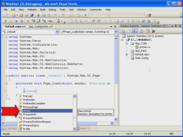

[Open Full-Screen Video](improvements-in-visual-studio-2005/_static/editcontinue1.wmv)

The robust edit and continue functionality in ASP.NET 2.0 and Visual Studio 2005 is due to an architectural change for ASP.NET applications. In ASP.NET 1.x, applications created in Visual Studio 2002/2003 were compiled into a primary assembly that was stored in the /bin folder. All classes, pages, etc. for the application were compiled into that one DLL. Then at runtime, ASP.NET would compile all of the controls, markup, and ASP.NET code within pages and copy those DLLs into the ASP.NET temporary folder.

In Visual Studio 2005 using ASP.NET 2.0, the two compilation models outline above (one for Visual Studio and one for ASP.NET at runtime) have been merged into one common compilation model. That means that all compilation issues are now caught during the development stage instead of at runtime. It also allows for designer and IntelliSense support for features such as user controls and master pages.

Click here to see a video walkthrough of designer support for user controls.

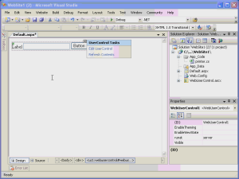

[Open Full-Screen Video](improvements-in-visual-studio-2005/_static/usercontrols1.wmv)

> [!NOTE]
> When a user control is removed from a page, the @Register directive remains in the markup and should be removed manually in order to avoid parser errors if the user control is deleted from the Web site.

Another improvement in the Visual Studio compilation model is the Publish Web Site feature. Because the Publish feature precompiles the Web site, developers can enjoy the added performance of not having to compile anything on demand. It also precompiles all source code in the App\_Code folder into a DLL so that no source code has to be deployed.

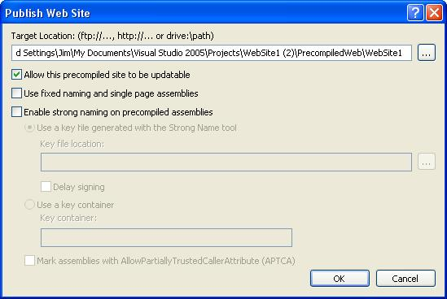

**Figure 10**: The Publish Web Site Dialog

> [!NOTE]
> The aspnet\_compile.exe utility can also be used to pre-compile an ASP.NET Web application. That tool will be covered in module 9.

When you Publish a Web site, the precompiled files are stored in the Temporary ASP.NET Files folder as shown below. Files with a *.compiled* file extension are XML files that define dependencies for particular DLLs. Any Webform or user controls are compiled into random DLLs that begin with *App\_Web\_*.

If you leave the *Allow this precompiled site to be updatable* checkbox checked, markup inside of your Webforms and user controls will not be pre-compiled into a DLL allowing you to make changes after deployment. If you would prefer to lock down the markup so that changes to the deployed content are not allowed, uncheck this box.

The *Use fixed naming and single page assemblies* checkbox allows you to disable batch compilation so that each page is compiled into a fixed-named assembly. Leaving this box unchecked allows you to take advantage of batch compilation.

The *Enable strong naming on precompiled assemblies* checkbox allows you to strong-name your precompiled assemblies.

> [!NOTE]
> In ASP.NET 1.x, strong-named assemblies had to be installed into the Global Assembly Cache (GAC). In ASP.NET 2.0, you are not required to install strong-named assemblies into the GAC.

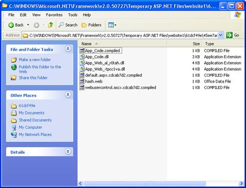

**Figure 11**: An ASP.NET Applications Pre-Compiled Files

> [!NOTE]
> In the application above, there was no web.config file. If there had been, it would have been called *PrecompiledApp.config* after the Publish Web site process.

## Improvements in Deployment

As with Visual Studio 2002 and 2003, Visual Studio 2005 offers a Copy Project feature. However, the feature has been beefed up in Visual Studio 2005 and is now called Copy Web Site.

The Copy Web Site dialog is split into a left frame and a right frame. The left frame is called the Source Web Site and the right frame is called the Remote Web Site. One thing that may confuse some developers is that the site displayed in the right frame is not necessarily a remote site. It could be a site on the local file system or on the local instance of IIS. Additionally, the site displayed in the left frame is not necessarily the source Web site because the dialog allows you to publish from the remote Web site *to* the source Web site.

If you are copying a project to a remote Web site, that site must have the FrontPage Server Extensions installed on it. If it does not, you will need to connect using FTP. On the other hand, if you are copying a project to the local IIS instance, FrontPage Server Extensions are not required.

> [!NOTE]
> If you try to create a new Web site on the local IIS instance and the FrontPage 2002 Server Extensions are installed, you will get an error message telling you that creating Web sites is not supported on a SharePoint server. In that case, you have the option of installing the FrontPage 2000 Server Extensions or removing the FrontPage Server Extensions.

Click here for a video walkthrough of the Copy Web Site feature.

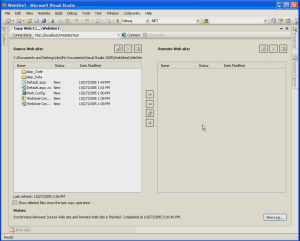

[Open Full-Screen Video](improvements-in-visual-studio-2005/_static/copysite1.wmv)

## Improvements in Debugging

There are four key improvements in debugging in Visual Studio 2005.

- Debugging locally as a non-administrator is possible out of the box.
- The Debug attribute for the Compilation element is now false by default.
- Remote debugging setup and configuration is easier than before.
- You can now debug a Web site opened via an FTP location.

## Debugging as a Non-Administrator

The addition of the ASP.NET Development Server allows non-administrators to easily debug ASP.NET applications right out of the box. When an ASP.NET application running on the local file system is debugged, Visual Studio launches the ASP.NET Development Server under the context of the logged-on user. That user can then debug that application without any additional configuration.

## Debug is False by Default

In ASP.NET 1.x, the *debug* attribute in the *compilation* element of the web.config file was set to *true* by default. It has always been recommended that developers set this attribute to *false* before deploying an application to production, but because most developers don't fully understand the consequences of leaving the debug attribute set to true, they simply left it as-is.

The most severe problem with having the debug attribute set to true is that it disables ASP.NETs batch compilation model. Therefore, each page is compiled into a separate DLL. If a Web application consists of thousands of pages (not unheard of by any means), that means several thousand small DLLs will be created by that application. While these DLLs are small in size, they are not loaded into any particular location in memory. Therefore, they cause fragmentation in system memory and can contribute to OutOfMemoryException occurrences.

In ASP.NET 2.0, the debug attribute is set to false by default. As you have already seen, when a developer debugs an ASP.NET application in Visual Studio 2005, they are prompted to add a web.config file with debugging enabled. Doing so incurs the same drawbacks that were present in ASP.NET 1.x, but now the developer is clearly warned that the attribute should be reset to false before moving the application to production.

## Remote Debugging Setup and Configuration

In Visual Studio 2002/2003, remote debugging relied on the Machine Debug Manager (mdm.exe) and the vs7jit.exe process. Because of that, troubleshooting remote debugging problems was often a black box for customers and it was often not much better for PSS.

Visual Studio 2005 removes the reliance on the mdm.exe and vs7jit.exe processes. Instead, it now uses the Remote Debug Monitor service (msvsmon.exe.)

The requirement for debugging in Visual Studio 2005 remotely is quite simple. You need to run msvsmon.exe on the remote server prior to debugging. You can install the Remote Debug Monitor from the Visual Studio CD or you can simply run msvsmon.exe from a share without installing anything at all on the Web server.

When you run msvsmon.exe, it is likely that it will complain about ports being blocked for remote debugging. Fortunately, you can easily unblock the ports from right within the warning dialog as shown below.

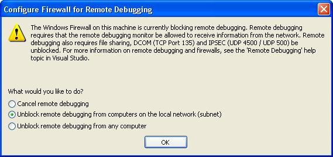

**Figure 12**: Notification that Windows Firewall is Blocking Remote Debugging

Once you have unblocked the ports necessary for debugging, you will see the Remote Debugging Monitor as shown below. From this interface, you can monitor connections and change debugging permissions easily.

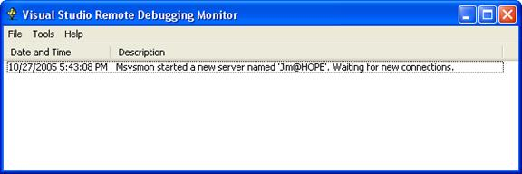

**Figure 13**: The Remote Debugging Monitor

It is also possible to remotely debug a Web application opened via FTP. The steps are the same as those previously covered. However, you will need to specify a base URL for browsing the FTP project as outlined earlier in this module.

## Lab 2

## Remote Debugging with Visual Studio 2005

This lab will walk you through remote debugging with Visual Studio 2005.

Click here for a video walkthrough of this lab.

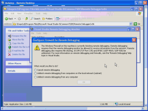

[Open Full-Screen Video](improvements-in-visual-studio-2005/_static/remdebug1.wmv)

This lab requires you to have two machines, one running Visual Studio 2005 and the other running IIS 5 or greater.

1. Open Visual Studio 2005 and create a new Web site on the remote server.

> [!NOTE]
> You can create the Web site on a remote IIS instance or via FTP.

1. From the remote Web server, locate msvsmon.exe on the development machine using a UNC path and execute it.  
 The default location for msvsmon.exe is \\server\c$\Program Files\Microsoft Visual Studio 8\Common7\IDE\Remote Debugger\x86.
2. If prompted to unblock ports for remote debugging, do so.
3. From the development machine, open the code-behind for Default.aspx and set a breakpoint in the Page\_Load method.
4. Start debugging from the development machine.

You should hit the breakpoint as expected.

## ASP.NET Development Server

As weve already discussed, Visual Studio 2005 ships with a Web server called the ASP.NET Development Server. (The ASP.NET Development Server is sometimes referred to as Cassini.) This Web server is a convenient means to browse and debug Web applications running on the file system.

The ASP.NET Development Server is a restricted Web server. It does not allow remote connections, it does not allow any requests from any user other than the user who started the Web server. It also does not have the capability of serving ASP pages. Only ASP.NET resources and HTML resources (including images, CSS files, etc.) are served.

The ASP.NET Development Server can be launched via the command line by running the WebDev.WebServer.exe file located at c:\Windows\Microsoft.NET\Framework\v2.0.\*\*\*\*\*. The following dialog displays the parameters that are available.

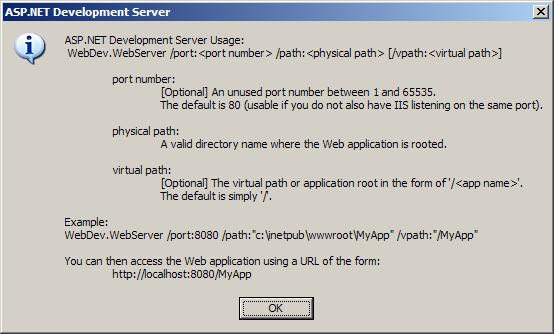

**Figure 14**

> [!NOTE]
> The ASP.NET Development Server is not supported when launched explicitly via the command line.