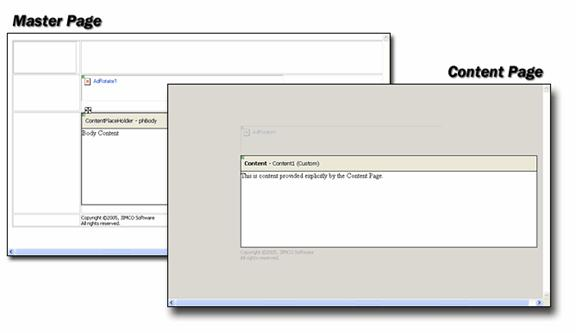
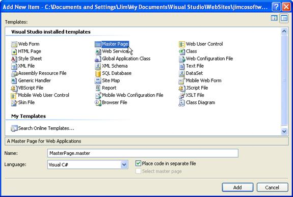
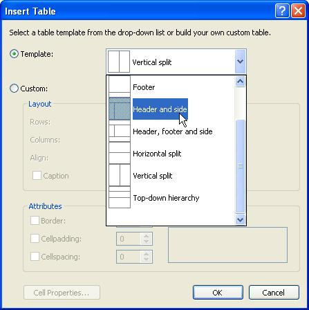
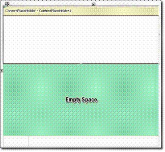
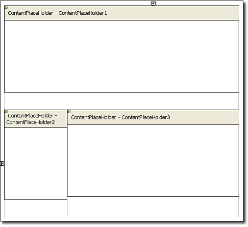
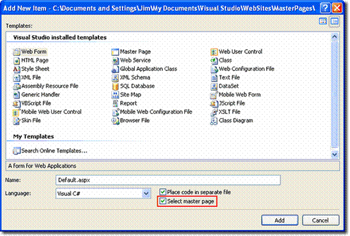
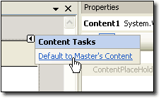
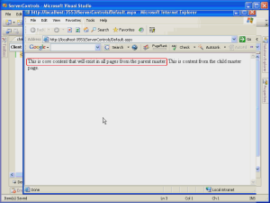
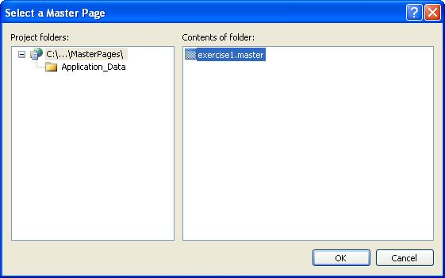

Master Pages
====================
by [Microsoft](https://github.com/microsoft)

> One of the key components to a successful Web site is a consistent look and feel. In ASP.NET 1.x, developers used user controls to replicate common page elements across a Web application. While that is certainly a workable solution, using user controls does have some drawbacks. For example, a change in position of a user control requires a change to multiple pages across a site. User controls are also not rendered in Design view after being inserted on a page.

One of the key components to a successful Web site is a consistent look and feel. In ASP.NET 1.x, developers used user controls to replicate common page elements across a Web application. While that is certainly a workable solution, using user controls does have some drawbacks. For example, a change in position of a user control requires a change to multiple pages across a site. User controls are also not rendered in Design view after being inserted on a page.

ASP.NET 2.0 introduces Master pages as a way of maintaining a consistent look and feel, and as you'll soon see, Master pages represent a significant improvement over the user control method.

## Why Master Pages?

You may be wondering why master pages were needed in ASP.NET 2.0. After all, Web site developers are already using user controls in ASP.NET 1.x to share content areas between pages. There are actually several reasons why user controls are a less-than-optimal solution for creating a common layout.

User controls don't actually define page layout. Instead, they define the layout and functionality for a portion of a page. The distinction between these two is important because it makes manageability of a user control solution much more difficult. For example, when you want to change the position of a user control on your page, you must edit the actual page on which the user control appears. Thats fine if you have only a few pages, but in large sites, it quickly becomes a site management nightmare!

Another drawback of using user controls for defining a common layout is rooted in the architecture of ASP.NET itself. If any public member of a user control is changed, it requires you to recompile all of the pages that use the user control. In turn, ASP.NET will then re-JIT your pages when they are first accessed. This, once again, produces a non-scalable architecture and a site management problem for larger sites.

Both of these problems (and many more) are nicely addressed by master pages in ASP.NET 2.0.

## How Master Pages Work

A master page is analogous to a template for other pages. Page elements that should be shared among other pages (i.e. menus, borders, etc.) are added to the master page. When new pages are added to the site, you can associate them with a master page. A page that is associated with a master page is called a **content page**. By default, a content page takes on the appearance from the master page. However, when you create a master page, you can define portions of the page that the content page can replace with its own content. These portions are defined using a new control introduced in ASP.NET 2.0; the **ContentPlaceHolder** control.

A master page can contain any number of ContentPlaceHolder controls (or none at all.) On the content page, the content from the ContentPlaceHolder controls appears inside of **Content** controls, another new control in ASP.NET 2.0. By default, the content pages Content controls are empty so that you can provide your own content. If you want to use the content from the master page inside of the Content controls, you can do so as you will see later in this module. The Content control is mapped to the ContentPlaceHolder control via the ContentPlaceHolderID attribute of the Content control. The code below maps a Content control to a ContentPlaceHolder control called mainBody on a master page.

[!code-aspx[Main](master-pages/samples/sample1.aspx)]

> [!NOTE]
> You will often hear people describe master pages as being a base class for other pages. Thats actually not true. The relationship between master pages and content pages is not one of inheritance.

**Figure 1** shows a master page and an associated content page as they appear in Visual Studio 2005. You can see the ContentPlaceHolder control in the master page and the corresponding Content control in the content page. Notice that the master pages content that is outside of the ContentPlaceHolder is visible but grayed out in the content page. Only the content inside of the ContentPlaceHolder can be supplanted by the content page. All other content that comes from the master page is immutable.

**Figure 1**: A master page and its associated content page

## Creating a Master Page

To create a new master page:

1. Open Visual Studio 2005 and create a new Web site.
2. Click File, New, File.
3. Choose Master File from the Add New Item dialog as shown in **figure 2**.
4. Click Add.

**Figure 2**: Creating a New Master Page

Notice that the file extension for a master page is *.master*. This is one of the ways that a master page differs from an ordinary page. The other primary difference is that in lieu of a @Page directive, the master page contains a @Master directive. Switch to Source View for the master page youve just created and review the code.

A new master page will have one ContentPlaceHolder control by default. In most cases, it makes more sense to create the common page elements first and then insert ContentPlaceHolder controls where custom content is desired. In those cases, developers will want to delete the default ContentPlaceHolder control and insert new ones as the page is developed. ContentPlaceHolder controls are not resizable despite the fact that they do display sizing handles. The ContentPlaceHolder control sizes automatically based upon the content that it contains with one exception; if you place a ContentPlaceHolder control inside of a block element such as a table cell, it will size according to the size of the element.

## Lab 1 Working with Master Pages

In this lab, you will create a new master page and define three ContentPlaceHolder controls. You will then create a new Content page and replace the content from at least one of the ContentPlaceHolder controls.

1. Create a master page and insert ContentPlaceHolder controls. 

    1. Create a new master page as described above.
    2. Delete the default ContentPlaceHolder control.
    3. Select the ContentPlaceHolder control by clicking the shaded top border of the control and then delete it by hitting the DEL key on your keyboard.
    4. Insert a new table using the *Header and side* template as shown in figure 3. Change the width and height to 90% each so that the entire table is visible in the designer.

**Figure 3**

1. Place the cursor into each cell of the table and set the *valign* property to *top*.
2. From the Toolbox, insert a ContentPlaceHolder control in the top cell of the table (the header cell.)
3. When you insert this ContentPlaceHolder control, you will notice that the row height will take up almost the entire page as shown in figure 4. Dont be concerned about that at this point.

**Figure 4**: The empty space is in the same cell as the ContentPlaceHolder

1. Place a ContentPlaceHolder control in the other two cells. Once the other ContentPlaceHolder controls have been inserted, the size of the table cells should be as you would expect. The page should now look like the page shown in **figure 5**.

**Figure 5**: The Master with all ContentPlaceHolder controls. Notice that the cell height for the header cell is now what it should be

1. Enter some text of your choice into each of the three ContentPlaceHolder controls.
2. Save the master page as exercise1.master.
3. Create a new Web Form and associate it with the exercise1.master master page.
4. Select File, New, File in Visual Studio 2005.
5. Select **Web Form** in the Add New Item dialog.
6. Make sure that the Select master page checkbox is checked as shown in figure 6.

**Figure 6**: Adding a new Content Page

1. Click Add.
2. Select exercise1.master in the Select a master page dialog as shown in figure 7.
3. Click OK to add the new content page.

The new content page appears in Visual Studio with one Content control for each ContentPlaceHolder control on the master page. By default, the Content controls are empty so that you can add your own content. If youd like for them to use the content from the ContentPlaceHolder control on the master page, simply click on the smart tag symbol (the small black arrow in the upper-right corner of the control) and choose *Default to Masters Content* from the smart tag as shown in **figure 8**. When you do so, the menu item changes to *Create Custom Content*. Clicking it at that point removes the content from the master page allowing you to define custom content for that particular Content control.

**Figure 7**: Setting a Content Control to Default to the Master Pages Content

## Connecting Master Page and Content Pages

The association between a master page and a content page can be configured in one of four different ways:

- The **MasterPageFile** attribute of the @Page directive
- Setting the **Page.MasterPageFile** property in code.
- The **&lt;pages&gt;** element in the applications configuration file (web.config in the root folder of the application)
- The **&lt;pages&gt;** element in a subfolders configuration file (web.config in a subfolder)

## MasterPageFile Attribute

The MasterPageFile attribute makes it easy to apply a master page to a particular ASP.NET page. It is also the method used to apply the master page when you check the **Select Master Page** checkbox as you did in Exercise 1.

## Setting Page.MasterPageFile in Code

By setting the MasterPageFile property in code, you can apply a particular master page to your content at runtime. This is useful in cases where you may need to apply a specific master page based upon a users role or some other criteria. The MasterPageFile property must be set in the PreInit method. If it is set after the PreInit method, an InvalidOperationException will be thrown. The page on which this property is being set must also have a Content control as the top-level control for the page. Otherwise an HttpException will be thrown when the MasterPageFile property is set.

## Using the &lt;pages&gt; Element

You can configure a master page for your pages by setting the masterPageFile attribute in the &lt;pages&gt; element of the web.config file. When using this method, keep in mind that web.config files lower in the application structure can override this setting. Any MasterPageFile attribute set in a @Page directive will also override this setting. Using the &lt;pages&gt; element makes it simple to create a *master* master page that can be overridden if necessary in particular folders or files.

## Properties in Master Pages

A master page can expose properties by simply making those properties public within the master page. For example, the following code defines a property called SomeProperty:

[!code-csharp[Main](master-pages/samples/sample2.cs)]

To access the SomeProperty property from the Content page, you will need to use the Master property like so:

[!code-csharp[Main](master-pages/samples/sample3.cs)]

## Nesting Master Pages

Master pages are the perfect solution for ensuring a common look and feel across a large Web application. However, it's not uncommon to have certain parts of a large site share a common interface while other parts share a different interface. To address that need, multiple master pages are the perfect solution. However, that still doesn't address the fact that a large application may have certain components (such as a menu, for example) that are shared among all pages and other components that are shared only among certain sections of the site. For that type of situation, nested master pages fill the need nicely. As you've seen, a normal master page consists of a master page and a content page. In a nested master page situation, there are two master pages; a parent master and a child master. The child master page is also a content page and its master is the parent master page.

Here is the code for a typical master page:

[!code-aspx[Main](master-pages/samples/sample4.aspx)]

In a nested master scenario, this would be the parent master. Another master page would use this page as its master page, and that code would look like this:

[!code-aspx[Main](master-pages/samples/sample5.aspx)]

Note that in this scenario, the child master is also a content page for the parent master. All of the child master's content appears inside of a Content control that gets its content from the parent's ContentPlaceHolder control.

> [!NOTE]
> Designer support is not available for nested master pages. When you are developing using nested masters, you will need to use source view.

This video shows a walkthrough of using nested master pages.

[Open Full-Screen Video](master-pages/_static/nested1.wmv)

**Figure 8**: Selecting a Master Page