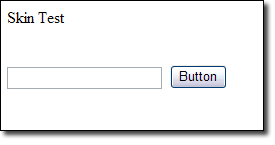
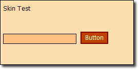
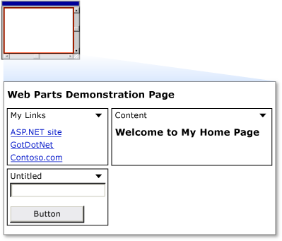
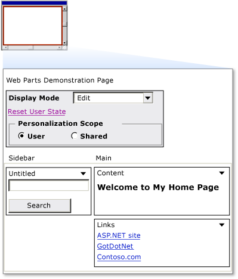
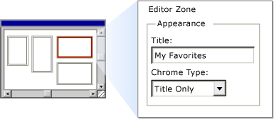
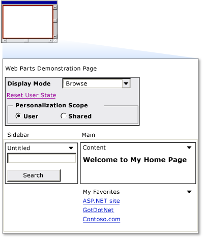
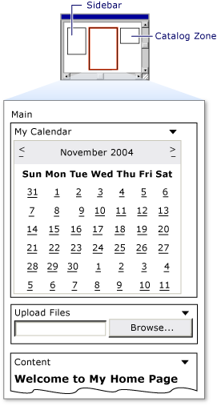

Profiles, Themes, and Web Parts
====================
by [Microsoft](https://github.com/microsoft)

> There are major changes in configuration and instrumentation in ASP.NET 2.0. The new ASP.NET configuration API allows for configuration changes to be made programmatically. In addition, many new configuration settings exist allow for new configurations and instrumentation.

ASP.NET 2.0 represents a substantial improvement in the area of personalized Web sites. In addition to the membership features weve already covered, ASP.NET profiles, themes, and Web parts significantly enhance personalization in Web sites.

## ASP.NET Profiles

ASP.NET profiles are similar to sessions. The difference is that a profile is persistent whereas a session is lost when the browser is closed. Another big difference between sessions and profiles is that profiles are strongly typed, therefore providing you with IntelliSense during the development process.

A profile is defined in either the machines configuration file or the web.config file for the application. (You cannot define a profile in a sub-folders web.config file.) The code below defines a profile to store the Web site visitors first and last name.

[!code-xml[Main](profiles-themes-and-web-parts/samples/sample1.xml)]

The default data type for a profile property is System.String. In the above example, no data type was specified. Therefore the FirstName and LastName properties are both of type String. As previously mentioned, profile properties are strongly typed. The code below adds a new property for age that is of type Int32.

[!code-xml[Main](profiles-themes-and-web-parts/samples/sample2.xml)]

Profiles are generally used with ASP.NET Forms authentication. When used in combination with Forms authentication, each user has a separate profile associated with their user ID. However, it is also possible to allow the use of profiles in an anonymous application using the &lt;anonymousIdentification&gt; element in the configuration file along with the **allowAnonymous** attribute as shown below:

[!code-xml[Main](profiles-themes-and-web-parts/samples/sample3.xml)]

When an anonymous user browses the site, ASP.NET creates an instance of **ProfileCommon** for the user. This profile uses a unique ID stored in a cookie on the browser to identify the user as a unique visitor. In this way, you can store profile information for users who are browsing anonymously.

## Profile Groups

It is possible to group properties of profiles. By grouping properties, it is possible to simulate multiple profiles for a specific application.

The following configuration configures a FirstName and LastName property for two groups; Buyers and Prospects.

[!code-xml[Main](profiles-themes-and-web-parts/samples/sample4.xml)]

It is then possible to set properties on a particular group as follows:

[!code-csharp[Main](profiles-themes-and-web-parts/samples/sample5.cs)]

## Storing Complex Objects

So far, the examples we've covered have stored simple data types in a profile. It is also possible to store complex data types in a profile by specifying the method of serialization using the **serializeAs** attribute as follows:

[!code-xml[Main](profiles-themes-and-web-parts/samples/sample6.xml)]

In this case, the type is PurchaseInvoice. The PurchaseInvoice class needs to be marked as serializable and can contain any number of properties. For example, if PurchaseInvoice has a property called **NumItemsPurchased**, you can refer to that property in code as follows:

[!code-css[Main](profiles-themes-and-web-parts/samples/sample7.css)]

## Profile Inheritance

It is possible to create a profile for use in multiple applications. By creating a profile class that derives from ProfileBase, you can reuse a profile in several applications by using the **inherits** attribute as shown below:

[!code-xml[Main](profiles-themes-and-web-parts/samples/sample8.xml)]

In this case, the class **PurchasingProfile** would look like so:

[!code-csharp[Main](profiles-themes-and-web-parts/samples/sample9.cs)]

## Profile Providers

ASP.NET profiles use the provider model. The default provider stores the information in a SQL Server Express database in the App\_Data folder of the Web application using the SqlProfileProvider provider. If the database doesn't exist, ASP.NET will automatically create it when the profile attempts to store information.

In some cases, however, you may want to develop your own profile provider. The ASP.NET profile feature enables you to easily use different providers.

You create a custom profile provider when:

- You need to store profile information in a data source, such as in a FoxPro database or in an Oracle database, that is not supported by the profile providers included with the .NET Framework.
- You need to manage profile information using a database schema that is different from the database schema used by the providers included with the .NET Framework. A common example is that you want to integrate profile information with user data in an existing SQL Server database.

### Required Classes

To implement a profile provider, you create a class that inherits the System.Web.Profile.ProfileProvider abstract class. The **ProfileProvider** abstract class in turn inherits the System.Configuration.SettingsProvider abstract class, which inherits the System.Configuration.Provider.ProviderBase abstract class. Because of this inheritance chain, in addition to the required members of the **ProfileProvider** class, you must implement the required members of the **SettingsProvider** and **ProviderBase** classes.

The following tables describe the properties and methods that you must implement from the **ProviderBase**, **SettingsProvider**, and **ProfileProvider** abstract classes.

### ProviderBase Members

| **Member** | **Description** |
| --- | --- |
| Initialize method | Takes as input the name of the provider instance and a NameValueCollection of configuration settings. Used to set options and property values for the provider instance, including implementation-specific values and options specified in the machine configuration or Web.config file. |

### SettingsProvider Members

| **Member** | **Description** |
| --- | --- |
| ApplicationName property | The application name that is stored with each profile. The profile provider uses the application name to store profile information separately for each application. This enables multiple ASP.NET applications to use the same data source without a conflict if the same user name is created in different applications. Alternatively, multiple ASP.NET applications can share a profile data source by specifying the same application name. |
| GetPropertyValues method | Takes as input a SettingsContext and a SettingsPropertyCollection object. The **SettingsContext** provides information about the user. You can use the information as a primary key to retrieve profile property information for the user. Use the **SettingsContext** object to get the user name and whether the user is authenticated or anonymous. The **SettingsPropertyCollection** contains a collection of SettingsProperty objects. Each **SettingsProperty** object provides the name and type of the property as well as additional information such as the default value for the property and whether the property is read-only. The **GetPropertyValues** method populates a SettingsPropertyValueCollection with SettingsPropertyValue objects based on the **SettingsProperty** objects provided as input. The values from the data source for the specified user are assigned to the PropertyValue properties for each **SettingsPropertyValue** object and the entire collection is returned. Calling the method also updates the LastActivityDate value for the specified user profile to the current date and time. |
| SetPropertyValues method | Takes as input a **SettingsContext** and a **SettingsPropertyValueCollection** object. The **SettingsContext** provides information about the user. You can use the information as a primary key to retrieve profile property information for the user. Use the **SettingsContext** object to get the user name and whether the user is authenticated or anonymous. The **SettingsPropertyValueCollection** contains a collection of **SettingsPropertyValue** objects. Each **SettingsPropertyValue** object provides the name, type, and value of the property as well as additional information such as the default value for the property and whether the property is read-only. The **SetPropertyValues** method updates the profile property values in the data source for the specified user. Calling the method also updates the **LastActivityDate** and LastUpdatedDate values for the specified user profile to the current date and time. |

### ProfileProvider Members

| **Member** | **Description** |
| --- | --- |
| DeleteProfiles method | Takes as input a string array of user names and deletes from the data source all profile information and property values for the specified names where the application name matches the **ApplicationName** property value. If your data source supports transactions, it is recommended that you include all delete operations in a transaction and that you roll back the transaction and throw an exception if any delete operation fails. |
| DeleteProfiles method | Takes as input a collection of ProfileInfo objects and deletes from the data source all profile information and property values for each profile where the application name matches the **ApplicationName** property value. If your data source supports transactions, it is recommended that you include all delete operations in a transaction and roll back the transaction and throw an exception if any delete operation fails. |
| DeleteInactiveProfiles method | Takes as input a ProfileAuthenticationOption value and a DateTime object and deletes from the data source all profile information and property values where the last activity date is less than or equal to the specified date and time and where the application name matches the **ApplicationName** property value. The **ProfileAuthenticationOption** parameter specifies whether only anonymous profiles, only authenticated profiles, or all profiles are to be deleted. If your data source supports transactions, it is recommended that you include all delete operations in a transaction and roll back the transaction and throw an exception if any delete operation fails. |
| GetAllProfiles method | Takes as input a **ProfileAuthenticationOption** value, an integer that specifies the page index, an integer that specifies the page size, and a reference to an integer that will be set to the total count of profiles. Returns a ProfileInfoCollection that contains **ProfileInfo** objects for all profiles in the data source where the application name matches the **ApplicationName** property value. The **ProfileAuthenticationOption** parameter specifies whether only anonymous profiles, only authenticated profiles, or all profiles are to be returned. The results returned by the **GetAllProfiles** method are constrained by the page index and page size values. The page size value specifies the maximum number of **ProfileInfo** objects to return in the **ProfileInfoCollection**. The page index value specifies which page of results to return, where 1 identifies the first page. The parameter for total records is an out parameter (you can use **ByRef** in Visual Basic) that is set to the total number of profiles. For example, if the data store contains 13 profiles for the application and the page index value is 2 with a page size of 5, the **ProfileInfoCollection** returned contains the sixth through the tenth profiles. The total records value is set to 13 when the method returns. |
| GetAllInactiveProfiles method | Takes as input a **ProfileAuthenticationOption** value, a **DateTime** object, an integer that specifies the page index, an integer that specifies the page size, and a reference to an integer that will be set to the total count of profiles. Returns a **ProfileInfoCollection** that contains **ProfileInfo** objects for all profiles in the data source where the last activity date is less than or equal to the specified **DateTime** and where the application name matches the **ApplicationName** property value. The **ProfileAuthenticationOption** parameter specifies whether only anonymous profiles, only authenticated profiles, or all profiles are to be returned. The results returned by the **GetAllInactiveProfiles** method are constrained by the page index and page size values. The page size value specifies the maximum number of **ProfileInfo** objects to return in the **ProfileInfoCollection**. The page index value specifies which page of results to return, where 1 identifies the first page. The parameter for total records is an out parameter (you can use **ByRef** in Visual Basic) that is set to the total number of profiles. For example, if the data store contains 13 profiles for the application and the page index value is 2 with a page size of 5, the **ProfileInfoCollection** returned contains the sixth through the tenth profiles. The total records value is set to 13 when the method returns. |
| FindProfilesByUserName method | Takes as input a **ProfileAuthenticationOption** value, a string containing a user name, an integer that specifies the page index, an integer that specifies the page size, and a reference to an integer that will be set to the total count of profiles. Returns a **ProfileInfoCollection** that contains **ProfileInfo** objects for all profiles in the data source where the user name matches the specified user name and where the application name matches the **ApplicationName** property value. The **ProfileAuthenticationOption** parameter specifies whether only anonymous profiles, only authenticated profiles, or all profiles are to be returned. If your data source supports additional search capabilities, such as wildcard characters, you can provide more extensive search capabilities for user names. The results returned by the **FindProfilesByUserName** method are constrained by the page index and page size values. The page size value specifies the maximum number of **ProfileInfo** objects to return in the **ProfileInfoCollection**. The page index value specifies which page of results to return, where 1 identifies the first page. The parameter for total records is an out parameter (you can use **ByRef** in Visual Basic) that is set to the total number of profiles. For example, if the data store contains 13 profiles for the application and the page index value is 2 with a page size of 5, the **ProfileInfoCollection** returned contains the sixth through the tenth profiles. The total records value is set to 13 when the method returns. |
| FindInactiveProfilesByUserName method | Takes as input a **ProfileAuthenticationOption** value, a string containing a user name, a **DateTime** object, an integer that specifies the page index, an integer that specifies the page size, and a reference to an integer that will be set to the total count of profiles. Returns a **ProfileInfoCollection** that contains **ProfileInfo** objects for all profiles in the data source where the user name matches the specified user name, where the last activity date is less than or equal to the specified **DateTime**, and where the application name matches the **ApplicationName** property value. The **ProfileAuthenticationOption** parameter specifies whether only anonymous profiles, only authenticated profiles, or all profiles are to be returned. If your data source supports additional search capabilities, such as wildcard characters, you can provide more extensive search capabilities for user names. The results returned by the **FindInactiveProfilesByUserName** method are constrained by the page index and page size values. The page size value specifies the maximum number of **ProfileInfo** objects to return in the **ProfileInfoCollection**. The page index value specifies which page of results to return, where 1 identifies the first page. The parameter for total records is an out parameter (you can use **ByRef** in Visual Basic) that is set to the total number of profiles. For example, if the data store contains 13 profiles for the application and the page index value is 2 with a page size of 5, the **ProfileInfoCollection** returned contains the sixth through the tenth profiles. The total records value is set to 13 when the method returns. |
| GetNumberOfInActiveProfiles method | Takes as input a **ProfileAuthenticationOption** value and a **DateTime** object and returns a count of all profiles in the data source where the last activity date is less than or equal to the specified **DateTime** and where the application name matches the **ApplicationName** property value. The **ProfileAuthenticationOption** parameter specifies whether only anonymous profiles, only authenticated profiles, or all profiles are to be counted. |

### ApplicationName

Because profile providers store profile information separately for each application, you must ensure that your data schema includes the application name and that queries and updates also include the application name. For example, the following command is used to retrieve a property value from a database based on the user name and whether the profile is anonymous, and ensures that the **ApplicationName** value is included in the query.

[!code-sql[Main](profiles-themes-and-web-parts/samples/sample10.sql)]

## ASP.NET Themes

## What are ASP.NET 2.0 Themes?

One of the most important aspects of a Web application is a consistent look and feel across the site. ASP.NET 1.x developers usually use Cascading Style Sheets (CSS) to implement a consistent look and feel. ASP.NET 2.0 themes significantly improve upon CSS because they give the ASP.NET developer the ability to define the appearance of ASP.NET server controls as well as HTML elements. ASP.NET themes can be applied to individual controls, a specific Web page, or an entire Web application. Themes use a combination of CSS files, an optional skin file, and an optional Images directory if images are needed. The skin file controls the visual appearance of ASP.NET server controls.

## Where are Themes Stored?

The location where themes are stored differs based upon their scope. Themes that can be applied to any application are stored in the following folder:

`C:\WINDOWS\Microsoft.NET\Framework\v2.x.xxxxx\ASP.NETClientFiles\Themes\<Theme_Name>`

A theme that is specific to a particular application is stored in an App\_Themes\&lt;Theme\_Name&gt; directory in the root of the Web site.

> [!NOTE]
> A skin file should only modify server control properties that affect appearance.

A global theme is a theme that can be applied to any application or Web site running on the Web server. These themes are stored by default in the ASP.NETClientfiles\Themes directory that is inside of the v2.x.xxxxx directory. Alternatively, you can move the theme files into the aspnet\_client/system\_web/[version]/Themes/[theme\_name] folder in the root of your Web site.

Application-specific themes can only be applied to the application in which the files reside. These files are stored in the App\_Themes/&lt;theme\_name&gt; directory in the root of the Web site.

## The Components of a Theme

A theme is made up of one or more CSS files, an optional skin file, and an optional Images folder. The CSS files can be any name you wish (i.e. default.css or theme.css, etc.) and must be in the root of the themes folder. The CSS files are used to define ordinary CSS classes and attributes for specific selectors. To apply one of the CSS classes to a page element, the **CSSClass** property is used.

The skin file is an XML file that contains property definitions for ASP.NET server controls. The code listed below is an example skin file.

[!code-aspx[Main](profiles-themes-and-web-parts/samples/sample11.aspx)]

**Figure 1** below shows a small ASP.NET page browsed without a theme applied. **Figure 2** shows the same file with a theme applied. The background color and text color are configured via a CSS file. The appearance of the button and textbox are configured using the skin file listed above.

**Figure 1**: No Theme

**Figure 2**: Theme Applied

The skin file listed above defines a default skin for all TextBox controls and Button controls. That means that every TextBox control and Button control inserted on a page will take on this appearance. You can also define a skin that can be applied to specific instances of these controls using the **SkinID** property of the control.

The code below defines a skin for a Button control. Only Button controls with a **SkinID** property of **goButton** will take on the appearance of the skin.

[!code-aspx[Main](profiles-themes-and-web-parts/samples/sample12.aspx)]

You can only have one default skin per server control type. If you require additional skins, you should use the SkinID property.

## Applying Themes to Pages

A theme can be applied using any one of the following methods:

- In the &lt;pages&gt; element of the web.config file
- In the @Page directive of a page
- Programmatically

## Applying a Theme in the Configuration File

To apply a theme in the applications configuration file, use the following syntax:

[!code-xml[Main](profiles-themes-and-web-parts/samples/sample13.xml)]

The theme name specified here must match the name of the themes folder. This folder can exist either in any one of the locations mentioned earlier in this course. If you attempt to apply a theme that doesn't exist, a configuration error will occur.

## Applying a Theme in the Page Directive

You can also apply a theme in the @ Page directive. This method allows you to use a theme for a specific page.

To apply a theme in the @Page directive, use the following syntax:

[!code-aspx[Main](profiles-themes-and-web-parts/samples/sample14.aspx)]

Once again, the theme specified here must match the theme folder as mentioned previously. If you attempt to apply a theme that doesn't exist, a build failure will occur. Visual Studio will also highlight the attribute and notify you that no such theme exists.

## Applying a Theme Programmatically

To apply a theme programmatically, you must specify the **Theme** property for the page in the **Page\_PreInit** method.

To apply a theme programmatically, use the following syntax:

[!code-csharp[Main](profiles-themes-and-web-parts/samples/sample15.cs)]

It is necessary to apply the theme in the PreInit method due to the page lifecycle. If you apply it after that point, the pages theme will have already been applied by the runtime and a change at that point is too late in the lifecycle. If you apply a theme that doesn't exist, an **HttpException** occurs. When a theme is applied programmatically, a build warning will occur if any server controls have a SkinID property specified. This warning is intended to inform you that no theme is declaratively applied and it can be ignored.

## Exercise 1 : Applying a Theme

In this exercise, you will apply an ASP.NET theme to a Web site.

> [!IMPORTANT]
> If you are using Microsoft Word to enter information into a skin file, make sure that you are not replacing regular quotes with smart quotes. Smart quotes will cause problems with skin files.

1. Create a new ASP.NET Web site.
2. Right-click on the project in Solution Explorer and choose Add New Item.
3. Choose Web Configuration File from the list of files and click Add.
4. Right-click on the project in Solution Explorer and choose Add New Item.
5. Choose Skin File and click Add.
6. Click Yes when asked if youd like to place the file inside of the App\_Themes folder.
7. Right-click on the SkinFile folder inside of the App\_Themes folder in Solution Explorer and choose Add New Item.
8. Choose Style Sheet from the list of files and click Add. You now have all of the files necessary to implement your new theme. However, Visual Studio has named your themes folder SkinFile. Right-click on that folder and change the name to CoolTheme.
9. Open the SkinFile.skin file and add the following code the end of the file: 

    [!code-aspx[Main](profiles-themes-and-web-parts/samples/sample16.aspx)]
10. Save the SkinFile.skin file.
11. Open the StyleSheet.css.
12. Replace all of the text in it with the following: 

    [!code-css[Main](profiles-themes-and-web-parts/samples/sample17.css)]
13. Save the StyleSheet.css file.
14. Open the Default.aspx page.
15. Add a TextBox control and a Button control.
16. Save the page. Now browse the Default.aspx page. It should display as a normal Web form.
17. Open the web.config file.
18. Add the following directly underneath the opening `<system.web>` tag: 

    [!code-xml[Main](profiles-themes-and-web-parts/samples/sample18.xml)]
19. Save the web.config file. Now browse the Default.aspx page. It should display with the theme applied.
20. If it's not already open, open the Default.aspx page in Visual Studio.
21. Select the Button.
22. Change the **SkinID** property to goButton. Notice that Visual Studio provides a dropdown with valid SkinID values for a Button control.
23. Save the page. Now preview the page in your browser again. The Button should now say "go" and should be wider in appearance.

Using the **SkinID** property, you can easily configure different skins for different instances of a particular type of server control.

## The StyleSheetTheme Property

So far, we've talked only about applying themes using the Theme property. When using the Theme property, the skin file will override any declarative settings for server controls. For example, in exercise 1, you specified a SkinID of "goButton" for the Button control and that changed the Button's text to "go". You may have noticed that the Text property of the Button in the designer was set to "Button", but the theme overrode that. The theme will always override any property settings in the designer.

If you'd like to be able to override the properties defined in the theme's skin file with properties specified in the designer, you can use the **StyleSheetTheme** property instead of the Theme property. The StyleSheetTheme property is the same as the Theme property except that it does not override all explicit property settings like the Theme property does.

To see this in action, open the web.config file from the project in exercise 1 and change the &lt;pages&gt; element to the following:

[!code-xml[Main](profiles-themes-and-web-parts/samples/sample19.xml)]

Now browse the Default.aspx page and you'll see that the Button control has a Text property of "Button" again. That's because the explicit property setting in the designer is overriding the Text property set by the goButton SkinID.

## Overriding Themes

A global theme can be overridden by applying a theme by the same name in the App\_Themes folder of the application. However, the theme is not applied in a true override scenario. If the runtime encounters theme files in the App\_Themes folder, it will apply the theme using those files and will ignore the global theme.

The StyleSheetTheme property is overridable and can be overridden in code as follows:

[!code-csharp[Main](profiles-themes-and-web-parts/samples/sample20.cs)]

## Web Parts

ASP.NET Web Parts is an integrated set of controls for creating Web sites that enable end users to modify the content, appearance, and behavior of Web pages directly from a browser. The modifications can be applied to all users on the site or to individual users. When users modify pages and controls, the settings can be saved to retain a user's personal preferences across future browser sessions, a feature called personalization. These Web Parts capabilities mean that developers can empower end users to personalize a Web application dynamically, without developer or administrator intervention.

Using the Web Parts control set, you as a developer can enable end users to:

- Personalize page content. Users can add new Web Parts controls to a page, remove them, hide them, or minimize them like ordinary windows.
- Personalize page layout. Users can drag a Web Parts control to a different zone on a page, or change its appearance, properties, and behavior.
- Export and import controls. Users can import or export Web Parts control settings for use in other pages or sites, retaining the properties, appearance, and even the data in the controls. This reduces data entry and configuration demands on end users.
- Create connections. Users can establish connections between controls so that, for example, a chart control could display a graph for the data in a stock ticker control. Users could personalize not only the connection itself, but the appearance and details of how the chart control displays the data.
- Manage and personalize site-level settings. Authorized users can configure site-level settings, determine who can access a site or page, set role-based access to controls, and so on. For example, a user in an administrative role could set a Web Parts control to be shared by all users, and prevent users who are not administrators from personalizing the shared control.

You will typically work with Web Parts in one of three ways: creating pages that use Web Parts controls, creating individual Web Parts controls, or creating complete, personalizable Web applications, such as a portal.

## Page Development

Page developers can use visual design tools such as Microsoft Visual Studio 2005 to create pages that use Web Parts. One advantage in using a tool such as Visual Studio is that the Web Parts control set provides features for drag-and-drop creation and configuration of Web Parts controls in a visual designer. For example, you can use the designer to drag a Web Parts zone, or a Web Parts editor control, onto the design surface, and then configure the control right in the designer using the UI provided by the Web Parts control set. This can speed development of Web Parts applications and reduce the amount of code you have to write.

## Control Development

You can use any existing ASP.NET control as a Web Parts control, including standard Web server controls, custom server controls, and user controls. For maximum programmatic control of your environment, you can also create custom Web Parts controls that derive from the WebPart class. For individual Web Parts control development, you will typically either create a user control and use it as a Web Parts control, or develop a custom Web Parts control.

As an example of developing a custom Web Parts control, you could create a control to provide any of the features provided by other ASP.NET server controls that might be useful to package as a personalizable Web Parts control: calendars, lists, financial information, news, calculators, rich text controls for updating content, editable grids that connect to databases, charts that dynamically update their displays, or weather and travel information. If you provide a visual designer with your control, then any page developer using Visual Studio can simply drag your control into a Web Parts zone and configure it at design time without having to write additional code.

Personalization is the foundation of the Web Parts feature. It enables users to modify--or personalize--the layout, appearance, and behavior of Web Parts controls on a page. The personalized settings are long-lived: they are persisted not just during the current browser session (as with view state), but also in long-term storage, so that a user's settings are saved for future browser sessions as well. Personalization is enabled by default for Web Parts pages.

The UI structural components rely on personalization and provide the core structure and services needed by all Web Parts controls. One UI structural component required on every Web Parts page is the WebPartManager control. Although never visible, this control has the critical task of coordinating all Web Parts controls on a page. For example, it tracks all the individual Web Parts controls. It manages Web Parts zones (regions that contain Web Parts controls on a page), and which controls are in which zones. It also tracks and controls the different display modes a page can be in, such as browse,connect, edit, or catalog mode, and whether personalization changes apply to all users or to individual users. Finally, it initiates and tracks connections and communication between Web Parts controls.

The second kind of UI structural component is the zone. Zones act as layout managers on a Web Parts page. They contain and organize controls that derive from the Part class (part controls), and provide the ability to do modular page layout in either horizontal or vertical orientation. Zones also offer common and consistent UI elements (such as header and footer style, title, border style, action buttons, and so on) for each control they contain; these common elements are known as the chrome of a control. Several specialized types of zones are used in the different display modes and with various controls. The different types of zones are described in the Web Parts Essential Controls section below.

The Web Parts UI controls, all of which derive from the **Part** class, comprise the primary UI on a Web Parts page. The Web Parts control set is flexible and inclusive in the options it gives you for creating part controls. In addition to creating your own custom Web Parts controls, you can also use existing ASP.NET server controls, user controls, or custom server controls as Web Parts controls. The essential controls that are most commonly used for creating Web Parts pages are described in the next section.

## Web Parts Essential Controls

The Web Parts control set is extensive, but some controls are essential either because they are required for Web Parts to work, or because they are the controls most frequently used on Web Parts pages. As you begin using Web Parts and creating basic Web Parts pages, it is helpful to be familiar with the essential Web Parts controls described in the following table.

| **Web Parts control** | **Description** |
| --- | --- |
| WebPartManager | Manages all Web Parts controls on a page. One (and only one) **WebPartManager** control is required for every Web Parts page. |
| CatalogZone | Contains CatalogPart controls. Use this zone to create a catalog of Web Parts controls from which users can select controls to add to a page. |
| EditorZone | Contains EditorPart controls. Use this zone to enable users to edit and personalize Web Parts controls on a page. |
| WebPartZone | Contains and provides overall layout for the WebPart controls that compose the main UI of a page. Use this zone whenever you create pages with Web Parts controls. Pages can contain one or more zones. |
| ConnectionsZone | Contains WebPartConnection controls, and provides a UI for managing connections. |
| WebPart (GenericWebPart) | Renders the primary UI; most Web Parts UI controls fall into this category. For maximum programmatic control, you can create custom Web Parts controls that derive from the base **WebPart** control. You can also use existing server controls, user controls, or custom controls as Web Parts controls. Whenever any of these controls are placed in a zone, the **WebPartManager** control automatically wraps them with **GenericWebPart** controls at run time so that you can use them with Web Parts functionality. |
| CatalogPart | Contains a list of available Web Parts controls that users can add to the page. |
| WebPartConnection | Creates a connection between two Web Parts controls on a page. The connection defines one of the Web Parts controls as a provider (of data), and the other as a consumer. |
| EditorPart | Serves as the base class for the specialized editor controls. |
| EditorPart controls (AppearanceEditorPart, LayoutEditorPart, BehaviorEditorPart, and PropertyGridEditorPart) | Allow users to personalize various aspects of Web Parts UI controls on a page |

## Lab: Create a Web Part Page

In this lab, you will create a Web part page that will persist information via ASP.NET profiles.

### Creating a Simple Page with Web Parts

In this part of the walkthrough, you create a page that uses Web Parts controls to show static content. The first step in working with Web Parts is to create a page with two required structural elements. First, a Web parts page needs a WebPartManager control to track and coordinate all Web Parts controls. Second, a Web Parts page needs one or more zones, which are composite controls that contain WebPart or other server controls and occupy a specified region of a page.

> [!NOTE]
> You do not need to do anything to enable Web Parts personalization; it is enabled by default for the Web Parts control set. When you first run a Web Parts page on a site, ASP.NET sets up a default personalization provider to store user personalization settings. For more information about personalization, see Web Parts Personalization Overview.

### To create a page for containing Web Parts controls

1. Close the default page and add a new page to the site named WebPartsDemo.aspx.
2. Switch to **Design** view.
3. From the **View** menu, make sure that the **Non-Visual Controls** and **Details** options are selected so you can see layout tags and controls that do not have a UI.
4. Place the insertion point before the **&lt;div&gt;** tags on the design surface, and press ENTER to add a new line. Position the insertion point before the new line character, click the **Block Format** drop-down list control on the menu, and select the **Heading 1** option. In the heading, add the text **Web Parts Demonstration Page**.
5. From the **WebParts** tab of the Toolbox, drag a **WebPartManager** control onto the page, positioning it just after the new line character and before the **&lt;div&gt;** tags.   
  
 The **WebPartManager** control does not render any output, so it appears as a grey box on the designer surface.
6. Position the insertion point within the **&lt;div&gt;** tags.
7. In the **Layout** menu, click **Insert Table**, and create a new table that has one row and three columns. Click the **Cell Properties** button, select **top** from the **Vertical align** drop-down list, click **OK**, and click **OK** again to create the table.
8. Drag a WebPartZone control into the left table column. Right-click the **WebPartZone** control, choose **Properties**, and set the following properties:   
  
 ID: SidebarZone   
  
 HeaderText: Sidebar
9. Drag a second **WebPartZone** control into the middle table column and set the following properties:   
  
 ID: MainZone   
  
 HeaderText: Main
10. Save the file.

Your page now has two distinct zones that you can control separately. However, neither zone has any content, so creating content is the next step. For this walkthrough, you work with Web Parts controls that display only static content.

The layout of a Web Parts zone is specified by a **&lt;zonetemplate&gt;** element. Inside the zone template, you can add any ASP.NET control, whether it is a custom Web Parts control, a user control, or an existing server control. Notice that here you are using the Label control, and to that you are simply adding static text. When you place a regular server control in a **WebPartZone** zone, ASP.NET treats the control as a Web Parts control at run time, which enables Web Parts features on the control.

**To create content for the main zone**

1. In **Design** view, drag a **Label** control from the **Standard** tab of the Toolbox into the contents area of the zone whose **ID** property is set to MainZone.
2. Switch to **Source** view. Notice that a **&lt;zonetemplate&gt;** element was added to wrap the **Label** control in the MainZone.
3. Add an attribute named **title** to the **&lt;asp:label&gt;** element, and set its value to Content. Remove the Text="Label" attribute from the **&lt;asp:label&gt;** element. Between the opening and closing tags of the **&lt;asp:label&gt;** element, add some text such as **Welcome to my Home Page** within a pair of **&lt;h2&gt;** element tags. Your code should look as follows. 

    [!code-aspx[Main](profiles-themes-and-web-parts/samples/sample21.aspx)]
4. Save the file.

Next, create a user control that can also be added to the page as a Web Parts control.

### To create a user control

1. Add a new Web user control to your site to serve as a search control. Deselect the option to **Place source code in a separate file**. Add it in the same directory as the WebPartsDemo.aspx page, and name it SearchUserControl.ascx.   
  
    > [!NOTE]
    > The user control for this walkthrough does not implement actual search functionality; it is used only to demonstrate Web Parts features.
2. Switch to **Design** view. From the **Standard** tab of the Toolbox, drag a TextBox control onto the page.
3. Place the insertion point after the text box you just added, and press ENTER to add a new line.
4. Drag a Button control onto the page on the new line below the text box you just added.
5. Switch to **Source** view. Ensure that the source code for the user control looks like the following example. 

    [!code-aspx[Main](profiles-themes-and-web-parts/samples/sample22.aspx)]
6. Save and close the file.

Now you can add Web Parts controls to the Sidebar zone. You are adding two controls to the Sidebar zone, one containing a list of links and another that is the user control you created in the previous procedure. The links are added as a standard **Label** server control, similar to the way you created the static text for the Main zone. However, although the individual server controls contained in the user control could be contained directly in the zone (like the label control), in this case they are not. Instead, they are part of the user control you created in the previous procedure. This demonstrates a common way to package whatever controls and extra functionality you want in a user control, and then reference that control in a zone as a Web Parts control.

At run time, the Web Parts control set wraps both controls with GenericWebPart controls. When a **GenericWebPart** control wraps a Web server control, the generic part control is the parent control, and you can access the server control through the parent control's ChildControl property. This use of generic part controls enables standard Web server controls to have the same basic behavior and attributes as Web Parts controls that derive from the **WebPart** class.

### To add Web Parts controls to the sidebar zone

1. Open the WebPartsDemo.aspx page.
2. Switch to **Design** view.
3. Drag the user control page you created, SearchUserControl.ascx, from **Solution Explorer** into the zone whose **ID** property is set to SidebarZone, and drop it there.
4. Save the WebPartsDemo.aspx page.
5. Switch to **Source** view.
6. Inside the **&lt;asp:webpartzone&gt;** element for the SidebarZone, just above the reference to your user control, add an **&lt;asp:label&gt;** element with contained links, as shown in the following example. Also, add a **Title** attribute to the user control tag, with a value of **Search**, as shown. 

    [!code-aspx[Main](profiles-themes-and-web-parts/samples/sample23.aspx)]
7. Save and close the file.

Now you can test your page by browsing to it in your browser. The page displays the two zones. The following screen shot shows the page.

**Web Parts Demo page with two zones**

**Figure 3**: Web Parts VS Walkthrough 1 Screenshot

In the title bar of each control is a downward arrow that provides access to a verbs menu of available actions you can perform on a control. Click the verbs menu for one of the controls, then click the **Minimize** verb and note that the control is minimized. From the verbs menu, click **Restore**, and the control returns to its normal size.

### Enabling Users to Edit Pages and Change Layout

Web Parts provides the capability for users to change the layout of Web Parts controls by dragging them from one zone to another. In addition to allowing users to move **WebPart** controls from one zone to another, you can allow users to edit various characteristics of the controls, including their appearance, layout, and behavior. The Web Parts control set provides basic editing functionality for **WebPart** controls. Although you will not do so in this walkthrough, you can also create custom editor controls that allow users to edit the features of **WebPart** controls. As with changing the location of a **WebPart** control, editing a control's properties relies on ASP.NET personalization to save the changes that users make.

In this part of the walkthrough, you add the ability for users to edit the basic characteristics of any **WebPart** control on the page. To enable these features, you add another custom user control to the page, along with an **&lt;asp:editorzone&gt;** element and two editing controls.

### To create a user control that enables changing page layout

1. In Visual Studio, on the **File** menu, select the **New** submenu, and click the **File** option.
2. In the **Add New Item** dialog, select **Web User Control**. Name the new file DisplayModeMenu.ascx. Deselect the option to **Place source code in separate file**.
3. Click Add to create the new control.
4. Switch to **Source** view.
5. Remove all the existing code in the new file, and paste in the following code. This user control code uses features of the Web Parts control set that enable a page to change its view or display mode, and also enables you to change the physical appearance and layout of the page while you are in certain display modes. 

    [!code-aspx[Main](profiles-themes-and-web-parts/samples/sample24.aspx)]
6. Save the file by clicking the save icon on the toolbar, or by selecting **Save** on the **File** menu.

### To enable users to change the layout

1. Open the WebPartsDemo.aspx page, and switch to **Design** view.
2. Position the insertion point in the **Design** view just after the **WebPartManager** control that you added earlier. Add a hard return after the text so that there is a blank line after the **WebPartManager** control. Place the insertion point on the blank line.
3. Drag the user control you just created (the file is named DisplayModeMenu.ascx) into the WebPartsDemo.aspx page and drop it on the blank line.
4. Drag an EditorZone control from the **WebParts** section of the Toolbox to the remaining open table cell in the WebPartsDemo.aspx page.
5. From the **WebParts** section of the Toolbox, drag an AppearanceEditorPart control and a LayoutEditorPart control into the **EditorZone** control.
6. Switch to **Source** view. The resulting code in the table cell should look similar to the following code. 

    [!code-aspx[Main](profiles-themes-and-web-parts/samples/sample25.aspx)]
7. Save the WebPartsDemo.aspx file. You have created a user control that allows you to change display modes and change page layout, and you have referenced the control on the primary Web page.

You can now test the capability to edit pages and change layout.

### To test layout changes

1. Load the page in a browser.
2. Click the **Display Mode** drop-down menu, and select **Edit**. The zone titles are displayed.
3. Drag the **My Links** control by its title bar from the Sidebar zone to the bottom of the Main zone. Your page should look like the following screen shot.

### Web Parts Demo page with My Links control moved

**Figure 4**: Web Parts VS Walkthrough 2 Screenshot

1. Click the **Display Mode** drop-down menu, and select **Browse**. The page is refreshed, the zone names disappear, and the **My Links** control remains where you positioned it.
2. To demonstrate that personalization is working, close the browser, and then load the page again. The changes you made are saved for future browser sessions.
3. From the **Display Mode** menu, select **Edit**.   
  
 Each control on the page is now displayed with a downward arrow in its title bar, which contains the verbs drop-down menu.
4. Click the arrow to display the verbs menu on the **My Links** control. Click the **Edit** verb.   
  
 The **EditorZone** control appears, displaying the EditorPart controls you added.
5. In the **Appearance** section of the edit control, change the **Title** to My Favorites, use the **Chrome Type** drop-down list to select **Title Only**, and then click **Apply**. The following screen shot shows the page in edit mode.

### Web Parts Demo page in Edit mode

**Figure 5**: Web Parts VS Walkthrough 3 Screenshot

1. Click the **Display Mode** menu, and select **Browse** to return to browse mode.
2. The control now has an updated title and no border, as shown in the following screen shot.

### Edited Web Parts Demo page

**Figure 4**: Web Parts VS Walkthrough 4 Screenshot

### Adding Web Parts at Run Time

You can also allow users to add Web Parts controls to their page at run time. To do so, configure the page with a Web Parts catalog, which contains a list of Web Parts controls that you want to make available to users.

**To allow users to add Web Parts at run time**

1. Open the WebPartsDemo.aspx page, and switch to **Design** view.
2. From the **WebParts** tab of the Toolbox, drag a CatalogZone control into the right column of the table, beneath the **EditorZone** control.   
  
 Both controls can be in the same table cell because they will not be displayed at the same time.
3. In the Properties pane, assign the string **Add Web Parts** to the HeaderText property of the **CatalogZone** control.
4. From the **WebParts** section of the Toolbox, drag a DeclarativeCatalogPart control into the content area of the **CatalogZone** control.
5. Click the arrow in the upper right corner of the **DeclarativeCatalogPart** control to expose its Tasks menu, and then select **Edit Templates**.
6. From the **Standard** section of the Toolbox, drag a **FileUpload** control and a **Calendar** control into the **WebPartsTemplate** section of the **DeclarativeCatalogPart** control.
7. Switch to **Source** view. Inspect the source code of the **&lt;asp:catalogzone&gt;** element. Notice that the **DeclarativeCatalogPart** control contains a **&lt;webpartstemplate&gt;** element with the two enclosed server controls that you will be able to add to your page from the catalog.
8. Add a **Title** property to each of the controls you added to the catalog, using the string value shown for each title in the code example below. Even though the title is not a property you can normally set on these two server controls at design time, when a user adds these controls to a **WebPartZone** zone from the catalog at run time, they are each wrapped with a **GenericWebPart** control. This enables them to act as Web Parts controls, so they will be able to display titles.   
  
 The code for the two controls contained in the **DeclarativeCatalogPart** control should look as follows. 

    [!code-aspx[Main](profiles-themes-and-web-parts/samples/sample26.aspx)]
9. Save the page.

You can now test the catalog.

### To test the Web Parts catalog

1. Load the page in a browser.
2. Click the **Display Mode** drop-down menu, and select **Catalog**.   
  
 The catalog titled **Add Web Parts** is displayed.
3. Drag the **My Favorites** control from the Main zone back to the top of the Sidebar zone, and drop it there.
4. In the **Add Web Parts** catalog, select both check boxes, and then select **Main** from the drop-down list that contains the available zones.
5. Click **Add** in the catalog. The controls are added to the Main zone. If you want, you can add multiple instances of controls from the catalog to your page.   
  
 The following screen shot shows the page with the file upload control and the calendar in the Main zone. 

    **Figure 5**: Controls added to Main zone from the catalog
6. Click the **Display Mode** drop-down menu, and select **Browse**. The catalog disappears and the page is refreshed.
7. Close the browser. Load the page again. The changes you made persist.