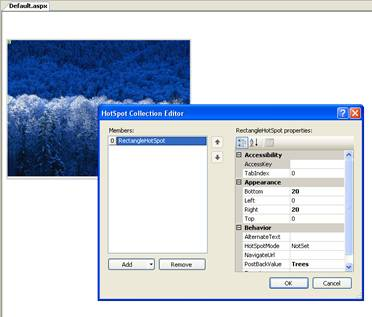
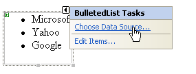
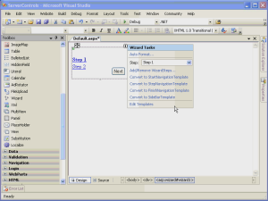

Server Controls
====================
by [Microsoft](https://github.com/microsoft)

> ASP.NET 2.0 enhances server controls in many ways. In this module, we'll cover some of the architectural changes to the way ASP.NET 2.0 and Visual Studio 2005 deals with server controls.

ASP.NET 2.0 enhances server controls in many ways. In this module, we'll cover some of the architectural changes to the way ASP.NET 2.0 and Visual Studio 2005 deals with server controls.

## View state

The primary change in view state in ASP.NET 2.0 is a dramatic reduction in size. Consider a page with only a Calendar control on it. Here is the view state in ASP.NET 1.1.

[!code-css[Main](server-controls/samples/sample1.css)]

Now here's the view state on an identical page in ASP.NET 2.0.

[!code-css[Main](server-controls/samples/sample2.css)]

That's a pretty significant change, and considering that view state is carried back and forth over the wire, this change can give developers a significant performance increase. The reduction in size of view state is largely due to the way that we handle it internally. Remember that view state is a Base64 encoded string. To better understand the change in view state in ASP.NET 2.0, let's have a look at the decoded values from the examples above.

Here is the 1.1 view state decoded:

[!code-css[Main](server-controls/samples/sample3.css)]

This may look a bit like gibberish, but there is a pattern here. In ASP.NET 1.x, we used single characters to identify data-types and delimited values using the &lt;&gt; characters. The "t" in the view state sample above represents a Triplet. The Triplet contains a pair of ArrayLists (the "l" represents an ArrayList.) One of those ArrayLists contains an Int32 ("i") with a value of 1 and the other contains another Triplet. The Triplet contains a pair of ArrayLists, etc. The important thing to remember is that we use Triplets that contain pairs, we identify the data-types via a letter, and we use the &lt; and &gt; characters as delimiters.

In ASP.NET 2.0, the decoded view state looks a bit different.

[!code-powershell[Main](server-controls/samples/sample4.ps1)]

You should notice a huge change in the appearance of the decoded view state. This change has several architectural underpinnings. View state in ASP.NET 1.x used the LosFormatter to serialize data. In 2.0, we use the new ObjectStateFormatter class. This class was specifically designed to aid in the serialization and deserialization of view state and control state. (Control state will be covered in the next section.) There are many benefits gained by changing the method by which serialization and deserialization take place. One of the most dramatic is the fact that unlike the LosFormatter which uses a TextWriter, the ObjectStateFormatter uses a BinaryWriter. This allows ASP.NET 2.0 to store view state a series of bytes instead of strings. Take, for example, an integer. In ASP.NET 1.1, an integer required 4 bytes of view state. In ASP.NET 2.0, that same integer only requires 1 byte. Other enhancements were made to decrease the amount of view state that is stored. DateTime values, for example, are now stored using a TickCount instead of a string.

As if all of that weren't enough, special attention was paid to the fact that one of the greatest consumers of view state in 1.x was the DataGrid and similar controls. A major drawback of controls such as the DataGrid where view state is concerned is that it often contains large amounts of repeated information. In ASP.NET 1.x, that repeated information was simply stored over and over again resulting in a bloated view state. In ASP.NET 2.0, we use the new IndexedString class to store such data. If a string repeats, we just store the token for the IndexedString and the index within a running table of IndexedString objects.

## Control State

One of the major gripes that developers had with view state was the size that it added to the HTTP payload. As previously mentioned, one of the greatest consumers of view state is the DataGrid control. To avoid the huge amounts of view state generated by a DataGrid, many developers simply disabled view state for that control. Unfortunately, that solution wasn't always a good one. View state in ASP.NET 1.x contains not only data necessary for the correct functionality of the control. It also contains information concerning the state of the control's UI. This means that if you want to allow for pagination on a DataGrid, you must enable view state even if you don't need all of the UI information that view state contains. It's an all-or-nothing scenario.

In ASP.NET 2.0, control state solves that problem nicely via the introduction of control state. Control state contains the data that is absolutely necessary for the proper functionality of a control. Unlike view state, control state cannot be disabled. Therefore, it is important that the data being stored in control state is carefully controlled.

> [!NOTE]
> Control state is persisted along with the view state in the \_\_VIEWSTATE hidden form field.

This video is a walkthrough of view state and control state.

[Open Full-Screen Video](server-controls/_static/state1.wmv)

In order for a server control to read and write to control state, you must take three steps.

## Step 1: Call the RegisterRequiresControlState Method

The RegisterRequiresControlState method informs ASP.NET that a control needs to persist control state. It takes one argument of type Control which is the control that is being registered.

It is important to note that registration does not persist from request to request. Therefore, this method must be called on every request if a control is to persist control state. It is recommended that the method be called in OnInit.

[!code-csharp[Main](server-controls/samples/sample5.cs)]

## Step 2: Override SaveControlState

The SaveControlState method saves control state changes for a control since the last post back. It returns an object representing the control's state.

## Step 3: Override LoadControlState

The LoadControlState method loads saved state into a control. The method takes one argument of type Object which holds the saved state for the control.

## Full XHTML Compliance

Any Web developer knows the importance of standards in Web applications. In order to maintain a standards-based development environment, ASP.NET 2.0 is fully XHTML compliant. Therefore, all tags are rendered according to XHTML standards in browsers that support HTML 4.0 or greater.

The DOCTYPE definition in ASP.NET 1.1 was as follows:

[!code-html[Main](server-controls/samples/sample6.html)]

In ASP.NET 2.0, the default DOCTYPE definition is as follows:

[!code-html[Main](server-controls/samples/sample7.html)]

If you choose, you can alter the default XHML compliance via the xhtmlConformance node in the configuration file. For example, the following node in the web.config file will change XHTML compliance to XHTML 1.0 Strict:

[!code-xml[Main](server-controls/samples/sample8.xml)]

If you choose, you can also configure ASP.NET to use the legacy configuration used in ASP.NET 1.x as follows:

[!code-xml[Main](server-controls/samples/sample9.xml)]

## Adaptive Rendering Using Adapters

In ASP.NET 1.x, the configuration file contained a &lt;browserCaps&gt; section that populated a HttpBrowserCapabilities object. This object allowed a developer to determine what device is making a particular request and render code appropriately. In ASP.NET 2.0, the model has improved and now uses the new ControlAdapter class. The ControlAdapter class overrides events in the control's lifecycle and controls the rendering of controls based upon the user agent's capabilities. The capabilities of a specific user agent are defined by a browser definition file (a file with a .browser file extension) stored in the c:\windows\microsoft.net\framework\v2.0.\*\*\*\*\CONFIG\Browsers folder.

> [!NOTE]
> The ControlAdapter class is an abstract class.

Much like the &lt;browserCaps&gt; section in 1.x, the browser definition file uses a Regular Expression to parse the user agent string in order to identify the requesting browser. It them defines particular capabilities for that user agent. The ControlAdapter renders the control via the Render method. Therefore, if you override the Render method, you should not call Render on the base class. Doing so may cause rendering to occur twice, once for the adapter and once for the control itself.

## Developing a Custom Adapter

You can develop your own custom adapter by inheriting from ControlAdapter. Additionally, you can inherit from the abstract class PageAdapter in cases where an adapter is needed for a page. Mapping of controls to your custom adapter is accomplished via the &lt;controlAdapters&gt; element in the browser definition file. For example, the following XML from a browser definition file maps the Menu control to the MenuAdapter class:

[!code-html[Main](server-controls/samples/sample10.html)]

Using this model, it becomes quite easy for a control developer to target a particular device or browser. It's also quite simple for a developer to have complete control over how pages render on every device.

## Per-Device Rendering

Server control properties in ASP.NET 2.0 can be specified per-device using a browser-specific prefix. For example, the code below will change the Text of a label depending upon which device is being used to browse the page.

[!code-aspx[Main](server-controls/samples/sample11.aspx)]

When the page containing this label is browsed from Internet Explorer, the label will display text saying "You are browsing from Internet Explorer." When the page is browsed from Firefox, the label will display the text "You are browsing from Firefox." When the page is browsed from any other device, it will display "You are browsing from an unknown device." Any property can be specified using this special syntax.

## Setting Focus

ASP.NET 1.x developers frequently asked about how to set initial focus on a particular control. For example, on a login page, it's useful to have the User ID textbox get the focus when the page first loads. In ASP.NET 1.x, doing this required writing some client-side script. Even though such a script is a trivial task, it's no longer necessary in ASP.NET 2.0 thanks to the SetFocus method. The SetFocus method takes one argument indicating the control that should receive focus. This argument can either be the client ID of the control as a string or the name of the Server control as a Control object. For example, to set the initial focus to a TextBox control called txtUserID when the page first loads, add the following code to Page\_Load:

[!code-csharp[Main](server-controls/samples/sample12.cs)]

-- or

[!code-csharp[Main](server-controls/samples/sample13.cs)]

ASP.NET 2.0 uses the Webresource.axd handler (discussed previously) to render a client-side function that sets the focus. The name of the client-side function is WebForm\_AutoFocus as shown here:

[!code-html[Main](server-controls/samples/sample14.html)]

Alternatively, you can use the Focus method for a control to set the initial focus to that control. The Focus method derives from the Control class and is available to all ASP.NET 2.0 controls. It is also possible to set focus to a particular control when a validation error occurs. That will be covered in a later module.

## New Server Controls in ASP.NET 2.0

The following are new server controls in ASP.NET 2.0. We will go into more detail on some of them in later modules.

## ImageMap Control

The ImageMap control allows you to add hotspots to an image that can initiate a post back or navigate to a URL. There are three types of hotspots available; CircleHotSpot, RectangleHotSpot, and PolygonHotSpot. Hotspots are added via a collection editor in Visual Studio or programmatically in code. There is no user-interface available for drawing hotspots on an image. The coordinates and size or radius of the hotspot must be specified declaratively. There is also no visual representation of a hotspot in the designer. If a hotspot is configured to navigate to a URL, the URL is specified via the NavigateUrl property of the hotspot. In the case of a post back hotspot, the PostBackValue property allows you to pass a string in the post back that can be retrieved in server-side code.

**Figure 1**: HotSpot Collection Editor in Visual Studio

## BulletedList Control

The BulletedList control is a bulleted list that can easily be data bound. The list can be ordered (numbered) or unordered via the BulletStyle property. Each item in the list is represented by a ListItem object.

**Figure 2**: BulletedList Control in Visual Studio

## HiddenField Control

The HiddenField control adds a hidden form field to your page, the value of which is available in server-side code. The value of a hidden form field is generally expected to remain unchanged between post backs. However, it is possible for a malicious user to change the value prior to post back. If this happens, the HiddenField control will raise the ValueChanged event. If you have sensitive information in the HiddenField control and you want to ensure that it remains unchanged, you should handle the ValueChanged event in your code.

## FileUpload Control

The FileUpload control in ASP.NET 2.0 makes it possible to upload files to a Web server via an ASP.NET page. This control is quite similar to the ASP.NET 1.x HtmlInputFile class with a few exceptions. In ASP.NET 1.x, it was recommended that the PostedFile property be checked for null in order to determine if you had a good file. The FileUpload control in ASP.NET 2.0 adds a new HasFile property that you can use for the same purpose and it's a bit more efficient.

The PostedFile property is still available for access to an HttpPostedFile object, but some of the functionality of the HttpPostedFile is now available intrinsically with the FileUpload control. For example, to save an uploaded file in ASP.NET 1.x, you call the SaveAs method on the HttpPostedFile object. Using the FileUpload control in ASP.NET 2.0, you would call the SaveAs method on the FileUpload control itself.

Another significant change in the 2.0 behavior (and likely the most significant change) is that it is no longer necessary to load an entire uploaded file into memory before saving it. In 1.x, any file that was uploaded is saved entirely into memory prior to being written to disk. This architecture prevents the upload of large files.

In ASP.NET 2.0, the requestLengthDiskThreshold attribute of the httpRuntime element allows you to configure how many Kilobytes are held in a buffer in memory prior to being written to disk.

**IMPORTANT**: MSDN documentation (and documentation elsewhere) specifies that this value is in bytes (not Kilobytes) and that the default is 256. The value is actually specified in Kilobytes and the default value is 80. By having a default value of 80K, we ensure that the buffer does not end up on the large object heap.

## Wizard Control

It is fairly common to encounter ASP.NET developers struggling with attempting to gather information in a series of "pages" using panels or by transferring from page to page. More often than not, the endeavor is a frustrating one and is time consuming. The new Wizard control solves the problems by allowing for linear and non-linear steps in a wizard interface that users are familiar with. The Wizard control presents input forms in a series of steps. Each step is of a particular type specified by the StepType property of the control. The available step types are as follows:

| **Step Type** | **Explanation** |
| --- | --- |
| Auto | The wizard automatically determines the type of step based upon its position within the step hierarchy. |
| Start | The first step, often used to present an introductory statement. |
| Step | A normal step. |
| Finish | The final step, usually used to present a button to finish the wizard. |
| Complete | Presents a message communicating success or failure. |

> [!NOTE]
> The Wizard control keeps track of its state using ASP.NET control state. Therefore, the EnableViewState property can be set to false without any detriment.

This video is a walkthrough of the Wizard control.

[Open Full-Screen Video](server-controls/_static/wizard1.wmv)

## Localize Control

The Localize control is similar to a Literal control. However, the Localize control has a **Mode** property that controls how markup that is added to it is rendered. The Mode property supports the following values:

| **Mode** | **Explanation** |
| --- | --- |
| Transform | Markup is transformed according to the protocol of the browser making the request. |
| PassThrough | Markup is rendered as-is. |
| Encode | Markup that is added to the control is encoded using HtmlEncode. |

## MultiView and View Controls

The MultiView control acts as a container for View controls, and the View control acts as a container (much like a Panel control) for other controls. Each view in a MultiView control is represented by a single View control. The first View control in the MultiView is view 0, the second is view 1, etc. You can switch views by specifying the ActiveViewIndex of the MultiView control.

## Substitution Control

The Substitution control is used in conjunction with ASP.NET caching. In cases where you want to take advantage of caching, but you have portions of a page that must be updated on each request (in other words, portions of a page that are exempt from caching), the Substitution component provides a great solution. The control doesn't actually render any output on its own. Instead, it is bound to a method in server-side code. When the page is requested, the method is called and the returned markup is rendered in place of the substitution control.

The method to which the Substitution control is bound is specified via the **MethodName** property. That method must meet the following criteria:

- It must be a static (shared in VB) method.
- It accepts one parameter of type HttpContext.
- It returns a string representing the markup that should replace the control on the page.

The Substitution control does not have the ability to modify any other control on the page, but it does have access to the current HttpContext via its parameter.

## GridView Control

The GridView control is the replacement for the DataGrid control. This control will be covered in more detail in a later module.

## DetailsView Control

The DetailsView control allows you to display a single record from a data source and to edit or delete it. It is covered in more detail in a later module.

## FormView Control

The FormView control is used to display a single record from a datasource in a configurable interface. It is covered in more detail in a later module.

## AccessDataSource Control

The AccessDataSource control is used to data bind an Access database. It is covered in more detail in a later module.

## ObjectDataSource Control

The ObjectDataSource control is used to support a three-tier architecture so that controls can be data-bound to a middle-tier business object as opposed to a two-tiered model where controls are bound directly to the data source. It will be discussed in more detail in a later module.

## XmlDataSource Control

The XmlDataSource control is used to data bind to an XML data source. It is covered in more detail in a later module.

## SiteMapDataSource Control

The SiteMapDataSource control provides data binding for site navigation controls based on a site map. It will be discussed in more detail in a later module.

## SiteMapPath Control

The SiteMapPath control displays a series of navigation links commonly referred to as breadcrumbs. It is covered in more detail in a later module.

## Menu Control

The Menu control displays dynamic menus using DHTML. It is covered in more detail in a later module.

## TreeView Control

The TreeView control is used to display a hierarchical tree view of data. It is covered in more detail in a later module.

## Login Control

The Login control provides for a mechanism to log into a Web site. It is covered in more detail in a later module.

## LoginView Control

The LoginView control allows for the display of different templates based upon a user's login status. It is covered in more detail in a later module.

## PasswordRecovery Control

The PasswordRecovery control is used to retrieve forgotten passwords by users of an ASP.NET application. It is covered in more detail in a later module.

## LoginStatus

The LoginStatus control displays a user's login status. It is covered in more detail in a later module.

## LoginName

The LoginName control displays a user's username after being logged into an ASP.NET application. It is covered in more detail in a later module.

## CreateUserWizard

The CreateUserWizard is a configurable wizard which gives users the ability to create an ASP.NET Membership account for use in an ASP.NET application. It is covered in more detail in a later module.

## ChangePassword

The ChangePassword control allows users to change their password for an ASP.NET application. It is covered in more detail in a later module.

## Various WebParts

ASP.NET 2.0 ships with various Web Parts. These will be covered in detail in a later module.