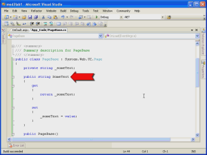
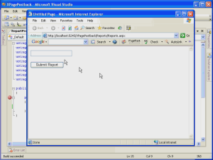
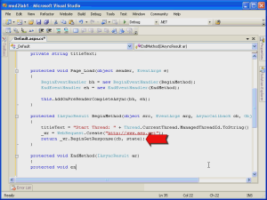
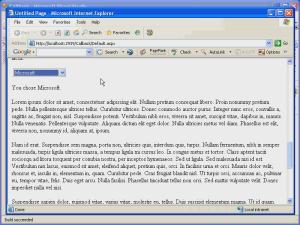

The ASP.NET 2.0 Page Model
====================
by [Microsoft](https://github.com/microsoft)

> In ASP.NET 1.x, developers had a choice between an inline code model and a code-behind code model. Code-behind could be implemented using either the Src attribute or the CodeBehind attribute of the @Page directive. In ASP.NET 2.0, developers still have a choice between inline code and code-behind, but there have been significant enhancements to the code-behind model.

In ASP.NET 1.x, developers had a choice between an inline code model and a code-behind code model. Code-behind could be implemented using either the Src attribute or the CodeBehind attribute of the @Page directive. In ASP.NET 2.0, developers still have a choice between inline code and code-behind, but there have been significant enhancements to the code-behind model.

## Improvements in the Code-Behind Model

In order to fully understand the changes in the code-behind model in ASP.NET 2.0, its best to quickly review the model as it existed in ASP.NET 1.x.

## The Code-Behind Model in ASP.NET 1.x

In ASP.NET 1.x, the code-behind model consisted of an ASPX file (the Webform) and a code-behind file containing programming code. The two files were connected using the @Page directive in the ASPX file. Each control on the ASPX page had a corresponding declaration in the code-behind file as an instance variable. The code-behind file also contained code for event binding and generated code necessary for the Visual Studio designer. This model worked fairly well, but because every ASP.NET element in the ASPX page required corresponding code in the code-behind file, there was no true separation of code and content. For example, if a designer added a new server control to an ASPX file outside of the Visual Studio IDE, the application would break due to the absence of a declaration for that control in the code-behind file.

## The Code-Behind Model in ASP.NET 2.0

ASP.NET 2.0 greatly improves upon this model. In ASP.NET 2.0, code-behind is implemented using the new *partial classes* provided in ASP.NET 2.0. The code-behind class in ASP.NET 2.0 is definied as a partial class meaning that it contains only part of the class definition. The remaining part of the class definition is dynamically generated by ASP.NET 2.0 using the ASPX page at runtime or when the Web site is precompiled. The link between the code-behind file and the ASPX page is still established using the @ Page directive. However, instead of a CodeBehind or Src attribute, ASP.NET 2.0 now uses the CodeFile attribute. The Inherits attribute is also used to specify the class name for the page.

A typical @ Page directive might look like this:

[!code-aspx[Main](the-asp-net-2-0-page-model/samples/sample1.aspx)]

A typical class definition in an ASP.NET 2.0 code-behind file might look like this:

[!code-csharp[Main](the-asp-net-2-0-page-model/samples/sample2.cs)]

> [!NOTE]
> C# and Visual Basic are the only managed languages that currently support partial classes. Therefore, developers using J# will not be able to use the code-behind model in ASP.NET 2.0.

The new model enhances the code-behind model because developers will now have code files that contain only the code that they have created. It also provides for a true separation of code and content because there are no instance variable declarations in the code-behind file.

> [!NOTE]
> Because the partial class for the ASPX page is where event binding takes place, Visual Basic developers can realize a slight performance increase by using the Handles keyword in code-behind to bind events. C# has no equivalent keyword.

## New @ Page Directive Attributes

ASP.NET 2.0 adds many new attributes to the @ Page directive. The following attributes are new in ASP.NET 2.0.

## Async

The Async attribute allows you to configure page to be executed asynchronously. Well cover asynchronous pages later in this module.

## AsyncTimeout

Specified the timeout for asynchronous pages. The default is 45 seconds.

## CodeFile

The CodeFile attribute is the replacement for the CodeBehind attribute in Visual Studio 2002/2003.

### CodeFileBaseClass

The CodeFileBaseClass attribute is used in cases where you want multiple pages to derive from a single base class. Because of the implementation of partial classes in ASP.NET, without this attribute, a base class that uses shared common fields to reference controls declared in an ASPX page would not work properly because ASP.NETs compilation engine will automatically create new members based on controls in the page. Therefore, if you want a common base class for two or more pages in ASP.NET, you will need to define specify your base class in the CodeFileBaseClass attribute and then derive each pages class from that base class. The CodeFile attribute is also required when this attribute is used.

## CompilationMode

This attribute allows you to set the CompilationMode property of the ASPX page. The CompilationMode property is an enumeration containing the values **Always**, **Auto**, and **Never**. The default is **Always**. The **Auto** setting will prevent ASP.NET from dynamically compiling the page if possible. Excluding pages from dynamic compilation increases performance. However, if a page that is excluded contains that code that must be compiled, an error will be thrown when the page is browsed.

## EnableEventValidation

This attribute specifies whether or not postback and callback events are validated. When this is enabled, arguments to postback or callback events are checked to ensure that they originated from the server control that originally rendered them.

## EnableTheming

This attribute specifies whether or not ASP.NET themes are used on a page. The default is **false**. ASP.NET themes are covered in [Module 10](profiles-themes-and-web-parts.md).

## LinePragmas

This attribute specifies whether line pragmas should be added during compilation. Line pragmas are options used by debuggers to mark specific sections of code.

## MaintainScrollPositionOnPostback

This attribute specifies whether or not JavaScript is injected into the page in order to maintain scroll position between postbacks. This attribute is **false** by default.

When this attribute is **true**, ASP.NET will add a &lt;script&gt; block on postback that looks like this:

[!code-html[Main](the-asp-net-2-0-page-model/samples/sample3.html)]

Note that the src for this script block is WebResource.axd. This resource is not a physical path. When this script is requested, ASP.NET dynamically builds the script.

### MasterPageFile

This attribute specifies the master page file for the current page. The path can be relative or absolute. Master pages are covered in [Module 4](master-pages.md).

## StyleSheetTheme

This attribute allows you to override user-interface appearance properties defined by an ASP.NET 2.0 theme. Themes are covered in [Module 10](profiles-themes-and-web-parts.md).

## Theme

Specifies the theme for the page. If a value is not specified for the StyleSheetTheme attribute, the Theme attribute overrides all styles applied to controls on the page.

## Title

Sets the title for the page. The value specified here will appear in the &lt;title&gt; element of the rendered page.

### ViewStateEncryptionMode

Sets the value for the ViewStateEncryptionMode enumeration. The available values are **Always**, **Auto**, and **Never**. The default value is **Auto**. When this attribute is set to a value of **Auto**, viewstate is encrypted is a control requests it by calling the **RegisterRequiresViewStateEncryption** method.

## Setting Public Property Values via the @ Page Directive

Another new capability of the @ Page directive in ASP.NET 2.0 is the ability to set the initial value of public properties of a base class. Suppose, for example, that you have a public property called **SomeText** in your base class and you d like it to be initialized to **Hello** when a page is loaded. You can accomplish this by simply setting the value in the @ Page directive like so:

[!code-aspx[Main](the-asp-net-2-0-page-model/samples/sample4.aspx)]

The **SomeText** attribute of the @ Page directive sets the initial value of the SomeText property in the base class to *Hello!*. The video below is a walkthrough of setting the initial value of a public property in a base class using the @ Page directive.

[Open Full-Screen Video](the-asp-net-2-0-page-model/_static/setprop1.wmv)

## New Public Properties of the Page Class

The following public properties are new in ASP.NET 2.0.

## AppRelativeTemplateSourceDirectory

Returns the application-relative path to the page or control. For example, for a page located at http://app/folder/page.aspx, the property returns ~/folder/.

## AppRelativeVirtualPath

Returns the relative virtual directory path to the page or control. For example for a page located at http://app/folder/page.aspx, the property returns ~/folder/page.aspx.

## AsyncTimeout

Gets or sets the timeout used for asynchronous page handling. (Asynchronous pages will be covered later in this module.)

## ClientQueryString

A read-only property that returns the query string portion of the requested URL. This value is URL encoded. You can use the UrlDecode method of the HttpServerUtility class to decode it.

## ClientScript

This property returns a ClientScriptManager object that can be used to manage ASP.NETs emission of client-side script. (The ClientScriptManager class is covered later in this module.)

## EnableEventValidation

This property controls whether or not event validation is enabled for postback and callback events. When enabled, arguments to postback or callback events are verified to ensure that they originated from the server control that originally rendered them.

## EnableTheming

This property gets or sets a Boolean that specifies whether or not an ASP.NET 2.0 theme applies to the page.

## Form

This property returns the HTML form on the ASPX page as an HtmlForm object.

## Header

This property returns a reference to an HtmlHead object that contains the page header. You can use the returned HtmlHead object to get/set style sheets, Meta tags, etc.

## IdSeparator

This read-only property gets the character that is used to separate control identifiers when ASP.NET is building a unique ID for controls on a page. It is not intended to be used directly from your code.

## IsAsync

This property allows for asynchronous pages. Asynchronous pages are discussed later in this module.

## IsCallback

This read-only property returns **true** if the page is the result of a call back. Call backs are discussed later in this module.

## IsCrossPagePostBack

This read-only property returns **true** if the page is part of a cross-page postback. Cross-page postbacks are covered later in this module.

## Items

Returns a reference to an IDictionary instance that contains all objects stored in the pages context. You can add items to this IDictionary object and they will be available to you throughout the lifetime of the context.

## MaintainScrollPositionOnPostBack

This property controls whether or not ASP.NET emits JavaScript that maintains the pages scroll position in the browser after a postback occurs. (Details of this property were discussed earlier in this module.)

## Master

This read-only property returns a reference to the MasterPage instance for a page to which a master page has been applied.

## MasterPageFile

Gets or sets the master page filename for the page. This property can only be set in the PreInit method.

## MaxPageStateFieldLength

This property gets or sets the maximum length for the pages state in bytes. If the property is set to a positive number, the pages view state will be broken up into multiple hidden fields so that it doesnt exceed the number of bytes specified. If the property is a negative number, the view state will not be broken into chunks.

## PageAdapter

Returns a reference to the PageAdapter object that modifies the page for the requesting browser.

## PreviousPage

Returns a reference to the previous page in cases of a Server.Transfer or a cross-page postback.

## SkinID

Specifies the ASP.NET 2.0 skin to apply to the page.

## StyleSheetTheme

This property gets or sets the style sheet that is applied to a page.

## TemplateControl

Returns a reference to the containing control for the page.

## Theme

Gets or sets the name of the ASP.NET 2.0 theme applied to the page. This value must be set prior to the PreInit method.

## Title

This property gets or sets the title for the page as obtained from the pages header.

## ViewStateEncryptionMode

Gets or sets the ViewStateEncryptionMode of the page. See a detailed discussion of this property earlier in this module.

## New Protected Properties of the Page Class

The following are the new protected properties of the Page class in ASP.NET 2.0.

## Adapter

Returns a reference to the ControlAdapter that renders the page on the device that requested it.

## AsyncMode

This property indicates whether or not the page is processed asynchronously. It is intended for use by the runtime and not directly in code.

## ClientIDSeparator

This property returns the character used as a separator when creating unique client IDs for controls. It is intended for use by the runtime and not directly in code.

## PageStatePersister

This property returns the PageStatePersister object for the page. This property is primarily used by ASP.NET control developers.

## UniqueFilePathSuffix

This property returns a unique suffic that is appended to the file path for caching browsers. The default value is \_\_ufps= and a 6-digit number.

## New Public Methods for the Page Class

The following public methods are new to the Page class in ASP.NET 2.0.

## AddOnPreRenderCompleteAsync

This method registers event handler delegates for asynchronous page execution. Asynchronous pages are discussed later in this module.

## ApplyStyleSheetSkin

Applies the properties in a pages style sheet to the page.

## ExecuteRegisteredAsyncTasks

This method beings an asynchronous task.

### GetValidators

Returns a collection of validators for the specified validation group or the default validation group if none is specified.

## RegisterAsyncTask

This method registers a new async task. Asynchronous pages are covered later in this module.

## RegisterRequiresControlState

This method tells ASP.NET that the pages control state must be persisted.

## RegisterRequiresViewStateEncryption

This method tells ASP.NET that the pages viewstate requires encryption.

## ResolveClientUrl

Returns a relative URL that can be used for client requests for images, etc.

## SetFocus

This method will set the focus to the control that is specified when the page is initially loaded.

## UnregisterRequiresControlState

This method will unregister the control that is passed to it as no longer requiring control state persistence.

## Changes to the Page Lifecycle

The page lifecycle in ASP.NET 2.0 hasnt changed dramatically, but there are some new methods that you should be aware of. The ASP.NET 2.0 page lifecycle is outlined below.

## PreInit (New in ASP.NET 2.0)

The PreInit event is the earliest stage in the lifecycle that a developer can access. The addition of this event makes it possible to programmatically change ASP.NET 2.0 themes, master pages, access properties for an ASP.NET 2.0 profile, etc. If you are in a postback state, its important to realize that Viewstate has not yet been applied to controls at this point in the lifecycle. Therefore, if a developer changes a property of a control at this stage, it will likely be overwritten later in the pages lifecycle.

## Init

The Init event has not changed from ASP.NET 1.x. This is where you would want to read or initialize properties of controls on your page. At this stage, master pages, themes, etc. are already applied to the page.

## InitComplete (New in 2.0)

The InitComplete event is called at the end of the pages initialization stage. At this point in the lifecycle, you can access controls on the page, but their state has not yet been populated.

## PreLoad (New in 2.0)

This event is called after all postback data has been applied and just prior to Page\_Load.

## Load

The Load event has not changed from ASP.NET 1.x.

## LoadComplete (New in 2.0)

The LoadComplete event is the last event in the pages load stage. At this stage, all postback and viewstate data has been applied to the page.

## PreRender

If you would like for viewstate to be properly maintained for controls that are added to the page dynamically, the PreRender event is the last opportunity to add them.

## PreRenderComplete (New in 2.0)

At the PreRenderComplete stage, all controls have been added to the page and the page is ready to be rendered. The PreRenderComplete event is the last event raised before the pages viewstate is saved.

## SaveStateComplete (New in 2.0)

The SaveStateComplete event is called immediately after all page viewstate and control state has been saved. This is the last event before the page is actually rendered to the browser.

## Render

The Render method has not changed since ASP.NET 1.x. This is where the HtmlTextWriter is initialized and the page is rendered to the browser.

## Cross-Page Postback in ASP.NET 2.0

In ASP.NET 1.x, postbacks were required to post to the same page. Cross-page postbacks were not allowed. ASP.NET 2.0 adds the ability to post back to a different page via the IButtonControl interface. Any control that implements the new IButtonControl interface (Button, LinkButton, and ImageButton in addition to third-party custom controls) can take advantage of this new functionality via the use of the PostBackUrl attribute. The following code shows a Button control that posts back to a second page.

[!code-aspx[Main](the-asp-net-2-0-page-model/samples/sample5.aspx)]

When the page is posted back, the Page that initiates the postback is accessible via the PreviousPage property on the second page. This functionality is implemented via the new WebForm\_DoPostBackWithOptions client-side function that ASP.NET 2.0 renders to the page when a control posts back to a different page. This JavaScript function is provided by the new WebResource.axd handler which emits script to the client.

The video below is a walkthrough of a cross-page postback.

[Open Full-Screen Video](the-asp-net-2-0-page-model/_static/xpage1.wmv)

## More Details on Cross-Page Postbacks

### Viewstate

You may have asked yourself already about what happens to the viewstate from the first page in a cross-page postback scenario. After all, any control that does not implement IPostBackDataHandler will persist its state via viewstate, so to have access to the properties of that control on the second page of a cross-page postback, you must have access to the viewstate for the page. ASP.NET 2.0 takes care of this scenario using a new hidden field in the second page called \_\_PREVIOUSPAGE. The \_\_PREVIOUSPAGE form field contains the viewstate for the first page so that you can have access to the properties of all controls in the second page.

### Circumventing FindControl

In the video walkthrough of a cross-page postback, I used the FindControl method to get a reference to the TextBox control on the first page. That method works well for that purpose, but FindControl is expensive and it requires writing additional code. Fortunately, ASP.NET 2.0 provides an alternative to FindControl for this purpose that will work in many scenarios. The PreviousPageType directive allows you to have a strongly-typed reference to the previous page by using either the TypeName or the VirtualPath attribute. The TypeName attribute allows you to specify the type of the previous page while the VirtualPath attribute allows you to refer to the previous page using a virtual path. After you've set the PreviousPageType directive, you must then expose the controls, etc. to which you want to allow access using public properties.

## Lab 1 Cross-Page Postback

In this lab, you will create an application that uses the new cross-page postback functionality of ASP.NET 2.0.

1. Open Visual Studio 2005 and create a new ASP.NET Web site.
2. Add a new Webform called page2.aspx.
3. Open the Default.aspx in Design view and add a Button control and a TextBox control. 

    1. Give the Button control an ID of **SubmitButton** and the TextBox control an ID of **UserName**.
    2. Set the PostBackUrl property of the Button to page2.aspx.
4. Open page2.aspx in Source view.
5. Add a @ PreviousPageType directive as shown below:
6. Add the following code to the Page\_Load of page2.aspx's code-behind: 

    [!code-csharp[Main](the-asp-net-2-0-page-model/samples/sample6.cs)]
7. Build the project by clicking on Build on the Build menu.
8. Add the following code to the code-behind for Default.aspx: 

    [!code-csharp[Main](the-asp-net-2-0-page-model/samples/sample7.cs)]
9. Change the Page\_Load in page2.aspx to the following: 

    [!code-csharp[Main](the-asp-net-2-0-page-model/samples/sample8.cs)]
10. Build the project.
11. Run the project.
12. Enter your name in the TextBox and click the button.
13. What is the result?

## Asynchronous Pages in ASP.NET 2.0

Many contention problems in ASP.NET are caused by latency of external calls (such as Web service or database calls), file IO latency, etc. When a request is made against an ASP.NET application, ASP.NET uses one of its worker threads to service that request. That request owns that thread until the request is complete and the response has been sent. ASP.NET 2.0 seeks to resolve latency issues with these types of issues by adding the capability to execute pages asynchronously. That means that a worker thread can start the request and then hand off additional execution to another thread, thereby returning to the available thread pool quickly. When the file IO, database call, etc. has completed, a new thread is obtained from the thread pool to finish the request.

The first step in making a page execute asynchronously is to set the **Async** attribute of the page directive like so:

[!code-aspx[Main](the-asp-net-2-0-page-model/samples/sample9.aspx)]

This attribute tells ASP.NET to implement the IHttpAsyncHandler for the page.

The next step is to call the AddOnPreRenderCompleteAsync method at a point in the lifecycle of the page prior to PreRender. (This method is typically called in Page\_Load.) The AddOnPreRenderCompleteAsync method takes two parameters; a BeginEventHandler and an EndEventHandler. The BeginEventHandler returns an IAsyncResult which is then passed as a parameter to the EndEventHandler.

The video below is a walkthrough of an asynchronous page request.

[Open Full-Screen Video](the-asp-net-2-0-page-model/_static/async1.wmv)

> [!NOTE]
> An async page does not render to the browser until the EndEventHandler has completed. No doubt but that some developers will think of async requests as being similar to async callbacks. It's important to realize that they are not. The benefit to asynchronous requests is that the first worker thread can be returned to the thread pool to service new requests, thereby reducing contention due to being IO bound, etc.

## Script Callbacks in ASP.NET 2.0

Web developers have always looked for ways to prevent the flickering associated with a callback. In ASP.NET 1.x, SmartNavigation was the most common method for avoiding flickering, but SmartNavigation caused problems for some developers because of the complexity of its implementation on the client. ASP.NET 2.0 addresses this issue with script callbacks. Script callbacks utilize XMLHttp to make requests against the Web server via JavaScript. The XMLHttp request returns XML data that can then be manipulated via the browser's DOM. XMLHttp code is hidden from the user by the new WebResource.axd handler.

There are several steps that are necessary in order to configure a script callback in ASP.NET 2.0.

## Step 1 : Implement the ICallbackEventHandler Interface

In order for ASP.NET to recognize your page as participating in a script callback, you must implement the ICallbackEventHandler interface. You can do this in your code-behind file like so:

[!code-csharp[Main](the-asp-net-2-0-page-model/samples/sample10.cs)]

You can also do this using the @ Implements directive like so:

[!code-aspx[Main](the-asp-net-2-0-page-model/samples/sample11.aspx)]

You would typically use the @ Implements directive when using inline ASP.NET code.

## Step 2 : Call GetCallbackEventReference

As mentioned previously, the XMLHttp call is encapsulated in the WebResource.axd handler. When your page is rendered, ASP.NET will add a call to WebForm\_DoCallback, a client script that is provided by WebResource.axd. The WebForm\_DoCallback function replaces the \_\_doPostBack function for a callback. Remember that \_\_doPostBack programmatically submits the form on the page. In a callback scenario, you want to prevent a postback, so \_\_doPostBack will not suffice.

> [!NOTE]
> \_\_doPostBack is still rendered to the page in a client script callback scenario. However, it's not used for the callback.

The arguments for the WebForm\_DoCallback client-side function are provided via the server-side function GetCallbackEventReference which would normally be called in Page\_Load. A typical call to GetCallbackEventReference might look like this:

[!code-csharp[Main](the-asp-net-2-0-page-model/samples/sample12.cs)]

> [!NOTE]
> In this case, cm is an instance of ClientScriptManager. The ClientScriptManager class will be covered later in this module.

There are several overloaded versions of GetCallbackEventReference. In this case, the arguments are as follows:

`this`

A reference to the control where GetCallbackEventReference is being called. In this case, it's the page itself.

[!code-javascript[Main](the-asp-net-2-0-page-model/samples/sample13.js)]

A string argument that will be passed from the client-side code to the server-side event. In this case, Im passing the value of a dropdown called ddlCompany.

`ShowCompanyName`

The name of the client-side function that will accept the return value (as string) from the server-side callback event. This function will only be called when the server-side callback is successful. Therefore, for the sake of robustness, it is generally recommended to use the overloaded version of GetCallbackEventReference that takes an additional string argument specifying the name of a client-side function to execute in the event of an error.

`null`

A string representing a client-side function that it initiated before the callback to the server. In this case, there is no such script, so the argument is null.

`true`

A Boolean specifying whether or not to conduct the callback asynchronously.

The call to WebForm\_DoCallback on the client will pass these arguments. Therefore, when this page is rendered on the client, that code will look like so:

[!code-javascript[Main](the-asp-net-2-0-page-model/samples/sample14.js)]

Notice that the signature of the function on the client is a bit different. The client-side function passes 5 strings and a Boolean. The additional string (which is null in the above example) contains the client-side function that will handle any errors from the server-side callback.

## Step 3 : Hook the Client-Side Control Event

Notice that the return value of GetCallbackEventReference above was assigned to a string variable. That string is used to hook a client-side event for the control that initiates the callback. In this example, the callback is initiated by a dropdown on the page, so I want to hook the *OnChange* event.

To hook the client-side event, simply add a handler to the client-side markup as follows:

[!code-csharp[Main](the-asp-net-2-0-page-model/samples/sample15.cs)]

Recall that *cbRef* is the return value from the call to GetCallbackEventReference. It contains the call to WebForm\_DoCallback that was shown above.

## Step 4 : Register the Client-Side Script

Recall that the call to GetCallbackEventReference specified that a client-side script called **ShowCompanyName** would be executed when the server-side callback succeeds. That script needs to be added to the page using a ClientScriptManager instance. (The ClientScriptManager class will be dicussed later in this module.) You do that like so:

[!code-javascript[Main](the-asp-net-2-0-page-model/samples/sample16.js)]

## Step 5 : Call the Methods of the ICallbackEventHandler Interface

The ICallbackEventHandler contains two methods that you need to implement in your code. They are **RaiseCallbackEvent** and **GetCallbackEvent**.

**RaiseCallbackEvent** takes a string as an argument and returns nothing. The string argument is passed from the client-side call to WebForm\_DoCallback. In this case, that value is the *value* attribute of the dropdown called ddlCompany. Your server-side code should be placed in the RaiseCallbackEvent method. For example, if your callback is making a WebRequest against an external resource, that code should be placed in RaiseCallbackEvent.

**GetCallbackEvent** is responsible for processing the return of the callback to the client. It takes no arguments and returns a string. The string that it returns will be passed as an argument to the client-side function, in this case *ShowCompanyName*.

Once you have completed the above steps, you are ready to perform a script callback in ASP.NET 2.0.

[Open Full-Screen Video](the-asp-net-2-0-page-model/_static/callback1.wmv)

Script callbacks in ASP.NET are supported in any browser that supports making XMLHttp calls. That includes all of the modern browsers in use today. Internet Explorer uses the XMLHttp ActiveX object while other modern browsers (including the upcoming IE 7) use an intrinsic XMLHttp object. To programmatically determine if a browser supports callbacks, you can use the **Request.Browser.SupportCallback** property. This property will return **true** if the requesting client supports script callbacks.

## Working with Client Script in ASP.NET 2.0

Client scripts in ASP.NET 2.0 are managed via the use of the ClientScriptManager class. The ClientScriptManager class keeps track of client scripts using a type and a name. This prevents the same script from being programmatically inserted on a page more than once.

> [!NOTE]
> After a script has been successfully registered on a page, any subsequent attempt to register the same script will simply result in the script not being registered a second time. No duplicate scripts are added and no exception occurs. To avoid unnecessary computation, there are methods that you can use to determine if a script is already registered so that you do not attempt to register it more than once.

The methods of the ClientScriptManager should be familiar to all current ASP.NET developers:

## RegisterClientScriptBlock

This method adds a script to the top of the rendered page. This is useful for adding functions that will be explicitly called on the client.

There are two overloaded versions of this method. Three of four arguments are common among them. They are:

`type (string)`

The ***type*** argument identifies a type for the script. It is generally a good idea to use the page's type (this.GetType()) for the type.

`key (string)`

The ***key*** argument is a user-defined key for the script. This should be unique for each script. If you attempt to add a script with the same key and type of an already added script, it will not be added.

`script (string)`

The ***script*** argument is a string containing the actual script to add. It's recommended that you use a StringBuilder to create the script and then use the ToString() method on the StringBuilder to assign the ***script*** argument.

If you use the overloaded RegisterClientScriptBlock that only takes three arguments, you must include script elements (&lt;script&gt; and &lt;/script&gt;) in your script.

You may choose to use the overload of RegisterClientScriptBlock that takes a fourth argument. The fourth argument is a Boolean that specifies whether or not ASP.NET should add script elements for you. If this argument is **true**, your script should not include the script elements explicitly.

Use the IsClientScriptBlockRegistered method to determine if a script has already been registered. This allows you to avoid an attempt to re-register a script that has already been registered.

### RegisterClientScriptInclude (New in 2.0)

The RegisterClientScriptInclude tag creates a script block that links to an external script file. It has two overloads. One takes a key and a URL. The second adds a third argument specifying the type.

For example, the following code generates a script block that links to jsfunctions.js in the root of the scripts folder of the application:

[!code-csharp[Main](the-asp-net-2-0-page-model/samples/sample17.cs)]

This code produces the following code in the rendered page:

[!code-html[Main](the-asp-net-2-0-page-model/samples/sample18.html)]

> [!NOTE]
> The script block is rendered at the bottom of the page.

Use the IsClientScriptIncludeRegistered method to determine if a script has already been registered. This allows you to avoid an attempt to re-register a script.

## RegisterStartupScript

The RegisterStartupScript method takes the same arguments as the RegisterClientScriptBlock method. A script registered with RegisterStartupScript executes after the page loads but before the OnLoad client-side event. In 1.X, scripts registered with RegisterStartupScript were placed just before the closing &lt;/form&gt; tag while scripts registered with RegisterClientScriptBlock were placed immediately after the opening &lt;form&gt; tag. In ASP.NET 2.0, both are placed immediately before the closing &lt;/form&gt; tag.

> [!NOTE]
> If you register a function with RegisterStartupScript, that function will not execute until you explicitly call it in client-side code.

Use the IsStartupScriptRegistered method to determine if a script has already been registered and avoid an attempt to re-register a script.

## Other ClientScriptManager Methods

Here are some of the other useful methods of the ClientScriptManager class.

| **GetCallbackEventReference** | See script callbacks earlier in this module. |
| --- | --- |
| **GetPostBackClientHyperlink** | Gets a JavaScript reference (javascript:&lt;call&gt;) that can be used to post back from a client-side event. |
| **GetPostBackEventReference** | Gets a string that can be used to initiate a post back from the client. |
| **GetWebResourceUrl** | Returns a URL to a resource that is embedded in an assembly. Must be used in conjunction with **RegisterClientScriptResource**. |
| **RegisterClientScriptResource** | Registers a Web resource with the page. These are resources embedded in an assembly and handled by the new WebResource.axd handler. |
| **RegisterHiddenField** | Registers a hidden form field with the page. |
| **RegisterOnSubmitStatement** | Registers client-side code that executes when the HTML form is submitted. |